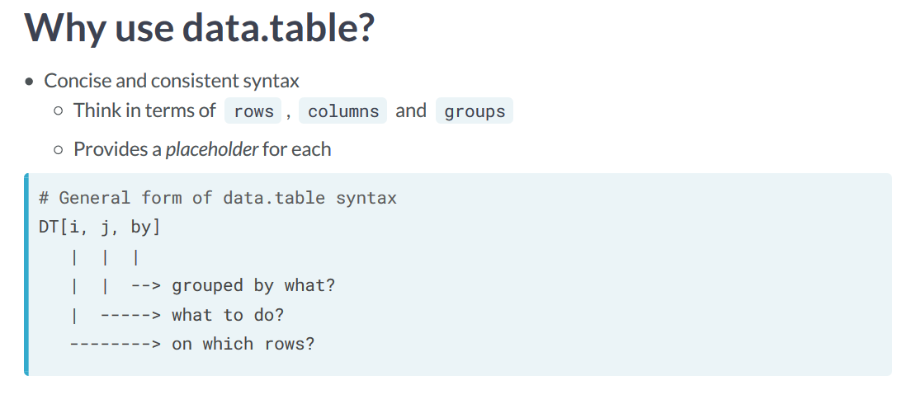

# (PART) Exploring and Wrangling {-}    


# data.table {#data-table}  

All C++ code chunks will be combined to the chunk below:
First we include the header `Rcpp.h`:

```{Rcpp, eval=FALSE}
#include <Rcpp.h>
```

Then we define a function:

```{Rcpp, eval=FALSE}
// [[Rcpp::export]]
int timesTwo(int x) {
  return x * 2;
}
```

**data.table**[@R-data.table]

https://rdatatable.gitlab.io/data.table/  

https://m-clark.github.io/data-processing-and-visualization/data_table.html   

<center>
```{r, echo = FALSE}

```
</center>

```{r}
library(data.table)
```


```{r}
mtcars_dt <- as.data.table(mtcars) 
mtcars_dt
```

```{r}
class(mtcars_dt)
```


## 基本使用 {#data-table-basics}


## dtplyr  

https://dtplyr.tidyverse.org/  


## maditr  

https://github.com/gdemin/maditr  


## tidyfast  

https://github.com/TysonStanley/tidyfast  

## disk.frame  

https://diskframe.com/  

https://www.youtube.com/watch?v=3XMTyi_H4q4


