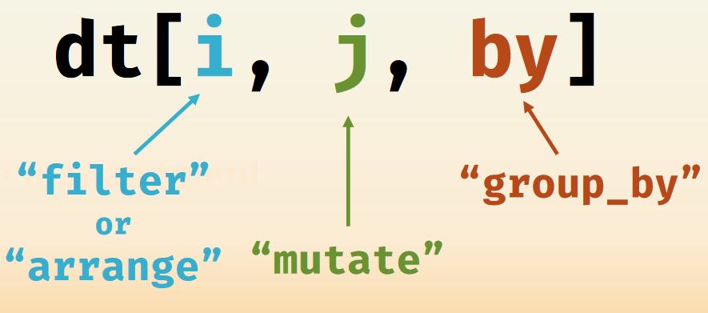
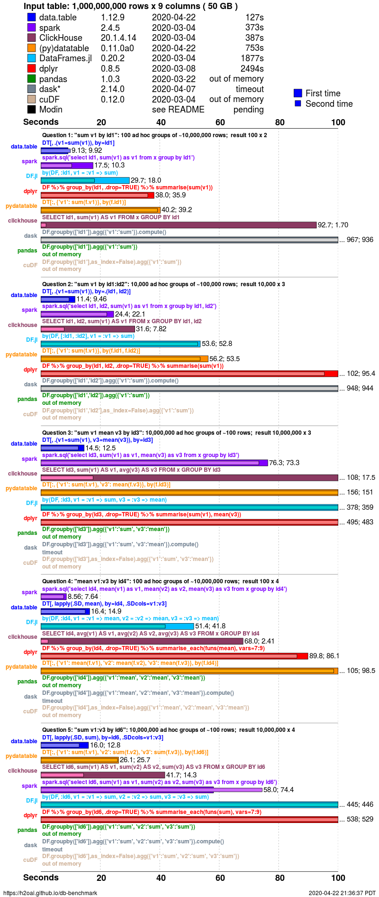

   


# Introduction to `data.table`

https://m-clark.github.io/data-processing-and-visualization/data_table.html   

[`data.table`](https://rdatatable.gitlab.io/data.table/) [@R-data.table] provides a high-performance version of base R's data.frame with syntax and feature enhancements for ease of use, convenience and programming speed.   

But why bother learning another data wrangling package/syntax, if we already have `dplyr` centered way of doing the same thing? Well, creators of `data.table` may provide several motivations.    

___
**Concise syntax**  

`dplyr`'s design philosophy is to provide Enlgish-like verbs that do one thing at a time and to it well, so it is very user-friendly to new R users or non-programmers. But this requires more steps and code. The following chunks do the same thing in `dplyr` and `data.table` respectively

```{r}
library(dplyr)
library(data.table)


starwars %>% 
  filter(species == "Human") %>% 
  group_by(homeworld) %>% 
  summarise(mean_height = mean(height))


starwars_dt <- as.data.table(starwars)
starwars_dt[species == "Human", .(mean_height = mean(height)), by = homeworld]
```

When using `data.table` for data.manipulation, think in terms of 
```{r, echo = FALSE, fig.cap = "Taken from https://tysonbarrett.com/assets/rstudio_conf_2020/Barrett_rstudioconf_2020.pdf"}

```

Syntax in `data.table` has grown organically based on data.frame extract method. One of the very first package description from 2008 (v1.1) states:

> "Like a data.frame but i and j may be expressions evaluated within the frame. i is then like base::with and j like select in base::subset. When i is itself a data.table, a join is invoked similar to base::merge."

Basically plugs base R `with` and `subset` into `[.data.frame`, plus extra `merge`. Over the years it added tons of other features.
___
**`data.table` is amazingly fast**
h2o.ai has a benmark comparing various database-like tools at https://h2oai.github.io/db-benchmark/, including dplyr, pandas, spark, etc. 

```{r, echo = FALSE, fig.cap = "https://h2oai.github.io/db-benchmark/"}

```

Without digging into the implementation detials of `data.table`'s speed, it is worth remembering that this package is built upon high performance. Hadley once commented: 

> I think it’s a relentless focus on performance across the entire package.

___
**Memory efficient**
Measuring and comparing memory use is beyond my capability, but it may be helpful to know that `data.table` implmenets low-level parallelism: many common operations are internally parallelized to use multiple CPU threads.  


___
**Rich features with no dependencies**

As we will see, the `data.table` package itself is equipped with rich features providing comprehensive solutions to commono data wrangling problems. And it does it with no dependencies other than base R, this simplifies production and maintenance.  


## Basics


