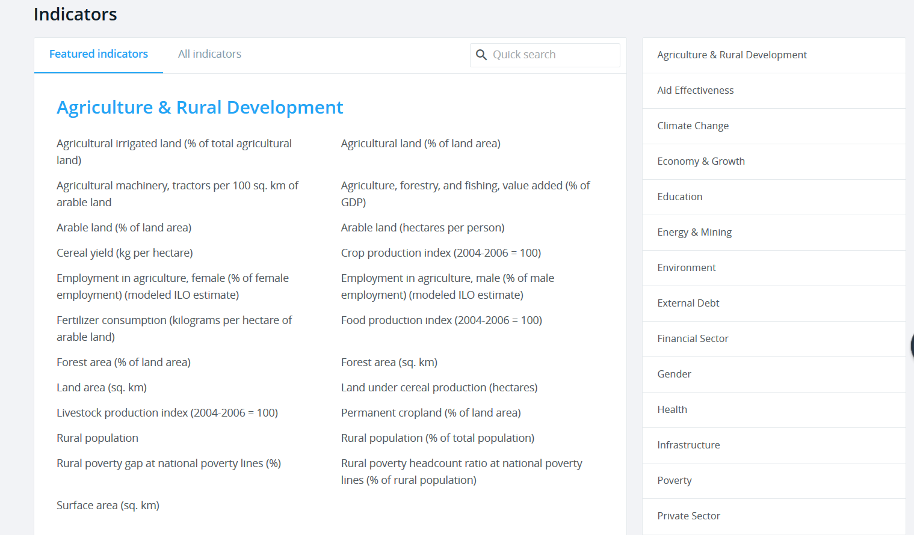
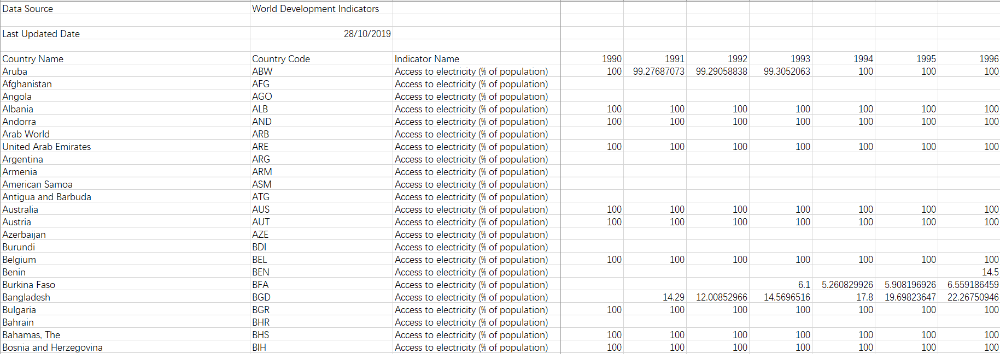

# Useful APIs

## WDI


```r
# install.packages("WDI")
library(WDI)
```

[World Devevlopment Indicators](http://datatopics.worldbank.org/world-development-indicators/)(WDI)是世界银行提供的公开、高质量数据库。指标首先按照领域分类，除了一般常见的统计数据外，还包括农业、气候、贫穷、健康方面的数据。

<div class="figure" style="text-align: center">

<p class="caption">(\#fig:unnamed-chunk-3)Indicators divided by sectors</p>
</div>

具体到某领域内，每个数据集都是各个国家在某个指标上的时间序列，时效性一般在两年之内。下面是气候变化分类中电力覆盖率指标(Access to electricity)的一个例子： 


```r

```


数据库中包含了超过 1600 个这样的时间序列，很多有效跨度超过了 50 年。**WDI**[@R-WDI] 包提供了在 WDI 数据库中搜索、提取、格式化信息的接口。  


### `WDIsearch()`  

`WDIserach()` 用于在 WDI 数据库中搜索可用的指标，是之后用 `WDI()` 提取相关数据的基础。  

```r
WDIsearch(string = "gdp", field = "name", short = TRUE,
  cache = NULL)
```

* `string = "gdp"`: 用于搜索的正则表达式  
* `field`= "name": 搜索域，可选 “indicator”（编码）、“name”（名称）、“discription”（详细描述）、“sourceDatabase” 和 “sourceOrganization” （来源数据库或组织）  
* `short = TRUE`：`WDIsearch()`默认只返回匹配指标的编码和名称，`short = FSLE` 同时返回详细描述和来源


如在名称域内中搜索与二氧化碳相关的指标：  


```r
# the result of WDIsearch() is a 2D matrix
WDIsearch("CO2", short = F) %>% 
  as_tibble() 
#> # A tibble: 45 x 5
#>   indicator   name       description       sourceDatabase  sourceOrganization   
#>   <chr>       <chr>      <chr>             <chr>           <chr>                
#> 1 EN.ATM.CO2~ "CO2 emis~ "Carbon dioxide ~ World Developm~ "Carbon Dioxide Info~
#> 2 EN.ATM.CO2~ "CO2 emis~ "Carbon dioxide ~ World Developm~ "Carbon Dioxide Info~
#> 3 EN.ATM.CO2~ "CO2 emis~ "Carbon dioxide ~ World Developm~ "Carbon Dioxide Info~
#> 4 EN.ATM.CO2~ "CO2 emis~ "Carbon dioxide ~ World Developm~ "Carbon Dioxide Info~
#> 5 EN.ATM.CO2~ "CO2 emis~ "Carbon dioxide ~ World Developm~ "Carbon Dioxide Info~
#> 6 EN.ATM.CO2~ "CO2 emis~ ""                WDI Database A~ ""                   
#> # ... with 39 more rows
```


改变搜索域： 


```r
WDIsearch(string = "mortality", field = "description", short = F) %>%
  as_tibble()
#> # A tibble: 383 x 5
#>   indicator  name         description      sourceDatabase  sourceOrganization   
#>   <chr>      <chr>        <chr>            <chr>           <chr>                
#> 1 5.51.01.0~ Maternal he~ Births attended~ Statistical Ca~ World Development In~
#> 2 5.51.01.0~ Immunization The proportion ~ Statistical Ca~ World Development In~
#> 3 5.51.01.0~ Child morta~ Under-five mort~ Statistical Ca~ World Development In~
#> 4 PRJ.POP.1~ Wittgenstei~ Total populatio~ Education Stat~ Wittgenstein Centre ~
#> 5 PRJ.POP.1~ Wittgenstei~ Total populatio~ Education Stat~ Wittgenstein Centre ~
#> 6 PRJ.POP.1~ Wittgenstei~ Total populatio~ Education Stat~ Wittgenstein Centre ~
#> # ... with 377 more rows
```

`WDIsearch()` 中的正则表达式背后用 base R 中的 `grep()` 实现，所以**无视大小写**。  

搜索人均不变价 GDP ：


```r
WDIsearch(string = 'gdp.*capita.*constant') %>% 
  as_tibble()
#> # A tibble: 5 x 2
#>   indicator            name                                                  
#>   <chr>                <chr>                                                 
#> 1 6.0.GDPpc_constant   "GDP per capita, PPP (constant 2011 international $) "
#> 2 NY.GDP.PCAP.PP.KD.87 "GDP per capita, PPP (constant 1987 international $)" 
#> 3 NY.GDP.PCAP.PP.KD    "GDP per capita, PPP (constant 2011 international $)" 
#> 4 NY.GDP.PCAP.KN       "GDP per capita (constant LCU)"                       
#> 5 NY.GDP.PCAP.KD       "GDP per capita (constant 2010 US$)"
```


### `WDI`  

`WDIsearch()` 得到了指标的**编码**之后，就可以用 `WDI()` 下载相关数据：  

```r
WDI(country = "all", indicator = "NY.GNS.ICTR.GN.ZS", start = NULL,
  end = NULL, extra = FALSE, cache = NULL)
```  

* `country`:  筛选国家或地区。使用 “ISO 3166-1” 两位字母编码，具体可见 `mapdata::iso3166`。（中国 CN, 美国 US，德国 DE，日本 JP，英国 GB）
* `indicator`: 指标的编码。具名向量可以在重命名该指标  
* `start` 和 `end`：时间序列的起始和结束。默认为 1950 年和今年  
* `extra = FALSE`： 若 `extra = RTUE`，返回首都经纬度、地区、收入水平等更多信息  


```r
WDI(indicator = "5.51.01.03.mortal", country = c("US", "CN"),
    start = 2005,
    end = 2015) %>% 
  as_tibble() 
#> # A tibble: 11 x 4
#>   iso2c country `5.51.01.03.mortal`  year
#>   <chr> <chr>                 <dbl> <int>
#> 1 CN    China                     1  2015
#> 2 CN    China                     1  2014
#> 3 CN    China                     1  2013
#> 4 CN    China                     1  2012
#> 5 CN    China                     1  2011
#> 6 CN    China                     1  2010
#> # ... with 5 more rows

# renaming and extra = TRUE
WDI(indicator = c(child_motality = "5.51.01.03.mortal"),  country = c("US", "CN"),
    start = 2005,
    end = 2015,
    extra = TRUE) %>% 
  as_tibble() 
#> # A tibble: 11 x 11
#>   iso2c country child_motality  year iso3c region capital longitude latitude
#>   <chr> <chr>            <dbl> <int> <fct> <fct>  <fct>   <fct>     <fct>   
#> 1 CN    China                1  2015 CHN   East ~ Beijing 116.286   40.0495 
#> 2 CN    China                1  2014 CHN   East ~ Beijing 116.286   40.0495 
#> 3 CN    China                1  2013 CHN   East ~ Beijing 116.286   40.0495 
#> 4 CN    China                1  2012 CHN   East ~ Beijing 116.286   40.0495 
#> 5 CN    China                1  2011 CHN   East ~ Beijing 116.286   40.0495 
#> 6 CN    China                1  2010 CHN   East ~ Beijing 116.286   40.0495 
#> # ... with 5 more rows, and 2 more variables: income <fct>, lending <fct>
```

## ipumsr  

IPUMS provides census and survey data from around the world integrated across time and space. IPUMS integration and documentation makes it easy to study change, conduct comparative research, merge information across data types, and analyze individuals within family and community contexts. Data and services available free of charge.  

https://github.com/mnpopcenter/ipumsr  


```r
# install.packages("ipumsr")
```

