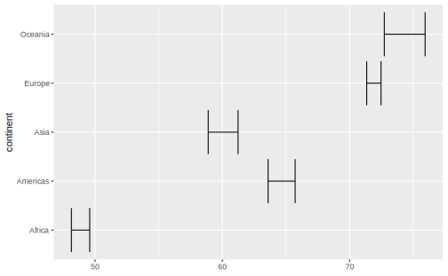
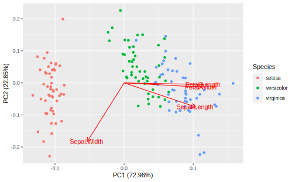
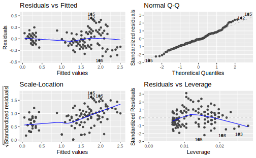

# broom: Tidy representation of models


```r
library(broom)
```

https://broom.tidyverse.org/index.html  

broom and updated dplyr  https://broom.tidyverse.org/articles/broom_and_dplyr.html  


## Visualizing many models  {#viz-many-models}


```r
gapminder <- gapminder::gapminder
gapminder %>% 
  group_by(continent) %>% 
  summarize(t_test = list(t.test(lifeExp))) %>% 
  mutate(tidied = map(t_test, broom::tidy)) %>%
  unnest(tidied) %>% 
  ggplot() + 
  geom_errorbarh(aes(xmin = conf.low,
                    xmax = conf.high,
                    y = continent))
```




## Examples 

### PCA  

An excellent answer on tidyverse solutions to PCA: https://community.rstudio.com/t/tidyverse-solutions-for-factor-analysis-principal-component-analysis/4504


```r
library(ggfortify) # for plotting pca

iris_pca <- iris %>% 
  nest() %>% 
  mutate(pca = map(data, ~ prcomp(.x %>% select(-Species), 
                                  center = TRUE, 
                                  scale = TRUE)), 
         pca_tidy = map2(pca, data, ~ broom::augment(.x, data = .y)))

iris_pca
#> # A tibble: 1 x 3
#>   data               pca      pca_tidy           
#>   <list>             <list>   <list>             
#> 1 <tibble [150 x 5]> <prcomp> <tibble [150 x 10]>
```


```r
iris_pca %>%
  unnest(pca_tidy) %>% 
  summarize_at(.vars = vars(contains(".fittedPC")), list(variance = var)) %>% 
  pivot_longer(everything(), names_to = "pc", values_to = "variance") %>% 
  mutate(var_explained = variance / sum(variance))
#> # A tibble: 4 x 3
#>   pc                  variance var_explained
#>   <chr>                  <dbl>         <dbl>
#> 1 .fittedPC1_variance   2.92         0.730  
#> 2 .fittedPC2_variance   0.914        0.229  
#> 3 .fittedPC3_variance   0.147        0.0367 
#> 4 .fittedPC4_variance   0.0207       0.00518
```


```r
iris_pca %>% 
  mutate(
    pca_graph = map2(
      pca, 
      data,
      ~ autoplot(.x, loadings = TRUE, loadings.label = TRUE, 
                 data = .y, colour = "Species")
    )
  ) %>% 
  pull(pca_graph)
#> [[1]]
```




## broomExtra 


```r
# install.packages("broomExtra")
```

## ggfortify  


```r
lm(Petal.Width ~ Petal.Length, data = iris) %>% 
  autoplot(label.size = 3)
```



