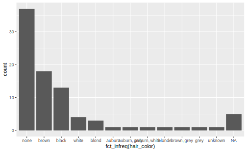
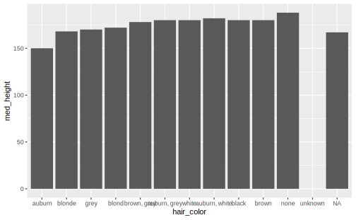
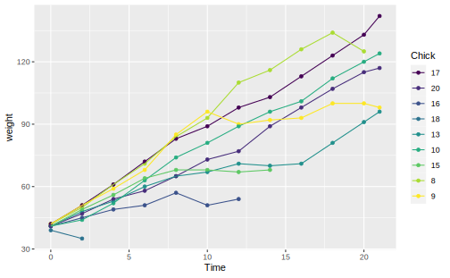
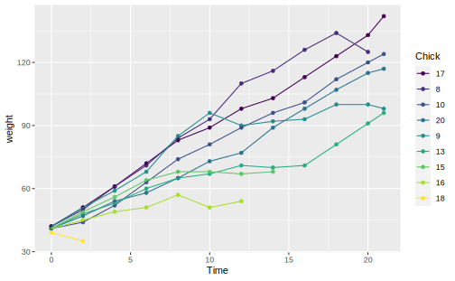
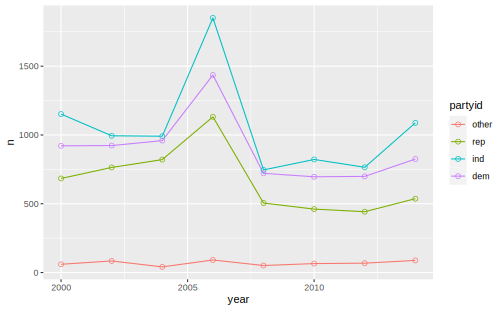

# forcats: factor


因子(factor)在 R 中用于处理分类变量。从历史上看，因子远比字符串容易处理。因此，R 基础包的很多函数都自动将字符串转换为因子。这意味着因子经常出现在并不真正适合他们的地方。好在我们不用担心 tidyverse 中出现这种问题，可以将注意力集中于真正需要因子类型的地方。 

*Roger Peng* 的文章["stringsAsFactors: An unauthorized bigraphy](https://simplystatistics.org/2015/07/24/stringsasfactors-an-unauthorized-biography/)和*Thomas Lumley*的文章[stringsAsFactors = sigh ](https://notstatschat.tumblr.com/post/124987394001/stringsasfactors-sigh)介绍了有关因子和字符串的一些历史背景。  

2006 年, `stringsAsFactors` 这一设置的前身 `charToFactor` 被引入了 `data.frame()` 函数中，后来被纳入到 `read.table()` 里。默认情况下，`stringsAsFactors`被设置为`True`，R便会自动把字符串转换为因子型变量。在当时，这种设置是不难理解的。早期R的用户几乎都是统计科班出身的研究者，他们所用数据集里的字符串几乎都代表了一个定性变量，例如`年龄(male/female)`, `国家(US/other)`, `地区(East/West)`。进一步地，由于统计学家们的工作重点几乎都集中在构建各种统计模型上，而像`lm()`和`glm()`的函数只有当一个变量是 `factor` 类型的时候才开始对其编码，在统计模型中构建虚拟变量。  

另一个原因更隐秘一些。在内部的存储机制中，因子变量经过一些编码后用数值存储，使得因子比字符串在占用内存空间上更加划算。2007 年后，R 引入了一种“CHARSXP”的方法，使得字符串也被映射为数值存储，`stringsAsFactors = T`在这点上的优势便不复存在了。  

如今，R 的用户群体大大地多样化了，许多人开始抱怨默认设置`stringsAsFactors = T`，因为他们数据集中的字符串未必要用来建模，而可能只是一种标签。例如，在基因组学中，基因位点的名字不是某个模型中的变量，而现在把它们转换为因子也不会再有存储上的优势，反而会使得一些分析方法失效（比如使用正则表达式）。

我们将使用`forcats`包来处理因子，这个包提供了能够处理分类变量（其实就是因子的另一种说法）的工具，其中还包括了处理因子的大量辅助函数。因为 `forcats` 不是`tidyverse`的核心 R 包，所以需要手动加载。  


```r
library(forcats)
```


所有 **forcats** 中用于因子处理的核心函数均以 `fct_` 前缀开头，且**第一个参数均为要处理的因子向量**，这意味着`forcats`包中的函数在使用管道操作时，传入的必须是你要操作的向量。关于 `fct_` 函数族最有用的一点是，它可以接受传入的向量是字符串变量（而不仅仅是因子类型），且不会在输出结果中改变变量的类型。这意味着字符串可以一方面享受 `fct_` 函数带来的操作便利，一方面保有字符串的特性。


## Factor basics  

假设我们想要创建一个记录月份的变量：

```r
x1 <- c("Dec", "Apr", "Jan", "Mar")
```

使用字符串来记录月份有两个问题：   

1. 理论上，月份只有 12 个取值。但使用字符串时，我们没有办法告诉 R 什么样的值才是合法的，即使输入错误，代码也不会有什么反应。  

```r
x2 <- c("Dec", "Apr", "Jam", "Mar")
```

2. 对月份的排序没有意义，因为字符串总是按照字母顺序排列的

```r
sort(x1)
#> [1] "Apr" "Dec" "Jan" "Mar"
```


我们可以使用因子来解决以上两个问题。想要创建一个因子，最好先创建指定因子水平顺序的一个向量：

```r
month_levels <- c("Jan", "Feb", "Mar", "Apr", "May", "Jun",
                  "Jul", "Aug", "Sep", "Oct", "Nov", "Dec")
```

现在可以开始创建因子了：

```r
y1 <- factor(x1, levels = month_levels)
y1
#> [1] Dec Apr Jan Mar
#> Levels: Jan Feb Mar Apr May Jun Jul Aug Sep Oct Nov Dec
```

使用因子类型后，不在有效水平向量内的的所有值都会自动转换为 `NA`：

```r
y2 <- factor(x2, levels = month_levels)
y2
#> [1] Dec  Apr  <NA> Mar 
#> Levels: Jan Feb Mar Apr May Jun Jul Aug Sep Oct Nov Dec
```

如果要显示错误信息，可以用`readr::parse_factor()`函数代替 `factor()`,当 `x` 的中的某些元素不在有效水平列表时返回错误信息：


```r
y2 <- parse_factor(x2, levels = month_levels)
```

如果省略了定义水平向量这个步骤，那么R会按照字母顺序作为水平由低到高的顺序：

```r
factor(x1)
#> [1] Dec Apr Jan Mar
#> Levels: Apr Dec Jan Mar
```

有时候我们会想让因子的水平顺序与创建时输入的顺序保持一致。在创建因子时，将`levels`设定为`unique(x)`，就可以达到这个目的：  

```r
x1
#> [1] "Dec" "Apr" "Jan" "Mar"
f1 <- factor(x1, levels = unique(x1))
f1
#> [1] Dec Apr Jan Mar
#> Levels: Dec Apr Jan Mar
```

如果想要直接访问因子的有效水平向量或者个数，可以使用`levels()`和`nlevels()`函数：

```r
levels(f1)
#> [1] "Dec" "Apr" "Jan" "Mar"
nlevels(f1)
#> [1] 4
```


## Sorting  

### Sorting by frequency, appearance, or numeric order

`fct_infreq()` reorder factor levels by frequency of each level, `NA` levels come last regardless of frequency. 


```r
# What's the most frequent hair color in starwars ?
ggplot(starwars) +
  geom_bar(aes(fct_infreq(hair_color)))
```



`fct_inorder()`: sort a factor by the order in which they first appear. This can be useful when dealing with time series data.  

```r
f <- factor(c("b", "b", "a", "c", "c", "c"))
levels(f) # alphabetic order
#> [1] "a" "b" "c"

fct_inorder(f)
#> [1] b b a c c c
#> Levels: b a c
```

`fct_inseq()`: sort a factor by numeric value of a level. This is only applicable when at least one existing level can be coercible to numeric  


```r
f <- factor(1:3, levels = c("3", "2", "1"))
fct_inseq(f)
#> [1] 1 2 3
#> Levels: 1 2 3
```


### Sorting by another variable  

`fct_reorder()` 其实就是 `base::reorder()` 在 `forcats` 中的实现，它根据因子在其他变量上的统计量（中位数、平均数、···）的值对各个水平排序，当绘制非频次条形图时很有用。

Use `.fun` to set a summarizing function (defaults to `median()`), `.desc = TRUE` to sort the factor in descending order, `NA` levels always come the last regardless of the corresponding variable, `fct_explicit_na()` in Section \@ref(transforming-na-levels) fix this.


```r
# reorder hair_color by median of height, then summarize
med_height <- starwars %>% 
  mutate(hair_color = fct_reorder(hair_color, height)) %>% 
  group_by(hair_color) %>%
  summarize(med_height = median(height, na.rm = TRUE))  

med_height %>% 
  ggplot(aes(hair_color, med_height)) + 
  geom_col()
```



Sometimes a factor is mapped to a non-position aesthetic, `fct_reorder2(.f, .x, .y, .fun = last2)` is designed for this kind of 2d displays of a factor.  `last2()` and `first2()`  are helpers for `fct_reorder2()`; `last2()` finds the last value of `.y` when sorted by `.x`; `first2()` finds the first value.


```r
chks <- ChickWeight %>% 
  as_tibble() %>% 
  filter(as.integer(Chick) < 10) %>% 
  mutate(Chick = fct_shuffle(Chick))  # random order

ggplot(chks, aes(Time, weight, color = Chick)) +
  geom_point() +
  geom_line()
```



```r

# change the order of weight, 
# so that points with largest Weight, last time are assigned the first color
# Note that lines match order in legend
ggplot(chks, aes(Time, weight, color = fct_reorder2(Chick, Time, weight))) +
  geom_point() +
  geom_line() +
  labs(colour = "Chick")
```




### Sorting manually 

`fct_infreq()` 和 `fct_reorder()` 排序的依据是明确的，但我们有时也需要人工指定、修改排序结果。`fct_relevel()`接受一个向量调整因子水平的排序。  

这个例子中使用`forcats::gss_cat`，该数据集是综合社会调查（General Social Survey）的一份抽样。综合社会调查是美国芝加哥大学的独立研究组织 NORC 进行的一项长期美国社会调查

```r
gss_cat
#> # A tibble: 21,483 x 9
#>    year marital      age race  rincome    partyid     relig     denom    tvhours
#>   <int> <fct>      <int> <fct> <fct>      <fct>       <fct>     <fct>      <int>
#> 1  2000 Never mar~    26 White $8000 to ~ Ind,near r~ Protesta~ Souther~      12
#> 2  2000 Divorced      48 White $8000 to ~ Not str re~ Protesta~ Baptist~      NA
#> 3  2000 Widowed       67 White Not appli~ Independent Protesta~ No deno~       2
#> 4  2000 Never mar~    39 White Not appli~ Ind,near r~ Orthodox~ Not app~       4
#> 5  2000 Divorced      25 White Not appli~ Not str de~ None      Not app~       1
#> 6  2000 Married       25 White $20000 - ~ Strong dem~ Protesta~ Souther~      NA
#> # ... with 21,477 more rows
levels(gss_cat$rincome)
#>  [1] "No answer"      "Don't know"     "Refused"        "$25000 or more"
#>  [5] "$20000 - 24999" "$15000 - 19999" "$10000 - 14999" "$8000 to 9999" 
#>  [9] "$7000 to 7999"  "$6000 to 6999"  "$5000 to 5999"  "$4000 to 4999" 
#> [13] "$3000 to 3999"  "$1000 to 2999"  "Lt $1000"       "Not applicable"
```

在这个数据集中，因子 `rincome` 个水平的顺序排列是正确的。为了演示`fct_relevel()`的用法，先用 `fct_shuffle()` 打乱该因子的水平顺序：

```r
reshuffled_income <- fct_shuffle(gss_cat$rincome)
## reordering the levels of rincome randomly with fct_shuffle():
levels(reshuffled_income)
#>  [1] "$3000 to 3999"  "No answer"      "$10000 - 14999" "$15000 - 19999"
#>  [5] "Not applicable" "$8000 to 9999"  "$25000 or more" "Don't know"    
#>  [9] "$7000 to 7999"  "$20000 - 24999" "$5000 to 5999"  "$1000 to 2999" 
#> [13] "Refused"        "$6000 to 6999"  "Lt $1000"       "$4000 to 4999"
```

在 `fct_relevel()` 中，通过一个包含水平名称的向量调整排序。默认情况下，向量中的第一个水平被调整到第一个位置上，第二个水平被调整到第二个位置上，以此类推，你只需要指定那些需要调整的水平。可以通过 `after` 指定向量中各水平被调整到什么地方, `after = -Inf` 时第一个水平将被调整到排序的最后一位：

```r
## move Lt $1000 and $1000 to 2999 to the front
fct_relevel(reshuffled_income, 
            c("Lt $1000", "$1000 to 2999")) %>%
  levels()
#>  [1] "Lt $1000"       "$1000 to 2999"  "$3000 to 3999"  "No answer"     
#>  [5] "$10000 - 14999" "$15000 - 19999" "Not applicable" "$8000 to 9999" 
#>  [9] "$25000 or more" "Don't know"     "$7000 to 7999"  "$20000 - 24999"
#> [13] "$5000 to 5999"  "Refused"        "$6000 to 6999"  "$4000 to 4999"

## move Lt $1000 and $1000 to 2999 to the second and third place
fct_relevel(reshuffled_income, 
            c("Lt $1000", "$1000 to 2999"), after = 1) %>%
  levels()
#>  [1] "$3000 to 3999"  "Lt $1000"       "$1000 to 2999"  "No answer"     
#>  [5] "$10000 - 14999" "$15000 - 19999" "Not applicable" "$8000 to 9999" 
#>  [9] "$25000 or more" "Don't know"     "$7000 to 7999"  "$20000 - 24999"
#> [13] "$5000 to 5999"  "Refused"        "$6000 to 6999"  "$4000 to 4999"
```


## Chaninge number of levels

### Lumping levels

To demonstrate how to lump multiple levels of a factor, we will start with `fct_count()` to count factor levels. It's basically a variant of `dplyr::count()`, taking a factor (factor) as its first argument instead of a data frame, which makes it a nice function in `mutate()`. 


```r
fct_count(starwars$skin_color, 
          sort = TRUE,  # sort descendantly
          prop = TRUE)  # compute the fraction of marginal table
#> # A tibble: 31 x 3
#>   f         n      p
#>   <fct> <int>  <dbl>
#> 1 fair     17 0.195 
#> 2 light    11 0.126 
#> 3 dark      6 0.0690
#> 4 green     6 0.0690
#> 5 grey      6 0.0690
#> 6 pale      5 0.0575
#> # ... with 25 more rows
```

`skin_color` has 31 levels overall, and the top 5 to 6 levels occupy more than 50% percent of occurence. In fact, there are 24 levels whose frequency is less than 3%. 


```r
fct_count(starwars$skin_color, prop = TRUE) %>%
  filter(p < 0.03)
#> # A tibble: 24 x 3
#>   f                       n      p
#>   <fct>               <int>  <dbl>
#> 1 blue                    2 0.0230
#> 2 blue, grey              2 0.0230
#> 3 brown mottle            1 0.0115
#> 4 brown, white            1 0.0115
#> 5 fair, green, yellow     1 0.0115
#> 6 gold                    1 0.0115
#> # ... with 18 more rows
```

In this case, We may want to collpase some of the less frequent levels into one, say, a level called "other". 

`forcats` provides a family of functions that lumps together factor levels that meet some criteria into a new level "other".   

- `fct_lump_min()`: lumps levels that appear fewer than `min` times  

- `fct_lump_prop()`: lumps levels that appear fewer than `prop * n` times  

- `fct_lump_n()`: lumps all levels except for the n most frequent (or least frequent if n < 0)  

- `fct_lump_lowfreq()` lumps together the least frequent levels, ensuring that "other" is still the smallest level.


```r
# lump levels that appear fewer than 5 times into "other"
starwars %>% 
  mutate(skin_color = fct_lump_min(skin_color, min = 5)) %>% 
  count(skin_color, sort = TRUE)
#> # A tibble: 7 x 2
#>   skin_color     n
#>   <fct>      <int>
#> 1 Other         36
#> 2 fair          17
#> 3 light         11
#> 4 dark           6
#> 5 green          6
#> 6 grey           6
#> # ... with 1 more row

# preserve 5 most common levels
starwars %>%
  mutate(skin_color = fct_lump_n(skin_color, n = 5)) %>%
  count(skin_color, sort = TRUE)
#> # A tibble: 6 x 2
#>   skin_color     n
#>   <fct>      <int>
#> 1 Other         41
#> 2 fair          17
#> 3 light         11
#> 4 dark           6
#> 5 green          6
#> 6 grey           6

# preserve 5 least common levels
starwars %>%
  mutate(skin_color = fct_lump(skin_color, n = -5)) %>%
  count(skin_color, sort = TRUE)
#> # A tibble: 17 x 2
#>   skin_color              n
#>   <fct>               <int>
#> 1 Other                  71
#> 2 brown mottle            1
#> 3 brown, white            1
#> 4 fair, green, yellow     1
#> 5 gold                    1
#> 6 green-tan, brown        1
#> # ... with 11 more rows
```


Similarly, positive `prop` preserves values that appear at least `prop` of the time. Negative `prop` preserves values that appear at most `-prop` of the time.  


Use argument `other_level` to change default name "other" 

```r
starwars %>%
  mutate(skin_color = fct_lump_prop(skin_color, 
                                     prop = 0.1, 
                                     other_level = "extra")) %>%
  count(skin_color, sort = TRUE)
#> # A tibble: 3 x 2
#>   skin_color     n
#>   <fct>      <int>
#> 1 extra         59
#> 2 fair          17
#> 3 light         11
```

 


`fct_other(f, keep, drop, other_level)` provides a way of manually replacing values with "other".  Pcik one of `keep` and `drop`:  

- `keep` will preserve listed levels, replacing all others with `other_level`
- `drop` will replace listed levels with `other_level`, keeping all as is.


```r
x <- factor(rep(LETTERS[1:9], times = c(40, 10, 5, 27, 1, 1, 1, 1, 1)))

fct_other(x, 
          keep = c("A", "B"), 
          other_level = "I don't care") %>% 
  fct_count()
#> # A tibble: 3 x 2
#>   f                n
#>   <fct>        <int>
#> 1 A               40
#> 2 B               10
#> 3 I don't care    37
```


### Expanding levels  


`fct_expand()` add additional levels to a factor


```r
f <- factor(sample(letters[1:3], 20 , replace = T))
fct_count(f)
#> # A tibble: 3 x 2
#>   f         n
#>   <fct> <int>
#> 1 a         8
#> 2 b         9
#> 3 c         3

# add 3 values
f <- fct_expand(f, "d", "e", "f")
levels(f)
#> [1] "a" "b" "c" "d" "e" "f"
# additional levels are assigned with zero frequncy
fct_count(f)
#> # A tibble: 6 x 2
#>   f         n
#>   <fct> <int>
#> 1 a         8
#> 2 b         9
#> 3 c         3
#> 4 d         0
#> 5 e         0
#> 6 f         0
```

`fct_cross()` combines levels of multiple input factors in a **parallel** manner: 


```r
fruit <- factor(c("apple", "kiwi", "apple", "apple"))
color <- factor(c("green", "green", "red", "green"))

fct_cross(fruit, color)
#> [1] apple:green kiwi:green  apple:red   apple:green
#> Levels: apple:green kiwi:green apple:red
# change deliminator
fct_cross(fruit, color, sep = "|")
#> [1] apple|green kiwi|green  apple|red   apple|green
#> Levels: apple|green kiwi|green apple|red
```

By default, `fct_cross()` does not regard combinations with no observations as valid levels, so `kiwi:red` didn't appear in the output. Use `keep_empty = TRUE` so that `fct_croos()` keep combinations with no observations as levels


```r
fct_cross(fruit, color, keep_empty = TRUE)
#> [1] apple:green kiwi:green  apple:red   apple:green
#> Levels: apple:green kiwi:green apple:red kiwi:red
```


### Dropping levels  

有时候我们希望在数据中取出一个子集，这可能导致在子集中，因子在某些水平上的频次为 0，但 R 并不会自动舍弃舍弃频次为 0 的水平：


```r
## 在原始数据汇总，hair_color共有12个水平
nlevels(factor(starwars$hair_color))
#> [1] 12

fct_count(starwars$hair_color)
#> # A tibble: 13 x 2
#>   f                 n
#>   <fct>         <int>
#> 1 auburn            1
#> 2 auburn, grey      1
#> 3 auburn, white     1
#> 4 black            13
#> 5 blond             3
#> 6 blonde            1
#> # ... with 7 more rows

## 筛选重量在70~135的角色，得到一个子集
(starwars_sub <- starwars %>%
  filter(between(mass, 70, 135)))
#> # A tibble: 34 x 13
#>   name  height  mass hair_color skin_color eye_color birth_year gender homeworld
#>   <chr>  <int> <dbl> <chr>      <chr>      <chr>          <dbl> <chr>  <chr>    
#> 1 Luke~    172    77 blond      fair       blue              19 male   Tatooine 
#> 2 C-3PO    167    75 <NA>       gold       yellow           112 <NA>   Tatooine 
#> 3 Owen~    178   120 brown, gr~ light      blue              52 male   Tatooine 
#> 4 Beru~    165    75 brown      light      blue              47 female Tatooine 
#> 5 Bigg~    183    84 black      light      brown             24 male   Tatooine 
#> 6 Obi-~    182    77 auburn, w~ fair       blue-gray         57 male   Stewjon  
#> # ... with 28 more rows, and 4 more variables: species <chr>, films <list>,
#> #   vehicles <list>, starships <list>

## 现在hair_color只在8个有效水平上有记录，但是总的水平个数没有改变 
nlevels(factor(starwars$hair_color))
#> [1] 12
fct_count(starwars_sub$hair_color)
#> # A tibble: 9 x 2
#>   f                 n
#>   <fct>         <int>
#> 1 auburn, white     1
#> 2 black             5
#> 3 blond             2
#> 4 brown             7
#> 5 brown, grey       1
#> 6 grey              1
#> # ... with 3 more rows

## 用fct_drop()舍弃频次为0的那些水平
starwars_sub$hair_color %>%
  fct_drop() %>%
  nlevels()
#> [1] 8
```

还可以通过给 `only` 参数指定一个向量指定想要丢弃的水平，只有频次为0且包含在该向量中的水平才会被丢弃：

```r
f <- factor(c("a", "b"), levels = c("a", "b", "c"))
fct_drop(f)
#> [1] a b
#> Levels: a b

# Set only to restrict which levels to drop
fct_drop(f, only = "a") ## a水平上有频次，不会被丢弃；c水平上没有频次，但不在only中，也不会被丢弃
#> [1] a b
#> Levels: a b c
fct_drop(f, only = "c")
#> [1] a b
#> Levels: a b
```


### Transforming NA levels  

When a factor has missing values, these `NA`s will not be listed as a valid level. Though in some cases `NA` in a factor could be meaningful. As such we can replace `factor()` with `fct_explicit_na()` if necessary  
 

```r
f <- factor(c("a", "a", NA, NA, "a", "b", NA, "c", "a", "c", "b"))

levels(f)
#> [1] "a" "b" "c"
nlevels(f)
#> [1] 3
```

`fct_explicit_na()`  gives a explicit factor level `na_level` to the `NA`:  


```r
fct_explicit_na(f)
#>  [1] a         a         (Missing) (Missing) a         b         (Missing)
#>  [8] c         a         c         b        
#> Levels: a b c (Missing)

fct_explicit_na(f, na_level = "Unknown")
#>  [1] a       a       Unknown Unknown a       b       Unknown c       a      
#> [10] c       b      
#> Levels: a b c Unknown
```


## Recoding 

比修改因子水平顺序、改变水平个数更强大的操作时修改水平的值。修改水平的值不仅可以使图形标签更为美观清晰，以满足出版发行的要求，还可以将水平汇集成更高层次的显示。修改水平最常用、最强大的工具是`fct_recode()`函数，它可以对每个水平进行修改或重新编码。例如，我们来看一下综合社会调查数据中的因子变量`partyid`:  

```r
fct_count(gss_cat$partyid)
#> # A tibble: 10 x 2
#>   f                      n
#>   <fct>              <int>
#> 1 No answer            154
#> 2 Don't know             1
#> 3 Other party          393
#> 4 Strong republican   2314
#> 5 Not str republican  3032
#> 6 Ind,near rep        1791
#> # ... with 4 more rows
```

在这个因子中，对水平的描述太过简单，而且不一致，我们用 `fct_recode()` 将其修改为较为详细的排比结构，格式为`fct_recode(f,level_new = level_old)`:

```r
gss_cat %>%
  mutate(partyid = fct_recode(partyid, 
                            "Republican,strong" = "Strong republican",
                             "Republican weak"   = "Not str republican",
                             "Independent,near rep" ="Ind,near rep",
                             "Independent,near dem" = "Ind,near dem",
                             "Democrat,weak" = "Not str democrat",
                             "Democrat,strong" = "Strong democrat")) %>%
  count(partyid)
#> # A tibble: 10 x 2
#>   partyid                  n
#>   <fct>                <int>
#> 1 No answer              154
#> 2 Don't know               1
#> 3 Other party            393
#> 4 Republican,strong     2314
#> 5 Republican weak       3032
#> 6 Independent,near rep  1791
#> # ... with 4 more rows
```

`fct_recode()` 函数会让没有明确提及的水平保持原样，如果不小心修改了一个不存在的水平，那么它也会给出警告。  

可以将多个原水平赋给同一个新水平，这样就可以合并原来的分类: 

```r
## 将"no answer"、"Don't know"和"Other party"合并为"Other"
gss_cat %>% mutate(partyid_recode = fct_recode( partyid,
   "Republican,strong" = "Strong republican",
   "Republican weak"   = "Not str republican",
   "Independent,near rep" ="Ind,near rep",
   "Independent,near dem" = "Ind,near dem",
   "Democrat,weak" = "Not str democrat",
   "Democrat,strong" = "Strong democrat",
   "Other" = "No answer",
   "Other" = "Don't know",
   "Other" = "Other party"
 ))  %>% 
  count(partyid_recode)
#> # A tibble: 8 x 2
#>   partyid_recode           n
#>   <fct>                <int>
#> 1 Other                  548
#> 2 Republican,strong     2314
#> 3 Republican weak       3032
#> 4 Independent,near rep  1791
#> 5 Independent           4119
#> 6 Independent,near dem  2499
#> # ... with 2 more rows
```

As a variant of `fct_recode()`, `fct_collapse()` collapses factor levels into manually defined groups

```r
gss_cat %>%
  mutate(partyid = fct_collapse(partyid,
                                other = c("No answer","Don't know","Other party"),
                                rep = c("Strong republican","Not str republican"),
                                ind = c("Ind,near rep","Independent","Ind,near dem"),
                                dem = c("Not str democrat","Strong democrat"))) %>%
  count(partyid)
#> # A tibble: 4 x 2
#>   partyid     n
#>   <fct>   <int>
#> 1 other     548
#> 2 rep      5346
#> 3 ind      8409
#> 4 dem      7180
```

Unmentioned levels stay as is. To collapse this levels, specify `other_level`, this is always placed at the end of levels. 

```r
# collapse two republican levels into "rep", and others into "I don't care"
gss_cat %>%
  mutate(partyid = fct_collapse(partyid,
                                rep = c("Strong republican","Not str republican"),
                                other_level = "I don't care")) %>%
  count(partyid)
#> # A tibble: 2 x 2
#>   partyid          n
#>   <fct>        <int>
#> 1 rep           5346
#> 2 I don't care 16137
```


### Exercises 

\BeginKnitrBlock{exercise}<div class="exercise"><span class="exercise" id="exr:unnamed-chunk-38"><strong>(\#exr:unnamed-chunk-38) </strong></span>美国民主党，共和党和中间派的人数是如何随时间变化的？</div>\EndKnitrBlock{exercise}


```r
gss_cat_collapse <- gss_cat %>%
  mutate(partyid = fct_collapse(partyid,
                                other = c("No answer","Don't know","Other party"),
                                rep = c("Strong republican","Not str republican"),
                                ind = c("Ind,near rep","Independent","Ind,near dem"),
                                dem = c("Not str democrat","Strong democrat")))


gss_cat_collapse %>%
  group_by(year) %>%
  count(partyid) %>%
  ggplot(aes(year,n,color = partyid))+
  geom_line()+
  geom_point(size = 2, shape= 1)
```




