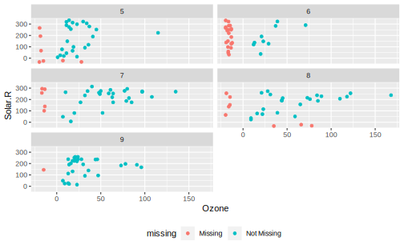
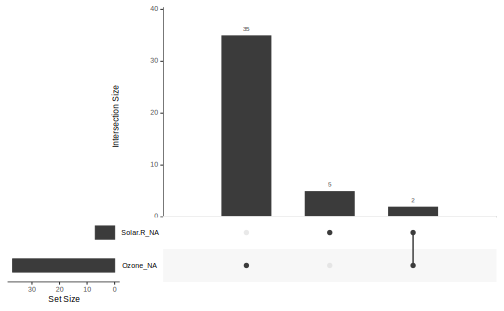

# Dealing with missing values  


## Exploring  {#explore-missing}  

### naniar   

http://naniar.njtierney.com/


```r
library(naniar)
```

#### Shadown matrices  

#### Summaries

#### Visualizations     

http://naniar.njtierney.com/articles/naniar-visualisation.html


```r
ggplot(airquality) + 
  geom_miss_point(aes(Ozone, Solar.R))
```


```r
ggplot(data = airquality,
       aes(x = Ozone,
           y = Solar.R)) + 
  geom_miss_point() + 
  facet_wrap(~Month, ncol = 2) + 
  theme(legend.position = "bottom")
```




```r
gg_miss_upset(airquality)
```




```r
gg_miss_upset(riskfactors)
```


### Replace a value with NA  

It's worth to mention one `dplyr` functions that does the same thing:  
`dplyr::na_if()`


```r
y <- c("abc", "def", "", "ghi")
na_if(y, "")
#> [1] "abc" "def" NA    "ghi"
```


```r
# na_if is particularly useful inside mutate,
# and is meant for use with vectors rather than entire data frames
starwars %>%
  select(name, eye_color) %>%
  mutate(eye_color = na_if(eye_color, "unknown"))
#> # A tibble: 87 x 2
#>   name           eye_color
#>   <chr>          <chr>    
#> 1 Luke Skywalker blue     
#> 2 C-3PO          yellow   
#> 3 R2-D2          red      
#> 4 Darth Vader    yellow   
#> 5 Leia Organa    brown    
#> 6 Owen Lars      blue     
#> # ... with 81 more rows
```


article: http://naniar.njtierney.com/articles/replace-with-na.html  


```r
df <- tibble::tribble(
  ~name,           ~x,  ~y,              ~z,  
  "N/A",           1,   "N/A",           -100, 
  "N A",           3,   "NOt available", -99,
  "N / A",         NA,  "29",              -98,
  "Not Available", -99, "25",              -101,
  "John Smith",    -98, "28",              -1)
```


```r
df %>% replace_with_na(replace = list(x = -99))
#> # A tibble: 5 x 4
#>   name              x y                 z
#>   <chr>         <dbl> <chr>         <dbl>
#> 1 N/A               1 N/A            -100
#> 2 N A               3 NOt available   -99
#> 3 N / A            NA 29              -98
#> 4 Not Available    NA 25             -101
#> 5 John Smith      -98 28               -1
```


```r
df %>% replace_with_na(replace = list(x = c(-99, -98)))
#> # A tibble: 5 x 4
#>   name              x y                 z
#>   <chr>         <dbl> <chr>         <dbl>
#> 1 N/A               1 N/A            -100
#> 2 N A               3 NOt available   -99
#> 3 N / A            NA 29              -98
#> 4 Not Available    NA 25             -101
#> 5 John Smith       NA 28               -1
```


```r
df %>%
  replace_with_na(replace = list(x = c(-99,-98),
                             z = c(-99, -98)))
#> # A tibble: 5 x 4
#>   name              x y                 z
#>   <chr>         <dbl> <chr>         <dbl>
#> 1 N/A               1 N/A            -100
#> 2 N A               3 NOt available    NA
#> 3 N / A            NA 29               NA
#> 4 Not Available    NA 25             -101
#> 5 John Smith       NA 28               -1
```


```r
df %>% replace_with_na_all(condition = ~.x == -99)
#> # A tibble: 5 x 4
#>   name              x y                 z
#>   <chr>         <dbl> <chr>         <dbl>
#> 1 N/A               1 N/A            -100
#> 2 N A               3 NOt available    NA
#> 3 N / A            NA 29              -98
#> 4 Not Available    NA 25             -101
#> 5 John Smith      -98 28               -1
```


```r
common_na_numbers
#> [1]    -9   -99  -999 -9999  9999    66    77    88
```


```r
common_na_strings
#>  [1] "NA"     "N A"    "N/A"    "NA "    " NA"    "N /A"   "N / A"  " N / A"
#>  [9] "N / A " "na"     "n a"    "n/a"    "na "    " na"    "n /a"   "n / a" 
#> [17] " a / a" "n / a " "NULL"   "null"   ""       "\\?"    "\\*"    "\\."
```


```r
df %>% replace_with_na_all(~.x %in% common_na_strings)
#> # A tibble: 5 x 4
#>   name              x y                 z
#>   <chr>         <dbl> <chr>         <dbl>
#> 1 <NA>              1 <NA>           -100
#> 2 <NA>              3 NOt available   -99
#> 3 <NA>             NA 29              -98
#> 4 Not Available   -99 25             -101
#> 5 John Smith      -98 28               -1
```


### janitor

`janitor::tabyl()` generates a frequency table and exposing missing values at the same time


```r
janitor::tabyl(df, y)
#>              y n percent
#>             25 1     0.2
#>             28 1     0.2
#>             29 1     0.2
#>            N/A 1     0.2
#>  NOt available 1     0.2
```

### sjmisc  

when missing variable is factor `sjmisc::frq`


## Wrangling


### tidyr 

`tidyr` provides a handful of tools for converting between implicit (absent rows) and explicit (`NA`) missing values, and for handling explicit `NA`s.

#### `drop_na()` drop rows containing missing values


```r
# df %>% drop_na(Ozone, Solar.R, Wind, Temp, Month, Day)
airquality <- airquality %>% as_tibble()
airquality %>% drop_na() 
#> # A tibble: 111 x 6
#>   Ozone Solar.R  Wind  Temp Month   Day
#>   <int>   <int> <dbl> <int> <int> <int>
#> 1    41     190   7.4    67     5     1
#> 2    36     118   8      72     5     2
#> 3    12     149  12.6    74     5     3
#> 4    18     313  11.5    62     5     4
#> 5    23     299   8.6    65     5     7
#> 6    19      99  13.8    59     5     8
#> # ... with 105 more rows

airquality %>% drop_na(Solar.R)
#> # A tibble: 146 x 6
#>   Ozone Solar.R  Wind  Temp Month   Day
#>   <int>   <int> <dbl> <int> <int> <int>
#> 1    41     190   7.4    67     5     1
#> 2    36     118   8      72     5     2
#> 3    12     149  12.6    74     5     3
#> 4    18     313  11.5    62     5     4
#> 5    23     299   8.6    65     5     7
#> 6    19      99  13.8    59     5     8
#> # ... with 140 more rows
```


#### `replace_na()` replace missing values


```r
# NULL are the list-col equivalent of NAs
df <- tibble(x = c(1, 2, NA), 
             y = c("a", NA, "b"), 
             z = list(1:5, NULL, 10:20)) 


df %>% mutate(x = replace_na(x, 0))
#> # A tibble: 3 x 3
#>       x y     z         
#>   <dbl> <chr> <list>    
#> 1     1 a     <int [5]> 
#> 2     2 <NA>  <NULL>    
#> 3     0 b     <int [11]>

df %>% replace_na(list(x = 0, y = "unknown"))
#> # A tibble: 3 x 3
#>       x y       z         
#>   <dbl> <chr>   <list>    
#> 1     1 a       <int [5]> 
#> 2     2 unknown <NULL>    
#> 3     0 b       <int [11]>

df %>% replace_na(list(z = 5))
#> # A tibble: 3 x 3
#>       x y     z         
#>   <dbl> <chr> <list>    
#> 1     1 a     <int [5]> 
#> 2     2 <NA>  <dbl [1]> 
#> 3    NA b     <int [11]>
```


#### `fill()` fill in missing values with previous or next value


```r
df <- tibble(Month = rep(1:12, 2), 
             Year = c(2000, rep(NA, 11), 
                      2001, rep(NA, 11)))

df %>% fill(Year) # .direction = "down"
#> # A tibble: 24 x 2
#>   Month  Year
#>   <int> <dbl>
#> 1     1  2000
#> 2     2  2000
#> 3     3  2000
#> 4     4  2000
#> 5     5  2000
#> 6     6  2000
#> # ... with 18 more rows
df %>% fill(Year, .direction = "up")
#> # A tibble: 24 x 2
#>   Month  Year
#>   <int> <dbl>
#> 1     1  2000
#> 2     2  2001
#> 3     3  2001
#> 4     4  2001
#> 5     5  2001
#> 6     6  2001
#> # ... with 18 more rows
df %>% fill(Year, .direction = "updown")
#> # A tibble: 24 x 2
#>   Month  Year
#>   <int> <dbl>
#> 1     1  2000
#> 2     2  2001
#> 3     3  2001
#> 4     4  2001
#> 5     5  2001
#> 6     6  2001
#> # ... with 18 more rows
df %>% fill(Year, .direction = "downup")
#> # A tibble: 24 x 2
#>   Month  Year
#>   <int> <dbl>
#> 1     1  2000
#> 2     2  2000
#> 3     3  2000
#> 4     4  2000
#> 5     5  2000
#> 6     6  2000
#> # ... with 18 more rows
```


#### `full_seq()` create the full sequence of values in a vector

This is useful if you want to fill in missing values that should have been observed but weren't. For example, `full_seq(c(1, 2, 4, 6), 1)` will return 1:6.


```r
# `period` specify step length
full_seq(c(1, 3, 5, 11, 13), period = 2)
#> [1]  1  3  5  7  9 11 13

# Works with dates, too!
y <- lubridate::ymd(c("2020-01-01", "2020-01-03"))

full_seq(y, period = 1)
#> [1] "2020-01-01" "2020-01-02" "2020-01-03"
```

#### `expand()` expand data frame to include all combinations of values 

`expand()` creates a data frame containing all conbinations of specified columns, often used in conjunction with `left_join()` to convert implicit missing values to explicit missing values, with `anti_join()` to figure out which combinations are missing.  

To find all unique combinations of `x`, `y` and `z`, including those not found in the data, supply each variable as a separate argument. To find only the combinations that occur in the data, use nest: `expand(df, nesting(x, y, z))`.

You can combine the two forms. For example, `expand(df, nesting(school_id, student_id), date)` would produce a row for every student for each date.  

For factors, the full set of levels (not just those that appear in the data) are used. For continuous variables, you may need to fill in values that don't appear in the data: to do so use expressions like `year = 2010:2020`or `year = full_seq(year, 1)`.


```r
# All possible combinations of vs & cyl, even those that aren't
# present in the data
expand(mtcars, vs, cyl)
#> # A tibble: 6 x 2
#>      vs   cyl
#>   <dbl> <dbl>
#> 1     0     4
#> 2     0     6
#> 3     0     8
#> 4     1     4
#> 5     1     6
#> 6     1     8

# Only combinations of vs and cyl that appear in the data
expand(mtcars, nesting(vs, cyl))
#> # A tibble: 5 x 2
#>      vs   cyl
#>   <dbl> <dbl>
#> 1     0     4
#> 2     0     6
#> 3     0     8
#> 4     1     4
#> 5     1     6
```


```r
# Implicit missings ---------------------------------------------------------
df <- tibble(
  year   = c(2010, 2010, 2010, 2010, 2012, 2012, 2012),
  qtr    = c(   1,    2,    3,    4,    1,    2,    3),
  return = rnorm(7)
)

df %>% expand(year, qtr)
#> # A tibble: 8 x 2
#>    year   qtr
#>   <dbl> <dbl>
#> 1  2010     1
#> 2  2010     2
#> 3  2010     3
#> 4  2010     4
#> 5  2012     1
#> 6  2012     2
#> # ... with 2 more rows

df %>% expand(year = 2010:2012, qtr)
#> # A tibble: 12 x 2
#>    year   qtr
#>   <int> <dbl>
#> 1  2010     1
#> 2  2010     2
#> 3  2010     3
#> 4  2010     4
#> 5  2011     1
#> 6  2011     2
#> # ... with 6 more rows

df %>% expand(year = full_seq(year, 1), qtr)
#> # A tibble: 12 x 2
#>    year   qtr
#>   <dbl> <dbl>
#> 1  2010     1
#> 2  2010     2
#> 3  2010     3
#> 4  2010     4
#> 5  2011     1
#> 6  2011     2
#> # ... with 6 more rows
```


```r
# Each person was given one of two treatments, repeated three times
# But some of the replications haven't happened yet, so we have
# incomplete data:
experiment <- tibble(
  name = rep(c("Alex", "Robert", "Sam"), c(3, 2, 1)),
  trt  = rep(c("a", "b", "a"), c(3, 2, 1)),
  rep = c(1, 2, 3, 1, 2, 1),
  measurement_1 = runif(6),
  measurement_2 = runif(6)
)

# We can figure out the complete set of data with expand()
# Each person only gets one treatment, so we nest name and trt together:
all <- experiment %>% expand(nesting(name, trt), rep)
all
#> # A tibble: 9 x 3
#>   name   trt     rep
#>   <chr>  <chr> <dbl>
#> 1 Alex   a         1
#> 2 Alex   a         2
#> 3 Alex   a         3
#> 4 Robert b         1
#> 5 Robert b         2
#> 6 Robert b         3
#> # ... with 3 more rows

# use left_join to convert implicit missing values to explicit missing values
all %>% left_join(experiment)
#> # A tibble: 9 x 5
#>   name   trt     rep measurement_1 measurement_2
#>   <chr>  <chr> <dbl>         <dbl>         <dbl>
#> 1 Alex   a         1         0.614         0.379
#> 2 Alex   a         2         0.915         0.811
#> 3 Alex   a         3         0.838         0.475
#> 4 Robert b         1         0.855         0.838
#> 5 Robert b         2         0.501         0.739
#> 6 Robert b         3        NA            NA    
#> # ... with 3 more rows
# can use anti_join to figure out which observations are missing
all %>% anti_join(experiment)
#> # A tibble: 3 x 3
#>   name   trt     rep
#>   <chr>  <chr> <dbl>
#> 1 Robert b         3
#> 2 Sam    a         2
#> 3 Sam    a         3


# And use right_join to add in the appropriate missing values to the
# original data
experiment %>% right_join(all)
#> # A tibble: 9 x 5
#>   name   trt     rep measurement_1 measurement_2
#>   <chr>  <chr> <dbl>         <dbl>         <dbl>
#> 1 Alex   a         1         0.614         0.379
#> 2 Alex   a         2         0.915         0.811
#> 3 Alex   a         3         0.838         0.475
#> 4 Robert b         1         0.855         0.838
#> 5 Robert b         2         0.501         0.739
#> 6 Robert b         3        NA            NA    
#> # ... with 3 more rows
```

`complete()` is a short hand function around `expand() + left_join()`: firt create specified combinations and then left join original data to convert implicit missing values to explicit missing values:  


```r
experiment %>% 
  complete(rep, nesting(name, trt))
#> # A tibble: 9 x 5
#>     rep name   trt   measurement_1 measurement_2
#>   <dbl> <chr>  <chr>         <dbl>         <dbl>
#> 1     1 Alex   a             0.614         0.379
#> 2     1 Robert b             0.855         0.838
#> 3     1 Sam    a             0.158         0.278
#> 4     2 Alex   a             0.915         0.811
#> 5     2 Robert b             0.501         0.739
#> 6     2 Sam    a            NA            NA    
#> # ... with 3 more rows
```


	

#### `expand_grid`: create a tibble from all combinations of inputs

`expand_grid()` is analogus to a (atomic) vector version if `expand()`. Instead of taking in a data frame, `expand_grid()` use multiple name-value pairs to generate all combinations :  


```r
expand_grid(x = c(3, 2, 1), y = c(10, 5), z = letters[1:3])
#> # A tibble: 18 x 3
#>       x     y z    
#>   <dbl> <dbl> <chr>
#> 1     3    10 a    
#> 2     3    10 b    
#> 3     3    10 c    
#> 4     3     5 a    
#> 5     3     5 b    
#> 6     3     5 c    
#> # ... with 12 more rows
```

`crossing()` is a wrapper around `expand_grid()` that deduplicates and sorts each input. 


```r
crossing(x = c(3, 2, 1), y = c(10, 5), z = letters[1:3])
#> # A tibble: 18 x 3
#>       x     y z    
#>   <dbl> <dbl> <chr>
#> 1     1     5 a    
#> 2     1     5 b    
#> 3     1     5 c    
#> 4     1    10 a    
#> 5     1    10 b    
#> 6     1    10 c    
#> # ... with 12 more rows
```

 


### janitor


```r
library(janitor)
```


`remove_empty(dat, which = c("rows", "cols"))`  


```r
(df <- tibble(x = c(1, NA, 3),
             y = rep(NA, 3),
             z = c(4, NA, 5)))
#> # A tibble: 3 x 3
#>       x y         z
#>   <dbl> <lgl> <dbl>
#> 1     1 NA        4
#> 2    NA NA       NA
#> 3     3 NA        5

df %>% remove_empty()
#> # A tibble: 2 x 2
#>       x     z
#>   <dbl> <dbl>
#> 1     1     4
#> 2     3     5
df %>% remove_empty("rows")
#> # A tibble: 2 x 3
#>       x y         z
#>   <dbl> <lgl> <dbl>
#> 1     1 NA        4
#> 2     3 NA        5
df %>% remove_empty("cols")
#> # A tibble: 3 x 2
#>       x     z
#>   <dbl> <dbl>
#> 1     1     4
#> 2    NA    NA
#> 3     3     5
```


### visdat

`visdat::vis_missing()`  


```r
library(visdat)
vis_miss(df)
```


Advanced:  `mice`, `Amelia`


## Imputation  

https://jiangjun.link/post/2018/12/r-missing-data  

用中位数或均值填补缺失值:


```r
df <- tibble(x = c(1, 2, NA, 5, 9, NA),
             y = c(NA, 20, 1, NA, 5, NA),
             z = 5:10)


df %>% mutate_all( ~ ifelse(is.na(.x), median(.x, na.rm = T), .))
#> # A tibble: 6 x 3
#>       x     y     z
#>   <dbl> <dbl> <int>
#> 1   1       5     5
#> 2   2      20     6
#> 3   3.5     1     7
#> 4   5       5     8
#> 5   9       5     9
#> 6   3.5     5    10
```

`rlang::%|%`


`simputation`


```r
# install.packages("simputation", dependencies = TRUE)
```

https://edwinth.github.io/padr/
