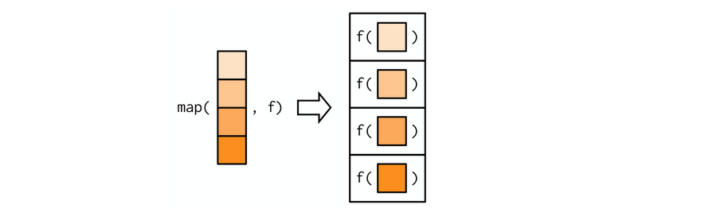

# purrr: Functional programming  

purrr tutorial : https://jennybc.github.io/purrr-tutorial/  

## `map()` family  





```r
mtcars %>%
  map(mean) %>% 
  str()
#> List of 11
#>  $ mpg : num 20.1
#>  $ cyl : num 6.19
#>  $ disp: num 231
#>  $ hp  : num 147
#>  $ drat: num 3.6
#>  $ wt  : num 3.22
#>  $ qsec: num 17.8
#>  $ vs  : num 0.438
#>  $ am  : num 0.406
#>  $ gear: num 3.69
#>  $ carb: num 2.81
```


```r
simple_map <- function(x, fun, ...) {
  output <- vector("list", length = length(x))
  for (i in seq_along(x)) {
    output[[i]] <- fun(x[[i]], ...)
  }
  output
}
```

## Producing atomic vectors 


```r
# map_chr() always returns a character vector
mtcars %>%
  map_chr(typeof)
#>      mpg      cyl     disp       hp     drat       wt     qsec       vs 
#> "double" "double" "double" "double" "double" "double" "double" "double" 
#>       am     gear     carb 
#> "double" "double" "double"
```


```r
# map_lgl() always returns a logical vector
mtcars %>%
  map_lgl(is.double)
#>  mpg  cyl disp   hp drat   wt qsec   vs   am gear carb 
#> TRUE TRUE TRUE TRUE TRUE TRUE TRUE TRUE TRUE TRUE TRUE
```


```r
# map_int() always returns a integer vector
mtcars %>%
  map_int(function(x) length(unique(x)))
#>  mpg  cyl disp   hp drat   wt qsec   vs   am gear carb 
#>   25    3   27   22   22   29   30    2    2    3    6
```


```r
# map_dbl() always returns a double vector
mtcars %>%
  map_dbl(mean)
#>     mpg     cyl    disp      hp    drat      wt    qsec      vs      am    gear 
#>  20.091   6.188 230.722 146.688   3.597   3.217  17.849   0.438   0.406   3.688 
#>    carb 
#>   2.812
```


```r
pair <- function(x) c(x, x)
map_dbl(1:2, pair)
#> Error: Result 1 must be a single double, not an integer vector of length 2
```


```r
1:2 %>%
  map(pair)
#> [[1]]
#> [1] 1 1
#> 
#> [[2]]
#> [1] 2 2
```


```r
1:2 %>% 
  map_dbl(as.character)
#> Error: Can't coerce element 1 from a character to a double
```

```r
1:2 %>% 
  map_chr(as.character)
#> [1] "1" "2"
```


### purrr-style anonymous functions  


```r
mtcars %>% 
  map_dbl(function(x) length(unique(x)))
#>  mpg  cyl disp   hp drat   wt qsec   vs   am gear carb 
#>   25    3   27   22   22   29   30    2    2    3    6
```


```r
mtcars %>%
  map_dbl(~ length(unique(.x)))
#>  mpg  cyl disp   hp drat   wt qsec   vs   am gear carb 
#>   25    3   27   22   22   29   30    2    2    3    6
```


```r
mtcars %>%
  map_dbl(~ length(unique(.)))
#>  mpg  cyl disp   hp drat   wt qsec   vs   am gear carb 
#>   25    3   27   22   22   29   30    2    2    3    6
```


This shortcut is particularly useful for generating random data:  


```r
1:5 %>%
  map(~ rnorm(mean = .x, n = 5)) %>%
  str()
#> List of 5
#>  $ : num [1:5] 1.788 0.578 1.057 1.711 -0.587
#>  $ : num [1:5] 2.6 3.22 1.69 1.79 1.63
#>  $ : num [1:5] 3.33 4.88 2.52 4.74 3.32
#>  $ : num [1:5] 3.9 3.22 4.1 3.95 3.73
#>  $ : num [1:5] 5.65 3.43 2.95 6.02 5.6
```


```r
x <- list(
  list(-1, x = 1, y = c(2), z = "a"),
  list(-2, x = 4, y = c(5, 6), z = "b"),
  list(-3, x = 8, y = c(9, 10, 11))
)

# select by position
x %>% 
  map(2)
#> [[1]]
#> [1] 1
#> 
#> [[2]]
#> [1] 4
#> 
#> [[3]]
#> [1] 8
```


```r
# select by name
x %>% 
  map("x")
#> [[1]]
#> [1] 1
#> 
#> [[2]]
#> [1] 4
#> 
#> [[3]]
#> [1] 8
```


```r
# select by both position and name
x %>%
  map(list("y", 2))
#> [[1]]
#> NULL
#> 
#> [[2]]
#> [1] 6
#> 
#> [[3]]
#> [1] 10
```


## Predicate functions 


### Basics  


```r
df <- data.frame(x = 1:3, y = c("a", "b", "c"))
```


```r
df %>% 
  keep(is.numeric)
#>   x
#> 1 1
#> 2 2
#> 3 3
```


```r
df %>% 
  discard(is.numeric)
#>   y
#> 1 a
#> 2 b
#> 3 c
```


```r
df %>% 
  mutate(new_col = LETTERS[1:3]) %>%
  detect(is.factor)
#> [1] a b c
#> Levels: a b c
```


```r
df %>% 
  detect_index(is.factor)
#> [1] 2
```


### Map variants  


```r
df <- data.frame(
  num1 = c(0, 10, 20),
  num2 = c(5, 6, 7),
  chr1 = c("a", "b", "c"),
  stringsAsFactors = FALSE
)


df %>% 
  map_if(is.numeric, mean, na.rm = T) %>% 
  str()
#> List of 3
#>  $ num1: num 10
#>  $ num2: num 6
#>  $ chr1: chr [1:3] "a" "b" "c"
```


```r
df %>% 
  modify_if(is.character, str_to_upper) %>% 
  str()
#> 'data.frame':	3 obs. of  3 variables:
#>  $ num1: num  0 10 20
#>  $ num2: num  5 6 7
#>  $ chr1: chr  "A" "B" "C"
```

## group functions

### group_map、group_modify

`group_map()`, `group_modify()` and `group_walk()` are purrr-style functions that can be used to iterate on grouped tibbles.


```r
iris %>% 
  group_by(Species) %>% 
  group_map(~ broom::tidy(lm(Sepal.Length ~ Sepal.Width, data = .x))) %>% 
  bind_rows()
#> # A tibble: 6 x 5
#>   term        estimate std.error statistic  p.value
#>   <chr>          <dbl>     <dbl>     <dbl>    <dbl>
#> 1 (Intercept)    2.64     0.310       8.51 3.74e-11
#> 2 Sepal.Width    0.690    0.0899      7.68 6.71e-10
#> 3 (Intercept)    3.54     0.563       6.29 9.07e- 8
#> 4 Sepal.Width    0.865    0.202       4.28 8.77e- 5
#> 5 (Intercept)    3.91     0.757       5.16 4.66e- 6
#> 6 Sepal.Width    0.902    0.253       3.56 8.43e- 4
```


```r
iris %>% 
  group_by(Species) %>% 
  group_modify(~ broom::tidy(lm(Sepal.Length ~ Sepal.Width, data = .x)))
#> # A tibble: 6 x 6
#> # Groups:   Species [3]
#>   Species    term        estimate std.error statistic  p.value
#>   <fct>      <chr>          <dbl>     <dbl>     <dbl>    <dbl>
#> 1 setosa     (Intercept)    2.64     0.310       8.51 3.74e-11
#> 2 setosa     Sepal.Width    0.690    0.0899      7.68 6.71e-10
#> 3 versicolor (Intercept)    3.54     0.563       6.29 9.07e- 8
#> 4 versicolor Sepal.Width    0.865    0.202       4.28 8.77e- 5
#> 5 virginica  (Intercept)    3.91     0.757       5.16 4.66e- 6
#> 6 virginica  Sepal.Width    0.902    0.253       3.56 8.43e- 4
```

This is similar to `split()` and then `map()`:  


```r
iris %>% 
  split(.$Species) %>% 
  map_dfr(~ broom::tidy(lm(Sepal.Length ~ Sepal.Length, data = .x)))
#> # A tibble: 3 x 5
#>   term        estimate std.error statistic  p.value
#>   <chr>          <dbl>     <dbl>     <dbl>    <dbl>
#> 1 (Intercept)     5.01    0.0498     100.  2.11e-58
#> 2 (Intercept)     5.94    0.0730      81.3 6.14e-54
#> 3 (Intercept)     6.59    0.0899      73.3 9.80e-52
```


### group_nest、group_split、group_keys、group_data


`group_nest()` is similar to `group_by() + tidyr::nest()`: 


```r
iris %>% 
  as_tibble() %>%
  group_nest(Species)
#> # A tibble: 3 x 2
#>   Species    data             
#>   <fct>      <list>           
#> 1 setosa     <tibble [50 x 4]>
#> 2 versicolor <tibble [50 x 4]>
#> 3 virginica  <tibble [50 x 4]>
```


`group_split()` is a tidy version of `base::split()`. In particular, it respects a group_by()-like grouping specification, and refuses to name its result.


```r
iris %>% 
  as_tibble() %>%
  group_split(Species)
#> [[1]]
#> # A tibble: 50 x 5
#>   Sepal.Length Sepal.Width Petal.Length Petal.Width Species
#>          <dbl>       <dbl>        <dbl>       <dbl> <fct>  
#> 1          5.1         3.5          1.4         0.2 setosa 
#> 2          4.9         3            1.4         0.2 setosa 
#> 3          4.7         3.2          1.3         0.2 setosa 
#> 4          4.6         3.1          1.5         0.2 setosa 
#> 5          5           3.6          1.4         0.2 setosa 
#> 6          5.4         3.9          1.7         0.4 setosa 
#> # ... with 44 more rows
#> 
#> [[2]]
#> # A tibble: 50 x 5
#>   Sepal.Length Sepal.Width Petal.Length Petal.Width Species   
#>          <dbl>       <dbl>        <dbl>       <dbl> <fct>     
#> 1          7           3.2          4.7         1.4 versicolor
#> 2          6.4         3.2          4.5         1.5 versicolor
#> 3          6.9         3.1          4.9         1.5 versicolor
#> 4          5.5         2.3          4           1.3 versicolor
#> 5          6.5         2.8          4.6         1.5 versicolor
#> 6          5.7         2.8          4.5         1.3 versicolor
#> # ... with 44 more rows
#> 
#> [[3]]
#> # A tibble: 50 x 5
#>   Sepal.Length Sepal.Width Petal.Length Petal.Width Species  
#>          <dbl>       <dbl>        <dbl>       <dbl> <fct>    
#> 1          6.3         3.3          6           2.5 virginica
#> 2          5.8         2.7          5.1         1.9 virginica
#> 3          7.1         3            5.9         2.1 virginica
#> 4          6.3         2.9          5.6         1.8 virginica
#> 5          6.5         3            5.8         2.2 virginica
#> 6          7.6         3            6.6         2.1 virginica
#> # ... with 44 more rows
#> 
#> attr(,"ptype")
#> # A tibble: 0 x 5
#> # ... with 5 variables: Sepal.Length <dbl>, Sepal.Width <dbl>,
#> #   Petal.Length <dbl>, Petal.Width <dbl>, Species <fct>
```


```r
iris %>% 
  as_tibble() %>%
  group_by(Species) %>%
  group_data()
#> # A tibble: 3 x 2
#>   Species    .rows     
#>   <fct>      <list>    
#> 1 setosa     <int [50]>
#> 2 versicolor <int [50]>
#> 3 virginica  <int [50]>
```


only grouping variables:  


```r
iris %>% 
  as_tibble() %>%
  group_keys(Species)
#> # A tibble: 3 x 1
#>   Species   
#>   <fct>     
#> 1 setosa    
#> 2 versicolor
#> 3 virginica
```

only rows:  


```r
iris %>% 
  as_tibble() %>%
  group_by(Species) %>% 
  group_rows()
#> [[1]]
#>  [1]  1  2  3  4  5  6  7  8  9 10 11 12 13 14 15 16 17 18 19 20 21 22 23 24 25
#> [26] 26 27 28 29 30 31 32 33 34 35 36 37 38 39 40 41 42 43 44 45 46 47 48 49 50
#> 
#> [[2]]
#>  [1]  51  52  53  54  55  56  57  58  59  60  61  62  63  64  65  66  67  68  69
#> [20]  70  71  72  73  74  75  76  77  78  79  80  81  82  83  84  85  86  87  88
#> [39]  89  90  91  92  93  94  95  96  97  98  99 100
#> 
#> [[3]]
#>  [1] 101 102 103 104 105 106 107 108 109 110 111 112 113 114 115 116 117 118 119
#> [20] 120 121 122 123 124 125 126 127 128 129 130 131 132 133 134 135 136 137 138
#> [39] 139 140 141 142 143 144 145 146 147 148 149 150
```

## Other useful tools  

### `imap()`  

`imap_xxx(x, ...)` is short hand for `map2(x, names(x), ...)`if `x` has names, or `map2(x, seq_along(x), ...)` if it does not. This is useful if you need to compute on both the value and the position of an element.  

Note that when using the formula shortcut, `.x` is the value, and the `.y` is the position:  


```r
x <- c("sheldon" = 150, "leonard" = 140, "raj" = 145, "howard" = 140)
imap(x, str_c)
#> $sheldon
#> [1] "150sheldon"
#> 
#> $leonard
#> [1] "140leonard"
#> 
#> $raj
#> [1] "145raj"
#> 
#> $howard
#> [1] "140howard"
imap(x, ~ str_c(.y, .x))
#> $sheldon
#> [1] "sheldon150"
#> 
#> $leonard
#> [1] "leonard140"
#> 
#> $raj
#> [1] "raj145"
#> 
#> $howard
#> [1] "howard140"

# on a tibble
imap_chr(mtcars, ~ str_c(.y, "median:", median(.x), sep = " "))
#>                  mpg                  cyl                 disp 
#>   "mpg median: 19.2"      "cyl median: 6" "disp median: 196.3" 
#>                   hp                 drat                   wt 
#>     "hp median: 123" "drat median: 3.695"   "wt median: 3.325" 
#>                 qsec                   vs                   am 
#> "qsec median: 17.71"       "vs median: 0"       "am median: 0" 
#>                 gear                 carb 
#>     "gear median: 4"     "carb median: 2"
```


### adverbs 

`partial` wraps a function:  


```r
mean(c(10, NA, 5, 7), na.rm = TRUE)
#> [1] 7.33

my_mean <- partial(mean, na.rm = TRUE)
my_mean(c(10, NA, 5, 7))
#> [1] 7.33
```

`negate()` negates a predicate function:  


```r
lst <- list("a", 3, 22, NULL, "q", NULL)
map_lgl(lst, ~ !is.null(.))
#> [1]  TRUE  TRUE  TRUE FALSE  TRUE FALSE
```


```r
is_not_null <- negate(is.null)
map_lgl(lst, is_not_null)
#> [1]  TRUE  TRUE  TRUE FALSE  TRUE FALSE
```

`safely()` and `possibly()`:  


```r
add_ten <- function(x) {
  x + 10
}

add_ten_safely <- safely(add_ten)
map(lst, add_ten_safely)
#> [[1]]
#> [[1]]$result
#> NULL
#> 
#> [[1]]$error
#> <simpleError in x + 10: non-numeric argument to binary operator>
#> 
#> 
#> [[2]]
#> [[2]]$result
#> [1] 13
#> 
#> [[2]]$error
#> NULL
#> 
#> 
#> [[3]]
#> [[3]]$result
#> [1] 32
#> 
#> [[3]]$error
#> NULL
#> 
#> 
#> [[4]]
#> [[4]]$result
#> numeric(0)
#> 
#> [[4]]$error
#> NULL
#> 
#> 
#> [[5]]
#> [[5]]$result
#> NULL
#> 
#> [[5]]$error
#> <simpleError in x + 10: non-numeric argument to binary operator>
#> 
#> 
#> [[6]]
#> [[6]]$result
#> numeric(0)
#> 
#> [[6]]$error
#> NULL
```


```r
# If you’re not interested in what the error is
add_ten_possibly <- possibly(add_ten, otherwise = "not numeric")
map(lst, add_ten_possibly)
#> [[1]]
#> [1] "not numeric"
#> 
#> [[2]]
#> [1] 13
#> 
#> [[3]]
#> [1] 32
#> 
#> [[4]]
#> numeric(0)
#> 
#> [[5]]
#> [1] "not numeric"
#> 
#> [[6]]
#> numeric(0)
```

`compose()` lets you string together multiple functions  


```r
add_ten_log_and_round <- compose(round, log, add_ten)
c(1, 5, 100) %>% add_ten_log_and_round()
#> [1] 2 3 5
# is equal to
c(1, 5, 10) %>% 
  add_ten() %>% 
  log() %>% 
  round()
#> [1] 2 3 3
```

