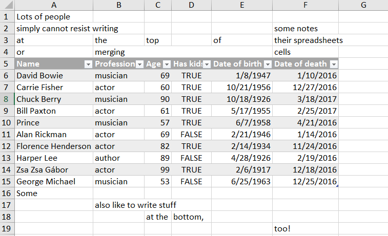
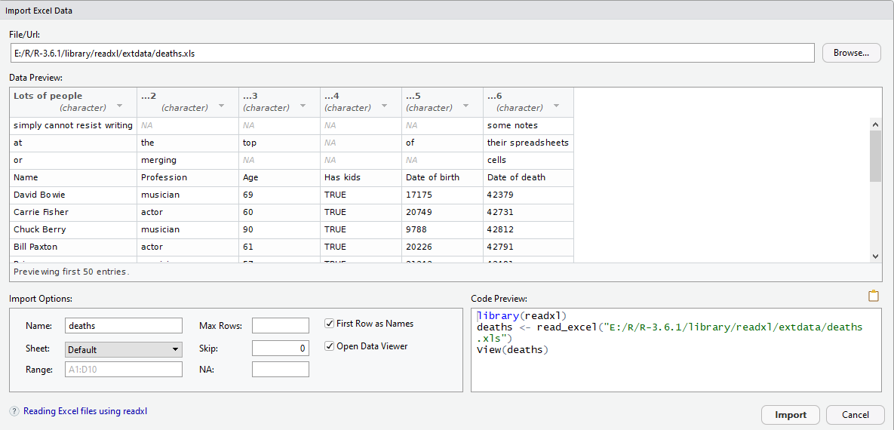
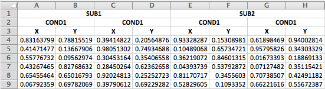

# readr: Data import   


```r
library(readr)
```


## Importing data in base R

base R中有 3 个最主要的数据导入函数：

函数 | 用途
-----| ----
`read.csv()` | 读取以逗号分隔的文件(`sep = ",", header = T`)
`read.delim()` | 读取以制表符分隔的文件(`sep = "\t", header = T`)
`read.table()` | 读取其他一般性的文件，默认添加表头(`sep = "", header = F`)。`read.csv()`和`read.delim()`可以看做`read.table()`针对于特定情况的封装。

用于导入的函数一般都有大量的参数，上述的三个函数中，比较重要的参数有：

* `dec`: 指定文件中用于表示小数点的符号，很多文件中可能会用`;`或者`,`当做小数点，这时不仅需要设置`dec`，也要适当调整`sep`。`read.csv2()`和`read.delim2()`是对一些设置的封装。    
* `col.names` 用于在 `header = F` 时指定列名，默认情况下将被命名为 "V1"、"V2"、···
* `row.names`用于设置行名，既可以传入一个向量直接指定，也可以选择数据中的某一列作为列名（用一个数字表明该列是第几列）    
* `colClasses`:指定列的数据类型。特别是当你希望有些列作为因子，有些列作为字符串，这个参数便很有用。常用的类别有"numeric","factor","logical","character"。如果某列被指定为`"NULL"`，则该列不会被读入。      
* `skip`指定读取数据前跳过的行数    
* `nrows`读入的最大行数    

我们使用本地数据集`hotdogs.txt`简要说明这些函数的用法，它没有列名，且用空格分隔：

```r
## 分别使用三个函数
hotdogs1 <- read.table("data/hotdogs.txt", sep = "\t")
head(hotdogs1)
#>     V1  V2  V3
#> 1 Beef 186 495
#> 2 Beef 181 477
#> 3 Beef 176 425
#> 4 Beef 149 322
#> 5 Beef 184 482
#> 6 Beef 190 587

hotdogs2 <- read.csv("data/hotdogs.txt", sep = "\t", header = F)
head(hotdogs2)
#>     V1  V2  V3
#> 1 Beef 186 495
#> 2 Beef 181 477
#> 3 Beef 176 425
#> 4 Beef 149 322
#> 5 Beef 184 482
#> 6 Beef 190 587

hotdogs2 <- read.delim("data/hotdogs.txt", header = F)
head(hotdogs2)
#>     V1  V2  V3
#> 1 Beef 186 495
#> 2 Beef 181 477
#> 3 Beef 176 425
#> 4 Beef 149 322
#> 5 Beef 184 482
#> 6 Beef 190 587
```


设定 `col.names` 和 `colClasses`：

```r
hotdogs <- read.delim("data\\hotdogs.txt", 
                      header = FALSE, 
                       col.names = c("type", "calories", "sodium"),
                       colClasses = c("factor", "NULL", "numeric"))
head(hotdogs)
#>   type sodium
#> 1 Beef    495
#> 2 Beef    477
#> 3 Beef    425
#> 4 Beef    322
#> 5 Beef    482
#> 6 Beef    587
```


## Importing data in `readr`


### Introduction 

**readr** 是 tidyverse 的核心 R 包之一，作用是将平面数据(flat files)快速读取至 R 中，并转换为易用的 tibble 格式。相对于 base R 中有的数据读取函数，它有以下的优点：  

* 一般来说，它们比基础模块中的函数速度更快（约快 10 倍）。第 \@ref(introduction-to-data-table) 章中的 `fread()` 和第 \@ref(vroom-fast-reading-of-delimited-files) 章中的 `vroom()` 提供了更快速的数据读取  
* 它们可以生成 `tibble`，而且不会将字符串向量转换为因子，不使用行名称，也不会随意改动列名称，这些都是 Base R 读取的痛点
* 它们更容易重复使用。base R 中的函数会继承操作系统的功能，并依赖环境变量，因此，可以在你的计算机上正常运行的代码未必适用于他人的计算机  

**主要函数有**：  

* `read_csv()` 读取逗号分割文件、`read_csv2()` 读取分号分隔文件（这在用逗号表示小数点的国家非常普遍），`read_tsv()` 读取制表符分隔文件，`read_delim()`函数可以读取使用任意分隔符的文件(通过指定 `delim` 参数)  
* `read_fwf()` 读取固定宽度的文件(fixed width file)。既可以使用 `fwf_width()` 函按照宽度来设定域，也可以使用 `fwf_positions()` 函数按照位置来设定域。`read_table()` 读取固定宽度文件的一种常用变体，其中使用空白字符来分隔各列  

**重要参数**：  

* `delim` 指定分隔符  
* `col_names = T`：以上的函数默认将第一行用作列名，如果设定`col_names = F`则列名为`X1`、`X2`、···。也可以指定一个字符向量。  
* `col_types`用一个字符串指定各列的数据类型  

字符|含义
----|---
"i" | integer
"d" | double
"c" | character
"l" | logical
"_" | 舍弃该列

* `n_max`最大读取行数  
* `na`表明文件中缺失值的表示方法  


下面用一些例子演示`read_delim()`函数的用法，因为它是最一般的形式，一旦掌握它，我们就可将从中学到的经验轻松应用于`readr`的其他函数。  

```r
## column names 
properties <- c("area", "temp", "size", "storage", "method",
                "texture", "flavor", "moistness")

## 文件中用制表符为分隔符
potatoes <- read_delim("data\\potatoes.txt",delim = "\t",
                       col_names = properties)

potatoes
#> # A tibble: 160 x 8
#>    area  temp  size storage method texture flavor moistness
#>   <dbl> <dbl> <dbl>   <dbl>  <dbl>   <dbl>  <dbl>     <dbl>
#> 1     1     1     1       1      1     2.9    3.2       3  
#> 2     1     1     1       1      2     2.3    2.5       2.6
#> 3     1     1     1       1      3     2.5    2.8       2.8
#> 4     1     1     1       1      4     2.1    2.9       2.4
#> 5     1     1     1       1      5     1.9    2.8       2.2
#> 6     1     1     1       2      1     1.8    3         1.7
#> # ... with 154 more rows
```

当运行`readr`中的数据导入函数时，会打印出一份数据了说明，给出每个列的名称和类型。后面我们学习解析时，还会继续讨论这项功能。  

通过`col_types`指定前五列为`integer`类型：

```r
properties <- c("area", "temp", "size", "storage", "method",
                "texture", "flavor", "moistness")


potatoes <- read_delim("data\\potatoes.txt",delim = "\t",
                       col_names = properties,
                       col_types = "iiiiiddd")

potatoes
#> # A tibble: 160 x 8
#>    area  temp  size storage method texture flavor moistness
#>   <int> <int> <int>   <int>  <int>   <dbl>  <dbl>     <dbl>
#> 1     1     1     1       1      1     2.9    3.2       3  
#> 2     1     1     1       1      2     2.3    2.5       2.6
#> 3     1     1     1       1      3     2.5    2.8       2.8
#> 4     1     1     1       1      4     2.1    2.9       2.4
#> 5     1     1     1       1      5     1.9    2.8       2.2
#> 6     1     1     1       2      1     1.8    3         1.7
#> # ... with 154 more rows
```


我们还可以创建一个行内 csv 文件。这种文件非常适合用`readr`进行实验，以及与他人分享可重现的例子：

```r
read_delim("a, b, c
           1, 2 , 3
           4, 5, 6", delim = ",")
#> # A tibble: 2 x 3
#>   a              ` b`  ` c` 
#>   <chr>          <chr> <chr>
#> 1 "           1" " 2 " " 3" 
#> 2 "           4" " 5"  " 6"
```

有时文件开头会有几行元数据。可以使用 `skip = n` 来跳过前 n 行；或者使用 `comment = "#"` 丢弃所有以 # 开头的行：  

```r
read_delim("The first line metadata
         The second line of metadata
         x,y,z
         1,2,3",
         delim = ",", skip = 2)
#> # A tibble: 1 x 3
#>   `         x`     y     z
#>   <chr>        <dbl> <dbl>
#> 1 "         1"     2     3

read_delim("# A comment I want to skip
           x,y,z
           1,2,3",
           delim = ",", comment = "#")
#> # A tibble: 1 x 3
#>   `           x`     y     z
#>   <chr>          <dbl> <dbl>
#> 1 "           1"     2     3
```


设置`na`:


```r
read_delim("a,b,c
           1,2,.",
           delim = ",",
           na = ".")
#> # A tibble: 1 x 3
#>   a                  b c    
#>   <chr>          <dbl> <lgl>
#> 1 "           1"     2 NA
```

### Writing data  

`readr`还提供了两个非常有用的函数，用于将数据写回到磁盘：`write_csv()` 和 `write_tsv()`，这两个函数输出的文件能够顺利读取的概率更高，因为：  

* 它们总使用 UTF-8 对字符串进行编码  
* 它们都是用 ISO 8601 日期格式来保存日期和日期时间数据  

如果想要将 CSV 文件导为 Excel 文件，可以使用 `write_excel_csv()` 函数，该函数会在文件开头写入一个特殊字符（字节顺序标记），告诉 Excel 这个文件采用的是 UTF-8 编码。  

这几个函数中最重要的参数是 `x` (要保存的数据框)和`path`(保存文件的位置)。还可以使用 `na` 参数设定如何写入缺失值。默认情况下，写入函数会创建一个新文件或清空原有的文件再导入数据(Python中`open()`函数的`"mode = w"`模式)，如果想要追加到现有的文件，可以设置 `append = T` (Python中的`mode = "a"`模式)：  

```r
library(gapminder)
write_csv(x = gapminder, path = "data\\gapminder.csv")
```

打开对应的文件：  


### Exercises 

\BeginKnitrBlock{exercise}<div class="exercise"><span class="exercise" id="exr:unnamed-chunk-12"><strong>(\#exr:unnamed-chunk-12) </strong></span>如果一个文件中的域是由"|"分隔的，那么应该使用哪个函数读取这个文件？  </div>\EndKnitrBlock{exercise}


应该使用`read_delim(path, delim = "|")`

\BeginKnitrBlock{exercise}<div class="exercise"><span class="exercise" id="exr:unnamed-chunk-13"><strong>(\#exr:unnamed-chunk-13) </strong></span>`read_fwf()` 中最重要的参数是什么？   </div>\EndKnitrBlock{exercise}

`read_fwf()`用于固定宽度文件(fixed width files)。在固定宽度文件中，每一列的的宽度是固定的（不足的用某种填充符号填充），如第一列总是10个字符长度，第二列 5 个字符长度，第三列8个字符长度，每列内采取统一的对齐方式。`readr`安装时附带了一个固定宽度文件的示例,我们用一个变量存储它的路径：

```r
fwf_sample <- readr_example("fwf-sample.txt")
fwf_sample
#> [1] "C:/Users/Lenovo/Documents/R/win-library/3.6/readr/extdata/fwf-sample.txt"
```

txt 文件内的内容：


读取固定宽度文件时，最重要的是告诉 R 每列的位置，参数 `col_positions` 用于这项工作，有几种不同的表示方式：  

```r
# You can specify column positions in several ways:
# 1. Guess based on position of empty columns
read_fwf(fwf_sample, 
         col_positions = fwf_empty(fwf_sample, col_names = c("first", "last", "state", "ssn")))
#> # A tibble: 3 x 4
#>   first last     state ssn         
#>   <chr> <chr>    <chr> <chr>       
#> 1 John  Smith    WA    418-Y11-4111
#> 2 Mary  Hartford CA    319-Z19-4341
#> 3 Evan  Nolan    IL    219-532-c301
# 2. A vector of field widths
read_fwf(fwf_sample, 
         col_positions = fwf_widths(c(20, 10, 12), col_names = c("name", "state", "ssn")))
#> # A tibble: 3 x 3
#>   name          state ssn         
#>   <chr>         <chr> <chr>       
#> 1 John Smith    WA    418-Y11-4111
#> 2 Mary Hartford CA    319-Z19-4341
#> 3 Evan Nolan    IL    219-532-c301
# 3. Paired vectors of start and end positions
read_fwf(fwf_sample,  
         col_positions = fwf_positions(c(1, 30), c(20, 42), col_names = c("name", "ssn")))
#> # A tibble: 3 x 2
#>   name          ssn         
#>   <chr>         <chr>       
#> 1 John Smith    418-Y11-4111
#> 2 Mary Hartford 319-Z19-4341
#> 3 Evan Nolan    219-532-c301
# 4. Named arguments with start and end positions
read_fwf(fwf_sample, 
         col_positions = fwf_cols(name = c(1, 20), ssn = c(30, 42)))
#> # A tibble: 3 x 2
#>   name          ssn         
#>   <chr>         <chr>       
#> 1 John Smith    418-Y11-4111
#> 2 Mary Hartford 319-Z19-4341
#> 3 Evan Nolan    219-532-c301
# 5. Named arguments with column widths
read_fwf(fwf_sample, 
         col_positions = fwf_cols(name = 20, state = 10, ssn = 12))
#> # A tibble: 3 x 3
#>   name          state ssn         
#>   <chr>         <chr> <chr>       
#> 1 John Smith    WA    418-Y11-4111
#> 2 Mary Hartford CA    319-Z19-4341
#> 3 Evan Nolan    IL    219-532-c301
```


## Parsing a vector

在详细介绍 `readr` 如何从磁盘读取文件之前，我们需要先讨论一下 `parse_*()`函数族。这些函数接受一个字符向量（因为文件中的数据全部是以字符串的形式进入 R 的），并返回一个特定向量，如逻辑、整数或日期向量：  

```r
## 用str()函数返回类别
str(parse_logical(c("True", "False", "True")))
#>  logi [1:3] TRUE FALSE TRUE
str(parse_integer(c("1", "2", "3")))
#>  int [1:3] 1 2 3
str(parse_date(c("2010-01-01", "2019-08-15")))
#>  Date[1:2], format: "2010-01-01" "2019-08-15"
```

这些函数各司其职，且都是 `readr` 的重要组成部分。一旦掌握了本节中这些单个解析函数的用法，我们就可以继续讨论如何综合使用它们来解析整个文件了。  

和 `tidyverse` 中出现的函数族一样，`parse_*()` 函数族有着相同的参数结构。第一个参数是需要解析的字符向量，`na`参数设定了哪些字符串应该当做缺失值处理：  


```r
parse_integer(c("1","2",".","456"),na = ".")
#> [1]   1   2  NA 456
```

如果解析失败，你会收到一条警告：  

```r
x <- parse_integer(c("123", "345", "abc", "123.45"))
```

解析失败的值在输出中以缺失值的形式存在: 

```r
x
#> [1] 123 345  NA  NA
#> attr(,"problems")
#> # A tibble: 2 x 4
#>     row   col expected               actual
#>   <int> <int> <chr>                  <chr> 
#> 1     3    NA an integer             abc   
#> 2     4    NA no trailing characters .45
```
 
如果解析失败的值很多，那么就应该使用 `problems()` 函数来获取完整的失败信息集合。这个函数会返回一个 tibble，可以使用 `dplyr` 来处理它：  


```r
problems(x)
#> # A tibble: 2 x 4
#>     row   col expected               actual
#>   <int> <int> <chr>                  <chr> 
#> 1     3    NA an integer             abc   
#> 2     4    NA no trailing characters .45
```

在解析函数的使用方面，最重要的是知道有哪些解析函数，以及每种解析函数用来处理哪种类型的输入。具体来说，重要的解析函数有8中：  

* `parse_logical()`和`parse_integer()`函数分别解析逻辑值和整数，因为这两个解析函数基本不会出现问题，所以我们不再进行更多介绍  
* `parse_double()`是严格的数值型解析函数，而`parse_number()`则是灵活的数值型解析函数，这两个函数背后很复杂，因为世界各地书写数值的方式不尽相同  
* `parse_character()`函数似乎太过简单，甚至没必要存在，因为R读取的文件本身就是字符串形式。但一个棘手的问题使得这个函数非常重要：字符编码  
* `parse_factor()`函数可以创建因子，R使用这种数据结构表示分类变量，该变量具有固定数目的已知值  
* `parse_datetime()`、`parse_date()`和`parse_time()`函数可以解析不同类型的日期和时间，它们是最复杂的，因为有太多不同的日期书写形式  

### Numeric

解析数值似乎是直截了当的，但以下 3 个问题增加了数値解析的复杂性：  

* 世界各地的人们书写数值的方式不尽相同。例如有些国家使用`.`当做小数点，而有些国家使用`,`  
* 数值周围可能会有其他字符，例如 `$1000`、`15℃`  和`10%`  
* 数值经常包含某种形式的分组(grouping)，以便更易读，如`1 000 000`，而且世界各地用来分组的字符也不统一  

为了解决第一个问题，`readr`使用了地区的概念(locale)，使得可以按照不同地区设置解析选项。在解析数值时，最重要的选项就是用来表示小数点的字符，通过设置一个新的地区对象并设定`decimal_mark`参数，可以覆盖`.`的默认值：  

```r
parse_double("1.23")
#> [1] 1.23
parse_double("1,23", locale = locale(decimal_mark = ","))
#> [1] 1.23
```

`locale()`函数可以通过`decimal_mark,grouping_mark,date_format,time_format,tz,encoding`等参数创建一个地区对象，设定该地区内的一些表示习惯，这里我们告诉R哪个符号被用来当做小数点。  

`readr`的默认地区是US-centric。获取默认地区的另一种方法是利用操作系统，但这可能让你的代码只能在你的电脑上运行，通过电子邮件共享给另一个国家的同事时，就可能失效。  

`parse_number()`解决了第二个问题：**它可以忽略数值前后的非数值型字符**。这个函数特别适合处理货币和百分比，你可以提取嵌在文本中的数值：  

```r
parse_number("$100")
#> [1] 100
parse_number("20%")
#> [1] 20
parse_number("37℃")
#> [1] 37
parse_number("It cost $123.45")
#> [1] 123
```

组合使用 `parse_number()` 和 `locale()` 可以解决最后一个问题，因为 `parse_number()` 可以忽略“分组符号” ： 

```r
## 适用于美国，忽略分组符号
parse_number("123,456,789")
#> [1] 123456789
## 适用于多数欧洲国家，需要用locale设置分组符号，因为.被默认为小数点
parse_number("123.456.789", locale = locale(grouping_mark = "."))
#> [1] 123456789
## 适用于瑞士
parse_number("123'456'789", locale = locale(grouping_mark = "'"))
#> [1] 123456789
```

### Character

To better illustrate the challenges of parsing a character vector, we need to have a reasonable understanding of the following questions.    

1. 什么是字符？  

> 字符是各种文字和符号的总称，包括各个国家文字、标点符号、图形符号、数字等，甚至还包括表情符号。  

2. 什么是字符集？  

> 字符集是多个字符的集合，字符集种类较多，每个字符集包含的字符个数不同，常见字符集有：ASCII 字符集、ISO 8859字符集、GB2312 字符集、BIG5字符集、GB18030 字符集、Unicode 字符集等。ASCII 可以非常好地表示英文字符，因为它就是美国信息交换标准代码(American Standard Code for Information Interchange)的缩写。Unicode是国际组织制定的可以容纳世界上所有文字和符号的字符编码方案。   

3. 什么是字符编码？ 

>  计算机要准确的处理各种字符集文字，需要进行字符编码，以便计算机能够识别和存储各种文字。 字符编码(encoding)和字符集不同。字符集只是字符的集合，不一定适合作网络传送、处理，有时须经编码(encode)后才能应用。如Unicode可依不同需要以UTF-8、UTF-16、UTF-32等方式编码。 字符编码就是以二进制的数字来对应字符集的字符。因此，对字符进行编码，是信息交流的技术基础。

4. 概括  

> 使用哪些字符。也就是说哪些汉字，字母和符号会被收入标准中。所包含“字符”的集合就叫做“字符集”。 
规定每个“字符”分别用一个字节还是多个字节存储，用哪些字节来存储，这个规定就叫做“编码”。 各个国家和地区在制定编码标准的时候，“字符的集合”和“编码”一般都是同时制定的。因此，平常我们所说的“字符集”，比如：GB2312, GBK, JIS等，除了有“字符的集合”这层含义外，同时也包含了“编码”的含义。 
注意：Unicode字符集有多种编码方式，如UTF-8、UTF-16等；ASCII只有一种；大多数MBCS（包括GB2312，GBK）也只有一种。


在 R 中，我们可以使用`charToRaw()`函数获得一个字符串的底层表示（underlying representation）：  

```r
char_raw <- charToRaw("Maxine")
char_raw
#> [1] 4d 61 78 69 6e 65
```

`charToRaw()`返回的尚不是编码结果（二进制），而是十六进制的表示。每个十六进制数表示字符串的一个字节：`4d`是M，`61`是a等。`charToRaw()`返回的对象在R中被称为`raw type`，想要得到真正的二进制编码，要对`raw type`再使用`rawToBits()`函数：


```r
rawToBits(char_raw)
#>  [1] 01 00 01 01 00 00 01 00 01 00 00 00 00 01 01 00 00 00 00 01 01 01 01 00 01
#> [26] 00 00 01 00 01 01 00 00 01 01 01 00 01 01 00 01 00 01 00 00 01 01 00
```

`readr`默认使用UTF-8编码。其中的含义在于，每当接受到一个字符串，R收到的不是字符串本身，而是它背后的二进制表示，于是R便尝试按照UTF-8的规则解读这些二进制码，把它们还原为人类所能理解的字符。问题是，如果你的文件不是用UTF-8编码，这就像用英文字典来解释汉语拼音，可能小张计算机存储字母”A”是1100001，而小王存储字母”A”是11000010，这样双方交换信息时就会误解。比如小张把1100001发送给小王，小王并不认为1100001是字母”A”，可能认为这是字母”X”，于是小王在用记事本访问存储在硬盘上的1100001时，在屏幕上显示的就是字母”X”。


要解决这个问题，需要在`parse_character()`函数中通过`locale(encoding = )`参数设定编码方式：  

如何才能找到正确的编码方式呢？有可能数据来源会注明，但如果没有到话，`readr`包提供了`guess_encoding()`函数来帮助你找出编码方式。这个函数并非万无一失，如果有大量文本效果就会更好，它的第一个参数可以是直接的文件路径，也可以是一个`raw type`:

```r

guess_encoding(charToRaw("中国"))
#> # A tibble: 1 x 2
#>   encoding confidence
#>   <chr>         <dbl>
#> 1 ASCII             1
parse_character("中国",locale = locale(encoding = "UTF-8"))
#> [1] "<U+4E2D><U+56FD>"
parse_character("中国",locale = locale(encoding = "windows-1252"))
#> [1] "<U+4E2D><U+56FD>"

guess_encoding("data\\hotdogs.txt")
#> # A tibble: 1 x 2
#>   encoding confidence
#>   <chr>         <dbl>
#> 1 ASCII             1
```

编码问题博大精深，这里只是蜻蜓点水式地介绍一下。如果想要学习更多相关知识，可以阅读[http://kunststube.net/encoding/](http://kunststube.net/encoding/)


### Factor  

因子对应的解析函数是 `parse_factor()` ，其中 `levels` 参数被赋予一个包含所有因子可能水平的向量，如果要解析的列存在 `levels` 中没有的值，就会生成一条警告。

```r
fruit <- c("apple", "banana")
f <- parse_factor(c("apple", "banana", "bananana"), levels = fruit)
problems(f)
#> # A tibble: 1 x 4
#>     row   col expected           actual  
#>   <int> <int> <chr>              <chr>   
#> 1     3    NA value in level set bananana
```

如果有很多问题条目的话，最简单的是它们当做字符串来解析，然后用`forcats`包进行后续处理。  

### Date and time 

根据需要的是日期型数据（从 1970-01-01 开始的天数）、日期时间型数据（从 1970-01-01 开始的秒数）还是时间型数据（从午夜开始的描述），我们可以在3中解析函数之间进行选择。在没有使用任何附加参数时调用，具体情况如下：  

* `parse_datetime()`期待的是符合 ISO 8601 标准的日期时间。ISO 8601是一种国际标准，其中日期的各个部分按从大到小的顺序排列，即年、月、日、小时、分钟、秒：


```r
parse_datetime("2010-10-01 201002")
#> [1] "2010-10-01 20:10:02 UTC"

## 如果时间被忽略了，就会被设置为午夜
parse_datetime("20101001")
#> [1] "2010-10-01 UTC"
```

这是最重要的日期/时间标准，如果经常使用日期和时间，可以阅读以下维基百科上的[ISO 8601标准](https://en.wikipedia.org/wiki/ISO_8601)

* `parse_date()`期待的是四位数的年份、一个`-`或者`/`作为分隔符，月，一个`-`或者`/`作为分隔符，然后是日：

```r
parse_date("2010-10-01")
#> [1] "2010-10-01"
parse_date("2010/10/01")
#> [1] "2010-10-01"
```

* `parse_time()`期待的是小时，`:`作为分隔符，分钟，可选的`:`和后面的秒，以及一个可选的 am/pm 标识符：  


```r
parse_time("8:20 pm")
#> 20:20:00
parse_time("8:20:05")
#> 08:20:05
```

如果默认数据不适合实际数据，那么可以为 `parse_date()` 的第二个参数 `format` 传入一个字符串指定自己的日期时间格式(这个参数是解析日期时间的函数在`parse_*()`函数族中特有的)，格式由以下各部分组成：  

成分|符号
----|---
年| `%Y`(四位数)<br>`%y`(两位数；00-69被解释为2000-2069、70-99被解释为1970-1999)
月| `%m`(两位数)<br> `%b`（简写名称，如“Jan”）<br> `%B`（完整名称，如January）  
日| `%d`(一位数或两位数) <br> %e(两位数)
时间| `%H`(0-23小时)<br>`%I`(0-12小时，必须和`%p`一起使用) <br> `%p`(表示am/pm) <br> `%M`(分钟) <br> `S`(整数秒) <br> `%OS`(实数秒) <br> `%Z`(时区) 
非数值字符| `%.`(跳过一个非数值字符) <br> `%*`跳过所有非数值字符  

找出正确格式的最好方法是创建几个解析字符向量的示例，并使用某种解析函数进行测试（如果数据中有分隔符，则）：  


```r
parse_date("100101",format = "%m%d%y")
#> [1] "2001-10-01"
parse_date("01/02/15","%y/%m/%d")
#> [1] "2001-02-15"
parse_date("Nov/12/1998","%b/%d/%Y")
#> [1] "1998-11-12"
```

### Exercises   

\BeginKnitrBlock{exercise}<div class="exercise"><span class="exercise" id="exr:unnamed-chunk-32"><strong>(\#exr:unnamed-chunk-32) </strong></span>如果在`locale()`函数中把`decimal_mark`和`grouping_mark`设为同一个字符，会发生什么情况？如果将`decimal_mark`设为逗号，`grouping_mark`的默认值会发生什么变化？如果将`grouping_mark`设置为句点，`decimal_mark`的默认值会发生什么变化？  </div>\EndKnitrBlock{exercise}


不能将`decimal_mark` 和 `group_mark` 设为同一个字符：

```r
locale(decimal_mark = ".",grouping_mark = ".")
#> Error: `decimal_mark` and `grouping_mark` must be different
```

将`decimal_mark`设为逗号时，`grouping_mark`的默认值将变为`.`(见第一行):


```r
locale(decimal_mark = ",")
#> <locale>
#> Numbers:  123.456,78
#> Formats:  %AD / %AT
#> Timezone: UTC
#> Encoding: UTF-8
#> <date_names>
#> Days:   Sunday (Sun), Monday (Mon), Tuesday (Tue), Wednesday (Wed), Thursday
#>         (Thu), Friday (Fri), Saturday (Sat)
#> Months: January (Jan), February (Feb), March (Mar), April (Apr), May (May),
#>         June (Jun), July (Jul), August (Aug), September (Sep), October
#>         (Oct), November (Nov), December (Dec)
#> AM/PM:  AM/PM
```

将`grouping_mark`设为句点时，`decimal_mark`的默认值将变为`,`:


```r
locale(grouping_mark = ".")
#> <locale>
#> Numbers:  123.456,78
#> Formats:  %AD / %AT
#> Timezone: UTC
#> Encoding: UTF-8
#> <date_names>
#> Days:   Sunday (Sun), Monday (Mon), Tuesday (Tue), Wednesday (Wed), Thursday
#>         (Thu), Friday (Fri), Saturday (Sat)
#> Months: January (Jan), February (Feb), March (Mar), April (Apr), May (May),
#>         June (Jun), July (Jul), August (Aug), September (Sep), October
#>         (Oct), November (Nov), December (Dec)
#> AM/PM:  AM/PM
```


\BeginKnitrBlock{exercise}<div class="exercise"><span class="exercise" id="exr:unnamed-chunk-36"><strong>(\#exr:unnamed-chunk-36) </strong></span>`locale()`函数中的`date_format()`和`time_format()`参数有什么用？  </div>\EndKnitrBlock{exercise}


`date_format()` 和 `time_format()` 和 `format` 参数的功能一样，用以指定日期时间数据的格式，如果在 `locale()` 中设定了以上两个参数，就不需要再设定 `format`；反之亦然：  


```r
parse_date("170625", locale = locale(date_format = "%y%m%d"))
#> [1] "2017-06-25"
```

4. 生成正确行使的字符串来解析以下日期和时间。  


```r
d1 <- "January 1,2010"
parse_date(d1,"%B %d,%Y")
#> [1] "2010-01-01"

d2 <- "2015-Mar-07"
parse_date(d2,"%Y-%b-%e")
#> [1] "2015-03-07"

d3 <- c("August 19 (2015)","July 1 (2015)")
parse_date(d3,"%B %d (%Y)")
#> [1] "2015-08-19" "2015-07-01"

t1 <- "1705"
parse_time("1705","%H%M")
#> 17:05:00

t2 <- "11:15:10.12 PM"
parse_time(t2,"%I:%M:%OS %p")
#> 23:15:10.12
```

## Parsing a file

现在我们已经学会了如何用 `parse_*()` 函数族解析单个向量，接下来就能回到本章的最初目标，研究`readr`是如何解析文件的。我们将关注以下两点：  

* `readr`如何自动猜出文件每列的数据类型  
* 如何修改默认设置  

### Strategies  

`readr` 通过一种启发式过程(heuristic)来确定每列的类型：先读取文件的前1000行，然后使用（相对保守的）某种启发式算法确定每列的类型。`readr` 中的导入函数会先用 `guess_parser()` 函数返回对于所需解析函数最可信的猜测，然后尝试用可能性最大的解析函数解析该列：


```r
guess_parser("123.45")
#> [1] "double"
guess_parser("12,352,561")
#> [1] "number"
guess_parser("1998-11-12")
#> [1] "date"
guess_parser(c("True", "False"))
#> [1] "logical"
```

这个过程会依次尝试以下每种数据类型，直到找到匹配的类型。   

**逻辑值(logical)**：  
  只包括`F`、`T`、`FALSE`和`True`  
**整数(integer)**  
  只包括数值型字符（以及`-`）  
**双精度浮点数(double)**   
  只包括有效的双精度浮点数   
**数值(number)**  
  只包括带有分组符号的有效双精度浮点数  
**时间**   
  与默认的`time_format`匹配的值   
**日期**   
  与默认的`date_format`匹配的值   
**日期时间**  
  符合ISO 8601标准的任何日期  

如果以上数据不符合上述要求中的任意一个，那么这一列就是一个字符串向量，`readr`将使用`parse_character()`解析它。  

### Possible challenges   

这些默认设置对更大的文件并不总是有效。以下是两个可能遇到的主要问题：  

* `readr` 通过前 1000 行猜测数据类型，但是前 1000 行可能只是一种特殊情况，不足以代表整列。例如，一列双精度数值的前1000行有可能都是整数  
* 列中可能包含大量缺失值。如果前 1000 行都是 `NA`，那么`readr` 会认为这是一个字符向量，但你其实想将这一类解析为更具体的值。  

`readr`的安装包里包含了一份文件`challenge.csv`，用来说明解析过程中可能遇到的问题。这个csv文件包含两列x，y和2001行观测。x 列的前 1001 行均为整数，但之后的值均为双精度整数。y 列的前 1001 行均为`NA`，后面是日期型数据：

```r
# readr_example() find path for a built-in readr file
challenge <- read_csv(readr_example("challenge.csv"))
#> Parsed with column specification:
#> cols(
#>   x = col_double(),
#>   y = col_logical()
#> )
```

可以看到，`read_csv()` 成功解析了 `x`，但对于 `y` 则无从下手，因为使用了错误的解析函数`col_logical()`。使用 `problems()` 函数明确列出这些失败记录，以便深入探究其中的问题：  


```r
problems(challenge)
#> # A tibble: 1,000 x 5
#>     row col   expected       actual   file                                      
#>   <int> <chr> <chr>          <chr>    <chr>                                     
#> 1  1001 y     1/0/T/F/TRUE/~ 2015-01~ 'C:/Users/Lenovo/Documents/R/win-library/~
#> 2  1002 y     1/0/T/F/TRUE/~ 2018-05~ 'C:/Users/Lenovo/Documents/R/win-library/~
#> 3  1003 y     1/0/T/F/TRUE/~ 2015-09~ 'C:/Users/Lenovo/Documents/R/win-library/~
#> 4  1004 y     1/0/T/F/TRUE/~ 2012-11~ 'C:/Users/Lenovo/Documents/R/win-library/~
#> 5  1005 y     1/0/T/F/TRUE/~ 2020-01~ 'C:/Users/Lenovo/Documents/R/win-library/~
#> 6  1006 y     1/0/T/F/TRUE/~ 2016-04~ 'C:/Users/Lenovo/Documents/R/win-library/~
#> # ... with 994 more rows
```

可以使用`spec_csv()` 来直接查看 `readr` 在默认情况下用那种类型的解析函数解析数据：

```r
spec_csv(readr_example("challenge.csv"))
#> cols(
#>   x = col_double(),
#>   y = col_logical()
#> )
```


为了解决这个问题，我们用`read_csv()`函数中的`col_types`指定每列的解析方法(column specification)，之前我们向`col_types`传入一个字符串说明各列的类别，但这里是要直接指明解析函数了。这样做的指定必须通过`cols()`函数来创建(具体格式和`spec_csv()`或者`read_csv()`自动打印的说明是一样的)：  

```r
challenge <- read_csv(readr_example("challenge.csv"),
                      col_types =cols(
                         x = col_double(),
                         y = col_date()
))

tail(challenge)
#> # A tibble: 6 x 2
#>       x y         
#>   <dbl> <date>    
#> 1 0.805 2019-11-21
#> 2 0.164 2018-03-29
#> 3 0.472 2014-08-04
#> 4 0.718 2015-08-16
#> 5 0.270 2020-02-04
#> 6 0.608 2019-01-06
```

每个`parse_*()`函数都有一个对应的`col_*()`函数。如果数据已经保存在R的字符向量中，那么可以使用`parse_*()`，如果要告诉`readr`如何加载数据，则应该使用`col_*()`。  

**The available specifications are: (with string abbreviations in brackets)**

* `col_logical()` [l], containing only T, F, TRUE or FALSE.    
* `col_integer()` [i], integers.    
* `col_double()` [d], doubles.  
* `col_character()` [c], everything else.  
* `col_factor(levels, ordered)` [f], a fixed set of values.    
* `col_date(format = "")` [D]: with the locale's date_format.     
* `col_time(format = "")` [t]: with the locale's time_format.    
* `col_datetime(format = "")` [T]: ISO8601 date times   
* `col_number()` [n], numbers containing the grouping_mark    
* `col_skip()` [_, -], don't import this column.    
* `col_guess()` [?], parse using the "best" type based on the input.  

`cols_only()`代替`cols()`可以仅指定部分列的解析方式；`.default`表示未提及的所有列(`read_csv()`的默认设置可以表示为`read_csv( col_type = cols(.default = col_guess()))`

一旦我们指定了正确的解析函数，问题便迎刃而解。  


### Other tips  

我们再介绍其他几种有注意解析文件的通用技巧：  

* 在前面的示例中，如果比默认方式再多检查一行，就可以解析成功：  

```r
challenge <- read_csv(readr_example("challenge.csv"),
                      guess_max = 1001)
```

* `type_convert()` re-convert character columns in existing data frame. This is useful if you need to do some manual munging - you can read the columns in as character, clean it up with (e.g.) regular expressions and then let readr take another stab at parsing it. 

```r
df <- tibble(
  x = as.character(runif(10)),
  y = as.character(sample(10)),
  z = FALSE
)

df %>% glimpse()
#> Rows: 10
#> Columns: 3
#> $ x <chr> "0.78455981053412", "0.525363321648911", "0.336503465892747", "0....
#> $ y <chr> "2", "10", "1", "6", "8", "7", "4", "5", "3", "9"
#> $ z <lgl> FALSE, FALSE, FALSE, FALSE, FALSE, FALSE, FALSE, FALSE, FALSE, FALSE
# note changes in column types
df %>% type_convert() %>% glimpse()
#> Parsed with column specification:
#> cols(
#>   x = col_double(),
#>   y = col_double()
#> )
#> Rows: 10
#> Columns: 3
#> $ x <dbl> 0.7846, 0.5254, 0.3365, 0.5136, 0.5227, 0.5568, 0.7613, 0.5780, 0...
#> $ y <dbl> 2, 10, 1, 6, 8, 7, 4, 5, 3, 9
#> $ z <lgl> FALSE, FALSE, FALSE, FALSE, FALSE, FALSE, FALSE, FALSE, FALSE, FALSE
```

* 如果正在读取一个非常大的文件，那么应该将 `n_max` 设置为一个较小的数，比如10,000 或者 100,000，这可以让加速重复试验的过程。 

### Example: Dealing with metadata   

https://alison.rbind.io/post/2018-02-23-read-multiple-header-rows/

This dataset is from an article published in PLOS ONE called “Being Sticker Rich: Numerical Context Influences Children’s Sharing Behavior”. In this study, children (ages 3–11) received a small (12, “sticker poor”) or large (30, “sticker rich”) number of stickers, and were then given the opportunity to share their windfall with either one or multiple anonymous recipients.    

Data in a plain text editor:  


To read in a `.tab` file, use `read_tsv()`  


```r
# https://dataverse.harvard.edu/api/access/datafile/2712105 
stickers <- read_tsv("data/sticker.tab")

spec(stickers)
#> cols(
#>   SubjectNumber = col_character(),
#>   Condition = col_character(),
#>   NumberStickers = col_character(),
#>   NumberEnvelopes = col_character(),
#>   Gender = col_character(),
#>   Agemonths = col_double(),
#>   Ageyears = col_double(),
#>   Agegroups = col_character(),
#>   `Subject'sEnvelope` = col_character(),
#>   LeftEnvelope = col_character(),
#>   RightEnvelope = col_character(),
#>   `absolutenumberofstickersgiven(Conditions1or3:Outof12;Conditions2or4:Outof30)` = col_character(),
#>   `PercentGiven(Outof100percent)` = col_character(),
#>   Giveornot = col_character(),
#>   LargerEnvelopeabs = col_character(),
#>   LargeEnvelopepercent = col_character(),
#>   SmallerEnvelopeabs = col_character(),
#>   SmallEnvelopepercent = col_character()
#> )
```

The problem here is that the second row is actually metadata or descriptions about each column header. But this make `read_tsv()` recognize as character type many of our columns. To verify this, see the first and last 6 rows: 


```r
head(stickers) 
#> # A tibble: 6 x 18
#>   SubjectNumber Condition NumberStickers NumberEnvelopes Gender Agemonths
#>   <chr>         <chr>     <chr>          <chr>           <chr>      <dbl>
#> 1 [Included Sa~ 1=12:1; ~ 1=12; 2=30     1=1 recipient;~ 1=fem~        NA
#> 2 1             1         1              1               1             36
#> 3 2             1         1              1               2             36
#> 4 3             1         1              1               2             36
#> 5 4             1         1              1               1             36
#> 6 5             1         1              1               2             36
#> # ... with 12 more variables: Ageyears <dbl>, Agegroups <chr>,
#> #   `Subject'sEnvelope` <chr>, LeftEnvelope <chr>, RightEnvelope <chr>,
#> #   `absolutenumberofstickersgiven(Conditions1or3:Outof12;Conditions2or4:Outof30)` <chr>,
#> #   `PercentGiven(Outof100percent)` <chr>, Giveornot <chr>,
#> #   LargerEnvelopeabs <chr>, LargeEnvelopepercent <chr>,
#> #   SmallerEnvelopeabs <chr>, SmallEnvelopepercent <chr>
tail(stickers)
#> # A tibble: 6 x 18
#>   SubjectNumber Condition NumberStickers NumberEnvelopes Gender Agemonths
#>   <chr>         <chr>     <chr>          <chr>           <chr>      <dbl>
#> 1 396           1         1              1               2            136
#> 2 397           4         2              2               1            136
#> 3 398           1         1              1               1            137
#> 4 399           1         1              1               2            137
#> 5 400           4         2              2               2            139
#> 6 401           3         2              1               1            143
#> # ... with 12 more variables: Ageyears <dbl>, Agegroups <chr>,
#> #   `Subject'sEnvelope` <chr>, LeftEnvelope <chr>, RightEnvelope <chr>,
#> #   `absolutenumberofstickersgiven(Conditions1or3:Outof12;Conditions2or4:Outof30)` <chr>,
#> #   `PercentGiven(Outof100percent)` <chr>, Giveornot <chr>,
#> #   LargerEnvelopeabs <chr>, LargeEnvelopepercent <chr>,
#> #   SmallerEnvelopeabs <chr>, SmallEnvelopepercent <chr>
```

To solve this, we will first create a (tidier) character vector of the column names only. Then we’ll read in the actual data and skip the multiple header rows at the top. When we do this, we lose the column names, so we use the character vector of column names we created in the first place instead.

When we set `n_max = 0` and `col_names = TRUE`(the default), ony column headers will be read. Then we could ask `janitor::clean_names()` to produce a tidier set of names:  


```r
sticker_names <- read_tsv("data/sticker.tab", 
                          n_max = 0) %>% # default: col_names = TRUE
  rename("stickers_give" =   'absolutenumberofstickersgiven(Conditions1or3:Outof12;Conditions2or4:Outof30)') %>% 
  janitor::clean_names() %>% 
  names()

sticker_names
#>  [1] "subject_number"                "condition"                    
#>  [3] "number_stickers"               "number_envelopes"             
#>  [5] "gender"                        "agemonths"                    
#>  [7] "ageyears"                      "agegroups"                    
#>  [9] "subjects_envelope"             "left_envelope"                
#> [11] "right_envelope"                "stickers_give"                
#> [13] "percent_given_outof100percent" "giveornot"                    
#> [15] "larger_envelopeabs"            "large_envelopepercent"        
#> [17] "smaller_envelopeabs"           "small_envelopepercent"
```


```r
sticker_tidy <- read_tsv("data/sticker.tab",
                         col_names = sticker_names,
                         skip = 2)
# or 
read_tsv("data/sticker.tab",
          col_names = FALSE,
          skip = 2) %>% 
  set_names(sticker_names)
#> # A tibble: 401 x 18
#>   subject_number condition number_stickers number_envelopes gender agemonths
#>            <dbl>     <dbl>           <dbl>            <dbl>  <dbl>     <dbl>
#> 1              1         1               1                1      1        36
#> 2              2         1               1                1      2        36
#> 3              3         1               1                1      2        36
#> 4              4         1               1                1      1        36
#> 5              5         1               1                1      2        36
#> 6              6         1               1                1      2        36
#> # ... with 395 more rows, and 12 more variables: ageyears <dbl>,
#> #   agegroups <dbl>, subjects_envelope <dbl>, left_envelope <dbl>,
#> #   right_envelope <dbl>, stickers_give <dbl>,
#> #   percent_given_outof100percent <dbl>, giveornot <dbl>,
#> #   larger_envelopeabs <dbl>, large_envelopepercent <dbl>,
#> #   smaller_envelopeabs <dbl>, small_envelopepercent <dbl>
```

What if we want to include that meta data? Create a variable description column use `pivot_longer()`


```r
sticker_dict <- read_tsv("data/sticker.tab", n_max = 1) %>% 
  rename(stickersgiven = 'absolutenumberofstickersgiven(Conditions1or3:Outof12;Conditions2or4:Outof30)') %>% 
  janitor::clean_names() %>% 
  pivot_longer(everything(), 
               names_to = "variable_name", 
               values_to = "variable_description")

sticker_dict
#> # A tibble: 18 x 2
#>   variable_name    variable_description          
#>   <chr>            <chr>                         
#> 1 subject_number   [Included Sample Only]        
#> 2 condition        1=12:1; 2=12:2, 3=30:1, 4=30:2
#> 3 number_stickers  1=12; 2=30                    
#> 4 number_envelopes 1=1 recipient; 2=2 recipients 
#> 5 gender           1=female; 2=male              
#> 6 agemonths        <NA>                          
#> # ... with 12 more rows
```

### Example: multi-row headers 

https://debruine.github.io/posts/multi-row-headers/

In most cases, a header will only take up one row. And when multi-row headers present itself, `readr` fails to recognize all these rows as header 


```r
# create a small demo csv
demo_csv <- "SUB1, SUB1, SUB1, SUB1, SUB2, SUB2, SUB2, SUB2
COND1, COND1, COND2, COND2, COND1, COND1, COND2, COND2
X, Y, X, Y, X, Y, X, Y
10, 15, 6, 2, 42, 4, 32, 5
4, 43, 7, 34, 56, 43, 2, 33
77, 12, 14, 75, 36, 85, 3, 2"

read_csv(demo_csv)
#> Warning: Duplicated column names deduplicated: 'SUB1' => 'SUB1_1' [2], 'SUB1'
#> => 'SUB1_2' [3], 'SUB1' => 'SUB1_3' [4], 'SUB2' => 'SUB2_1' [6], 'SUB2' =>
#> 'SUB2_2' [7], 'SUB2' => 'SUB2_3' [8]
#> # A tibble: 5 x 8
#>   SUB1  SUB1_1 SUB1_2 SUB1_3 SUB2  SUB2_1 SUB2_2 SUB2_3
#>   <chr> <chr>  <chr>  <chr>  <chr> <chr>  <chr>  <chr> 
#> 1 COND1 COND1  COND2  COND2  COND1 COND1  COND2  COND2 
#> 2 X     Y      X      Y      X     Y      X      Y     
#> 3 10    15     6      2      42    4      32     5     
#> 4 4     43     7      34     56    43     2      33    
#> 5 77    12     14     75     36    85     3      2
```

In `demo_csv`, the first three rows are intended to be an "overall" header. `read_csv()` outputs a message and modifes the first row for a unqiue set of column names, since it assumes this is a one-row header.  

Based on what we have learned in the previous example, the solution should be easy. First set `n_max` to gain rows of interest, then compose a one-row header to set column names.   


```r
demo_names <- read_csv(demo_csv, 
                       n_max = 3, 
                       col_names = FALSE) %>% 
  map_chr(~ str_c(.x, collapse = "")) %>% 
  unname()

demo_names  
#> [1] "SUB1COND1X" "SUB1COND1Y" "SUB1COND2X" "SUB1COND2Y" "SUB2COND1X"
#> [6] "SUB2COND1Y" "SUB2COND2X" "SUB2COND2Y"

read_csv(demo_csv, col_names = demo_names, skip = 3)
#> # A tibble: 3 x 8
#>   SUB1COND1X SUB1COND1Y SUB1COND2X SUB1COND2Y SUB2COND1X SUB2COND1Y SUB2COND2X
#>        <dbl>      <dbl>      <dbl>      <dbl>      <dbl>      <dbl>      <dbl>
#> 1         10         15          6          2         42          4         32
#> 2          4         43          7         34         56         43          2
#> 3         77         12         14         75         36         85          3
#> # ... with 1 more variable: SUB2COND2Y <dbl>
```


For reading multi-row headers in Excel, check section \@ref(multi-row-headers-in-excel)


## `readxl`

要想将其他类型的数据导入 R 中，可以先从下列的 `tidyverse` 包开始。对矩形型数据来说：  

* `haven` 可以读取 SPSS、Stata 和 SAS文件:  

 
* 配合专用的数据库后端程序（如 RMySQL，RSQLite，RpostgreSQL等），DBI可以对相应数据库进行SQL查询，并返回一个数据框  
* `readxl` 专门为读取 Excel 文件打造(.xlsx和xls均可)

下面主要介绍 `readxl` 的用法，不同于`readr`，`readxl` 不是 `tidyverse` 的核心包，我们总需要显示地加载它：  

```r
library(readxl)
```

`read_excel()` 是 `readxl` 中的核心函数，它的第一个参数`path`接受 `xlsx` 或 `xls` 文件的路径。但由于一个 Excel 文件（工作簿）经常包含多个工作表，所以我们在读取时需要指明某张工作表，`excel_sheets()` 函数返回一个工作簿文件中各个工作表(sheet)的名字：  


```r
path <- readxl_example("deaths.xlsx")
excel_sheets(path)
#> [1] "arts"  "other"
```

获悉一个工作簿内部的表结构以后，可以使用 `sheets` 参数指定要读取的表，可以是一个整数（第几张彪），也可以是字符串（表明）, `read_excel()` 默认读取第一张表：  

```r
deaths <- read_excel(path, sheet = "arts")
```


经常会在读取 Excel 文件时遇到的一个问题是,有些人喜欢在表格的前面几行或最后几行添加一些元数据（metadata），比如在 `deaths.xlsx` 中： 




默认设置下，`read_excel()` 会将这些元数据一并读入：  


```r
deaths 
#> # A tibble: 18 x 6
#>   `Lots of people`           ...2      ...3  ...4    ...5        ...6           
#>   <chr>                      <chr>     <chr> <chr>   <chr>       <chr>          
#> 1 simply cannot resist writ~ <NA>      <NA>  <NA>    <NA>        some notes     
#> 2 at                         the       top   <NA>    of          their spreadsh~
#> 3 or                         merging   <NA>  <NA>    <NA>        cells          
#> 4 Name                       Professi~ Age   Has ki~ Date of bi~ Date of death  
#> 5 David Bowie                musician  69    TRUE    17175       42379          
#> 6 Carrie Fisher              actor     60    TRUE    20749       42731          
#> # ... with 12 more rows
```

一个很有用的方法是通过 Sstudio 的 File $\rightarrow$ Import Dataset $\rightarrow$ From Excel 接口导入数据，我们可以通过预览来观察导入后的数据，还可以对`read_excel()`的导入参数进行设置：




对于`deaths.xlsx`这个Excel文件，可以结合使用`n_max` 和 `skip` 参数去除不想读取的部分（分别对应图形界面里的Max Rows和Skip：

```r
read_excel(path,  skip= 4, n_max = 10)
#> # A tibble: 10 x 6
#>   Name       Profession   Age `Has kids` `Date of birth`     `Date of death`    
#>   <chr>      <chr>      <dbl> <lgl>      <dttm>              <dttm>             
#> 1 David Bow~ musician      69 TRUE       1947-01-08 00:00:00 2016-01-10 00:00:00
#> 2 Carrie Fi~ actor         60 TRUE       1956-10-21 00:00:00 2016-12-27 00:00:00
#> 3 Chuck Ber~ musician      90 TRUE       1926-10-18 00:00:00 2017-03-18 00:00:00
#> 4 Bill Paxt~ actor         61 TRUE       1955-05-17 00:00:00 2017-02-25 00:00:00
#> 5 Prince     musician      57 TRUE       1958-06-07 00:00:00 2016-04-21 00:00:00
#> 6 Alan Rick~ actor         69 FALSE      1946-02-21 00:00:00 2016-01-14 00:00:00
#> # ... with 4 more rows
```

`read_excel()` 中另一个很有用的参数是 `range`，用于指定一块 Excel 表中要读取的区域：

```r
read_excel(path, sheet = "arts", range = "A5:F15")
#> # A tibble: 10 x 6
#>   Name       Profession   Age `Has kids` `Date of birth`     `Date of death`    
#>   <chr>      <chr>      <dbl> <lgl>      <dttm>              <dttm>             
#> 1 David Bow~ musician      69 TRUE       1947-01-08 00:00:00 2016-01-10 00:00:00
#> 2 Carrie Fi~ actor         60 TRUE       1956-10-21 00:00:00 2016-12-27 00:00:00
#> 3 Chuck Ber~ musician      90 TRUE       1926-10-18 00:00:00 2017-03-18 00:00:00
#> 4 Bill Paxt~ actor         61 TRUE       1955-05-17 00:00:00 2017-02-25 00:00:00
#> 5 Prince     musician      57 TRUE       1958-06-07 00:00:00 2016-04-21 00:00:00
#> 6 Alan Rick~ actor         69 FALSE      1946-02-21 00:00:00 2016-01-14 00:00:00
#> # ... with 4 more rows
## 还可以在range中指定列名
read_excel(path, range = "arts!A5:F15")
#> # A tibble: 10 x 6
#>   Name       Profession   Age `Has kids` `Date of birth`     `Date of death`    
#>   <chr>      <chr>      <dbl> <lgl>      <dttm>              <dttm>             
#> 1 David Bow~ musician      69 TRUE       1947-01-08 00:00:00 2016-01-10 00:00:00
#> 2 Carrie Fi~ actor         60 TRUE       1956-10-21 00:00:00 2016-12-27 00:00:00
#> 3 Chuck Ber~ musician      90 TRUE       1926-10-18 00:00:00 2017-03-18 00:00:00
#> 4 Bill Paxt~ actor         61 TRUE       1955-05-17 00:00:00 2017-02-25 00:00:00
#> 5 Prince     musician      57 TRUE       1958-06-07 00:00:00 2016-04-21 00:00:00
#> 6 Alan Rick~ actor         69 FALSE      1946-02-21 00:00:00 2016-01-14 00:00:00
#> # ... with 4 more rows
```

与 `range` 相关的帮助函数`cell_rows()`、`cell_cols()`和`cell_limits()`可以为区域选择提供更大的自由度，下面的示例中使用文件`geometry.xls`，读取预览：  


```r
path <- readxl_example("geometry.xls")
# Specify only the rows or only the columns
read_excel(path, range = cell_rows(3:6))
#> # A tibble: 3 x 3
#>   B3    C3    D3   
#>   <chr> <chr> <chr>
#> 1 B4    C4    D4   
#> 2 B5    C5    D5   
#> 3 B6    C6    D6
read_excel(path, range = cell_cols("C:D"))
#> # A tibble: 3 x 2
#>   C3    D3   
#>   <chr> <chr>
#> 1 C4    D4   
#> 2 C5    D5   
#> 3 C6    D6
read_excel(path, range = cell_cols(2))
#> # A tibble: 3 x 1
#>   B3   
#>   <chr>
#> 1 B4   
#> 2 B5   
#> 3 B6

# Specify exactly one row or column bound
read_excel(path, range = cell_rows(c(5, NA)))
#> # A tibble: 1 x 3
#>   B5    C5    D5   
#>   <chr> <chr> <chr>
#> 1 B6    C6    D6
read_excel(path, range = cell_rows(c(NA, 4)))
#> # A tibble: 3 x 3
#>   ...1  ...2  ...3 
#>   <chr> <chr> <chr>
#> 1 <NA>  <NA>  <NA> 
#> 2 B3    C3    D3   
#> 3 B4    C4    D4
read_excel(path, range = cell_cols(c("C", NA)))
#> # A tibble: 3 x 2
#>   C3    D3   
#>   <chr> <chr>
#> 1 C4    D4   
#> 2 C5    D5   
#> 3 C6    D6
read_excel(path, range = cell_cols(c(NA, 2)))
#> # A tibble: 3 x 2
#>   ...1  B3   
#>   <lgl> <chr>
#> 1 NA    B4   
#> 2 NA    B5   
#> 3 NA    B6

# General open rectangles
# upper left = C4, everything else unspecified
read_excel(path, range = cell_limits(c(4, 3), c(NA, NA)))
#> # A tibble: 2 x 2
#>   C4    D4   
#>   <chr> <chr>
#> 1 C5    D5   
#> 2 C6    D6
# upper right = D4, everything else unspecified
read_excel(path, range = cell_limits(c(4, NA), c(NA, 4)))
#> # A tibble: 2 x 4
#>   ...1  B4    C4    D4   
#>   <lgl> <chr> <chr> <chr>
#> 1 NA    B5    C5    D5   
#> 2 NA    B6    C6    D6
```


### Multi-row headers in Excel  

https://debruine.github.io/posts/multi-row-headers/

In section \@ref(example-multi-row-headers) (Example: multi-row headers) we learn how to tackle with multi-row-headers in a text File. In Excel this is trickier. But the ultimate goal is always firrst extracting header rows (more than 1), composing **one** formatted row header and then set it to `col_names` when importing, and `skip` the some rows in the original data.   



Extracting head rows


```r
data_head <- read_excel("data/3headers_demo.xlsx", 
                        col_names = FALSE,
                        n_max = 3)
#> New names:
#> * `` -> ...1
#> * `` -> ...2
#> * `` -> ...3
#> * `` -> ...4
#> * `` -> ...5
#> * ...

data_head %>% slider::slide(~ as.vector(fill(.x, .direction = "down")))
#> [[1]]
#> # A tibble: 1 x 8
#>   ...1  ...2  ...3  ...4  ...5  ...6  ...7  ...8 
#>   <chr> <chr> <chr> <chr> <chr> <chr> <chr> <chr>
#> 1 SUB1  <NA>  <NA>  <NA>  SUB2  <NA>  <NA>  <NA> 
#> 
#> [[2]]
#> # A tibble: 1 x 8
#>   ...1  ...2  ...3  ...4  ...5  ...6  ...7  ...8 
#>   <chr> <chr> <chr> <chr> <chr> <chr> <chr> <chr>
#> 1 COND1 <NA>  COND2 <NA>  COND1 <NA>  COND2 <NA> 
#> 
#> [[3]]
#> # A tibble: 1 x 8
#>   ...1  ...2  ...3  ...4  ...5  ...6  ...7  ...8 
#>   <chr> <chr> <chr> <chr> <chr> <chr> <chr> <chr>
#> 1 X     Y     X     Y     X     Y     X     Y
```

Currently I have come up with no ways of dealing with `data_hand` in this given form without resorting to the weird `t()`. So I followed the [blog](https://debruine.github.io/posts/multi-row-headers/) and transpose it to take advantage of `tidyr::fill()`. Yet I feel that there is some function in the `slider` package could solve this. I will look into this and may update the solution.  


```r
names <- data_head %>% 
  t() %>% 
  as_tibble() %>% 
  fill(1:3, .direction = "down") %>%  # from tidyr
  mutate(names = str_c(V1, V2, V3, sep = "_")) %>% 
  pull(names)

read_excel("data/3headers_demo.xlsx", col_names = names, skip = 3)
#> # A tibble: 6 x 8
#>   SUB1_COND1_X SUB1_COND1_Y SUB1_COND2_X SUB1_COND2_Y SUB2_COND1_X SUB2_COND1_Y
#>          <dbl>        <dbl>        <dbl>        <dbl>        <dbl>        <dbl>
#> 1       0.832        0.788         0.394        0.206       0.933         0.153
#> 2       0.415        0.137         0.981        0.749       0.105         0.657
#> 3       0.558        0.0956        0.305        0.354       0.362         0.846
#> 4       0.433        0.828         0.285        0.624       0.0439        0.538
#> 5       0.655        0.650         0.920        0.253       0.812         0.346
#> 6       0.0679       0.698         0.398        0.692       0.528         0.109
#> # ... with 2 more variables: SUB2_COND2_X <dbl>, SUB2_COND2_Y <dbl>
```


