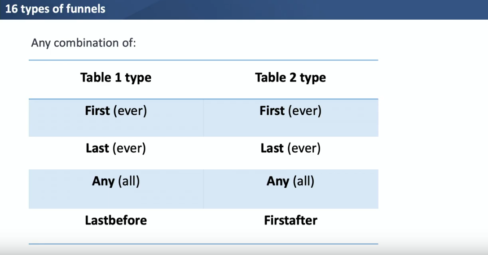

# (PART) Miscellaneous tools {-}

# Advanced relational data  

## fuzzyjoin  
http://varianceexplained.org/fuzzyjoin/reference/index.html  

### inexact matching  


```r
library(fuzzyjoin)
library(janeaustenr)
```


```r
# combine 50 rows into a passage
passages <- tibble(text = prideprejudice) %>%
  group_by(passage = 1 + row_number() %/% 50) %>%
  summarize(text = str_c(text, collapse = " "))

passages
#> # A tibble: 261 x 2
#>   passage text                                                                  
#>     <dbl> <chr>                                                                 
#> 1       1 "PRIDE AND PREJUDICE  By Jane Austen    Chapter 1   It is a truth uni~
#> 2       2 "\"How so? How can it affect them?\"  \"My dear Mr. Bennet,\" replied~
#> 3       3 "are my old friends. I have heard you mention them with consideration~
#> 4       4 "herself, began scolding one of her daughters.  \"Don't keep coughing~
#> 5       5 " The astonishment of the ladies was just what he wished; that of Mrs~
#> 6       6 "married, I shall have nothing to wish for.\"  In a few days Mr. Bing~
#> # ... with 255 more rows
```


```r
characters <- readr::read_csv(
"character,character_regex
Elizabeth,Elizabeth
Darcy,Darcy
Mr. Bennet,Mr. Bennet
Mrs. Bennet,Mrs. Bennet
Jane,Jane
Mary,Mary
Lydia,Lydia
Kitty,Kitty
Wickham,Wickham
Mr. Collins,Collins
Lady Catherine de Bourgh,de Bourgh
Mr. Gardiner,Mr. Gardiner
Mrs. Gardiner,Mrs. Gardiner
Charlotte Lucas,(Charlotte|Lucas)
")

characters
#> # A tibble: 14 x 2
#>   character   character_regex
#>   <chr>       <chr>          
#> 1 Elizabeth   Elizabeth      
#> 2 Darcy       Darcy          
#> 3 Mr. Bennet  Mr. Bennet     
#> 4 Mrs. Bennet Mrs. Bennet    
#> 5 Jane        Jane           
#> 6 Mary        Mary           
#> # ... with 8 more rows
```

Which character appears in most passages(**the dataset with the `text` column must always come first**):  


```r
character_passages <- passages %>% 
  regex_inner_join(characters, by = c("text" = "character_regex"))

character_passages %>% count(character, sort = TRUE)
#> # A tibble: 14 x 2
#>   character       n
#>   <chr>       <int>
#> 1 Elizabeth     227
#> 2 Darcy         159
#> 3 Jane          134
#> 4 Mrs. Bennet    89
#> 5 Wickham        89
#> 6 Lydia          79
#> # ... with 8 more rows
```


```r
# character_passages %>% 
#   select(-character_regex) %>% 
#   pivot_wider(names_from = "character", values_from = "text") %>% 
#   mutate_all(str_length) %>% 
#   mutate_all(~ replace_na(.x, 0))
```


### stringdist


```r
library(fuzzyjoin)
```


```r
misspellings
#> # A tibble: 4,505 x 2
#>   misspelling correct   
#>   <chr>       <chr>     
#> 1 abandonned  abandoned 
#> 2 aberation   aberration
#> 3 abilties    abilities 
#> 4 abilty      ability   
#> 5 abondon     abandon   
#> 6 abbout      about     
#> # ... with 4,499 more rows
```


```r
library(qdapDictionaries)
words <- as_tibble(DICTIONARY)

words
#> # A tibble: 20,137 x 2
#>   word  syllables
#>   <chr>     <dbl>
#> 1 hm            1
#> 2 hmm           1
#> 3 hmmm          1
#> 4 hmph          1
#> 5 mmhmm         2
#> 6 mmhm          2
#> # ... with 20,131 more rows
```


```r
misspellings %>% 
  sample_n(1000) %>% 
  stringdist_inner_join(words, by = c("misspelling" = "word"), max_dist = 1)
#> # A tibble: 764 x 4
#>   misspelling correct    word       syllables
#>   <chr>       <chr>      <chr>          <dbl>
#> 1 exibition   exhibition exhibition         4
#> 2 eminate     emanate    emanate            3
#> 3 eminate     emanate    geminate           3
#> 4 seperatist  separatist separatist         4
#> 5 thyat       that       that               1
#> 6 visable     visible    disable            3
#> # ... with 758 more rows
```


## funneljoin  

blog: https://hookedondata.org/introducing-the-funneljoin-package/

video: https://www.youtube.com/watch?v=-n4XaYHDlG8  


### `after_join()`  


```r
library(funneljoin)
answers <- vroom::vroom("../data/rquestions/Answers.csv") 
questions <- vroom::vroom("../data/rquestions/Questions.csv")
```

Look at the data:

```r
(answers <- answers %>% 
  janitor::clean_names() %>% 
  filter(!is.na(owner_user_id)))
#> # A tibble: 636,662 x 7
#>   id    owner_user_id creation_date  parent_id score is_accepted_ans~ body      
#>   <chr> <chr>         <chr>          <chr>     <dbl> <lgl>            <chr>     
#> 1 79741 3259          2008-09-17T03~ 79709        -1 FALSE            "<p>It's ~
#> 2 79768 6043          2008-09-17T03~ 79709         9 FALSE            "<p>use v~
#> 3 79779 8002          2008-09-17T03~ 79709         0 FALSE            "<p>Third~
#> 4 79827 14257         2008-09-17T03~ 79709         1 FALSE            "<p>I'm n~
#> 5 79893 14928         2008-09-17T04~ 79709         6 FALSE            "<p>Remem~
#> 6 83162 15842         2008-09-17T13~ 77434        70 FALSE            "<p>If yo~
#> # ... with 636,656 more rows

(questions <- questions %>% 
  janitor::clean_names() %>% 
  filter(!is.na(owner_user_id)))
#> # A tibble: 857,160 x 6
#>   id     owner_user_id creation_date   score title            body              
#>   <chr>  <chr>         <chr>           <chr> <chr>            <chr>             
#> 1 77434  14008         2008-09-16T21:~ 171   How to access t~ "<p>Suppose I hav~
#> 2 95007  15842         2008-09-18T17:~ 56    Explain the qua~ "<p>I've been mys~
#> 3 255697 1941213       2008-11-01T15:~ 4     Is there an R p~ "<p>I'm looking f~
#> 4 359438 2173          2008-12-11T14:~ 4     Optimization pa~ "<p>Does anyone k~
#> 5 439526 37751         2009-01-13T15:~ 23    Thinking in Vec~ "<p>I know that R~
#> 6 445059 37751         2009-01-14T23:~ 12    Vectorize my th~ "<p>So earlier I ~
#> # ... with 857,154 more rows
```


```r
first_answer_after_first_question <- questions %>%
  after_left_join(answers,
             by_time = "creation_date",
             by_user = "owner_user_id",
             type = "first-firstafter", 
             suffix = c("_question", "_answer")) 

first_answer_after_first_question
#> # A tibble: 429,900 x 12
#>   id_question owner_user_id creation_date_q~ score_question title body_question
#>   <chr>       <chr>         <chr>            <chr>          <chr> <chr>        
#> 1 "strsplit(~ "'"           '                fixed=TRUE)))   <NA> "colnames(df~
#> 2 "(gsub('[\~ "'\"\""       '                input$txt))    "'\"~  <NA>        
#> 3 "str_repla~ "'\\\\|'"     '                '))             <NA> "</code></pr~
#> 4 "'-'"       "']'"         '                '              "'\"~ "f2=f1.lower~
#> 5 "'B'"       "'C"          '                'D')            <NA> "from &lt;- ~
#> 6 "'"         "'DE"         '                'CA            "', ~ "print(Websi~
#> # ... with 429,894 more rows, and 6 more variables: id_answer <chr>,
#> #   creation_date_answer <chr>, parent_id <chr>, score_answer <dbl>,
#> #   is_accepted_answer <lgl>, body_answer <chr>
```

`type` determines funnel types:  




```r
first_answer_after_first_question %>% 
  summarize_conversions(converted = id_answer)
#> # A tibble: 1 x 3
#>   nb_users nb_conversions pct_converted
#>      <int>          <int>         <dbl>
#> 1   429900          30836        0.0717
```


### funnel in one table


Sometimes you have all the data you need in one table. For example, let’s look at this table of user activity on a website.  


```r
activity <- tibble::tribble(
  ~ "user_id", ~ "event", ~ "timestamp",
  1, "landing", "2019-07-01",
  1, "registration", "2019-07-02",
  1, "purchase", "2019-07-07",
  1, "purchase", "2019-07-10",
  2, "landing", "2019-08-01",
  2, "registration", "2019-08-15",
  3, "landing", "2019-05-01",
  3, "registration", "2019-06-01",
  3, "purchase", "2019-06-04",
  4, "landing", "2019-06-13"
)
```


```r
activity %>%
  funnel_start(moment_type = "landing", 
               moment = "event", 
               tstamp = "timestamp", 
               user = "user_id")
#> # A tibble: 4 x 2
#>   user_id timestamp_landing
#>     <dbl> <chr>            
#> 1       1 2019-07-01       
#> 2       2 2019-08-01       
#> 3       3 2019-05-01       
#> 4       4 2019-06-13
```


```r
activity %>%
  funnel_start(moment_type = "landing", 
               moment = "event", 
               tstamp = "timestamp", 
               user = "user_id") %>%
  funnel_step(moment_type = "registration",
              type = "first-firstafter")
#> # A tibble: 4 x 3
#>   user_id timestamp_landing timestamp_registration
#>     <dbl> <chr>             <chr>                 
#> 1       3 2019-05-01        2019-06-01            
#> 2       4 2019-06-13        <NA>                  
#> 3       1 2019-07-01        2019-07-02            
#> 4       2 2019-08-01        2019-08-15
```


```r
activity %>%
  funnel_start(moment_type = "landing", 
               moment = "event", 
               tstamp = "timestamp", 
               user = "user_id") %>%
  funnel_step(moment_type = "registration",
              type = "first-firstafter") %>% 
  funnel_step(moment_type = "purchase",
              type = "first-firstafter")
#> # A tibble: 4 x 4
#>   user_id timestamp_landing timestamp_registration timestamp_purchase
#>     <dbl> <chr>             <chr>                  <chr>             
#> 1       3 2019-05-01        2019-06-01             2019-06-04        
#> 2       1 2019-07-01        2019-07-02             2019-07-07        
#> 3       2 2019-08-01        2019-08-15             <NA>              
#> 4       4 2019-06-13        <NA>                   <NA>
```

  
## dm  


https://krlmlr.github.io/dm  


```r
# devtools::install_github("krlmlr/dm")
# library(dm)
# dm_nycflights13()
```

