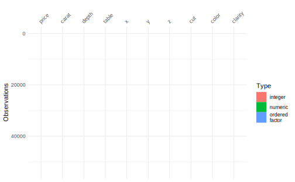
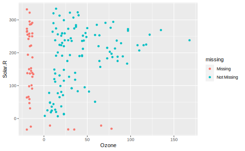

# (PART) Exploring and Wrangling {-} 

# Data summary


## skimr 

**skimr**[@R-skimr] 是由 [rOpenSci project](https://github.com/ropensci) 开发的用于探索性数据分析的包，可以看作增强版的 `summary()`，根据不同的列类型返回整洁有用的统计量。如：  


```r
library(skimr)
skim(iris)
#> -- Data Summary ------------------------
#>                            Values
#> Name                       iris  
#> Number of rows             150   
#> Number of columns          5     
#> _______________________          
#> Column type frequency:           
#>   factor                   1     
#>   numeric                  4     
#> ________________________         
#> Group variables            None  
#> 
#> -- Variable type: factor -------------------------------------------------------
#> # A tibble: 1 x 6
#>   skim_variable n_missing complete_rate ordered n_unique
#> * <chr>             <int>         <dbl> <lgl>      <int>
#> 1 Species               0             1 FALSE          3
#>   top_counts               
#> * <chr>                    
#> 1 set: 50, ver: 50, vir: 50
#> 
#> -- Variable type: numeric ------------------------------------------------------
#> # A tibble: 4 x 11
#>   skim_variable n_missing complete_rate  mean    sd    p0   p25   p50   p75
#> * <chr>             <int>         <dbl> <dbl> <dbl> <dbl> <dbl> <dbl> <dbl>
#> 1 Sepal.Length          0             1  5.84 0.828   4.3   5.1  5.8    6.4
#> 2 Sepal.Width           0             1  3.06 0.436   2     2.8  3      3.3
#> 3 Petal.Length          0             1  3.76 1.77    1     1.6  4.35   5.1
#> 4 Petal.Width           0             1  1.20 0.762   0.1   0.3  1.3    1.8
#>    p100 hist 
#> * <dbl> <chr>
#> 1   7.9 <U+2586><U+2587><U+2587><U+2585><U+2582>
#> 2   4.4 <U+2581><U+2586><U+2587><U+2582><U+2581>
#> 3   6.9 <U+2587><U+2581><U+2586><U+2587><U+2582>
#> 4   2.5 <U+2587><U+2581><U+2587><U+2585><U+2583>
```

由于 `skim()` 的返回结果在 bookdown 里显示效果不太好，这里只给出一个最简单的例子，关于该包的具体使用可见 [Introduction to skimr](https://qiushi.netlify.com/post/introduction-to-skimr/)  

## visdat 


```r
# install.packages("visdat")
library(visdat)
```

https://docs.ropensci.org/visdat/    


```r
vis_dat(ggplot2::diamonds)
```



## summarytools  

由于很多 summarytools 中的函数往往直接生成 markdown 代码，为了在 rmarkdown 正确美观的呈现它们需要同时设置 summarytools 中和 knitr 中的一些全局选项：（详细可见[Recommendations for Using summarytools With Rmarkdown](https://cran.r-project.org/web/packages/summarytools/vignettes/Recommendations-rmarkdown.html#dfsummary)）。  


```r
library(summarytools)
```


```r
st_options(bootstrap.css     = FALSE,       # Already part of the theme so no need for it
           plain.ascii       = FALSE,       # One of the essential settings
           style             = "rmarkdown", # Idem.
           dfSummary.silent  = TRUE,        # Suppresses messages about temporary files
           footnote          = NA,          # Keeping the results minimalistic
           subtitle.emphasis = FALSE)       # For the vignette theme, this gives
                                            # much better results. Your mileage may vary.

st_css()  # This is a must; without it, expect odd layout, especially with dfSummary()
#> <style type="text/css">
#>  img {   background-color: transparent;   border: 0; }  .st-table td, .st-table th {   padding: 8px; }  .st-table > thead > tr {    background-color: #eeeeee; }  .st-cross-table td {   text-align: center; }  .st-descr-table td {   text-align: right; }  table.st-table th {   text-align: center; }  table.st-table > thead > tr {    background-color: #eeeeee; }  table.st-table td span {   display: block; }  table.st-table > tfoot > tr > td {   border:none; }  .st-container {   width: 100%;   padding-right: 15px;   padding-left: 15px;   margin-right: auto;   margin-left: auto;   margin-top: 15px; }  .st-multiline {   white-space: pre; }  .st-table {     width: auto;     table-layout: auto;     margin-top: 20px;     margin-bottom: 20px;     max-width: 100%;     background-color: transparent;     border-collapse: collapse; }  .st-table > thead > tr > th, .st-table > tbody > tr > th, .st-table > tfoot > tr > th, .st-table > thead > tr > td, .st-table > tbody > tr > td, .st-table > tfoot > tr > td {   vertical-align: middle; }  .st-table-bordered {   border: 1px solid #bbbbbb; }  .st-table-bordered > thead > tr > th, .st-table-bordered > tbody > tr > th, .st-table-bordered > thead > tr > td, .st-table-bordered > tbody > tr > td {   border: 1px solid #cccccc; }  .st-table-bordered > thead > tr > th, .st-table-bordered > thead > tr > td, .st-table thead > tr > th {   border-bottom: none; }  .st-freq-table > thead > tr > th, .st-freq-table > tbody > tr > th, .st-freq-table > tfoot > tr > th, .st-freq-table > thead > tr > td, .st-freq-table > tbody > tr > td, .st-freq-table > tfoot > tr > td, .st-freq-table-nomiss > thead > tr > th, .st-freq-table-nomiss > tbody > tr > th, .st-freq-table-nomiss > tfoot > tr > th, .st-freq-table-nomiss > thead > tr > td, .st-freq-table-nomiss > tbody > tr > td, .st-freq-table-nomiss > tfoot > tr > td, .st-cross-table > thead > tr > th, .st-cross-table > tbody > tr > th, .st-cross-table > tfoot > tr > th, .st-cross-table > thead > tr > td, .st-cross-table > tbody > tr > td, .st-cross-table > tfoot > tr > td {   padding-left: 20px;   padding-right: 20px; }  .st-table-bordered > thead > tr > th, .st-table-bordered > tbody > tr > th, .st-table-bordered > thead > tr > td, .st-table-bordered > tbody > tr > td {   border: 1px solid #cccccc; }  .st-table-striped > tbody > tr:nth-of-type(odd) {   background-color: #ffffff; }  .st-table-striped > tbody > tr:nth-of-type(even) {   background-color: #f9f9f9; }  .st-descr-table > thead > tr > th, .st-descr-table > tbody > tr > th, .st-descr-table > thead > tr > td, .st-descr-table > tbody > tr > td {   padding-left: 24px;   padding-right: 24px;   word-wrap: break-word; }  .st-freq-table, .st-freq-table-nomiss, .st-cross-table {   border: medium none; }  .st-freq-table > thead > tr:nth-child(1) > th:nth-child(1), .st-cross-table > thead > tr:nth-child(1) > th:nth-child(1), .st-cross-table > thead > tr:nth-child(1) > th:nth-child(3) {   border: none;   background-color: #ffffff;   text-align: center; }  .st-protect-top-border {   border-top: 1px solid #cccccc !important; }  .st-ws-char {   display: inline;   color: #999999;   letter-spacing: 0.2em; }  /* Optionnal classes */ .st-small {   font-size: 13px; }  .st-small td, .st-small th {   padding: 8px; }  .st-small > thead > tr > th, .st-small > tbody > tr > th, .st-small > thead > tr > td, .st-small > tbody > tr > td {   padding-left: 12px;   padding-right: 12px; } </style>
```


```r
library(knitr)
opts_chunk$set(comment = NA, 
               prompt = FALSE,
               results='asis',
               collapse = FALSE)
```

如果之前没有设置 `collpase = TRUE`, `collapse = FALSE` 不是必要的


### `freq`


```r
freq(iris$Species, plain.ascii = FALSE, style = "rmarkdown", headings = FALSE)
```


|         &nbsp; | Freq | % Valid | % Valid Cum. | % Total | % Total Cum. |
|---------------:|-----:|--------:|-------------:|--------:|-------------:|
|     **setosa** |   50 |   33.33 |        33.33 |   33.33 |        33.33 |
| **versicolor** |   50 |   33.33 |        66.67 |   33.33 |        66.67 |
|  **virginica** |   50 |   33.33 |       100.00 |   33.33 |       100.00 |
|     **\<NA\>** |    0 |         |              |    0.00 |       100.00 |
|      **Total** |  150 |  100.00 |       100.00 |  100.00 |       100.00 |


```r
freq(iris$Species, report.nas = FALSE, headings = FALSE)
```

                   Freq        %   % Cum.
---------------- ------ -------- --------
          setosa     50    33.33    33.33
      versicolor     50    33.33    66.67
       virginica     50    33.33   100.00
           Total    150   100.00   100.00


```r
freq(iris$Species, report.nas = FALSE, totals = FALSE,
     cumul = FALSE, style = "rmarkdown", headings = FALSE)
```


|         &nbsp; | Freq |     % |
|---------------:|-----:|------:|
|     **setosa** |   50 | 33.33 |
| **versicolor** |   50 | 33.33 |
|  **virginica** |   50 | 33.33 |


### `descr()`  


```r
descr(iris)
#> Descriptive Statistics  
#> iris  
#> N: 150  
#> 
#>                     Petal.Length   Petal.Width   Sepal.Length   Sepal.Width
#> ----------------- -------------- ------------- -------------- -------------
#>              Mean           3.76          1.20           5.84          3.06
#>           Std.Dev           1.77          0.76           0.83          0.44
#>               Min           1.00          0.10           4.30          2.00
#>                Q1           1.60          0.30           5.10          2.80
#>            Median           4.35          1.30           5.80          3.00
#>                Q3           5.10          1.80           6.40          3.30
#>               Max           6.90          2.50           7.90          4.40
#>               MAD           1.85          1.04           1.04          0.44
#>               IQR           3.50          1.50           1.30          0.50
#>                CV           0.47          0.64           0.14          0.14
#>          Skewness          -0.27         -0.10           0.31          0.31
#>       SE.Skewness           0.20          0.20           0.20          0.20
#>          Kurtosis          -1.42         -1.36          -0.61          0.14
#>           N.Valid         150.00        150.00         150.00        150.00
#>         Pct.Valid         100.00        100.00         100.00        100.00
```

## gt and gtsummary  


```r
# devtools::install_github("rstudio/gt")
# install.packages("gtsummary")
library(gt)
library(gtsummary)
```


```r
tbl_summary(
    data = trial[c("trt", "age", "grade", "response")],
    by = trt
  ) %>%
  add_p() 
#> <style>html {
#>   font-family: -apple-system, BlinkMacSystemFont, 'Segoe UI', Roboto, Oxygen, Ubuntu, Cantarell, 'Helvetica Neue', 'Fira Sans', 'Droid Sans', Arial, sans-serif;
#> }
#> 
#> #yfzokgxden .gt_table {
#>   display: table;
#>   border-collapse: collapse;
#>   margin-left: auto;
#>   margin-right: auto;
#>   color: #333333;
#>   font-size: 16px;
#>   background-color: #FFFFFF;
#>   width: auto;
#>   border-top-style: solid;
#>   border-top-width: 2px;
#>   border-top-color: #A8A8A8;
#>   border-right-style: none;
#>   border-right-width: 2px;
#>   border-right-color: #D3D3D3;
#>   border-bottom-style: solid;
#>   border-bottom-width: 2px;
#>   border-bottom-color: #A8A8A8;
#>   border-left-style: none;
#>   border-left-width: 2px;
#>   border-left-color: #D3D3D3;
#> }
#> 
#> #yfzokgxden .gt_heading {
#>   background-color: #FFFFFF;
#>   text-align: center;
#>   border-bottom-color: #FFFFFF;
#>   border-left-style: none;
#>   border-left-width: 1px;
#>   border-left-color: #D3D3D3;
#>   border-right-style: none;
#>   border-right-width: 1px;
#>   border-right-color: #D3D3D3;
#> }
#> 
#> #yfzokgxden .gt_title {
#>   color: #333333;
#>   font-size: 125%;
#>   font-weight: initial;
#>   padding-top: 4px;
#>   padding-bottom: 4px;
#>   border-bottom-color: #FFFFFF;
#>   border-bottom-width: 0;
#> }
#> 
#> #yfzokgxden .gt_subtitle {
#>   color: #333333;
#>   font-size: 85%;
#>   font-weight: initial;
#>   padding-top: 0;
#>   padding-bottom: 4px;
#>   border-top-color: #FFFFFF;
#>   border-top-width: 0;
#> }
#> 
#> #yfzokgxden .gt_bottom_border {
#>   border-bottom-style: solid;
#>   border-bottom-width: 2px;
#>   border-bottom-color: #D3D3D3;
#> }
#> 
#> #yfzokgxden .gt_col_headings {
#>   border-top-style: solid;
#>   border-top-width: 2px;
#>   border-top-color: #D3D3D3;
#>   border-bottom-style: solid;
#>   border-bottom-width: 2px;
#>   border-bottom-color: #D3D3D3;
#>   border-left-style: none;
#>   border-left-width: 1px;
#>   border-left-color: #D3D3D3;
#>   border-right-style: none;
#>   border-right-width: 1px;
#>   border-right-color: #D3D3D3;
#> }
#> 
#> #yfzokgxden .gt_col_heading {
#>   color: #333333;
#>   background-color: #FFFFFF;
#>   font-size: 100%;
#>   font-weight: normal;
#>   text-transform: inherit;
#>   border-left-style: none;
#>   border-left-width: 1px;
#>   border-left-color: #D3D3D3;
#>   border-right-style: none;
#>   border-right-width: 1px;
#>   border-right-color: #D3D3D3;
#>   vertical-align: bottom;
#>   padding-top: 5px;
#>   padding-bottom: 6px;
#>   padding-left: 5px;
#>   padding-right: 5px;
#>   overflow-x: hidden;
#> }
#> 
#> #yfzokgxden .gt_column_spanner_outer {
#>   color: #333333;
#>   background-color: #FFFFFF;
#>   font-size: 100%;
#>   font-weight: normal;
#>   text-transform: inherit;
#>   padding-top: 0;
#>   padding-bottom: 0;
#>   padding-left: 4px;
#>   padding-right: 4px;
#> }
#> 
#> #yfzokgxden .gt_column_spanner_outer:first-child {
#>   padding-left: 0;
#> }
#> 
#> #yfzokgxden .gt_column_spanner_outer:last-child {
#>   padding-right: 0;
#> }
#> 
#> #yfzokgxden .gt_column_spanner {
#>   border-bottom-style: solid;
#>   border-bottom-width: 2px;
#>   border-bottom-color: #D3D3D3;
#>   vertical-align: bottom;
#>   padding-top: 5px;
#>   padding-bottom: 6px;
#>   overflow-x: hidden;
#>   display: inline-block;
#>   width: 100%;
#> }
#> 
#> #yfzokgxden .gt_group_heading {
#>   padding: 8px;
#>   color: #333333;
#>   background-color: #FFFFFF;
#>   font-size: 100%;
#>   font-weight: initial;
#>   text-transform: inherit;
#>   border-top-style: solid;
#>   border-top-width: 2px;
#>   border-top-color: #D3D3D3;
#>   border-bottom-style: solid;
#>   border-bottom-width: 2px;
#>   border-bottom-color: #D3D3D3;
#>   border-left-style: none;
#>   border-left-width: 1px;
#>   border-left-color: #D3D3D3;
#>   border-right-style: none;
#>   border-right-width: 1px;
#>   border-right-color: #D3D3D3;
#>   vertical-align: middle;
#> }
#> 
#> #yfzokgxden .gt_empty_group_heading {
#>   padding: 0.5px;
#>   color: #333333;
#>   background-color: #FFFFFF;
#>   font-size: 100%;
#>   font-weight: initial;
#>   border-top-style: solid;
#>   border-top-width: 2px;
#>   border-top-color: #D3D3D3;
#>   border-bottom-style: solid;
#>   border-bottom-width: 2px;
#>   border-bottom-color: #D3D3D3;
#>   vertical-align: middle;
#> }
#> 
#> #yfzokgxden .gt_striped {
#>   background-color: rgba(128, 128, 128, 0.05);
#> }
#> 
#> #yfzokgxden .gt_from_md > :first-child {
#>   margin-top: 0;
#> }
#> 
#> #yfzokgxden .gt_from_md > :last-child {
#>   margin-bottom: 0;
#> }
#> 
#> #yfzokgxden .gt_row {
#>   padding-top: 8px;
#>   padding-bottom: 8px;
#>   padding-left: 5px;
#>   padding-right: 5px;
#>   margin: 10px;
#>   border-top-style: solid;
#>   border-top-width: 1px;
#>   border-top-color: #D3D3D3;
#>   border-left-style: none;
#>   border-left-width: 1px;
#>   border-left-color: #D3D3D3;
#>   border-right-style: none;
#>   border-right-width: 1px;
#>   border-right-color: #D3D3D3;
#>   vertical-align: middle;
#>   overflow-x: hidden;
#> }
#> 
#> #yfzokgxden .gt_stub {
#>   color: #333333;
#>   background-color: #FFFFFF;
#>   font-size: 100%;
#>   font-weight: initial;
#>   text-transform: inherit;
#>   border-right-style: solid;
#>   border-right-width: 2px;
#>   border-right-color: #D3D3D3;
#>   padding-left: 12px;
#> }
#> 
#> #yfzokgxden .gt_summary_row {
#>   color: #333333;
#>   background-color: #FFFFFF;
#>   text-transform: inherit;
#>   padding-top: 8px;
#>   padding-bottom: 8px;
#>   padding-left: 5px;
#>   padding-right: 5px;
#> }
#> 
#> #yfzokgxden .gt_first_summary_row {
#>   padding-top: 8px;
#>   padding-bottom: 8px;
#>   padding-left: 5px;
#>   padding-right: 5px;
#>   border-top-style: solid;
#>   border-top-width: 2px;
#>   border-top-color: #D3D3D3;
#> }
#> 
#> #yfzokgxden .gt_grand_summary_row {
#>   color: #333333;
#>   background-color: #FFFFFF;
#>   text-transform: inherit;
#>   padding-top: 8px;
#>   padding-bottom: 8px;
#>   padding-left: 5px;
#>   padding-right: 5px;
#> }
#> 
#> #yfzokgxden .gt_first_grand_summary_row {
#>   padding-top: 8px;
#>   padding-bottom: 8px;
#>   padding-left: 5px;
#>   padding-right: 5px;
#>   border-top-style: double;
#>   border-top-width: 6px;
#>   border-top-color: #D3D3D3;
#> }
#> 
#> #yfzokgxden .gt_table_body {
#>   border-top-style: solid;
#>   border-top-width: 2px;
#>   border-top-color: #D3D3D3;
#>   border-bottom-style: solid;
#>   border-bottom-width: 2px;
#>   border-bottom-color: #D3D3D3;
#> }
#> 
#> #yfzokgxden .gt_footnotes {
#>   color: #333333;
#>   background-color: #FFFFFF;
#>   border-bottom-style: none;
#>   border-bottom-width: 2px;
#>   border-bottom-color: #D3D3D3;
#>   border-left-style: none;
#>   border-left-width: 2px;
#>   border-left-color: #D3D3D3;
#>   border-right-style: none;
#>   border-right-width: 2px;
#>   border-right-color: #D3D3D3;
#> }
#> 
#> #yfzokgxden .gt_footnote {
#>   margin: 0px;
#>   font-size: 90%;
#>   padding: 4px;
#> }
#> 
#> #yfzokgxden .gt_sourcenotes {
#>   color: #333333;
#>   background-color: #FFFFFF;
#>   border-bottom-style: none;
#>   border-bottom-width: 2px;
#>   border-bottom-color: #D3D3D3;
#>   border-left-style: none;
#>   border-left-width: 2px;
#>   border-left-color: #D3D3D3;
#>   border-right-style: none;
#>   border-right-width: 2px;
#>   border-right-color: #D3D3D3;
#> }
#> 
#> #yfzokgxden .gt_sourcenote {
#>   font-size: 90%;
#>   padding: 4px;
#> }
#> 
#> #yfzokgxden .gt_left {
#>   text-align: left;
#> }
#> 
#> #yfzokgxden .gt_center {
#>   text-align: center;
#> }
#> 
#> #yfzokgxden .gt_right {
#>   text-align: right;
#>   font-variant-numeric: tabular-nums;
#> }
#> 
#> #yfzokgxden .gt_font_normal {
#>   font-weight: normal;
#> }
#> 
#> #yfzokgxden .gt_font_bold {
#>   font-weight: bold;
#> }
#> 
#> #yfzokgxden .gt_font_italic {
#>   font-style: italic;
#> }
#> 
#> #yfzokgxden .gt_super {
#>   font-size: 65%;
#> }
#> 
#> #yfzokgxden .gt_footnote_marks {
#>   font-style: italic;
#>   font-size: 65%;
#> }
#> </style>
#> <div id="yfzokgxden" style="overflow-x:auto;overflow-y:auto;width:auto;height:auto;"><table class="gt_table">
#>   
#>   <thead class="gt_col_headings">
#>     <tr>
#>       <th class="gt_col_heading gt_columns_bottom_border gt_left" rowspan="1" colspan="1"><strong>Characteristic</strong></th>
#>       <th class="gt_col_heading gt_columns_bottom_border gt_center" rowspan="1" colspan="1"><strong>Drug A</strong>, N = 98<sup class="gt_footnote_marks">1</sup></th>
#>       <th class="gt_col_heading gt_columns_bottom_border gt_center" rowspan="1" colspan="1"><strong>Drug B</strong>, N = 102<sup class="gt_footnote_marks">1</sup></th>
#>       <th class="gt_col_heading gt_columns_bottom_border gt_center" rowspan="1" colspan="1"><strong>p-value</strong><sup class="gt_footnote_marks">2</sup></th>
#>     </tr>
#>   </thead>
#>   <tbody class="gt_table_body">
#>     <tr>
#>       <td class="gt_row gt_left">Age, yrs</td>
#>       <td class="gt_row gt_center">46 (37, 59)</td>
#>       <td class="gt_row gt_center">48 (39, 56)</td>
#>       <td class="gt_row gt_center">0.7</td>
#>     </tr>
#>     <tr>
#>       <td class="gt_row gt_left" style="text-align: left; text-indent: 10px;">Unknown</td>
#>       <td class="gt_row gt_center">7</td>
#>       <td class="gt_row gt_center">4</td>
#>       <td class="gt_row gt_center"></td>
#>     </tr>
#>     <tr>
#>       <td class="gt_row gt_left">Grade</td>
#>       <td class="gt_row gt_center"></td>
#>       <td class="gt_row gt_center"></td>
#>       <td class="gt_row gt_center">0.9</td>
#>     </tr>
#>     <tr>
#>       <td class="gt_row gt_left" style="text-align: left; text-indent: 10px;">I</td>
#>       <td class="gt_row gt_center">35 (36%)</td>
#>       <td class="gt_row gt_center">33 (32%)</td>
#>       <td class="gt_row gt_center"></td>
#>     </tr>
#>     <tr>
#>       <td class="gt_row gt_left" style="text-align: left; text-indent: 10px;">II</td>
#>       <td class="gt_row gt_center">32 (33%)</td>
#>       <td class="gt_row gt_center">36 (35%)</td>
#>       <td class="gt_row gt_center"></td>
#>     </tr>
#>     <tr>
#>       <td class="gt_row gt_left" style="text-align: left; text-indent: 10px;">III</td>
#>       <td class="gt_row gt_center">31 (32%)</td>
#>       <td class="gt_row gt_center">33 (32%)</td>
#>       <td class="gt_row gt_center"></td>
#>     </tr>
#>     <tr>
#>       <td class="gt_row gt_left">Tumor Response</td>
#>       <td class="gt_row gt_center">28 (29%)</td>
#>       <td class="gt_row gt_center">33 (34%)</td>
#>       <td class="gt_row gt_center">0.6</td>
#>     </tr>
#>     <tr>
#>       <td class="gt_row gt_left" style="text-align: left; text-indent: 10px;">Unknown</td>
#>       <td class="gt_row gt_center">3</td>
#>       <td class="gt_row gt_center">4</td>
#>       <td class="gt_row gt_center"></td>
#>     </tr>
#>   </tbody>
#>   
#>   <tfoot>
#>     <tr class="gt_footnotes">
#>       <td colspan="4">
#>         <p class="gt_footnote">
#>           <sup class="gt_footnote_marks">
#>             <em>1</em>
#>           </sup>
#>            
#>           Statistics presented: median (IQR); n (%)
#>           <br />
#>         </p>
#>         <p class="gt_footnote">
#>           <sup class="gt_footnote_marks">
#>             <em>2</em>
#>           </sup>
#>            
#>           Statistical tests performed: Wilcoxon rank-sum test; chi-square test of independence
#>           <br />
#>         </p>
#>       </td>
#>     </tr>
#>   </tfoot>
#> </table></div>
```

## naniar  


```r
library(naniar)
ggplot(data = airquality,
       aes(x = Ozone,
           y = Solar.R)) +
  geom_miss_point()
```



