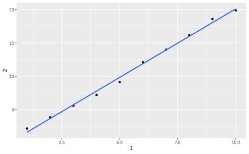

# tibble: Modern data frames


Tibbles are a modern reimagining of the trandition `data.frame`, keeping what time has shown to be effective, and throwing out what is not (`stringasFactors = TRUE`), with nicer display when obseravtions exceeds 20 rows. The usage of tibble also underlyies one of the principles of the whole tidyverse universe. In most places, I’ll use the term tibble and data frame interchangeably; when I want to draw particular attention to R’s built-in data frame, I’ll call them `data.frame`s.  


## Introduction  {#tibble-intro}

Almost all of the functions that you’ll use in the tidyverse produce tibbles. To coerce a `data.frame` into tibble, we can use `as_tibble()`:  


```r
class(iris)
#> [1] "data.frame"
## 转换为 tibble
iris_tibble <- as_tibble(iris)
iris_tibble
#> # A tibble: 150 x 5
#>   Sepal.Length Sepal.Width Petal.Length Petal.Width Species
#>          <dbl>       <dbl>        <dbl>       <dbl> <fct>  
#> 1          5.1         3.5          1.4         0.2 setosa 
#> 2          4.9         3            1.4         0.2 setosa 
#> 3          4.7         3.2          1.3         0.2 setosa 
#> 4          4.6         3.1          1.5         0.2 setosa 
#> 5          5           3.6          1.4         0.2 setosa 
#> 6          5.4         3.9          1.7         0.4 setosa 
#> # ... with 144 more rows
```


相比于 `data.frame()` ，`tibble()` 创建数据矿的附加操作要少的多：它不能改变输入的类型（例如，不会默认将字符串转变为因子)、变量的名称,也不能创建行名称。  


有些比较旧的函数不支持 `tibble`，如果遇到这种函数，可以使用 `as_data_frame()` 转换到传统的 `data.frame` 上。  

`add_row(.data, ..., .before = NULL, .after = NULL)` s a convenient way to add one or more rows of data to an existing data frame. `...` should be name-value pairs corresponding to column names and its value. By default new row are added after the last row.   


```r
# add_row ---------------------------------
df <- tibble(x = 1:3, y = 3:1)

add_row(df, x = 4, y = 0)
#> # A tibble: 4 x 2
#>       x     y
#>   <dbl> <dbl>
#> 1     1     3
#> 2     2     2
#> 3     3     1
#> 4     4     0

# You can specify where to add the new rows
add_row(df, x = 4, y = 0, .before = 2)
#> # A tibble: 4 x 2
#>       x     y
#>   <dbl> <dbl>
#> 1     1     3
#> 2     4     0
#> 3     2     2
#> 4     3     1


# You can supply vectors, to add multiple rows (this isn't
# recommended because it's a bit hard to read)
add_row(df, x = 4:5, y = 0:-1)
#> # A tibble: 5 x 2
#>       x     y
#>   <int> <int>
#> 1     1     3
#> 2     2     2
#> 3     3     1
#> 4     4     0
#> 5     5    -1

# Absent variables get missing values
add_row(df, x = 4)
#> # A tibble: 4 x 2
#>       x     y
#>   <dbl> <int>
#> 1     1     3
#> 2     2     2
#> 3     3     1
#> 4     4    NA
```

Yet we cannot create new variables with `add_row`:  


```r
add_row(df, z = 0)
#> Error: New rows can't add columns.
#> x Can't find column `z` in `.data`.
```


`enframe()` converts named atomic vectors or lists to one- or two-column data frames . For vectors with more than 2 elements, a list column is created.  


```r
enframe(c(a = 1, b = 2))
#> # A tibble: 2 x 2
#>   name  value
#>   <chr> <dbl>
#> 1 a         1
#> 2 b         2
# For unnamed vectors, the natural sequence is used as name column.
enframe(1:2)
#> # A tibble: 2 x 2
#>    name value
#>   <int> <int>
#> 1     1     1
#> 2     2     2
# vectors with more than 2 elements
enframe(1:3)
#> # A tibble: 3 x 2
#>    name value
#>   <int> <int>
#> 1     1     1
#> 2     2     2
#> 3     3     3
```


For a list, the result will also be a list column.  


```r
enframe(list(one = 1, two = 2:3, three = 4:6, four = "four"))
#> # A tibble: 4 x 2
#>   name  value    
#>   <chr> <list>   
#> 1 one   <dbl [1]>
#> 2 two   <int [2]>
#> 3 three <int [3]>
#> 4 four  <chr [1]>
```


`deframe()` is the opposite of `enframe()`  


```r
list(one = 1, two = 2:3, three = 4:6, four = "four") %>%
  enframe() %>% 
  deframe()
#> $one
#> [1] 1
#> 
#> $two
#> [1] 2 3
#> 
#> $three
#> [1] 4 5 6
#> 
#> $four
#> [1] "four"
```


## Comparing tibble and data.frame {#tibble-data.frame}

`tibble` 和传统 `data.frame` 的机理主要有三处不同：创建、打印和取子集。


### Creating  

`tibble()` 创建一个 `tibble`

```r
df <- tibble(
  x = 1:3,
  y = c("a","b","c")
)

df
#> # A tibble: 3 x 2
#>       x y    
#>   <int> <chr>
#> 1     1 a    
#> 2     2 b    
#> 3     3 c
```

可以发现 `tibble()` 不会默认更改 `y` 类型，它将原原本本地被当做一个字符向量处理。


而 `data.frame()` 用于创建一个传统数据框：  


```r
df <- data.frame(
  x = 1:3, 
  y = c("a", "b", "c")
)

str(df)
#> 'data.frame':	3 obs. of  2 variables:
#>  $ x: int  1 2 3
#>  $ y: Factor w/ 3 levels "a","b","c": 1 2 3
```

#### Coersion  

在 `data.frame` 中，为了防止 `y` 被强制转换为因子，必须设置 `stringAsFactors = FALSE`  


```r
df <- data.frame(
  x = 1:3, 
  y = c("a", "b", "c"),
  stringsAsFactors = F
)

str(df)
#> 'data.frame':	3 obs. of  2 variables:
#>  $ x: int  1 2 3
#>  $ y: chr  "a" "b" "c"
```


By the way, 创建 `tibble` 的另一种方法是使用`tribble()`，transposed tibble 的缩写。`tribble()` 是高度定制化的，就像在 Markdown 中创建表格一样，一个一个填入元素：列标题以波浪线 `~` 开头，不同列的元素之间以逗号分隔，这样就可以用易读的方式对少量数据创建一个 `tibble` ：    

```r
tribble(
  ~x, ~y, ~z,
  "a", 1, 2,
  "b", 1, 8.5
)
#> # A tibble: 2 x 3
#>   x         y     z
#>   <chr> <dbl> <dbl>
#> 1 a         1   2  
#> 2 b         1   8.5
```


#### Row labels  

`data.frame` 支持提供一个不包含重复元素的字符向量作为行标签：  


```r
df <- data.frame(
  age = c(35, 27, 18),
  hair = c("blond", "brown", "black"),
  row.names = c("Bob", "Susan", "Sam")
)

df
#>       age  hair
#> Bob    35 blond
#> Susan  27 brown
#> Sam    18 black
attributes(df)
#> $names
#> [1] "age"  "hair"
#> 
#> $class
#> [1] "data.frame"
#> 
#> $row.names
#> [1] "Bob"   "Susan" "Sam"
```


`row.names`参数为`data.frame`创建了一个同名的属性，`rownames()`函数可以提取这个属性： 

```r
rownames(df)
#> [1] "Bob"   "Susan" "Sam"
```


如果我们认为数据框是二维矩阵的自然拓展(不止包含数值)，那么行标签的存在似乎是很自然的，毕竟矩阵有`i`、`j`两个索引。但是矩阵和数据框有本质区别，矩阵是添加了维度属性的原子向量，数据框则是列表，我们可以对矩阵取转置，因为它们的行和列可以互换，一个矩阵的转置是另一个矩阵。数据框则是不可转置的，它的行列互换之后就不再是数据框(一行未必能构成一个原子向量)。  


出于以下三个原因，我们不应该使用`row.names`这一属性，也不应该考虑在任何场合添加行标签：  

1. 元数据也是数据，所以把行标签从其他变量中抽出来单独对待不是个好主意。否则我们可能要对行标签单独发展出一套操作工具，而不能直接应用我们已经习惯的对变量的操作方法  
2. 行标签很多时候不能完成唯一标识观测的任务，因为 `row.names` 要求只能传入数值或者字符串向量。如果我们想要用时间日期型数据标识观测呢？或者需要传入不止一个向量(例如标识位置同时需要经度和纬度)  
3. 行标签中的元素必须是唯一的，但很多场合(比如bootstrapping)中同一个对象也可能有多条记录  

所以，`tibble` 的设计思想就是不支持添加行标签，且提供了一套很方便的、处理已有行标签的工具，要么移除它，要么把它直接变成`tibble`中的一列： 

**Tools for working with row names**  
*Description*  
While a tibble can have row names (e.g., when converting from a regular data frame), they are removed when subsetting with the [ operator. A warning will be raised when attempting to assign non-NULL row names to a tibble. Generally, it is best to avoid row names, because they are basically a character column with different semantics to every other column. These functions allow to you detect if a data frame has row names (`has_rownames()`), remove them (`remove_rownames()`), or convert them back-and-forth between an explicit column (`rownames_to_column()` and `column_to_rownames()`). Also included is `rowid_to_column()` which adds a column at the start of the dataframe of ascending sequential row ids starting at 1. **Note that this will remove any existing row names**.  

*Usage*  
`has_rownames(.data)`  

`remove_rownames(.data)`  

`rownames_to_column(.data, var = "rowname")`  

`rowid_to_column(.data, var = "rowid")`  

`column_to_rownames(.data, var = "rowname")`  

*Arguments*  
`.data`    
A data frame.  

*var*
Name of column to use for rownames.   

*Value*   
`column_to_rownames()` always returns a data frame. `has_rownames()` returns a scalar logical. All other functions return an object of the same class as the input.

一些示例： 


```r
mtcars %>% 
  has_rownames()
#> [1] TRUE

mtcars %>%
  remove_rownames()
#>     mpg cyl  disp  hp drat   wt qsec vs am gear carb
#> 1  21.0   6 160.0 110 3.90 2.62 16.5  0  1    4    4
#> 2  21.0   6 160.0 110 3.90 2.88 17.0  0  1    4    4
#> 3  22.8   4 108.0  93 3.85 2.32 18.6  1  1    4    1
#> 4  21.4   6 258.0 110 3.08 3.21 19.4  1  0    3    1
#> 5  18.7   8 360.0 175 3.15 3.44 17.0  0  0    3    2
#> 6  18.1   6 225.0 105 2.76 3.46 20.2  1  0    3    1
#> 7  14.3   8 360.0 245 3.21 3.57 15.8  0  0    3    4
#> 8  24.4   4 146.7  62 3.69 3.19 20.0  1  0    4    2
#> 9  22.8   4 140.8  95 3.92 3.15 22.9  1  0    4    2
#> 10 19.2   6 167.6 123 3.92 3.44 18.3  1  0    4    4
#> 11 17.8   6 167.6 123 3.92 3.44 18.9  1  0    4    4
#> 12 16.4   8 275.8 180 3.07 4.07 17.4  0  0    3    3
#> 13 17.3   8 275.8 180 3.07 3.73 17.6  0  0    3    3
#> 14 15.2   8 275.8 180 3.07 3.78 18.0  0  0    3    3
#> 15 10.4   8 472.0 205 2.93 5.25 18.0  0  0    3    4
#> 16 10.4   8 460.0 215 3.00 5.42 17.8  0  0    3    4
#> 17 14.7   8 440.0 230 3.23 5.34 17.4  0  0    3    4
#> 18 32.4   4  78.7  66 4.08 2.20 19.5  1  1    4    1
#> 19 30.4   4  75.7  52 4.93 1.61 18.5  1  1    4    2
#> 20 33.9   4  71.1  65 4.22 1.83 19.9  1  1    4    1
#> 21 21.5   4 120.1  97 3.70 2.46 20.0  1  0    3    1
#> 22 15.5   8 318.0 150 2.76 3.52 16.9  0  0    3    2
#> 23 15.2   8 304.0 150 3.15 3.44 17.3  0  0    3    2
#> 24 13.3   8 350.0 245 3.73 3.84 15.4  0  0    3    4
#> 25 19.2   8 400.0 175 3.08 3.85 17.1  0  0    3    2
#> 26 27.3   4  79.0  66 4.08 1.94 18.9  1  1    4    1
#> 27 26.0   4 120.3  91 4.43 2.14 16.7  0  1    5    2
#> 28 30.4   4  95.1 113 3.77 1.51 16.9  1  1    5    2
#> 29 15.8   8 351.0 264 4.22 3.17 14.5  0  1    5    4
#> 30 19.7   6 145.0 175 3.62 2.77 15.5  0  1    5    6
#> 31 15.0   8 301.0 335 3.54 3.57 14.6  0  1    5    8
#> 32 21.4   4 121.0 109 4.11 2.78 18.6  1  1    4    2


mtcars %>% 
  rownames_to_column(var = "car_type")
#>               car_type  mpg cyl  disp  hp drat   wt qsec vs am gear carb
#> 1            Mazda RX4 21.0   6 160.0 110 3.90 2.62 16.5  0  1    4    4
#> 2        Mazda RX4 Wag 21.0   6 160.0 110 3.90 2.88 17.0  0  1    4    4
#> 3           Datsun 710 22.8   4 108.0  93 3.85 2.32 18.6  1  1    4    1
#> 4       Hornet 4 Drive 21.4   6 258.0 110 3.08 3.21 19.4  1  0    3    1
#> 5    Hornet Sportabout 18.7   8 360.0 175 3.15 3.44 17.0  0  0    3    2
#> 6              Valiant 18.1   6 225.0 105 2.76 3.46 20.2  1  0    3    1
#> 7           Duster 360 14.3   8 360.0 245 3.21 3.57 15.8  0  0    3    4
#> 8            Merc 240D 24.4   4 146.7  62 3.69 3.19 20.0  1  0    4    2
#> 9             Merc 230 22.8   4 140.8  95 3.92 3.15 22.9  1  0    4    2
#> 10            Merc 280 19.2   6 167.6 123 3.92 3.44 18.3  1  0    4    4
#> 11           Merc 280C 17.8   6 167.6 123 3.92 3.44 18.9  1  0    4    4
#> 12          Merc 450SE 16.4   8 275.8 180 3.07 4.07 17.4  0  0    3    3
#> 13          Merc 450SL 17.3   8 275.8 180 3.07 3.73 17.6  0  0    3    3
#> 14         Merc 450SLC 15.2   8 275.8 180 3.07 3.78 18.0  0  0    3    3
#> 15  Cadillac Fleetwood 10.4   8 472.0 205 2.93 5.25 18.0  0  0    3    4
#> 16 Lincoln Continental 10.4   8 460.0 215 3.00 5.42 17.8  0  0    3    4
#> 17   Chrysler Imperial 14.7   8 440.0 230 3.23 5.34 17.4  0  0    3    4
#> 18            Fiat 128 32.4   4  78.7  66 4.08 2.20 19.5  1  1    4    1
#> 19         Honda Civic 30.4   4  75.7  52 4.93 1.61 18.5  1  1    4    2
#> 20      Toyota Corolla 33.9   4  71.1  65 4.22 1.83 19.9  1  1    4    1
#> 21       Toyota Corona 21.5   4 120.1  97 3.70 2.46 20.0  1  0    3    1
#> 22    Dodge Challenger 15.5   8 318.0 150 2.76 3.52 16.9  0  0    3    2
#> 23         AMC Javelin 15.2   8 304.0 150 3.15 3.44 17.3  0  0    3    2
#> 24          Camaro Z28 13.3   8 350.0 245 3.73 3.84 15.4  0  0    3    4
#> 25    Pontiac Firebird 19.2   8 400.0 175 3.08 3.85 17.1  0  0    3    2
#> 26           Fiat X1-9 27.3   4  79.0  66 4.08 1.94 18.9  1  1    4    1
#> 27       Porsche 914-2 26.0   4 120.3  91 4.43 2.14 16.7  0  1    5    2
#> 28        Lotus Europa 30.4   4  95.1 113 3.77 1.51 16.9  1  1    5    2
#> 29      Ford Pantera L 15.8   8 351.0 264 4.22 3.17 14.5  0  1    5    4
#> 30        Ferrari Dino 19.7   6 145.0 175 3.62 2.77 15.5  0  1    5    6
#> 31       Maserati Bora 15.0   8 301.0 335 3.54 3.57 14.6  0  1    5    8
#> 32          Volvo 142E 21.4   4 121.0 109 4.11 2.78 18.6  1  1    4    2

mtcars %>% 
  rowid_to_column()
#>    rowid  mpg cyl  disp  hp drat   wt qsec vs am gear carb
#> 1      1 21.0   6 160.0 110 3.90 2.62 16.5  0  1    4    4
#> 2      2 21.0   6 160.0 110 3.90 2.88 17.0  0  1    4    4
#> 3      3 22.8   4 108.0  93 3.85 2.32 18.6  1  1    4    1
#> 4      4 21.4   6 258.0 110 3.08 3.21 19.4  1  0    3    1
#> 5      5 18.7   8 360.0 175 3.15 3.44 17.0  0  0    3    2
#> 6      6 18.1   6 225.0 105 2.76 3.46 20.2  1  0    3    1
#> 7      7 14.3   8 360.0 245 3.21 3.57 15.8  0  0    3    4
#> 8      8 24.4   4 146.7  62 3.69 3.19 20.0  1  0    4    2
#> 9      9 22.8   4 140.8  95 3.92 3.15 22.9  1  0    4    2
#> 10    10 19.2   6 167.6 123 3.92 3.44 18.3  1  0    4    4
#> 11    11 17.8   6 167.6 123 3.92 3.44 18.9  1  0    4    4
#> 12    12 16.4   8 275.8 180 3.07 4.07 17.4  0  0    3    3
#> 13    13 17.3   8 275.8 180 3.07 3.73 17.6  0  0    3    3
#> 14    14 15.2   8 275.8 180 3.07 3.78 18.0  0  0    3    3
#> 15    15 10.4   8 472.0 205 2.93 5.25 18.0  0  0    3    4
#> 16    16 10.4   8 460.0 215 3.00 5.42 17.8  0  0    3    4
#> 17    17 14.7   8 440.0 230 3.23 5.34 17.4  0  0    3    4
#> 18    18 32.4   4  78.7  66 4.08 2.20 19.5  1  1    4    1
#> 19    19 30.4   4  75.7  52 4.93 1.61 18.5  1  1    4    2
#> 20    20 33.9   4  71.1  65 4.22 1.83 19.9  1  1    4    1
#> 21    21 21.5   4 120.1  97 3.70 2.46 20.0  1  0    3    1
#> 22    22 15.5   8 318.0 150 2.76 3.52 16.9  0  0    3    2
#> 23    23 15.2   8 304.0 150 3.15 3.44 17.3  0  0    3    2
#> 24    24 13.3   8 350.0 245 3.73 3.84 15.4  0  0    3    4
#> 25    25 19.2   8 400.0 175 3.08 3.85 17.1  0  0    3    2
#> 26    26 27.3   4  79.0  66 4.08 1.94 18.9  1  1    4    1
#> 27    27 26.0   4 120.3  91 4.43 2.14 16.7  0  1    5    2
#> 28    28 30.4   4  95.1 113 3.77 1.51 16.9  1  1    5    2
#> 29    29 15.8   8 351.0 264 4.22 3.17 14.5  0  1    5    4
#> 30    30 19.7   6 145.0 175 3.62 2.77 15.5  0  1    5    6
#> 31    31 15.0   8 301.0 335 3.54 3.57 14.6  0  1    5    8
#> 32    32 21.4   4 121.0 109 4.11 2.78 18.6  1  1    4    2
```


#### Recycling  

`tibble()`会循环使用那些长度为1的列，将其自动扩展到最长的列的长度。而长度不为1，且和其他列元素个数不同的列不会被循环 ； `data.frame()`会自动循环长度可被最长一列的长度整除的列： 


```r
tibble(x = 1:4, y = 1)
#> # A tibble: 4 x 2
#>       x     y
#>   <int> <dbl>
#> 1     1     1
#> 2     2     1
#> 3     3     1
#> 4     4     1
tibble(x = 1:4, y = 1:2)
#> Error: Tibble columns must have compatible sizes.
#> * Size 4: Existing data.
#> * Size 2: Column `y`.
#> i Only values of size one are recycled.

data.frame(x = 1:4, y = 1:2)
#>   x y
#> 1 1 1
#> 2 2 2
#> 3 3 1
#> 4 4 2
data.frame(x = 1:4, y = 1:3)
#> Error in data.frame(x = 1:4, y = 1:3): arguments imply differing number of rows: 4, 3
```


#### Invalid column names

`tibble`的一个很大特色是可以使用在 R 中无效的变量名称，即不符合变量命名规定的名称可以在 tibble 中成为列名，实际上这个规则约束了 R 中所有“名称”的设定。R 规定名称只能包含字母、数字、点`.`和下划线`_`，必须以字母开头，数字不能跟在`.`之后，也不能和R中保留的关键字重名(see `?Reserved`)。


如果想创建不合法的列名，可以用反引号```将它们括起来：  

```r
tb <- tibble(
  `:)` = "smile",
  ` ` = "space",
  `2000` = "number"
)
tb
#> # A tibble: 1 x 3
#>   `:)`  ` `   `2000`
#>   <chr> <chr> <chr> 
#> 1 smile space number
```

类似地，如果想要在 `ggolot2` 或者其他`tidyverse`包中使用这些名称特殊的变量，也需要用反引号括起来。  

相比之下，`data.frame()`会依据`make.names()`的规则自行更改无效的列名称(除非设置`check.names = FALSE`)。如果你的名称不以字母开头(字母的界定依据当前电脑的地域设置，但不能超越ASCII字符集)，这个函数会地添加`X`作为前缀；如果包含特殊字符，用`.`代替；未给出的名称用`NA`代替；与R的保留关键字重名的，在后面添加`.`:    


```r
names(data.frame(`1` = 1))
#> [1] "X1"
names(data.frame(`1` = 1,check.names = F))
#> [1] "1"
```


#### Referencing a column


最后，我们可以在创建 tibble 创建过程中就引用其中的变量，因为变量在 tibble 中是被从左到右依次添加的(而 `data.frame()` 不支持这一点)：

```r
tibble(
  x = 1:3,
  y = x * 2
)
#> # A tibble: 3 x 2
#>       x     y
#>   <int> <dbl>
#> 1     1     2
#> 2     2     4
#> 3     3     6
```


### Printing  

tibble 的打印方法进行了优化，只显示前 10 行结果，显示列的数目将自动适应屏幕的宽度，这种打印方式非常适合大数据集。除了打印列名，tibble 还会第一行的下面打印出列的类型，这项功能有些类似于 `str()` 函数

```r
tibble(
  a = lubridate::now() + runif(1e3) * 96400,
  b = lubridate::today() + runif(1e3) * 30,
  c = 1:1e3,
  d = runif(1e3),
  e = sample(letters,1e3, replace = T)
)
#> # A tibble: 1,000 x 5
#>   a                   b              c     d e    
#>   <dttm>              <date>     <int> <dbl> <chr>
#> 1 2020-04-30 12:00:25 2020-05-01     1 0.392 i    
#> 2 2020-04-30 05:03:59 2020-05-03     2 0.409 p    
#> 3 2020-04-30 00:00:33 2020-05-14     3 0.944 t    
#> 4 2020-04-30 04:45:02 2020-05-23     4 0.614 z    
#> 5 2020-04-30 04:59:41 2020-05-15     5 0.672 f    
#> 6 2020-04-30 05:54:30 2020-05-09     6 0.113 q    
#> # ... with 994 more rows
```

在打印大数据框时，`tibble`的这种设计避免了输出一下子占据控制台的很多行。  

有时需要比默认显示更多的输出，这是要设置几个参数。  
首先，可以明确使用`print()`函数来打印数据框（实际上是`print.tbl()`)，并控制打印的行数（n）和显示的宽度（width）。`width = Inf`可以显示出所有列:  


```r
nycflights13::flights %>%
  print(n = 10, width = Inf)
#> # A tibble: 336,776 x 19
#>     year month   day dep_time sched_dep_time dep_delay arr_time sched_arr_time
#>    <int> <int> <int>    <int>          <int>     <dbl>    <int>          <int>
#>  1  2013     1     1      517            515         2      830            819
#>  2  2013     1     1      533            529         4      850            830
#>  3  2013     1     1      542            540         2      923            850
#>  4  2013     1     1      544            545        -1     1004           1022
#>  5  2013     1     1      554            600        -6      812            837
#>  6  2013     1     1      554            558        -4      740            728
#>  7  2013     1     1      555            600        -5      913            854
#>  8  2013     1     1      557            600        -3      709            723
#>  9  2013     1     1      557            600        -3      838            846
#> 10  2013     1     1      558            600        -2      753            745
#>    arr_delay carrier flight tailnum origin dest  air_time distance  hour minute
#>        <dbl> <chr>    <int> <chr>   <chr>  <chr>    <dbl>    <dbl> <dbl>  <dbl>
#>  1        11 UA        1545 N14228  EWR    IAH        227     1400     5     15
#>  2        20 UA        1714 N24211  LGA    IAH        227     1416     5     29
#>  3        33 AA        1141 N619AA  JFK    MIA        160     1089     5     40
#>  4       -18 B6         725 N804JB  JFK    BQN        183     1576     5     45
#>  5       -25 DL         461 N668DN  LGA    ATL        116      762     6      0
#>  6        12 UA        1696 N39463  EWR    ORD        150      719     5     58
#>  7        19 B6         507 N516JB  EWR    FLL        158     1065     6      0
#>  8       -14 EV        5708 N829AS  LGA    IAD         53      229     6      0
#>  9        -8 B6          79 N593JB  JFK    MCO        140      944     6      0
#> 10         8 AA         301 N3ALAA  LGA    ORD        138      733     6      0
#>    time_hour          
#>    <dttm>             
#>  1 2013-01-01 05:00:00
#>  2 2013-01-01 05:00:00
#>  3 2013-01-01 05:00:00
#>  4 2013-01-01 05:00:00
#>  5 2013-01-01 06:00:00
#>  6 2013-01-01 05:00:00
#>  7 2013-01-01 06:00:00
#>  8 2013-01-01 06:00:00
#>  9 2013-01-01 06:00:00
#> 10 2013-01-01 06:00:00
#> # ... with 336,766 more rows
```

### Subsetting  


取子集(Subsetting)时的行为又是区分 `data.frame` 和 `tibble` 很重要的一个特性。简单来讲，R中有两种取子集的系统。一种是用`[`在原子向量、列表、矩阵、数组和数据框中提取**任意数量**的元素，一种是用 `[[` 或者 `$` 在以上对象中提取**单个元素**。  

传统的数据框 `data.frame` 在这两种方式上均有缺陷：  

* 当想用`df[, vars]` 在 `data.frame` 中提取列时，如果`vars`包含多个变量，则返回一个数据框；如果`vars`只包含一个变量，则返回一个向量(因为`[`不要求必须提取多于一个元素)。这种不一致性有时这会导致很多bug，因为很多函数不能作用于向量。  


```r
df <- data.frame(
  x = rnorm(10),
  y = rnorm(10),
  z = rnorm(10)
)

## 向量
df[,"x"]
#>  [1] -1.5723  0.8783 -0.0461 -0.0778  0.1201  0.7874 -0.7307 -0.3133 -0.6744
#> [10] -0.9759
## 数据框
df[,c("x","y")]
#>          x      y
#> 1  -1.5723  1.442
#> 2   0.8783 -0.738
#> 3  -0.0461 -0.280
#> 4  -0.0778  0.451
#> 5   0.1201  1.437
#> 6   0.7874  1.531
#> 7  -0.7307  0.728
#> 8  -0.3133  0.018
#> 9  -0.6744 -0.108
#> 10 -0.9759  1.533
## drop = FALSE始终返回数据框
df[,"x", drop = FALSE]
#>          x
#> 1  -1.5723
#> 2   0.8783
#> 3  -0.0461
#> 4  -0.0778
#> 5   0.1201
#> 6   0.7874
#> 7  -0.7307
#> 8  -0.3133
#> 9  -0.6744
#> 10 -0.9759
```


* 当想用`df$x`提取出变量`x`时，如果`x`不在`data.frame`中，`data.frame`会返回一个名字以`x`开始的变量(这种行为被称为部分匹配(partial matching))，如果不存在这样的变量，则返回`NULL`。这使得我们很容易选取到错误的变量  


`tibble` 在这两点缺陷上做了改进。首先，当 `df[, vars]`作用于`tibble` 时，无论 `vars` 包含多少个变量，返回值总是一个`tibble`:  


```r
df <- tibble(
  x = runif(5),
  y = rnorm(5)
)

df[, c("x","y")]
#> # A tibble: 5 x 2
#>       x      y
#>   <dbl>  <dbl>
#> 1 0.548  0.281
#> 2 0.804 -0.272
#> 3 0.837  0.388
#> 4 0.930  1.79 
#> 5 0.785 -0.308
df[, "x"]
#> # A tibble: 5 x 1
#>       x
#>   <dbl>
#> 1 0.548
#> 2 0.804
#> 3 0.837
#> 4 0.930
#> 5 0.785
```

其次，使用`$`或者`[[]]`时,`tibble`不会进行部分匹配，如果该变量不存在，直接报错：  


```r
df_1 <- data.frame(xyz = 1)
df_2 <- tibble(xyz = 1)

df_1$xy
#> [1] 1
df_2$xy
#> NULL
```


另外，`[[`可以按名称和位置提取变量，`$`只能按名称提取变量，但可以减少一些输入：  


```r
## 按名称提取
df$x
#> [1] 0.548 0.804 0.837 0.930 0.785
df[["x"]]
#> [1] 0.548 0.804 0.837 0.930 0.785

## 按位置提取
df[[1]]  ## 提取第一列
#> [1] 0.548 0.804 0.837 0.930 0.785
```

\BeginKnitrBlock{rmdtip}<div class="rmdtip">如果想在管道中使用这些取子集操作，需要使用特殊的占位符 **.**</div>\EndKnitrBlock{rmdtip}


```r
df %>% .[, "x"]
#> # A tibble: 5 x 1
#>       x
#>   <dbl>
#> 1 0.548
#> 2 0.804
#> 3 0.837
#> 4 0.930
#> 5 0.785
df %>% .$x
#> [1] 0.548 0.804 0.837 0.930 0.785
df %>% .[["x"]]
#> [1] 0.548 0.804 0.837 0.930 0.785
```


## Comparing two data frames (tibbles)  

https://sharla.party/post/comparing-two-dfs/  

A summary table from the blog:  

<table class="table" style="margin-left: auto; margin-right: auto;">
 <thead>
  <tr>
   <th style="text-align:left;">  </th>
   <th style="text-align:center;"> dplyr::all_equal() </th>
   <th style="text-align:center;"> janitor::compare_df_cols() </th>
   <th style="text-align:center;"> vetr::alike() </th>
   <th style="text-align:center;"> diffdf::diffdf() </th>
  </tr>
 </thead>
<tbody>
  <tr>
   <td style="text-align:left;"> iris is iris </td>
   <td style="text-align:center;"> ✅ </td>
   <td style="text-align:center;"> ✅ </td>
   <td style="text-align:center;"> ✅ </td>
   <td style="text-align:center;"> ✅ </td>
  </tr>
  <tr>
   <td style="text-align:left;"> column swapped iris is iris </td>
   <td style="text-align:center;"> ✅ </td>
   <td style="text-align:center;"> ✅ </td>
   <td style="text-align:center;"> ❌ </td>
   <td style="text-align:center;"> ✅ </td>
  </tr>
  <tr>
   <td style="text-align:left;"> missing columns </td>
   <td style="text-align:center;"> ✅ </td>
   <td style="text-align:center;"> ✅ </td>
   <td style="text-align:center;"> ✅ </td>
   <td style="text-align:center;"> ✅ </td>
  </tr>
  <tr>
   <td style="text-align:left;"> extra columns </td>
   <td style="text-align:center;"> ✅ </td>
   <td style="text-align:center;"> ✅ </td>
   <td style="text-align:center;"> ✅ </td>
   <td style="text-align:center;"> ✅ </td>
  </tr>
  <tr>
   <td style="text-align:left;"> missing *and* extra columns </td>
   <td style="text-align:center;"> ✅ </td>
   <td style="text-align:center;"> ✅ </td>
   <td style="text-align:center;"> ❌ </td>
   <td style="text-align:center;"> ✅ </td>
  </tr>
  <tr>
   <td style="text-align:left;"> difference in class </td>
   <td style="text-align:center;"> ✅ </td>
   <td style="text-align:center;"> ✅ </td>
   <td style="text-align:center;"> ✅ </td>
   <td style="text-align:center;"> ✅ </td>
  </tr>
  <tr>
   <td style="text-align:left;"> different columns *and* classes </td>
   <td style="text-align:center;"> ❌ </td>
   <td style="text-align:center;"> ✅ </td>
   <td style="text-align:center;"> ❌ </td>
   <td style="text-align:center;"> ✅ </td>
  </tr>
  <tr>
   <td style="text-align:left;"> nice strings to use for messages </td>
   <td style="text-align:center;"> ✅ </td>
   <td style="text-align:center;"> ❌ </td>
   <td style="text-align:center;"> ✅❌ </td>
   <td style="text-align:center;"> ❌ </td>
  </tr>
  <tr>
   <td style="text-align:left;"> returns data on differences </td>
   <td style="text-align:center;"> ❌ </td>
   <td style="text-align:center;"> ✅ </td>
   <td style="text-align:center;"> ❌ </td>
   <td style="text-align:center;"> ✅ </td>
  </tr>
</tbody>
</table>


First, take `iris` data as a reference for comparison:  


```r
df <- iris %>% as_tibble()
```

Then create some `iris` variants for the purpose of comparison:

- `df_missing` and `df_extra` for less or more columns 
- `df_class` for wrong class
- `df_order` for new order of same set of columns  


```r
df_missing <- df %>% select(-Species)
df_extra <- df %>% mutate(extra = "extra")
df_class <- df %>% mutate(Species = as.character(Species))
df_order <- df %>% select(Species, everything())
```


### `dplyr::all_equal()`  

`dplyr::all_equal(target, current)` compare if `current` and `target` are identical ,and it  could only compares 2 data frames at the same time, with several other arguments: 

- `ignore_col_order = TRUE`: Should order of columns be ignored?  
- `ignore_row_order = TRUE`: Should order of rows be ignored?  
- `convert = FALSE`: Should similar classes be converted? Currently this will convert factor to character and integer to double.  

if there are missing and extra columns?  


```r
all_equal(df, df_missing)
#> [1] "Cols in x but not y: `Species`. "
all_equal(df, df_extra)
#> [1] "Cols in y but not x: `extra`. "
```

if there’s an incorrect variable class?  


```r
all_equal(df, df_class)
#> [1] "Incompatible type for column `Species`: x factor, y character"
all_equal(df, df_class, convert = TRUE)
#> [1] TRUE
```


### `janitor::compare_df_cols()`  

Unlike `dplyr::all_equal`, `janitor::compare_df_cols()` returns a comparison of the **columns** in data frames being compared (what’s in both data frames, and their classes in each). It does not cares about rows, since it mean to show wheather several data frames can be row-binded, instead of identity(Although here we have the same rows).  


```r
library(janitor)
compare_df_cols(df, df_missing, df_extra, df_class, df_order)
#>    column_name      df df_missing  df_extra  df_class df_order
#> 1        extra    <NA>       <NA> character      <NA>     <NA>
#> 2 Petal.Length numeric    numeric   numeric   numeric  numeric
#> 3  Petal.Width numeric    numeric   numeric   numeric  numeric
#> 4 Sepal.Length numeric    numeric   numeric   numeric  numeric
#> 5  Sepal.Width numeric    numeric   numeric   numeric  numeric
#> 6      Species  factor       <NA>    factor character   factor
```

We can set an option `return` only to return things that *don’t* match (or things that do):


```r
compare_df_cols(df, df_missing, df_extra, df_class, df_order, return = "mismatch")
#>   column_name     df df_missing df_extra  df_class df_order
#> 1     Species factor       <NA>   factor character   factor
```

Here only the wrong class case is returned, and `df_missing`, `df_extra`, `df_order` are considered matching when compared to `df`.That is because `compare_df_cols()` won't be affected by order of columns, and it use either of `dplyr::bind_rows()` or `rbind()` to decide mathcing. `bind_rows()` are looser in the sense that columns missing from a data frame would be considered a matching (i.e, `select()` on a data frame will not generate a "new" one). with `rbind()`, columns missing from a data.frame would be considered a mismatch


```r
# missing column is considered a sort of "matching" when bind_method = "bind_rows"
compare_df_cols(df, df_missing, df_extra, df_class, df_order, return = "match")
#>    column_name      df df_missing  df_extra df_class df_order
#> 1        extra    <NA>       <NA> character     <NA>     <NA>
#> 2 Petal.Length numeric    numeric   numeric  numeric  numeric
#> 3  Petal.Width numeric    numeric   numeric  numeric  numeric
#> 4 Sepal.Length numeric    numeric   numeric  numeric  numeric
#> 5  Sepal.Width numeric    numeric   numeric  numeric  numeric
# method = "rbind"
compare_df_cols(df, df_missing, df_extra, df_class, df_order, return = "match",
                bind_method = "rbind")
#>    column_name      df df_missing df_extra df_class df_order
#> 1 Petal.Length numeric    numeric  numeric  numeric  numeric
#> 2  Petal.Width numeric    numeric  numeric  numeric  numeric
#> 3 Sepal.Length numeric    numeric  numeric  numeric  numeric
#> 4  Sepal.Width numeric    numeric  numeric  numeric  numeric
```

Note that `janitor::compare_df_cols()` returns a data frame, which can be easily incorporated into custom message using the **glue** package:  


```r
compare_df_cols(df, df_missing, df_extra, df_class, df_order) %>% 
  mutate(comparison = glue::glue("Column: {column_name}: {df} in df,{df_missing} in df_missing, {df_extra} in df_extra,{df_order} in df_order")) %>% 
  select(comparison)
#>                                                                                           comparison
#> 1                     Column: extra: NA in df,NA in df_missing, character in df_extra,NA in df_order
#> 2 Column: Petal.Length: numeric in df,numeric in df_missing, numeric in df_extra,numeric in df_order
#> 3  Column: Petal.Width: numeric in df,numeric in df_missing, numeric in df_extra,numeric in df_order
#> 4 Column: Sepal.Length: numeric in df,numeric in df_missing, numeric in df_extra,numeric in df_order
#> 5  Column: Sepal.Width: numeric in df,numeric in df_missing, numeric in df_extra,numeric in df_order
#> 6              Column: Species: factor in df,NA in df_missing, factor in df_extra,factor in df_order
```


and the resulting data frame can be filtered manually when the filters from `return` aren’t what i want, to see all differences:  


```r
compare_df_cols(df, df_missing, df_extra, df_class, df_order) %>% 
  filter(is.na(df) | df_class != df_order)
#>   column_name     df df_missing  df_extra  df_class df_order
#> 1       extra   <NA>       <NA> character      <NA>     <NA>
#> 2     Species factor       <NA>    factor character   factor
```

To get a binary message to see whether a set of data.frames are row-bindable, use `janitor::compare_df_cols_sames()`


```r
compare_df_cols_same(df, df_missing)
#> [1] TRUE
compare_df_cols_same(df, df_missing, bind_method = "rbind")
#>   column_name    ..1  ..2
#> 1     Species factor <NA>
#> [1] FALSE
```

### `vetr::alike()`  

`vetr::alike(target, current)` is similar to `base::all.equal()` (`dplyr::all_equal()`'s conuterparts in base R), but it only compares object structure. In the case of data frames, `vetr::alike()` compares columns and ignores rows. It is useful for all kinds of objects, but we focus on comparing data frames here.  


```r
library(vetr)
alike(df, df_missing)
#> [1] "`df_missing` should have 5 columns (has 4)"
alike(df, df_extra)
#> [1] "`df_extra` should have 5 columns (has 6)"
alike(df, df_class)
#> [1] "`df_class$Species` should be class \"factor\" (is \"character\")"
alike(df, df_order)
#> [1] "`names(df_order)[1]` should be \"Sepal.Length\" (is \"Species\")"
```


As it turns out, `vetr::alike()` detects all differences, and makes a declarative comparison.  


### `diffdf::diffdf()`  

`diffdf` is a package dedicated to providing tools for working with data frame difference. `diffdf(base, compare)` comapres 2 data frames (`compare` against `base`) and outputs any differences  :  


```r
library(diffdf)
diffdf(df, df_missing)
#> Warning in diffdf(df, df_missing): 
#> There are columns in BASE that are not in COMPARE !!
#> Differences found between the objects!
#> 
#> A summary is given below.
#> 
#> There are columns in BASE that are not in COMPARE !!
#> All rows are shown in table below
#> 
#>   =========
#>    COLUMNS 
#>   ---------
#>    Species 
#>   ---------
diffdf(df, df_extra)
#> Warning in diffdf(df, df_extra): 
#> There are columns in COMPARE that are not in BASE !!
#> Differences found between the objects!
#> 
#> A summary is given below.
#> 
#> There are columns in COMPARE that are not in BASE !!
#> All rows are shown in table below
#> 
#>   =========
#>    COLUMNS 
#>   ---------
#>     extra  
#>   ---------
diffdf(df, df_class)
#> Warning in diffdf(df, df_class): 
#> There are columns in BASE and COMPARE with different modes !!
#> There are columns in BASE and COMPARE with different classes !!
#> Differences found between the objects!
#> 
#> A summary is given below.
#> 
#> There are columns in BASE and COMPARE with different modes !!
#> All rows are shown in table below
#> 
#>   ================================
#>    VARIABLE  MODE.BASE  MODE.COMP 
#>   --------------------------------
#>    Species    numeric   character 
#>   --------------------------------
#> 
#> There are columns in BASE and COMPARE with different classes !!
#> All rows are shown in table below
#> 
#>   ==================================
#>    VARIABLE  CLASS.BASE  CLASS.COMP 
#>   ----------------------------------
#>    Species     factor    character  
#>   ----------------------------------
diffdf(df, df_order)
#> No issues were found!
```


`diffdf()` is sensitive to missing or extra columns, wrong classes and not to order.

This function also returns a list of data frames with issues **invisibly**, similar to `janitor::compare_df_cols()`:  


```r
issues <- diffdf(df, df_missing)
#> Warning in diffdf(df, df_missing): 
#> There are columns in BASE that are not in COMPARE !!
issues$ExtColsBase
#> # A tibble: 1 x 1
#>   COLUMNS
#> * <chr>  
#> 1 Species

issues <- diffdf(df, df_extra)
#> Warning in diffdf(df, df_extra): 
#> There are columns in COMPARE that are not in BASE !!
issues$ExtColsComp
#> # A tibble: 1 x 1
#>   COLUMNS
#> * <chr>  
#> 1 extra

issues <- diffdf(df, df_class)
#> Warning in diffdf(df, df_class): 
#> There are columns in BASE and COMPARE with different modes !!
#> There are columns in BASE and COMPARE with different classes !!
issues$VarModeDiffs
#>   VARIABLE MODE.BASE MODE.COMP
#> 6  Species   numeric character
issues$VarClassDiffs %>% 
  unnest(CLASS.BASE) %>% 
  unnest(CLASS.COMP)
#> # A tibble: 1 x 3
#>   VARIABLE CLASS.BASE CLASS.COMP
#>   <chr>    <chr>      <chr>     
#> 1 Species  factor     character
```


## Exercises  {#tibble-exercise}


\BeginKnitrBlock{exercise}<div class="exercise"><span class="exercise" id="exr:unnamed-chunk-41"><strong>(\#exr:unnamed-chunk-41) </strong></span>Practice referring to non-syntactic names in the following data frame  </div>\EndKnitrBlock{exercise}


```r
annoying <- tibble(
  `1` = 1:10,
  `2` = `1` * 2 + rnorm(length(`1`))
)

# extracting the variable called 1
annoying$`1`
#>  [1]  1  2  3  4  5  6  7  8  9 10

# Plotting a scatterplot of `1` vs `2`
ggplot(annoying,mapping = aes(x = `1`, y = `2`)) + 
  geom_point() + 
  geom_smooth(method = "lm", se = FALSE)
```



```r

# Creating a new column called 3 which is `2` divided by `1`
mutate(annoying,`3`= `2`/`1`)
#> # A tibble: 10 x 3
#>     `1`   `2`   `3`
#>   <int> <dbl> <dbl>
#> 1     1  2.17  2.17
#> 2     2  3.85  1.93
#> 3     3  5.58  1.86
#> 4     4  7.20  1.80
#> 5     5  9.12  1.82
#> 6     6 12.1   2.02
#> # ... with 4 more rows

# Renaming the columns to `one`, `two` and `three`
(annoying <- rename(annoying,one = `1`, two = `2`))
#> # A tibble: 10 x 2
#>     one   two
#>   <int> <dbl>
#> 1     1  2.17
#> 2     2  3.85
#> 3     3  5.58
#> 4     4  7.20
#> 5     5  9.12
#> 6     6 12.1 
#> # ... with 4 more rows
```


