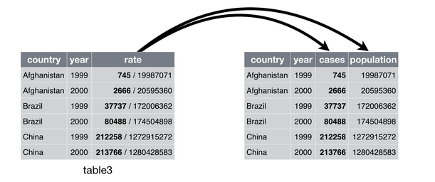
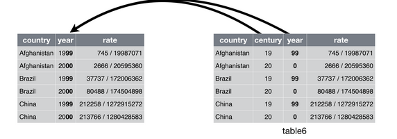

# tidyr: Tidy data 


```r
library(tidylog) # Tidylog provides feedback about dplyr and tidyr operations.
library(lubridate)
```


## Tidy data {#tidyr-intro}

> “Happy families are all alike; every unhappy family is unhappy in its own way.” 
> –– Leo Tolstoy    
> “Tidy datasets are all alike, but every messy dataset is messy in its own way.” 
> –– Hadley Wickham

整洁数据 (Tidy data) 是进行数据操作和 ggplot2 可视化的基础，所谓数据整理（清洗、清理），就是把 messy data 转换为 tidy data 的过程。在 tidyverse 生态中，**tidyr** 负责数据的整理和变型：


如果一个数据集是整洁的，需要满足以下三个要素：  
1. 每个变量有一个专属列 (Each variable must have its own column)  
2. 每个观测有一个专属行 (Each observation must have its own row)  
3. 每个值有一个专属的存储单元 (Each value must its own cell)  


这三条规则是互相关联的，不可能只满足三条规则中的两条，所以我们可以更简化地把清洁数据的要求写成：  
1. 每列是一个变量(Variables go in columns)  
2. 每行是一个观测(Observatiosn go in rows)


同样的数据可以有不同的表现形式，但只有满足整洁数据的三个条件的数据集才是最容易使用的。以下的 3 个数据集背后的均来自1999年和2000年世界卫生组织在阿富汗、巴西和中国的一次肺结核病例调查，都有 `country`、`year`、`cases` 和 `population`四个变量，但采用了不同的组织方式:


```r
table1
#> # A tibble: 6 x 4
#>   country      year  cases population
#>   <chr>       <int>  <int>      <int>
#> 1 Afghanistan  1999    745   19987071
#> 2 Afghanistan  2000   2666   20595360
#> 3 Brazil       1999  37737  172006362
#> 4 Brazil       2000  80488  174504898
#> 5 China        1999 212258 1272915272
#> 6 China        2000 213766 1280428583
table2
#> # A tibble: 12 x 4
#>   country      year type           count
#>   <chr>       <int> <chr>          <int>
#> 1 Afghanistan  1999 cases            745
#> 2 Afghanistan  1999 population  19987071
#> 3 Afghanistan  2000 cases           2666
#> 4 Afghanistan  2000 population  20595360
#> 5 Brazil       1999 cases          37737
#> 6 Brazil       1999 population 172006362
#> # ... with 6 more rows
table3
#> # A tibble: 6 x 3
#>   country      year rate             
#> * <chr>       <int> <chr>            
#> 1 Afghanistan  1999 745/19987071     
#> 2 Afghanistan  2000 2666/20595360    
#> 3 Brazil       1999 37737/172006362  
#> 4 Brazil       2000 80488/174504898  
#> 5 China        1999 212258/1272915272
#> 6 China        2000 213766/1280428583
```

`table4a` 和 `table4b`分别是以 cases 和 population 为值的数据透视表：  

```r
table4a
#> # A tibble: 3 x 3
#>   country     `1999` `2000`
#> * <chr>        <int>  <int>
#> 1 Afghanistan    745   2666
#> 2 Brazil       37737  80488
#> 3 China       212258 213766
table4b
#> # A tibble: 3 x 3
#>   country         `1999`     `2000`
#> * <chr>            <int>      <int>
#> 1 Afghanistan   19987071   20595360
#> 2 Brazil       172006362  174504898
#> 3 China       1272915272 1280428583
```


在上面的例子中，只有`table1` 符合清洁数据的标准。在`table2` 中，`type`不是一个变量，它的值 `cases` 和 `population` 才是变量，进而导致了每一行不是一个完整的观测。在 `table3` 中，`rate` 同样不是一个变量，`cases` 和 `population` 的值被挤在了一个单元里。至于 `table4a` 和`table4b`，`1999` 和 `2000`不是变量，而是一个表示年份的变量的值。  

为什么要为获得清洁的数据如此大费周折呢？主要有两个优点：  

1. 清洁数据的规则使得我们可以遵从一个一致、明确的结构存储数据。学习处理这些数据的工具变得很容易，因为你的对象在底层是一致的。  
2. 把变量存储在列中可以把 R 的向量化函数优势发挥到极致。例如 `mutate()` 和 `summarize()` ，许多内置的 R 函数都是对向量进行操作的。只要有了清洁的数据，后面的数据变换工作就很容易： 


```r
# Compute rate per 10,000
table1 %>% 
  mutate(rate = cases / population * 10000)
#> mutate: new variable 'rate' with 6 unique values and 0% NA
#> # A tibble: 6 x 5
#>   country      year  cases population  rate
#>   <chr>       <int>  <int>      <int> <dbl>
#> 1 Afghanistan  1999    745   19987071 0.373
#> 2 Afghanistan  2000   2666   20595360 1.29 
#> 3 Brazil       1999  37737  172006362 2.19 
#> 4 Brazil       2000  80488  174504898 4.61 
#> 5 China        1999 212258 1272915272 1.67 
#> 6 China        2000 213766 1280428583 1.67
# Compute cases per year
table1 %>%
  group_by(year) %>%
  summarize(cases = sum(cases)) 
#> group_by: one grouping variable (year)
#> summarize: now 2 rows and 2 columns, ungrouped
#> # A tibble: 2 x 2
#>    year  cases
#>   <int>  <int>
#> 1  1999 250740
#> 2  2000 296920
# 或者：
table1 %>% 
  count(year, wt = cases)
#> count: now 2 rows and 2 columns, ungrouped
#> # A tibble: 2 x 2
#>    year      n
#>   <int>  <int>
#> 1  1999 250740
#> 2  2000 296920
# Visualise changes over time
library(ggplot2)
ggplot(table1, aes(year, cases)) + 
  geom_line(aes(group = country), colour = "grey50") + 
  geom_point(aes(colour = country))+
  scale_x_continuous(breaks = c(1999,2000),labels = c("1999","2000"))
```


### Exercises  

\BeginKnitrBlock{exercise}<div class="exercise"><span class="exercise" id="exr:unnamed-chunk-7"><strong>(\#exr:unnamed-chunk-7) </strong></span>用 `table2` 计算发病率 (`rate` = `cases` / `population`), 需要进行以下四步操作：
  * 得到每个国家每年的`cases`  
  * 得到每个国家每年的`population`  
  * 计算 `rate` = `cases` / `population`  
  * 把算好的数据存储到正确的位置 </div>\EndKnitrBlock{exercise}

  
首先，分别对 `cases` 和`population`建立一张表，并且确保两张表的排列顺序相同：  


```r
table2
#> # A tibble: 12 x 4
#>   country      year type           count
#>   <chr>       <int> <chr>          <int>
#> 1 Afghanistan  1999 cases            745
#> 2 Afghanistan  1999 population  19987071
#> 3 Afghanistan  2000 cases           2666
#> 4 Afghanistan  2000 population  20595360
#> 5 Brazil       1999 cases          37737
#> 6 Brazil       1999 population 172006362
#> # ... with 6 more rows
(t2_cases <- filter(table2, type == "cases") %>%
  rename(cases = count) %>%
  arrange(country, year))
#> filter: removed 6 rows (50%), 6 rows remaining
#> rename: renamed one variable (cases)
#> # A tibble: 6 x 4
#>   country      year type   cases
#>   <chr>       <int> <chr>  <int>
#> 1 Afghanistan  1999 cases    745
#> 2 Afghanistan  2000 cases   2666
#> 3 Brazil       1999 cases  37737
#> 4 Brazil       2000 cases  80488
#> 5 China        1999 cases 212258
#> 6 China        2000 cases 213766
(t2_population <- filter(table2, type == "population") %>%
  rename(population = count) %>%
  arrange(country, year))
#> filter: removed 6 rows (50%), 6 rows remaining
#> rename: renamed one variable (population)
#> # A tibble: 6 x 4
#>   country      year type       population
#>   <chr>       <int> <chr>           <int>
#> 1 Afghanistan  1999 population   19987071
#> 2 Afghanistan  2000 population   20595360
#> 3 Brazil       1999 population  172006362
#> 4 Brazil       2000 population  174504898
#> 5 China        1999 population 1272915272
#> 6 China        2000 population 1280428583
```

计算 `rate`  

```r
t2_cases_per_cap <- tibble(
  t2_cases$country,
  t2_cases$year,
  cases = t2_cases$cases,
  population = t2_population$population
)
t2_cases_per_cap
#> # A tibble: 6 x 4
#>   `t2_cases$country` `t2_cases$year`  cases population
#>   <chr>                        <int>  <int>      <int>
#> 1 Afghanistan                   1999    745   19987071
#> 2 Afghanistan                   2000   2666   20595360
#> 3 Brazil                        1999  37737  172006362
#> 4 Brazil                        2000  80488  174504898
#> 5 China                         1999 212258 1272915272
#> 6 China                         2000 213766 1280428583
t2_cases_per_cap %>%
  mutate(rate = cases/population) %>%
  select(1,2,5) %>%  
  # 改变列名
  mutate(
    country = t2_cases$country,
    year = t2_cases$year
  ) %>%
  select(country, year, rate)
#> mutate: new variable 'rate' with 6 unique values and 0% NA
#> select: dropped 2 variables (cases, population)
#> mutate: new variable 'country' with 3 unique values and 0% NA
#>         new variable 'year' with 2 unique values and 0% NA
#> select: dropped 2 variables (t2_cases$country, t2_cases$year)
#> # A tibble: 6 x 3
#>   country      year      rate
#>   <chr>       <int>     <dbl>
#> 1 Afghanistan  1999 0.0000373
#> 2 Afghanistan  2000 0.000129 
#> 3 Brazil       1999 0.000219 
#> 4 Brazil       2000 0.000461 
#> 5 China        1999 0.000167 
#> 6 China        2000 0.000167
```

## Pivoting  


<center>
<div class="figure" style="text-align: center">

<p class="caption">(\#fig:unnamed-chunk-10)Taken from https://www.garrickadenbuie.com/project/tidyexplain/#spread-and-gather</p>
</div>
</center>

细看两表，不难发现它们实质上相同的数据(相对于第二张表，第一张是以 id 为行字段，key 为列字段，val 为值的数据透视表)。第一种称为**宽数据 (wide data,Cartesian data,笛卡尔型数据)**，需要看行和列的交叉点来找到对应的值。而第二种形式称为**长数据(long data,indexed data，指标型数据)**，在长数据（指标型）数据汇总，你需要看指标来找到需要变量的数值（变量x，y，z的值）。。很难简单地说哪一种格式更优，因为两种形式都有可能是整洁的，这取决于值"A"、"B"、"C"、"D"的含义。  


数据整理常需要化宽为长，但偶尔也需要化长为宽, **tidyr** 分别提供了c`pivot_longer()` 和 `pivot_wider()` 来实现以上两种形式的转换操作(统称为 **pivoting**)。在 [tidyr 1.0.0](https://www.tidyverse.org/articles/2019/09/tidyr-1-0-0/) 及更早的版本中，`gather()` 和 `spread()` 分别承担相同的工作，实际效果与 `pivot_` 函数一样，但后者有更易理解的命名和 api。 

```r
pivot_longer(data, 
  cols,
  names_to = "name",
  values_to = "value",)
```

```r
pivot_wider(data, 
  names_from = name,
  values_from = value)
```

`names_to` 和 `values_to` 参数相当于原来 `gather()` 中的 `key` 和 `value`，其中 “键” 列的默认名称变为 “name”   
同理, `names_from` 和 `values_from` 相当于原来 `spread()` 中的 `key` 和 `value`


### `pivot_longer()`  

`tidyr::relig_income` 是一个典型的宽数据，除第一列以外的所有列表示收入的不同水平，值表示对应的人数：


```r
relig_income 
#> # A tibble: 18 x 11
#>   religion `<$10k` `$10-20k` `$20-30k` `$30-40k` `$40-50k` `$50-75k` `$75-100k`
#>   <chr>      <dbl>     <dbl>     <dbl>     <dbl>     <dbl>     <dbl>      <dbl>
#> 1 Agnostic      27        34        60        81        76       137        122
#> 2 Atheist       12        27        37        52        35        70         73
#> 3 Buddhist      27        21        30        34        33        58         62
#> 4 Catholic     418       617       732       670       638      1116        949
#> 5 Don’t k~      15        14        15        11        10        35         21
#> 6 Evangel~     575       869      1064       982       881      1486        949
#> # ... with 12 more rows, and 3 more variables: `$100-150k` <dbl>,
#> #   `>150k` <dbl>, `Don't know/refused` <dbl>
relig_income %>% pivot_longer(-religion, 
                              names_to = "income", 
                              values_to = "population")
#> pivot_longer: reorganized (<$10k, $10-20k, $20-30k, $30-40k, $40-50k, …) into (income, population) [was 18x11, now 180x3]
#> # A tibble: 180 x 3
#>   religion income  population
#>   <chr>    <chr>        <dbl>
#> 1 Agnostic <$10k           27
#> 2 Agnostic $10-20k         34
#> 3 Agnostic $20-30k         60
#> 4 Agnostic $30-40k         81
#> 5 Agnostic $40-50k         76
#> 6 Agnostic $50-75k        137
#> # ... with 174 more rows
```

另一个例子：美国劳工市场的月度数据，首先创建一个 messy data：  


```r
ec2 <- economics %>% as_tibble() %>%
  transmute(year =  year(date),
            month = month(date),
            rate = unemploy) %>%
  filter(year > 2005) %>% 
  pivot_wider(names_from = "month", values_from = "rate")
#> transmute: dropped 6 variables (date, pce, pop, psavert, uempmed, …)
#>            new variable 'year' with 49 unique values and 0% NA
#>            new variable 'month' with 12 unique values and 0% NA
#>            new variable 'rate' with 550 unique values and 0% NA
#> filter: removed 462 rows (80%), 112 rows remaining
#> pivot_wider: reorganized (month, rate) into (1, 2, 3, 4, 5, …) [was 112x3, now 10x13]
ec2
#> # A tibble: 10 x 13
#>    year   `1`   `2`   `3`   `4`   `5`   `6`   `7`   `8`   `9`  `10`  `11`  `12`
#>   <dbl> <dbl> <dbl> <dbl> <dbl> <dbl> <dbl> <dbl> <dbl> <dbl> <dbl> <dbl> <dbl>
#> 1  2006  7064  7184  7072  7120  6980  7001  7175  7091  6847  6727  6872  6762
#> 2  2007  7116  6927  6731  6850  6766  6979  7149  7067  7170  7237  7240  7645
#> 3  2008  7685  7497  7822  7637  8395  8575  8937  9438  9494 10074 10538 11286
#> 4  2009 12058 12898 13426 13853 14499 14707 14601 14814 15009 15352 15219 15098
#> 5  2010 15046 15113 15202 15325 14849 14474 14512 14648 14579 14516 15081 14348
#> 6  2011 14013 13820 13737 13957 13855 13962 13763 13818 13948 13594 13302 13093
#> # ... with 4 more rows
```

化宽为长：  


```r
ec2 %>% 
  pivot_longer(-year, names_to = "month", values_to = "value")
#> pivot_longer: reorganized (1, 2, 3, 4, 5, …) into (month, value) [was 10x13, now 120x3]
#> # A tibble: 120 x 3
#>    year month value
#>   <dbl> <chr> <dbl>
#> 1  2006 1      7064
#> 2  2006 2      7184
#> 3  2006 3      7072
#> 4  2006 4      7120
#> 5  2006 5      6980
#> 6  2006 6      7001
#> # ... with 114 more rows
```

以上就是 `pviot_longer` 的基本用法，下面来处理一些更复杂的情况。  


#### Numeric data in column names

`pivot_longer()` 提供了 `names_ptype` 和 `values_ptypes` 调整数据集变长后键列和值列的数据类型。看一下 `billboard` 数据集：  


```r
billboard
#> # A tibble: 317 x 79
#>   artist track date.entered   wk1   wk2   wk3   wk4   wk5   wk6   wk7   wk8
#>   <chr>  <chr> <date>       <dbl> <dbl> <dbl> <dbl> <dbl> <dbl> <dbl> <dbl>
#> 1 2 Pac  Baby~ 2000-02-26      87    82    72    77    87    94    99    NA
#> 2 2Ge+h~ The ~ 2000-09-02      91    87    92    NA    NA    NA    NA    NA
#> 3 3 Doo~ Kryp~ 2000-04-08      81    70    68    67    66    57    54    53
#> 4 3 Doo~ Loser 2000-10-21      76    76    72    69    67    65    55    59
#> 5 504 B~ Wobb~ 2000-04-15      57    34    25    17    17    31    36    49
#> 6 98^0   Give~ 2000-08-19      51    39    34    26    26    19     2     2
#> # ... with 311 more rows, and 68 more variables: wk9 <dbl>, wk10 <dbl>,
#> #   wk11 <dbl>, wk12 <dbl>, wk13 <dbl>, wk14 <dbl>, wk15 <dbl>, wk16 <dbl>,
#> #   wk17 <dbl>, wk18 <dbl>, wk19 <dbl>, wk20 <dbl>, wk21 <dbl>, wk22 <dbl>,
#> #   wk23 <dbl>, wk24 <dbl>, wk25 <dbl>, wk26 <dbl>, wk27 <dbl>, wk28 <dbl>,
#> #   wk29 <dbl>, wk30 <dbl>, wk31 <dbl>, wk32 <dbl>, wk33 <dbl>, wk34 <dbl>,
#> #   wk35 <dbl>, wk36 <dbl>, wk37 <dbl>, wk38 <dbl>, wk39 <dbl>, wk40 <dbl>,
#> #   wk41 <dbl>, wk42 <dbl>, wk43 <dbl>, wk44 <dbl>, wk45 <dbl>, wk46 <dbl>,
#> #   wk47 <dbl>, wk48 <dbl>, wk49 <dbl>, wk50 <dbl>, wk51 <dbl>, wk52 <dbl>,
#> #   wk53 <dbl>, wk54 <dbl>, wk55 <dbl>, wk56 <dbl>, wk57 <dbl>, wk58 <dbl>,
#> #   wk59 <dbl>, wk60 <dbl>, wk61 <dbl>, wk62 <dbl>, wk63 <dbl>, wk64 <dbl>,
#> #   wk65 <dbl>, wk66 <lgl>, wk67 <lgl>, wk68 <lgl>, wk69 <lgl>, wk70 <lgl>,
#> #   wk71 <lgl>, wk72 <lgl>, wk73 <lgl>, wk74 <lgl>, wk75 <lgl>, wk76 <lgl>
```

显然，我们希望将所有以 `"wk"`开头的列聚合以得到整洁数据，键列和值列分别命名为 “week” 和 “rank”。另外要考虑的一点是，我们很可能之后想计算歌曲保持在榜单上的周数，故需要将 “week” 列转换为数值类型：  


```r
billboard_tidy <- billboard %>% 
  pivot_longer(cols = starts_with("wk"),
               names_to = "week",
               values_to = "rank",
               names_prefix = "wk",
               names_ptypes = list(week = integer()),
               values_drop_na = T)
#> pivot_longer: reorganized (wk1, wk2, wk3, wk4, wk5, …) into (week, rank) [was 317x79, now 5307x5]
```


```r
billboard_tidy
#> # A tibble: 5,307 x 5
#>   artist track                   date.entered  week  rank
#>   <chr>  <chr>                   <date>       <int> <dbl>
#> 1 2 Pac  Baby Don't Cry (Keep... 2000-02-26       1    87
#> 2 2 Pac  Baby Don't Cry (Keep... 2000-02-26       2    82
#> 3 2 Pac  Baby Don't Cry (Keep... 2000-02-26       3    72
#> 4 2 Pac  Baby Don't Cry (Keep... 2000-02-26       4    77
#> 5 2 Pac  Baby Don't Cry (Keep... 2000-02-26       5    87
#> 6 2 Pac  Baby Don't Cry (Keep... 2000-02-26       6    94
#> # ... with 5,301 more rows
```


`names_prefix` 去除前缀 "wk"(否则无法从字符串转换为数值)，`names_ptype` 以列表的形式转换键列的数据类型。同理, `values_ptype` 可以转换值列的数据类型。  


```r
## 计算保持周数
billboard_tidy %>% 
  group_by(track) %>% 
  summarise(stay = max(week) - min(week) + 1) %>% 
  arrange(desc(stay))
#> group_by: one grouping variable (track)
#> summarise: now 316 rows and 2 columns, ungrouped
#> # A tibble: 316 x 2
#>   track                stay
#>   <chr>               <dbl>
#> 1 Higher                 65
#> 2 Amazed                 64
#> 3 Breathe                53
#> 4 Kryptonite             53
#> 5 With Arms Wide Open    47
#> 6 I Wanna Know           44
#> # ... with 310 more rows
```


#### Many variables in column names

在 tidyr 1.0.0 之前，当进行一定处理后发现多个变量被糅合到一列中时，可能会考虑使用 `separate()` 或者 `extract()`:   


```r
who
#> # A tibble: 7,240 x 60
#>   country iso2  iso3   year new_sp_m014 new_sp_m1524 new_sp_m2534 new_sp_m3544
#>   <chr>   <chr> <chr> <int>       <int>        <int>        <int>        <int>
#> 1 Afghan~ AF    AFG    1980          NA           NA           NA           NA
#> 2 Afghan~ AF    AFG    1981          NA           NA           NA           NA
#> 3 Afghan~ AF    AFG    1982          NA           NA           NA           NA
#> 4 Afghan~ AF    AFG    1983          NA           NA           NA           NA
#> 5 Afghan~ AF    AFG    1984          NA           NA           NA           NA
#> 6 Afghan~ AF    AFG    1985          NA           NA           NA           NA
#> # ... with 7,234 more rows, and 52 more variables: new_sp_m4554 <int>,
#> #   new_sp_m5564 <int>, new_sp_m65 <int>, new_sp_f014 <int>,
#> #   new_sp_f1524 <int>, new_sp_f2534 <int>, new_sp_f3544 <int>,
#> #   new_sp_f4554 <int>, new_sp_f5564 <int>, new_sp_f65 <int>,
#> #   new_sn_m014 <int>, new_sn_m1524 <int>, new_sn_m2534 <int>,
#> #   new_sn_m3544 <int>, new_sn_m4554 <int>, new_sn_m5564 <int>,
#> #   new_sn_m65 <int>, new_sn_f014 <int>, new_sn_f1524 <int>,
#> #   new_sn_f2534 <int>, new_sn_f3544 <int>, new_sn_f4554 <int>,
#> #   new_sn_f5564 <int>, new_sn_f65 <int>, new_ep_m014 <int>,
#> #   new_ep_m1524 <int>, new_ep_m2534 <int>, new_ep_m3544 <int>,
#> #   new_ep_m4554 <int>, new_ep_m5564 <int>, new_ep_m65 <int>,
#> #   new_ep_f014 <int>, new_ep_f1524 <int>, new_ep_f2534 <int>,
#> #   new_ep_f3544 <int>, new_ep_f4554 <int>, new_ep_f5564 <int>,
#> #   new_ep_f65 <int>, newrel_m014 <int>, newrel_m1524 <int>,
#> #   newrel_m2534 <int>, newrel_m3544 <int>, newrel_m4554 <int>,
#> #   newrel_m5564 <int>, newrel_m65 <int>, newrel_f014 <int>,
#> #   newrel_f1524 <int>, newrel_f2534 <int>, newrel_f3544 <int>,
#> #   newrel_f4554 <int>, newrel_f5564 <int>, newrel_f65 <int>
## 原书 tidyr 一章中使用的方法
who %>% 
  gather(starts_with("new"), 
         key = key, 
         value = value,
         na.rm = T) %>% 
  extract(key,
          into = c("diagnosis", "gender", "age"),
          regex = "new_?(.*)_(.)(.*)")
#> gather: reorganized (new_sp_m014, new_sp_m1524, new_sp_m2534, new_sp_m3544, new_sp_m4554, …) into (key, value) [was 7240x60, now 76046x6]
#> # A tibble: 76,046 x 8
#>   country     iso2  iso3   year diagnosis gender age   value
#>   <chr>       <chr> <chr> <int> <chr>     <chr>  <chr> <int>
#> 1 Afghanistan AF    AFG    1997 sp        m      014       0
#> 2 Afghanistan AF    AFG    1998 sp        m      014      30
#> 3 Afghanistan AF    AFG    1999 sp        m      014       8
#> 4 Afghanistan AF    AFG    2000 sp        m      014      52
#> 5 Afghanistan AF    AFG    2001 sp        m      014     129
#> 6 Afghanistan AF    AFG    2002 sp        m      014      90
#> # ... with 76,040 more rows
```

现在，`pivot_longer()` 现在可以在化宽为长的下一步直接完成拆分任务，可以直接在 `names_to` 中传入一个向量表示分裂后的各个键列，并在 `names_sep`(分隔符) 或者 `names_pattern` 中(正则表达式)指定分裂的模式：  


```r
who %>% 
  pivot_longer(starts_with("new"),
               names_to = c("diagonosis", "gender", "age"),
               names_pattern = "new_?(.*)_(.)(.*)",
               values_to = "count",
               values_drop_na = T)
#> pivot_longer: reorganized (new_sp_m014, new_sp_m1524, new_sp_m2534, new_sp_m3544, new_sp_m4554, …) into (diagonosis, gender, age, count) [was 7240x60, now 76046x8]
#> # A tibble: 76,046 x 8
#>   country     iso2  iso3   year diagonosis gender age   count
#>   <chr>       <chr> <chr> <int> <chr>      <chr>  <chr> <int>
#> 1 Afghanistan AF    AFG    1997 sp         m      014       0
#> 2 Afghanistan AF    AFG    1997 sp         m      1524     10
#> 3 Afghanistan AF    AFG    1997 sp         m      2534      6
#> 4 Afghanistan AF    AFG    1997 sp         m      3544      3
#> 5 Afghanistan AF    AFG    1997 sp         m      4554      5
#> 6 Afghanistan AF    AFG    1997 sp         m      5564      2
#> # ... with 76,040 more rows
```

更进一步，顺便设定好整理后 `gender` 和 `age` 的类型：  


```r
who %>% 
  pivot_longer(cols = starts_with("new"),
               names_to = c("diagonosis", "gender", "age"),
               names_pattern = "new_?(.*)_(.)(.*)",
               names_ptypes = list(
                 gender = factor(levels = c("f", "m")),
                 age = factor(
                        levels = c("014", "1524", "2534", "3544", "4554", "5564", "65"), 
                        ordered = TRUE)
               ),
               values_to = "count",
               values_drop_na = T)
#> pivot_longer: reorganized (new_sp_m014, new_sp_m1524, new_sp_m2534, new_sp_m3544, new_sp_m4554, …) into (diagonosis, gender, age, count) [was 7240x60, now 76046x8]
#> # A tibble: 76,046 x 8
#>   country     iso2  iso3   year diagonosis gender age   count
#>   <chr>       <chr> <chr> <int> <chr>      <fct>  <ord> <int>
#> 1 Afghanistan AF    AFG    1997 sp         m      014       0
#> 2 Afghanistan AF    AFG    1997 sp         m      1524     10
#> 3 Afghanistan AF    AFG    1997 sp         m      2534      6
#> 4 Afghanistan AF    AFG    1997 sp         m      3544      3
#> 5 Afghanistan AF    AFG    1997 sp         m      4554      5
#> 6 Afghanistan AF    AFG    1997 sp         m      5564      2
#> # ... with 76,040 more rows
```


#### Multiple observations per row

(多个值列)  

So far, we have been working with data frames that have one observation per row, but many important pivotting problems involve multiple observations per row. You can usually recognise this case because **name of the column that you want to appear in the output is part of the column name in the input**. In this section, you’ll learn how to pivot this sort of data.  


```r
family <- tribble(
  ~family,  ~dob_child1,  ~dob_child2, ~gender_child1, ~gender_child2,
       1L, "1998-11-26", "2000-01-29",             1L,             2L,
       2L, "1996-06-22",           NA,             2L,             NA,
       3L, "2002-07-11", "2004-04-05",             2L,             2L,
       4L, "2004-10-10", "2009-08-27",             1L,             1L,
       5L, "2000-12-05", "2005-02-28",             2L,             1L,
)
family <- family %>% mutate_at(vars(starts_with("dob")), ymd)
#> mutate_at: converted 'dob_child1' from character to Date (0 new NA)
#>            converted 'dob_child2' from character to Date (0 new NA)
family
#> # A tibble: 5 x 5
#>   family dob_child1 dob_child2 gender_child1 gender_child2
#>    <int> <date>     <date>             <int>         <int>
#> 1      1 1998-11-26 2000-01-29             1             2
#> 2      2 1996-06-22 NA                     2            NA
#> 3      3 2002-07-11 2004-04-05             2             2
#> 4      4 2004-10-10 2009-08-27             1             1
#> 5      5 2000-12-05 2005-02-28             2             1
```

理想中的数据格式(两个值列)

|family|child|dob|gender
|:-:|:-:|:-:|:-:|
1|1|1998-11-26|1
1|2|2000-01-29|2
2|1|1996-06-22|2
3|1|2002-07-11|2
3|2|2004-04-05|2
4|1|2004-10-10|1
4|2|2009-08-27|1
5|1|2000-12-05|2
5|2|2005-02-28|1


Note that we have two pieces of information (or values) for each child: their `gender` and their `dob` (date of birth). These need to go into separate columns in the result. Again we supply multiple variables to `names_to`, using `names_sep` to split up each variable name. Note the special name `.value`: this tells `pivot_longer()` that that part of the column name specifies the “value” being measured (which will become a variable in the output)  

`.value` 在这里指代 `dob` 和 `gender` 两个值列

```r
family %>% 
  pivot_longer(
    -family, 
    names_to = c(".value", "child"),   ## child 为每个 family 中的标识变量
    names_sep = "_", 
    values_drop_na = TRUE
  )
#> pivot_longer: reorganized (dob_child1, dob_child2, gender_child1, gender_child2) into (child, dob, gender) [was 5x5, now 9x4]
#> # A tibble: 9 x 4
#>   family child  dob        gender
#>    <int> <chr>  <date>      <int>
#> 1      1 child1 1998-11-26      1
#> 2      1 child2 2000-01-29      2
#> 3      2 child1 1996-06-22      2
#> 4      3 child1 2002-07-11      2
#> 5      3 child2 2004-04-05      2
#> 6      4 child1 2004-10-10      1
#> # ... with 3 more rows
```


在这里，`dob_child1`、`dob_child2`、`gender_child1`、`gender_child2`四个列名的**后半部分**被当做键列的值。例如，可以认为对于 `family == 1`的观测，首先生成了如下的结构：  

|family|child|dob|dob|gender|gender|
|:-:|:-:|:-:|:-:|:-:|:-:|:-:
|1|child1|1998-11-16|2000-01-29|1|2|
|2|child2|||||

而后名称相同的值列合并：  

|family|child|dob|gender
|:-:|:-:|:-:|:-:|
1|child1|1998-11-26|1
1|child2|2000-01-29|2


另一个例子：  


```r
anscombe 
#>    x1 x2 x3 x4    y1   y2    y3    y4
#> 1  10 10 10  8  8.04 9.14  7.46  6.58
#> 2   8  8  8  8  6.95 8.14  6.77  5.76
#> 3  13 13 13  8  7.58 8.74 12.74  7.71
#> 4   9  9  9  8  8.81 8.77  7.11  8.84
#> 5  11 11 11  8  8.33 9.26  7.81  8.47
#> 6  14 14 14  8  9.96 8.10  8.84  7.04
#> 7   6  6  6  8  7.24 6.13  6.08  5.25
#> 8   4  4  4 19  4.26 3.10  5.39 12.50
#> 9  12 12 12  8 10.84 9.13  8.15  5.56
#> 10  7  7  7  8  4.82 7.26  6.42  7.91
#> 11  5  5  5  8  5.68 4.74  5.73  6.89
anscombe %>% 
  pivot_longer(everything(),
               names_to = c(".value", "set"),
               names_pattern = "([xy])([1234])")
#> pivot_longer: reorganized (x1, x2, x3, x4, y1, …) into (set, x, y) [was 11x8, now 44x3]
#> # A tibble: 44 x 3
#>   set       x     y
#>   <chr> <dbl> <dbl>
#> 1 1        10  8.04
#> 2 2        10  9.14
#> 3 3        10  7.46
#> 4 4         8  6.58
#> 5 1         8  6.95
#> 6 2         8  8.14
#> # ... with 38 more rows
```

叕一个例子：  


```r
pnl <- tibble(
  x = 1:4,
  a = c(1, 1,0, 0),
  b = c(0, 1, 1, 1),
  y1 = rnorm(4),
  y2 = rnorm(4),
  z1 = rep(3, 4),
  z2 = rep(-2, 4),
)
pnl
#> # A tibble: 4 x 7
#>       x     a     b      y1     y2    z1    z2
#>   <int> <dbl> <dbl>   <dbl>  <dbl> <dbl> <dbl>
#> 1     1     1     0  0.788  -1.59      3    -2
#> 2     2     1     1 -0.422   0.597     3    -2
#> 3     3     0     1  0.0569  1.22      3    -2
#> 4     4     0     1  0.711  -0.312     3    -2
```


```r
pnl %>% 
  pivot_longer(-(x:b),
               names_to = c(".value", "time"),
               names_pattern = "([yz])([12])")
#> pivot_longer: reorganized (y1, y2, z1, z2) into (time, y, z) [was 4x7, now 8x6]
#> # A tibble: 8 x 6
#>       x     a     b time        y     z
#>   <int> <dbl> <dbl> <chr>   <dbl> <dbl>
#> 1     1     1     0 1      0.788      3
#> 2     1     1     0 2     -1.59      -2
#> 3     2     1     1 1     -0.422      3
#> 4     2     1     1 2      0.597     -2
#> 5     3     0     1 1      0.0569     3
#> 6     3     0     1 2      1.22      -2
#> # ... with 2 more rows
```


#### Duplicated column names

如果某个数据框中各列有重复的名字，用 `gather()` 聚合这些变量所在的列时会返回一条错误：  

```r
Error: Can't bind data because some arguments have the same name
```
这是因为被聚合的列名被当做 `key` 列的值，又因这些值是重复的，故不能唯一标识一条记录。`pivot_longer()` 针对这一点做了优化，尝试聚合这些列时，会自动生成一个标识列：  

```r
#  To create a tibble with duplicated names
# you have to explicitly opt out of the name repair 
# that usually prevents you from creating such a dataset:
(df <- tibble(x = 1:3, y = 4:6, y = 5:7, y = 7:9, .name_repair = "minimal")) 
#> # A tibble: 3 x 4
#>       x     y     y     y
#>   <int> <int> <int> <int>
#> 1     1     4     5     7
#> 2     2     5     6     8
#> 3     3     6     7     9
```

```r
df %>% 
  pivot_longer(-x, names_to = "y")
#> pivot_longer: reorganized () into (.copy, value) [was 3x4, now 9x4]
#> # A tibble: 9 x 4
#>       x y     .copy value
#>   <int> <chr> <int> <int>
#> 1     1 y         1     4
#> 2     1 y         2     5
#> 3     1 y         3     7
#> 4     2 y         1     5
#> 5     2 y         2     6
#> 6     2 y         3     8
#> # ... with 3 more rows
```

### `pivot_wider()`

`pivot_wider()` 是 `pivot_longer()` 的逆操作，虽然在获得 tidy data 上，前者没有后者常用，但它经常被用来创建一些 summary table。  

`fish_encounters` 数据记录了一些沿河观测站对一批鱼群的观测情况(`seen` 为发现次数)：


```r
fish_encounters
#> # A tibble: 114 x 3
#>   fish  station  seen
#>   <fct> <fct>   <int>
#> 1 4842  Release     1
#> 2 4842  I80_1       1
#> 3 4842  Lisbon      1
#> 4 4842  Rstr        1
#> 5 4842  Base_TD     1
#> 6 4842  BCE         1
#> # ... with 108 more rows
```

很多后续分析工具需要每个观测站的观测情况单独成一列，使用 `pivot_wider()`:  


```r
# 数据中已有的列不需要引号便可引用
fish_encounters %>% 
  pivot_wider(names_from = station, values_from = seen)
#> pivot_wider: reorganized (station, seen) into (Release, I80_1, Lisbon, Rstr, Base_TD, …) [was 114x3, now 19x12]
#> # A tibble: 19 x 12
#>   fish  Release I80_1 Lisbon  Rstr Base_TD   BCE   BCW  BCE2  BCW2   MAE   MAW
#>   <fct>   <int> <int>  <int> <int>   <int> <int> <int> <int> <int> <int> <int>
#> 1 4842        1     1      1     1       1     1     1     1     1     1     1
#> 2 4843        1     1      1     1       1     1     1     1     1     1     1
#> 3 4844        1     1      1     1       1     1     1     1     1     1     1
#> 4 4845        1     1      1     1       1    NA    NA    NA    NA    NA    NA
#> 5 4847        1     1      1    NA      NA    NA    NA    NA    NA    NA    NA
#> 6 4848        1     1      1     1      NA    NA    NA    NA    NA    NA    NA
#> # ... with 13 more rows
```

关于 `pivot_wider()`，很重要的一点是它会暴露出数据中的隐式缺失值(implicit missing value)。这些没有出现在原数据中的 NA 值不是源自于记录错误或者遗失，只是没有对应的观测而已（观测站只能记录发生了的观测）。参数 **values_fill** 可以以一个列表填充 `pivot_wider()` 结果中的 NA， 当然如何处理这些隐式缺失值要按具体情境而定，在鱼群的例子里，用 0 填充是合适的：  


```r
fish_encounters %>% 
  pivot_wider(names_from = station, values_from = seen,
              values_fill = list(seen = 0))
#> pivot_wider: reorganized (station, seen) into (Release, I80_1, Lisbon, Rstr, Base_TD, …) [was 114x3, now 19x12]
#> # A tibble: 19 x 12
#>   fish  Release I80_1 Lisbon  Rstr Base_TD   BCE   BCW  BCE2  BCW2   MAE   MAW
#>   <fct>   <int> <int>  <int> <int>   <int> <int> <int> <int> <int> <int> <int>
#> 1 4842        1     1      1     1       1     1     1     1     1     1     1
#> 2 4843        1     1      1     1       1     1     1     1     1     1     1
#> 3 4844        1     1      1     1       1     1     1     1     1     1     1
#> 4 4845        1     1      1     1       1     0     0     0     0     0     0
#> 5 4847        1     1      1     0       0     0     0     0     0     0     0
#> 6 4848        1     1      1     1       0     0     0     0     0     0     0
#> # ... with 13 more rows
```

\BeginKnitrBlock{todo}<div class="todo">`fish_encoutners` 的贡献者 [Myfanwy Johnston](https://fishsciences.github.io/post/visualizing-fish-encounter-histories/) 在个人网站上有一篇相关的文章  </div>\EndKnitrBlock{todo}

#### Aggregation  

`pivot_wider()` 可以用来执行一些简单的聚合操作。`warpbreaks` 是一个关于经纱强度的控制试验，每个处理 `(wool, tension)` 上进行了 9 次试验：


```r
(warpbreaks <- warpbreaks %>% as_tibble() %>% select(wool, tension, breaks))
#> select: columns reordered (wool, tension, breaks)
#> # A tibble: 54 x 3
#>   wool  tension breaks
#>   <fct> <fct>    <dbl>
#> 1 A     L           26
#> 2 A     L           30
#> 3 A     L           54
#> 4 A     L           25
#> 5 A     L           70
#> 6 A     L           52
#> # ... with 48 more rows
warpbreaks %>% count(wool, tension)
#> count: now 6 rows and 3 columns, ungrouped
#> # A tibble: 6 x 3
#>   wool  tension     n
#>   <fct> <fct>   <int>
#> 1 A     L           9
#> 2 A     M           9
#> 3 A     H           9
#> 4 B     L           9
#> 5 B     M           9
#> 6 B     H           9
```

现在想知道每个处理下的平均断头次数，只需展开 `wool` 或 `tension` 中的任意一个：  


```r
warpbreaks %>% 
  pivot_wider(names_from = wool, values_from = breaks)
#> Warning: Values in `breaks` are not uniquely identified; output will contain list-cols.
#> * Use `values_fn = list(breaks = list)` to suppress this warning.
#> * Use `values_fn = list(breaks = length)` to identify where the duplicates arise
#> * Use `values_fn = list(breaks = summary_fun)` to summarise duplicates
#> pivot_wider: reorganized (wool, breaks) into (A, B) [was 54x3, now 3x3]
#> # A tibble: 3 x 3
#>   tension A         B        
#>   <fct>   <list>    <list>   
#> 1 L       <dbl [9]> <dbl [9]>
#> 2 M       <dbl [9]> <dbl [9]>
#> 3 H       <dbl [9]> <dbl [9]>
```

由于 `(wool, tension)` 不能唯一确认一个观测，多个观测被压缩至一个列表中，`values_fn(breaks = mean)` 求得平均值：  


```r
warpbreaks %>% 
  pivot_wider(names_from = wool, values_from = breaks,
              values_fn = list(breaks = mean))
#> pivot_wider: reorganized (wool, breaks) into (A, B) [was 54x3, now 3x3]
#> # A tibble: 3 x 3
#>   tension     A     B
#>   <fct>   <dbl> <dbl>
#> 1 L        44.6  28.2
#> 2 M        24    28.8
#> 3 H        24.6  18.8
```

For more complex summary operations, I recommend summarising before reshaping, but for simple cases it’s often convenient to summarise within `pivot_wider()`  

#### Generate column name from multiple variables  

现有一个数据集存储了关于产品、生产国家、生产年份和产量的水平组合：  


```r
production <- expand_grid(
    product = c("A", "B"), 
    country = c("AI", "EI"), 
    year = 2000:2014
  ) %>%
  filter((product == "A" & country == "AI") | product == "B") %>% 
  mutate(production = rnorm(nrow(.)))
#> filter: removed 15 rows (25%), 45 rows remaining
#> mutate: new variable 'production' with 45 unique values and 0% NA

production
#> # A tibble: 45 x 4
#>   product country  year production
#>   <chr>   <chr>   <int>      <dbl>
#> 1 A       AI       2000     -0.209
#> 2 A       AI       2001     -0.369
#> 3 A       AI       2002      0.330
#> 4 A       AI       2003      1.88 
#> 5 A       AI       2004     -0.482
#> 6 A       AI       2005      1.74 
#> # ... with 39 more rows
```

假设现在希望对于每个 `product` 和 `country` 的组合均创建一列，关键是在 `names_from` 中传入一个向量：


```r
production %>% 
  pivot_wider(names_from = c(product, country), values_from = production)
#> pivot_wider: reorganized (product, country, production) into (A_AI, B_AI, B_EI) [was 45x4, now 15x4]
#> # A tibble: 15 x 4
#>    year   A_AI   B_AI    B_EI
#>   <int>  <dbl>  <dbl>   <dbl>
#> 1  2000 -0.209  1.02  -1.14  
#> 2  2001 -0.369  0.598  0.143 
#> 3  2002  0.330  1.38  -0.0472
#> 4  2003  1.88  -1.06  -1.26  
#> 5  2004 -0.482  0.197  3.39  
#> 6  2005  1.74   1.37   0.120 
#> # ... with 9 more rows
```

`names_sep` 可以指定除了 `_` 以外的分隔符。`names_prefix` 为展开后的各列**添加**前缀(as opposed to removing in `pivot_longer()`)

#### Multiple value columns  

The `us_rent_income` dataset contains information about median income and rent for each state in the US for 2017 (from the American Community Survey, retrieved with the **tidycensus** package).  


```r
us_rent_income
#> # A tibble: 104 x 5
#>   GEOID NAME    variable estimate   moe
#>   <chr> <chr>   <chr>       <dbl> <dbl>
#> 1 01    Alabama income      24476   136
#> 2 01    Alabama rent          747     3
#> 3 02    Alaska  income      32940   508
#> 4 02    Alaska  rent         1200    13
#> 5 04    Arizona income      27517   148
#> 6 04    Arizona rent          972     4
#> # ... with 98 more rows
```

Here both `estimate` and `moe` are values columns, so we can supply them to `values_from`:


```r
us_rent_income %>% pivot_wider(names_from = variable, values_from = c(estimate, moe))
#> pivot_wider: reorganized (variable, estimate, moe) into (estimate_income, estimate_rent, moe_income, moe_rent) [was 104x5, now 52x6]
#> # A tibble: 52 x 6
#>   GEOID NAME       estimate_income estimate_rent moe_income moe_rent
#>   <chr> <chr>                <dbl>         <dbl>      <dbl>    <dbl>
#> 1 01    Alabama              24476           747        136        3
#> 2 02    Alaska               32940          1200        508       13
#> 3 04    Arizona              27517           972        148        4
#> 4 05    Arkansas             23789           709        165        5
#> 5 06    California           29454          1358        109        3
#> 6 08    Colorado             32401          1125        109        5
#> # ... with 46 more rows
```

Note that the name of the variable is automatically appended to the output columns.

#### When there is no identifying variable   {#contact}

A final challenge is inspired by [Jiena Gu](https://github.com/jienagu/tidyverse_examples/blob/master/example_long_wide.R). Imagine you have a contact list that you’ve copied and pasted from a website: 


```r
contacts <- tribble(
  ~field, ~value,
  "name", "Jiena McLellan",
  "company", "Toyota", 
  "name", "John Smith", 
  "company", "google", 
  "email", "john@google.com",
  "name", "Huxley Ratcliffe"
)
contacts
#> # A tibble: 6 x 2
#>   field   value           
#>   <chr>   <chr>           
#> 1 name    Jiena McLellan  
#> 2 company Toyota          
#> 3 name    John Smith      
#> 4 company google          
#> 5 email   john@google.com 
#> 6 name    Huxley Ratcliffe
```

This is challenging because there’s no variable that identifies which observations belong together. 

直接化宽时，出现列表列（没有第三个标识变量）

```r
contacts %>% pivot_wider(names_from = field, values_from = value)
#> pivot_wider: reorganized (field, value) into (name, company, email) [was 6x2, now 1x3]
#> # A tibble: 1 x 3
#>   name      company   email    
#>   <list>    <list>    <list>   
#> 1 <chr [3]> <chr [2]> <chr [1]>
```


We can fix this by noting that every contact starts with a name, so we can create **a unique id** by counting every time we see “name” as the `field`:   


```r
(contacts <- contacts %>% 
  mutate(
    person_id = cumsum(field == "name")
  ))
#> mutate: new variable 'person_id' with 3 unique values and 0% NA
#> # A tibble: 6 x 3
#>   field   value            person_id
#>   <chr>   <chr>                <int>
#> 1 name    Jiena McLellan           1
#> 2 company Toyota                   1
#> 3 name    John Smith               2
#> 4 company google                   2
#> 5 email   john@google.com          2
#> 6 name    Huxley Ratcliffe         3
```


```r
contacts %>% 
  pivot_wider(names_from = field, values_from = value)
#> pivot_wider: reorganized (field, value) into (name, company, email) [was 6x3, now 3x4]
#> # A tibble: 3 x 4
#>   person_id name             company email          
#>       <int> <chr>            <chr>   <chr>          
#> 1         1 Jiena McLellan   Toyota  <NA>           
#> 2         2 John Smith       google  john@google.com
#> 3         3 Huxley Ratcliffe <NA>    <NA>
```


### Combining `pivot_longer()` and `pivot_wider()`  

Some problems can’t be solved by pivotting in a single direction. The examples in this section show how you might combine `pivot_longer()` and `pivot_wider()` to solve more complex problems.


#### world bank data  

`world_bank_pop` contains data from the World Bank about population per country from 2000 to 2018.


```r
world_bank_pop
#> # A tibble: 1,056 x 20
#>   country indicator `2000` `2001` `2002` `2003`  `2004`  `2005`   `2006`
#>   <chr>   <chr>      <dbl>  <dbl>  <dbl>  <dbl>   <dbl>   <dbl>    <dbl>
#> 1 ABW     SP.URB.T~ 4.24e4 4.30e4 4.37e4 4.42e4 4.47e+4 4.49e+4  4.49e+4
#> 2 ABW     SP.URB.G~ 1.18e0 1.41e0 1.43e0 1.31e0 9.51e-1 4.91e-1 -1.78e-2
#> 3 ABW     SP.POP.T~ 9.09e4 9.29e4 9.50e4 9.70e4 9.87e+4 1.00e+5  1.01e+5
#> 4 ABW     SP.POP.G~ 2.06e0 2.23e0 2.23e0 2.11e0 1.76e+0 1.30e+0  7.98e-1
#> 5 AFG     SP.URB.T~ 4.44e6 4.65e6 4.89e6 5.16e6 5.43e+6 5.69e+6  5.93e+6
#> 6 AFG     SP.URB.G~ 3.91e0 4.66e0 5.13e0 5.23e0 5.12e+0 4.77e+0  4.12e+0
#> # ... with 1,050 more rows, and 11 more variables: `2007` <dbl>, `2008` <dbl>,
#> #   `2009` <dbl>, `2010` <dbl>, `2011` <dbl>, `2012` <dbl>, `2013` <dbl>,
#> #   `2014` <dbl>, `2015` <dbl>, `2016` <dbl>, `2017` <dbl>
```

It’s not obvious exactly what steps are needed yet, but I’ll start with the most obvious problem: `year` is spread across multiple columns.


```r
pop2 <- world_bank_pop %>% 
  pivot_longer(`2000`:`2017`, names_to = "year", values_to = "value")
#> pivot_longer: reorganized (2000, 2001, 2002, 2003, 2004, …) into (year, value) [was 1056x20, now 19008x4]
pop2
#> # A tibble: 19,008 x 4
#>   country indicator   year  value
#>   <chr>   <chr>       <chr> <dbl>
#> 1 ABW     SP.URB.TOTL 2000  42444
#> 2 ABW     SP.URB.TOTL 2001  43048
#> 3 ABW     SP.URB.TOTL 2002  43670
#> 4 ABW     SP.URB.TOTL 2003  44246
#> 5 ABW     SP.URB.TOTL 2004  44669
#> 6 ABW     SP.URB.TOTL 2005  44889
#> # ... with 19,002 more rows
```

Next we need to consider the `indicator` variable:


```r
world_bank_pop %>% count(indicator)
#> count: now 4 rows and 2 columns, ungrouped
#> # A tibble: 4 x 2
#>   indicator       n
#>   <chr>       <int>
#> 1 SP.POP.GROW   264
#> 2 SP.POP.TOTL   264
#> 3 SP.URB.GROW   264
#> 4 SP.URB.TOTL   264
```

Here `SP.POP.GROW` is population growth, `SP.POP.TOTL` is total population, and `SP.URB.*` are the same but only for urban areas. Let’s split this up into two variables: `area` (total or urban) and the actual variable (population or growth):


```r
# Use NA to omit the variable in the output.
pop3 <- pop2 %>% 
  separate(indicator, c(NA, "area", "variable"), sep = "\\.")  # sep takes a regex
pop3
#> # A tibble: 19,008 x 5
#>   country area  variable year  value
#>   <chr>   <chr> <chr>    <chr> <dbl>
#> 1 ABW     URB   TOTL     2000  42444
#> 2 ABW     URB   TOTL     2001  43048
#> 3 ABW     URB   TOTL     2002  43670
#> 4 ABW     URB   TOTL     2003  44246
#> 5 ABW     URB   TOTL     2004  44669
#> 6 ABW     URB   TOTL     2005  44889
#> # ... with 19,002 more rows
```

Now we can complete the tidying by pivoting `variable` and `value` to make `TOTL` and `GROW` columns:


```r
pop3 %>% 
  pivot_wider(names_from = variable, values_from = value)
#> pivot_wider: reorganized (variable, value) into (TOTL, GROW) [was 19008x5, now 9504x5]
#> # A tibble: 9,504 x 5
#>   country area  year   TOTL  GROW
#>   <chr>   <chr> <chr> <dbl> <dbl>
#> 1 ABW     URB   2000  42444 1.18 
#> 2 ABW     URB   2001  43048 1.41 
#> 3 ABW     URB   2002  43670 1.43 
#> 4 ABW     URB   2003  44246 1.31 
#> 5 ABW     URB   2004  44669 0.951
#> 6 ABW     URB   2005  44889 0.491
#> # ... with 9,498 more rows
```
  

#### mutli choice data   

Based on a suggestion by Maxime Wack, https://github.com/tidyverse/tidyr/issues/384), the final example shows how to deal with a common way of recording multiple choice data. Often you will get such data as follows:


```r
(multi <- tribble(
  ~id, ~choice1, ~choice2, ~choice3,
  1, "A", "B", "C",
  2, "C", "B",  NA,
  3, "D",  NA,  NA,
  4, "B", "D",  NA
))
#> # A tibble: 4 x 4
#>      id choice1 choice2 choice3
#>   <dbl> <chr>   <chr>   <chr>  
#> 1     1 A       B       C      
#> 2     2 C       B       <NA>   
#> 3     3 D       <NA>    <NA>   
#> 4     4 B       D       <NA>
```

But the actual order isn’t important, and you’d prefer to have the individual questions in the columns. You can achieve the desired transformation in two steps. First, you make the data longer, eliminating the explcit `NA`s, and adding a column to indicate that this choice was chosen: 


```r
multi2 <- multi %>% 
  pivot_longer(-id, values_drop_na = TRUE) %>% 
  mutate(checked = TRUE)
#> pivot_longer: reorganized (choice1, choice2, choice3) into (name, value) [was 4x4, now 8x3]
#> mutate: new variable 'checked' with one unique value and 0% NA
multi2
#> # A tibble: 8 x 4
#>      id name    value checked
#>   <dbl> <chr>   <chr> <lgl>  
#> 1     1 choice1 A     TRUE   
#> 2     1 choice2 B     TRUE   
#> 3     1 choice3 C     TRUE   
#> 4     2 choice1 C     TRUE   
#> 5     2 choice2 B     TRUE   
#> 6     3 choice1 D     TRUE   
#> # ... with 2 more rows
```

Then you make the data wider, filling in the missing observations with `FALSE`; note the use of `id_cols = id` here, this eliminated the `name` column and combines mutilples rows per person into one row, since we don't need `name` in identifying an observation:


```r
multi2 %>% 
  pivot_wider(id_cols = id,
              names_from = value, values_from = checked, 
              values_fill = list(checked = FALSE))
#> pivot_wider: reorganized (name, value, checked) into (A, B, C, D) [was 8x4, now 4x5]
#> # A tibble: 4 x 5
#>      id A     B     C     D    
#>   <dbl> <lgl> <lgl> <lgl> <lgl>
#> 1     1 TRUE  TRUE  TRUE  FALSE
#> 2     2 FALSE TRUE  TRUE  FALSE
#> 3     3 FALSE FALSE FALSE TRUE 
#> 4     4 FALSE TRUE  FALSE TRUE
```


### Exercises  

\BeginKnitrBlock{exercise}<div class="exercise"><span class="exercise" id="exr:unnamed-chunk-52"><strong>(\#exr:unnamed-chunk-52) </strong></span>在下面的例子中，研究为什么 `pivot_longer()` 和 `pivot_wider()` 不是完美对称的</div>\EndKnitrBlock{exercise}


```r
(stocks <- tibble(
  year = c(2015, 2015, 2016, 2016),
  half = c(1, 2, 1, 2),
  return = c(1.88, 0.59, 0.92, 0.17)
))
#> # A tibble: 4 x 3
#>    year  half return
#>   <dbl> <dbl>  <dbl>
#> 1  2015     1   1.88
#> 2  2015     2   0.59
#> 3  2016     1   0.92
#> 4  2016     2   0.17
stocks %>%
  pivot_wider(names_from = year, values_from = return) %>%
  pivot_longer(-half, names_to = "year", values_to = "return")
#> pivot_wider: reorganized (year, return) into (2015, 2016) [was 4x3, now 2x3]
#> pivot_longer: reorganized (2015, 2016) into (year, return) [was 2x3, now 4x3]
#> # A tibble: 4 x 3
#>    half year  return
#>   <dbl> <chr>  <dbl>
#> 1     1 2015    1.88
#> 2     1 2016    0.92
#> 3     2 2015    0.59
#> 4     2 2016    0.17
```

先后使用 `pivot_wider()` 和 `pivot_longer()`无法得到一个相同的数据集（除了列的顺序）是因为，数据整理有时会丢失列的类型信息。当 `pivot_wider()` 将变量 `year` 的值 `2015` 和 `2016` 用作列的名字时，它们自然被转化为了字符串`"2015"`和`"2016"`；随后 `pivot_longer()` 把列名用作键列`year`的值，从而`year`自然变成了一个字符向量，可以用 `names_ptypes` 避免这一点  
。  

```r
stocks %>%
  pivot_wider(names_from = year, values_from = return) %>%
  pivot_longer(-half, names_to = "year", values_to = "return",
               names_ptypes = list(year = double()))
#> pivot_wider: reorganized (year, return) into (2015, 2016) [was 4x3, now 2x3]
#> pivot_longer: reorganized (2015, 2016) into (year, return) [was 2x3, now 4x3]
#> # A tibble: 4 x 3
#>    half  year return
#>   <dbl> <dbl>  <dbl>
#> 1     1  2015   1.88
#> 2     1  2016   0.92
#> 3     2  2015   0.59
#> 4     2  2016   0.17
```


\BeginKnitrBlock{exercise}<div class="exercise"><span class="exercise" id="exr:unnamed-chunk-55"><strong>(\#exr:unnamed-chunk-55) </strong></span>为什么下面的数据框不能应用 `pivot_wider()`？可以添加一列解决这个问题吗？  </div>\EndKnitrBlock{exercise}


```r
(people <- tribble(
  ~name, ~key, ~value,
  "Phillip Woods", "age", 45,
  "Phillip Woods", "height", 186,
  "Phillip Woods", "age", 50,
  "Jessica Cordero", "age", 37,
  "Jessica Cordero", "height", 156
))
#> # A tibble: 5 x 3
#>   name            key    value
#>   <chr>           <chr>  <dbl>
#> 1 Phillip Woods   age       45
#> 2 Phillip Woods   height   186
#> 3 Phillip Woods   age       50
#> 4 Jessica Cordero age       37
#> 5 Jessica Cordero height   156

people %>% 
  pivot_wider(names_from = key, values_from = value)
#> # A tibble: 2 x 3
#>   name            age       height   
#>   <chr>           <list>    <list>   
#> 1 Phillip Woods   <dbl [2]> <dbl [1]>
#> 2 Jessica Cordero <dbl [1]> <dbl [1]>
```

这个例子和 \@ref(contact) 中的 `contact` 很类似，虽然这里有第三列 `name`，但仍不足以唯一标识任意观测


因为这个数据集里有两个对于 "Phillip Woods" 在 `age` 上年龄的观测，`pivot_wider()` 就要把由`(Phillips Woods, age)`确定的单元格里“塞进两个值”。本质上因为 `name` 和 `key` 这两个变量上的值不能唯一确定一行，所以我们只要添加一列，让`name`、`key`和新列可以唯一确定一行即可： 

```r
people %>% 
  mutate(id = row_number()) %>% 
  pivot_wider(names_from = key, values_from = value)
#> mutate: new variable 'id' with 5 unique values and 0% NA
#> pivot_wider: reorganized (key, value) into (age, height) [was 5x4, now 5x4]
#> # A tibble: 5 x 4
#>   name               id   age height
#>   <chr>           <int> <dbl>  <dbl>
#> 1 Phillip Woods       1    45     NA
#> 2 Phillip Woods       2    NA    186
#> 3 Phillip Woods       3    50     NA
#> 4 Jessica Cordero     4    37     NA
#> 5 Jessica Cordero     5    NA    156
```

## Nesting

Nesting creates **a list-column of data frames**; unnesting flattens it back out into regular columns. Nesting is a *implicitly  summarising operation*: you get one row for each group defined by the non-nested columns. This is useful in conjunction with other summaries that work with whole datasets, most notably models.

Since a nested data frame is no more than a data frame where one (or more) list-columns of data frames. You can create simple nested data frames by hand:  


```r
# df1 is a nested data frame
(df1 <- tibble(
  g = c(1, 2, 3),
  data = list(
    tibble(x = 1, y = 2),
    tibble(x = 4:5, y = 6:7),
    tibble(x = 10)
  )
))
#> # A tibble: 3 x 2
#>       g data            
#>   <dbl> <list>          
#> 1     1 <tibble [1 x 2]>
#> 2     2 <tibble [2 x 2]>
#> 3     3 <tibble [1 x 1]>
```

Or more commonly, we can create nested data frames using `tidyr::nest()`. `df %>% nest(x, y)` specifies the columns to be nested; i.e. the columns that will appear in the inner data frame. Alternatively, you can `nest()` a grouped data frame created by `dplyr::group_by()`. The **grouping variables remain in the outer data frame and the others are nested**. The result preserves the grouping of the input.

**Variables supplied to nest() will override grouping variables** so that `df %>% group_by(x, y)` %>% `nest(z)` will be equivalent to `df %>% nest(z)`.


```r
df2 <- tribble(
  ~g, ~x, ~y,
   1,  1,  2,
   2,  4,  6,
   2,  5,  7,
   3, 10,  NA
)
df2 %>% nest(data = c(x, y))
#> # A tibble: 3 x 2
#>       g data            
#>   <dbl> <list>          
#> 1     1 <tibble [1 x 2]>
#> 2     2 <tibble [2 x 2]>
#> 3     3 <tibble [1 x 2]>
```


```r
# grouped nesting
df2 %>% 
  group_by(g) %>% 
  nest()
#> group_by: one grouping variable (g)
#> # A tibble: 3 x 2
#> # Groups:   g [3]
#>       g data            
#>   <dbl> <list>          
#> 1     1 <tibble [1 x 2]>
#> 2     2 <tibble [2 x 2]>
#> 3     3 <tibble [1 x 2]>

# equal to 
df2 %>%
  group_nest(g)
#> # A tibble: 3 x 2
#>       g data            
#>   <dbl> <list>          
#> 1     1 <tibble [1 x 2]>
#> 2     2 <tibble [2 x 2]>
#> 3     3 <tibble [1 x 2]>
```

**Nesting is easiest to understand in connection to grouped data**: each row in the output corresponds to one group in the input. We’ll see shortly this is particularly convenient when you have other per-group objects.

The opposite of `nest()` is `unnest()`. You give it the name of a list-column containing data frames, and it row-binds the data frames together, repeating the outer columns the right number of times to line up.  


```r
df1 %>% unnest(data)
#> # A tibble: 4 x 3
#>       g     x     y
#>   <dbl> <dbl> <dbl>
#> 1     1     1     2
#> 2     2     4     6
#> 3     2     5     7
#> 4     3    10    NA
```

`dplyr::group_split()` put each nested tibble in a list, similar to `base::split()`:  

```r
df2 %>% group_split(g)
#> [[1]]
#> # A tibble: 1 x 3
#>       g     x     y
#>   <dbl> <dbl> <dbl>
#> 1     1     1     2
#> 
#> [[2]]
#> # A tibble: 2 x 3
#>       g     x     y
#>   <dbl> <dbl> <dbl>
#> 1     2     4     6
#> 2     2     5     7
#> 
#> [[3]]
#> # A tibble: 1 x 3
#>       g     x     y
#>   <dbl> <dbl> <dbl>
#> 1     3    10    NA
#> 
#> attr(,"ptype")
#> # A tibble: 0 x 3
#> # ... with 3 variables: g <dbl>, x <dbl>, y <dbl>
```


### Example: Managing multiple models

Nested data is a great fit for problems where you have one of something for each group. A common place this arises is when you’re **fitting multiple models**.  


```r
gapminder <- gapminder::gapminder
gapminder_nest <- gapminder %>% 
  mutate(year1950 = year - 1950) %>% 
  group_nest(continent, country)
#> mutate: new variable 'year1950' with 12 unique values and 0% NA

gapminder_nest
#> # A tibble: 142 x 3
#>   continent country      data             
#>   <fct>     <fct>        <list>           
#> 1 Africa    Algeria      <tibble [12 x 5]>
#> 2 Africa    Angola       <tibble [12 x 5]>
#> 3 Africa    Benin        <tibble [12 x 5]>
#> 4 Africa    Botswana     <tibble [12 x 5]>
#> 5 Africa    Burkina Faso <tibble [12 x 5]>
#> 6 Africa    Burundi      <tibble [12 x 5]>
#> # ... with 136 more rows
```

Now `gapminder_nest` is a tibble with 142 rows representing 142 countries with their respective time series data from 1952 - 2007 stored in the list column `data`. Then we can combine `mutate()` and `map` to create a new column to fit a linear model for each country:  


```r
mod_fit <- function(data) {
  lm(lifeExp ~ year1950, data = data)
}

gapminder_model <- gapminder_nest %>% 
  mutate(model = map(data, mod_fit))
#> mutate: new variable 'model' with 142 unique values and 0% NA
gapminder_model
#> # A tibble: 142 x 4
#>   continent country      data              model 
#>   <fct>     <fct>        <list>            <list>
#> 1 Africa    Algeria      <tibble [12 x 5]> <lm>  
#> 2 Africa    Angola       <tibble [12 x 5]> <lm>  
#> 3 Africa    Benin        <tibble [12 x 5]> <lm>  
#> 4 Africa    Botswana     <tibble [12 x 5]> <lm>  
#> 5 Africa    Burkina Faso <tibble [12 x 5]> <lm>  
#> 6 Africa    Burundi      <tibble [12 x 5]> <lm>  
#> # ... with 136 more rows
```

Then use `broom` functions to generate "tidy" model summaries:  


```r
gapminder_summary <- gapminder_model %>% 
  mutate(
    glance = map(model, broom::glance),
    tidy = map(model, broom::tidy),
    augment = map(model, broom::augment)
  )
#> mutate: new variable 'glance' with 142 unique values and 0% NA
#>         new variable 'tidy' with 142 unique values and 0% NA
#>         new variable 'augment' with 142 unique values and 0% NA

gapminder_summary
#> # A tibble: 142 x 7
#>   continent country    data         model  glance       tidy        augment     
#>   <fct>     <fct>      <list>       <list> <list>       <list>      <list>      
#> 1 Africa    Algeria    <tibble [12~ <lm>   <tibble [1 ~ <tibble [2~ <tibble [12~
#> 2 Africa    Angola     <tibble [12~ <lm>   <tibble [1 ~ <tibble [2~ <tibble [12~
#> 3 Africa    Benin      <tibble [12~ <lm>   <tibble [1 ~ <tibble [2~ <tibble [12~
#> 4 Africa    Botswana   <tibble [12~ <lm>   <tibble [1 ~ <tibble [2~ <tibble [12~
#> 5 Africa    Burkina F~ <tibble [12~ <lm>   <tibble [1 ~ <tibble [2~ <tibble [12~
#> 6 Africa    Burundi    <tibble [12~ <lm>   <tibble [1 ~ <tibble [2~ <tibble [12~
#> # ... with 136 more rows
```

`unnest()` each column: 


```r
# which country has the best fit
gapminder_summary %>% 
  unnest(glance) %>% 
  arrange(desc(r.squared))
#> # A tibble: 142 x 17
#>   continent country data  model r.squared adj.r.squared sigma statistic  p.value
#>   <fct>     <fct>   <lis> <lis>     <dbl>         <dbl> <dbl>     <dbl>    <dbl>
#> 1 Americas  Brazil  <tib~ <lm>      0.998         0.998 0.326     5111. 6.99e-15
#> 2 Africa    Maurit~ <tib~ <lm>      0.998         0.997 0.408     4290. 1.68e-14
#> 3 Europe    France  <tib~ <lm>      0.998         0.997 0.220     4200. 1.86e-14
#> 4 Europe    Switze~ <tib~ <lm>      0.997         0.997 0.215     3823. 2.98e-14
#> 5 Asia      Pakist~ <tib~ <lm>      0.997         0.997 0.403     3626. 3.88e-14
#> 6 Asia      Indone~ <tib~ <lm>      0.997         0.997 0.646     3455. 4.93e-14
#> # ... with 136 more rows, and 8 more variables: df <int>, logLik <dbl>,
#> #   AIC <dbl>, BIC <dbl>, deviance <dbl>, df.residual <int>, tidy <list>,
#> #   augment <list>


gapminder_summary %>% 
  unnest(tidy)
#> # A tibble: 284 x 11
#>   continent country data  model glance term  estimate std.error statistic
#>   <fct>     <fct>   <lis> <lis> <list> <chr>    <dbl>     <dbl>     <dbl>
#> 1 Africa    Algeria <tib~ <lm>  <tibb~ (Int~   42.2      0.756      55.8 
#> 2 Africa    Algeria <tib~ <lm>  <tibb~ year~    0.569    0.0221     25.7 
#> 3 Africa    Angola  <tib~ <lm>  <tibb~ (Int~   31.7      0.804      39.4 
#> 4 Africa    Angola  <tib~ <lm>  <tibb~ year~    0.209    0.0235      8.90
#> 5 Africa    Benin   <tib~ <lm>  <tibb~ (Int~   38.9      0.671      58.0 
#> 6 Africa    Benin   <tib~ <lm>  <tibb~ year~    0.334    0.0196     17.0 
#> # ... with 278 more rows, and 2 more variables: p.value <dbl>, augment <list>

gapminder_summary %>% 
  unnest(augment)
#> # A tibble: 1,704 x 15
#>   continent country data  model glance tidy  lifeExp year1950 .fitted .se.fit
#>   <fct>     <fct>   <lis> <lis> <list> <lis>   <dbl>    <dbl>   <dbl>   <dbl>
#> 1 Africa    Algeria <tib~ <lm>  <tibb~ <tib~    43.1        2    43.4   0.718
#> 2 Africa    Algeria <tib~ <lm>  <tibb~ <tib~    45.7        7    46.2   0.627
#> 3 Africa    Algeria <tib~ <lm>  <tibb~ <tib~    48.3       12    49.1   0.544
#> 4 Africa    Algeria <tib~ <lm>  <tibb~ <tib~    51.4       17    51.9   0.472
#> 5 Africa    Algeria <tib~ <lm>  <tibb~ <tib~    54.5       22    54.8   0.416
#> 6 Africa    Algeria <tib~ <lm>  <tibb~ <tib~    58.0       27    57.6   0.386
#> # ... with 1,698 more rows, and 5 more variables: .resid <dbl>, .hat <dbl>,
#> #   .sigma <dbl>, .cooksd <dbl>, .std.resid <dbl>
```

A similar case can be found at \@ref(viz-many-models)

### Example: Multicple hoice data  {#multi-choice}


```r
multiple_choice <- tibble(method = c(
  "CNNs",
  "Bayesian, Logistic Regression",
  "Data Visualization, Decision Trees",
  "Linear Regression, A/B Testing",
  "Data Visualization, Text Analytics"
))

multiple_choice %>% 
  mutate(method = str_split(method, ",")) %>% 
  unnest(method)
#> mutate: converted 'method' from character to list (0 new NA)
#> # A tibble: 9 x 1
#>   method                
#>   <chr>                 
#> 1 "CNNs"                
#> 2 "Bayesian"            
#> 3 " Logistic Regression"
#> 4 "Data Visualization"  
#> 5 " Decision Trees"     
#> 6 "Linear Regression"   
#> # ... with 3 more rows
```

The trick here is that `str_split()` creates a list column, and then `unnest()` can unnest the column. A more general function `separate_rows()` in this case can be found at \@ref(separate)


Then we can do `count()` and plot the most frequent methods mentioned.  

## Rectangling  

**Rectangling** is the art and craft of taking a deeply nested list (often sourced from wild caught JSON or XML) and taming it into a tidy data set of rows and columns. There are three functions from tidyr that are particularly useful for rectangling:

- `unnest_longer()` takes each element of a list-column and makes a new row.
- `unnest_wider()` takes each element of a list-column and makes a new column.
- `unnest_auto()` guesses whether you want `unnest_longer()` or `unnest_wider()`.
- `hoist()` is similar to unnest_wider() but only plucks out selected components, and can reach down multiple levels.  

A very large number of data rectangling problems can be solved by combining these functions with a splash of `dplyr` (largely eliminating prior approaches that combined `mutate()` with multiple `purrr::map()`s).

To illustrate these techniques, we’ll use the **repurrrsive** package, which provides a number deeply nested lists originally mostly captured from web APIs.


```r
library(repurrrsive)
```

### Github users  

We’ll start with `gh_users`, a list which contains information about six GitHub users. 


```r
listviewer::jsonedit(gh_users)
```

<!--html_preserve--><div id="htmlwidget-bf17584e28859ae7b5fd" style="width:672px;height:415.296px;" class="jsonedit html-widget"></div>
<script type="application/json" data-for="htmlwidget-bf17584e28859ae7b5fd">{"x":{"data":[{"login":"gaborcsardi","id":660288,"avatar_url":"https://avatars.githubusercontent.com/u/660288?v=3","gravatar_id":"","url":"https://api.github.com/users/gaborcsardi","html_url":"https://github.com/gaborcsardi","followers_url":"https://api.github.com/users/gaborcsardi/followers","following_url":"https://api.github.com/users/gaborcsardi/following{/other_user}","gists_url":"https://api.github.com/users/gaborcsardi/gists{/gist_id}","starred_url":"https://api.github.com/users/gaborcsardi/starred{/owner}{/repo}","subscriptions_url":"https://api.github.com/users/gaborcsardi/subscriptions","organizations_url":"https://api.github.com/users/gaborcsardi/orgs","repos_url":"https://api.github.com/users/gaborcsardi/repos","events_url":"https://api.github.com/users/gaborcsardi/events{/privacy}","received_events_url":"https://api.github.com/users/gaborcsardi/received_events","type":"User","site_admin":false,"name":"Gábor Csárdi","company":"Mango Solutions, @MangoTheCat ","blog":"http://gaborcsardi.org","location":"Chippenham, UK","email":"csardi.gabor@gmail.com","hireable":[],"bio":[],"public_repos":52,"public_gists":6,"followers":303,"following":22,"created_at":"2011-03-09T17:29:25Z","updated_at":"2016-10-11T11:05:06Z"},{"login":"jennybc","id":599454,"avatar_url":"https://avatars.githubusercontent.com/u/599454?v=3","gravatar_id":"","url":"https://api.github.com/users/jennybc","html_url":"https://github.com/jennybc","followers_url":"https://api.github.com/users/jennybc/followers","following_url":"https://api.github.com/users/jennybc/following{/other_user}","gists_url":"https://api.github.com/users/jennybc/gists{/gist_id}","starred_url":"https://api.github.com/users/jennybc/starred{/owner}{/repo}","subscriptions_url":"https://api.github.com/users/jennybc/subscriptions","organizations_url":"https://api.github.com/users/jennybc/orgs","repos_url":"https://api.github.com/users/jennybc/repos","events_url":"https://api.github.com/users/jennybc/events{/privacy}","received_events_url":"https://api.github.com/users/jennybc/received_events","type":"User","site_admin":false,"name":"Jennifer (Jenny) Bryan","company":"University of British Columbia","blog":"https://twitter.com/JennyBryan","location":"Vancouver, BC, Canada","email":[],"hireable":[],"bio":"prof at UBC, humane #rstats, statistics, teach @STAT545-UBC, leadership of @rOpenSci, @rsheets, academic director @ubc-mds","public_repos":168,"public_gists":54,"followers":780,"following":34,"created_at":"2011-02-03T22:37:41Z","updated_at":"2016-10-24T07:20:26Z"},{"login":"jtleek","id":1571674,"avatar_url":"https://avatars.githubusercontent.com/u/1571674?v=3","gravatar_id":"","url":"https://api.github.com/users/jtleek","html_url":"https://github.com/jtleek","followers_url":"https://api.github.com/users/jtleek/followers","following_url":"https://api.github.com/users/jtleek/following{/other_user}","gists_url":"https://api.github.com/users/jtleek/gists{/gist_id}","starred_url":"https://api.github.com/users/jtleek/starred{/owner}{/repo}","subscriptions_url":"https://api.github.com/users/jtleek/subscriptions","organizations_url":"https://api.github.com/users/jtleek/orgs","repos_url":"https://api.github.com/users/jtleek/repos","events_url":"https://api.github.com/users/jtleek/events{/privacy}","received_events_url":"https://api.github.com/users/jtleek/received_events","type":"User","site_admin":false,"name":"Jeff L.","company":[],"blog":"http://biostat.jhsph.edu/~jleek/","location":"Baltimore,MD","email":[],"hireable":[],"bio":[],"public_repos":67,"public_gists":12,"followers":3958,"following":6,"created_at":"2012-03-24T18:16:43Z","updated_at":"2016-10-05T13:03:04Z"},{"login":"juliasilge","id":12505835,"avatar_url":"https://avatars.githubusercontent.com/u/12505835?v=3","gravatar_id":"","url":"https://api.github.com/users/juliasilge","html_url":"https://github.com/juliasilge","followers_url":"https://api.github.com/users/juliasilge/followers","following_url":"https://api.github.com/users/juliasilge/following{/other_user}","gists_url":"https://api.github.com/users/juliasilge/gists{/gist_id}","starred_url":"https://api.github.com/users/juliasilge/starred{/owner}{/repo}","subscriptions_url":"https://api.github.com/users/juliasilge/subscriptions","organizations_url":"https://api.github.com/users/juliasilge/orgs","repos_url":"https://api.github.com/users/juliasilge/repos","events_url":"https://api.github.com/users/juliasilge/events{/privacy}","received_events_url":"https://api.github.com/users/juliasilge/received_events","type":"User","site_admin":false,"name":"Julia Silge","company":[],"blog":"juliasilge.com","location":"Salt Lake City, UT","email":[],"hireable":[],"bio":"Data science and visualization, #rstats, parenthood, reading, food/wine/coffee, #NASADatanauts.","public_repos":26,"public_gists":4,"followers":115,"following":10,"created_at":"2015-05-19T02:51:23Z","updated_at":"2016-10-20T10:41:43Z"},{"login":"leeper","id":3505428,"avatar_url":"https://avatars.githubusercontent.com/u/3505428?v=3","gravatar_id":"","url":"https://api.github.com/users/leeper","html_url":"https://github.com/leeper","followers_url":"https://api.github.com/users/leeper/followers","following_url":"https://api.github.com/users/leeper/following{/other_user}","gists_url":"https://api.github.com/users/leeper/gists{/gist_id}","starred_url":"https://api.github.com/users/leeper/starred{/owner}{/repo}","subscriptions_url":"https://api.github.com/users/leeper/subscriptions","organizations_url":"https://api.github.com/users/leeper/orgs","repos_url":"https://api.github.com/users/leeper/repos","events_url":"https://api.github.com/users/leeper/events{/privacy}","received_events_url":"https://api.github.com/users/leeper/received_events","type":"User","site_admin":false,"name":"Thomas J. Leeper","company":"London School of Economics","blog":"http://www.thomasleeper.com","location":"London, United Kingdom","email":[],"hireable":true,"bio":"Political scientist and R hacker. Interested in open science, public opinion research, surveys, experiments, crowdsourcing, and cloud computing.","public_repos":99,"public_gists":46,"followers":213,"following":230,"created_at":"2013-02-07T21:07:00Z","updated_at":"2016-10-20T10:36:25Z"},{"login":"masalmon","id":8360597,"avatar_url":"https://avatars.githubusercontent.com/u/8360597?v=3","gravatar_id":"","url":"https://api.github.com/users/masalmon","html_url":"https://github.com/masalmon","followers_url":"https://api.github.com/users/masalmon/followers","following_url":"https://api.github.com/users/masalmon/following{/other_user}","gists_url":"https://api.github.com/users/masalmon/gists{/gist_id}","starred_url":"https://api.github.com/users/masalmon/starred{/owner}{/repo}","subscriptions_url":"https://api.github.com/users/masalmon/subscriptions","organizations_url":"https://api.github.com/users/masalmon/orgs","repos_url":"https://api.github.com/users/masalmon/repos","events_url":"https://api.github.com/users/masalmon/events{/privacy}","received_events_url":"https://api.github.com/users/masalmon/received_events","type":"User","site_admin":false,"name":"Maëlle Salmon","company":"ISGlobal","blog":"https://masalmon.github.io/","location":"Barcelona, Spain","email":[],"hireable":[],"bio":"I use R for getting, preparing, visualizing and analyzing data mostly about air quality & public health.","public_repos":31,"public_gists":0,"followers":34,"following":38,"created_at":"2014-08-05T08:10:04Z","updated_at":"2016-10-24T09:54:57Z"}],"options":{"mode":"tree","modes":["code","form","text","tree","view"]}},"evals":[],"jsHooks":[]}</script><!--/html_preserve-->
Each user is a named list, where each element represents a column: 


To begin, we put the gh_users list into a data frame:


```r
(users <- tibble(user = gh_users))
#> # A tibble: 6 x 1
#>   user             
#>   <list>           
#> 1 <named list [30]>
#> 2 <named list [30]>
#> 3 <named list [30]>
#> 4 <named list [30]>
#> 5 <named list [30]>
#> 6 <named list [30]>
```

Each element of column `user` is yet another list, where each element represents a column.


```r
names(users$user[[1]])
#>  [1] "login"               "id"                  "avatar_url"         
#>  [4] "gravatar_id"         "url"                 "html_url"           
#>  [7] "followers_url"       "following_url"       "gists_url"          
#> [10] "starred_url"         "subscriptions_url"   "organizations_url"  
#> [13] "repos_url"           "events_url"          "received_events_url"
#> [16] "type"                "site_admin"          "name"               
#> [19] "company"             "blog"                "location"           
#> [22] "email"               "hireable"            "bio"                
#> [25] "public_repos"        "public_gists"        "followers"          
#> [28] "following"           "created_at"          "updated_at"
```

Obviously we could use `unnest_wider()` to turn the list components into columns:  


```r
users %>% unnest_wider(user)
#> # A tibble: 6 x 30
#>   login     id avatar_url gravatar_id url   html_url followers_url following_url
#>   <chr>  <int> <chr>      <chr>       <chr> <chr>    <chr>         <chr>        
#> 1 gabo~ 6.60e5 https://a~ ""          http~ https:/~ https://api.~ https://api.~
#> 2 jenn~ 5.99e5 https://a~ ""          http~ https:/~ https://api.~ https://api.~
#> 3 jtle~ 1.57e6 https://a~ ""          http~ https:/~ https://api.~ https://api.~
#> 4 juli~ 1.25e7 https://a~ ""          http~ https:/~ https://api.~ https://api.~
#> 5 leep~ 3.51e6 https://a~ ""          http~ https:/~ https://api.~ https://api.~
#> 6 masa~ 8.36e6 https://a~ ""          http~ https:/~ https://api.~ https://api.~
#> # ... with 22 more variables: gists_url <chr>, starred_url <chr>,
#> #   subscriptions_url <chr>, organizations_url <chr>, repos_url <chr>,
#> #   events_url <chr>, received_events_url <chr>, type <chr>, site_admin <lgl>,
#> #   name <chr>, company <chr>, blog <chr>, location <chr>, email <chr>,
#> #   public_repos <int>, public_gists <int>, followers <int>, following <int>,
#> #   created_at <chr>, updated_at <chr>, bio <chr>, hireable <lgl>
```

But in this case, there are many components and we don’t need most of them so we can instead use `hoist()`. `hoist()` allows us to pull out selected components using the same syntax as `purrr::pluck()`:


```r
users %>% hoist(user,
                followers = "followers",
                login = "login",
                url = "html_url")
#> # A tibble: 6 x 4
#>   followers login       url                            user             
#>       <int> <chr>       <chr>                          <list>           
#> 1       303 gaborcsardi https://github.com/gaborcsardi <named list [27]>
#> 2       780 jennybc     https://github.com/jennybc     <named list [27]>
#> 3      3958 jtleek      https://github.com/jtleek      <named list [27]>
#> 4       115 juliasilge  https://github.com/juliasilge  <named list [27]>
#> 5       213 leeper      https://github.com/leeper      <named list [27]>
#> 6        34 masalmon    https://github.com/masalmon    <named list [27]>
```

`hoist()` 从列表列中提取出指明的元素作为新变量，保留余下的元素 

`hoist()` removes the named components from the user list-column, so you can think of it as moving components out of the inner list into the top-level data frame  

### Github repos

We start off `gh_repos` similarly, by putting it in a tibble:  


```r
repos <- tibble(repo = gh_repos)
repos
#> # A tibble: 6 x 1
#>   repo       
#>   <list>     
#> 1 <list [30]>
#> 2 <list [30]>
#> 3 <list [30]>
#> 4 <list [26]>
#> 5 <list [30]>
#> 6 <list [30]>
```

By comparison, `gh_repos` is more nested than `gh_users`, with elements in the 2nd hierarchy being repositorys that `gh_users` own, and thus requires one more level of information to record each repo.  


```r
listviewer::jsonedit(gh_repos)
```

<!--html_preserve--><div id="htmlwidget-8cef1ad73440088a19ba" style="width:672px;height:415.296px;" class="jsonedit html-widget"></div>
<script type="application/json" data-for="htmlwidget-8cef1ad73440088a19ba">{"x":{"data":[[{"id":61160198,"name":"after","full_name":"gaborcsardi/after","owner":{"login":"gaborcsardi","id":660288,"avatar_url":"https://avatars.githubusercontent.com/u/660288?v=3","gravatar_id":"","url":"https://api.github.com/users/gaborcsardi","html_url":"https://github.com/gaborcsardi","followers_url":"https://api.github.com/users/gaborcsardi/followers","following_url":"https://api.github.com/users/gaborcsardi/following{/other_user}","gists_url":"https://api.github.com/users/gaborcsardi/gists{/gist_id}","starred_url":"https://api.github.com/users/gaborcsardi/starred{/owner}{/repo}","subscriptions_url":"https://api.github.com/users/gaborcsardi/subscriptions","organizations_url":"https://api.github.com/users/gaborcsardi/orgs","repos_url":"https://api.github.com/users/gaborcsardi/repos","events_url":"https://api.github.com/users/gaborcsardi/events{/privacy}","received_events_url":"https://api.github.com/users/gaborcsardi/received_events","type":"User","site_admin":false},"private":false,"html_url":"https://github.com/gaborcsardi/after","description":"Run Code in the Background","fork":false,"url":"https://api.github.com/repos/gaborcsardi/after","forks_url":"https://api.github.com/repos/gaborcsardi/after/forks","keys_url":"https://api.github.com/repos/gaborcsardi/after/keys{/key_id}","collaborators_url":"https://api.github.com/repos/gaborcsardi/after/collaborators{/collaborator}","teams_url":"https://api.github.com/repos/gaborcsardi/after/teams","hooks_url":"https://api.github.com/repos/gaborcsardi/after/hooks","issue_events_url":"https://api.github.com/repos/gaborcsardi/after/issues/events{/number}","events_url":"https://api.github.com/repos/gaborcsardi/after/events","assignees_url":"https://api.github.com/repos/gaborcsardi/after/assignees{/user}","branches_url":"https://api.github.com/repos/gaborcsardi/after/branches{/branch}","tags_url":"https://api.github.com/repos/gaborcsardi/after/tags","blobs_url":"https://api.github.com/repos/gaborcsardi/after/git/blobs{/sha}","git_tags_url":"https://api.github.com/repos/gaborcsardi/after/git/tags{/sha}","git_refs_url":"https://api.github.com/repos/gaborcsardi/after/git/refs{/sha}","trees_url":"https://api.github.com/repos/gaborcsardi/after/git/trees{/sha}","statuses_url":"https://api.github.com/repos/gaborcsardi/after/statuses/{sha}","languages_url":"https://api.github.com/repos/gaborcsardi/after/languages","stargazers_url":"https://api.github.com/repos/gaborcsardi/after/stargazers","contributors_url":"https://api.github.com/repos/gaborcsardi/after/contributors","subscribers_url":"https://api.github.com/repos/gaborcsardi/after/subscribers","subscription_url":"https://api.github.com/repos/gaborcsardi/after/subscription","commits_url":"https://api.github.com/repos/gaborcsardi/after/commits{/sha}","git_commits_url":"https://api.github.com/repos/gaborcsardi/after/git/commits{/sha}","comments_url":"https://api.github.com/repos/gaborcsardi/after/comments{/number}","issue_comment_url":"https://api.github.com/repos/gaborcsardi/after/issues/comments{/number}","contents_url":"https://api.github.com/repos/gaborcsardi/after/contents/{+path}","compare_url":"https://api.github.com/repos/gaborcsardi/after/compare/{base}...{head}","merges_url":"https://api.github.com/repos/gaborcsardi/after/merges","archive_url":"https://api.github.com/repos/gaborcsardi/after/{archive_format}{/ref}","downloads_url":"https://api.github.com/repos/gaborcsardi/after/downloads","issues_url":"https://api.github.com/repos/gaborcsardi/after/issues{/number}","pulls_url":"https://api.github.com/repos/gaborcsardi/after/pulls{/number}","milestones_url":"https://api.github.com/repos/gaborcsardi/after/milestones{/number}","notifications_url":"https://api.github.com/repos/gaborcsardi/after/notifications{?since,all,participating}","labels_url":"https://api.github.com/repos/gaborcsardi/after/labels{/name}","releases_url":"https://api.github.com/repos/gaborcsardi/after/releases{/id}","deployments_url":"https://api.github.com/repos/gaborcsardi/after/deployments","created_at":"2016-06-14T22:33:49Z","updated_at":"2016-07-21T17:42:35Z","pushed_at":"2016-07-09T16:13:42Z","git_url":"git://github.com/gaborcsardi/after.git","ssh_url":"git@github.com:gaborcsardi/after.git","clone_url":"https://github.com/gaborcsardi/after.git","svn_url":"https://github.com/gaborcsardi/after","homepage":[],"size":15,"stargazers_count":5,"watchers_count":5,"language":"R","has_issues":true,"has_downloads":true,"has_wiki":true,"has_pages":false,"forks_count":0,"mirror_url":[],"open_issues_count":0,"forks":0,"open_issues":0,"watchers":5,"default_branch":"master"},{"id":40500181,"name":"argufy","full_name":"gaborcsardi/argufy","owner":{"login":"gaborcsardi","id":660288,"avatar_url":"https://avatars.githubusercontent.com/u/660288?v=3","gravatar_id":"","url":"https://api.github.com/users/gaborcsardi","html_url":"https://github.com/gaborcsardi","followers_url":"https://api.github.com/users/gaborcsardi/followers","following_url":"https://api.github.com/users/gaborcsardi/following{/other_user}","gists_url":"https://api.github.com/users/gaborcsardi/gists{/gist_id}","starred_url":"https://api.github.com/users/gaborcsardi/starred{/owner}{/repo}","subscriptions_url":"https://api.github.com/users/gaborcsardi/subscriptions","organizations_url":"https://api.github.com/users/gaborcsardi/orgs","repos_url":"https://api.github.com/users/gaborcsardi/repos","events_url":"https://api.github.com/users/gaborcsardi/events{/privacy}","received_events_url":"https://api.github.com/users/gaborcsardi/received_events","type":"User","site_admin":false},"private":false,"html_url":"https://github.com/gaborcsardi/argufy","description":"Declarative function argument checks","fork":false,"url":"https://api.github.com/repos/gaborcsardi/argufy","forks_url":"https://api.github.com/repos/gaborcsardi/argufy/forks","keys_url":"https://api.github.com/repos/gaborcsardi/argufy/keys{/key_id}","collaborators_url":"https://api.github.com/repos/gaborcsardi/argufy/collaborators{/collaborator}","teams_url":"https://api.github.com/repos/gaborcsardi/argufy/teams","hooks_url":"https://api.github.com/repos/gaborcsardi/argufy/hooks","issue_events_url":"https://api.github.com/repos/gaborcsardi/argufy/issues/events{/number}","events_url":"https://api.github.com/repos/gaborcsardi/argufy/events","assignees_url":"https://api.github.com/repos/gaborcsardi/argufy/assignees{/user}","branches_url":"https://api.github.com/repos/gaborcsardi/argufy/branches{/branch}","tags_url":"https://api.github.com/repos/gaborcsardi/argufy/tags","blobs_url":"https://api.github.com/repos/gaborcsardi/argufy/git/blobs{/sha}","git_tags_url":"https://api.github.com/repos/gaborcsardi/argufy/git/tags{/sha}","git_refs_url":"https://api.github.com/repos/gaborcsardi/argufy/git/refs{/sha}","trees_url":"https://api.github.com/repos/gaborcsardi/argufy/git/trees{/sha}","statuses_url":"https://api.github.com/repos/gaborcsardi/argufy/statuses/{sha}","languages_url":"https://api.github.com/repos/gaborcsardi/argufy/languages","stargazers_url":"https://api.github.com/repos/gaborcsardi/argufy/stargazers","contributors_url":"https://api.github.com/repos/gaborcsardi/argufy/contributors","subscribers_url":"https://api.github.com/repos/gaborcsardi/argufy/subscribers","subscription_url":"https://api.github.com/repos/gaborcsardi/argufy/subscription","commits_url":"https://api.github.com/repos/gaborcsardi/argufy/commits{/sha}","git_commits_url":"https://api.github.com/repos/gaborcsardi/argufy/git/commits{/sha}","comments_url":"https://api.github.com/repos/gaborcsardi/argufy/comments{/number}","issue_comment_url":"https://api.github.com/repos/gaborcsardi/argufy/issues/comments{/number}","contents_url":"https://api.github.com/repos/gaborcsardi/argufy/contents/{+path}","compare_url":"https://api.github.com/repos/gaborcsardi/argufy/compare/{base}...{head}","merges_url":"https://api.github.com/repos/gaborcsardi/argufy/merges","archive_url":"https://api.github.com/repos/gaborcsardi/argufy/{archive_format}{/ref}","downloads_url":"https://api.github.com/repos/gaborcsardi/argufy/downloads","issues_url":"https://api.github.com/repos/gaborcsardi/argufy/issues{/number}","pulls_url":"https://api.github.com/repos/gaborcsardi/argufy/pulls{/number}","milestones_url":"https://api.github.com/repos/gaborcsardi/argufy/milestones{/number}","notifications_url":"https://api.github.com/repos/gaborcsardi/argufy/notifications{?since,all,participating}","labels_url":"https://api.github.com/repos/gaborcsardi/argufy/labels{/name}","releases_url":"https://api.github.com/repos/gaborcsardi/argufy/releases{/id}","deployments_url":"https://api.github.com/repos/gaborcsardi/argufy/deployments","created_at":"2015-08-10T18:56:23Z","updated_at":"2016-06-30T18:28:08Z","pushed_at":"2016-03-12T14:59:25Z","git_url":"git://github.com/gaborcsardi/argufy.git","ssh_url":"git@github.com:gaborcsardi/argufy.git","clone_url":"https://github.com/gaborcsardi/argufy.git","svn_url":"https://github.com/gaborcsardi/argufy","homepage":[],"size":115,"stargazers_count":19,"watchers_count":19,"language":"R","has_issues":true,"has_downloads":true,"has_wiki":true,"has_pages":false,"forks_count":1,"mirror_url":[],"open_issues_count":6,"forks":1,"open_issues":6,"watchers":19,"default_branch":"master"},{"id":36442442,"name":"ask","full_name":"gaborcsardi/ask","owner":{"login":"gaborcsardi","id":660288,"avatar_url":"https://avatars.githubusercontent.com/u/660288?v=3","gravatar_id":"","url":"https://api.github.com/users/gaborcsardi","html_url":"https://github.com/gaborcsardi","followers_url":"https://api.github.com/users/gaborcsardi/followers","following_url":"https://api.github.com/users/gaborcsardi/following{/other_user}","gists_url":"https://api.github.com/users/gaborcsardi/gists{/gist_id}","starred_url":"https://api.github.com/users/gaborcsardi/starred{/owner}{/repo}","subscriptions_url":"https://api.github.com/users/gaborcsardi/subscriptions","organizations_url":"https://api.github.com/users/gaborcsardi/orgs","repos_url":"https://api.github.com/users/gaborcsardi/repos","events_url":"https://api.github.com/users/gaborcsardi/events{/privacy}","received_events_url":"https://api.github.com/users/gaborcsardi/received_events","type":"User","site_admin":false},"private":false,"html_url":"https://github.com/gaborcsardi/ask","description":"Friendly CLI interaction in R","fork":false,"url":"https://api.github.com/repos/gaborcsardi/ask","forks_url":"https://api.github.com/repos/gaborcsardi/ask/forks","keys_url":"https://api.github.com/repos/gaborcsardi/ask/keys{/key_id}","collaborators_url":"https://api.github.com/repos/gaborcsardi/ask/collaborators{/collaborator}","teams_url":"https://api.github.com/repos/gaborcsardi/ask/teams","hooks_url":"https://api.github.com/repos/gaborcsardi/ask/hooks","issue_events_url":"https://api.github.com/repos/gaborcsardi/ask/issues/events{/number}","events_url":"https://api.github.com/repos/gaborcsardi/ask/events","assignees_url":"https://api.github.com/repos/gaborcsardi/ask/assignees{/user}","branches_url":"https://api.github.com/repos/gaborcsardi/ask/branches{/branch}","tags_url":"https://api.github.com/repos/gaborcsardi/ask/tags","blobs_url":"https://api.github.com/repos/gaborcsardi/ask/git/blobs{/sha}","git_tags_url":"https://api.github.com/repos/gaborcsardi/ask/git/tags{/sha}","git_refs_url":"https://api.github.com/repos/gaborcsardi/ask/git/refs{/sha}","trees_url":"https://api.github.com/repos/gaborcsardi/ask/git/trees{/sha}","statuses_url":"https://api.github.com/repos/gaborcsardi/ask/statuses/{sha}","languages_url":"https://api.github.com/repos/gaborcsardi/ask/languages","stargazers_url":"https://api.github.com/repos/gaborcsardi/ask/stargazers","contributors_url":"https://api.github.com/repos/gaborcsardi/ask/contributors","subscribers_url":"https://api.github.com/repos/gaborcsardi/ask/subscribers","subscription_url":"https://api.github.com/repos/gaborcsardi/ask/subscription","commits_url":"https://api.github.com/repos/gaborcsardi/ask/commits{/sha}","git_commits_url":"https://api.github.com/repos/gaborcsardi/ask/git/commits{/sha}","comments_url":"https://api.github.com/repos/gaborcsardi/ask/comments{/number}","issue_comment_url":"https://api.github.com/repos/gaborcsardi/ask/issues/comments{/number}","contents_url":"https://api.github.com/repos/gaborcsardi/ask/contents/{+path}","compare_url":"https://api.github.com/repos/gaborcsardi/ask/compare/{base}...{head}","merges_url":"https://api.github.com/repos/gaborcsardi/ask/merges","archive_url":"https://api.github.com/repos/gaborcsardi/ask/{archive_format}{/ref}","downloads_url":"https://api.github.com/repos/gaborcsardi/ask/downloads","issues_url":"https://api.github.com/repos/gaborcsardi/ask/issues{/number}","pulls_url":"https://api.github.com/repos/gaborcsardi/ask/pulls{/number}","milestones_url":"https://api.github.com/repos/gaborcsardi/ask/milestones{/number}","notifications_url":"https://api.github.com/repos/gaborcsardi/ask/notifications{?since,all,participating}","labels_url":"https://api.github.com/repos/gaborcsardi/ask/labels{/name}","releases_url":"https://api.github.com/repos/gaborcsardi/ask/releases{/id}","deployments_url":"https://api.github.com/repos/gaborcsardi/ask/deployments","created_at":"2015-05-28T14:04:57Z","updated_at":"2016-06-19T17:06:15Z","pushed_at":"2016-07-05T07:55:46Z","git_url":"git://github.com/gaborcsardi/ask.git","ssh_url":"git@github.com:gaborcsardi/ask.git","clone_url":"https://github.com/gaborcsardi/ask.git","svn_url":"https://github.com/gaborcsardi/ask","homepage":[],"size":199,"stargazers_count":5,"watchers_count":5,"language":"R","has_issues":true,"has_downloads":true,"has_wiki":true,"has_pages":false,"forks_count":0,"mirror_url":[],"open_issues_count":4,"forks":0,"open_issues":4,"watchers":5,"default_branch":"master"},{"id":34924886,"name":"baseimports","full_name":"gaborcsardi/baseimports","owner":{"login":"gaborcsardi","id":660288,"avatar_url":"https://avatars.githubusercontent.com/u/660288?v=3","gravatar_id":"","url":"https://api.github.com/users/gaborcsardi","html_url":"https://github.com/gaborcsardi","followers_url":"https://api.github.com/users/gaborcsardi/followers","following_url":"https://api.github.com/users/gaborcsardi/following{/other_user}","gists_url":"https://api.github.com/users/gaborcsardi/gists{/gist_id}","starred_url":"https://api.github.com/users/gaborcsardi/starred{/owner}{/repo}","subscriptions_url":"https://api.github.com/users/gaborcsardi/subscriptions","organizations_url":"https://api.github.com/users/gaborcsardi/orgs","repos_url":"https://api.github.com/users/gaborcsardi/repos","events_url":"https://api.github.com/users/gaborcsardi/events{/privacy}","received_events_url":"https://api.github.com/users/gaborcsardi/received_events","type":"User","site_admin":false},"private":false,"html_url":"https://github.com/gaborcsardi/baseimports","description":"Do we get warnings for undeclared imports from base R packages?","fork":false,"url":"https://api.github.com/repos/gaborcsardi/baseimports","forks_url":"https://api.github.com/repos/gaborcsardi/baseimports/forks","keys_url":"https://api.github.com/repos/gaborcsardi/baseimports/keys{/key_id}","collaborators_url":"https://api.github.com/repos/gaborcsardi/baseimports/collaborators{/collaborator}","teams_url":"https://api.github.com/repos/gaborcsardi/baseimports/teams","hooks_url":"https://api.github.com/repos/gaborcsardi/baseimports/hooks","issue_events_url":"https://api.github.com/repos/gaborcsardi/baseimports/issues/events{/number}","events_url":"https://api.github.com/repos/gaborcsardi/baseimports/events","assignees_url":"https://api.github.com/repos/gaborcsardi/baseimports/assignees{/user}","branches_url":"https://api.github.com/repos/gaborcsardi/baseimports/branches{/branch}","tags_url":"https://api.github.com/repos/gaborcsardi/baseimports/tags","blobs_url":"https://api.github.com/repos/gaborcsardi/baseimports/git/blobs{/sha}","git_tags_url":"https://api.github.com/repos/gaborcsardi/baseimports/git/tags{/sha}","git_refs_url":"https://api.github.com/repos/gaborcsardi/baseimports/git/refs{/sha}","trees_url":"https://api.github.com/repos/gaborcsardi/baseimports/git/trees{/sha}","statuses_url":"https://api.github.com/repos/gaborcsardi/baseimports/statuses/{sha}","languages_url":"https://api.github.com/repos/gaborcsardi/baseimports/languages","stargazers_url":"https://api.github.com/repos/gaborcsardi/baseimports/stargazers","contributors_url":"https://api.github.com/repos/gaborcsardi/baseimports/contributors","subscribers_url":"https://api.github.com/repos/gaborcsardi/baseimports/subscribers","subscription_url":"https://api.github.com/repos/gaborcsardi/baseimports/subscription","commits_url":"https://api.github.com/repos/gaborcsardi/baseimports/commits{/sha}","git_commits_url":"https://api.github.com/repos/gaborcsardi/baseimports/git/commits{/sha}","comments_url":"https://api.github.com/repos/gaborcsardi/baseimports/comments{/number}","issue_comment_url":"https://api.github.com/repos/gaborcsardi/baseimports/issues/comments{/number}","contents_url":"https://api.github.com/repos/gaborcsardi/baseimports/contents/{+path}","compare_url":"https://api.github.com/repos/gaborcsardi/baseimports/compare/{base}...{head}","merges_url":"https://api.github.com/repos/gaborcsardi/baseimports/merges","archive_url":"https://api.github.com/repos/gaborcsardi/baseimports/{archive_format}{/ref}","downloads_url":"https://api.github.com/repos/gaborcsardi/baseimports/downloads","issues_url":"https://api.github.com/repos/gaborcsardi/baseimports/issues{/number}","pulls_url":"https://api.github.com/repos/gaborcsardi/baseimports/pulls{/number}","milestones_url":"https://api.github.com/repos/gaborcsardi/baseimports/milestones{/number}","notifications_url":"https://api.github.com/repos/gaborcsardi/baseimports/notifications{?since,all,participating}","labels_url":"https://api.github.com/repos/gaborcsardi/baseimports/labels{/name}","releases_url":"https://api.github.com/repos/gaborcsardi/baseimports/releases{/id}","deployments_url":"https://api.github.com/repos/gaborcsardi/baseimports/deployments","created_at":"2015-05-01T21:29:10Z","updated_at":"2015-05-01T23:03:42Z","pushed_at":"2015-05-01T23:03:41Z","git_url":"git://github.com/gaborcsardi/baseimports.git","ssh_url":"git@github.com:gaborcsardi/baseimports.git","clone_url":"https://github.com/gaborcsardi/baseimports.git","svn_url":"https://github.com/gaborcsardi/baseimports","homepage":[],"size":112,"stargazers_count":0,"watchers_count":0,"language":"R","has_issues":true,"has_downloads":true,"has_wiki":true,"has_pages":false,"forks_count":0,"mirror_url":[],"open_issues_count":0,"forks":0,"open_issues":0,"watchers":0,"default_branch":"master"},{"id":61620661,"name":"citest","full_name":"gaborcsardi/citest","owner":{"login":"gaborcsardi","id":660288,"avatar_url":"https://avatars.githubusercontent.com/u/660288?v=3","gravatar_id":"","url":"https://api.github.com/users/gaborcsardi","html_url":"https://github.com/gaborcsardi","followers_url":"https://api.github.com/users/gaborcsardi/followers","following_url":"https://api.github.com/users/gaborcsardi/following{/other_user}","gists_url":"https://api.github.com/users/gaborcsardi/gists{/gist_id}","starred_url":"https://api.github.com/users/gaborcsardi/starred{/owner}{/repo}","subscriptions_url":"https://api.github.com/users/gaborcsardi/subscriptions","organizations_url":"https://api.github.com/users/gaborcsardi/orgs","repos_url":"https://api.github.com/users/gaborcsardi/repos","events_url":"https://api.github.com/users/gaborcsardi/events{/privacy}","received_events_url":"https://api.github.com/users/gaborcsardi/received_events","type":"User","site_admin":false},"private":false,"html_url":"https://github.com/gaborcsardi/citest","description":"Test R package and repo for the r-hub CI","fork":true,"url":"https://api.github.com/repos/gaborcsardi/citest","forks_url":"https://api.github.com/repos/gaborcsardi/citest/forks","keys_url":"https://api.github.com/repos/gaborcsardi/citest/keys{/key_id}","collaborators_url":"https://api.github.com/repos/gaborcsardi/citest/collaborators{/collaborator}","teams_url":"https://api.github.com/repos/gaborcsardi/citest/teams","hooks_url":"https://api.github.com/repos/gaborcsardi/citest/hooks","issue_events_url":"https://api.github.com/repos/gaborcsardi/citest/issues/events{/number}","events_url":"https://api.github.com/repos/gaborcsardi/citest/events","assignees_url":"https://api.github.com/repos/gaborcsardi/citest/assignees{/user}","branches_url":"https://api.github.com/repos/gaborcsardi/citest/branches{/branch}","tags_url":"https://api.github.com/repos/gaborcsardi/citest/tags","blobs_url":"https://api.github.com/repos/gaborcsardi/citest/git/blobs{/sha}","git_tags_url":"https://api.github.com/repos/gaborcsardi/citest/git/tags{/sha}","git_refs_url":"https://api.github.com/repos/gaborcsardi/citest/git/refs{/sha}","trees_url":"https://api.github.com/repos/gaborcsardi/citest/git/trees{/sha}","statuses_url":"https://api.github.com/repos/gaborcsardi/citest/statuses/{sha}","languages_url":"https://api.github.com/repos/gaborcsardi/citest/languages","stargazers_url":"https://api.github.com/repos/gaborcsardi/citest/stargazers","contributors_url":"https://api.github.com/repos/gaborcsardi/citest/contributors","subscribers_url":"https://api.github.com/repos/gaborcsardi/citest/subscribers","subscription_url":"https://api.github.com/repos/gaborcsardi/citest/subscription","commits_url":"https://api.github.com/repos/gaborcsardi/citest/commits{/sha}","git_commits_url":"https://api.github.com/repos/gaborcsardi/citest/git/commits{/sha}","comments_url":"https://api.github.com/repos/gaborcsardi/citest/comments{/number}","issue_comment_url":"https://api.github.com/repos/gaborcsardi/citest/issues/comments{/number}","contents_url":"https://api.github.com/repos/gaborcsardi/citest/contents/{+path}","compare_url":"https://api.github.com/repos/gaborcsardi/citest/compare/{base}...{head}","merges_url":"https://api.github.com/repos/gaborcsardi/citest/merges","archive_url":"https://api.github.com/repos/gaborcsardi/citest/{archive_format}{/ref}","downloads_url":"https://api.github.com/repos/gaborcsardi/citest/downloads","issues_url":"https://api.github.com/repos/gaborcsardi/citest/issues{/number}","pulls_url":"https://api.github.com/repos/gaborcsardi/citest/pulls{/number}","milestones_url":"https://api.github.com/repos/gaborcsardi/citest/milestones{/number}","notifications_url":"https://api.github.com/repos/gaborcsardi/citest/notifications{?since,all,participating}","labels_url":"https://api.github.com/repos/gaborcsardi/citest/labels{/name}","releases_url":"https://api.github.com/repos/gaborcsardi/citest/releases{/id}","deployments_url":"https://api.github.com/repos/gaborcsardi/citest/deployments","created_at":"2016-06-21T09:29:01Z","updated_at":"2016-06-21T09:29:02Z","pushed_at":"2016-06-21T09:29:44Z","git_url":"git://github.com/gaborcsardi/citest.git","ssh_url":"git@github.com:gaborcsardi/citest.git","clone_url":"https://github.com/gaborcsardi/citest.git","svn_url":"https://github.com/gaborcsardi/citest","homepage":[],"size":2,"stargazers_count":0,"watchers_count":0,"language":"R","has_issues":false,"has_downloads":true,"has_wiki":true,"has_pages":false,"forks_count":0,"mirror_url":[],"open_issues_count":0,"forks":0,"open_issues":0,"watchers":0,"default_branch":"master"},{"id":33907457,"name":"clisymbols","full_name":"gaborcsardi/clisymbols","owner":{"login":"gaborcsardi","id":660288,"avatar_url":"https://avatars.githubusercontent.com/u/660288?v=3","gravatar_id":"","url":"https://api.github.com/users/gaborcsardi","html_url":"https://github.com/gaborcsardi","followers_url":"https://api.github.com/users/gaborcsardi/followers","following_url":"https://api.github.com/users/gaborcsardi/following{/other_user}","gists_url":"https://api.github.com/users/gaborcsardi/gists{/gist_id}","starred_url":"https://api.github.com/users/gaborcsardi/starred{/owner}{/repo}","subscriptions_url":"https://api.github.com/users/gaborcsardi/subscriptions","organizations_url":"https://api.github.com/users/gaborcsardi/orgs","repos_url":"https://api.github.com/users/gaborcsardi/repos","events_url":"https://api.github.com/users/gaborcsardi/events{/privacy}","received_events_url":"https://api.github.com/users/gaborcsardi/received_events","type":"User","site_admin":false},"private":false,"html_url":"https://github.com/gaborcsardi/clisymbols","description":"Unicode symbols for CLI applications, with fallbacks","fork":false,"url":"https://api.github.com/repos/gaborcsardi/clisymbols","forks_url":"https://api.github.com/repos/gaborcsardi/clisymbols/forks","keys_url":"https://api.github.com/repos/gaborcsardi/clisymbols/keys{/key_id}","collaborators_url":"https://api.github.com/repos/gaborcsardi/clisymbols/collaborators{/collaborator}","teams_url":"https://api.github.com/repos/gaborcsardi/clisymbols/teams","hooks_url":"https://api.github.com/repos/gaborcsardi/clisymbols/hooks","issue_events_url":"https://api.github.com/repos/gaborcsardi/clisymbols/issues/events{/number}","events_url":"https://api.github.com/repos/gaborcsardi/clisymbols/events","assignees_url":"https://api.github.com/repos/gaborcsardi/clisymbols/assignees{/user}","branches_url":"https://api.github.com/repos/gaborcsardi/clisymbols/branches{/branch}","tags_url":"https://api.github.com/repos/gaborcsardi/clisymbols/tags","blobs_url":"https://api.github.com/repos/gaborcsardi/clisymbols/git/blobs{/sha}","git_tags_url":"https://api.github.com/repos/gaborcsardi/clisymbols/git/tags{/sha}","git_refs_url":"https://api.github.com/repos/gaborcsardi/clisymbols/git/refs{/sha}","trees_url":"https://api.github.com/repos/gaborcsardi/clisymbols/git/trees{/sha}","statuses_url":"https://api.github.com/repos/gaborcsardi/clisymbols/statuses/{sha}","languages_url":"https://api.github.com/repos/gaborcsardi/clisymbols/languages","stargazers_url":"https://api.github.com/repos/gaborcsardi/clisymbols/stargazers","contributors_url":"https://api.github.com/repos/gaborcsardi/clisymbols/contributors","subscribers_url":"https://api.github.com/repos/gaborcsardi/clisymbols/subscribers","subscription_url":"https://api.github.com/repos/gaborcsardi/clisymbols/subscription","commits_url":"https://api.github.com/repos/gaborcsardi/clisymbols/commits{/sha}","git_commits_url":"https://api.github.com/repos/gaborcsardi/clisymbols/git/commits{/sha}","comments_url":"https://api.github.com/repos/gaborcsardi/clisymbols/comments{/number}","issue_comment_url":"https://api.github.com/repos/gaborcsardi/clisymbols/issues/comments{/number}","contents_url":"https://api.github.com/repos/gaborcsardi/clisymbols/contents/{+path}","compare_url":"https://api.github.com/repos/gaborcsardi/clisymbols/compare/{base}...{head}","merges_url":"https://api.github.com/repos/gaborcsardi/clisymbols/merges","archive_url":"https://api.github.com/repos/gaborcsardi/clisymbols/{archive_format}{/ref}","downloads_url":"https://api.github.com/repos/gaborcsardi/clisymbols/downloads","issues_url":"https://api.github.com/repos/gaborcsardi/clisymbols/issues{/number}","pulls_url":"https://api.github.com/repos/gaborcsardi/clisymbols/pulls{/number}","milestones_url":"https://api.github.com/repos/gaborcsardi/clisymbols/milestones{/number}","notifications_url":"https://api.github.com/repos/gaborcsardi/clisymbols/notifications{?since,all,participating}","labels_url":"https://api.github.com/repos/gaborcsardi/clisymbols/labels{/name}","releases_url":"https://api.github.com/repos/gaborcsardi/clisymbols/releases{/id}","deployments_url":"https://api.github.com/repos/gaborcsardi/clisymbols/deployments","created_at":"2015-04-14T02:57:39Z","updated_at":"2016-07-01T14:00:13Z","pushed_at":"2015-06-07T19:02:10Z","git_url":"git://github.com/gaborcsardi/clisymbols.git","ssh_url":"git@github.com:gaborcsardi/clisymbols.git","clone_url":"https://github.com/gaborcsardi/clisymbols.git","svn_url":"https://github.com/gaborcsardi/clisymbols","homepage":"","size":180,"stargazers_count":18,"watchers_count":18,"language":"R","has_issues":true,"has_downloads":true,"has_wiki":true,"has_pages":false,"forks_count":0,"mirror_url":[],"open_issues_count":0,"forks":0,"open_issues":0,"watchers":18,"default_branch":"master"},{"id":37236467,"name":"cmaker","full_name":"gaborcsardi/cmaker","owner":{"login":"gaborcsardi","id":660288,"avatar_url":"https://avatars.githubusercontent.com/u/660288?v=3","gravatar_id":"","url":"https://api.github.com/users/gaborcsardi","html_url":"https://github.com/gaborcsardi","followers_url":"https://api.github.com/users/gaborcsardi/followers","following_url":"https://api.github.com/users/gaborcsardi/following{/other_user}","gists_url":"https://api.github.com/users/gaborcsardi/gists{/gist_id}","starred_url":"https://api.github.com/users/gaborcsardi/starred{/owner}{/repo}","subscriptions_url":"https://api.github.com/users/gaborcsardi/subscriptions","organizations_url":"https://api.github.com/users/gaborcsardi/orgs","repos_url":"https://api.github.com/users/gaborcsardi/repos","events_url":"https://api.github.com/users/gaborcsardi/events{/privacy}","received_events_url":"https://api.github.com/users/gaborcsardi/received_events","type":"User","site_admin":false},"private":false,"html_url":"https://github.com/gaborcsardi/cmaker","description":"port of cmake to r","fork":true,"url":"https://api.github.com/repos/gaborcsardi/cmaker","forks_url":"https://api.github.com/repos/gaborcsardi/cmaker/forks","keys_url":"https://api.github.com/repos/gaborcsardi/cmaker/keys{/key_id}","collaborators_url":"https://api.github.com/repos/gaborcsardi/cmaker/collaborators{/collaborator}","teams_url":"https://api.github.com/repos/gaborcsardi/cmaker/teams","hooks_url":"https://api.github.com/repos/gaborcsardi/cmaker/hooks","issue_events_url":"https://api.github.com/repos/gaborcsardi/cmaker/issues/events{/number}","events_url":"https://api.github.com/repos/gaborcsardi/cmaker/events","assignees_url":"https://api.github.com/repos/gaborcsardi/cmaker/assignees{/user}","branches_url":"https://api.github.com/repos/gaborcsardi/cmaker/branches{/branch}","tags_url":"https://api.github.com/repos/gaborcsardi/cmaker/tags","blobs_url":"https://api.github.com/repos/gaborcsardi/cmaker/git/blobs{/sha}","git_tags_url":"https://api.github.com/repos/gaborcsardi/cmaker/git/tags{/sha}","git_refs_url":"https://api.github.com/repos/gaborcsardi/cmaker/git/refs{/sha}","trees_url":"https://api.github.com/repos/gaborcsardi/cmaker/git/trees{/sha}","statuses_url":"https://api.github.com/repos/gaborcsardi/cmaker/statuses/{sha}","languages_url":"https://api.github.com/repos/gaborcsardi/cmaker/languages","stargazers_url":"https://api.github.com/repos/gaborcsardi/cmaker/stargazers","contributors_url":"https://api.github.com/repos/gaborcsardi/cmaker/contributors","subscribers_url":"https://api.github.com/repos/gaborcsardi/cmaker/subscribers","subscription_url":"https://api.github.com/repos/gaborcsardi/cmaker/subscription","commits_url":"https://api.github.com/repos/gaborcsardi/cmaker/commits{/sha}","git_commits_url":"https://api.github.com/repos/gaborcsardi/cmaker/git/commits{/sha}","comments_url":"https://api.github.com/repos/gaborcsardi/cmaker/comments{/number}","issue_comment_url":"https://api.github.com/repos/gaborcsardi/cmaker/issues/comments{/number}","contents_url":"https://api.github.com/repos/gaborcsardi/cmaker/contents/{+path}","compare_url":"https://api.github.com/repos/gaborcsardi/cmaker/compare/{base}...{head}","merges_url":"https://api.github.com/repos/gaborcsardi/cmaker/merges","archive_url":"https://api.github.com/repos/gaborcsardi/cmaker/{archive_format}{/ref}","downloads_url":"https://api.github.com/repos/gaborcsardi/cmaker/downloads","issues_url":"https://api.github.com/repos/gaborcsardi/cmaker/issues{/number}","pulls_url":"https://api.github.com/repos/gaborcsardi/cmaker/pulls{/number}","milestones_url":"https://api.github.com/repos/gaborcsardi/cmaker/milestones{/number}","notifications_url":"https://api.github.com/repos/gaborcsardi/cmaker/notifications{?since,all,participating}","labels_url":"https://api.github.com/repos/gaborcsardi/cmaker/labels{/name}","releases_url":"https://api.github.com/repos/gaborcsardi/cmaker/releases{/id}","deployments_url":"https://api.github.com/repos/gaborcsardi/cmaker/deployments","created_at":"2015-06-11T03:10:38Z","updated_at":"2015-06-11T03:10:46Z","pushed_at":"2015-06-16T18:08:03Z","git_url":"git://github.com/gaborcsardi/cmaker.git","ssh_url":"git@github.com:gaborcsardi/cmaker.git","clone_url":"https://github.com/gaborcsardi/cmaker.git","svn_url":"https://github.com/gaborcsardi/cmaker","homepage":[],"size":6244,"stargazers_count":0,"watchers_count":0,"language":"C","has_issues":false,"has_downloads":true,"has_wiki":true,"has_pages":false,"forks_count":0,"mirror_url":[],"open_issues_count":0,"forks":0,"open_issues":0,"watchers":0,"default_branch":"master"},{"id":67959624,"name":"cmark","full_name":"gaborcsardi/cmark","owner":{"login":"gaborcsardi","id":660288,"avatar_url":"https://avatars.githubusercontent.com/u/660288?v=3","gravatar_id":"","url":"https://api.github.com/users/gaborcsardi","html_url":"https://github.com/gaborcsardi","followers_url":"https://api.github.com/users/gaborcsardi/followers","following_url":"https://api.github.com/users/gaborcsardi/following{/other_user}","gists_url":"https://api.github.com/users/gaborcsardi/gists{/gist_id}","starred_url":"https://api.github.com/users/gaborcsardi/starred{/owner}{/repo}","subscriptions_url":"https://api.github.com/users/gaborcsardi/subscriptions","organizations_url":"https://api.github.com/users/gaborcsardi/orgs","repos_url":"https://api.github.com/users/gaborcsardi/repos","events_url":"https://api.github.com/users/gaborcsardi/events{/privacy}","received_events_url":"https://api.github.com/users/gaborcsardi/received_events","type":"User","site_admin":false},"private":false,"html_url":"https://github.com/gaborcsardi/cmark","description":"CommonMark parsing and rendering library and program in C","fork":true,"url":"https://api.github.com/repos/gaborcsardi/cmark","forks_url":"https://api.github.com/repos/gaborcsardi/cmark/forks","keys_url":"https://api.github.com/repos/gaborcsardi/cmark/keys{/key_id}","collaborators_url":"https://api.github.com/repos/gaborcsardi/cmark/collaborators{/collaborator}","teams_url":"https://api.github.com/repos/gaborcsardi/cmark/teams","hooks_url":"https://api.github.com/repos/gaborcsardi/cmark/hooks","issue_events_url":"https://api.github.com/repos/gaborcsardi/cmark/issues/events{/number}","events_url":"https://api.github.com/repos/gaborcsardi/cmark/events","assignees_url":"https://api.github.com/repos/gaborcsardi/cmark/assignees{/user}","branches_url":"https://api.github.com/repos/gaborcsardi/cmark/branches{/branch}","tags_url":"https://api.github.com/repos/gaborcsardi/cmark/tags","blobs_url":"https://api.github.com/repos/gaborcsardi/cmark/git/blobs{/sha}","git_tags_url":"https://api.github.com/repos/gaborcsardi/cmark/git/tags{/sha}","git_refs_url":"https://api.github.com/repos/gaborcsardi/cmark/git/refs{/sha}","trees_url":"https://api.github.com/repos/gaborcsardi/cmark/git/trees{/sha}","statuses_url":"https://api.github.com/repos/gaborcsardi/cmark/statuses/{sha}","languages_url":"https://api.github.com/repos/gaborcsardi/cmark/languages","stargazers_url":"https://api.github.com/repos/gaborcsardi/cmark/stargazers","contributors_url":"https://api.github.com/repos/gaborcsardi/cmark/contributors","subscribers_url":"https://api.github.com/repos/gaborcsardi/cmark/subscribers","subscription_url":"https://api.github.com/repos/gaborcsardi/cmark/subscription","commits_url":"https://api.github.com/repos/gaborcsardi/cmark/commits{/sha}","git_commits_url":"https://api.github.com/repos/gaborcsardi/cmark/git/commits{/sha}","comments_url":"https://api.github.com/repos/gaborcsardi/cmark/comments{/number}","issue_comment_url":"https://api.github.com/repos/gaborcsardi/cmark/issues/comments{/number}","contents_url":"https://api.github.com/repos/gaborcsardi/cmark/contents/{+path}","compare_url":"https://api.github.com/repos/gaborcsardi/cmark/compare/{base}...{head}","merges_url":"https://api.github.com/repos/gaborcsardi/cmark/merges","archive_url":"https://api.github.com/repos/gaborcsardi/cmark/{archive_format}{/ref}","downloads_url":"https://api.github.com/repos/gaborcsardi/cmark/downloads","issues_url":"https://api.github.com/repos/gaborcsardi/cmark/issues{/number}","pulls_url":"https://api.github.com/repos/gaborcsardi/cmark/pulls{/number}","milestones_url":"https://api.github.com/repos/gaborcsardi/cmark/milestones{/number}","notifications_url":"https://api.github.com/repos/gaborcsardi/cmark/notifications{?since,all,participating}","labels_url":"https://api.github.com/repos/gaborcsardi/cmark/labels{/name}","releases_url":"https://api.github.com/repos/gaborcsardi/cmark/releases{/id}","deployments_url":"https://api.github.com/repos/gaborcsardi/cmark/deployments","created_at":"2016-09-11T23:19:49Z","updated_at":"2016-09-11T23:19:50Z","pushed_at":"2016-09-11T23:20:23Z","git_url":"git://github.com/gaborcsardi/cmark.git","ssh_url":"git@github.com:gaborcsardi/cmark.git","clone_url":"https://github.com/gaborcsardi/cmark.git","svn_url":"https://github.com/gaborcsardi/cmark","homepage":[],"size":3704,"stargazers_count":0,"watchers_count":0,"language":"C","has_issues":false,"has_downloads":true,"has_wiki":true,"has_pages":false,"forks_count":0,"mirror_url":[],"open_issues_count":0,"forks":0,"open_issues":0,"watchers":0,"default_branch":"master"},{"id":63152619,"name":"conditions","full_name":"gaborcsardi/conditions","owner":{"login":"gaborcsardi","id":660288,"avatar_url":"https://avatars.githubusercontent.com/u/660288?v=3","gravatar_id":"","url":"https://api.github.com/users/gaborcsardi","html_url":"https://github.com/gaborcsardi","followers_url":"https://api.github.com/users/gaborcsardi/followers","following_url":"https://api.github.com/users/gaborcsardi/following{/other_user}","gists_url":"https://api.github.com/users/gaborcsardi/gists{/gist_id}","starred_url":"https://api.github.com/users/gaborcsardi/starred{/owner}{/repo}","subscriptions_url":"https://api.github.com/users/gaborcsardi/subscriptions","organizations_url":"https://api.github.com/users/gaborcsardi/orgs","repos_url":"https://api.github.com/users/gaborcsardi/repos","events_url":"https://api.github.com/users/gaborcsardi/events{/privacy}","received_events_url":"https://api.github.com/users/gaborcsardi/received_events","type":"User","site_admin":false},"private":false,"html_url":"https://github.com/gaborcsardi/conditions","description":[],"fork":true,"url":"https://api.github.com/repos/gaborcsardi/conditions","forks_url":"https://api.github.com/repos/gaborcsardi/conditions/forks","keys_url":"https://api.github.com/repos/gaborcsardi/conditions/keys{/key_id}","collaborators_url":"https://api.github.com/repos/gaborcsardi/conditions/collaborators{/collaborator}","teams_url":"https://api.github.com/repos/gaborcsardi/conditions/teams","hooks_url":"https://api.github.com/repos/gaborcsardi/conditions/hooks","issue_events_url":"https://api.github.com/repos/gaborcsardi/conditions/issues/events{/number}","events_url":"https://api.github.com/repos/gaborcsardi/conditions/events","assignees_url":"https://api.github.com/repos/gaborcsardi/conditions/assignees{/user}","branches_url":"https://api.github.com/repos/gaborcsardi/conditions/branches{/branch}","tags_url":"https://api.github.com/repos/gaborcsardi/conditions/tags","blobs_url":"https://api.github.com/repos/gaborcsardi/conditions/git/blobs{/sha}","git_tags_url":"https://api.github.com/repos/gaborcsardi/conditions/git/tags{/sha}","git_refs_url":"https://api.github.com/repos/gaborcsardi/conditions/git/refs{/sha}","trees_url":"https://api.github.com/repos/gaborcsardi/conditions/git/trees{/sha}","statuses_url":"https://api.github.com/repos/gaborcsardi/conditions/statuses/{sha}","languages_url":"https://api.github.com/repos/gaborcsardi/conditions/languages","stargazers_url":"https://api.github.com/repos/gaborcsardi/conditions/stargazers","contributors_url":"https://api.github.com/repos/gaborcsardi/conditions/contributors","subscribers_url":"https://api.github.com/repos/gaborcsardi/conditions/subscribers","subscription_url":"https://api.github.com/repos/gaborcsardi/conditions/subscription","commits_url":"https://api.github.com/repos/gaborcsardi/conditions/commits{/sha}","git_commits_url":"https://api.github.com/repos/gaborcsardi/conditions/git/commits{/sha}","comments_url":"https://api.github.com/repos/gaborcsardi/conditions/comments{/number}","issue_comment_url":"https://api.github.com/repos/gaborcsardi/conditions/issues/comments{/number}","contents_url":"https://api.github.com/repos/gaborcsardi/conditions/contents/{+path}","compare_url":"https://api.github.com/repos/gaborcsardi/conditions/compare/{base}...{head}","merges_url":"https://api.github.com/repos/gaborcsardi/conditions/merges","archive_url":"https://api.github.com/repos/gaborcsardi/conditions/{archive_format}{/ref}","downloads_url":"https://api.github.com/repos/gaborcsardi/conditions/downloads","issues_url":"https://api.github.com/repos/gaborcsardi/conditions/issues{/number}","pulls_url":"https://api.github.com/repos/gaborcsardi/conditions/pulls{/number}","milestones_url":"https://api.github.com/repos/gaborcsardi/conditions/milestones{/number}","notifications_url":"https://api.github.com/repos/gaborcsardi/conditions/notifications{?since,all,participating}","labels_url":"https://api.github.com/repos/gaborcsardi/conditions/labels{/name}","releases_url":"https://api.github.com/repos/gaborcsardi/conditions/releases{/id}","deployments_url":"https://api.github.com/repos/gaborcsardi/conditions/deployments","created_at":"2016-07-12T11:31:31Z","updated_at":"2016-07-12T11:31:32Z","pushed_at":"2016-08-08T13:29:31Z","git_url":"git://github.com/gaborcsardi/conditions.git","ssh_url":"git@github.com:gaborcsardi/conditions.git","clone_url":"https://github.com/gaborcsardi/conditions.git","svn_url":"https://github.com/gaborcsardi/conditions","homepage":[],"size":24,"stargazers_count":0,"watchers_count":0,"language":"R","has_issues":false,"has_downloads":true,"has_wiki":true,"has_pages":false,"forks_count":0,"mirror_url":[],"open_issues_count":0,"forks":0,"open_issues":0,"watchers":0,"default_branch":"master"},{"id":24343686,"name":"crayon","full_name":"gaborcsardi/crayon","owner":{"login":"gaborcsardi","id":660288,"avatar_url":"https://avatars.githubusercontent.com/u/660288?v=3","gravatar_id":"","url":"https://api.github.com/users/gaborcsardi","html_url":"https://github.com/gaborcsardi","followers_url":"https://api.github.com/users/gaborcsardi/followers","following_url":"https://api.github.com/users/gaborcsardi/following{/other_user}","gists_url":"https://api.github.com/users/gaborcsardi/gists{/gist_id}","starred_url":"https://api.github.com/users/gaborcsardi/starred{/owner}{/repo}","subscriptions_url":"https://api.github.com/users/gaborcsardi/subscriptions","organizations_url":"https://api.github.com/users/gaborcsardi/orgs","repos_url":"https://api.github.com/users/gaborcsardi/repos","events_url":"https://api.github.com/users/gaborcsardi/events{/privacy}","received_events_url":"https://api.github.com/users/gaborcsardi/received_events","type":"User","site_admin":false},"private":false,"html_url":"https://github.com/gaborcsardi/crayon","description":"R package for colored terminal output","fork":false,"url":"https://api.github.com/repos/gaborcsardi/crayon","forks_url":"https://api.github.com/repos/gaborcsardi/crayon/forks","keys_url":"https://api.github.com/repos/gaborcsardi/crayon/keys{/key_id}","collaborators_url":"https://api.github.com/repos/gaborcsardi/crayon/collaborators{/collaborator}","teams_url":"https://api.github.com/repos/gaborcsardi/crayon/teams","hooks_url":"https://api.github.com/repos/gaborcsardi/crayon/hooks","issue_events_url":"https://api.github.com/repos/gaborcsardi/crayon/issues/events{/number}","events_url":"https://api.github.com/repos/gaborcsardi/crayon/events","assignees_url":"https://api.github.com/repos/gaborcsardi/crayon/assignees{/user}","branches_url":"https://api.github.com/repos/gaborcsardi/crayon/branches{/branch}","tags_url":"https://api.github.com/repos/gaborcsardi/crayon/tags","blobs_url":"https://api.github.com/repos/gaborcsardi/crayon/git/blobs{/sha}","git_tags_url":"https://api.github.com/repos/gaborcsardi/crayon/git/tags{/sha}","git_refs_url":"https://api.github.com/repos/gaborcsardi/crayon/git/refs{/sha}","trees_url":"https://api.github.com/repos/gaborcsardi/crayon/git/trees{/sha}","statuses_url":"https://api.github.com/repos/gaborcsardi/crayon/statuses/{sha}","languages_url":"https://api.github.com/repos/gaborcsardi/crayon/languages","stargazers_url":"https://api.github.com/repos/gaborcsardi/crayon/stargazers","contributors_url":"https://api.github.com/repos/gaborcsardi/crayon/contributors","subscribers_url":"https://api.github.com/repos/gaborcsardi/crayon/subscribers","subscription_url":"https://api.github.com/repos/gaborcsardi/crayon/subscription","commits_url":"https://api.github.com/repos/gaborcsardi/crayon/commits{/sha}","git_commits_url":"https://api.github.com/repos/gaborcsardi/crayon/git/commits{/sha}","comments_url":"https://api.github.com/repos/gaborcsardi/crayon/comments{/number}","issue_comment_url":"https://api.github.com/repos/gaborcsardi/crayon/issues/comments{/number}","contents_url":"https://api.github.com/repos/gaborcsardi/crayon/contents/{+path}","compare_url":"https://api.github.com/repos/gaborcsardi/crayon/compare/{base}...{head}","merges_url":"https://api.github.com/repos/gaborcsardi/crayon/merges","archive_url":"https://api.github.com/repos/gaborcsardi/crayon/{archive_format}{/ref}","downloads_url":"https://api.github.com/repos/gaborcsardi/crayon/downloads","issues_url":"https://api.github.com/repos/gaborcsardi/crayon/issues{/number}","pulls_url":"https://api.github.com/repos/gaborcsardi/crayon/pulls{/number}","milestones_url":"https://api.github.com/repos/gaborcsardi/crayon/milestones{/number}","notifications_url":"https://api.github.com/repos/gaborcsardi/crayon/notifications{?since,all,participating}","labels_url":"https://api.github.com/repos/gaborcsardi/crayon/labels{/name}","releases_url":"https://api.github.com/repos/gaborcsardi/crayon/releases{/id}","deployments_url":"https://api.github.com/repos/gaborcsardi/crayon/deployments","created_at":"2014-09-22T20:07:22Z","updated_at":"2016-10-19T13:23:29Z","pushed_at":"2016-08-24T00:26:36Z","git_url":"git://github.com/gaborcsardi/crayon.git","ssh_url":"git@github.com:gaborcsardi/crayon.git","clone_url":"https://github.com/gaborcsardi/crayon.git","svn_url":"https://github.com/gaborcsardi/crayon","homepage":[],"size":752,"stargazers_count":52,"watchers_count":52,"language":"R","has_issues":true,"has_downloads":true,"has_wiki":true,"has_pages":false,"forks_count":9,"mirror_url":[],"open_issues_count":7,"forks":9,"open_issues":7,"watchers":52,"default_branch":"master"},{"id":69169722,"name":"debugme","full_name":"gaborcsardi/debugme","owner":{"login":"gaborcsardi","id":660288,"avatar_url":"https://avatars.githubusercontent.com/u/660288?v=3","gravatar_id":"","url":"https://api.github.com/users/gaborcsardi","html_url":"https://github.com/gaborcsardi","followers_url":"https://api.github.com/users/gaborcsardi/followers","following_url":"https://api.github.com/users/gaborcsardi/following{/other_user}","gists_url":"https://api.github.com/users/gaborcsardi/gists{/gist_id}","starred_url":"https://api.github.com/users/gaborcsardi/starred{/owner}{/repo}","subscriptions_url":"https://api.github.com/users/gaborcsardi/subscriptions","organizations_url":"https://api.github.com/users/gaborcsardi/orgs","repos_url":"https://api.github.com/users/gaborcsardi/repos","events_url":"https://api.github.com/users/gaborcsardi/events{/privacy}","received_events_url":"https://api.github.com/users/gaborcsardi/received_events","type":"User","site_admin":false},"private":false,"html_url":"https://github.com/gaborcsardi/debugme","description":"Easy and efficient debugging for R packages","fork":false,"url":"https://api.github.com/repos/gaborcsardi/debugme","forks_url":"https://api.github.com/repos/gaborcsardi/debugme/forks","keys_url":"https://api.github.com/repos/gaborcsardi/debugme/keys{/key_id}","collaborators_url":"https://api.github.com/repos/gaborcsardi/debugme/collaborators{/collaborator}","teams_url":"https://api.github.com/repos/gaborcsardi/debugme/teams","hooks_url":"https://api.github.com/repos/gaborcsardi/debugme/hooks","issue_events_url":"https://api.github.com/repos/gaborcsardi/debugme/issues/events{/number}","events_url":"https://api.github.com/repos/gaborcsardi/debugme/events","assignees_url":"https://api.github.com/repos/gaborcsardi/debugme/assignees{/user}","branches_url":"https://api.github.com/repos/gaborcsardi/debugme/branches{/branch}","tags_url":"https://api.github.com/repos/gaborcsardi/debugme/tags","blobs_url":"https://api.github.com/repos/gaborcsardi/debugme/git/blobs{/sha}","git_tags_url":"https://api.github.com/repos/gaborcsardi/debugme/git/tags{/sha}","git_refs_url":"https://api.github.com/repos/gaborcsardi/debugme/git/refs{/sha}","trees_url":"https://api.github.com/repos/gaborcsardi/debugme/git/trees{/sha}","statuses_url":"https://api.github.com/repos/gaborcsardi/debugme/statuses/{sha}","languages_url":"https://api.github.com/repos/gaborcsardi/debugme/languages","stargazers_url":"https://api.github.com/repos/gaborcsardi/debugme/stargazers","contributors_url":"https://api.github.com/repos/gaborcsardi/debugme/contributors","subscribers_url":"https://api.github.com/repos/gaborcsardi/debugme/subscribers","subscription_url":"https://api.github.com/repos/gaborcsardi/debugme/subscription","commits_url":"https://api.github.com/repos/gaborcsardi/debugme/commits{/sha}","git_commits_url":"https://api.github.com/repos/gaborcsardi/debugme/git/commits{/sha}","comments_url":"https://api.github.com/repos/gaborcsardi/debugme/comments{/number}","issue_comment_url":"https://api.github.com/repos/gaborcsardi/debugme/issues/comments{/number}","contents_url":"https://api.github.com/repos/gaborcsardi/debugme/contents/{+path}","compare_url":"https://api.github.com/repos/gaborcsardi/debugme/compare/{base}...{head}","merges_url":"https://api.github.com/repos/gaborcsardi/debugme/merges","archive_url":"https://api.github.com/repos/gaborcsardi/debugme/{archive_format}{/ref}","downloads_url":"https://api.github.com/repos/gaborcsardi/debugme/downloads","issues_url":"https://api.github.com/repos/gaborcsardi/debugme/issues{/number}","pulls_url":"https://api.github.com/repos/gaborcsardi/debugme/pulls{/number}","milestones_url":"https://api.github.com/repos/gaborcsardi/debugme/milestones{/number}","notifications_url":"https://api.github.com/repos/gaborcsardi/debugme/notifications{?since,all,participating}","labels_url":"https://api.github.com/repos/gaborcsardi/debugme/labels{/name}","releases_url":"https://api.github.com/repos/gaborcsardi/debugme/releases{/id}","deployments_url":"https://api.github.com/repos/gaborcsardi/debugme/deployments","created_at":"2016-09-25T14:36:52Z","updated_at":"2016-10-05T07:39:26Z","pushed_at":"2016-09-28T14:24:32Z","git_url":"git://github.com/gaborcsardi/debugme.git","ssh_url":"git@github.com:gaborcsardi/debugme.git","clone_url":"https://github.com/gaborcsardi/debugme.git","svn_url":"https://github.com/gaborcsardi/debugme","homepage":[],"size":998,"stargazers_count":20,"watchers_count":20,"language":"R","has_issues":true,"has_downloads":true,"has_wiki":true,"has_pages":false,"forks_count":0,"mirror_url":[],"open_issues_count":4,"forks":0,"open_issues":4,"watchers":20,"default_branch":"master"},{"id":64197030,"name":"diffobj","full_name":"gaborcsardi/diffobj","owner":{"login":"gaborcsardi","id":660288,"avatar_url":"https://avatars.githubusercontent.com/u/660288?v=3","gravatar_id":"","url":"https://api.github.com/users/gaborcsardi","html_url":"https://github.com/gaborcsardi","followers_url":"https://api.github.com/users/gaborcsardi/followers","following_url":"https://api.github.com/users/gaborcsardi/following{/other_user}","gists_url":"https://api.github.com/users/gaborcsardi/gists{/gist_id}","starred_url":"https://api.github.com/users/gaborcsardi/starred{/owner}{/repo}","subscriptions_url":"https://api.github.com/users/gaborcsardi/subscriptions","organizations_url":"https://api.github.com/users/gaborcsardi/orgs","repos_url":"https://api.github.com/users/gaborcsardi/repos","events_url":"https://api.github.com/users/gaborcsardi/events{/privacy}","received_events_url":"https://api.github.com/users/gaborcsardi/received_events","type":"User","site_admin":false},"private":false,"html_url":"https://github.com/gaborcsardi/diffobj","description":"Compare R Objects with a Diff","fork":true,"url":"https://api.github.com/repos/gaborcsardi/diffobj","forks_url":"https://api.github.com/repos/gaborcsardi/diffobj/forks","keys_url":"https://api.github.com/repos/gaborcsardi/diffobj/keys{/key_id}","collaborators_url":"https://api.github.com/repos/gaborcsardi/diffobj/collaborators{/collaborator}","teams_url":"https://api.github.com/repos/gaborcsardi/diffobj/teams","hooks_url":"https://api.github.com/repos/gaborcsardi/diffobj/hooks","issue_events_url":"https://api.github.com/repos/gaborcsardi/diffobj/issues/events{/number}","events_url":"https://api.github.com/repos/gaborcsardi/diffobj/events","assignees_url":"https://api.github.com/repos/gaborcsardi/diffobj/assignees{/user}","branches_url":"https://api.github.com/repos/gaborcsardi/diffobj/branches{/branch}","tags_url":"https://api.github.com/repos/gaborcsardi/diffobj/tags","blobs_url":"https://api.github.com/repos/gaborcsardi/diffobj/git/blobs{/sha}","git_tags_url":"https://api.github.com/repos/gaborcsardi/diffobj/git/tags{/sha}","git_refs_url":"https://api.github.com/repos/gaborcsardi/diffobj/git/refs{/sha}","trees_url":"https://api.github.com/repos/gaborcsardi/diffobj/git/trees{/sha}","statuses_url":"https://api.github.com/repos/gaborcsardi/diffobj/statuses/{sha}","languages_url":"https://api.github.com/repos/gaborcsardi/diffobj/languages","stargazers_url":"https://api.github.com/repos/gaborcsardi/diffobj/stargazers","contributors_url":"https://api.github.com/repos/gaborcsardi/diffobj/contributors","subscribers_url":"https://api.github.com/repos/gaborcsardi/diffobj/subscribers","subscription_url":"https://api.github.com/repos/gaborcsardi/diffobj/subscription","commits_url":"https://api.github.com/repos/gaborcsardi/diffobj/commits{/sha}","git_commits_url":"https://api.github.com/repos/gaborcsardi/diffobj/git/commits{/sha}","comments_url":"https://api.github.com/repos/gaborcsardi/diffobj/comments{/number}","issue_comment_url":"https://api.github.com/repos/gaborcsardi/diffobj/issues/comments{/number}","contents_url":"https://api.github.com/repos/gaborcsardi/diffobj/contents/{+path}","compare_url":"https://api.github.com/repos/gaborcsardi/diffobj/compare/{base}...{head}","merges_url":"https://api.github.com/repos/gaborcsardi/diffobj/merges","archive_url":"https://api.github.com/repos/gaborcsardi/diffobj/{archive_format}{/ref}","downloads_url":"https://api.github.com/repos/gaborcsardi/diffobj/downloads","issues_url":"https://api.github.com/repos/gaborcsardi/diffobj/issues{/number}","pulls_url":"https://api.github.com/repos/gaborcsardi/diffobj/pulls{/number}","milestones_url":"https://api.github.com/repos/gaborcsardi/diffobj/milestones{/number}","notifications_url":"https://api.github.com/repos/gaborcsardi/diffobj/notifications{?since,all,participating}","labels_url":"https://api.github.com/repos/gaborcsardi/diffobj/labels{/name}","releases_url":"https://api.github.com/repos/gaborcsardi/diffobj/releases{/id}","deployments_url":"https://api.github.com/repos/gaborcsardi/diffobj/deployments","created_at":"2016-07-26T06:46:59Z","updated_at":"2016-07-26T06:47:00Z","pushed_at":"2016-07-26T07:30:24Z","git_url":"git://github.com/gaborcsardi/diffobj.git","ssh_url":"git@github.com:gaborcsardi/diffobj.git","clone_url":"https://github.com/gaborcsardi/diffobj.git","svn_url":"https://github.com/gaborcsardi/diffobj","homepage":"","size":1428,"stargazers_count":0,"watchers_count":0,"language":"R","has_issues":false,"has_downloads":true,"has_wiki":true,"has_pages":false,"forks_count":0,"mirror_url":[],"open_issues_count":0,"forks":0,"open_issues":0,"watchers":0,"default_branch":"master"},{"id":25061555,"name":"disposables","full_name":"gaborcsardi/disposables","owner":{"login":"gaborcsardi","id":660288,"avatar_url":"https://avatars.githubusercontent.com/u/660288?v=3","gravatar_id":"","url":"https://api.github.com/users/gaborcsardi","html_url":"https://github.com/gaborcsardi","followers_url":"https://api.github.com/users/gaborcsardi/followers","following_url":"https://api.github.com/users/gaborcsardi/following{/other_user}","gists_url":"https://api.github.com/users/gaborcsardi/gists{/gist_id}","starred_url":"https://api.github.com/users/gaborcsardi/starred{/owner}{/repo}","subscriptions_url":"https://api.github.com/users/gaborcsardi/subscriptions","organizations_url":"https://api.github.com/users/gaborcsardi/orgs","repos_url":"https://api.github.com/users/gaborcsardi/repos","events_url":"https://api.github.com/users/gaborcsardi/events{/privacy}","received_events_url":"https://api.github.com/users/gaborcsardi/received_events","type":"User","site_admin":false},"private":false,"html_url":"https://github.com/gaborcsardi/disposables","description":"Create disposable R packages, for testing","fork":false,"url":"https://api.github.com/repos/gaborcsardi/disposables","forks_url":"https://api.github.com/repos/gaborcsardi/disposables/forks","keys_url":"https://api.github.com/repos/gaborcsardi/disposables/keys{/key_id}","collaborators_url":"https://api.github.com/repos/gaborcsardi/disposables/collaborators{/collaborator}","teams_url":"https://api.github.com/repos/gaborcsardi/disposables/teams","hooks_url":"https://api.github.com/repos/gaborcsardi/disposables/hooks","issue_events_url":"https://api.github.com/repos/gaborcsardi/disposables/issues/events{/number}","events_url":"https://api.github.com/repos/gaborcsardi/disposables/events","assignees_url":"https://api.github.com/repos/gaborcsardi/disposables/assignees{/user}","branches_url":"https://api.github.com/repos/gaborcsardi/disposables/branches{/branch}","tags_url":"https://api.github.com/repos/gaborcsardi/disposables/tags","blobs_url":"https://api.github.com/repos/gaborcsardi/disposables/git/blobs{/sha}","git_tags_url":"https://api.github.com/repos/gaborcsardi/disposables/git/tags{/sha}","git_refs_url":"https://api.github.com/repos/gaborcsardi/disposables/git/refs{/sha}","trees_url":"https://api.github.com/repos/gaborcsardi/disposables/git/trees{/sha}","statuses_url":"https://api.github.com/repos/gaborcsardi/disposables/statuses/{sha}","languages_url":"https://api.github.com/repos/gaborcsardi/disposables/languages","stargazers_url":"https://api.github.com/repos/gaborcsardi/disposables/stargazers","contributors_url":"https://api.github.com/repos/gaborcsardi/disposables/contributors","subscribers_url":"https://api.github.com/repos/gaborcsardi/disposables/subscribers","subscription_url":"https://api.github.com/repos/gaborcsardi/disposables/subscription","commits_url":"https://api.github.com/repos/gaborcsardi/disposables/commits{/sha}","git_commits_url":"https://api.github.com/repos/gaborcsardi/disposables/git/commits{/sha}","comments_url":"https://api.github.com/repos/gaborcsardi/disposables/comments{/number}","issue_comment_url":"https://api.github.com/repos/gaborcsardi/disposables/issues/comments{/number}","contents_url":"https://api.github.com/repos/gaborcsardi/disposables/contents/{+path}","compare_url":"https://api.github.com/repos/gaborcsardi/disposables/compare/{base}...{head}","merges_url":"https://api.github.com/repos/gaborcsardi/disposables/merges","archive_url":"https://api.github.com/repos/gaborcsardi/disposables/{archive_format}{/ref}","downloads_url":"https://api.github.com/repos/gaborcsardi/disposables/downloads","issues_url":"https://api.github.com/repos/gaborcsardi/disposables/issues{/number}","pulls_url":"https://api.github.com/repos/gaborcsardi/disposables/pulls{/number}","milestones_url":"https://api.github.com/repos/gaborcsardi/disposables/milestones{/number}","notifications_url":"https://api.github.com/repos/gaborcsardi/disposables/notifications{?since,all,participating}","labels_url":"https://api.github.com/repos/gaborcsardi/disposables/labels{/name}","releases_url":"https://api.github.com/repos/gaborcsardi/disposables/releases{/id}","deployments_url":"https://api.github.com/repos/gaborcsardi/disposables/deployments","created_at":"2014-10-11T03:17:23Z","updated_at":"2015-11-30T16:23:16Z","pushed_at":"2015-07-18T13:59:12Z","git_url":"git://github.com/gaborcsardi/disposables.git","ssh_url":"git@github.com:gaborcsardi/disposables.git","clone_url":"https://github.com/gaborcsardi/disposables.git","svn_url":"https://github.com/gaborcsardi/disposables","homepage":[],"size":216,"stargazers_count":8,"watchers_count":8,"language":"R","has_issues":true,"has_downloads":true,"has_wiki":true,"has_pages":false,"forks_count":0,"mirror_url":[],"open_issues_count":2,"forks":0,"open_issues":2,"watchers":8,"default_branch":"master"},{"id":23227981,"name":"dotenv","full_name":"gaborcsardi/dotenv","owner":{"login":"gaborcsardi","id":660288,"avatar_url":"https://avatars.githubusercontent.com/u/660288?v=3","gravatar_id":"","url":"https://api.github.com/users/gaborcsardi","html_url":"https://github.com/gaborcsardi","followers_url":"https://api.github.com/users/gaborcsardi/followers","following_url":"https://api.github.com/users/gaborcsardi/following{/other_user}","gists_url":"https://api.github.com/users/gaborcsardi/gists{/gist_id}","starred_url":"https://api.github.com/users/gaborcsardi/starred{/owner}{/repo}","subscriptions_url":"https://api.github.com/users/gaborcsardi/subscriptions","organizations_url":"https://api.github.com/users/gaborcsardi/orgs","repos_url":"https://api.github.com/users/gaborcsardi/repos","events_url":"https://api.github.com/users/gaborcsardi/events{/privacy}","received_events_url":"https://api.github.com/users/gaborcsardi/received_events","type":"User","site_admin":false},"private":false,"html_url":"https://github.com/gaborcsardi/dotenv","description":"Load environment variables from .env in R","fork":false,"url":"https://api.github.com/repos/gaborcsardi/dotenv","forks_url":"https://api.github.com/repos/gaborcsardi/dotenv/forks","keys_url":"https://api.github.com/repos/gaborcsardi/dotenv/keys{/key_id}","collaborators_url":"https://api.github.com/repos/gaborcsardi/dotenv/collaborators{/collaborator}","teams_url":"https://api.github.com/repos/gaborcsardi/dotenv/teams","hooks_url":"https://api.github.com/repos/gaborcsardi/dotenv/hooks","issue_events_url":"https://api.github.com/repos/gaborcsardi/dotenv/issues/events{/number}","events_url":"https://api.github.com/repos/gaborcsardi/dotenv/events","assignees_url":"https://api.github.com/repos/gaborcsardi/dotenv/assignees{/user}","branches_url":"https://api.github.com/repos/gaborcsardi/dotenv/branches{/branch}","tags_url":"https://api.github.com/repos/gaborcsardi/dotenv/tags","blobs_url":"https://api.github.com/repos/gaborcsardi/dotenv/git/blobs{/sha}","git_tags_url":"https://api.github.com/repos/gaborcsardi/dotenv/git/tags{/sha}","git_refs_url":"https://api.github.com/repos/gaborcsardi/dotenv/git/refs{/sha}","trees_url":"https://api.github.com/repos/gaborcsardi/dotenv/git/trees{/sha}","statuses_url":"https://api.github.com/repos/gaborcsardi/dotenv/statuses/{sha}","languages_url":"https://api.github.com/repos/gaborcsardi/dotenv/languages","stargazers_url":"https://api.github.com/repos/gaborcsardi/dotenv/stargazers","contributors_url":"https://api.github.com/repos/gaborcsardi/dotenv/contributors","subscribers_url":"https://api.github.com/repos/gaborcsardi/dotenv/subscribers","subscription_url":"https://api.github.com/repos/gaborcsardi/dotenv/subscription","commits_url":"https://api.github.com/repos/gaborcsardi/dotenv/commits{/sha}","git_commits_url":"https://api.github.com/repos/gaborcsardi/dotenv/git/commits{/sha}","comments_url":"https://api.github.com/repos/gaborcsardi/dotenv/comments{/number}","issue_comment_url":"https://api.github.com/repos/gaborcsardi/dotenv/issues/comments{/number}","contents_url":"https://api.github.com/repos/gaborcsardi/dotenv/contents/{+path}","compare_url":"https://api.github.com/repos/gaborcsardi/dotenv/compare/{base}...{head}","merges_url":"https://api.github.com/repos/gaborcsardi/dotenv/merges","archive_url":"https://api.github.com/repos/gaborcsardi/dotenv/{archive_format}{/ref}","downloads_url":"https://api.github.com/repos/gaborcsardi/dotenv/downloads","issues_url":"https://api.github.com/repos/gaborcsardi/dotenv/issues{/number}","pulls_url":"https://api.github.com/repos/gaborcsardi/dotenv/pulls{/number}","milestones_url":"https://api.github.com/repos/gaborcsardi/dotenv/milestones{/number}","notifications_url":"https://api.github.com/repos/gaborcsardi/dotenv/notifications{?since,all,participating}","labels_url":"https://api.github.com/repos/gaborcsardi/dotenv/labels{/name}","releases_url":"https://api.github.com/repos/gaborcsardi/dotenv/releases{/id}","deployments_url":"https://api.github.com/repos/gaborcsardi/dotenv/deployments","created_at":"2014-08-22T14:25:26Z","updated_at":"2016-09-20T16:47:08Z","pushed_at":"2016-04-07T13:48:57Z","git_url":"git://github.com/gaborcsardi/dotenv.git","ssh_url":"git@github.com:gaborcsardi/dotenv.git","clone_url":"https://github.com/gaborcsardi/dotenv.git","svn_url":"https://github.com/gaborcsardi/dotenv","homepage":"","size":13,"stargazers_count":6,"watchers_count":6,"language":"R","has_issues":true,"has_downloads":true,"has_wiki":true,"has_pages":false,"forks_count":2,"mirror_url":[],"open_issues_count":1,"forks":2,"open_issues":1,"watchers":6,"default_branch":"master"},{"id":23483249,"name":"elasticsearch-jetty","full_name":"gaborcsardi/elasticsearch-jetty","owner":{"login":"gaborcsardi","id":660288,"avatar_url":"https://avatars.githubusercontent.com/u/660288?v=3","gravatar_id":"","url":"https://api.github.com/users/gaborcsardi","html_url":"https://github.com/gaborcsardi","followers_url":"https://api.github.com/users/gaborcsardi/followers","following_url":"https://api.github.com/users/gaborcsardi/following{/other_user}","gists_url":"https://api.github.com/users/gaborcsardi/gists{/gist_id}","starred_url":"https://api.github.com/users/gaborcsardi/starred{/owner}{/repo}","subscriptions_url":"https://api.github.com/users/gaborcsardi/subscriptions","organizations_url":"https://api.github.com/users/gaborcsardi/orgs","repos_url":"https://api.github.com/users/gaborcsardi/repos","events_url":"https://api.github.com/users/gaborcsardi/events{/privacy}","received_events_url":"https://api.github.com/users/gaborcsardi/received_events","type":"User","site_admin":false},"private":false,"html_url":"https://github.com/gaborcsardi/elasticsearch-jetty","description":[],"fork":true,"url":"https://api.github.com/repos/gaborcsardi/elasticsearch-jetty","forks_url":"https://api.github.com/repos/gaborcsardi/elasticsearch-jetty/forks","keys_url":"https://api.github.com/repos/gaborcsardi/elasticsearch-jetty/keys{/key_id}","collaborators_url":"https://api.github.com/repos/gaborcsardi/elasticsearch-jetty/collaborators{/collaborator}","teams_url":"https://api.github.com/repos/gaborcsardi/elasticsearch-jetty/teams","hooks_url":"https://api.github.com/repos/gaborcsardi/elasticsearch-jetty/hooks","issue_events_url":"https://api.github.com/repos/gaborcsardi/elasticsearch-jetty/issues/events{/number}","events_url":"https://api.github.com/repos/gaborcsardi/elasticsearch-jetty/events","assignees_url":"https://api.github.com/repos/gaborcsardi/elasticsearch-jetty/assignees{/user}","branches_url":"https://api.github.com/repos/gaborcsardi/elasticsearch-jetty/branches{/branch}","tags_url":"https://api.github.com/repos/gaborcsardi/elasticsearch-jetty/tags","blobs_url":"https://api.github.com/repos/gaborcsardi/elasticsearch-jetty/git/blobs{/sha}","git_tags_url":"https://api.github.com/repos/gaborcsardi/elasticsearch-jetty/git/tags{/sha}","git_refs_url":"https://api.github.com/repos/gaborcsardi/elasticsearch-jetty/git/refs{/sha}","trees_url":"https://api.github.com/repos/gaborcsardi/elasticsearch-jetty/git/trees{/sha}","statuses_url":"https://api.github.com/repos/gaborcsardi/elasticsearch-jetty/statuses/{sha}","languages_url":"https://api.github.com/repos/gaborcsardi/elasticsearch-jetty/languages","stargazers_url":"https://api.github.com/repos/gaborcsardi/elasticsearch-jetty/stargazers","contributors_url":"https://api.github.com/repos/gaborcsardi/elasticsearch-jetty/contributors","subscribers_url":"https://api.github.com/repos/gaborcsardi/elasticsearch-jetty/subscribers","subscription_url":"https://api.github.com/repos/gaborcsardi/elasticsearch-jetty/subscription","commits_url":"https://api.github.com/repos/gaborcsardi/elasticsearch-jetty/commits{/sha}","git_commits_url":"https://api.github.com/repos/gaborcsardi/elasticsearch-jetty/git/commits{/sha}","comments_url":"https://api.github.com/repos/gaborcsardi/elasticsearch-jetty/comments{/number}","issue_comment_url":"https://api.github.com/repos/gaborcsardi/elasticsearch-jetty/issues/comments{/number}","contents_url":"https://api.github.com/repos/gaborcsardi/elasticsearch-jetty/contents/{+path}","compare_url":"https://api.github.com/repos/gaborcsardi/elasticsearch-jetty/compare/{base}...{head}","merges_url":"https://api.github.com/repos/gaborcsardi/elasticsearch-jetty/merges","archive_url":"https://api.github.com/repos/gaborcsardi/elasticsearch-jetty/{archive_format}{/ref}","downloads_url":"https://api.github.com/repos/gaborcsardi/elasticsearch-jetty/downloads","issues_url":"https://api.github.com/repos/gaborcsardi/elasticsearch-jetty/issues{/number}","pulls_url":"https://api.github.com/repos/gaborcsardi/elasticsearch-jetty/pulls{/number}","milestones_url":"https://api.github.com/repos/gaborcsardi/elasticsearch-jetty/milestones{/number}","notifications_url":"https://api.github.com/repos/gaborcsardi/elasticsearch-jetty/notifications{?since,all,participating}","labels_url":"https://api.github.com/repos/gaborcsardi/elasticsearch-jetty/labels{/name}","releases_url":"https://api.github.com/repos/gaborcsardi/elasticsearch-jetty/releases{/id}","deployments_url":"https://api.github.com/repos/gaborcsardi/elasticsearch-jetty/deployments","created_at":"2014-08-30T02:41:20Z","updated_at":"2014-08-30T03:18:14Z","pushed_at":"2014-08-30T03:20:14Z","git_url":"git://github.com/gaborcsardi/elasticsearch-jetty.git","ssh_url":"git@github.com:gaborcsardi/elasticsearch-jetty.git","clone_url":"https://github.com/gaborcsardi/elasticsearch-jetty.git","svn_url":"https://github.com/gaborcsardi/elasticsearch-jetty","homepage":"","size":463,"stargazers_count":0,"watchers_count":0,"language":"Java","has_issues":false,"has_downloads":true,"has_wiki":true,"has_pages":false,"forks_count":0,"mirror_url":[],"open_issues_count":0,"forks":0,"open_issues":0,"watchers":0,"default_branch":"master"},{"id":22438731,"name":"falsy","full_name":"gaborcsardi/falsy","owner":{"login":"gaborcsardi","id":660288,"avatar_url":"https://avatars.githubusercontent.com/u/660288?v=3","gravatar_id":"","url":"https://api.github.com/users/gaborcsardi","html_url":"https://github.com/gaborcsardi","followers_url":"https://api.github.com/users/gaborcsardi/followers","following_url":"https://api.github.com/users/gaborcsardi/following{/other_user}","gists_url":"https://api.github.com/users/gaborcsardi/gists{/gist_id}","starred_url":"https://api.github.com/users/gaborcsardi/starred{/owner}{/repo}","subscriptions_url":"https://api.github.com/users/gaborcsardi/subscriptions","organizations_url":"https://api.github.com/users/gaborcsardi/orgs","repos_url":"https://api.github.com/users/gaborcsardi/repos","events_url":"https://api.github.com/users/gaborcsardi/events{/privacy}","received_events_url":"https://api.github.com/users/gaborcsardi/received_events","type":"User","site_admin":false},"private":false,"html_url":"https://github.com/gaborcsardi/falsy","description":"R package for falsy and truthy values","fork":false,"url":"https://api.github.com/repos/gaborcsardi/falsy","forks_url":"https://api.github.com/repos/gaborcsardi/falsy/forks","keys_url":"https://api.github.com/repos/gaborcsardi/falsy/keys{/key_id}","collaborators_url":"https://api.github.com/repos/gaborcsardi/falsy/collaborators{/collaborator}","teams_url":"https://api.github.com/repos/gaborcsardi/falsy/teams","hooks_url":"https://api.github.com/repos/gaborcsardi/falsy/hooks","issue_events_url":"https://api.github.com/repos/gaborcsardi/falsy/issues/events{/number}","events_url":"https://api.github.com/repos/gaborcsardi/falsy/events","assignees_url":"https://api.github.com/repos/gaborcsardi/falsy/assignees{/user}","branches_url":"https://api.github.com/repos/gaborcsardi/falsy/branches{/branch}","tags_url":"https://api.github.com/repos/gaborcsardi/falsy/tags","blobs_url":"https://api.github.com/repos/gaborcsardi/falsy/git/blobs{/sha}","git_tags_url":"https://api.github.com/repos/gaborcsardi/falsy/git/tags{/sha}","git_refs_url":"https://api.github.com/repos/gaborcsardi/falsy/git/refs{/sha}","trees_url":"https://api.github.com/repos/gaborcsardi/falsy/git/trees{/sha}","statuses_url":"https://api.github.com/repos/gaborcsardi/falsy/statuses/{sha}","languages_url":"https://api.github.com/repos/gaborcsardi/falsy/languages","stargazers_url":"https://api.github.com/repos/gaborcsardi/falsy/stargazers","contributors_url":"https://api.github.com/repos/gaborcsardi/falsy/contributors","subscribers_url":"https://api.github.com/repos/gaborcsardi/falsy/subscribers","subscription_url":"https://api.github.com/repos/gaborcsardi/falsy/subscription","commits_url":"https://api.github.com/repos/gaborcsardi/falsy/commits{/sha}","git_commits_url":"https://api.github.com/repos/gaborcsardi/falsy/git/commits{/sha}","comments_url":"https://api.github.com/repos/gaborcsardi/falsy/comments{/number}","issue_comment_url":"https://api.github.com/repos/gaborcsardi/falsy/issues/comments{/number}","contents_url":"https://api.github.com/repos/gaborcsardi/falsy/contents/{+path}","compare_url":"https://api.github.com/repos/gaborcsardi/falsy/compare/{base}...{head}","merges_url":"https://api.github.com/repos/gaborcsardi/falsy/merges","archive_url":"https://api.github.com/repos/gaborcsardi/falsy/{archive_format}{/ref}","downloads_url":"https://api.github.com/repos/gaborcsardi/falsy/downloads","issues_url":"https://api.github.com/repos/gaborcsardi/falsy/issues{/number}","pulls_url":"https://api.github.com/repos/gaborcsardi/falsy/pulls{/number}","milestones_url":"https://api.github.com/repos/gaborcsardi/falsy/milestones{/number}","notifications_url":"https://api.github.com/repos/gaborcsardi/falsy/notifications{?since,all,participating}","labels_url":"https://api.github.com/repos/gaborcsardi/falsy/labels{/name}","releases_url":"https://api.github.com/repos/gaborcsardi/falsy/releases{/id}","deployments_url":"https://api.github.com/repos/gaborcsardi/falsy/deployments","created_at":"2014-07-30T17:54:27Z","updated_at":"2016-09-22T15:25:56Z","pushed_at":"2016-05-13T23:37:01Z","git_url":"git://github.com/gaborcsardi/falsy.git","ssh_url":"git@github.com:gaborcsardi/falsy.git","clone_url":"https://github.com/gaborcsardi/falsy.git","svn_url":"https://github.com/gaborcsardi/falsy","homepage":[],"size":30,"stargazers_count":11,"watchers_count":11,"language":"R","has_issues":true,"has_downloads":true,"has_wiki":true,"has_pages":false,"forks_count":1,"mirror_url":[],"open_issues_count":0,"forks":1,"open_issues":0,"watchers":11,"default_branch":"master"},{"id":61160771,"name":"fswatch","full_name":"gaborcsardi/fswatch","owner":{"login":"gaborcsardi","id":660288,"avatar_url":"https://avatars.githubusercontent.com/u/660288?v=3","gravatar_id":"","url":"https://api.github.com/users/gaborcsardi","html_url":"https://github.com/gaborcsardi","followers_url":"https://api.github.com/users/gaborcsardi/followers","following_url":"https://api.github.com/users/gaborcsardi/following{/other_user}","gists_url":"https://api.github.com/users/gaborcsardi/gists{/gist_id}","starred_url":"https://api.github.com/users/gaborcsardi/starred{/owner}{/repo}","subscriptions_url":"https://api.github.com/users/gaborcsardi/subscriptions","organizations_url":"https://api.github.com/users/gaborcsardi/orgs","repos_url":"https://api.github.com/users/gaborcsardi/repos","events_url":"https://api.github.com/users/gaborcsardi/events{/privacy}","received_events_url":"https://api.github.com/users/gaborcsardi/received_events","type":"User","site_admin":false},"private":false,"html_url":"https://github.com/gaborcsardi/fswatch","description":"Watch a File or Directory for Changes","fork":false,"url":"https://api.github.com/repos/gaborcsardi/fswatch","forks_url":"https://api.github.com/repos/gaborcsardi/fswatch/forks","keys_url":"https://api.github.com/repos/gaborcsardi/fswatch/keys{/key_id}","collaborators_url":"https://api.github.com/repos/gaborcsardi/fswatch/collaborators{/collaborator}","teams_url":"https://api.github.com/repos/gaborcsardi/fswatch/teams","hooks_url":"https://api.github.com/repos/gaborcsardi/fswatch/hooks","issue_events_url":"https://api.github.com/repos/gaborcsardi/fswatch/issues/events{/number}","events_url":"https://api.github.com/repos/gaborcsardi/fswatch/events","assignees_url":"https://api.github.com/repos/gaborcsardi/fswatch/assignees{/user}","branches_url":"https://api.github.com/repos/gaborcsardi/fswatch/branches{/branch}","tags_url":"https://api.github.com/repos/gaborcsardi/fswatch/tags","blobs_url":"https://api.github.com/repos/gaborcsardi/fswatch/git/blobs{/sha}","git_tags_url":"https://api.github.com/repos/gaborcsardi/fswatch/git/tags{/sha}","git_refs_url":"https://api.github.com/repos/gaborcsardi/fswatch/git/refs{/sha}","trees_url":"https://api.github.com/repos/gaborcsardi/fswatch/git/trees{/sha}","statuses_url":"https://api.github.com/repos/gaborcsardi/fswatch/statuses/{sha}","languages_url":"https://api.github.com/repos/gaborcsardi/fswatch/languages","stargazers_url":"https://api.github.com/repos/gaborcsardi/fswatch/stargazers","contributors_url":"https://api.github.com/repos/gaborcsardi/fswatch/contributors","subscribers_url":"https://api.github.com/repos/gaborcsardi/fswatch/subscribers","subscription_url":"https://api.github.com/repos/gaborcsardi/fswatch/subscription","commits_url":"https://api.github.com/repos/gaborcsardi/fswatch/commits{/sha}","git_commits_url":"https://api.github.com/repos/gaborcsardi/fswatch/git/commits{/sha}","comments_url":"https://api.github.com/repos/gaborcsardi/fswatch/comments{/number}","issue_comment_url":"https://api.github.com/repos/gaborcsardi/fswatch/issues/comments{/number}","contents_url":"https://api.github.com/repos/gaborcsardi/fswatch/contents/{+path}","compare_url":"https://api.github.com/repos/gaborcsardi/fswatch/compare/{base}...{head}","merges_url":"https://api.github.com/repos/gaborcsardi/fswatch/merges","archive_url":"https://api.github.com/repos/gaborcsardi/fswatch/{archive_format}{/ref}","downloads_url":"https://api.github.com/repos/gaborcsardi/fswatch/downloads","issues_url":"https://api.github.com/repos/gaborcsardi/fswatch/issues{/number}","pulls_url":"https://api.github.com/repos/gaborcsardi/fswatch/pulls{/number}","milestones_url":"https://api.github.com/repos/gaborcsardi/fswatch/milestones{/number}","notifications_url":"https://api.github.com/repos/gaborcsardi/fswatch/notifications{?since,all,participating}","labels_url":"https://api.github.com/repos/gaborcsardi/fswatch/labels{/name}","releases_url":"https://api.github.com/repos/gaborcsardi/fswatch/releases{/id}","deployments_url":"https://api.github.com/repos/gaborcsardi/fswatch/deployments","created_at":"2016-06-14T22:44:46Z","updated_at":"2016-08-09T04:02:30Z","pushed_at":"2016-06-14T23:06:07Z","git_url":"git://github.com/gaborcsardi/fswatch.git","ssh_url":"git@github.com:gaborcsardi/fswatch.git","clone_url":"https://github.com/gaborcsardi/fswatch.git","svn_url":"https://github.com/gaborcsardi/fswatch","homepage":[],"size":8,"stargazers_count":3,"watchers_count":3,"language":"R","has_issues":true,"has_downloads":true,"has_wiki":true,"has_pages":false,"forks_count":0,"mirror_url":[],"open_issues_count":0,"forks":0,"open_issues":0,"watchers":3,"default_branch":"master"},{"id":37042992,"name":"gh","full_name":"gaborcsardi/gh","owner":{"login":"gaborcsardi","id":660288,"avatar_url":"https://avatars.githubusercontent.com/u/660288?v=3","gravatar_id":"","url":"https://api.github.com/users/gaborcsardi","html_url":"https://github.com/gaborcsardi","followers_url":"https://api.github.com/users/gaborcsardi/followers","following_url":"https://api.github.com/users/gaborcsardi/following{/other_user}","gists_url":"https://api.github.com/users/gaborcsardi/gists{/gist_id}","starred_url":"https://api.github.com/users/gaborcsardi/starred{/owner}{/repo}","subscriptions_url":"https://api.github.com/users/gaborcsardi/subscriptions","organizations_url":"https://api.github.com/users/gaborcsardi/orgs","repos_url":"https://api.github.com/users/gaborcsardi/repos","events_url":"https://api.github.com/users/gaborcsardi/events{/privacy}","received_events_url":"https://api.github.com/users/gaborcsardi/received_events","type":"User","site_admin":false},"private":false,"html_url":"https://github.com/gaborcsardi/gh","description":"Minimalistic GitHub API client in R","fork":false,"url":"https://api.github.com/repos/gaborcsardi/gh","forks_url":"https://api.github.com/repos/gaborcsardi/gh/forks","keys_url":"https://api.github.com/repos/gaborcsardi/gh/keys{/key_id}","collaborators_url":"https://api.github.com/repos/gaborcsardi/gh/collaborators{/collaborator}","teams_url":"https://api.github.com/repos/gaborcsardi/gh/teams","hooks_url":"https://api.github.com/repos/gaborcsardi/gh/hooks","issue_events_url":"https://api.github.com/repos/gaborcsardi/gh/issues/events{/number}","events_url":"https://api.github.com/repos/gaborcsardi/gh/events","assignees_url":"https://api.github.com/repos/gaborcsardi/gh/assignees{/user}","branches_url":"https://api.github.com/repos/gaborcsardi/gh/branches{/branch}","tags_url":"https://api.github.com/repos/gaborcsardi/gh/tags","blobs_url":"https://api.github.com/repos/gaborcsardi/gh/git/blobs{/sha}","git_tags_url":"https://api.github.com/repos/gaborcsardi/gh/git/tags{/sha}","git_refs_url":"https://api.github.com/repos/gaborcsardi/gh/git/refs{/sha}","trees_url":"https://api.github.com/repos/gaborcsardi/gh/git/trees{/sha}","statuses_url":"https://api.github.com/repos/gaborcsardi/gh/statuses/{sha}","languages_url":"https://api.github.com/repos/gaborcsardi/gh/languages","stargazers_url":"https://api.github.com/repos/gaborcsardi/gh/stargazers","contributors_url":"https://api.github.com/repos/gaborcsardi/gh/contributors","subscribers_url":"https://api.github.com/repos/gaborcsardi/gh/subscribers","subscription_url":"https://api.github.com/repos/gaborcsardi/gh/subscription","commits_url":"https://api.github.com/repos/gaborcsardi/gh/commits{/sha}","git_commits_url":"https://api.github.com/repos/gaborcsardi/gh/git/commits{/sha}","comments_url":"https://api.github.com/repos/gaborcsardi/gh/comments{/number}","issue_comment_url":"https://api.github.com/repos/gaborcsardi/gh/issues/comments{/number}","contents_url":"https://api.github.com/repos/gaborcsardi/gh/contents/{+path}","compare_url":"https://api.github.com/repos/gaborcsardi/gh/compare/{base}...{head}","merges_url":"https://api.github.com/repos/gaborcsardi/gh/merges","archive_url":"https://api.github.com/repos/gaborcsardi/gh/{archive_format}{/ref}","downloads_url":"https://api.github.com/repos/gaborcsardi/gh/downloads","issues_url":"https://api.github.com/repos/gaborcsardi/gh/issues{/number}","pulls_url":"https://api.github.com/repos/gaborcsardi/gh/pulls{/number}","milestones_url":"https://api.github.com/repos/gaborcsardi/gh/milestones{/number}","notifications_url":"https://api.github.com/repos/gaborcsardi/gh/notifications{?since,all,participating}","labels_url":"https://api.github.com/repos/gaborcsardi/gh/labels{/name}","releases_url":"https://api.github.com/repos/gaborcsardi/gh/releases{/id}","deployments_url":"https://api.github.com/repos/gaborcsardi/gh/deployments","created_at":"2015-06-08T03:00:11Z","updated_at":"2016-07-29T04:40:12Z","pushed_at":"2016-09-20T07:24:14Z","git_url":"git://github.com/gaborcsardi/gh.git","ssh_url":"git@github.com:gaborcsardi/gh.git","clone_url":"https://github.com/gaborcsardi/gh.git","svn_url":"https://github.com/gaborcsardi/gh","homepage":"","size":58,"stargazers_count":34,"watchers_count":34,"language":"R","has_issues":true,"has_downloads":true,"has_wiki":true,"has_pages":false,"forks_count":6,"mirror_url":[],"open_issues_count":8,"forks":6,"open_issues":8,"watchers":34,"default_branch":"master"},{"id":68708330,"name":"gitty","full_name":"gaborcsardi/gitty","owner":{"login":"gaborcsardi","id":660288,"avatar_url":"https://avatars.githubusercontent.com/u/660288?v=3","gravatar_id":"","url":"https://api.github.com/users/gaborcsardi","html_url":"https://github.com/gaborcsardi","followers_url":"https://api.github.com/users/gaborcsardi/followers","following_url":"https://api.github.com/users/gaborcsardi/following{/other_user}","gists_url":"https://api.github.com/users/gaborcsardi/gists{/gist_id}","starred_url":"https://api.github.com/users/gaborcsardi/starred{/owner}{/repo}","subscriptions_url":"https://api.github.com/users/gaborcsardi/subscriptions","organizations_url":"https://api.github.com/users/gaborcsardi/orgs","repos_url":"https://api.github.com/users/gaborcsardi/repos","events_url":"https://api.github.com/users/gaborcsardi/events{/privacy}","received_events_url":"https://api.github.com/users/gaborcsardi/received_events","type":"User","site_admin":false},"private":false,"html_url":"https://github.com/gaborcsardi/gitty","description":"Git commands from the R console","fork":false,"url":"https://api.github.com/repos/gaborcsardi/gitty","forks_url":"https://api.github.com/repos/gaborcsardi/gitty/forks","keys_url":"https://api.github.com/repos/gaborcsardi/gitty/keys{/key_id}","collaborators_url":"https://api.github.com/repos/gaborcsardi/gitty/collaborators{/collaborator}","teams_url":"https://api.github.com/repos/gaborcsardi/gitty/teams","hooks_url":"https://api.github.com/repos/gaborcsardi/gitty/hooks","issue_events_url":"https://api.github.com/repos/gaborcsardi/gitty/issues/events{/number}","events_url":"https://api.github.com/repos/gaborcsardi/gitty/events","assignees_url":"https://api.github.com/repos/gaborcsardi/gitty/assignees{/user}","branches_url":"https://api.github.com/repos/gaborcsardi/gitty/branches{/branch}","tags_url":"https://api.github.com/repos/gaborcsardi/gitty/tags","blobs_url":"https://api.github.com/repos/gaborcsardi/gitty/git/blobs{/sha}","git_tags_url":"https://api.github.com/repos/gaborcsardi/gitty/git/tags{/sha}","git_refs_url":"https://api.github.com/repos/gaborcsardi/gitty/git/refs{/sha}","trees_url":"https://api.github.com/repos/gaborcsardi/gitty/git/trees{/sha}","statuses_url":"https://api.github.com/repos/gaborcsardi/gitty/statuses/{sha}","languages_url":"https://api.github.com/repos/gaborcsardi/gitty/languages","stargazers_url":"https://api.github.com/repos/gaborcsardi/gitty/stargazers","contributors_url":"https://api.github.com/repos/gaborcsardi/gitty/contributors","subscribers_url":"https://api.github.com/repos/gaborcsardi/gitty/subscribers","subscription_url":"https://api.github.com/repos/gaborcsardi/gitty/subscription","commits_url":"https://api.github.com/repos/gaborcsardi/gitty/commits{/sha}","git_commits_url":"https://api.github.com/repos/gaborcsardi/gitty/git/commits{/sha}","comments_url":"https://api.github.com/repos/gaborcsardi/gitty/comments{/number}","issue_comment_url":"https://api.github.com/repos/gaborcsardi/gitty/issues/comments{/number}","contents_url":"https://api.github.com/repos/gaborcsardi/gitty/contents/{+path}","compare_url":"https://api.github.com/repos/gaborcsardi/gitty/compare/{base}...{head}","merges_url":"https://api.github.com/repos/gaborcsardi/gitty/merges","archive_url":"https://api.github.com/repos/gaborcsardi/gitty/{archive_format}{/ref}","downloads_url":"https://api.github.com/repos/gaborcsardi/gitty/downloads","issues_url":"https://api.github.com/repos/gaborcsardi/gitty/issues{/number}","pulls_url":"https://api.github.com/repos/gaborcsardi/gitty/pulls{/number}","milestones_url":"https://api.github.com/repos/gaborcsardi/gitty/milestones{/number}","notifications_url":"https://api.github.com/repos/gaborcsardi/gitty/notifications{?since,all,participating}","labels_url":"https://api.github.com/repos/gaborcsardi/gitty/labels{/name}","releases_url":"https://api.github.com/repos/gaborcsardi/gitty/releases{/id}","deployments_url":"https://api.github.com/repos/gaborcsardi/gitty/deployments","created_at":"2016-09-20T12:11:46Z","updated_at":"2016-09-20T14:33:26Z","pushed_at":"2016-09-20T12:11:58Z","git_url":"git://github.com/gaborcsardi/gitty.git","ssh_url":"git@github.com:gaborcsardi/gitty.git","clone_url":"https://github.com/gaborcsardi/gitty.git","svn_url":"https://github.com/gaborcsardi/gitty","homepage":[],"size":26,"stargazers_count":1,"watchers_count":1,"language":"Shell","has_issues":true,"has_downloads":true,"has_wiki":true,"has_pages":false,"forks_count":0,"mirror_url":[],"open_issues_count":0,"forks":0,"open_issues":0,"watchers":1,"default_branch":"master"},{"id":10396379,"name":"ISA","full_name":"gaborcsardi/ISA","owner":{"login":"gaborcsardi","id":660288,"avatar_url":"https://avatars.githubusercontent.com/u/660288?v=3","gravatar_id":"","url":"https://api.github.com/users/gaborcsardi","html_url":"https://github.com/gaborcsardi","followers_url":"https://api.github.com/users/gaborcsardi/followers","following_url":"https://api.github.com/users/gaborcsardi/following{/other_user}","gists_url":"https://api.github.com/users/gaborcsardi/gists{/gist_id}","starred_url":"https://api.github.com/users/gaborcsardi/starred{/owner}{/repo}","subscriptions_url":"https://api.github.com/users/gaborcsardi/subscriptions","organizations_url":"https://api.github.com/users/gaborcsardi/orgs","repos_url":"https://api.github.com/users/gaborcsardi/repos","events_url":"https://api.github.com/users/gaborcsardi/events{/privacy}","received_events_url":"https://api.github.com/users/gaborcsardi/received_events","type":"User","site_admin":false},"private":false,"html_url":"https://github.com/gaborcsardi/ISA","description":"Iterative Signature Algorithm and related tools","fork":false,"url":"https://api.github.com/repos/gaborcsardi/ISA","forks_url":"https://api.github.com/repos/gaborcsardi/ISA/forks","keys_url":"https://api.github.com/repos/gaborcsardi/ISA/keys{/key_id}","collaborators_url":"https://api.github.com/repos/gaborcsardi/ISA/collaborators{/collaborator}","teams_url":"https://api.github.com/repos/gaborcsardi/ISA/teams","hooks_url":"https://api.github.com/repos/gaborcsardi/ISA/hooks","issue_events_url":"https://api.github.com/repos/gaborcsardi/ISA/issues/events{/number}","events_url":"https://api.github.com/repos/gaborcsardi/ISA/events","assignees_url":"https://api.github.com/repos/gaborcsardi/ISA/assignees{/user}","branches_url":"https://api.github.com/repos/gaborcsardi/ISA/branches{/branch}","tags_url":"https://api.github.com/repos/gaborcsardi/ISA/tags","blobs_url":"https://api.github.com/repos/gaborcsardi/ISA/git/blobs{/sha}","git_tags_url":"https://api.github.com/repos/gaborcsardi/ISA/git/tags{/sha}","git_refs_url":"https://api.github.com/repos/gaborcsardi/ISA/git/refs{/sha}","trees_url":"https://api.github.com/repos/gaborcsardi/ISA/git/trees{/sha}","statuses_url":"https://api.github.com/repos/gaborcsardi/ISA/statuses/{sha}","languages_url":"https://api.github.com/repos/gaborcsardi/ISA/languages","stargazers_url":"https://api.github.com/repos/gaborcsardi/ISA/stargazers","contributors_url":"https://api.github.com/repos/gaborcsardi/ISA/contributors","subscribers_url":"https://api.github.com/repos/gaborcsardi/ISA/subscribers","subscription_url":"https://api.github.com/repos/gaborcsardi/ISA/subscription","commits_url":"https://api.github.com/repos/gaborcsardi/ISA/commits{/sha}","git_commits_url":"https://api.github.com/repos/gaborcsardi/ISA/git/commits{/sha}","comments_url":"https://api.github.com/repos/gaborcsardi/ISA/comments{/number}","issue_comment_url":"https://api.github.com/repos/gaborcsardi/ISA/issues/comments{/number}","contents_url":"https://api.github.com/repos/gaborcsardi/ISA/contents/{+path}","compare_url":"https://api.github.com/repos/gaborcsardi/ISA/compare/{base}...{head}","merges_url":"https://api.github.com/repos/gaborcsardi/ISA/merges","archive_url":"https://api.github.com/repos/gaborcsardi/ISA/{archive_format}{/ref}","downloads_url":"https://api.github.com/repos/gaborcsardi/ISA/downloads","issues_url":"https://api.github.com/repos/gaborcsardi/ISA/issues{/number}","pulls_url":"https://api.github.com/repos/gaborcsardi/ISA/pulls{/number}","milestones_url":"https://api.github.com/repos/gaborcsardi/ISA/milestones{/number}","notifications_url":"https://api.github.com/repos/gaborcsardi/ISA/notifications{?since,all,participating}","labels_url":"https://api.github.com/repos/gaborcsardi/ISA/labels{/name}","releases_url":"https://api.github.com/repos/gaborcsardi/ISA/releases{/id}","deployments_url":"https://api.github.com/repos/gaborcsardi/ISA/deployments","created_at":"2013-05-31T02:29:52Z","updated_at":"2016-07-29T15:48:28Z","pushed_at":"2015-10-01T15:50:45Z","git_url":"git://github.com/gaborcsardi/ISA.git","ssh_url":"git@github.com:gaborcsardi/ISA.git","clone_url":"https://github.com/gaborcsardi/ISA.git","svn_url":"https://github.com/gaborcsardi/ISA","homepage":[],"size":39461,"stargazers_count":2,"watchers_count":2,"language":"ActionScript","has_issues":true,"has_downloads":true,"has_wiki":true,"has_pages":false,"forks_count":2,"mirror_url":[],"open_issues_count":2,"forks":2,"open_issues":2,"watchers":2,"default_branch":"master"},{"id":36510350,"name":"keypress","full_name":"gaborcsardi/keypress","owner":{"login":"gaborcsardi","id":660288,"avatar_url":"https://avatars.githubusercontent.com/u/660288?v=3","gravatar_id":"","url":"https://api.github.com/users/gaborcsardi","html_url":"https://github.com/gaborcsardi","followers_url":"https://api.github.com/users/gaborcsardi/followers","following_url":"https://api.github.com/users/gaborcsardi/following{/other_user}","gists_url":"https://api.github.com/users/gaborcsardi/gists{/gist_id}","starred_url":"https://api.github.com/users/gaborcsardi/starred{/owner}{/repo}","subscriptions_url":"https://api.github.com/users/gaborcsardi/subscriptions","organizations_url":"https://api.github.com/users/gaborcsardi/orgs","repos_url":"https://api.github.com/users/gaborcsardi/repos","events_url":"https://api.github.com/users/gaborcsardi/events{/privacy}","received_events_url":"https://api.github.com/users/gaborcsardi/received_events","type":"User","site_admin":false},"private":false,"html_url":"https://github.com/gaborcsardi/keypress","description":"Read individual keys in R without waiting for an ENTER","fork":false,"url":"https://api.github.com/repos/gaborcsardi/keypress","forks_url":"https://api.github.com/repos/gaborcsardi/keypress/forks","keys_url":"https://api.github.com/repos/gaborcsardi/keypress/keys{/key_id}","collaborators_url":"https://api.github.com/repos/gaborcsardi/keypress/collaborators{/collaborator}","teams_url":"https://api.github.com/repos/gaborcsardi/keypress/teams","hooks_url":"https://api.github.com/repos/gaborcsardi/keypress/hooks","issue_events_url":"https://api.github.com/repos/gaborcsardi/keypress/issues/events{/number}","events_url":"https://api.github.com/repos/gaborcsardi/keypress/events","assignees_url":"https://api.github.com/repos/gaborcsardi/keypress/assignees{/user}","branches_url":"https://api.github.com/repos/gaborcsardi/keypress/branches{/branch}","tags_url":"https://api.github.com/repos/gaborcsardi/keypress/tags","blobs_url":"https://api.github.com/repos/gaborcsardi/keypress/git/blobs{/sha}","git_tags_url":"https://api.github.com/repos/gaborcsardi/keypress/git/tags{/sha}","git_refs_url":"https://api.github.com/repos/gaborcsardi/keypress/git/refs{/sha}","trees_url":"https://api.github.com/repos/gaborcsardi/keypress/git/trees{/sha}","statuses_url":"https://api.github.com/repos/gaborcsardi/keypress/statuses/{sha}","languages_url":"https://api.github.com/repos/gaborcsardi/keypress/languages","stargazers_url":"https://api.github.com/repos/gaborcsardi/keypress/stargazers","contributors_url":"https://api.github.com/repos/gaborcsardi/keypress/contributors","subscribers_url":"https://api.github.com/repos/gaborcsardi/keypress/subscribers","subscription_url":"https://api.github.com/repos/gaborcsardi/keypress/subscription","commits_url":"https://api.github.com/repos/gaborcsardi/keypress/commits{/sha}","git_commits_url":"https://api.github.com/repos/gaborcsardi/keypress/git/commits{/sha}","comments_url":"https://api.github.com/repos/gaborcsardi/keypress/comments{/number}","issue_comment_url":"https://api.github.com/repos/gaborcsardi/keypress/issues/comments{/number}","contents_url":"https://api.github.com/repos/gaborcsardi/keypress/contents/{+path}","compare_url":"https://api.github.com/repos/gaborcsardi/keypress/compare/{base}...{head}","merges_url":"https://api.github.com/repos/gaborcsardi/keypress/merges","archive_url":"https://api.github.com/repos/gaborcsardi/keypress/{archive_format}{/ref}","downloads_url":"https://api.github.com/repos/gaborcsardi/keypress/downloads","issues_url":"https://api.github.com/repos/gaborcsardi/keypress/issues{/number}","pulls_url":"https://api.github.com/repos/gaborcsardi/keypress/pulls{/number}","milestones_url":"https://api.github.com/repos/gaborcsardi/keypress/milestones{/number}","notifications_url":"https://api.github.com/repos/gaborcsardi/keypress/notifications{?since,all,participating}","labels_url":"https://api.github.com/repos/gaborcsardi/keypress/labels{/name}","releases_url":"https://api.github.com/repos/gaborcsardi/keypress/releases{/id}","deployments_url":"https://api.github.com/repos/gaborcsardi/keypress/deployments","created_at":"2015-05-29T14:48:48Z","updated_at":"2016-04-12T07:44:10Z","pushed_at":"2016-01-19T21:51:42Z","git_url":"git://github.com/gaborcsardi/keypress.git","ssh_url":"git@github.com:gaborcsardi/keypress.git","clone_url":"https://github.com/gaborcsardi/keypress.git","svn_url":"https://github.com/gaborcsardi/keypress","homepage":[],"size":34,"stargazers_count":10,"watchers_count":10,"language":"C","has_issues":true,"has_downloads":true,"has_wiki":true,"has_pages":false,"forks_count":0,"mirror_url":[],"open_issues_count":1,"forks":0,"open_issues":1,"watchers":10,"default_branch":"master"},{"id":68243980,"name":"lintr","full_name":"gaborcsardi/lintr","owner":{"login":"gaborcsardi","id":660288,"avatar_url":"https://avatars.githubusercontent.com/u/660288?v=3","gravatar_id":"","url":"https://api.github.com/users/gaborcsardi","html_url":"https://github.com/gaborcsardi","followers_url":"https://api.github.com/users/gaborcsardi/followers","following_url":"https://api.github.com/users/gaborcsardi/following{/other_user}","gists_url":"https://api.github.com/users/gaborcsardi/gists{/gist_id}","starred_url":"https://api.github.com/users/gaborcsardi/starred{/owner}{/repo}","subscriptions_url":"https://api.github.com/users/gaborcsardi/subscriptions","organizations_url":"https://api.github.com/users/gaborcsardi/orgs","repos_url":"https://api.github.com/users/gaborcsardi/repos","events_url":"https://api.github.com/users/gaborcsardi/events{/privacy}","received_events_url":"https://api.github.com/users/gaborcsardi/received_events","type":"User","site_admin":false},"private":false,"html_url":"https://github.com/gaborcsardi/lintr","description":"Static Code Analysis for R","fork":true,"url":"https://api.github.com/repos/gaborcsardi/lintr","forks_url":"https://api.github.com/repos/gaborcsardi/lintr/forks","keys_url":"https://api.github.com/repos/gaborcsardi/lintr/keys{/key_id}","collaborators_url":"https://api.github.com/repos/gaborcsardi/lintr/collaborators{/collaborator}","teams_url":"https://api.github.com/repos/gaborcsardi/lintr/teams","hooks_url":"https://api.github.com/repos/gaborcsardi/lintr/hooks","issue_events_url":"https://api.github.com/repos/gaborcsardi/lintr/issues/events{/number}","events_url":"https://api.github.com/repos/gaborcsardi/lintr/events","assignees_url":"https://api.github.com/repos/gaborcsardi/lintr/assignees{/user}","branches_url":"https://api.github.com/repos/gaborcsardi/lintr/branches{/branch}","tags_url":"https://api.github.com/repos/gaborcsardi/lintr/tags","blobs_url":"https://api.github.com/repos/gaborcsardi/lintr/git/blobs{/sha}","git_tags_url":"https://api.github.com/repos/gaborcsardi/lintr/git/tags{/sha}","git_refs_url":"https://api.github.com/repos/gaborcsardi/lintr/git/refs{/sha}","trees_url":"https://api.github.com/repos/gaborcsardi/lintr/git/trees{/sha}","statuses_url":"https://api.github.com/repos/gaborcsardi/lintr/statuses/{sha}","languages_url":"https://api.github.com/repos/gaborcsardi/lintr/languages","stargazers_url":"https://api.github.com/repos/gaborcsardi/lintr/stargazers","contributors_url":"https://api.github.com/repos/gaborcsardi/lintr/contributors","subscribers_url":"https://api.github.com/repos/gaborcsardi/lintr/subscribers","subscription_url":"https://api.github.com/repos/gaborcsardi/lintr/subscription","commits_url":"https://api.github.com/repos/gaborcsardi/lintr/commits{/sha}","git_commits_url":"https://api.github.com/repos/gaborcsardi/lintr/git/commits{/sha}","comments_url":"https://api.github.com/repos/gaborcsardi/lintr/comments{/number}","issue_comment_url":"https://api.github.com/repos/gaborcsardi/lintr/issues/comments{/number}","contents_url":"https://api.github.com/repos/gaborcsardi/lintr/contents/{+path}","compare_url":"https://api.github.com/repos/gaborcsardi/lintr/compare/{base}...{head}","merges_url":"https://api.github.com/repos/gaborcsardi/lintr/merges","archive_url":"https://api.github.com/repos/gaborcsardi/lintr/{archive_format}{/ref}","downloads_url":"https://api.github.com/repos/gaborcsardi/lintr/downloads","issues_url":"https://api.github.com/repos/gaborcsardi/lintr/issues{/number}","pulls_url":"https://api.github.com/repos/gaborcsardi/lintr/pulls{/number}","milestones_url":"https://api.github.com/repos/gaborcsardi/lintr/milestones{/number}","notifications_url":"https://api.github.com/repos/gaborcsardi/lintr/notifications{?since,all,participating}","labels_url":"https://api.github.com/repos/gaborcsardi/lintr/labels{/name}","releases_url":"https://api.github.com/repos/gaborcsardi/lintr/releases{/id}","deployments_url":"https://api.github.com/repos/gaborcsardi/lintr/deployments","created_at":"2016-09-14T21:14:53Z","updated_at":"2016-09-14T21:14:54Z","pushed_at":"2016-09-14T16:44:24Z","git_url":"git://github.com/gaborcsardi/lintr.git","ssh_url":"git@github.com:gaborcsardi/lintr.git","clone_url":"https://github.com/gaborcsardi/lintr.git","svn_url":"https://github.com/gaborcsardi/lintr","homepage":"","size":407,"stargazers_count":0,"watchers_count":0,"language":"R","has_issues":false,"has_downloads":true,"has_wiki":true,"has_pages":false,"forks_count":0,"mirror_url":[],"open_issues_count":0,"forks":0,"open_issues":0,"watchers":0,"default_branch":"master"},{"id":30056165,"name":"macBriain","full_name":"gaborcsardi/macBriain","owner":{"login":"gaborcsardi","id":660288,"avatar_url":"https://avatars.githubusercontent.com/u/660288?v=3","gravatar_id":"","url":"https://api.github.com/users/gaborcsardi","html_url":"https://github.com/gaborcsardi","followers_url":"https://api.github.com/users/gaborcsardi/followers","following_url":"https://api.github.com/users/gaborcsardi/following{/other_user}","gists_url":"https://api.github.com/users/gaborcsardi/gists{/gist_id}","starred_url":"https://api.github.com/users/gaborcsardi/starred{/owner}{/repo}","subscriptions_url":"https://api.github.com/users/gaborcsardi/subscriptions","organizations_url":"https://api.github.com/users/gaborcsardi/orgs","repos_url":"https://api.github.com/users/gaborcsardi/repos","events_url":"https://api.github.com/users/gaborcsardi/events{/privacy}","received_events_url":"https://api.github.com/users/gaborcsardi/received_events","type":"User","site_admin":false},"private":false,"html_url":"https://github.com/gaborcsardi/macBriain","description":"Say error messages aloud on a Mac, including advice :)","fork":false,"url":"https://api.github.com/repos/gaborcsardi/macBriain","forks_url":"https://api.github.com/repos/gaborcsardi/macBriain/forks","keys_url":"https://api.github.com/repos/gaborcsardi/macBriain/keys{/key_id}","collaborators_url":"https://api.github.com/repos/gaborcsardi/macBriain/collaborators{/collaborator}","teams_url":"https://api.github.com/repos/gaborcsardi/macBriain/teams","hooks_url":"https://api.github.com/repos/gaborcsardi/macBriain/hooks","issue_events_url":"https://api.github.com/repos/gaborcsardi/macBriain/issues/events{/number}","events_url":"https://api.github.com/repos/gaborcsardi/macBriain/events","assignees_url":"https://api.github.com/repos/gaborcsardi/macBriain/assignees{/user}","branches_url":"https://api.github.com/repos/gaborcsardi/macBriain/branches{/branch}","tags_url":"https://api.github.com/repos/gaborcsardi/macBriain/tags","blobs_url":"https://api.github.com/repos/gaborcsardi/macBriain/git/blobs{/sha}","git_tags_url":"https://api.github.com/repos/gaborcsardi/macBriain/git/tags{/sha}","git_refs_url":"https://api.github.com/repos/gaborcsardi/macBriain/git/refs{/sha}","trees_url":"https://api.github.com/repos/gaborcsardi/macBriain/git/trees{/sha}","statuses_url":"https://api.github.com/repos/gaborcsardi/macBriain/statuses/{sha}","languages_url":"https://api.github.com/repos/gaborcsardi/macBriain/languages","stargazers_url":"https://api.github.com/repos/gaborcsardi/macBriain/stargazers","contributors_url":"https://api.github.com/repos/gaborcsardi/macBriain/contributors","subscribers_url":"https://api.github.com/repos/gaborcsardi/macBriain/subscribers","subscription_url":"https://api.github.com/repos/gaborcsardi/macBriain/subscription","commits_url":"https://api.github.com/repos/gaborcsardi/macBriain/commits{/sha}","git_commits_url":"https://api.github.com/repos/gaborcsardi/macBriain/git/commits{/sha}","comments_url":"https://api.github.com/repos/gaborcsardi/macBriain/comments{/number}","issue_comment_url":"https://api.github.com/repos/gaborcsardi/macBriain/issues/comments{/number}","contents_url":"https://api.github.com/repos/gaborcsardi/macBriain/contents/{+path}","compare_url":"https://api.github.com/repos/gaborcsardi/macBriain/compare/{base}...{head}","merges_url":"https://api.github.com/repos/gaborcsardi/macBriain/merges","archive_url":"https://api.github.com/repos/gaborcsardi/macBriain/{archive_format}{/ref}","downloads_url":"https://api.github.com/repos/gaborcsardi/macBriain/downloads","issues_url":"https://api.github.com/repos/gaborcsardi/macBriain/issues{/number}","pulls_url":"https://api.github.com/repos/gaborcsardi/macBriain/pulls{/number}","milestones_url":"https://api.github.com/repos/gaborcsardi/macBriain/milestones{/number}","notifications_url":"https://api.github.com/repos/gaborcsardi/macBriain/notifications{?since,all,participating}","labels_url":"https://api.github.com/repos/gaborcsardi/macBriain/labels{/name}","releases_url":"https://api.github.com/repos/gaborcsardi/macBriain/releases{/id}","deployments_url":"https://api.github.com/repos/gaborcsardi/macBriain/deployments","created_at":"2015-01-30T04:29:07Z","updated_at":"2015-11-20T14:20:03Z","pushed_at":"2015-01-30T04:32:55Z","git_url":"git://github.com/gaborcsardi/macBriain.git","ssh_url":"git@github.com:gaborcsardi/macBriain.git","clone_url":"https://github.com/gaborcsardi/macBriain.git","svn_url":"https://github.com/gaborcsardi/macBriain","homepage":"","size":120,"stargazers_count":6,"watchers_count":6,"language":"R","has_issues":true,"has_downloads":true,"has_wiki":true,"has_pages":false,"forks_count":0,"mirror_url":[],"open_issues_count":0,"forks":0,"open_issues":0,"watchers":6,"default_branch":"master"},{"id":40200563,"name":"maxygen","full_name":"gaborcsardi/maxygen","owner":{"login":"gaborcsardi","id":660288,"avatar_url":"https://avatars.githubusercontent.com/u/660288?v=3","gravatar_id":"","url":"https://api.github.com/users/gaborcsardi","html_url":"https://github.com/gaborcsardi","followers_url":"https://api.github.com/users/gaborcsardi/followers","following_url":"https://api.github.com/users/gaborcsardi/following{/other_user}","gists_url":"https://api.github.com/users/gaborcsardi/gists{/gist_id}","starred_url":"https://api.github.com/users/gaborcsardi/starred{/owner}{/repo}","subscriptions_url":"https://api.github.com/users/gaborcsardi/subscriptions","organizations_url":"https://api.github.com/users/gaborcsardi/orgs","repos_url":"https://api.github.com/users/gaborcsardi/repos","events_url":"https://api.github.com/users/gaborcsardi/events{/privacy}","received_events_url":"https://api.github.com/users/gaborcsardi/received_events","type":"User","site_admin":false},"private":false,"html_url":"https://github.com/gaborcsardi/maxygen","description":":exclamation: OUTDATED Markdown + Roxygen = Maxygen","fork":false,"url":"https://api.github.com/repos/gaborcsardi/maxygen","forks_url":"https://api.github.com/repos/gaborcsardi/maxygen/forks","keys_url":"https://api.github.com/repos/gaborcsardi/maxygen/keys{/key_id}","collaborators_url":"https://api.github.com/repos/gaborcsardi/maxygen/collaborators{/collaborator}","teams_url":"https://api.github.com/repos/gaborcsardi/maxygen/teams","hooks_url":"https://api.github.com/repos/gaborcsardi/maxygen/hooks","issue_events_url":"https://api.github.com/repos/gaborcsardi/maxygen/issues/events{/number}","events_url":"https://api.github.com/repos/gaborcsardi/maxygen/events","assignees_url":"https://api.github.com/repos/gaborcsardi/maxygen/assignees{/user}","branches_url":"https://api.github.com/repos/gaborcsardi/maxygen/branches{/branch}","tags_url":"https://api.github.com/repos/gaborcsardi/maxygen/tags","blobs_url":"https://api.github.com/repos/gaborcsardi/maxygen/git/blobs{/sha}","git_tags_url":"https://api.github.com/repos/gaborcsardi/maxygen/git/tags{/sha}","git_refs_url":"https://api.github.com/repos/gaborcsardi/maxygen/git/refs{/sha}","trees_url":"https://api.github.com/repos/gaborcsardi/maxygen/git/trees{/sha}","statuses_url":"https://api.github.com/repos/gaborcsardi/maxygen/statuses/{sha}","languages_url":"https://api.github.com/repos/gaborcsardi/maxygen/languages","stargazers_url":"https://api.github.com/repos/gaborcsardi/maxygen/stargazers","contributors_url":"https://api.github.com/repos/gaborcsardi/maxygen/contributors","subscribers_url":"https://api.github.com/repos/gaborcsardi/maxygen/subscribers","subscription_url":"https://api.github.com/repos/gaborcsardi/maxygen/subscription","commits_url":"https://api.github.com/repos/gaborcsardi/maxygen/commits{/sha}","git_commits_url":"https://api.github.com/repos/gaborcsardi/maxygen/git/commits{/sha}","comments_url":"https://api.github.com/repos/gaborcsardi/maxygen/comments{/number}","issue_comment_url":"https://api.github.com/repos/gaborcsardi/maxygen/issues/comments{/number}","contents_url":"https://api.github.com/repos/gaborcsardi/maxygen/contents/{+path}","compare_url":"https://api.github.com/repos/gaborcsardi/maxygen/compare/{base}...{head}","merges_url":"https://api.github.com/repos/gaborcsardi/maxygen/merges","archive_url":"https://api.github.com/repos/gaborcsardi/maxygen/{archive_format}{/ref}","downloads_url":"https://api.github.com/repos/gaborcsardi/maxygen/downloads","issues_url":"https://api.github.com/repos/gaborcsardi/maxygen/issues{/number}","pulls_url":"https://api.github.com/repos/gaborcsardi/maxygen/pulls{/number}","milestones_url":"https://api.github.com/repos/gaborcsardi/maxygen/milestones{/number}","notifications_url":"https://api.github.com/repos/gaborcsardi/maxygen/notifications{?since,all,participating}","labels_url":"https://api.github.com/repos/gaborcsardi/maxygen/labels{/name}","releases_url":"https://api.github.com/repos/gaborcsardi/maxygen/releases{/id}","deployments_url":"https://api.github.com/repos/gaborcsardi/maxygen/deployments","created_at":"2015-08-04T18:04:10Z","updated_at":"2016-10-04T23:01:00Z","pushed_at":"2015-10-21T12:51:44Z","git_url":"git://github.com/gaborcsardi/maxygen.git","ssh_url":"git@github.com:gaborcsardi/maxygen.git","clone_url":"https://github.com/gaborcsardi/maxygen.git","svn_url":"https://github.com/gaborcsardi/maxygen","homepage":"","size":140,"stargazers_count":59,"watchers_count":59,"language":"R","has_issues":true,"has_downloads":true,"has_wiki":true,"has_pages":false,"forks_count":2,"mirror_url":[],"open_issues_count":2,"forks":2,"open_issues":2,"watchers":59,"default_branch":"master"},{"id":29020316,"name":"MISO","full_name":"gaborcsardi/MISO","owner":{"login":"gaborcsardi","id":660288,"avatar_url":"https://avatars.githubusercontent.com/u/660288?v=3","gravatar_id":"","url":"https://api.github.com/users/gaborcsardi","html_url":"https://github.com/gaborcsardi","followers_url":"https://api.github.com/users/gaborcsardi/followers","following_url":"https://api.github.com/users/gaborcsardi/following{/other_user}","gists_url":"https://api.github.com/users/gaborcsardi/gists{/gist_id}","starred_url":"https://api.github.com/users/gaborcsardi/starred{/owner}{/repo}","subscriptions_url":"https://api.github.com/users/gaborcsardi/subscriptions","organizations_url":"https://api.github.com/users/gaborcsardi/orgs","repos_url":"https://api.github.com/users/gaborcsardi/repos","events_url":"https://api.github.com/users/gaborcsardi/events{/privacy}","received_events_url":"https://api.github.com/users/gaborcsardi/received_events","type":"User","site_admin":false},"private":false,"html_url":"https://github.com/gaborcsardi/MISO","description":"MISO: Mixture of Isoforms model for RNA-Seq isoform quantitation","fork":true,"url":"https://api.github.com/repos/gaborcsardi/MISO","forks_url":"https://api.github.com/repos/gaborcsardi/MISO/forks","keys_url":"https://api.github.com/repos/gaborcsardi/MISO/keys{/key_id}","collaborators_url":"https://api.github.com/repos/gaborcsardi/MISO/collaborators{/collaborator}","teams_url":"https://api.github.com/repos/gaborcsardi/MISO/teams","hooks_url":"https://api.github.com/repos/gaborcsardi/MISO/hooks","issue_events_url":"https://api.github.com/repos/gaborcsardi/MISO/issues/events{/number}","events_url":"https://api.github.com/repos/gaborcsardi/MISO/events","assignees_url":"https://api.github.com/repos/gaborcsardi/MISO/assignees{/user}","branches_url":"https://api.github.com/repos/gaborcsardi/MISO/branches{/branch}","tags_url":"https://api.github.com/repos/gaborcsardi/MISO/tags","blobs_url":"https://api.github.com/repos/gaborcsardi/MISO/git/blobs{/sha}","git_tags_url":"https://api.github.com/repos/gaborcsardi/MISO/git/tags{/sha}","git_refs_url":"https://api.github.com/repos/gaborcsardi/MISO/git/refs{/sha}","trees_url":"https://api.github.com/repos/gaborcsardi/MISO/git/trees{/sha}","statuses_url":"https://api.github.com/repos/gaborcsardi/MISO/statuses/{sha}","languages_url":"https://api.github.com/repos/gaborcsardi/MISO/languages","stargazers_url":"https://api.github.com/repos/gaborcsardi/MISO/stargazers","contributors_url":"https://api.github.com/repos/gaborcsardi/MISO/contributors","subscribers_url":"https://api.github.com/repos/gaborcsardi/MISO/subscribers","subscription_url":"https://api.github.com/repos/gaborcsardi/MISO/subscription","commits_url":"https://api.github.com/repos/gaborcsardi/MISO/commits{/sha}","git_commits_url":"https://api.github.com/repos/gaborcsardi/MISO/git/commits{/sha}","comments_url":"https://api.github.com/repos/gaborcsardi/MISO/comments{/number}","issue_comment_url":"https://api.github.com/repos/gaborcsardi/MISO/issues/comments{/number}","contents_url":"https://api.github.com/repos/gaborcsardi/MISO/contents/{+path}","compare_url":"https://api.github.com/repos/gaborcsardi/MISO/compare/{base}...{head}","merges_url":"https://api.github.com/repos/gaborcsardi/MISO/merges","archive_url":"https://api.github.com/repos/gaborcsardi/MISO/{archive_format}{/ref}","downloads_url":"https://api.github.com/repos/gaborcsardi/MISO/downloads","issues_url":"https://api.github.com/repos/gaborcsardi/MISO/issues{/number}","pulls_url":"https://api.github.com/repos/gaborcsardi/MISO/pulls{/number}","milestones_url":"https://api.github.com/repos/gaborcsardi/MISO/milestones{/number}","notifications_url":"https://api.github.com/repos/gaborcsardi/MISO/notifications{?since,all,participating}","labels_url":"https://api.github.com/repos/gaborcsardi/MISO/labels{/name}","releases_url":"https://api.github.com/repos/gaborcsardi/MISO/releases{/id}","deployments_url":"https://api.github.com/repos/gaborcsardi/MISO/deployments","created_at":"2015-01-09T14:46:01Z","updated_at":"2015-05-06T18:10:17Z","pushed_at":"2015-06-03T13:54:04Z","git_url":"git://github.com/gaborcsardi/MISO.git","ssh_url":"git@github.com:gaborcsardi/MISO.git","clone_url":"https://github.com/gaborcsardi/MISO.git","svn_url":"https://github.com/gaborcsardi/MISO","homepage":"http://genes.mit.edu/burgelab/miso/index.html","size":26328,"stargazers_count":1,"watchers_count":1,"language":"C","has_issues":true,"has_downloads":true,"has_wiki":true,"has_pages":false,"forks_count":0,"mirror_url":[],"open_issues_count":6,"forks":0,"open_issues":6,"watchers":1,"default_branch":"fastmiso"},{"id":52725247,"name":"parr","full_name":"gaborcsardi/parr","owner":{"login":"gaborcsardi","id":660288,"avatar_url":"https://avatars.githubusercontent.com/u/660288?v=3","gravatar_id":"","url":"https://api.github.com/users/gaborcsardi","html_url":"https://github.com/gaborcsardi","followers_url":"https://api.github.com/users/gaborcsardi/followers","following_url":"https://api.github.com/users/gaborcsardi/following{/other_user}","gists_url":"https://api.github.com/users/gaborcsardi/gists{/gist_id}","starred_url":"https://api.github.com/users/gaborcsardi/starred{/owner}{/repo}","subscriptions_url":"https://api.github.com/users/gaborcsardi/subscriptions","organizations_url":"https://api.github.com/users/gaborcsardi/orgs","repos_url":"https://api.github.com/users/gaborcsardi/repos","events_url":"https://api.github.com/users/gaborcsardi/events{/privacy}","received_events_url":"https://api.github.com/users/gaborcsardi/received_events","type":"User","site_admin":false},"private":false,"html_url":"https://github.com/gaborcsardi/parr","description":"Easy parallel programming in R -- Work in progress!","fork":true,"url":"https://api.github.com/repos/gaborcsardi/parr","forks_url":"https://api.github.com/repos/gaborcsardi/parr/forks","keys_url":"https://api.github.com/repos/gaborcsardi/parr/keys{/key_id}","collaborators_url":"https://api.github.com/repos/gaborcsardi/parr/collaborators{/collaborator}","teams_url":"https://api.github.com/repos/gaborcsardi/parr/teams","hooks_url":"https://api.github.com/repos/gaborcsardi/parr/hooks","issue_events_url":"https://api.github.com/repos/gaborcsardi/parr/issues/events{/number}","events_url":"https://api.github.com/repos/gaborcsardi/parr/events","assignees_url":"https://api.github.com/repos/gaborcsardi/parr/assignees{/user}","branches_url":"https://api.github.com/repos/gaborcsardi/parr/branches{/branch}","tags_url":"https://api.github.com/repos/gaborcsardi/parr/tags","blobs_url":"https://api.github.com/repos/gaborcsardi/parr/git/blobs{/sha}","git_tags_url":"https://api.github.com/repos/gaborcsardi/parr/git/tags{/sha}","git_refs_url":"https://api.github.com/repos/gaborcsardi/parr/git/refs{/sha}","trees_url":"https://api.github.com/repos/gaborcsardi/parr/git/trees{/sha}","statuses_url":"https://api.github.com/repos/gaborcsardi/parr/statuses/{sha}","languages_url":"https://api.github.com/repos/gaborcsardi/parr/languages","stargazers_url":"https://api.github.com/repos/gaborcsardi/parr/stargazers","contributors_url":"https://api.github.com/repos/gaborcsardi/parr/contributors","subscribers_url":"https://api.github.com/repos/gaborcsardi/parr/subscribers","subscription_url":"https://api.github.com/repos/gaborcsardi/parr/subscription","commits_url":"https://api.github.com/repos/gaborcsardi/parr/commits{/sha}","git_commits_url":"https://api.github.com/repos/gaborcsardi/parr/git/commits{/sha}","comments_url":"https://api.github.com/repos/gaborcsardi/parr/comments{/number}","issue_comment_url":"https://api.github.com/repos/gaborcsardi/parr/issues/comments{/number}","contents_url":"https://api.github.com/repos/gaborcsardi/parr/contents/{+path}","compare_url":"https://api.github.com/repos/gaborcsardi/parr/compare/{base}...{head}","merges_url":"https://api.github.com/repos/gaborcsardi/parr/merges","archive_url":"https://api.github.com/repos/gaborcsardi/parr/{archive_format}{/ref}","downloads_url":"https://api.github.com/repos/gaborcsardi/parr/downloads","issues_url":"https://api.github.com/repos/gaborcsardi/parr/issues{/number}","pulls_url":"https://api.github.com/repos/gaborcsardi/parr/pulls{/number}","milestones_url":"https://api.github.com/repos/gaborcsardi/parr/milestones{/number}","notifications_url":"https://api.github.com/repos/gaborcsardi/parr/notifications{?since,all,participating}","labels_url":"https://api.github.com/repos/gaborcsardi/parr/labels{/name}","releases_url":"https://api.github.com/repos/gaborcsardi/parr/releases{/id}","deployments_url":"https://api.github.com/repos/gaborcsardi/parr/deployments","created_at":"2016-02-28T14:31:40Z","updated_at":"2016-05-03T03:12:06Z","pushed_at":"2016-03-11T23:49:52Z","git_url":"git://github.com/gaborcsardi/parr.git","ssh_url":"git@github.com:gaborcsardi/parr.git","clone_url":"https://github.com/gaborcsardi/parr.git","svn_url":"https://github.com/gaborcsardi/parr","homepage":"","size":734,"stargazers_count":6,"watchers_count":6,"language":"R","has_issues":true,"has_downloads":true,"has_wiki":false,"has_pages":false,"forks_count":0,"mirror_url":[],"open_issues_count":14,"forks":0,"open_issues":14,"watchers":6,"default_branch":"master"},{"id":23134624,"name":"parsedate","full_name":"gaborcsardi/parsedate","owner":{"login":"gaborcsardi","id":660288,"avatar_url":"https://avatars.githubusercontent.com/u/660288?v=3","gravatar_id":"","url":"https://api.github.com/users/gaborcsardi","html_url":"https://github.com/gaborcsardi","followers_url":"https://api.github.com/users/gaborcsardi/followers","following_url":"https://api.github.com/users/gaborcsardi/following{/other_user}","gists_url":"https://api.github.com/users/gaborcsardi/gists{/gist_id}","starred_url":"https://api.github.com/users/gaborcsardi/starred{/owner}{/repo}","subscriptions_url":"https://api.github.com/users/gaborcsardi/subscriptions","organizations_url":"https://api.github.com/users/gaborcsardi/orgs","repos_url":"https://api.github.com/users/gaborcsardi/repos","events_url":"https://api.github.com/users/gaborcsardi/events{/privacy}","received_events_url":"https://api.github.com/users/gaborcsardi/received_events","type":"User","site_admin":false},"private":false,"html_url":"https://github.com/gaborcsardi/parsedate","description":"R package to parse dates given in arbitrary formats","fork":false,"url":"https://api.github.com/repos/gaborcsardi/parsedate","forks_url":"https://api.github.com/repos/gaborcsardi/parsedate/forks","keys_url":"https://api.github.com/repos/gaborcsardi/parsedate/keys{/key_id}","collaborators_url":"https://api.github.com/repos/gaborcsardi/parsedate/collaborators{/collaborator}","teams_url":"https://api.github.com/repos/gaborcsardi/parsedate/teams","hooks_url":"https://api.github.com/repos/gaborcsardi/parsedate/hooks","issue_events_url":"https://api.github.com/repos/gaborcsardi/parsedate/issues/events{/number}","events_url":"https://api.github.com/repos/gaborcsardi/parsedate/events","assignees_url":"https://api.github.com/repos/gaborcsardi/parsedate/assignees{/user}","branches_url":"https://api.github.com/repos/gaborcsardi/parsedate/branches{/branch}","tags_url":"https://api.github.com/repos/gaborcsardi/parsedate/tags","blobs_url":"https://api.github.com/repos/gaborcsardi/parsedate/git/blobs{/sha}","git_tags_url":"https://api.github.com/repos/gaborcsardi/parsedate/git/tags{/sha}","git_refs_url":"https://api.github.com/repos/gaborcsardi/parsedate/git/refs{/sha}","trees_url":"https://api.github.com/repos/gaborcsardi/parsedate/git/trees{/sha}","statuses_url":"https://api.github.com/repos/gaborcsardi/parsedate/statuses/{sha}","languages_url":"https://api.github.com/repos/gaborcsardi/parsedate/languages","stargazers_url":"https://api.github.com/repos/gaborcsardi/parsedate/stargazers","contributors_url":"https://api.github.com/repos/gaborcsardi/parsedate/contributors","subscribers_url":"https://api.github.com/repos/gaborcsardi/parsedate/subscribers","subscription_url":"https://api.github.com/repos/gaborcsardi/parsedate/subscription","commits_url":"https://api.github.com/repos/gaborcsardi/parsedate/commits{/sha}","git_commits_url":"https://api.github.com/repos/gaborcsardi/parsedate/git/commits{/sha}","comments_url":"https://api.github.com/repos/gaborcsardi/parsedate/comments{/number}","issue_comment_url":"https://api.github.com/repos/gaborcsardi/parsedate/issues/comments{/number}","contents_url":"https://api.github.com/repos/gaborcsardi/parsedate/contents/{+path}","compare_url":"https://api.github.com/repos/gaborcsardi/parsedate/compare/{base}...{head}","merges_url":"https://api.github.com/repos/gaborcsardi/parsedate/merges","archive_url":"https://api.github.com/repos/gaborcsardi/parsedate/{archive_format}{/ref}","downloads_url":"https://api.github.com/repos/gaborcsardi/parsedate/downloads","issues_url":"https://api.github.com/repos/gaborcsardi/parsedate/issues{/number}","pulls_url":"https://api.github.com/repos/gaborcsardi/parsedate/pulls{/number}","milestones_url":"https://api.github.com/repos/gaborcsardi/parsedate/milestones{/number}","notifications_url":"https://api.github.com/repos/gaborcsardi/parsedate/notifications{?since,all,participating}","labels_url":"https://api.github.com/repos/gaborcsardi/parsedate/labels{/name}","releases_url":"https://api.github.com/repos/gaborcsardi/parsedate/releases{/id}","deployments_url":"https://api.github.com/repos/gaborcsardi/parsedate/deployments","created_at":"2014-08-20T03:31:04Z","updated_at":"2016-06-06T20:22:00Z","pushed_at":"2016-05-09T20:23:19Z","git_url":"git://github.com/gaborcsardi/parsedate.git","ssh_url":"git@github.com:gaborcsardi/parsedate.git","clone_url":"https://github.com/gaborcsardi/parsedate.git","svn_url":"https://github.com/gaborcsardi/parsedate","homepage":[],"size":58,"stargazers_count":13,"watchers_count":13,"language":"C","has_issues":true,"has_downloads":true,"has_wiki":true,"has_pages":false,"forks_count":1,"mirror_url":[],"open_issues_count":3,"forks":1,"open_issues":3,"watchers":13,"default_branch":"master"},{"id":24293304,"name":"pingr","full_name":"gaborcsardi/pingr","owner":{"login":"gaborcsardi","id":660288,"avatar_url":"https://avatars.githubusercontent.com/u/660288?v=3","gravatar_id":"","url":"https://api.github.com/users/gaborcsardi","html_url":"https://github.com/gaborcsardi","followers_url":"https://api.github.com/users/gaborcsardi/followers","following_url":"https://api.github.com/users/gaborcsardi/following{/other_user}","gists_url":"https://api.github.com/users/gaborcsardi/gists{/gist_id}","starred_url":"https://api.github.com/users/gaborcsardi/starred{/owner}{/repo}","subscriptions_url":"https://api.github.com/users/gaborcsardi/subscriptions","organizations_url":"https://api.github.com/users/gaborcsardi/orgs","repos_url":"https://api.github.com/users/gaborcsardi/repos","events_url":"https://api.github.com/users/gaborcsardi/events{/privacy}","received_events_url":"https://api.github.com/users/gaborcsardi/received_events","type":"User","site_admin":false},"private":false,"html_url":"https://github.com/gaborcsardi/pingr","description":"R package to ping, over TCP as well","fork":false,"url":"https://api.github.com/repos/gaborcsardi/pingr","forks_url":"https://api.github.com/repos/gaborcsardi/pingr/forks","keys_url":"https://api.github.com/repos/gaborcsardi/pingr/keys{/key_id}","collaborators_url":"https://api.github.com/repos/gaborcsardi/pingr/collaborators{/collaborator}","teams_url":"https://api.github.com/repos/gaborcsardi/pingr/teams","hooks_url":"https://api.github.com/repos/gaborcsardi/pingr/hooks","issue_events_url":"https://api.github.com/repos/gaborcsardi/pingr/issues/events{/number}","events_url":"https://api.github.com/repos/gaborcsardi/pingr/events","assignees_url":"https://api.github.com/repos/gaborcsardi/pingr/assignees{/user}","branches_url":"https://api.github.com/repos/gaborcsardi/pingr/branches{/branch}","tags_url":"https://api.github.com/repos/gaborcsardi/pingr/tags","blobs_url":"https://api.github.com/repos/gaborcsardi/pingr/git/blobs{/sha}","git_tags_url":"https://api.github.com/repos/gaborcsardi/pingr/git/tags{/sha}","git_refs_url":"https://api.github.com/repos/gaborcsardi/pingr/git/refs{/sha}","trees_url":"https://api.github.com/repos/gaborcsardi/pingr/git/trees{/sha}","statuses_url":"https://api.github.com/repos/gaborcsardi/pingr/statuses/{sha}","languages_url":"https://api.github.com/repos/gaborcsardi/pingr/languages","stargazers_url":"https://api.github.com/repos/gaborcsardi/pingr/stargazers","contributors_url":"https://api.github.com/repos/gaborcsardi/pingr/contributors","subscribers_url":"https://api.github.com/repos/gaborcsardi/pingr/subscribers","subscription_url":"https://api.github.com/repos/gaborcsardi/pingr/subscription","commits_url":"https://api.github.com/repos/gaborcsardi/pingr/commits{/sha}","git_commits_url":"https://api.github.com/repos/gaborcsardi/pingr/git/commits{/sha}","comments_url":"https://api.github.com/repos/gaborcsardi/pingr/comments{/number}","issue_comment_url":"https://api.github.com/repos/gaborcsardi/pingr/issues/comments{/number}","contents_url":"https://api.github.com/repos/gaborcsardi/pingr/contents/{+path}","compare_url":"https://api.github.com/repos/gaborcsardi/pingr/compare/{base}...{head}","merges_url":"https://api.github.com/repos/gaborcsardi/pingr/merges","archive_url":"https://api.github.com/repos/gaborcsardi/pingr/{archive_format}{/ref}","downloads_url":"https://api.github.com/repos/gaborcsardi/pingr/downloads","issues_url":"https://api.github.com/repos/gaborcsardi/pingr/issues{/number}","pulls_url":"https://api.github.com/repos/gaborcsardi/pingr/pulls{/number}","milestones_url":"https://api.github.com/repos/gaborcsardi/pingr/milestones{/number}","notifications_url":"https://api.github.com/repos/gaborcsardi/pingr/notifications{?since,all,participating}","labels_url":"https://api.github.com/repos/gaborcsardi/pingr/labels{/name}","releases_url":"https://api.github.com/repos/gaborcsardi/pingr/releases{/id}","deployments_url":"https://api.github.com/repos/gaborcsardi/pingr/deployments","created_at":"2014-09-21T14:36:10Z","updated_at":"2015-05-07T15:08:15Z","pushed_at":"2015-05-07T15:08:15Z","git_url":"git://github.com/gaborcsardi/pingr.git","ssh_url":"git@github.com:gaborcsardi/pingr.git","clone_url":"https://github.com/gaborcsardi/pingr.git","svn_url":"https://github.com/gaborcsardi/pingr","homepage":"","size":312,"stargazers_count":2,"watchers_count":2,"language":"R","has_issues":true,"has_downloads":true,"has_wiki":true,"has_pages":false,"forks_count":0,"mirror_url":[],"open_issues_count":2,"forks":0,"open_issues":2,"watchers":2,"default_branch":"master"},{"id":23767512,"name":"pkgconfig","full_name":"gaborcsardi/pkgconfig","owner":{"login":"gaborcsardi","id":660288,"avatar_url":"https://avatars.githubusercontent.com/u/660288?v=3","gravatar_id":"","url":"https://api.github.com/users/gaborcsardi","html_url":"https://github.com/gaborcsardi","followers_url":"https://api.github.com/users/gaborcsardi/followers","following_url":"https://api.github.com/users/gaborcsardi/following{/other_user}","gists_url":"https://api.github.com/users/gaborcsardi/gists{/gist_id}","starred_url":"https://api.github.com/users/gaborcsardi/starred{/owner}{/repo}","subscriptions_url":"https://api.github.com/users/gaborcsardi/subscriptions","organizations_url":"https://api.github.com/users/gaborcsardi/orgs","repos_url":"https://api.github.com/users/gaborcsardi/repos","events_url":"https://api.github.com/users/gaborcsardi/events{/privacy}","received_events_url":"https://api.github.com/users/gaborcsardi/received_events","type":"User","site_admin":false},"private":false,"html_url":"https://github.com/gaborcsardi/pkgconfig","description":"Private configuration for R packages","fork":false,"url":"https://api.github.com/repos/gaborcsardi/pkgconfig","forks_url":"https://api.github.com/repos/gaborcsardi/pkgconfig/forks","keys_url":"https://api.github.com/repos/gaborcsardi/pkgconfig/keys{/key_id}","collaborators_url":"https://api.github.com/repos/gaborcsardi/pkgconfig/collaborators{/collaborator}","teams_url":"https://api.github.com/repos/gaborcsardi/pkgconfig/teams","hooks_url":"https://api.github.com/repos/gaborcsardi/pkgconfig/hooks","issue_events_url":"https://api.github.com/repos/gaborcsardi/pkgconfig/issues/events{/number}","events_url":"https://api.github.com/repos/gaborcsardi/pkgconfig/events","assignees_url":"https://api.github.com/repos/gaborcsardi/pkgconfig/assignees{/user}","branches_url":"https://api.github.com/repos/gaborcsardi/pkgconfig/branches{/branch}","tags_url":"https://api.github.com/repos/gaborcsardi/pkgconfig/tags","blobs_url":"https://api.github.com/repos/gaborcsardi/pkgconfig/git/blobs{/sha}","git_tags_url":"https://api.github.com/repos/gaborcsardi/pkgconfig/git/tags{/sha}","git_refs_url":"https://api.github.com/repos/gaborcsardi/pkgconfig/git/refs{/sha}","trees_url":"https://api.github.com/repos/gaborcsardi/pkgconfig/git/trees{/sha}","statuses_url":"https://api.github.com/repos/gaborcsardi/pkgconfig/statuses/{sha}","languages_url":"https://api.github.com/repos/gaborcsardi/pkgconfig/languages","stargazers_url":"https://api.github.com/repos/gaborcsardi/pkgconfig/stargazers","contributors_url":"https://api.github.com/repos/gaborcsardi/pkgconfig/contributors","subscribers_url":"https://api.github.com/repos/gaborcsardi/pkgconfig/subscribers","subscription_url":"https://api.github.com/repos/gaborcsardi/pkgconfig/subscription","commits_url":"https://api.github.com/repos/gaborcsardi/pkgconfig/commits{/sha}","git_commits_url":"https://api.github.com/repos/gaborcsardi/pkgconfig/git/commits{/sha}","comments_url":"https://api.github.com/repos/gaborcsardi/pkgconfig/comments{/number}","issue_comment_url":"https://api.github.com/repos/gaborcsardi/pkgconfig/issues/comments{/number}","contents_url":"https://api.github.com/repos/gaborcsardi/pkgconfig/contents/{+path}","compare_url":"https://api.github.com/repos/gaborcsardi/pkgconfig/compare/{base}...{head}","merges_url":"https://api.github.com/repos/gaborcsardi/pkgconfig/merges","archive_url":"https://api.github.com/repos/gaborcsardi/pkgconfig/{archive_format}{/ref}","downloads_url":"https://api.github.com/repos/gaborcsardi/pkgconfig/downloads","issues_url":"https://api.github.com/repos/gaborcsardi/pkgconfig/issues{/number}","pulls_url":"https://api.github.com/repos/gaborcsardi/pkgconfig/pulls{/number}","milestones_url":"https://api.github.com/repos/gaborcsardi/pkgconfig/milestones{/number}","notifications_url":"https://api.github.com/repos/gaborcsardi/pkgconfig/notifications{?since,all,participating}","labels_url":"https://api.github.com/repos/gaborcsardi/pkgconfig/labels{/name}","releases_url":"https://api.github.com/repos/gaborcsardi/pkgconfig/releases{/id}","deployments_url":"https://api.github.com/repos/gaborcsardi/pkgconfig/deployments","created_at":"2014-09-07T18:37:00Z","updated_at":"2016-10-19T13:10:43Z","pushed_at":"2016-02-01T01:07:46Z","git_url":"git://github.com/gaborcsardi/pkgconfig.git","ssh_url":"git@github.com:gaborcsardi/pkgconfig.git","clone_url":"https://github.com/gaborcsardi/pkgconfig.git","svn_url":"https://github.com/gaborcsardi/pkgconfig","homepage":"","size":35,"stargazers_count":8,"watchers_count":8,"language":"R","has_issues":true,"has_downloads":true,"has_wiki":true,"has_pages":false,"forks_count":0,"mirror_url":[],"open_issues_count":1,"forks":0,"open_issues":1,"watchers":8,"default_branch":"master"},{"id":11191345,"name":"playground","full_name":"gaborcsardi/playground","owner":{"login":"gaborcsardi","id":660288,"avatar_url":"https://avatars.githubusercontent.com/u/660288?v=3","gravatar_id":"","url":"https://api.github.com/users/gaborcsardi","html_url":"https://github.com/gaborcsardi","followers_url":"https://api.github.com/users/gaborcsardi/followers","following_url":"https://api.github.com/users/gaborcsardi/following{/other_user}","gists_url":"https://api.github.com/users/gaborcsardi/gists{/gist_id}","starred_url":"https://api.github.com/users/gaborcsardi/starred{/owner}{/repo}","subscriptions_url":"https://api.github.com/users/gaborcsardi/subscriptions","organizations_url":"https://api.github.com/users/gaborcsardi/orgs","repos_url":"https://api.github.com/users/gaborcsardi/repos","events_url":"https://api.github.com/users/gaborcsardi/events{/privacy}","received_events_url":"https://api.github.com/users/gaborcsardi/received_events","type":"User","site_admin":false},"private":false,"html_url":"https://github.com/gaborcsardi/playground","description":"First line Second line.","fork":false,"url":"https://api.github.com/repos/gaborcsardi/playground","forks_url":"https://api.github.com/repos/gaborcsardi/playground/forks","keys_url":"https://api.github.com/repos/gaborcsardi/playground/keys{/key_id}","collaborators_url":"https://api.github.com/repos/gaborcsardi/playground/collaborators{/collaborator}","teams_url":"https://api.github.com/repos/gaborcsardi/playground/teams","hooks_url":"https://api.github.com/repos/gaborcsardi/playground/hooks","issue_events_url":"https://api.github.com/repos/gaborcsardi/playground/issues/events{/number}","events_url":"https://api.github.com/repos/gaborcsardi/playground/events","assignees_url":"https://api.github.com/repos/gaborcsardi/playground/assignees{/user}","branches_url":"https://api.github.com/repos/gaborcsardi/playground/branches{/branch}","tags_url":"https://api.github.com/repos/gaborcsardi/playground/tags","blobs_url":"https://api.github.com/repos/gaborcsardi/playground/git/blobs{/sha}","git_tags_url":"https://api.github.com/repos/gaborcsardi/playground/git/tags{/sha}","git_refs_url":"https://api.github.com/repos/gaborcsardi/playground/git/refs{/sha}","trees_url":"https://api.github.com/repos/gaborcsardi/playground/git/trees{/sha}","statuses_url":"https://api.github.com/repos/gaborcsardi/playground/statuses/{sha}","languages_url":"https://api.github.com/repos/gaborcsardi/playground/languages","stargazers_url":"https://api.github.com/repos/gaborcsardi/playground/stargazers","contributors_url":"https://api.github.com/repos/gaborcsardi/playground/contributors","subscribers_url":"https://api.github.com/repos/gaborcsardi/playground/subscribers","subscription_url":"https://api.github.com/repos/gaborcsardi/playground/subscription","commits_url":"https://api.github.com/repos/gaborcsardi/playground/commits{/sha}","git_commits_url":"https://api.github.com/repos/gaborcsardi/playground/git/commits{/sha}","comments_url":"https://api.github.com/repos/gaborcsardi/playground/comments{/number}","issue_comment_url":"https://api.github.com/repos/gaborcsardi/playground/issues/comments{/number}","contents_url":"https://api.github.com/repos/gaborcsardi/playground/contents/{+path}","compare_url":"https://api.github.com/repos/gaborcsardi/playground/compare/{base}...{head}","merges_url":"https://api.github.com/repos/gaborcsardi/playground/merges","archive_url":"https://api.github.com/repos/gaborcsardi/playground/{archive_format}{/ref}","downloads_url":"https://api.github.com/repos/gaborcsardi/playground/downloads","issues_url":"https://api.github.com/repos/gaborcsardi/playground/issues{/number}","pulls_url":"https://api.github.com/repos/gaborcsardi/playground/pulls{/number}","milestones_url":"https://api.github.com/repos/gaborcsardi/playground/milestones{/number}","notifications_url":"https://api.github.com/repos/gaborcsardi/playground/notifications{?since,all,participating}","labels_url":"https://api.github.com/repos/gaborcsardi/playground/labels{/name}","releases_url":"https://api.github.com/repos/gaborcsardi/playground/releases{/id}","deployments_url":"https://api.github.com/repos/gaborcsardi/playground/deployments","created_at":"2013-07-05T04:01:34Z","updated_at":"2015-08-19T19:36:26Z","pushed_at":"2015-11-02T19:51:55Z","git_url":"git://github.com/gaborcsardi/playground.git","ssh_url":"git@github.com:gaborcsardi/playground.git","clone_url":"https://github.com/gaborcsardi/playground.git","svn_url":"https://github.com/gaborcsardi/playground","homepage":"","size":4584,"stargazers_count":0,"watchers_count":0,"language":"R","has_issues":true,"has_downloads":true,"has_wiki":true,"has_pages":true,"forks_count":0,"mirror_url":[],"open_issues_count":1,"forks":0,"open_issues":1,"watchers":0,"default_branch":"master"}],[{"id":14756210,"name":"2013-11_sfu","full_name":"jennybc/2013-11_sfu","owner":{"login":"jennybc","id":599454,"avatar_url":"https://avatars.githubusercontent.com/u/599454?v=3","gravatar_id":"","url":"https://api.github.com/users/jennybc","html_url":"https://github.com/jennybc","followers_url":"https://api.github.com/users/jennybc/followers","following_url":"https://api.github.com/users/jennybc/following{/other_user}","gists_url":"https://api.github.com/users/jennybc/gists{/gist_id}","starred_url":"https://api.github.com/users/jennybc/starred{/owner}{/repo}","subscriptions_url":"https://api.github.com/users/jennybc/subscriptions","organizations_url":"https://api.github.com/users/jennybc/orgs","repos_url":"https://api.github.com/users/jennybc/repos","events_url":"https://api.github.com/users/jennybc/events{/privacy}","received_events_url":"https://api.github.com/users/jennybc/received_events","type":"User","site_admin":false},"private":false,"html_url":"https://github.com/jennybc/2013-11_sfu","description":"Supporting documents for talk and workshop for SFU Statistics and Actuarial Science","fork":false,"url":"https://api.github.com/repos/jennybc/2013-11_sfu","forks_url":"https://api.github.com/repos/jennybc/2013-11_sfu/forks","keys_url":"https://api.github.com/repos/jennybc/2013-11_sfu/keys{/key_id}","collaborators_url":"https://api.github.com/repos/jennybc/2013-11_sfu/collaborators{/collaborator}","teams_url":"https://api.github.com/repos/jennybc/2013-11_sfu/teams","hooks_url":"https://api.github.com/repos/jennybc/2013-11_sfu/hooks","issue_events_url":"https://api.github.com/repos/jennybc/2013-11_sfu/issues/events{/number}","events_url":"https://api.github.com/repos/jennybc/2013-11_sfu/events","assignees_url":"https://api.github.com/repos/jennybc/2013-11_sfu/assignees{/user}","branches_url":"https://api.github.com/repos/jennybc/2013-11_sfu/branches{/branch}","tags_url":"https://api.github.com/repos/jennybc/2013-11_sfu/tags","blobs_url":"https://api.github.com/repos/jennybc/2013-11_sfu/git/blobs{/sha}","git_tags_url":"https://api.github.com/repos/jennybc/2013-11_sfu/git/tags{/sha}","git_refs_url":"https://api.github.com/repos/jennybc/2013-11_sfu/git/refs{/sha}","trees_url":"https://api.github.com/repos/jennybc/2013-11_sfu/git/trees{/sha}","statuses_url":"https://api.github.com/repos/jennybc/2013-11_sfu/statuses/{sha}","languages_url":"https://api.github.com/repos/jennybc/2013-11_sfu/languages","stargazers_url":"https://api.github.com/repos/jennybc/2013-11_sfu/stargazers","contributors_url":"https://api.github.com/repos/jennybc/2013-11_sfu/contributors","subscribers_url":"https://api.github.com/repos/jennybc/2013-11_sfu/subscribers","subscription_url":"https://api.github.com/repos/jennybc/2013-11_sfu/subscription","commits_url":"https://api.github.com/repos/jennybc/2013-11_sfu/commits{/sha}","git_commits_url":"https://api.github.com/repos/jennybc/2013-11_sfu/git/commits{/sha}","comments_url":"https://api.github.com/repos/jennybc/2013-11_sfu/comments{/number}","issue_comment_url":"https://api.github.com/repos/jennybc/2013-11_sfu/issues/comments{/number}","contents_url":"https://api.github.com/repos/jennybc/2013-11_sfu/contents/{+path}","compare_url":"https://api.github.com/repos/jennybc/2013-11_sfu/compare/{base}...{head}","merges_url":"https://api.github.com/repos/jennybc/2013-11_sfu/merges","archive_url":"https://api.github.com/repos/jennybc/2013-11_sfu/{archive_format}{/ref}","downloads_url":"https://api.github.com/repos/jennybc/2013-11_sfu/downloads","issues_url":"https://api.github.com/repos/jennybc/2013-11_sfu/issues{/number}","pulls_url":"https://api.github.com/repos/jennybc/2013-11_sfu/pulls{/number}","milestones_url":"https://api.github.com/repos/jennybc/2013-11_sfu/milestones{/number}","notifications_url":"https://api.github.com/repos/jennybc/2013-11_sfu/notifications{?since,all,participating}","labels_url":"https://api.github.com/repos/jennybc/2013-11_sfu/labels{/name}","releases_url":"https://api.github.com/repos/jennybc/2013-11_sfu/releases{/id}","deployments_url":"https://api.github.com/repos/jennybc/2013-11_sfu/deployments","created_at":"2013-11-27T19:02:42Z","updated_at":"2015-06-03T22:16:26Z","pushed_at":"2015-06-04T00:18:00Z","git_url":"git://github.com/jennybc/2013-11_sfu.git","ssh_url":"git@github.com:jennybc/2013-11_sfu.git","clone_url":"https://github.com/jennybc/2013-11_sfu.git","svn_url":"https://github.com/jennybc/2013-11_sfu","homepage":"","size":8701,"stargazers_count":1,"watchers_count":1,"language":[],"has_issues":true,"has_downloads":true,"has_wiki":true,"has_pages":false,"forks_count":10,"mirror_url":[],"open_issues_count":1,"forks":10,"open_issues":1,"watchers":1,"default_branch":"master"},{"id":14152301,"name":"2014-01-27-miami","full_name":"jennybc/2014-01-27-miami","owner":{"login":"jennybc","id":599454,"avatar_url":"https://avatars.githubusercontent.com/u/599454?v=3","gravatar_id":"","url":"https://api.github.com/users/jennybc","html_url":"https://github.com/jennybc","followers_url":"https://api.github.com/users/jennybc/followers","following_url":"https://api.github.com/users/jennybc/following{/other_user}","gists_url":"https://api.github.com/users/jennybc/gists{/gist_id}","starred_url":"https://api.github.com/users/jennybc/starred{/owner}{/repo}","subscriptions_url":"https://api.github.com/users/jennybc/subscriptions","organizations_url":"https://api.github.com/users/jennybc/orgs","repos_url":"https://api.github.com/users/jennybc/repos","events_url":"https://api.github.com/users/jennybc/events{/privacy}","received_events_url":"https://api.github.com/users/jennybc/received_events","type":"User","site_admin":false},"private":false,"html_url":"https://github.com/jennybc/2014-01-27-miami","description":"Software Carpentry Bootcamp at the University of Miami","fork":false,"url":"https://api.github.com/repos/jennybc/2014-01-27-miami","forks_url":"https://api.github.com/repos/jennybc/2014-01-27-miami/forks","keys_url":"https://api.github.com/repos/jennybc/2014-01-27-miami/keys{/key_id}","collaborators_url":"https://api.github.com/repos/jennybc/2014-01-27-miami/collaborators{/collaborator}","teams_url":"https://api.github.com/repos/jennybc/2014-01-27-miami/teams","hooks_url":"https://api.github.com/repos/jennybc/2014-01-27-miami/hooks","issue_events_url":"https://api.github.com/repos/jennybc/2014-01-27-miami/issues/events{/number}","events_url":"https://api.github.com/repos/jennybc/2014-01-27-miami/events","assignees_url":"https://api.github.com/repos/jennybc/2014-01-27-miami/assignees{/user}","branches_url":"https://api.github.com/repos/jennybc/2014-01-27-miami/branches{/branch}","tags_url":"https://api.github.com/repos/jennybc/2014-01-27-miami/tags","blobs_url":"https://api.github.com/repos/jennybc/2014-01-27-miami/git/blobs{/sha}","git_tags_url":"https://api.github.com/repos/jennybc/2014-01-27-miami/git/tags{/sha}","git_refs_url":"https://api.github.com/repos/jennybc/2014-01-27-miami/git/refs{/sha}","trees_url":"https://api.github.com/repos/jennybc/2014-01-27-miami/git/trees{/sha}","statuses_url":"https://api.github.com/repos/jennybc/2014-01-27-miami/statuses/{sha}","languages_url":"https://api.github.com/repos/jennybc/2014-01-27-miami/languages","stargazers_url":"https://api.github.com/repos/jennybc/2014-01-27-miami/stargazers","contributors_url":"https://api.github.com/repos/jennybc/2014-01-27-miami/contributors","subscribers_url":"https://api.github.com/repos/jennybc/2014-01-27-miami/subscribers","subscription_url":"https://api.github.com/repos/jennybc/2014-01-27-miami/subscription","commits_url":"https://api.github.com/repos/jennybc/2014-01-27-miami/commits{/sha}","git_commits_url":"https://api.github.com/repos/jennybc/2014-01-27-miami/git/commits{/sha}","comments_url":"https://api.github.com/repos/jennybc/2014-01-27-miami/comments{/number}","issue_comment_url":"https://api.github.com/repos/jennybc/2014-01-27-miami/issues/comments{/number}","contents_url":"https://api.github.com/repos/jennybc/2014-01-27-miami/contents/{+path}","compare_url":"https://api.github.com/repos/jennybc/2014-01-27-miami/compare/{base}...{head}","merges_url":"https://api.github.com/repos/jennybc/2014-01-27-miami/merges","archive_url":"https://api.github.com/repos/jennybc/2014-01-27-miami/{archive_format}{/ref}","downloads_url":"https://api.github.com/repos/jennybc/2014-01-27-miami/downloads","issues_url":"https://api.github.com/repos/jennybc/2014-01-27-miami/issues{/number}","pulls_url":"https://api.github.com/repos/jennybc/2014-01-27-miami/pulls{/number}","milestones_url":"https://api.github.com/repos/jennybc/2014-01-27-miami/milestones{/number}","notifications_url":"https://api.github.com/repos/jennybc/2014-01-27-miami/notifications{?since,all,participating}","labels_url":"https://api.github.com/repos/jennybc/2014-01-27-miami/labels{/name}","releases_url":"https://api.github.com/repos/jennybc/2014-01-27-miami/releases{/id}","deployments_url":"https://api.github.com/repos/jennybc/2014-01-27-miami/deployments","created_at":"2013-11-05T19:55:23Z","updated_at":"2014-06-02T08:52:46Z","pushed_at":"2014-01-28T07:01:26Z","git_url":"git://github.com/jennybc/2014-01-27-miami.git","ssh_url":"git@github.com:jennybc/2014-01-27-miami.git","clone_url":"https://github.com/jennybc/2014-01-27-miami.git","svn_url":"https://github.com/jennybc/2014-01-27-miami","homepage":[],"size":16662,"stargazers_count":1,"watchers_count":1,"language":"Python","has_issues":true,"has_downloads":true,"has_wiki":true,"has_pages":true,"forks_count":6,"mirror_url":[],"open_issues_count":4,"forks":6,"open_issues":4,"watchers":1,"default_branch":"gh-pages"},{"id":18495266,"name":"2014-05-12-ubc","full_name":"jennybc/2014-05-12-ubc","owner":{"login":"jennybc","id":599454,"avatar_url":"https://avatars.githubusercontent.com/u/599454?v=3","gravatar_id":"","url":"https://api.github.com/users/jennybc","html_url":"https://github.com/jennybc","followers_url":"https://api.github.com/users/jennybc/followers","following_url":"https://api.github.com/users/jennybc/following{/other_user}","gists_url":"https://api.github.com/users/jennybc/gists{/gist_id}","starred_url":"https://api.github.com/users/jennybc/starred{/owner}{/repo}","subscriptions_url":"https://api.github.com/users/jennybc/subscriptions","organizations_url":"https://api.github.com/users/jennybc/orgs","repos_url":"https://api.github.com/users/jennybc/repos","events_url":"https://api.github.com/users/jennybc/events{/privacy}","received_events_url":"https://api.github.com/users/jennybc/received_events","type":"User","site_admin":false},"private":false,"html_url":"https://github.com/jennybc/2014-05-12-ubc","description":[],"fork":false,"url":"https://api.github.com/repos/jennybc/2014-05-12-ubc","forks_url":"https://api.github.com/repos/jennybc/2014-05-12-ubc/forks","keys_url":"https://api.github.com/repos/jennybc/2014-05-12-ubc/keys{/key_id}","collaborators_url":"https://api.github.com/repos/jennybc/2014-05-12-ubc/collaborators{/collaborator}","teams_url":"https://api.github.com/repos/jennybc/2014-05-12-ubc/teams","hooks_url":"https://api.github.com/repos/jennybc/2014-05-12-ubc/hooks","issue_events_url":"https://api.github.com/repos/jennybc/2014-05-12-ubc/issues/events{/number}","events_url":"https://api.github.com/repos/jennybc/2014-05-12-ubc/events","assignees_url":"https://api.github.com/repos/jennybc/2014-05-12-ubc/assignees{/user}","branches_url":"https://api.github.com/repos/jennybc/2014-05-12-ubc/branches{/branch}","tags_url":"https://api.github.com/repos/jennybc/2014-05-12-ubc/tags","blobs_url":"https://api.github.com/repos/jennybc/2014-05-12-ubc/git/blobs{/sha}","git_tags_url":"https://api.github.com/repos/jennybc/2014-05-12-ubc/git/tags{/sha}","git_refs_url":"https://api.github.com/repos/jennybc/2014-05-12-ubc/git/refs{/sha}","trees_url":"https://api.github.com/repos/jennybc/2014-05-12-ubc/git/trees{/sha}","statuses_url":"https://api.github.com/repos/jennybc/2014-05-12-ubc/statuses/{sha}","languages_url":"https://api.github.com/repos/jennybc/2014-05-12-ubc/languages","stargazers_url":"https://api.github.com/repos/jennybc/2014-05-12-ubc/stargazers","contributors_url":"https://api.github.com/repos/jennybc/2014-05-12-ubc/contributors","subscribers_url":"https://api.github.com/repos/jennybc/2014-05-12-ubc/subscribers","subscription_url":"https://api.github.com/repos/jennybc/2014-05-12-ubc/subscription","commits_url":"https://api.github.com/repos/jennybc/2014-05-12-ubc/commits{/sha}","git_commits_url":"https://api.github.com/repos/jennybc/2014-05-12-ubc/git/commits{/sha}","comments_url":"https://api.github.com/repos/jennybc/2014-05-12-ubc/comments{/number}","issue_comment_url":"https://api.github.com/repos/jennybc/2014-05-12-ubc/issues/comments{/number}","contents_url":"https://api.github.com/repos/jennybc/2014-05-12-ubc/contents/{+path}","compare_url":"https://api.github.com/repos/jennybc/2014-05-12-ubc/compare/{base}...{head}","merges_url":"https://api.github.com/repos/jennybc/2014-05-12-ubc/merges","archive_url":"https://api.github.com/repos/jennybc/2014-05-12-ubc/{archive_format}{/ref}","downloads_url":"https://api.github.com/repos/jennybc/2014-05-12-ubc/downloads","issues_url":"https://api.github.com/repos/jennybc/2014-05-12-ubc/issues{/number}","pulls_url":"https://api.github.com/repos/jennybc/2014-05-12-ubc/pulls{/number}","milestones_url":"https://api.github.com/repos/jennybc/2014-05-12-ubc/milestones{/number}","notifications_url":"https://api.github.com/repos/jennybc/2014-05-12-ubc/notifications{?since,all,participating}","labels_url":"https://api.github.com/repos/jennybc/2014-05-12-ubc/labels{/name}","releases_url":"https://api.github.com/repos/jennybc/2014-05-12-ubc/releases{/id}","deployments_url":"https://api.github.com/repos/jennybc/2014-05-12-ubc/deployments","created_at":"2014-04-06T17:45:52Z","updated_at":"2014-06-16T08:36:43Z","pushed_at":"2014-05-14T02:21:17Z","git_url":"git://github.com/jennybc/2014-05-12-ubc.git","ssh_url":"git@github.com:jennybc/2014-05-12-ubc.git","clone_url":"https://github.com/jennybc/2014-05-12-ubc.git","svn_url":"https://github.com/jennybc/2014-05-12-ubc","homepage":[],"size":33968,"stargazers_count":8,"watchers_count":8,"language":"Python","has_issues":true,"has_downloads":true,"has_wiki":true,"has_pages":true,"forks_count":1,"mirror_url":[],"open_issues_count":1,"forks":1,"open_issues":1,"watchers":8,"default_branch":"gh-pages"},{"id":31132213,"name":"2015-02-23_bryan-fields-talk","full_name":"jennybc/2015-02-23_bryan-fields-talk","owner":{"login":"jennybc","id":599454,"avatar_url":"https://avatars.githubusercontent.com/u/599454?v=3","gravatar_id":"","url":"https://api.github.com/users/jennybc","html_url":"https://github.com/jennybc","followers_url":"https://api.github.com/users/jennybc/followers","following_url":"https://api.github.com/users/jennybc/following{/other_user}","gists_url":"https://api.github.com/users/jennybc/gists{/gist_id}","starred_url":"https://api.github.com/users/jennybc/starred{/owner}{/repo}","subscriptions_url":"https://api.github.com/users/jennybc/subscriptions","organizations_url":"https://api.github.com/users/jennybc/orgs","repos_url":"https://api.github.com/users/jennybc/repos","events_url":"https://api.github.com/users/jennybc/events{/privacy}","received_events_url":"https://api.github.com/users/jennybc/received_events","type":"User","site_admin":false},"private":false,"html_url":"https://github.com/jennybc/2015-02-23_bryan-fields-talk","description":"Talk at Workshop on Visualization for Big Data: Strategies and Principles, Fields Institute http://www.fields.utoronto.ca/programs/scientific/14-15/bigdata/visualization/","fork":false,"url":"https://api.github.com/repos/jennybc/2015-02-23_bryan-fields-talk","forks_url":"https://api.github.com/repos/jennybc/2015-02-23_bryan-fields-talk/forks","keys_url":"https://api.github.com/repos/jennybc/2015-02-23_bryan-fields-talk/keys{/key_id}","collaborators_url":"https://api.github.com/repos/jennybc/2015-02-23_bryan-fields-talk/collaborators{/collaborator}","teams_url":"https://api.github.com/repos/jennybc/2015-02-23_bryan-fields-talk/teams","hooks_url":"https://api.github.com/repos/jennybc/2015-02-23_bryan-fields-talk/hooks","issue_events_url":"https://api.github.com/repos/jennybc/2015-02-23_bryan-fields-talk/issues/events{/number}","events_url":"https://api.github.com/repos/jennybc/2015-02-23_bryan-fields-talk/events","assignees_url":"https://api.github.com/repos/jennybc/2015-02-23_bryan-fields-talk/assignees{/user}","branches_url":"https://api.github.com/repos/jennybc/2015-02-23_bryan-fields-talk/branches{/branch}","tags_url":"https://api.github.com/repos/jennybc/2015-02-23_bryan-fields-talk/tags","blobs_url":"https://api.github.com/repos/jennybc/2015-02-23_bryan-fields-talk/git/blobs{/sha}","git_tags_url":"https://api.github.com/repos/jennybc/2015-02-23_bryan-fields-talk/git/tags{/sha}","git_refs_url":"https://api.github.com/repos/jennybc/2015-02-23_bryan-fields-talk/git/refs{/sha}","trees_url":"https://api.github.com/repos/jennybc/2015-02-23_bryan-fields-talk/git/trees{/sha}","statuses_url":"https://api.github.com/repos/jennybc/2015-02-23_bryan-fields-talk/statuses/{sha}","languages_url":"https://api.github.com/repos/jennybc/2015-02-23_bryan-fields-talk/languages","stargazers_url":"https://api.github.com/repos/jennybc/2015-02-23_bryan-fields-talk/stargazers","contributors_url":"https://api.github.com/repos/jennybc/2015-02-23_bryan-fields-talk/contributors","subscribers_url":"https://api.github.com/repos/jennybc/2015-02-23_bryan-fields-talk/subscribers","subscription_url":"https://api.github.com/repos/jennybc/2015-02-23_bryan-fields-talk/subscription","commits_url":"https://api.github.com/repos/jennybc/2015-02-23_bryan-fields-talk/commits{/sha}","git_commits_url":"https://api.github.com/repos/jennybc/2015-02-23_bryan-fields-talk/git/commits{/sha}","comments_url":"https://api.github.com/repos/jennybc/2015-02-23_bryan-fields-talk/comments{/number}","issue_comment_url":"https://api.github.com/repos/jennybc/2015-02-23_bryan-fields-talk/issues/comments{/number}","contents_url":"https://api.github.com/repos/jennybc/2015-02-23_bryan-fields-talk/contents/{+path}","compare_url":"https://api.github.com/repos/jennybc/2015-02-23_bryan-fields-talk/compare/{base}...{head}","merges_url":"https://api.github.com/repos/jennybc/2015-02-23_bryan-fields-talk/merges","archive_url":"https://api.github.com/repos/jennybc/2015-02-23_bryan-fields-talk/{archive_format}{/ref}","downloads_url":"https://api.github.com/repos/jennybc/2015-02-23_bryan-fields-talk/downloads","issues_url":"https://api.github.com/repos/jennybc/2015-02-23_bryan-fields-talk/issues{/number}","pulls_url":"https://api.github.com/repos/jennybc/2015-02-23_bryan-fields-talk/pulls{/number}","milestones_url":"https://api.github.com/repos/jennybc/2015-02-23_bryan-fields-talk/milestones{/number}","notifications_url":"https://api.github.com/repos/jennybc/2015-02-23_bryan-fields-talk/notifications{?since,all,participating}","labels_url":"https://api.github.com/repos/jennybc/2015-02-23_bryan-fields-talk/labels{/name}","releases_url":"https://api.github.com/repos/jennybc/2015-02-23_bryan-fields-talk/releases{/id}","deployments_url":"https://api.github.com/repos/jennybc/2015-02-23_bryan-fields-talk/deployments","created_at":"2015-02-21T16:45:59Z","updated_at":"2016-09-21T05:07:32Z","pushed_at":"2015-06-03T19:50:01Z","git_url":"git://github.com/jennybc/2015-02-23_bryan-fields-talk.git","ssh_url":"git@github.com:jennybc/2015-02-23_bryan-fields-talk.git","clone_url":"https://github.com/jennybc/2015-02-23_bryan-fields-talk.git","svn_url":"https://github.com/jennybc/2015-02-23_bryan-fields-talk","homepage":[],"size":9470,"stargazers_count":31,"watchers_count":31,"language":[],"has_issues":true,"has_downloads":true,"has_wiki":true,"has_pages":false,"forks_count":8,"mirror_url":[],"open_issues_count":0,"forks":8,"open_issues":0,"watchers":31,"default_branch":"master"},{"id":38192453,"name":"2015-06-28_r-summit-talk","full_name":"jennybc/2015-06-28_r-summit-talk","owner":{"login":"jennybc","id":599454,"avatar_url":"https://avatars.githubusercontent.com/u/599454?v=3","gravatar_id":"","url":"https://api.github.com/users/jennybc","html_url":"https://github.com/jennybc","followers_url":"https://api.github.com/users/jennybc/followers","following_url":"https://api.github.com/users/jennybc/following{/other_user}","gists_url":"https://api.github.com/users/jennybc/gists{/gist_id}","starred_url":"https://api.github.com/users/jennybc/starred{/owner}{/repo}","subscriptions_url":"https://api.github.com/users/jennybc/subscriptions","organizations_url":"https://api.github.com/users/jennybc/orgs","repos_url":"https://api.github.com/users/jennybc/repos","events_url":"https://api.github.com/users/jennybc/events{/privacy}","received_events_url":"https://api.github.com/users/jennybc/received_events","type":"User","site_admin":false},"private":false,"html_url":"https://github.com/jennybc/2015-06-28_r-summit-talk","description":"Talk at R Summit and Workshop about using R Markdown and GitHub in your workflow","fork":false,"url":"https://api.github.com/repos/jennybc/2015-06-28_r-summit-talk","forks_url":"https://api.github.com/repos/jennybc/2015-06-28_r-summit-talk/forks","keys_url":"https://api.github.com/repos/jennybc/2015-06-28_r-summit-talk/keys{/key_id}","collaborators_url":"https://api.github.com/repos/jennybc/2015-06-28_r-summit-talk/collaborators{/collaborator}","teams_url":"https://api.github.com/repos/jennybc/2015-06-28_r-summit-talk/teams","hooks_url":"https://api.github.com/repos/jennybc/2015-06-28_r-summit-talk/hooks","issue_events_url":"https://api.github.com/repos/jennybc/2015-06-28_r-summit-talk/issues/events{/number}","events_url":"https://api.github.com/repos/jennybc/2015-06-28_r-summit-talk/events","assignees_url":"https://api.github.com/repos/jennybc/2015-06-28_r-summit-talk/assignees{/user}","branches_url":"https://api.github.com/repos/jennybc/2015-06-28_r-summit-talk/branches{/branch}","tags_url":"https://api.github.com/repos/jennybc/2015-06-28_r-summit-talk/tags","blobs_url":"https://api.github.com/repos/jennybc/2015-06-28_r-summit-talk/git/blobs{/sha}","git_tags_url":"https://api.github.com/repos/jennybc/2015-06-28_r-summit-talk/git/tags{/sha}","git_refs_url":"https://api.github.com/repos/jennybc/2015-06-28_r-summit-talk/git/refs{/sha}","trees_url":"https://api.github.com/repos/jennybc/2015-06-28_r-summit-talk/git/trees{/sha}","statuses_url":"https://api.github.com/repos/jennybc/2015-06-28_r-summit-talk/statuses/{sha}","languages_url":"https://api.github.com/repos/jennybc/2015-06-28_r-summit-talk/languages","stargazers_url":"https://api.github.com/repos/jennybc/2015-06-28_r-summit-talk/stargazers","contributors_url":"https://api.github.com/repos/jennybc/2015-06-28_r-summit-talk/contributors","subscribers_url":"https://api.github.com/repos/jennybc/2015-06-28_r-summit-talk/subscribers","subscription_url":"https://api.github.com/repos/jennybc/2015-06-28_r-summit-talk/subscription","commits_url":"https://api.github.com/repos/jennybc/2015-06-28_r-summit-talk/commits{/sha}","git_commits_url":"https://api.github.com/repos/jennybc/2015-06-28_r-summit-talk/git/commits{/sha}","comments_url":"https://api.github.com/repos/jennybc/2015-06-28_r-summit-talk/comments{/number}","issue_comment_url":"https://api.github.com/repos/jennybc/2015-06-28_r-summit-talk/issues/comments{/number}","contents_url":"https://api.github.com/repos/jennybc/2015-06-28_r-summit-talk/contents/{+path}","compare_url":"https://api.github.com/repos/jennybc/2015-06-28_r-summit-talk/compare/{base}...{head}","merges_url":"https://api.github.com/repos/jennybc/2015-06-28_r-summit-talk/merges","archive_url":"https://api.github.com/repos/jennybc/2015-06-28_r-summit-talk/{archive_format}{/ref}","downloads_url":"https://api.github.com/repos/jennybc/2015-06-28_r-summit-talk/downloads","issues_url":"https://api.github.com/repos/jennybc/2015-06-28_r-summit-talk/issues{/number}","pulls_url":"https://api.github.com/repos/jennybc/2015-06-28_r-summit-talk/pulls{/number}","milestones_url":"https://api.github.com/repos/jennybc/2015-06-28_r-summit-talk/milestones{/number}","notifications_url":"https://api.github.com/repos/jennybc/2015-06-28_r-summit-talk/notifications{?since,all,participating}","labels_url":"https://api.github.com/repos/jennybc/2015-06-28_r-summit-talk/labels{/name}","releases_url":"https://api.github.com/repos/jennybc/2015-06-28_r-summit-talk/releases{/id}","deployments_url":"https://api.github.com/repos/jennybc/2015-06-28_r-summit-talk/deployments","created_at":"2015-06-28T08:50:40Z","updated_at":"2016-02-05T16:44:13Z","pushed_at":"2015-06-28T19:41:30Z","git_url":"git://github.com/jennybc/2015-06-28_r-summit-talk.git","ssh_url":"git@github.com:jennybc/2015-06-28_r-summit-talk.git","clone_url":"https://github.com/jennybc/2015-06-28_r-summit-talk.git","svn_url":"https://github.com/jennybc/2015-06-28_r-summit-talk","homepage":[],"size":3979,"stargazers_count":37,"watchers_count":37,"language":[],"has_issues":true,"has_downloads":true,"has_wiki":true,"has_pages":false,"forks_count":9,"mirror_url":[],"open_issues_count":0,"forks":9,"open_issues":0,"watchers":37,"default_branch":"master"},{"id":40545399,"name":"2015-08_bryan-jsm-stat-data-sci-talk","full_name":"jennybc/2015-08_bryan-jsm-stat-data-sci-talk","owner":{"login":"jennybc","id":599454,"avatar_url":"https://avatars.githubusercontent.com/u/599454?v=3","gravatar_id":"","url":"https://api.github.com/users/jennybc","html_url":"https://github.com/jennybc","followers_url":"https://api.github.com/users/jennybc/followers","following_url":"https://api.github.com/users/jennybc/following{/other_user}","gists_url":"https://api.github.com/users/jennybc/gists{/gist_id}","starred_url":"https://api.github.com/users/jennybc/starred{/owner}{/repo}","subscriptions_url":"https://api.github.com/users/jennybc/subscriptions","organizations_url":"https://api.github.com/users/jennybc/orgs","repos_url":"https://api.github.com/users/jennybc/repos","events_url":"https://api.github.com/users/jennybc/events{/privacy}","received_events_url":"https://api.github.com/users/jennybc/received_events","type":"User","site_admin":false},"private":false,"html_url":"https://github.com/jennybc/2015-08_bryan-jsm-stat-data-sci-talk","description":"Bryan talk at JSM 2015 re: are statisticians data scientists","fork":false,"url":"https://api.github.com/repos/jennybc/2015-08_bryan-jsm-stat-data-sci-talk","forks_url":"https://api.github.com/repos/jennybc/2015-08_bryan-jsm-stat-data-sci-talk/forks","keys_url":"https://api.github.com/repos/jennybc/2015-08_bryan-jsm-stat-data-sci-talk/keys{/key_id}","collaborators_url":"https://api.github.com/repos/jennybc/2015-08_bryan-jsm-stat-data-sci-talk/collaborators{/collaborator}","teams_url":"https://api.github.com/repos/jennybc/2015-08_bryan-jsm-stat-data-sci-talk/teams","hooks_url":"https://api.github.com/repos/jennybc/2015-08_bryan-jsm-stat-data-sci-talk/hooks","issue_events_url":"https://api.github.com/repos/jennybc/2015-08_bryan-jsm-stat-data-sci-talk/issues/events{/number}","events_url":"https://api.github.com/repos/jennybc/2015-08_bryan-jsm-stat-data-sci-talk/events","assignees_url":"https://api.github.com/repos/jennybc/2015-08_bryan-jsm-stat-data-sci-talk/assignees{/user}","branches_url":"https://api.github.com/repos/jennybc/2015-08_bryan-jsm-stat-data-sci-talk/branches{/branch}","tags_url":"https://api.github.com/repos/jennybc/2015-08_bryan-jsm-stat-data-sci-talk/tags","blobs_url":"https://api.github.com/repos/jennybc/2015-08_bryan-jsm-stat-data-sci-talk/git/blobs{/sha}","git_tags_url":"https://api.github.com/repos/jennybc/2015-08_bryan-jsm-stat-data-sci-talk/git/tags{/sha}","git_refs_url":"https://api.github.com/repos/jennybc/2015-08_bryan-jsm-stat-data-sci-talk/git/refs{/sha}","trees_url":"https://api.github.com/repos/jennybc/2015-08_bryan-jsm-stat-data-sci-talk/git/trees{/sha}","statuses_url":"https://api.github.com/repos/jennybc/2015-08_bryan-jsm-stat-data-sci-talk/statuses/{sha}","languages_url":"https://api.github.com/repos/jennybc/2015-08_bryan-jsm-stat-data-sci-talk/languages","stargazers_url":"https://api.github.com/repos/jennybc/2015-08_bryan-jsm-stat-data-sci-talk/stargazers","contributors_url":"https://api.github.com/repos/jennybc/2015-08_bryan-jsm-stat-data-sci-talk/contributors","subscribers_url":"https://api.github.com/repos/jennybc/2015-08_bryan-jsm-stat-data-sci-talk/subscribers","subscription_url":"https://api.github.com/repos/jennybc/2015-08_bryan-jsm-stat-data-sci-talk/subscription","commits_url":"https://api.github.com/repos/jennybc/2015-08_bryan-jsm-stat-data-sci-talk/commits{/sha}","git_commits_url":"https://api.github.com/repos/jennybc/2015-08_bryan-jsm-stat-data-sci-talk/git/commits{/sha}","comments_url":"https://api.github.com/repos/jennybc/2015-08_bryan-jsm-stat-data-sci-talk/comments{/number}","issue_comment_url":"https://api.github.com/repos/jennybc/2015-08_bryan-jsm-stat-data-sci-talk/issues/comments{/number}","contents_url":"https://api.github.com/repos/jennybc/2015-08_bryan-jsm-stat-data-sci-talk/contents/{+path}","compare_url":"https://api.github.com/repos/jennybc/2015-08_bryan-jsm-stat-data-sci-talk/compare/{base}...{head}","merges_url":"https://api.github.com/repos/jennybc/2015-08_bryan-jsm-stat-data-sci-talk/merges","archive_url":"https://api.github.com/repos/jennybc/2015-08_bryan-jsm-stat-data-sci-talk/{archive_format}{/ref}","downloads_url":"https://api.github.com/repos/jennybc/2015-08_bryan-jsm-stat-data-sci-talk/downloads","issues_url":"https://api.github.com/repos/jennybc/2015-08_bryan-jsm-stat-data-sci-talk/issues{/number}","pulls_url":"https://api.github.com/repos/jennybc/2015-08_bryan-jsm-stat-data-sci-talk/pulls{/number}","milestones_url":"https://api.github.com/repos/jennybc/2015-08_bryan-jsm-stat-data-sci-talk/milestones{/number}","notifications_url":"https://api.github.com/repos/jennybc/2015-08_bryan-jsm-stat-data-sci-talk/notifications{?since,all,participating}","labels_url":"https://api.github.com/repos/jennybc/2015-08_bryan-jsm-stat-data-sci-talk/labels{/name}","releases_url":"https://api.github.com/repos/jennybc/2015-08_bryan-jsm-stat-data-sci-talk/releases{/id}","deployments_url":"https://api.github.com/repos/jennybc/2015-08_bryan-jsm-stat-data-sci-talk/deployments","created_at":"2015-08-11T14:09:18Z","updated_at":"2016-03-28T00:31:47Z","pushed_at":"2015-10-30T20:06:24Z","git_url":"git://github.com/jennybc/2015-08_bryan-jsm-stat-data-sci-talk.git","ssh_url":"git@github.com:jennybc/2015-08_bryan-jsm-stat-data-sci-talk.git","clone_url":"https://github.com/jennybc/2015-08_bryan-jsm-stat-data-sci-talk.git","svn_url":"https://github.com/jennybc/2015-08_bryan-jsm-stat-data-sci-talk","homepage":[],"size":3163,"stargazers_count":16,"watchers_count":16,"language":"R","has_issues":true,"has_downloads":true,"has_wiki":true,"has_pages":false,"forks_count":4,"mirror_url":[],"open_issues_count":0,"forks":4,"open_issues":0,"watchers":16,"default_branch":"master"},{"id":65086873,"name":"2015_Coartic","full_name":"jennybc/2015_Coartic","owner":{"login":"jennybc","id":599454,"avatar_url":"https://avatars.githubusercontent.com/u/599454?v=3","gravatar_id":"","url":"https://api.github.com/users/jennybc","html_url":"https://github.com/jennybc","followers_url":"https://api.github.com/users/jennybc/followers","following_url":"https://api.github.com/users/jennybc/following{/other_user}","gists_url":"https://api.github.com/users/jennybc/gists{/gist_id}","starred_url":"https://api.github.com/users/jennybc/starred{/owner}{/repo}","subscriptions_url":"https://api.github.com/users/jennybc/subscriptions","organizations_url":"https://api.github.com/users/jennybc/orgs","repos_url":"https://api.github.com/users/jennybc/repos","events_url":"https://api.github.com/users/jennybc/events{/privacy}","received_events_url":"https://api.github.com/users/jennybc/received_events","type":"User","site_admin":false},"private":false,"html_url":"https://github.com/jennybc/2015_Coartic","description":"Mahr, et al. (2015). Anticipatory coarticulation facilitates word recognition in toddlers.","fork":true,"url":"https://api.github.com/repos/jennybc/2015_Coartic","forks_url":"https://api.github.com/repos/jennybc/2015_Coartic/forks","keys_url":"https://api.github.com/repos/jennybc/2015_Coartic/keys{/key_id}","collaborators_url":"https://api.github.com/repos/jennybc/2015_Coartic/collaborators{/collaborator}","teams_url":"https://api.github.com/repos/jennybc/2015_Coartic/teams","hooks_url":"https://api.github.com/repos/jennybc/2015_Coartic/hooks","issue_events_url":"https://api.github.com/repos/jennybc/2015_Coartic/issues/events{/number}","events_url":"https://api.github.com/repos/jennybc/2015_Coartic/events","assignees_url":"https://api.github.com/repos/jennybc/2015_Coartic/assignees{/user}","branches_url":"https://api.github.com/repos/jennybc/2015_Coartic/branches{/branch}","tags_url":"https://api.github.com/repos/jennybc/2015_Coartic/tags","blobs_url":"https://api.github.com/repos/jennybc/2015_Coartic/git/blobs{/sha}","git_tags_url":"https://api.github.com/repos/jennybc/2015_Coartic/git/tags{/sha}","git_refs_url":"https://api.github.com/repos/jennybc/2015_Coartic/git/refs{/sha}","trees_url":"https://api.github.com/repos/jennybc/2015_Coartic/git/trees{/sha}","statuses_url":"https://api.github.com/repos/jennybc/2015_Coartic/statuses/{sha}","languages_url":"https://api.github.com/repos/jennybc/2015_Coartic/languages","stargazers_url":"https://api.github.com/repos/jennybc/2015_Coartic/stargazers","contributors_url":"https://api.github.com/repos/jennybc/2015_Coartic/contributors","subscribers_url":"https://api.github.com/repos/jennybc/2015_Coartic/subscribers","subscription_url":"https://api.github.com/repos/jennybc/2015_Coartic/subscription","commits_url":"https://api.github.com/repos/jennybc/2015_Coartic/commits{/sha}","git_commits_url":"https://api.github.com/repos/jennybc/2015_Coartic/git/commits{/sha}","comments_url":"https://api.github.com/repos/jennybc/2015_Coartic/comments{/number}","issue_comment_url":"https://api.github.com/repos/jennybc/2015_Coartic/issues/comments{/number}","contents_url":"https://api.github.com/repos/jennybc/2015_Coartic/contents/{+path}","compare_url":"https://api.github.com/repos/jennybc/2015_Coartic/compare/{base}...{head}","merges_url":"https://api.github.com/repos/jennybc/2015_Coartic/merges","archive_url":"https://api.github.com/repos/jennybc/2015_Coartic/{archive_format}{/ref}","downloads_url":"https://api.github.com/repos/jennybc/2015_Coartic/downloads","issues_url":"https://api.github.com/repos/jennybc/2015_Coartic/issues{/number}","pulls_url":"https://api.github.com/repos/jennybc/2015_Coartic/pulls{/number}","milestones_url":"https://api.github.com/repos/jennybc/2015_Coartic/milestones{/number}","notifications_url":"https://api.github.com/repos/jennybc/2015_Coartic/notifications{?since,all,participating}","labels_url":"https://api.github.com/repos/jennybc/2015_Coartic/labels{/name}","releases_url":"https://api.github.com/repos/jennybc/2015_Coartic/releases{/id}","deployments_url":"https://api.github.com/repos/jennybc/2015_Coartic/deployments","created_at":"2016-08-06T14:42:59Z","updated_at":"2016-08-06T14:43:00Z","pushed_at":"2016-08-02T17:21:39Z","git_url":"git://github.com/jennybc/2015_Coartic.git","ssh_url":"git@github.com:jennybc/2015_Coartic.git","clone_url":"https://github.com/jennybc/2015_Coartic.git","svn_url":"https://github.com/jennybc/2015_Coartic","homepage":"","size":16793,"stargazers_count":0,"watchers_count":0,"language":"TeX","has_issues":false,"has_downloads":true,"has_wiki":false,"has_pages":false,"forks_count":0,"mirror_url":[],"open_issues_count":0,"forks":0,"open_issues":0,"watchers":0,"default_branch":"master"},{"id":58010746,"name":"2016-06_spreadsheets","full_name":"jennybc/2016-06_spreadsheets","owner":{"login":"jennybc","id":599454,"avatar_url":"https://avatars.githubusercontent.com/u/599454?v=3","gravatar_id":"","url":"https://api.github.com/users/jennybc","html_url":"https://github.com/jennybc","followers_url":"https://api.github.com/users/jennybc/followers","following_url":"https://api.github.com/users/jennybc/following{/other_user}","gists_url":"https://api.github.com/users/jennybc/gists{/gist_id}","starred_url":"https://api.github.com/users/jennybc/starred{/owner}{/repo}","subscriptions_url":"https://api.github.com/users/jennybc/subscriptions","organizations_url":"https://api.github.com/users/jennybc/orgs","repos_url":"https://api.github.com/users/jennybc/repos","events_url":"https://api.github.com/users/jennybc/events{/privacy}","received_events_url":"https://api.github.com/users/jennybc/received_events","type":"User","site_admin":false},"private":false,"html_url":"https://github.com/jennybc/2016-06_spreadsheets","description":"Talks given in May and June 2016.","fork":false,"url":"https://api.github.com/repos/jennybc/2016-06_spreadsheets","forks_url":"https://api.github.com/repos/jennybc/2016-06_spreadsheets/forks","keys_url":"https://api.github.com/repos/jennybc/2016-06_spreadsheets/keys{/key_id}","collaborators_url":"https://api.github.com/repos/jennybc/2016-06_spreadsheets/collaborators{/collaborator}","teams_url":"https://api.github.com/repos/jennybc/2016-06_spreadsheets/teams","hooks_url":"https://api.github.com/repos/jennybc/2016-06_spreadsheets/hooks","issue_events_url":"https://api.github.com/repos/jennybc/2016-06_spreadsheets/issues/events{/number}","events_url":"https://api.github.com/repos/jennybc/2016-06_spreadsheets/events","assignees_url":"https://api.github.com/repos/jennybc/2016-06_spreadsheets/assignees{/user}","branches_url":"https://api.github.com/repos/jennybc/2016-06_spreadsheets/branches{/branch}","tags_url":"https://api.github.com/repos/jennybc/2016-06_spreadsheets/tags","blobs_url":"https://api.github.com/repos/jennybc/2016-06_spreadsheets/git/blobs{/sha}","git_tags_url":"https://api.github.com/repos/jennybc/2016-06_spreadsheets/git/tags{/sha}","git_refs_url":"https://api.github.com/repos/jennybc/2016-06_spreadsheets/git/refs{/sha}","trees_url":"https://api.github.com/repos/jennybc/2016-06_spreadsheets/git/trees{/sha}","statuses_url":"https://api.github.com/repos/jennybc/2016-06_spreadsheets/statuses/{sha}","languages_url":"https://api.github.com/repos/jennybc/2016-06_spreadsheets/languages","stargazers_url":"https://api.github.com/repos/jennybc/2016-06_spreadsheets/stargazers","contributors_url":"https://api.github.com/repos/jennybc/2016-06_spreadsheets/contributors","subscribers_url":"https://api.github.com/repos/jennybc/2016-06_spreadsheets/subscribers","subscription_url":"https://api.github.com/repos/jennybc/2016-06_spreadsheets/subscription","commits_url":"https://api.github.com/repos/jennybc/2016-06_spreadsheets/commits{/sha}","git_commits_url":"https://api.github.com/repos/jennybc/2016-06_spreadsheets/git/commits{/sha}","comments_url":"https://api.github.com/repos/jennybc/2016-06_spreadsheets/comments{/number}","issue_comment_url":"https://api.github.com/repos/jennybc/2016-06_spreadsheets/issues/comments{/number}","contents_url":"https://api.github.com/repos/jennybc/2016-06_spreadsheets/contents/{+path}","compare_url":"https://api.github.com/repos/jennybc/2016-06_spreadsheets/compare/{base}...{head}","merges_url":"https://api.github.com/repos/jennybc/2016-06_spreadsheets/merges","archive_url":"https://api.github.com/repos/jennybc/2016-06_spreadsheets/{archive_format}{/ref}","downloads_url":"https://api.github.com/repos/jennybc/2016-06_spreadsheets/downloads","issues_url":"https://api.github.com/repos/jennybc/2016-06_spreadsheets/issues{/number}","pulls_url":"https://api.github.com/repos/jennybc/2016-06_spreadsheets/pulls{/number}","milestones_url":"https://api.github.com/repos/jennybc/2016-06_spreadsheets/milestones{/number}","notifications_url":"https://api.github.com/repos/jennybc/2016-06_spreadsheets/notifications{?since,all,participating}","labels_url":"https://api.github.com/repos/jennybc/2016-06_spreadsheets/labels{/name}","releases_url":"https://api.github.com/repos/jennybc/2016-06_spreadsheets/releases{/id}","deployments_url":"https://api.github.com/repos/jennybc/2016-06_spreadsheets/deployments","created_at":"2016-05-04T00:31:47Z","updated_at":"2016-10-08T13:24:44Z","pushed_at":"2016-08-01T04:29:09Z","git_url":"git://github.com/jennybc/2016-06_spreadsheets.git","ssh_url":"git@github.com:jennybc/2016-06_spreadsheets.git","clone_url":"https://github.com/jennybc/2016-06_spreadsheets.git","svn_url":"https://github.com/jennybc/2016-06_spreadsheets","homepage":"https://speakerdeck.com/jennybc/spreadsheets","size":13661,"stargazers_count":32,"watchers_count":32,"language":[],"has_issues":true,"has_downloads":true,"has_wiki":true,"has_pages":false,"forks_count":9,"mirror_url":[],"open_issues_count":0,"forks":9,"open_issues":0,"watchers":32,"default_branch":"master"},{"id":63552154,"name":"2016-07_data-carpentry-uzh","full_name":"jennybc/2016-07_data-carpentry-uzh","owner":{"login":"jennybc","id":599454,"avatar_url":"https://avatars.githubusercontent.com/u/599454?v=3","gravatar_id":"","url":"https://api.github.com/users/jennybc","html_url":"https://github.com/jennybc","followers_url":"https://api.github.com/users/jennybc/followers","following_url":"https://api.github.com/users/jennybc/following{/other_user}","gists_url":"https://api.github.com/users/jennybc/gists{/gist_id}","starred_url":"https://api.github.com/users/jennybc/starred{/owner}{/repo}","subscriptions_url":"https://api.github.com/users/jennybc/subscriptions","organizations_url":"https://api.github.com/users/jennybc/orgs","repos_url":"https://api.github.com/users/jennybc/repos","events_url":"https://api.github.com/users/jennybc/events{/privacy}","received_events_url":"https://api.github.com/users/jennybc/received_events","type":"User","site_admin":false},"private":false,"html_url":"https://github.com/jennybc/2016-07_data-carpentry-uzh","description":"Some of my bits for University of Zurich Data Carpentry Workshop","fork":false,"url":"https://api.github.com/repos/jennybc/2016-07_data-carpentry-uzh","forks_url":"https://api.github.com/repos/jennybc/2016-07_data-carpentry-uzh/forks","keys_url":"https://api.github.com/repos/jennybc/2016-07_data-carpentry-uzh/keys{/key_id}","collaborators_url":"https://api.github.com/repos/jennybc/2016-07_data-carpentry-uzh/collaborators{/collaborator}","teams_url":"https://api.github.com/repos/jennybc/2016-07_data-carpentry-uzh/teams","hooks_url":"https://api.github.com/repos/jennybc/2016-07_data-carpentry-uzh/hooks","issue_events_url":"https://api.github.com/repos/jennybc/2016-07_data-carpentry-uzh/issues/events{/number}","events_url":"https://api.github.com/repos/jennybc/2016-07_data-carpentry-uzh/events","assignees_url":"https://api.github.com/repos/jennybc/2016-07_data-carpentry-uzh/assignees{/user}","branches_url":"https://api.github.com/repos/jennybc/2016-07_data-carpentry-uzh/branches{/branch}","tags_url":"https://api.github.com/repos/jennybc/2016-07_data-carpentry-uzh/tags","blobs_url":"https://api.github.com/repos/jennybc/2016-07_data-carpentry-uzh/git/blobs{/sha}","git_tags_url":"https://api.github.com/repos/jennybc/2016-07_data-carpentry-uzh/git/tags{/sha}","git_refs_url":"https://api.github.com/repos/jennybc/2016-07_data-carpentry-uzh/git/refs{/sha}","trees_url":"https://api.github.com/repos/jennybc/2016-07_data-carpentry-uzh/git/trees{/sha}","statuses_url":"https://api.github.com/repos/jennybc/2016-07_data-carpentry-uzh/statuses/{sha}","languages_url":"https://api.github.com/repos/jennybc/2016-07_data-carpentry-uzh/languages","stargazers_url":"https://api.github.com/repos/jennybc/2016-07_data-carpentry-uzh/stargazers","contributors_url":"https://api.github.com/repos/jennybc/2016-07_data-carpentry-uzh/contributors","subscribers_url":"https://api.github.com/repos/jennybc/2016-07_data-carpentry-uzh/subscribers","subscription_url":"https://api.github.com/repos/jennybc/2016-07_data-carpentry-uzh/subscription","commits_url":"https://api.github.com/repos/jennybc/2016-07_data-carpentry-uzh/commits{/sha}","git_commits_url":"https://api.github.com/repos/jennybc/2016-07_data-carpentry-uzh/git/commits{/sha}","comments_url":"https://api.github.com/repos/jennybc/2016-07_data-carpentry-uzh/comments{/number}","issue_comment_url":"https://api.github.com/repos/jennybc/2016-07_data-carpentry-uzh/issues/comments{/number}","contents_url":"https://api.github.com/repos/jennybc/2016-07_data-carpentry-uzh/contents/{+path}","compare_url":"https://api.github.com/repos/jennybc/2016-07_data-carpentry-uzh/compare/{base}...{head}","merges_url":"https://api.github.com/repos/jennybc/2016-07_data-carpentry-uzh/merges","archive_url":"https://api.github.com/repos/jennybc/2016-07_data-carpentry-uzh/{archive_format}{/ref}","downloads_url":"https://api.github.com/repos/jennybc/2016-07_data-carpentry-uzh/downloads","issues_url":"https://api.github.com/repos/jennybc/2016-07_data-carpentry-uzh/issues{/number}","pulls_url":"https://api.github.com/repos/jennybc/2016-07_data-carpentry-uzh/pulls{/number}","milestones_url":"https://api.github.com/repos/jennybc/2016-07_data-carpentry-uzh/milestones{/number}","notifications_url":"https://api.github.com/repos/jennybc/2016-07_data-carpentry-uzh/notifications{?since,all,participating}","labels_url":"https://api.github.com/repos/jennybc/2016-07_data-carpentry-uzh/labels{/name}","releases_url":"https://api.github.com/repos/jennybc/2016-07_data-carpentry-uzh/releases{/id}","deployments_url":"https://api.github.com/repos/jennybc/2016-07_data-carpentry-uzh/deployments","created_at":"2016-07-17T20:57:25Z","updated_at":"2016-07-17T20:57:39Z","pushed_at":"2016-07-17T20:57:26Z","git_url":"git://github.com/jennybc/2016-07_data-carpentry-uzh.git","ssh_url":"git@github.com:jennybc/2016-07_data-carpentry-uzh.git","clone_url":"https://github.com/jennybc/2016-07_data-carpentry-uzh.git","svn_url":"https://github.com/jennybc/2016-07_data-carpentry-uzh","homepage":"https://markrobinsonuzh.github.io/2016-07-18-zurich/","size":0,"stargazers_count":0,"watchers_count":0,"language":[],"has_issues":true,"has_downloads":true,"has_wiki":true,"has_pages":false,"forks_count":0,"mirror_url":[],"open_issues_count":0,"forks":0,"open_issues":0,"watchers":0,"default_branch":"master"},{"id":15151129,"name":"545A_hw06","full_name":"jennybc/545A_hw06","owner":{"login":"jennybc","id":599454,"avatar_url":"https://avatars.githubusercontent.com/u/599454?v=3","gravatar_id":"","url":"https://api.github.com/users/jennybc","html_url":"https://github.com/jennybc","followers_url":"https://api.github.com/users/jennybc/followers","following_url":"https://api.github.com/users/jennybc/following{/other_user}","gists_url":"https://api.github.com/users/jennybc/gists{/gist_id}","starred_url":"https://api.github.com/users/jennybc/starred{/owner}{/repo}","subscriptions_url":"https://api.github.com/users/jennybc/subscriptions","organizations_url":"https://api.github.com/users/jennybc/orgs","repos_url":"https://api.github.com/users/jennybc/repos","events_url":"https://api.github.com/users/jennybc/events{/privacy}","received_events_url":"https://api.github.com/users/jennybc/received_events","type":"User","site_admin":false},"private":false,"html_url":"https://github.com/jennybc/545A_hw06","description":[],"fork":true,"url":"https://api.github.com/repos/jennybc/545A_hw06","forks_url":"https://api.github.com/repos/jennybc/545A_hw06/forks","keys_url":"https://api.github.com/repos/jennybc/545A_hw06/keys{/key_id}","collaborators_url":"https://api.github.com/repos/jennybc/545A_hw06/collaborators{/collaborator}","teams_url":"https://api.github.com/repos/jennybc/545A_hw06/teams","hooks_url":"https://api.github.com/repos/jennybc/545A_hw06/hooks","issue_events_url":"https://api.github.com/repos/jennybc/545A_hw06/issues/events{/number}","events_url":"https://api.github.com/repos/jennybc/545A_hw06/events","assignees_url":"https://api.github.com/repos/jennybc/545A_hw06/assignees{/user}","branches_url":"https://api.github.com/repos/jennybc/545A_hw06/branches{/branch}","tags_url":"https://api.github.com/repos/jennybc/545A_hw06/tags","blobs_url":"https://api.github.com/repos/jennybc/545A_hw06/git/blobs{/sha}","git_tags_url":"https://api.github.com/repos/jennybc/545A_hw06/git/tags{/sha}","git_refs_url":"https://api.github.com/repos/jennybc/545A_hw06/git/refs{/sha}","trees_url":"https://api.github.com/repos/jennybc/545A_hw06/git/trees{/sha}","statuses_url":"https://api.github.com/repos/jennybc/545A_hw06/statuses/{sha}","languages_url":"https://api.github.com/repos/jennybc/545A_hw06/languages","stargazers_url":"https://api.github.com/repos/jennybc/545A_hw06/stargazers","contributors_url":"https://api.github.com/repos/jennybc/545A_hw06/contributors","subscribers_url":"https://api.github.com/repos/jennybc/545A_hw06/subscribers","subscription_url":"https://api.github.com/repos/jennybc/545A_hw06/subscription","commits_url":"https://api.github.com/repos/jennybc/545A_hw06/commits{/sha}","git_commits_url":"https://api.github.com/repos/jennybc/545A_hw06/git/commits{/sha}","comments_url":"https://api.github.com/repos/jennybc/545A_hw06/comments{/number}","issue_comment_url":"https://api.github.com/repos/jennybc/545A_hw06/issues/comments{/number}","contents_url":"https://api.github.com/repos/jennybc/545A_hw06/contents/{+path}","compare_url":"https://api.github.com/repos/jennybc/545A_hw06/compare/{base}...{head}","merges_url":"https://api.github.com/repos/jennybc/545A_hw06/merges","archive_url":"https://api.github.com/repos/jennybc/545A_hw06/{archive_format}{/ref}","downloads_url":"https://api.github.com/repos/jennybc/545A_hw06/downloads","issues_url":"https://api.github.com/repos/jennybc/545A_hw06/issues{/number}","pulls_url":"https://api.github.com/repos/jennybc/545A_hw06/pulls{/number}","milestones_url":"https://api.github.com/repos/jennybc/545A_hw06/milestones{/number}","notifications_url":"https://api.github.com/repos/jennybc/545A_hw06/notifications{?since,all,participating}","labels_url":"https://api.github.com/repos/jennybc/545A_hw06/labels{/name}","releases_url":"https://api.github.com/repos/jennybc/545A_hw06/releases{/id}","deployments_url":"https://api.github.com/repos/jennybc/545A_hw06/deployments","created_at":"2013-12-13T00:23:39Z","updated_at":"2013-12-13T00:41:42Z","pushed_at":"2013-12-13T00:40:56Z","git_url":"git://github.com/jennybc/545A_hw06.git","ssh_url":"git@github.com:jennybc/545A_hw06.git","clone_url":"https://github.com/jennybc/545A_hw06.git","svn_url":"https://github.com/jennybc/545A_hw06","homepage":[],"size":121,"stargazers_count":0,"watchers_count":0,"language":"R","has_issues":false,"has_downloads":true,"has_wiki":true,"has_pages":false,"forks_count":0,"mirror_url":[],"open_issues_count":0,"forks":0,"open_issues":0,"watchers":0,"default_branch":"master"},{"id":45563715,"name":"access-r-source","full_name":"jennybc/access-r-source","owner":{"login":"jennybc","id":599454,"avatar_url":"https://avatars.githubusercontent.com/u/599454?v=3","gravatar_id":"","url":"https://api.github.com/users/jennybc","html_url":"https://github.com/jennybc","followers_url":"https://api.github.com/users/jennybc/followers","following_url":"https://api.github.com/users/jennybc/following{/other_user}","gists_url":"https://api.github.com/users/jennybc/gists{/gist_id}","starred_url":"https://api.github.com/users/jennybc/starred{/owner}{/repo}","subscriptions_url":"https://api.github.com/users/jennybc/subscriptions","organizations_url":"https://api.github.com/users/jennybc/orgs","repos_url":"https://api.github.com/users/jennybc/repos","events_url":"https://api.github.com/users/jennybc/events{/privacy}","received_events_url":"https://api.github.com/users/jennybc/received_events","type":"User","site_admin":false},"private":false,"html_url":"https://github.com/jennybc/access-r-source","description":"How to get at R source. I am sick of Googling this. I am writing it down this time.","fork":false,"url":"https://api.github.com/repos/jennybc/access-r-source","forks_url":"https://api.github.com/repos/jennybc/access-r-source/forks","keys_url":"https://api.github.com/repos/jennybc/access-r-source/keys{/key_id}","collaborators_url":"https://api.github.com/repos/jennybc/access-r-source/collaborators{/collaborator}","teams_url":"https://api.github.com/repos/jennybc/access-r-source/teams","hooks_url":"https://api.github.com/repos/jennybc/access-r-source/hooks","issue_events_url":"https://api.github.com/repos/jennybc/access-r-source/issues/events{/number}","events_url":"https://api.github.com/repos/jennybc/access-r-source/events","assignees_url":"https://api.github.com/repos/jennybc/access-r-source/assignees{/user}","branches_url":"https://api.github.com/repos/jennybc/access-r-source/branches{/branch}","tags_url":"https://api.github.com/repos/jennybc/access-r-source/tags","blobs_url":"https://api.github.com/repos/jennybc/access-r-source/git/blobs{/sha}","git_tags_url":"https://api.github.com/repos/jennybc/access-r-source/git/tags{/sha}","git_refs_url":"https://api.github.com/repos/jennybc/access-r-source/git/refs{/sha}","trees_url":"https://api.github.com/repos/jennybc/access-r-source/git/trees{/sha}","statuses_url":"https://api.github.com/repos/jennybc/access-r-source/statuses/{sha}","languages_url":"https://api.github.com/repos/jennybc/access-r-source/languages","stargazers_url":"https://api.github.com/repos/jennybc/access-r-source/stargazers","contributors_url":"https://api.github.com/repos/jennybc/access-r-source/contributors","subscribers_url":"https://api.github.com/repos/jennybc/access-r-source/subscribers","subscription_url":"https://api.github.com/repos/jennybc/access-r-source/subscription","commits_url":"https://api.github.com/repos/jennybc/access-r-source/commits{/sha}","git_commits_url":"https://api.github.com/repos/jennybc/access-r-source/git/commits{/sha}","comments_url":"https://api.github.com/repos/jennybc/access-r-source/comments{/number}","issue_comment_url":"https://api.github.com/repos/jennybc/access-r-source/issues/comments{/number}","contents_url":"https://api.github.com/repos/jennybc/access-r-source/contents/{+path}","compare_url":"https://api.github.com/repos/jennybc/access-r-source/compare/{base}...{head}","merges_url":"https://api.github.com/repos/jennybc/access-r-source/merges","archive_url":"https://api.github.com/repos/jennybc/access-r-source/{archive_format}{/ref}","downloads_url":"https://api.github.com/repos/jennybc/access-r-source/downloads","issues_url":"https://api.github.com/repos/jennybc/access-r-source/issues{/number}","pulls_url":"https://api.github.com/repos/jennybc/access-r-source/pulls{/number}","milestones_url":"https://api.github.com/repos/jennybc/access-r-source/milestones{/number}","notifications_url":"https://api.github.com/repos/jennybc/access-r-source/notifications{?since,all,participating}","labels_url":"https://api.github.com/repos/jennybc/access-r-source/labels{/name}","releases_url":"https://api.github.com/repos/jennybc/access-r-source/releases{/id}","deployments_url":"https://api.github.com/repos/jennybc/access-r-source/deployments","created_at":"2015-11-04T19:55:40Z","updated_at":"2016-08-31T07:36:02Z","pushed_at":"2015-11-05T00:48:51Z","git_url":"git://github.com/jennybc/access-r-source.git","ssh_url":"git@github.com:jennybc/access-r-source.git","clone_url":"https://github.com/jennybc/access-r-source.git","svn_url":"https://github.com/jennybc/access-r-source","homepage":"","size":144,"stargazers_count":29,"watchers_count":29,"language":[],"has_issues":true,"has_downloads":true,"has_wiki":true,"has_pages":false,"forks_count":2,"mirror_url":[],"open_issues_count":0,"forks":2,"open_issues":0,"watchers":29,"default_branch":"master"},{"id":21595048,"name":"adv-r","full_name":"jennybc/adv-r","owner":{"login":"jennybc","id":599454,"avatar_url":"https://avatars.githubusercontent.com/u/599454?v=3","gravatar_id":"","url":"https://api.github.com/users/jennybc","html_url":"https://github.com/jennybc","followers_url":"https://api.github.com/users/jennybc/followers","following_url":"https://api.github.com/users/jennybc/following{/other_user}","gists_url":"https://api.github.com/users/jennybc/gists{/gist_id}","starred_url":"https://api.github.com/users/jennybc/starred{/owner}{/repo}","subscriptions_url":"https://api.github.com/users/jennybc/subscriptions","organizations_url":"https://api.github.com/users/jennybc/orgs","repos_url":"https://api.github.com/users/jennybc/repos","events_url":"https://api.github.com/users/jennybc/events{/privacy}","received_events_url":"https://api.github.com/users/jennybc/received_events","type":"User","site_admin":false},"private":false,"html_url":"https://github.com/jennybc/adv-r","description":"Advanced R programming: a book","fork":true,"url":"https://api.github.com/repos/jennybc/adv-r","forks_url":"https://api.github.com/repos/jennybc/adv-r/forks","keys_url":"https://api.github.com/repos/jennybc/adv-r/keys{/key_id}","collaborators_url":"https://api.github.com/repos/jennybc/adv-r/collaborators{/collaborator}","teams_url":"https://api.github.com/repos/jennybc/adv-r/teams","hooks_url":"https://api.github.com/repos/jennybc/adv-r/hooks","issue_events_url":"https://api.github.com/repos/jennybc/adv-r/issues/events{/number}","events_url":"https://api.github.com/repos/jennybc/adv-r/events","assignees_url":"https://api.github.com/repos/jennybc/adv-r/assignees{/user}","branches_url":"https://api.github.com/repos/jennybc/adv-r/branches{/branch}","tags_url":"https://api.github.com/repos/jennybc/adv-r/tags","blobs_url":"https://api.github.com/repos/jennybc/adv-r/git/blobs{/sha}","git_tags_url":"https://api.github.com/repos/jennybc/adv-r/git/tags{/sha}","git_refs_url":"https://api.github.com/repos/jennybc/adv-r/git/refs{/sha}","trees_url":"https://api.github.com/repos/jennybc/adv-r/git/trees{/sha}","statuses_url":"https://api.github.com/repos/jennybc/adv-r/statuses/{sha}","languages_url":"https://api.github.com/repos/jennybc/adv-r/languages","stargazers_url":"https://api.github.com/repos/jennybc/adv-r/stargazers","contributors_url":"https://api.github.com/repos/jennybc/adv-r/contributors","subscribers_url":"https://api.github.com/repos/jennybc/adv-r/subscribers","subscription_url":"https://api.github.com/repos/jennybc/adv-r/subscription","commits_url":"https://api.github.com/repos/jennybc/adv-r/commits{/sha}","git_commits_url":"https://api.github.com/repos/jennybc/adv-r/git/commits{/sha}","comments_url":"https://api.github.com/repos/jennybc/adv-r/comments{/number}","issue_comment_url":"https://api.github.com/repos/jennybc/adv-r/issues/comments{/number}","contents_url":"https://api.github.com/repos/jennybc/adv-r/contents/{+path}","compare_url":"https://api.github.com/repos/jennybc/adv-r/compare/{base}...{head}","merges_url":"https://api.github.com/repos/jennybc/adv-r/merges","archive_url":"https://api.github.com/repos/jennybc/adv-r/{archive_format}{/ref}","downloads_url":"https://api.github.com/repos/jennybc/adv-r/downloads","issues_url":"https://api.github.com/repos/jennybc/adv-r/issues{/number}","pulls_url":"https://api.github.com/repos/jennybc/adv-r/pulls{/number}","milestones_url":"https://api.github.com/repos/jennybc/adv-r/milestones{/number}","notifications_url":"https://api.github.com/repos/jennybc/adv-r/notifications{?since,all,participating}","labels_url":"https://api.github.com/repos/jennybc/adv-r/labels{/name}","releases_url":"https://api.github.com/repos/jennybc/adv-r/releases{/id}","deployments_url":"https://api.github.com/repos/jennybc/adv-r/deployments","created_at":"2014-07-08T02:27:58Z","updated_at":"2015-01-23T17:20:32Z","pushed_at":"2015-10-29T19:54:04Z","git_url":"git://github.com/jennybc/adv-r.git","ssh_url":"git@github.com:jennybc/adv-r.git","clone_url":"https://github.com/jennybc/adv-r.git","svn_url":"https://github.com/jennybc/adv-r","homepage":[],"size":7584,"stargazers_count":0,"watchers_count":0,"language":"TeX","has_issues":false,"has_downloads":true,"has_wiki":true,"has_pages":false,"forks_count":0,"mirror_url":[],"open_issues_count":0,"forks":0,"open_issues":0,"watchers":0,"default_branch":"master"},{"id":47105600,"name":"analyze-github-stuff-with-r","full_name":"jennybc/analyze-github-stuff-with-r","owner":{"login":"jennybc","id":599454,"avatar_url":"https://avatars.githubusercontent.com/u/599454?v=3","gravatar_id":"","url":"https://api.github.com/users/jennybc","html_url":"https://github.com/jennybc","followers_url":"https://api.github.com/users/jennybc/followers","following_url":"https://api.github.com/users/jennybc/following{/other_user}","gists_url":"https://api.github.com/users/jennybc/gists{/gist_id}","starred_url":"https://api.github.com/users/jennybc/starred{/owner}{/repo}","subscriptions_url":"https://api.github.com/users/jennybc/subscriptions","organizations_url":"https://api.github.com/users/jennybc/orgs","repos_url":"https://api.github.com/users/jennybc/repos","events_url":"https://api.github.com/users/jennybc/events{/privacy}","received_events_url":"https://api.github.com/users/jennybc/received_events","type":"User","site_admin":false},"private":false,"html_url":"https://github.com/jennybc/analyze-github-stuff-with-r","description":"Marshal data from the GitHub API with R","fork":false,"url":"https://api.github.com/repos/jennybc/analyze-github-stuff-with-r","forks_url":"https://api.github.com/repos/jennybc/analyze-github-stuff-with-r/forks","keys_url":"https://api.github.com/repos/jennybc/analyze-github-stuff-with-r/keys{/key_id}","collaborators_url":"https://api.github.com/repos/jennybc/analyze-github-stuff-with-r/collaborators{/collaborator}","teams_url":"https://api.github.com/repos/jennybc/analyze-github-stuff-with-r/teams","hooks_url":"https://api.github.com/repos/jennybc/analyze-github-stuff-with-r/hooks","issue_events_url":"https://api.github.com/repos/jennybc/analyze-github-stuff-with-r/issues/events{/number}","events_url":"https://api.github.com/repos/jennybc/analyze-github-stuff-with-r/events","assignees_url":"https://api.github.com/repos/jennybc/analyze-github-stuff-with-r/assignees{/user}","branches_url":"https://api.github.com/repos/jennybc/analyze-github-stuff-with-r/branches{/branch}","tags_url":"https://api.github.com/repos/jennybc/analyze-github-stuff-with-r/tags","blobs_url":"https://api.github.com/repos/jennybc/analyze-github-stuff-with-r/git/blobs{/sha}","git_tags_url":"https://api.github.com/repos/jennybc/analyze-github-stuff-with-r/git/tags{/sha}","git_refs_url":"https://api.github.com/repos/jennybc/analyze-github-stuff-with-r/git/refs{/sha}","trees_url":"https://api.github.com/repos/jennybc/analyze-github-stuff-with-r/git/trees{/sha}","statuses_url":"https://api.github.com/repos/jennybc/analyze-github-stuff-with-r/statuses/{sha}","languages_url":"https://api.github.com/repos/jennybc/analyze-github-stuff-with-r/languages","stargazers_url":"https://api.github.com/repos/jennybc/analyze-github-stuff-with-r/stargazers","contributors_url":"https://api.github.com/repos/jennybc/analyze-github-stuff-with-r/contributors","subscribers_url":"https://api.github.com/repos/jennybc/analyze-github-stuff-with-r/subscribers","subscription_url":"https://api.github.com/repos/jennybc/analyze-github-stuff-with-r/subscription","commits_url":"https://api.github.com/repos/jennybc/analyze-github-stuff-with-r/commits{/sha}","git_commits_url":"https://api.github.com/repos/jennybc/analyze-github-stuff-with-r/git/commits{/sha}","comments_url":"https://api.github.com/repos/jennybc/analyze-github-stuff-with-r/comments{/number}","issue_comment_url":"https://api.github.com/repos/jennybc/analyze-github-stuff-with-r/issues/comments{/number}","contents_url":"https://api.github.com/repos/jennybc/analyze-github-stuff-with-r/contents/{+path}","compare_url":"https://api.github.com/repos/jennybc/analyze-github-stuff-with-r/compare/{base}...{head}","merges_url":"https://api.github.com/repos/jennybc/analyze-github-stuff-with-r/merges","archive_url":"https://api.github.com/repos/jennybc/analyze-github-stuff-with-r/{archive_format}{/ref}","downloads_url":"https://api.github.com/repos/jennybc/analyze-github-stuff-with-r/downloads","issues_url":"https://api.github.com/repos/jennybc/analyze-github-stuff-with-r/issues{/number}","pulls_url":"https://api.github.com/repos/jennybc/analyze-github-stuff-with-r/pulls{/number}","milestones_url":"https://api.github.com/repos/jennybc/analyze-github-stuff-with-r/milestones{/number}","notifications_url":"https://api.github.com/repos/jennybc/analyze-github-stuff-with-r/notifications{?since,all,participating}","labels_url":"https://api.github.com/repos/jennybc/analyze-github-stuff-with-r/labels{/name}","releases_url":"https://api.github.com/repos/jennybc/analyze-github-stuff-with-r/releases{/id}","deployments_url":"https://api.github.com/repos/jennybc/analyze-github-stuff-with-r/deployments","created_at":"2015-11-30T08:38:49Z","updated_at":"2016-04-28T05:13:18Z","pushed_at":"2015-12-02T19:40:03Z","git_url":"git://github.com/jennybc/analyze-github-stuff-with-r.git","ssh_url":"git@github.com:jennybc/analyze-github-stuff-with-r.git","clone_url":"https://github.com/jennybc/analyze-github-stuff-with-r.git","svn_url":"https://github.com/jennybc/analyze-github-stuff-with-r","homepage":[],"size":377,"stargazers_count":10,"watchers_count":10,"language":"R","has_issues":true,"has_downloads":true,"has_wiki":true,"has_pages":false,"forks_count":0,"mirror_url":[],"open_issues_count":0,"forks":0,"open_issues":0,"watchers":10,"default_branch":"master"},{"id":20746767,"name":"arms-length-render","full_name":"jennybc/arms-length-render","owner":{"login":"jennybc","id":599454,"avatar_url":"https://avatars.githubusercontent.com/u/599454?v=3","gravatar_id":"","url":"https://api.github.com/users/jennybc","html_url":"https://github.com/jennybc","followers_url":"https://api.github.com/users/jennybc/followers","following_url":"https://api.github.com/users/jennybc/following{/other_user}","gists_url":"https://api.github.com/users/jennybc/gists{/gist_id}","starred_url":"https://api.github.com/users/jennybc/starred{/owner}{/repo}","subscriptions_url":"https://api.github.com/users/jennybc/subscriptions","organizations_url":"https://api.github.com/users/jennybc/orgs","repos_url":"https://api.github.com/users/jennybc/repos","events_url":"https://api.github.com/users/jennybc/events{/privacy}","received_events_url":"https://api.github.com/users/jennybc/received_events","type":"User","site_admin":false},"private":false,"html_url":"https://github.com/jennybc/arms-length-render","description":"Usage of rmarkdown::render() when intermediates and outputs don't live with source","fork":false,"url":"https://api.github.com/repos/jennybc/arms-length-render","forks_url":"https://api.github.com/repos/jennybc/arms-length-render/forks","keys_url":"https://api.github.com/repos/jennybc/arms-length-render/keys{/key_id}","collaborators_url":"https://api.github.com/repos/jennybc/arms-length-render/collaborators{/collaborator}","teams_url":"https://api.github.com/repos/jennybc/arms-length-render/teams","hooks_url":"https://api.github.com/repos/jennybc/arms-length-render/hooks","issue_events_url":"https://api.github.com/repos/jennybc/arms-length-render/issues/events{/number}","events_url":"https://api.github.com/repos/jennybc/arms-length-render/events","assignees_url":"https://api.github.com/repos/jennybc/arms-length-render/assignees{/user}","branches_url":"https://api.github.com/repos/jennybc/arms-length-render/branches{/branch}","tags_url":"https://api.github.com/repos/jennybc/arms-length-render/tags","blobs_url":"https://api.github.com/repos/jennybc/arms-length-render/git/blobs{/sha}","git_tags_url":"https://api.github.com/repos/jennybc/arms-length-render/git/tags{/sha}","git_refs_url":"https://api.github.com/repos/jennybc/arms-length-render/git/refs{/sha}","trees_url":"https://api.github.com/repos/jennybc/arms-length-render/git/trees{/sha}","statuses_url":"https://api.github.com/repos/jennybc/arms-length-render/statuses/{sha}","languages_url":"https://api.github.com/repos/jennybc/arms-length-render/languages","stargazers_url":"https://api.github.com/repos/jennybc/arms-length-render/stargazers","contributors_url":"https://api.github.com/repos/jennybc/arms-length-render/contributors","subscribers_url":"https://api.github.com/repos/jennybc/arms-length-render/subscribers","subscription_url":"https://api.github.com/repos/jennybc/arms-length-render/subscription","commits_url":"https://api.github.com/repos/jennybc/arms-length-render/commits{/sha}","git_commits_url":"https://api.github.com/repos/jennybc/arms-length-render/git/commits{/sha}","comments_url":"https://api.github.com/repos/jennybc/arms-length-render/comments{/number}","issue_comment_url":"https://api.github.com/repos/jennybc/arms-length-render/issues/comments{/number}","contents_url":"https://api.github.com/repos/jennybc/arms-length-render/contents/{+path}","compare_url":"https://api.github.com/repos/jennybc/arms-length-render/compare/{base}...{head}","merges_url":"https://api.github.com/repos/jennybc/arms-length-render/merges","archive_url":"https://api.github.com/repos/jennybc/arms-length-render/{archive_format}{/ref}","downloads_url":"https://api.github.com/repos/jennybc/arms-length-render/downloads","issues_url":"https://api.github.com/repos/jennybc/arms-length-render/issues{/number}","pulls_url":"https://api.github.com/repos/jennybc/arms-length-render/pulls{/number}","milestones_url":"https://api.github.com/repos/jennybc/arms-length-render/milestones{/number}","notifications_url":"https://api.github.com/repos/jennybc/arms-length-render/notifications{?since,all,participating}","labels_url":"https://api.github.com/repos/jennybc/arms-length-render/labels{/name}","releases_url":"https://api.github.com/repos/jennybc/arms-length-render/releases{/id}","deployments_url":"https://api.github.com/repos/jennybc/arms-length-render/deployments","created_at":"2014-06-11T22:40:01Z","updated_at":"2015-11-04T13:00:19Z","pushed_at":"2014-06-14T02:24:35Z","git_url":"git://github.com/jennybc/arms-length-render.git","ssh_url":"git@github.com:jennybc/arms-length-render.git","clone_url":"https://github.com/jennybc/arms-length-render.git","svn_url":"https://github.com/jennybc/arms-length-render","homepage":[],"size":456,"stargazers_count":3,"watchers_count":3,"language":"R","has_issues":true,"has_downloads":true,"has_wiki":true,"has_pages":false,"forks_count":0,"mirror_url":[],"open_issues_count":0,"forks":0,"open_issues":0,"watchers":3,"default_branch":"master"},{"id":54949331,"name":"assertr","full_name":"jennybc/assertr","owner":{"login":"jennybc","id":599454,"avatar_url":"https://avatars.githubusercontent.com/u/599454?v=3","gravatar_id":"","url":"https://api.github.com/users/jennybc","html_url":"https://github.com/jennybc","followers_url":"https://api.github.com/users/jennybc/followers","following_url":"https://api.github.com/users/jennybc/following{/other_user}","gists_url":"https://api.github.com/users/jennybc/gists{/gist_id}","starred_url":"https://api.github.com/users/jennybc/starred{/owner}{/repo}","subscriptions_url":"https://api.github.com/users/jennybc/subscriptions","organizations_url":"https://api.github.com/users/jennybc/orgs","repos_url":"https://api.github.com/users/jennybc/repos","events_url":"https://api.github.com/users/jennybc/events{/privacy}","received_events_url":"https://api.github.com/users/jennybc/received_events","type":"User","site_admin":false},"private":false,"html_url":"https://github.com/jennybc/assertr","description":"Assertive programming for R analysis pipelines","fork":true,"url":"https://api.github.com/repos/jennybc/assertr","forks_url":"https://api.github.com/repos/jennybc/assertr/forks","keys_url":"https://api.github.com/repos/jennybc/assertr/keys{/key_id}","collaborators_url":"https://api.github.com/repos/jennybc/assertr/collaborators{/collaborator}","teams_url":"https://api.github.com/repos/jennybc/assertr/teams","hooks_url":"https://api.github.com/repos/jennybc/assertr/hooks","issue_events_url":"https://api.github.com/repos/jennybc/assertr/issues/events{/number}","events_url":"https://api.github.com/repos/jennybc/assertr/events","assignees_url":"https://api.github.com/repos/jennybc/assertr/assignees{/user}","branches_url":"https://api.github.com/repos/jennybc/assertr/branches{/branch}","tags_url":"https://api.github.com/repos/jennybc/assertr/tags","blobs_url":"https://api.github.com/repos/jennybc/assertr/git/blobs{/sha}","git_tags_url":"https://api.github.com/repos/jennybc/assertr/git/tags{/sha}","git_refs_url":"https://api.github.com/repos/jennybc/assertr/git/refs{/sha}","trees_url":"https://api.github.com/repos/jennybc/assertr/git/trees{/sha}","statuses_url":"https://api.github.com/repos/jennybc/assertr/statuses/{sha}","languages_url":"https://api.github.com/repos/jennybc/assertr/languages","stargazers_url":"https://api.github.com/repos/jennybc/assertr/stargazers","contributors_url":"https://api.github.com/repos/jennybc/assertr/contributors","subscribers_url":"https://api.github.com/repos/jennybc/assertr/subscribers","subscription_url":"https://api.github.com/repos/jennybc/assertr/subscription","commits_url":"https://api.github.com/repos/jennybc/assertr/commits{/sha}","git_commits_url":"https://api.github.com/repos/jennybc/assertr/git/commits{/sha}","comments_url":"https://api.github.com/repos/jennybc/assertr/comments{/number}","issue_comment_url":"https://api.github.com/repos/jennybc/assertr/issues/comments{/number}","contents_url":"https://api.github.com/repos/jennybc/assertr/contents/{+path}","compare_url":"https://api.github.com/repos/jennybc/assertr/compare/{base}...{head}","merges_url":"https://api.github.com/repos/jennybc/assertr/merges","archive_url":"https://api.github.com/repos/jennybc/assertr/{archive_format}{/ref}","downloads_url":"https://api.github.com/repos/jennybc/assertr/downloads","issues_url":"https://api.github.com/repos/jennybc/assertr/issues{/number}","pulls_url":"https://api.github.com/repos/jennybc/assertr/pulls{/number}","milestones_url":"https://api.github.com/repos/jennybc/assertr/milestones{/number}","notifications_url":"https://api.github.com/repos/jennybc/assertr/notifications{?since,all,participating}","labels_url":"https://api.github.com/repos/jennybc/assertr/labels{/name}","releases_url":"https://api.github.com/repos/jennybc/assertr/releases{/id}","deployments_url":"https://api.github.com/repos/jennybc/assertr/deployments","created_at":"2016-03-29T05:48:27Z","updated_at":"2016-03-30T11:30:26Z","pushed_at":"2016-03-29T15:39:59Z","git_url":"git://github.com/jennybc/assertr.git","ssh_url":"git@github.com:jennybc/assertr.git","clone_url":"https://github.com/jennybc/assertr.git","svn_url":"https://github.com/jennybc/assertr","homepage":"","size":14207,"stargazers_count":1,"watchers_count":1,"language":"HTML","has_issues":false,"has_downloads":true,"has_wiki":true,"has_pages":false,"forks_count":0,"mirror_url":[],"open_issues_count":0,"forks":0,"open_issues":0,"watchers":1,"default_branch":"master"},{"id":68076182,"name":"bellybutton","full_name":"jennybc/bellybutton","owner":{"login":"jennybc","id":599454,"avatar_url":"https://avatars.githubusercontent.com/u/599454?v=3","gravatar_id":"","url":"https://api.github.com/users/jennybc","html_url":"https://github.com/jennybc","followers_url":"https://api.github.com/users/jennybc/followers","following_url":"https://api.github.com/users/jennybc/following{/other_user}","gists_url":"https://api.github.com/users/jennybc/gists{/gist_id}","starred_url":"https://api.github.com/users/jennybc/starred{/owner}{/repo}","subscriptions_url":"https://api.github.com/users/jennybc/subscriptions","organizations_url":"https://api.github.com/users/jennybc/orgs","repos_url":"https://api.github.com/users/jennybc/repos","events_url":"https://api.github.com/users/jennybc/events{/privacy}","received_events_url":"https://api.github.com/users/jennybc/received_events","type":"User","site_admin":false},"private":false,"html_url":"https://github.com/jennybc/bellybutton","description":"Data from \"A Jungle in There\" re: bacterial diversity in the adult human belly button","fork":false,"url":"https://api.github.com/repos/jennybc/bellybutton","forks_url":"https://api.github.com/repos/jennybc/bellybutton/forks","keys_url":"https://api.github.com/repos/jennybc/bellybutton/keys{/key_id}","collaborators_url":"https://api.github.com/repos/jennybc/bellybutton/collaborators{/collaborator}","teams_url":"https://api.github.com/repos/jennybc/bellybutton/teams","hooks_url":"https://api.github.com/repos/jennybc/bellybutton/hooks","issue_events_url":"https://api.github.com/repos/jennybc/bellybutton/issues/events{/number}","events_url":"https://api.github.com/repos/jennybc/bellybutton/events","assignees_url":"https://api.github.com/repos/jennybc/bellybutton/assignees{/user}","branches_url":"https://api.github.com/repos/jennybc/bellybutton/branches{/branch}","tags_url":"https://api.github.com/repos/jennybc/bellybutton/tags","blobs_url":"https://api.github.com/repos/jennybc/bellybutton/git/blobs{/sha}","git_tags_url":"https://api.github.com/repos/jennybc/bellybutton/git/tags{/sha}","git_refs_url":"https://api.github.com/repos/jennybc/bellybutton/git/refs{/sha}","trees_url":"https://api.github.com/repos/jennybc/bellybutton/git/trees{/sha}","statuses_url":"https://api.github.com/repos/jennybc/bellybutton/statuses/{sha}","languages_url":"https://api.github.com/repos/jennybc/bellybutton/languages","stargazers_url":"https://api.github.com/repos/jennybc/bellybutton/stargazers","contributors_url":"https://api.github.com/repos/jennybc/bellybutton/contributors","subscribers_url":"https://api.github.com/repos/jennybc/bellybutton/subscribers","subscription_url":"https://api.github.com/repos/jennybc/bellybutton/subscription","commits_url":"https://api.github.com/repos/jennybc/bellybutton/commits{/sha}","git_commits_url":"https://api.github.com/repos/jennybc/bellybutton/git/commits{/sha}","comments_url":"https://api.github.com/repos/jennybc/bellybutton/comments{/number}","issue_comment_url":"https://api.github.com/repos/jennybc/bellybutton/issues/comments{/number}","contents_url":"https://api.github.com/repos/jennybc/bellybutton/contents/{+path}","compare_url":"https://api.github.com/repos/jennybc/bellybutton/compare/{base}...{head}","merges_url":"https://api.github.com/repos/jennybc/bellybutton/merges","archive_url":"https://api.github.com/repos/jennybc/bellybutton/{archive_format}{/ref}","downloads_url":"https://api.github.com/repos/jennybc/bellybutton/downloads","issues_url":"https://api.github.com/repos/jennybc/bellybutton/issues{/number}","pulls_url":"https://api.github.com/repos/jennybc/bellybutton/pulls{/number}","milestones_url":"https://api.github.com/repos/jennybc/bellybutton/milestones{/number}","notifications_url":"https://api.github.com/repos/jennybc/bellybutton/notifications{?since,all,participating}","labels_url":"https://api.github.com/repos/jennybc/bellybutton/labels{/name}","releases_url":"https://api.github.com/repos/jennybc/bellybutton/releases{/id}","deployments_url":"https://api.github.com/repos/jennybc/bellybutton/deployments","created_at":"2016-09-13T05:08:39Z","updated_at":"2016-09-13T07:50:37Z","pushed_at":"2016-09-13T05:21:22Z","git_url":"git://github.com/jennybc/bellybutton.git","ssh_url":"git@github.com:jennybc/bellybutton.git","clone_url":"https://github.com/jennybc/bellybutton.git","svn_url":"https://github.com/jennybc/bellybutton","homepage":[],"size":1039,"stargazers_count":1,"watchers_count":1,"language":[],"has_issues":true,"has_downloads":true,"has_wiki":true,"has_pages":false,"forks_count":0,"mirror_url":[],"open_issues_count":0,"forks":0,"open_issues":0,"watchers":1,"default_branch":"master"},{"id":51183345,"name":"bingo","full_name":"jennybc/bingo","owner":{"login":"jennybc","id":599454,"avatar_url":"https://avatars.githubusercontent.com/u/599454?v=3","gravatar_id":"","url":"https://api.github.com/users/jennybc","html_url":"https://github.com/jennybc","followers_url":"https://api.github.com/users/jennybc/followers","following_url":"https://api.github.com/users/jennybc/following{/other_user}","gists_url":"https://api.github.com/users/jennybc/gists{/gist_id}","starred_url":"https://api.github.com/users/jennybc/starred{/owner}{/repo}","subscriptions_url":"https://api.github.com/users/jennybc/subscriptions","organizations_url":"https://api.github.com/users/jennybc/orgs","repos_url":"https://api.github.com/users/jennybc/repos","events_url":"https://api.github.com/users/jennybc/events{/privacy}","received_events_url":"https://api.github.com/users/jennybc/received_events","type":"User","site_admin":false},"private":false,"html_url":"https://github.com/jennybc/bingo","description":"Generate Bingo cards with R.","fork":false,"url":"https://api.github.com/repos/jennybc/bingo","forks_url":"https://api.github.com/repos/jennybc/bingo/forks","keys_url":"https://api.github.com/repos/jennybc/bingo/keys{/key_id}","collaborators_url":"https://api.github.com/repos/jennybc/bingo/collaborators{/collaborator}","teams_url":"https://api.github.com/repos/jennybc/bingo/teams","hooks_url":"https://api.github.com/repos/jennybc/bingo/hooks","issue_events_url":"https://api.github.com/repos/jennybc/bingo/issues/events{/number}","events_url":"https://api.github.com/repos/jennybc/bingo/events","assignees_url":"https://api.github.com/repos/jennybc/bingo/assignees{/user}","branches_url":"https://api.github.com/repos/jennybc/bingo/branches{/branch}","tags_url":"https://api.github.com/repos/jennybc/bingo/tags","blobs_url":"https://api.github.com/repos/jennybc/bingo/git/blobs{/sha}","git_tags_url":"https://api.github.com/repos/jennybc/bingo/git/tags{/sha}","git_refs_url":"https://api.github.com/repos/jennybc/bingo/git/refs{/sha}","trees_url":"https://api.github.com/repos/jennybc/bingo/git/trees{/sha}","statuses_url":"https://api.github.com/repos/jennybc/bingo/statuses/{sha}","languages_url":"https://api.github.com/repos/jennybc/bingo/languages","stargazers_url":"https://api.github.com/repos/jennybc/bingo/stargazers","contributors_url":"https://api.github.com/repos/jennybc/bingo/contributors","subscribers_url":"https://api.github.com/repos/jennybc/bingo/subscribers","subscription_url":"https://api.github.com/repos/jennybc/bingo/subscription","commits_url":"https://api.github.com/repos/jennybc/bingo/commits{/sha}","git_commits_url":"https://api.github.com/repos/jennybc/bingo/git/commits{/sha}","comments_url":"https://api.github.com/repos/jennybc/bingo/comments{/number}","issue_comment_url":"https://api.github.com/repos/jennybc/bingo/issues/comments{/number}","contents_url":"https://api.github.com/repos/jennybc/bingo/contents/{+path}","compare_url":"https://api.github.com/repos/jennybc/bingo/compare/{base}...{head}","merges_url":"https://api.github.com/repos/jennybc/bingo/merges","archive_url":"https://api.github.com/repos/jennybc/bingo/{archive_format}{/ref}","downloads_url":"https://api.github.com/repos/jennybc/bingo/downloads","issues_url":"https://api.github.com/repos/jennybc/bingo/issues{/number}","pulls_url":"https://api.github.com/repos/jennybc/bingo/pulls{/number}","milestones_url":"https://api.github.com/repos/jennybc/bingo/milestones{/number}","notifications_url":"https://api.github.com/repos/jennybc/bingo/notifications{?since,all,participating}","labels_url":"https://api.github.com/repos/jennybc/bingo/labels{/name}","releases_url":"https://api.github.com/repos/jennybc/bingo/releases{/id}","deployments_url":"https://api.github.com/repos/jennybc/bingo/deployments","created_at":"2016-02-06T00:49:24Z","updated_at":"2016-07-03T03:40:40Z","pushed_at":"2016-07-12T05:34:57Z","git_url":"git://github.com/jennybc/bingo.git","ssh_url":"git@github.com:jennybc/bingo.git","clone_url":"https://github.com/jennybc/bingo.git","svn_url":"https://github.com/jennybc/bingo","homepage":"http://daattali.com/shiny/bingo/","size":540,"stargazers_count":5,"watchers_count":5,"language":"R","has_issues":true,"has_downloads":true,"has_wiki":true,"has_pages":false,"forks_count":19,"mirror_url":[],"open_issues_count":3,"forks":19,"open_issues":3,"watchers":5,"default_branch":"master"},{"id":19618169,"name":"bioinformatics.ca-swc-r","full_name":"jennybc/bioinformatics.ca-swc-r","owner":{"login":"jennybc","id":599454,"avatar_url":"https://avatars.githubusercontent.com/u/599454?v=3","gravatar_id":"","url":"https://api.github.com/users/jennybc","html_url":"https://github.com/jennybc","followers_url":"https://api.github.com/users/jennybc/followers","following_url":"https://api.github.com/users/jennybc/following{/other_user}","gists_url":"https://api.github.com/users/jennybc/gists{/gist_id}","starred_url":"https://api.github.com/users/jennybc/starred{/owner}{/repo}","subscriptions_url":"https://api.github.com/users/jennybc/subscriptions","organizations_url":"https://api.github.com/users/jennybc/orgs","repos_url":"https://api.github.com/users/jennybc/repos","events_url":"https://api.github.com/users/jennybc/events{/privacy}","received_events_url":"https://api.github.com/users/jennybc/received_events","type":"User","site_admin":false},"private":false,"html_url":"https://github.com/jennybc/bioinformatics.ca-swc-r","description":"Software Carpentry Bootcamp for bioinformatics.ca 2014-05-12","fork":false,"url":"https://api.github.com/repos/jennybc/bioinformatics.ca-swc-r","forks_url":"https://api.github.com/repos/jennybc/bioinformatics.ca-swc-r/forks","keys_url":"https://api.github.com/repos/jennybc/bioinformatics.ca-swc-r/keys{/key_id}","collaborators_url":"https://api.github.com/repos/jennybc/bioinformatics.ca-swc-r/collaborators{/collaborator}","teams_url":"https://api.github.com/repos/jennybc/bioinformatics.ca-swc-r/teams","hooks_url":"https://api.github.com/repos/jennybc/bioinformatics.ca-swc-r/hooks","issue_events_url":"https://api.github.com/repos/jennybc/bioinformatics.ca-swc-r/issues/events{/number}","events_url":"https://api.github.com/repos/jennybc/bioinformatics.ca-swc-r/events","assignees_url":"https://api.github.com/repos/jennybc/bioinformatics.ca-swc-r/assignees{/user}","branches_url":"https://api.github.com/repos/jennybc/bioinformatics.ca-swc-r/branches{/branch}","tags_url":"https://api.github.com/repos/jennybc/bioinformatics.ca-swc-r/tags","blobs_url":"https://api.github.com/repos/jennybc/bioinformatics.ca-swc-r/git/blobs{/sha}","git_tags_url":"https://api.github.com/repos/jennybc/bioinformatics.ca-swc-r/git/tags{/sha}","git_refs_url":"https://api.github.com/repos/jennybc/bioinformatics.ca-swc-r/git/refs{/sha}","trees_url":"https://api.github.com/repos/jennybc/bioinformatics.ca-swc-r/git/trees{/sha}","statuses_url":"https://api.github.com/repos/jennybc/bioinformatics.ca-swc-r/statuses/{sha}","languages_url":"https://api.github.com/repos/jennybc/bioinformatics.ca-swc-r/languages","stargazers_url":"https://api.github.com/repos/jennybc/bioinformatics.ca-swc-r/stargazers","contributors_url":"https://api.github.com/repos/jennybc/bioinformatics.ca-swc-r/contributors","subscribers_url":"https://api.github.com/repos/jennybc/bioinformatics.ca-swc-r/subscribers","subscription_url":"https://api.github.com/repos/jennybc/bioinformatics.ca-swc-r/subscription","commits_url":"https://api.github.com/repos/jennybc/bioinformatics.ca-swc-r/commits{/sha}","git_commits_url":"https://api.github.com/repos/jennybc/bioinformatics.ca-swc-r/git/commits{/sha}","comments_url":"https://api.github.com/repos/jennybc/bioinformatics.ca-swc-r/comments{/number}","issue_comment_url":"https://api.github.com/repos/jennybc/bioinformatics.ca-swc-r/issues/comments{/number}","contents_url":"https://api.github.com/repos/jennybc/bioinformatics.ca-swc-r/contents/{+path}","compare_url":"https://api.github.com/repos/jennybc/bioinformatics.ca-swc-r/compare/{base}...{head}","merges_url":"https://api.github.com/repos/jennybc/bioinformatics.ca-swc-r/merges","archive_url":"https://api.github.com/repos/jennybc/bioinformatics.ca-swc-r/{archive_format}{/ref}","downloads_url":"https://api.github.com/repos/jennybc/bioinformatics.ca-swc-r/downloads","issues_url":"https://api.github.com/repos/jennybc/bioinformatics.ca-swc-r/issues{/number}","pulls_url":"https://api.github.com/repos/jennybc/bioinformatics.ca-swc-r/pulls{/number}","milestones_url":"https://api.github.com/repos/jennybc/bioinformatics.ca-swc-r/milestones{/number}","notifications_url":"https://api.github.com/repos/jennybc/bioinformatics.ca-swc-r/notifications{?since,all,participating}","labels_url":"https://api.github.com/repos/jennybc/bioinformatics.ca-swc-r/labels{/name}","releases_url":"https://api.github.com/repos/jennybc/bioinformatics.ca-swc-r/releases{/id}","deployments_url":"https://api.github.com/repos/jennybc/bioinformatics.ca-swc-r/deployments","created_at":"2014-05-09T16:43:30Z","updated_at":"2014-05-14T19:03:37Z","pushed_at":"2014-05-13T23:23:43Z","git_url":"git://github.com/jennybc/bioinformatics.ca-swc-r.git","ssh_url":"git@github.com:jennybc/bioinformatics.ca-swc-r.git","clone_url":"https://github.com/jennybc/bioinformatics.ca-swc-r.git","svn_url":"https://github.com/jennybc/bioinformatics.ca-swc-r","homepage":[],"size":204,"stargazers_count":6,"watchers_count":6,"language":"R","has_issues":true,"has_downloads":true,"has_wiki":true,"has_pages":false,"forks_count":0,"mirror_url":[],"open_issues_count":0,"forks":0,"open_issues":0,"watchers":6,"default_branch":"master"},{"id":12046143,"name":"BIRS_13w5083","full_name":"jennybc/BIRS_13w5083","owner":{"login":"jennybc","id":599454,"avatar_url":"https://avatars.githubusercontent.com/u/599454?v=3","gravatar_id":"","url":"https://api.github.com/users/jennybc","html_url":"https://github.com/jennybc","followers_url":"https://api.github.com/users/jennybc/followers","following_url":"https://api.github.com/users/jennybc/following{/other_user}","gists_url":"https://api.github.com/users/jennybc/gists{/gist_id}","starred_url":"https://api.github.com/users/jennybc/starred{/owner}{/repo}","subscriptions_url":"https://api.github.com/users/jennybc/subscriptions","organizations_url":"https://api.github.com/users/jennybc/orgs","repos_url":"https://api.github.com/users/jennybc/repos","events_url":"https://api.github.com/users/jennybc/events{/privacy}","received_events_url":"https://api.github.com/users/jennybc/received_events","type":"User","site_admin":false},"private":false,"html_url":"https://github.com/jennybc/BIRS_13w5083","description":[],"fork":false,"url":"https://api.github.com/repos/jennybc/BIRS_13w5083","forks_url":"https://api.github.com/repos/jennybc/BIRS_13w5083/forks","keys_url":"https://api.github.com/repos/jennybc/BIRS_13w5083/keys{/key_id}","collaborators_url":"https://api.github.com/repos/jennybc/BIRS_13w5083/collaborators{/collaborator}","teams_url":"https://api.github.com/repos/jennybc/BIRS_13w5083/teams","hooks_url":"https://api.github.com/repos/jennybc/BIRS_13w5083/hooks","issue_events_url":"https://api.github.com/repos/jennybc/BIRS_13w5083/issues/events{/number}","events_url":"https://api.github.com/repos/jennybc/BIRS_13w5083/events","assignees_url":"https://api.github.com/repos/jennybc/BIRS_13w5083/assignees{/user}","branches_url":"https://api.github.com/repos/jennybc/BIRS_13w5083/branches{/branch}","tags_url":"https://api.github.com/repos/jennybc/BIRS_13w5083/tags","blobs_url":"https://api.github.com/repos/jennybc/BIRS_13w5083/git/blobs{/sha}","git_tags_url":"https://api.github.com/repos/jennybc/BIRS_13w5083/git/tags{/sha}","git_refs_url":"https://api.github.com/repos/jennybc/BIRS_13w5083/git/refs{/sha}","trees_url":"https://api.github.com/repos/jennybc/BIRS_13w5083/git/trees{/sha}","statuses_url":"https://api.github.com/repos/jennybc/BIRS_13w5083/statuses/{sha}","languages_url":"https://api.github.com/repos/jennybc/BIRS_13w5083/languages","stargazers_url":"https://api.github.com/repos/jennybc/BIRS_13w5083/stargazers","contributors_url":"https://api.github.com/repos/jennybc/BIRS_13w5083/contributors","subscribers_url":"https://api.github.com/repos/jennybc/BIRS_13w5083/subscribers","subscription_url":"https://api.github.com/repos/jennybc/BIRS_13w5083/subscription","commits_url":"https://api.github.com/repos/jennybc/BIRS_13w5083/commits{/sha}","git_commits_url":"https://api.github.com/repos/jennybc/BIRS_13w5083/git/commits{/sha}","comments_url":"https://api.github.com/repos/jennybc/BIRS_13w5083/comments{/number}","issue_comment_url":"https://api.github.com/repos/jennybc/BIRS_13w5083/issues/comments{/number}","contents_url":"https://api.github.com/repos/jennybc/BIRS_13w5083/contents/{+path}","compare_url":"https://api.github.com/repos/jennybc/BIRS_13w5083/compare/{base}...{head}","merges_url":"https://api.github.com/repos/jennybc/BIRS_13w5083/merges","archive_url":"https://api.github.com/repos/jennybc/BIRS_13w5083/{archive_format}{/ref}","downloads_url":"https://api.github.com/repos/jennybc/BIRS_13w5083/downloads","issues_url":"https://api.github.com/repos/jennybc/BIRS_13w5083/issues{/number}","pulls_url":"https://api.github.com/repos/jennybc/BIRS_13w5083/pulls{/number}","milestones_url":"https://api.github.com/repos/jennybc/BIRS_13w5083/milestones{/number}","notifications_url":"https://api.github.com/repos/jennybc/BIRS_13w5083/notifications{?since,all,participating}","labels_url":"https://api.github.com/repos/jennybc/BIRS_13w5083/labels{/name}","releases_url":"https://api.github.com/repos/jennybc/BIRS_13w5083/releases{/id}","deployments_url":"https://api.github.com/repos/jennybc/BIRS_13w5083/deployments","created_at":"2013-08-12T02:22:42Z","updated_at":"2014-01-27T16:19:42Z","pushed_at":"2013-09-05T22:28:35Z","git_url":"git://github.com/jennybc/BIRS_13w5083.git","ssh_url":"git@github.com:jennybc/BIRS_13w5083.git","clone_url":"https://github.com/jennybc/BIRS_13w5083.git","svn_url":"https://github.com/jennybc/BIRS_13w5083","homepage":[],"size":204,"stargazers_count":0,"watchers_count":0,"language":[],"has_issues":true,"has_downloads":true,"has_wiki":true,"has_pages":false,"forks_count":0,"mirror_url":[],"open_issues_count":0,"forks":0,"open_issues":0,"watchers":0,"default_branch":"master"},{"id":61181748,"name":"blarg","full_name":"jennybc/blarg","owner":{"login":"jennybc","id":599454,"avatar_url":"https://avatars.githubusercontent.com/u/599454?v=3","gravatar_id":"","url":"https://api.github.com/users/jennybc","html_url":"https://github.com/jennybc","followers_url":"https://api.github.com/users/jennybc/followers","following_url":"https://api.github.com/users/jennybc/following{/other_user}","gists_url":"https://api.github.com/users/jennybc/gists{/gist_id}","starred_url":"https://api.github.com/users/jennybc/starred{/owner}{/repo}","subscriptions_url":"https://api.github.com/users/jennybc/subscriptions","organizations_url":"https://api.github.com/users/jennybc/orgs","repos_url":"https://api.github.com/users/jennybc/repos","events_url":"https://api.github.com/users/jennybc/events{/privacy}","received_events_url":"https://api.github.com/users/jennybc/received_events","type":"User","site_admin":false},"private":false,"html_url":"https://github.com/jennybc/blarg","description":"Oops I should have kept this around longer","fork":false,"url":"https://api.github.com/repos/jennybc/blarg","forks_url":"https://api.github.com/repos/jennybc/blarg/forks","keys_url":"https://api.github.com/repos/jennybc/blarg/keys{/key_id}","collaborators_url":"https://api.github.com/repos/jennybc/blarg/collaborators{/collaborator}","teams_url":"https://api.github.com/repos/jennybc/blarg/teams","hooks_url":"https://api.github.com/repos/jennybc/blarg/hooks","issue_events_url":"https://api.github.com/repos/jennybc/blarg/issues/events{/number}","events_url":"https://api.github.com/repos/jennybc/blarg/events","assignees_url":"https://api.github.com/repos/jennybc/blarg/assignees{/user}","branches_url":"https://api.github.com/repos/jennybc/blarg/branches{/branch}","tags_url":"https://api.github.com/repos/jennybc/blarg/tags","blobs_url":"https://api.github.com/repos/jennybc/blarg/git/blobs{/sha}","git_tags_url":"https://api.github.com/repos/jennybc/blarg/git/tags{/sha}","git_refs_url":"https://api.github.com/repos/jennybc/blarg/git/refs{/sha}","trees_url":"https://api.github.com/repos/jennybc/blarg/git/trees{/sha}","statuses_url":"https://api.github.com/repos/jennybc/blarg/statuses/{sha}","languages_url":"https://api.github.com/repos/jennybc/blarg/languages","stargazers_url":"https://api.github.com/repos/jennybc/blarg/stargazers","contributors_url":"https://api.github.com/repos/jennybc/blarg/contributors","subscribers_url":"https://api.github.com/repos/jennybc/blarg/subscribers","subscription_url":"https://api.github.com/repos/jennybc/blarg/subscription","commits_url":"https://api.github.com/repos/jennybc/blarg/commits{/sha}","git_commits_url":"https://api.github.com/repos/jennybc/blarg/git/commits{/sha}","comments_url":"https://api.github.com/repos/jennybc/blarg/comments{/number}","issue_comment_url":"https://api.github.com/repos/jennybc/blarg/issues/comments{/number}","contents_url":"https://api.github.com/repos/jennybc/blarg/contents/{+path}","compare_url":"https://api.github.com/repos/jennybc/blarg/compare/{base}...{head}","merges_url":"https://api.github.com/repos/jennybc/blarg/merges","archive_url":"https://api.github.com/repos/jennybc/blarg/{archive_format}{/ref}","downloads_url":"https://api.github.com/repos/jennybc/blarg/downloads","issues_url":"https://api.github.com/repos/jennybc/blarg/issues{/number}","pulls_url":"https://api.github.com/repos/jennybc/blarg/pulls{/number}","milestones_url":"https://api.github.com/repos/jennybc/blarg/milestones{/number}","notifications_url":"https://api.github.com/repos/jennybc/blarg/notifications{?since,all,participating}","labels_url":"https://api.github.com/repos/jennybc/blarg/labels{/name}","releases_url":"https://api.github.com/repos/jennybc/blarg/releases{/id}","deployments_url":"https://api.github.com/repos/jennybc/blarg/deployments","created_at":"2016-06-15T06:05:16Z","updated_at":"2016-06-15T06:05:16Z","pushed_at":"2016-06-15T06:05:17Z","git_url":"git://github.com/jennybc/blarg.git","ssh_url":"git@github.com:jennybc/blarg.git","clone_url":"https://github.com/jennybc/blarg.git","svn_url":"https://github.com/jennybc/blarg","homepage":[],"size":0,"stargazers_count":0,"watchers_count":0,"language":[],"has_issues":true,"has_downloads":true,"has_wiki":true,"has_pages":false,"forks_count":0,"mirror_url":[],"open_issues_count":0,"forks":0,"open_issues":0,"watchers":0,"default_branch":"master"},{"id":62916989,"name":"bookdown","full_name":"jennybc/bookdown","owner":{"login":"jennybc","id":599454,"avatar_url":"https://avatars.githubusercontent.com/u/599454?v=3","gravatar_id":"","url":"https://api.github.com/users/jennybc","html_url":"https://github.com/jennybc","followers_url":"https://api.github.com/users/jennybc/followers","following_url":"https://api.github.com/users/jennybc/following{/other_user}","gists_url":"https://api.github.com/users/jennybc/gists{/gist_id}","starred_url":"https://api.github.com/users/jennybc/starred{/owner}{/repo}","subscriptions_url":"https://api.github.com/users/jennybc/subscriptions","organizations_url":"https://api.github.com/users/jennybc/orgs","repos_url":"https://api.github.com/users/jennybc/repos","events_url":"https://api.github.com/users/jennybc/events{/privacy}","received_events_url":"https://api.github.com/users/jennybc/received_events","type":"User","site_admin":false},"private":false,"html_url":"https://github.com/jennybc/bookdown","description":"Authoring Books with R Markdown","fork":true,"url":"https://api.github.com/repos/jennybc/bookdown","forks_url":"https://api.github.com/repos/jennybc/bookdown/forks","keys_url":"https://api.github.com/repos/jennybc/bookdown/keys{/key_id}","collaborators_url":"https://api.github.com/repos/jennybc/bookdown/collaborators{/collaborator}","teams_url":"https://api.github.com/repos/jennybc/bookdown/teams","hooks_url":"https://api.github.com/repos/jennybc/bookdown/hooks","issue_events_url":"https://api.github.com/repos/jennybc/bookdown/issues/events{/number}","events_url":"https://api.github.com/repos/jennybc/bookdown/events","assignees_url":"https://api.github.com/repos/jennybc/bookdown/assignees{/user}","branches_url":"https://api.github.com/repos/jennybc/bookdown/branches{/branch}","tags_url":"https://api.github.com/repos/jennybc/bookdown/tags","blobs_url":"https://api.github.com/repos/jennybc/bookdown/git/blobs{/sha}","git_tags_url":"https://api.github.com/repos/jennybc/bookdown/git/tags{/sha}","git_refs_url":"https://api.github.com/repos/jennybc/bookdown/git/refs{/sha}","trees_url":"https://api.github.com/repos/jennybc/bookdown/git/trees{/sha}","statuses_url":"https://api.github.com/repos/jennybc/bookdown/statuses/{sha}","languages_url":"https://api.github.com/repos/jennybc/bookdown/languages","stargazers_url":"https://api.github.com/repos/jennybc/bookdown/stargazers","contributors_url":"https://api.github.com/repos/jennybc/bookdown/contributors","subscribers_url":"https://api.github.com/repos/jennybc/bookdown/subscribers","subscription_url":"https://api.github.com/repos/jennybc/bookdown/subscription","commits_url":"https://api.github.com/repos/jennybc/bookdown/commits{/sha}","git_commits_url":"https://api.github.com/repos/jennybc/bookdown/git/commits{/sha}","comments_url":"https://api.github.com/repos/jennybc/bookdown/comments{/number}","issue_comment_url":"https://api.github.com/repos/jennybc/bookdown/issues/comments{/number}","contents_url":"https://api.github.com/repos/jennybc/bookdown/contents/{+path}","compare_url":"https://api.github.com/repos/jennybc/bookdown/compare/{base}...{head}","merges_url":"https://api.github.com/repos/jennybc/bookdown/merges","archive_url":"https://api.github.com/repos/jennybc/bookdown/{archive_format}{/ref}","downloads_url":"https://api.github.com/repos/jennybc/bookdown/downloads","issues_url":"https://api.github.com/repos/jennybc/bookdown/issues{/number}","pulls_url":"https://api.github.com/repos/jennybc/bookdown/pulls{/number}","milestones_url":"https://api.github.com/repos/jennybc/bookdown/milestones{/number}","notifications_url":"https://api.github.com/repos/jennybc/bookdown/notifications{?since,all,participating}","labels_url":"https://api.github.com/repos/jennybc/bookdown/labels{/name}","releases_url":"https://api.github.com/repos/jennybc/bookdown/releases{/id}","deployments_url":"https://api.github.com/repos/jennybc/bookdown/deployments","created_at":"2016-07-08T20:55:41Z","updated_at":"2016-07-08T20:55:43Z","pushed_at":"2016-07-08T22:29:24Z","git_url":"git://github.com/jennybc/bookdown.git","ssh_url":"git@github.com:jennybc/bookdown.git","clone_url":"https://github.com/jennybc/bookdown.git","svn_url":"https://github.com/jennybc/bookdown","homepage":"https://bookdown.org","size":9880,"stargazers_count":0,"watchers_count":0,"language":"JavaScript","has_issues":false,"has_downloads":true,"has_wiki":false,"has_pages":false,"forks_count":0,"mirror_url":[],"open_issues_count":0,"forks":0,"open_issues":0,"watchers":0,"default_branch":"master"},{"id":10124989,"name":"boot-camps","full_name":"jennybc/boot-camps","owner":{"login":"jennybc","id":599454,"avatar_url":"https://avatars.githubusercontent.com/u/599454?v=3","gravatar_id":"","url":"https://api.github.com/users/jennybc","html_url":"https://github.com/jennybc","followers_url":"https://api.github.com/users/jennybc/followers","following_url":"https://api.github.com/users/jennybc/following{/other_user}","gists_url":"https://api.github.com/users/jennybc/gists{/gist_id}","starred_url":"https://api.github.com/users/jennybc/starred{/owner}{/repo}","subscriptions_url":"https://api.github.com/users/jennybc/subscriptions","organizations_url":"https://api.github.com/users/jennybc/orgs","repos_url":"https://api.github.com/users/jennybc/repos","events_url":"https://api.github.com/users/jennybc/events{/privacy}","received_events_url":"https://api.github.com/users/jennybc/received_events","type":"User","site_admin":false},"private":false,"html_url":"https://github.com/jennybc/boot-camps","description":"Software Carpentry boot camp material","fork":true,"url":"https://api.github.com/repos/jennybc/boot-camps","forks_url":"https://api.github.com/repos/jennybc/boot-camps/forks","keys_url":"https://api.github.com/repos/jennybc/boot-camps/keys{/key_id}","collaborators_url":"https://api.github.com/repos/jennybc/boot-camps/collaborators{/collaborator}","teams_url":"https://api.github.com/repos/jennybc/boot-camps/teams","hooks_url":"https://api.github.com/repos/jennybc/boot-camps/hooks","issue_events_url":"https://api.github.com/repos/jennybc/boot-camps/issues/events{/number}","events_url":"https://api.github.com/repos/jennybc/boot-camps/events","assignees_url":"https://api.github.com/repos/jennybc/boot-camps/assignees{/user}","branches_url":"https://api.github.com/repos/jennybc/boot-camps/branches{/branch}","tags_url":"https://api.github.com/repos/jennybc/boot-camps/tags","blobs_url":"https://api.github.com/repos/jennybc/boot-camps/git/blobs{/sha}","git_tags_url":"https://api.github.com/repos/jennybc/boot-camps/git/tags{/sha}","git_refs_url":"https://api.github.com/repos/jennybc/boot-camps/git/refs{/sha}","trees_url":"https://api.github.com/repos/jennybc/boot-camps/git/trees{/sha}","statuses_url":"https://api.github.com/repos/jennybc/boot-camps/statuses/{sha}","languages_url":"https://api.github.com/repos/jennybc/boot-camps/languages","stargazers_url":"https://api.github.com/repos/jennybc/boot-camps/stargazers","contributors_url":"https://api.github.com/repos/jennybc/boot-camps/contributors","subscribers_url":"https://api.github.com/repos/jennybc/boot-camps/subscribers","subscription_url":"https://api.github.com/repos/jennybc/boot-camps/subscription","commits_url":"https://api.github.com/repos/jennybc/boot-camps/commits{/sha}","git_commits_url":"https://api.github.com/repos/jennybc/boot-camps/git/commits{/sha}","comments_url":"https://api.github.com/repos/jennybc/boot-camps/comments{/number}","issue_comment_url":"https://api.github.com/repos/jennybc/boot-camps/issues/comments{/number}","contents_url":"https://api.github.com/repos/jennybc/boot-camps/contents/{+path}","compare_url":"https://api.github.com/repos/jennybc/boot-camps/compare/{base}...{head}","merges_url":"https://api.github.com/repos/jennybc/boot-camps/merges","archive_url":"https://api.github.com/repos/jennybc/boot-camps/{archive_format}{/ref}","downloads_url":"https://api.github.com/repos/jennybc/boot-camps/downloads","issues_url":"https://api.github.com/repos/jennybc/boot-camps/issues{/number}","pulls_url":"https://api.github.com/repos/jennybc/boot-camps/pulls{/number}","milestones_url":"https://api.github.com/repos/jennybc/boot-camps/milestones{/number}","notifications_url":"https://api.github.com/repos/jennybc/boot-camps/notifications{?since,all,participating}","labels_url":"https://api.github.com/repos/jennybc/boot-camps/labels{/name}","releases_url":"https://api.github.com/repos/jennybc/boot-camps/releases{/id}","deployments_url":"https://api.github.com/repos/jennybc/boot-camps/deployments","created_at":"2013-05-17T14:24:56Z","updated_at":"2015-12-07T23:11:40Z","pushed_at":"2013-05-27T18:33:09Z","git_url":"git://github.com/jennybc/boot-camps.git","ssh_url":"git@github.com:jennybc/boot-camps.git","clone_url":"https://github.com/jennybc/boot-camps.git","svn_url":"https://github.com/jennybc/boot-camps","homepage":[],"size":96325,"stargazers_count":1,"watchers_count":1,"language":"Python","has_issues":false,"has_downloads":true,"has_wiki":true,"has_pages":false,"forks_count":1,"mirror_url":[],"open_issues_count":0,"forks":1,"open_issues":0,"watchers":1,"default_branch":"master"},{"id":45448660,"name":"candy","full_name":"jennybc/candy","owner":{"login":"jennybc","id":599454,"avatar_url":"https://avatars.githubusercontent.com/u/599454?v=3","gravatar_id":"","url":"https://api.github.com/users/jennybc","html_url":"https://github.com/jennybc","followers_url":"https://api.github.com/users/jennybc/followers","following_url":"https://api.github.com/users/jennybc/following{/other_user}","gists_url":"https://api.github.com/users/jennybc/gists{/gist_id}","starred_url":"https://api.github.com/users/jennybc/starred{/owner}{/repo}","subscriptions_url":"https://api.github.com/users/jennybc/subscriptions","organizations_url":"https://api.github.com/users/jennybc/orgs","repos_url":"https://api.github.com/users/jennybc/repos","events_url":"https://api.github.com/users/jennybc/events{/privacy}","received_events_url":"https://api.github.com/users/jennybc/received_events","type":"User","site_admin":false},"private":false,"html_url":"https://github.com/jennybc/candy","description":"candy survey data","fork":false,"url":"https://api.github.com/repos/jennybc/candy","forks_url":"https://api.github.com/repos/jennybc/candy/forks","keys_url":"https://api.github.com/repos/jennybc/candy/keys{/key_id}","collaborators_url":"https://api.github.com/repos/jennybc/candy/collaborators{/collaborator}","teams_url":"https://api.github.com/repos/jennybc/candy/teams","hooks_url":"https://api.github.com/repos/jennybc/candy/hooks","issue_events_url":"https://api.github.com/repos/jennybc/candy/issues/events{/number}","events_url":"https://api.github.com/repos/jennybc/candy/events","assignees_url":"https://api.github.com/repos/jennybc/candy/assignees{/user}","branches_url":"https://api.github.com/repos/jennybc/candy/branches{/branch}","tags_url":"https://api.github.com/repos/jennybc/candy/tags","blobs_url":"https://api.github.com/repos/jennybc/candy/git/blobs{/sha}","git_tags_url":"https://api.github.com/repos/jennybc/candy/git/tags{/sha}","git_refs_url":"https://api.github.com/repos/jennybc/candy/git/refs{/sha}","trees_url":"https://api.github.com/repos/jennybc/candy/git/trees{/sha}","statuses_url":"https://api.github.com/repos/jennybc/candy/statuses/{sha}","languages_url":"https://api.github.com/repos/jennybc/candy/languages","stargazers_url":"https://api.github.com/repos/jennybc/candy/stargazers","contributors_url":"https://api.github.com/repos/jennybc/candy/contributors","subscribers_url":"https://api.github.com/repos/jennybc/candy/subscribers","subscription_url":"https://api.github.com/repos/jennybc/candy/subscription","commits_url":"https://api.github.com/repos/jennybc/candy/commits{/sha}","git_commits_url":"https://api.github.com/repos/jennybc/candy/git/commits{/sha}","comments_url":"https://api.github.com/repos/jennybc/candy/comments{/number}","issue_comment_url":"https://api.github.com/repos/jennybc/candy/issues/comments{/number}","contents_url":"https://api.github.com/repos/jennybc/candy/contents/{+path}","compare_url":"https://api.github.com/repos/jennybc/candy/compare/{base}...{head}","merges_url":"https://api.github.com/repos/jennybc/candy/merges","archive_url":"https://api.github.com/repos/jennybc/candy/{archive_format}{/ref}","downloads_url":"https://api.github.com/repos/jennybc/candy/downloads","issues_url":"https://api.github.com/repos/jennybc/candy/issues{/number}","pulls_url":"https://api.github.com/repos/jennybc/candy/pulls{/number}","milestones_url":"https://api.github.com/repos/jennybc/candy/milestones{/number}","notifications_url":"https://api.github.com/repos/jennybc/candy/notifications{?since,all,participating}","labels_url":"https://api.github.com/repos/jennybc/candy/labels{/name}","releases_url":"https://api.github.com/repos/jennybc/candy/releases{/id}","deployments_url":"https://api.github.com/repos/jennybc/candy/deployments","created_at":"2015-11-03T07:15:38Z","updated_at":"2015-11-05T21:34:05Z","pushed_at":"2015-11-06T19:03:00Z","git_url":"git://github.com/jennybc/candy.git","ssh_url":"git@github.com:jennybc/candy.git","clone_url":"https://github.com/jennybc/candy.git","svn_url":"https://github.com/jennybc/candy","homepage":[],"size":3529,"stargazers_count":6,"watchers_count":6,"language":"R","has_issues":true,"has_downloads":true,"has_wiki":true,"has_pages":false,"forks_count":3,"mirror_url":[],"open_issues_count":2,"forks":3,"open_issues":2,"watchers":6,"default_branch":"master"},{"id":27112806,"name":"CoffeeCoop","full_name":"jennybc/CoffeeCoop","owner":{"login":"jennybc","id":599454,"avatar_url":"https://avatars.githubusercontent.com/u/599454?v=3","gravatar_id":"","url":"https://api.github.com/users/jennybc","html_url":"https://github.com/jennybc","followers_url":"https://api.github.com/users/jennybc/followers","following_url":"https://api.github.com/users/jennybc/following{/other_user}","gists_url":"https://api.github.com/users/jennybc/gists{/gist_id}","starred_url":"https://api.github.com/users/jennybc/starred{/owner}{/repo}","subscriptions_url":"https://api.github.com/users/jennybc/subscriptions","organizations_url":"https://api.github.com/users/jennybc/orgs","repos_url":"https://api.github.com/users/jennybc/repos","events_url":"https://api.github.com/users/jennybc/events{/privacy}","received_events_url":"https://api.github.com/users/jennybc/received_events","type":"User","site_admin":false},"private":false,"html_url":"https://github.com/jennybc/CoffeeCoop","description":"the coffee coop at UBC biodiv building","fork":true,"url":"https://api.github.com/repos/jennybc/CoffeeCoop","forks_url":"https://api.github.com/repos/jennybc/CoffeeCoop/forks","keys_url":"https://api.github.com/repos/jennybc/CoffeeCoop/keys{/key_id}","collaborators_url":"https://api.github.com/repos/jennybc/CoffeeCoop/collaborators{/collaborator}","teams_url":"https://api.github.com/repos/jennybc/CoffeeCoop/teams","hooks_url":"https://api.github.com/repos/jennybc/CoffeeCoop/hooks","issue_events_url":"https://api.github.com/repos/jennybc/CoffeeCoop/issues/events{/number}","events_url":"https://api.github.com/repos/jennybc/CoffeeCoop/events","assignees_url":"https://api.github.com/repos/jennybc/CoffeeCoop/assignees{/user}","branches_url":"https://api.github.com/repos/jennybc/CoffeeCoop/branches{/branch}","tags_url":"https://api.github.com/repos/jennybc/CoffeeCoop/tags","blobs_url":"https://api.github.com/repos/jennybc/CoffeeCoop/git/blobs{/sha}","git_tags_url":"https://api.github.com/repos/jennybc/CoffeeCoop/git/tags{/sha}","git_refs_url":"https://api.github.com/repos/jennybc/CoffeeCoop/git/refs{/sha}","trees_url":"https://api.github.com/repos/jennybc/CoffeeCoop/git/trees{/sha}","statuses_url":"https://api.github.com/repos/jennybc/CoffeeCoop/statuses/{sha}","languages_url":"https://api.github.com/repos/jennybc/CoffeeCoop/languages","stargazers_url":"https://api.github.com/repos/jennybc/CoffeeCoop/stargazers","contributors_url":"https://api.github.com/repos/jennybc/CoffeeCoop/contributors","subscribers_url":"https://api.github.com/repos/jennybc/CoffeeCoop/subscribers","subscription_url":"https://api.github.com/repos/jennybc/CoffeeCoop/subscription","commits_url":"https://api.github.com/repos/jennybc/CoffeeCoop/commits{/sha}","git_commits_url":"https://api.github.com/repos/jennybc/CoffeeCoop/git/commits{/sha}","comments_url":"https://api.github.com/repos/jennybc/CoffeeCoop/comments{/number}","issue_comment_url":"https://api.github.com/repos/jennybc/CoffeeCoop/issues/comments{/number}","contents_url":"https://api.github.com/repos/jennybc/CoffeeCoop/contents/{+path}","compare_url":"https://api.github.com/repos/jennybc/CoffeeCoop/compare/{base}...{head}","merges_url":"https://api.github.com/repos/jennybc/CoffeeCoop/merges","archive_url":"https://api.github.com/repos/jennybc/CoffeeCoop/{archive_format}{/ref}","downloads_url":"https://api.github.com/repos/jennybc/CoffeeCoop/downloads","issues_url":"https://api.github.com/repos/jennybc/CoffeeCoop/issues{/number}","pulls_url":"https://api.github.com/repos/jennybc/CoffeeCoop/pulls{/number}","milestones_url":"https://api.github.com/repos/jennybc/CoffeeCoop/milestones{/number}","notifications_url":"https://api.github.com/repos/jennybc/CoffeeCoop/notifications{?since,all,participating}","labels_url":"https://api.github.com/repos/jennybc/CoffeeCoop/labels{/name}","releases_url":"https://api.github.com/repos/jennybc/CoffeeCoop/releases{/id}","deployments_url":"https://api.github.com/repos/jennybc/CoffeeCoop/deployments","created_at":"2014-11-25T06:43:58Z","updated_at":"2014-11-25T06:43:59Z","pushed_at":"2014-11-25T06:44:18Z","git_url":"git://github.com/jennybc/CoffeeCoop.git","ssh_url":"git@github.com:jennybc/CoffeeCoop.git","clone_url":"https://github.com/jennybc/CoffeeCoop.git","svn_url":"https://github.com/jennybc/CoffeeCoop","homepage":[],"size":4617,"stargazers_count":0,"watchers_count":0,"language":"R","has_issues":false,"has_downloads":true,"has_wiki":true,"has_pages":false,"forks_count":0,"mirror_url":[],"open_issues_count":0,"forks":0,"open_issues":0,"watchers":0,"default_branch":"master"},{"id":22161372,"name":"datacarpentry","full_name":"jennybc/datacarpentry","owner":{"login":"jennybc","id":599454,"avatar_url":"https://avatars.githubusercontent.com/u/599454?v=3","gravatar_id":"","url":"https://api.github.com/users/jennybc","html_url":"https://github.com/jennybc","followers_url":"https://api.github.com/users/jennybc/followers","following_url":"https://api.github.com/users/jennybc/following{/other_user}","gists_url":"https://api.github.com/users/jennybc/gists{/gist_id}","starred_url":"https://api.github.com/users/jennybc/starred{/owner}{/repo}","subscriptions_url":"https://api.github.com/users/jennybc/subscriptions","organizations_url":"https://api.github.com/users/jennybc/orgs","repos_url":"https://api.github.com/users/jennybc/repos","events_url":"https://api.github.com/users/jennybc/events{/privacy}","received_events_url":"https://api.github.com/users/jennybc/received_events","type":"User","site_admin":false},"private":false,"html_url":"https://github.com/jennybc/datacarpentry","description":"Data Carpentry workshop materials","fork":true,"url":"https://api.github.com/repos/jennybc/datacarpentry","forks_url":"https://api.github.com/repos/jennybc/datacarpentry/forks","keys_url":"https://api.github.com/repos/jennybc/datacarpentry/keys{/key_id}","collaborators_url":"https://api.github.com/repos/jennybc/datacarpentry/collaborators{/collaborator}","teams_url":"https://api.github.com/repos/jennybc/datacarpentry/teams","hooks_url":"https://api.github.com/repos/jennybc/datacarpentry/hooks","issue_events_url":"https://api.github.com/repos/jennybc/datacarpentry/issues/events{/number}","events_url":"https://api.github.com/repos/jennybc/datacarpentry/events","assignees_url":"https://api.github.com/repos/jennybc/datacarpentry/assignees{/user}","branches_url":"https://api.github.com/repos/jennybc/datacarpentry/branches{/branch}","tags_url":"https://api.github.com/repos/jennybc/datacarpentry/tags","blobs_url":"https://api.github.com/repos/jennybc/datacarpentry/git/blobs{/sha}","git_tags_url":"https://api.github.com/repos/jennybc/datacarpentry/git/tags{/sha}","git_refs_url":"https://api.github.com/repos/jennybc/datacarpentry/git/refs{/sha}","trees_url":"https://api.github.com/repos/jennybc/datacarpentry/git/trees{/sha}","statuses_url":"https://api.github.com/repos/jennybc/datacarpentry/statuses/{sha}","languages_url":"https://api.github.com/repos/jennybc/datacarpentry/languages","stargazers_url":"https://api.github.com/repos/jennybc/datacarpentry/stargazers","contributors_url":"https://api.github.com/repos/jennybc/datacarpentry/contributors","subscribers_url":"https://api.github.com/repos/jennybc/datacarpentry/subscribers","subscription_url":"https://api.github.com/repos/jennybc/datacarpentry/subscription","commits_url":"https://api.github.com/repos/jennybc/datacarpentry/commits{/sha}","git_commits_url":"https://api.github.com/repos/jennybc/datacarpentry/git/commits{/sha}","comments_url":"https://api.github.com/repos/jennybc/datacarpentry/comments{/number}","issue_comment_url":"https://api.github.com/repos/jennybc/datacarpentry/issues/comments{/number}","contents_url":"https://api.github.com/repos/jennybc/datacarpentry/contents/{+path}","compare_url":"https://api.github.com/repos/jennybc/datacarpentry/compare/{base}...{head}","merges_url":"https://api.github.com/repos/jennybc/datacarpentry/merges","archive_url":"https://api.github.com/repos/jennybc/datacarpentry/{archive_format}{/ref}","downloads_url":"https://api.github.com/repos/jennybc/datacarpentry/downloads","issues_url":"https://api.github.com/repos/jennybc/datacarpentry/issues{/number}","pulls_url":"https://api.github.com/repos/jennybc/datacarpentry/pulls{/number}","milestones_url":"https://api.github.com/repos/jennybc/datacarpentry/milestones{/number}","notifications_url":"https://api.github.com/repos/jennybc/datacarpentry/notifications{?since,all,participating}","labels_url":"https://api.github.com/repos/jennybc/datacarpentry/labels{/name}","releases_url":"https://api.github.com/repos/jennybc/datacarpentry/releases{/id}","deployments_url":"https://api.github.com/repos/jennybc/datacarpentry/deployments","created_at":"2014-07-23T16:35:39Z","updated_at":"2015-12-25T17:28:46Z","pushed_at":"2014-11-25T00:48:43Z","git_url":"git://github.com/jennybc/datacarpentry.git","ssh_url":"git@github.com:jennybc/datacarpentry.git","clone_url":"https://github.com/jennybc/datacarpentry.git","svn_url":"https://github.com/jennybc/datacarpentry","homepage":[],"size":12282,"stargazers_count":1,"watchers_count":1,"language":"R","has_issues":false,"has_downloads":true,"has_wiki":true,"has_pages":false,"forks_count":0,"mirror_url":[],"open_issues_count":0,"forks":0,"open_issues":0,"watchers":1,"default_branch":"master"},{"id":50471649,"name":"ddpcr","full_name":"jennybc/ddpcr","owner":{"login":"jennybc","id":599454,"avatar_url":"https://avatars.githubusercontent.com/u/599454?v=3","gravatar_id":"","url":"https://api.github.com/users/jennybc","html_url":"https://github.com/jennybc","followers_url":"https://api.github.com/users/jennybc/followers","following_url":"https://api.github.com/users/jennybc/following{/other_user}","gists_url":"https://api.github.com/users/jennybc/gists{/gist_id}","starred_url":"https://api.github.com/users/jennybc/starred{/owner}{/repo}","subscriptions_url":"https://api.github.com/users/jennybc/subscriptions","organizations_url":"https://api.github.com/users/jennybc/orgs","repos_url":"https://api.github.com/users/jennybc/repos","events_url":"https://api.github.com/users/jennybc/events{/privacy}","received_events_url":"https://api.github.com/users/jennybc/received_events","type":"User","site_admin":false},"private":false,"html_url":"https://github.com/jennybc/ddpcr","description":"Analysis and visualization of Droplet Digital PCR data in R and on the web","fork":true,"url":"https://api.github.com/repos/jennybc/ddpcr","forks_url":"https://api.github.com/repos/jennybc/ddpcr/forks","keys_url":"https://api.github.com/repos/jennybc/ddpcr/keys{/key_id}","collaborators_url":"https://api.github.com/repos/jennybc/ddpcr/collaborators{/collaborator}","teams_url":"https://api.github.com/repos/jennybc/ddpcr/teams","hooks_url":"https://api.github.com/repos/jennybc/ddpcr/hooks","issue_events_url":"https://api.github.com/repos/jennybc/ddpcr/issues/events{/number}","events_url":"https://api.github.com/repos/jennybc/ddpcr/events","assignees_url":"https://api.github.com/repos/jennybc/ddpcr/assignees{/user}","branches_url":"https://api.github.com/repos/jennybc/ddpcr/branches{/branch}","tags_url":"https://api.github.com/repos/jennybc/ddpcr/tags","blobs_url":"https://api.github.com/repos/jennybc/ddpcr/git/blobs{/sha}","git_tags_url":"https://api.github.com/repos/jennybc/ddpcr/git/tags{/sha}","git_refs_url":"https://api.github.com/repos/jennybc/ddpcr/git/refs{/sha}","trees_url":"https://api.github.com/repos/jennybc/ddpcr/git/trees{/sha}","statuses_url":"https://api.github.com/repos/jennybc/ddpcr/statuses/{sha}","languages_url":"https://api.github.com/repos/jennybc/ddpcr/languages","stargazers_url":"https://api.github.com/repos/jennybc/ddpcr/stargazers","contributors_url":"https://api.github.com/repos/jennybc/ddpcr/contributors","subscribers_url":"https://api.github.com/repos/jennybc/ddpcr/subscribers","subscription_url":"https://api.github.com/repos/jennybc/ddpcr/subscription","commits_url":"https://api.github.com/repos/jennybc/ddpcr/commits{/sha}","git_commits_url":"https://api.github.com/repos/jennybc/ddpcr/git/commits{/sha}","comments_url":"https://api.github.com/repos/jennybc/ddpcr/comments{/number}","issue_comment_url":"https://api.github.com/repos/jennybc/ddpcr/issues/comments{/number}","contents_url":"https://api.github.com/repos/jennybc/ddpcr/contents/{+path}","compare_url":"https://api.github.com/repos/jennybc/ddpcr/compare/{base}...{head}","merges_url":"https://api.github.com/repos/jennybc/ddpcr/merges","archive_url":"https://api.github.com/repos/jennybc/ddpcr/{archive_format}{/ref}","downloads_url":"https://api.github.com/repos/jennybc/ddpcr/downloads","issues_url":"https://api.github.com/repos/jennybc/ddpcr/issues{/number}","pulls_url":"https://api.github.com/repos/jennybc/ddpcr/pulls{/number}","milestones_url":"https://api.github.com/repos/jennybc/ddpcr/milestones{/number}","notifications_url":"https://api.github.com/repos/jennybc/ddpcr/notifications{?since,all,participating}","labels_url":"https://api.github.com/repos/jennybc/ddpcr/labels{/name}","releases_url":"https://api.github.com/repos/jennybc/ddpcr/releases{/id}","deployments_url":"https://api.github.com/repos/jennybc/ddpcr/deployments","created_at":"2016-01-27T01:13:49Z","updated_at":"2016-01-27T01:13:50Z","pushed_at":"2016-06-23T04:54:56Z","git_url":"git://github.com/jennybc/ddpcr.git","ssh_url":"git@github.com:jennybc/ddpcr.git","clone_url":"https://github.com/jennybc/ddpcr.git","svn_url":"https://github.com/jennybc/ddpcr","homepage":"http://daattali.com/shiny/ddpcr/","size":9286,"stargazers_count":0,"watchers_count":0,"language":"R","has_issues":false,"has_downloads":true,"has_wiki":false,"has_pages":false,"forks_count":0,"mirror_url":[],"open_issues_count":0,"forks":0,"open_issues":0,"watchers":0,"default_branch":"master"},{"id":40727345,"name":"devtools","full_name":"jennybc/devtools","owner":{"login":"jennybc","id":599454,"avatar_url":"https://avatars.githubusercontent.com/u/599454?v=3","gravatar_id":"","url":"https://api.github.com/users/jennybc","html_url":"https://github.com/jennybc","followers_url":"https://api.github.com/users/jennybc/followers","following_url":"https://api.github.com/users/jennybc/following{/other_user}","gists_url":"https://api.github.com/users/jennybc/gists{/gist_id}","starred_url":"https://api.github.com/users/jennybc/starred{/owner}{/repo}","subscriptions_url":"https://api.github.com/users/jennybc/subscriptions","organizations_url":"https://api.github.com/users/jennybc/orgs","repos_url":"https://api.github.com/users/jennybc/repos","events_url":"https://api.github.com/users/jennybc/events{/privacy}","received_events_url":"https://api.github.com/users/jennybc/received_events","type":"User","site_admin":false},"private":false,"html_url":"https://github.com/jennybc/devtools","description":"Tools to make an R developer's life easier","fork":true,"url":"https://api.github.com/repos/jennybc/devtools","forks_url":"https://api.github.com/repos/jennybc/devtools/forks","keys_url":"https://api.github.com/repos/jennybc/devtools/keys{/key_id}","collaborators_url":"https://api.github.com/repos/jennybc/devtools/collaborators{/collaborator}","teams_url":"https://api.github.com/repos/jennybc/devtools/teams","hooks_url":"https://api.github.com/repos/jennybc/devtools/hooks","issue_events_url":"https://api.github.com/repos/jennybc/devtools/issues/events{/number}","events_url":"https://api.github.com/repos/jennybc/devtools/events","assignees_url":"https://api.github.com/repos/jennybc/devtools/assignees{/user}","branches_url":"https://api.github.com/repos/jennybc/devtools/branches{/branch}","tags_url":"https://api.github.com/repos/jennybc/devtools/tags","blobs_url":"https://api.github.com/repos/jennybc/devtools/git/blobs{/sha}","git_tags_url":"https://api.github.com/repos/jennybc/devtools/git/tags{/sha}","git_refs_url":"https://api.github.com/repos/jennybc/devtools/git/refs{/sha}","trees_url":"https://api.github.com/repos/jennybc/devtools/git/trees{/sha}","statuses_url":"https://api.github.com/repos/jennybc/devtools/statuses/{sha}","languages_url":"https://api.github.com/repos/jennybc/devtools/languages","stargazers_url":"https://api.github.com/repos/jennybc/devtools/stargazers","contributors_url":"https://api.github.com/repos/jennybc/devtools/contributors","subscribers_url":"https://api.github.com/repos/jennybc/devtools/subscribers","subscription_url":"https://api.github.com/repos/jennybc/devtools/subscription","commits_url":"https://api.github.com/repos/jennybc/devtools/commits{/sha}","git_commits_url":"https://api.github.com/repos/jennybc/devtools/git/commits{/sha}","comments_url":"https://api.github.com/repos/jennybc/devtools/comments{/number}","issue_comment_url":"https://api.github.com/repos/jennybc/devtools/issues/comments{/number}","contents_url":"https://api.github.com/repos/jennybc/devtools/contents/{+path}","compare_url":"https://api.github.com/repos/jennybc/devtools/compare/{base}...{head}","merges_url":"https://api.github.com/repos/jennybc/devtools/merges","archive_url":"https://api.github.com/repos/jennybc/devtools/{archive_format}{/ref}","downloads_url":"https://api.github.com/repos/jennybc/devtools/downloads","issues_url":"https://api.github.com/repos/jennybc/devtools/issues{/number}","pulls_url":"https://api.github.com/repos/jennybc/devtools/pulls{/number}","milestones_url":"https://api.github.com/repos/jennybc/devtools/milestones{/number}","notifications_url":"https://api.github.com/repos/jennybc/devtools/notifications{?since,all,participating}","labels_url":"https://api.github.com/repos/jennybc/devtools/labels{/name}","releases_url":"https://api.github.com/repos/jennybc/devtools/releases{/id}","deployments_url":"https://api.github.com/repos/jennybc/devtools/deployments","created_at":"2015-08-14T17:23:33Z","updated_at":"2016-01-14T03:00:37Z","pushed_at":"2016-09-09T19:38:16Z","git_url":"git://github.com/jennybc/devtools.git","ssh_url":"git@github.com:jennybc/devtools.git","clone_url":"https://github.com/jennybc/devtools.git","svn_url":"https://github.com/jennybc/devtools","homepage":"","size":3615,"stargazers_count":0,"watchers_count":0,"language":"R","has_issues":false,"has_downloads":true,"has_wiki":true,"has_pages":false,"forks_count":0,"mirror_url":[],"open_issues_count":0,"forks":0,"open_issues":0,"watchers":0,"default_branch":"master"},{"id":46666194,"name":"diffr","full_name":"jennybc/diffr","owner":{"login":"jennybc","id":599454,"avatar_url":"https://avatars.githubusercontent.com/u/599454?v=3","gravatar_id":"","url":"https://api.github.com/users/jennybc","html_url":"https://github.com/jennybc","followers_url":"https://api.github.com/users/jennybc/followers","following_url":"https://api.github.com/users/jennybc/following{/other_user}","gists_url":"https://api.github.com/users/jennybc/gists{/gist_id}","starred_url":"https://api.github.com/users/jennybc/starred{/owner}{/repo}","subscriptions_url":"https://api.github.com/users/jennybc/subscriptions","organizations_url":"https://api.github.com/users/jennybc/orgs","repos_url":"https://api.github.com/users/jennybc/repos","events_url":"https://api.github.com/users/jennybc/events{/privacy}","received_events_url":"https://api.github.com/users/jennybc/received_events","type":"User","site_admin":false},"private":false,"html_url":"https://github.com/jennybc/diffr","description":"R package for creating code differences in JavaScript based on codediff.js","fork":true,"url":"https://api.github.com/repos/jennybc/diffr","forks_url":"https://api.github.com/repos/jennybc/diffr/forks","keys_url":"https://api.github.com/repos/jennybc/diffr/keys{/key_id}","collaborators_url":"https://api.github.com/repos/jennybc/diffr/collaborators{/collaborator}","teams_url":"https://api.github.com/repos/jennybc/diffr/teams","hooks_url":"https://api.github.com/repos/jennybc/diffr/hooks","issue_events_url":"https://api.github.com/repos/jennybc/diffr/issues/events{/number}","events_url":"https://api.github.com/repos/jennybc/diffr/events","assignees_url":"https://api.github.com/repos/jennybc/diffr/assignees{/user}","branches_url":"https://api.github.com/repos/jennybc/diffr/branches{/branch}","tags_url":"https://api.github.com/repos/jennybc/diffr/tags","blobs_url":"https://api.github.com/repos/jennybc/diffr/git/blobs{/sha}","git_tags_url":"https://api.github.com/repos/jennybc/diffr/git/tags{/sha}","git_refs_url":"https://api.github.com/repos/jennybc/diffr/git/refs{/sha}","trees_url":"https://api.github.com/repos/jennybc/diffr/git/trees{/sha}","statuses_url":"https://api.github.com/repos/jennybc/diffr/statuses/{sha}","languages_url":"https://api.github.com/repos/jennybc/diffr/languages","stargazers_url":"https://api.github.com/repos/jennybc/diffr/stargazers","contributors_url":"https://api.github.com/repos/jennybc/diffr/contributors","subscribers_url":"https://api.github.com/repos/jennybc/diffr/subscribers","subscription_url":"https://api.github.com/repos/jennybc/diffr/subscription","commits_url":"https://api.github.com/repos/jennybc/diffr/commits{/sha}","git_commits_url":"https://api.github.com/repos/jennybc/diffr/git/commits{/sha}","comments_url":"https://api.github.com/repos/jennybc/diffr/comments{/number}","issue_comment_url":"https://api.github.com/repos/jennybc/diffr/issues/comments{/number}","contents_url":"https://api.github.com/repos/jennybc/diffr/contents/{+path}","compare_url":"https://api.github.com/repos/jennybc/diffr/compare/{base}...{head}","merges_url":"https://api.github.com/repos/jennybc/diffr/merges","archive_url":"https://api.github.com/repos/jennybc/diffr/{archive_format}{/ref}","downloads_url":"https://api.github.com/repos/jennybc/diffr/downloads","issues_url":"https://api.github.com/repos/jennybc/diffr/issues{/number}","pulls_url":"https://api.github.com/repos/jennybc/diffr/pulls{/number}","milestones_url":"https://api.github.com/repos/jennybc/diffr/milestones{/number}","notifications_url":"https://api.github.com/repos/jennybc/diffr/notifications{?since,all,participating}","labels_url":"https://api.github.com/repos/jennybc/diffr/labels{/name}","releases_url":"https://api.github.com/repos/jennybc/diffr/releases{/id}","deployments_url":"https://api.github.com/repos/jennybc/diffr/deployments","created_at":"2015-11-22T15:22:57Z","updated_at":"2015-11-22T16:29:40Z","pushed_at":"2015-11-22T15:24:54Z","git_url":"git://github.com/jennybc/diffr.git","ssh_url":"git@github.com:jennybc/diffr.git","clone_url":"https://github.com/jennybc/diffr.git","svn_url":"https://github.com/jennybc/diffr","homepage":[],"size":90,"stargazers_count":1,"watchers_count":1,"language":"JavaScript","has_issues":false,"has_downloads":true,"has_wiki":true,"has_pages":false,"forks_count":0,"mirror_url":[],"open_issues_count":0,"forks":0,"open_issues":0,"watchers":1,"default_branch":"master"},{"id":45375376,"name":"dplyr","full_name":"jennybc/dplyr","owner":{"login":"jennybc","id":599454,"avatar_url":"https://avatars.githubusercontent.com/u/599454?v=3","gravatar_id":"","url":"https://api.github.com/users/jennybc","html_url":"https://github.com/jennybc","followers_url":"https://api.github.com/users/jennybc/followers","following_url":"https://api.github.com/users/jennybc/following{/other_user}","gists_url":"https://api.github.com/users/jennybc/gists{/gist_id}","starred_url":"https://api.github.com/users/jennybc/starred{/owner}{/repo}","subscriptions_url":"https://api.github.com/users/jennybc/subscriptions","organizations_url":"https://api.github.com/users/jennybc/orgs","repos_url":"https://api.github.com/users/jennybc/repos","events_url":"https://api.github.com/users/jennybc/events{/privacy}","received_events_url":"https://api.github.com/users/jennybc/received_events","type":"User","site_admin":false},"private":false,"html_url":"https://github.com/jennybc/dplyr","description":"Plyr specialised for data frames: faster & with remote datastores","fork":true,"url":"https://api.github.com/repos/jennybc/dplyr","forks_url":"https://api.github.com/repos/jennybc/dplyr/forks","keys_url":"https://api.github.com/repos/jennybc/dplyr/keys{/key_id}","collaborators_url":"https://api.github.com/repos/jennybc/dplyr/collaborators{/collaborator}","teams_url":"https://api.github.com/repos/jennybc/dplyr/teams","hooks_url":"https://api.github.com/repos/jennybc/dplyr/hooks","issue_events_url":"https://api.github.com/repos/jennybc/dplyr/issues/events{/number}","events_url":"https://api.github.com/repos/jennybc/dplyr/events","assignees_url":"https://api.github.com/repos/jennybc/dplyr/assignees{/user}","branches_url":"https://api.github.com/repos/jennybc/dplyr/branches{/branch}","tags_url":"https://api.github.com/repos/jennybc/dplyr/tags","blobs_url":"https://api.github.com/repos/jennybc/dplyr/git/blobs{/sha}","git_tags_url":"https://api.github.com/repos/jennybc/dplyr/git/tags{/sha}","git_refs_url":"https://api.github.com/repos/jennybc/dplyr/git/refs{/sha}","trees_url":"https://api.github.com/repos/jennybc/dplyr/git/trees{/sha}","statuses_url":"https://api.github.com/repos/jennybc/dplyr/statuses/{sha}","languages_url":"https://api.github.com/repos/jennybc/dplyr/languages","stargazers_url":"https://api.github.com/repos/jennybc/dplyr/stargazers","contributors_url":"https://api.github.com/repos/jennybc/dplyr/contributors","subscribers_url":"https://api.github.com/repos/jennybc/dplyr/subscribers","subscription_url":"https://api.github.com/repos/jennybc/dplyr/subscription","commits_url":"https://api.github.com/repos/jennybc/dplyr/commits{/sha}","git_commits_url":"https://api.github.com/repos/jennybc/dplyr/git/commits{/sha}","comments_url":"https://api.github.com/repos/jennybc/dplyr/comments{/number}","issue_comment_url":"https://api.github.com/repos/jennybc/dplyr/issues/comments{/number}","contents_url":"https://api.github.com/repos/jennybc/dplyr/contents/{+path}","compare_url":"https://api.github.com/repos/jennybc/dplyr/compare/{base}...{head}","merges_url":"https://api.github.com/repos/jennybc/dplyr/merges","archive_url":"https://api.github.com/repos/jennybc/dplyr/{archive_format}{/ref}","downloads_url":"https://api.github.com/repos/jennybc/dplyr/downloads","issues_url":"https://api.github.com/repos/jennybc/dplyr/issues{/number}","pulls_url":"https://api.github.com/repos/jennybc/dplyr/pulls{/number}","milestones_url":"https://api.github.com/repos/jennybc/dplyr/milestones{/number}","notifications_url":"https://api.github.com/repos/jennybc/dplyr/notifications{?since,all,participating}","labels_url":"https://api.github.com/repos/jennybc/dplyr/labels{/name}","releases_url":"https://api.github.com/repos/jennybc/dplyr/releases{/id}","deployments_url":"https://api.github.com/repos/jennybc/dplyr/deployments","created_at":"2015-11-02T06:09:26Z","updated_at":"2016-05-22T22:00:00Z","pushed_at":"2016-05-29T06:50:20Z","git_url":"git://github.com/jennybc/dplyr.git","ssh_url":"git@github.com:jennybc/dplyr.git","clone_url":"https://github.com/jennybc/dplyr.git","svn_url":"https://github.com/jennybc/dplyr","homepage":[],"size":10606,"stargazers_count":0,"watchers_count":0,"language":"R","has_issues":false,"has_downloads":true,"has_wiki":true,"has_pages":false,"forks_count":1,"mirror_url":[],"open_issues_count":0,"forks":1,"open_issues":0,"watchers":0,"default_branch":"master"},{"id":61313360,"name":"eigencoder","full_name":"jennybc/eigencoder","owner":{"login":"jennybc","id":599454,"avatar_url":"https://avatars.githubusercontent.com/u/599454?v=3","gravatar_id":"","url":"https://api.github.com/users/jennybc","html_url":"https://github.com/jennybc","followers_url":"https://api.github.com/users/jennybc/followers","following_url":"https://api.github.com/users/jennybc/following{/other_user}","gists_url":"https://api.github.com/users/jennybc/gists{/gist_id}","starred_url":"https://api.github.com/users/jennybc/starred{/owner}{/repo}","subscriptions_url":"https://api.github.com/users/jennybc/subscriptions","organizations_url":"https://api.github.com/users/jennybc/orgs","repos_url":"https://api.github.com/users/jennybc/repos","events_url":"https://api.github.com/users/jennybc/events{/privacy}","received_events_url":"https://api.github.com/users/jennybc/received_events","type":"User","site_admin":false},"private":false,"html_url":"https://github.com/jennybc/eigencoder","description":"Generalizing programmers","fork":true,"url":"https://api.github.com/repos/jennybc/eigencoder","forks_url":"https://api.github.com/repos/jennybc/eigencoder/forks","keys_url":"https://api.github.com/repos/jennybc/eigencoder/keys{/key_id}","collaborators_url":"https://api.github.com/repos/jennybc/eigencoder/collaborators{/collaborator}","teams_url":"https://api.github.com/repos/jennybc/eigencoder/teams","hooks_url":"https://api.github.com/repos/jennybc/eigencoder/hooks","issue_events_url":"https://api.github.com/repos/jennybc/eigencoder/issues/events{/number}","events_url":"https://api.github.com/repos/jennybc/eigencoder/events","assignees_url":"https://api.github.com/repos/jennybc/eigencoder/assignees{/user}","branches_url":"https://api.github.com/repos/jennybc/eigencoder/branches{/branch}","tags_url":"https://api.github.com/repos/jennybc/eigencoder/tags","blobs_url":"https://api.github.com/repos/jennybc/eigencoder/git/blobs{/sha}","git_tags_url":"https://api.github.com/repos/jennybc/eigencoder/git/tags{/sha}","git_refs_url":"https://api.github.com/repos/jennybc/eigencoder/git/refs{/sha}","trees_url":"https://api.github.com/repos/jennybc/eigencoder/git/trees{/sha}","statuses_url":"https://api.github.com/repos/jennybc/eigencoder/statuses/{sha}","languages_url":"https://api.github.com/repos/jennybc/eigencoder/languages","stargazers_url":"https://api.github.com/repos/jennybc/eigencoder/stargazers","contributors_url":"https://api.github.com/repos/jennybc/eigencoder/contributors","subscribers_url":"https://api.github.com/repos/jennybc/eigencoder/subscribers","subscription_url":"https://api.github.com/repos/jennybc/eigencoder/subscription","commits_url":"https://api.github.com/repos/jennybc/eigencoder/commits{/sha}","git_commits_url":"https://api.github.com/repos/jennybc/eigencoder/git/commits{/sha}","comments_url":"https://api.github.com/repos/jennybc/eigencoder/comments{/number}","issue_comment_url":"https://api.github.com/repos/jennybc/eigencoder/issues/comments{/number}","contents_url":"https://api.github.com/repos/jennybc/eigencoder/contents/{+path}","compare_url":"https://api.github.com/repos/jennybc/eigencoder/compare/{base}...{head}","merges_url":"https://api.github.com/repos/jennybc/eigencoder/merges","archive_url":"https://api.github.com/repos/jennybc/eigencoder/{archive_format}{/ref}","downloads_url":"https://api.github.com/repos/jennybc/eigencoder/downloads","issues_url":"https://api.github.com/repos/jennybc/eigencoder/issues{/number}","pulls_url":"https://api.github.com/repos/jennybc/eigencoder/pulls{/number}","milestones_url":"https://api.github.com/repos/jennybc/eigencoder/milestones{/number}","notifications_url":"https://api.github.com/repos/jennybc/eigencoder/notifications{?since,all,participating}","labels_url":"https://api.github.com/repos/jennybc/eigencoder/labels{/name}","releases_url":"https://api.github.com/repos/jennybc/eigencoder/releases{/id}","deployments_url":"https://api.github.com/repos/jennybc/eigencoder/deployments","created_at":"2016-06-16T17:34:56Z","updated_at":"2016-06-16T17:34:57Z","pushed_at":"2016-06-16T19:43:35Z","git_url":"git://github.com/jennybc/eigencoder.git","ssh_url":"git@github.com:jennybc/eigencoder.git","clone_url":"https://github.com/jennybc/eigencoder.git","svn_url":"https://github.com/jennybc/eigencoder","homepage":"http://trestletech.com/2016/03/09/eigencoder/","size":31,"stargazers_count":0,"watchers_count":0,"language":"R","has_issues":false,"has_downloads":true,"has_wiki":true,"has_pages":false,"forks_count":0,"mirror_url":[],"open_issues_count":0,"forks":0,"open_issues":0,"watchers":0,"default_branch":"master"}],[{"id":41645119,"name":"advdatasci","full_name":"jtleek/advdatasci","owner":{"login":"jtleek","id":1571674,"avatar_url":"https://avatars.githubusercontent.com/u/1571674?v=3","gravatar_id":"","url":"https://api.github.com/users/jtleek","html_url":"https://github.com/jtleek","followers_url":"https://api.github.com/users/jtleek/followers","following_url":"https://api.github.com/users/jtleek/following{/other_user}","gists_url":"https://api.github.com/users/jtleek/gists{/gist_id}","starred_url":"https://api.github.com/users/jtleek/starred{/owner}{/repo}","subscriptions_url":"https://api.github.com/users/jtleek/subscriptions","organizations_url":"https://api.github.com/users/jtleek/orgs","repos_url":"https://api.github.com/users/jtleek/repos","events_url":"https://api.github.com/users/jtleek/events{/privacy}","received_events_url":"https://api.github.com/users/jtleek/received_events","type":"User","site_admin":false},"private":false,"html_url":"https://github.com/jtleek/advdatasci","description":"Advanced Data Science @ JHU Biostats","fork":false,"url":"https://api.github.com/repos/jtleek/advdatasci","forks_url":"https://api.github.com/repos/jtleek/advdatasci/forks","keys_url":"https://api.github.com/repos/jtleek/advdatasci/keys{/key_id}","collaborators_url":"https://api.github.com/repos/jtleek/advdatasci/collaborators{/collaborator}","teams_url":"https://api.github.com/repos/jtleek/advdatasci/teams","hooks_url":"https://api.github.com/repos/jtleek/advdatasci/hooks","issue_events_url":"https://api.github.com/repos/jtleek/advdatasci/issues/events{/number}","events_url":"https://api.github.com/repos/jtleek/advdatasci/events","assignees_url":"https://api.github.com/repos/jtleek/advdatasci/assignees{/user}","branches_url":"https://api.github.com/repos/jtleek/advdatasci/branches{/branch}","tags_url":"https://api.github.com/repos/jtleek/advdatasci/tags","blobs_url":"https://api.github.com/repos/jtleek/advdatasci/git/blobs{/sha}","git_tags_url":"https://api.github.com/repos/jtleek/advdatasci/git/tags{/sha}","git_refs_url":"https://api.github.com/repos/jtleek/advdatasci/git/refs{/sha}","trees_url":"https://api.github.com/repos/jtleek/advdatasci/git/trees{/sha}","statuses_url":"https://api.github.com/repos/jtleek/advdatasci/statuses/{sha}","languages_url":"https://api.github.com/repos/jtleek/advdatasci/languages","stargazers_url":"https://api.github.com/repos/jtleek/advdatasci/stargazers","contributors_url":"https://api.github.com/repos/jtleek/advdatasci/contributors","subscribers_url":"https://api.github.com/repos/jtleek/advdatasci/subscribers","subscription_url":"https://api.github.com/repos/jtleek/advdatasci/subscription","commits_url":"https://api.github.com/repos/jtleek/advdatasci/commits{/sha}","git_commits_url":"https://api.github.com/repos/jtleek/advdatasci/git/commits{/sha}","comments_url":"https://api.github.com/repos/jtleek/advdatasci/comments{/number}","issue_comment_url":"https://api.github.com/repos/jtleek/advdatasci/issues/comments{/number}","contents_url":"https://api.github.com/repos/jtleek/advdatasci/contents/{+path}","compare_url":"https://api.github.com/repos/jtleek/advdatasci/compare/{base}...{head}","merges_url":"https://api.github.com/repos/jtleek/advdatasci/merges","archive_url":"https://api.github.com/repos/jtleek/advdatasci/{archive_format}{/ref}","downloads_url":"https://api.github.com/repos/jtleek/advdatasci/downloads","issues_url":"https://api.github.com/repos/jtleek/advdatasci/issues{/number}","pulls_url":"https://api.github.com/repos/jtleek/advdatasci/pulls{/number}","milestones_url":"https://api.github.com/repos/jtleek/advdatasci/milestones{/number}","notifications_url":"https://api.github.com/repos/jtleek/advdatasci/notifications{?since,all,participating}","labels_url":"https://api.github.com/repos/jtleek/advdatasci/labels{/name}","releases_url":"https://api.github.com/repos/jtleek/advdatasci/releases{/id}","deployments_url":"https://api.github.com/repos/jtleek/advdatasci/deployments","created_at":"2015-08-30T22:27:26Z","updated_at":"2016-02-02T18:09:49Z","pushed_at":"2015-12-16T18:12:31Z","git_url":"git://github.com/jtleek/advdatasci.git","ssh_url":"git@github.com:jtleek/advdatasci.git","clone_url":"https://github.com/jtleek/advdatasci.git","svn_url":"https://github.com/jtleek/advdatasci","homepage":[],"size":200992,"stargazers_count":10,"watchers_count":10,"language":"HTML","has_issues":true,"has_downloads":true,"has_wiki":true,"has_pages":true,"forks_count":4,"mirror_url":[],"open_issues_count":0,"forks":4,"open_issues":0,"watchers":10,"default_branch":"gh-pages"},{"id":47568815,"name":"advdatasci-swirl","full_name":"jtleek/advdatasci-swirl","owner":{"login":"jtleek","id":1571674,"avatar_url":"https://avatars.githubusercontent.com/u/1571674?v=3","gravatar_id":"","url":"https://api.github.com/users/jtleek","html_url":"https://github.com/jtleek","followers_url":"https://api.github.com/users/jtleek/followers","following_url":"https://api.github.com/users/jtleek/following{/other_user}","gists_url":"https://api.github.com/users/jtleek/gists{/gist_id}","starred_url":"https://api.github.com/users/jtleek/starred{/owner}{/repo}","subscriptions_url":"https://api.github.com/users/jtleek/subscriptions","organizations_url":"https://api.github.com/users/jtleek/orgs","repos_url":"https://api.github.com/users/jtleek/repos","events_url":"https://api.github.com/users/jtleek/events{/privacy}","received_events_url":"https://api.github.com/users/jtleek/received_events","type":"User","site_admin":false},"private":false,"html_url":"https://github.com/jtleek/advdatasci-swirl","description":[],"fork":false,"url":"https://api.github.com/repos/jtleek/advdatasci-swirl","forks_url":"https://api.github.com/repos/jtleek/advdatasci-swirl/forks","keys_url":"https://api.github.com/repos/jtleek/advdatasci-swirl/keys{/key_id}","collaborators_url":"https://api.github.com/repos/jtleek/advdatasci-swirl/collaborators{/collaborator}","teams_url":"https://api.github.com/repos/jtleek/advdatasci-swirl/teams","hooks_url":"https://api.github.com/repos/jtleek/advdatasci-swirl/hooks","issue_events_url":"https://api.github.com/repos/jtleek/advdatasci-swirl/issues/events{/number}","events_url":"https://api.github.com/repos/jtleek/advdatasci-swirl/events","assignees_url":"https://api.github.com/repos/jtleek/advdatasci-swirl/assignees{/user}","branches_url":"https://api.github.com/repos/jtleek/advdatasci-swirl/branches{/branch}","tags_url":"https://api.github.com/repos/jtleek/advdatasci-swirl/tags","blobs_url":"https://api.github.com/repos/jtleek/advdatasci-swirl/git/blobs{/sha}","git_tags_url":"https://api.github.com/repos/jtleek/advdatasci-swirl/git/tags{/sha}","git_refs_url":"https://api.github.com/repos/jtleek/advdatasci-swirl/git/refs{/sha}","trees_url":"https://api.github.com/repos/jtleek/advdatasci-swirl/git/trees{/sha}","statuses_url":"https://api.github.com/repos/jtleek/advdatasci-swirl/statuses/{sha}","languages_url":"https://api.github.com/repos/jtleek/advdatasci-swirl/languages","stargazers_url":"https://api.github.com/repos/jtleek/advdatasci-swirl/stargazers","contributors_url":"https://api.github.com/repos/jtleek/advdatasci-swirl/contributors","subscribers_url":"https://api.github.com/repos/jtleek/advdatasci-swirl/subscribers","subscription_url":"https://api.github.com/repos/jtleek/advdatasci-swirl/subscription","commits_url":"https://api.github.com/repos/jtleek/advdatasci-swirl/commits{/sha}","git_commits_url":"https://api.github.com/repos/jtleek/advdatasci-swirl/git/commits{/sha}","comments_url":"https://api.github.com/repos/jtleek/advdatasci-swirl/comments{/number}","issue_comment_url":"https://api.github.com/repos/jtleek/advdatasci-swirl/issues/comments{/number}","contents_url":"https://api.github.com/repos/jtleek/advdatasci-swirl/contents/{+path}","compare_url":"https://api.github.com/repos/jtleek/advdatasci-swirl/compare/{base}...{head}","merges_url":"https://api.github.com/repos/jtleek/advdatasci-swirl/merges","archive_url":"https://api.github.com/repos/jtleek/advdatasci-swirl/{archive_format}{/ref}","downloads_url":"https://api.github.com/repos/jtleek/advdatasci-swirl/downloads","issues_url":"https://api.github.com/repos/jtleek/advdatasci-swirl/issues{/number}","pulls_url":"https://api.github.com/repos/jtleek/advdatasci-swirl/pulls{/number}","milestones_url":"https://api.github.com/repos/jtleek/advdatasci-swirl/milestones{/number}","notifications_url":"https://api.github.com/repos/jtleek/advdatasci-swirl/notifications{?since,all,participating}","labels_url":"https://api.github.com/repos/jtleek/advdatasci-swirl/labels{/name}","releases_url":"https://api.github.com/repos/jtleek/advdatasci-swirl/releases{/id}","deployments_url":"https://api.github.com/repos/jtleek/advdatasci-swirl/deployments","created_at":"2015-12-07T17:43:53Z","updated_at":"2016-04-21T20:37:46Z","pushed_at":"2015-12-09T20:21:13Z","git_url":"git://github.com/jtleek/advdatasci-swirl.git","ssh_url":"git@github.com:jtleek/advdatasci-swirl.git","clone_url":"https://github.com/jtleek/advdatasci-swirl.git","svn_url":"https://github.com/jtleek/advdatasci-swirl","homepage":[],"size":188,"stargazers_count":3,"watchers_count":3,"language":"HTML","has_issues":true,"has_downloads":true,"has_wiki":true,"has_pages":false,"forks_count":1,"mirror_url":[],"open_issues_count":1,"forks":1,"open_issues":1,"watchers":3,"default_branch":"master"},{"id":65922328,"name":"advdatasci16","full_name":"jtleek/advdatasci16","owner":{"login":"jtleek","id":1571674,"avatar_url":"https://avatars.githubusercontent.com/u/1571674?v=3","gravatar_id":"","url":"https://api.github.com/users/jtleek","html_url":"https://github.com/jtleek","followers_url":"https://api.github.com/users/jtleek/followers","following_url":"https://api.github.com/users/jtleek/following{/other_user}","gists_url":"https://api.github.com/users/jtleek/gists{/gist_id}","starred_url":"https://api.github.com/users/jtleek/starred{/owner}{/repo}","subscriptions_url":"https://api.github.com/users/jtleek/subscriptions","organizations_url":"https://api.github.com/users/jtleek/orgs","repos_url":"https://api.github.com/users/jtleek/repos","events_url":"https://api.github.com/users/jtleek/events{/privacy}","received_events_url":"https://api.github.com/users/jtleek/received_events","type":"User","site_admin":false},"private":false,"html_url":"https://github.com/jtleek/advdatasci16","description":[],"fork":false,"url":"https://api.github.com/repos/jtleek/advdatasci16","forks_url":"https://api.github.com/repos/jtleek/advdatasci16/forks","keys_url":"https://api.github.com/repos/jtleek/advdatasci16/keys{/key_id}","collaborators_url":"https://api.github.com/repos/jtleek/advdatasci16/collaborators{/collaborator}","teams_url":"https://api.github.com/repos/jtleek/advdatasci16/teams","hooks_url":"https://api.github.com/repos/jtleek/advdatasci16/hooks","issue_events_url":"https://api.github.com/repos/jtleek/advdatasci16/issues/events{/number}","events_url":"https://api.github.com/repos/jtleek/advdatasci16/events","assignees_url":"https://api.github.com/repos/jtleek/advdatasci16/assignees{/user}","branches_url":"https://api.github.com/repos/jtleek/advdatasci16/branches{/branch}","tags_url":"https://api.github.com/repos/jtleek/advdatasci16/tags","blobs_url":"https://api.github.com/repos/jtleek/advdatasci16/git/blobs{/sha}","git_tags_url":"https://api.github.com/repos/jtleek/advdatasci16/git/tags{/sha}","git_refs_url":"https://api.github.com/repos/jtleek/advdatasci16/git/refs{/sha}","trees_url":"https://api.github.com/repos/jtleek/advdatasci16/git/trees{/sha}","statuses_url":"https://api.github.com/repos/jtleek/advdatasci16/statuses/{sha}","languages_url":"https://api.github.com/repos/jtleek/advdatasci16/languages","stargazers_url":"https://api.github.com/repos/jtleek/advdatasci16/stargazers","contributors_url":"https://api.github.com/repos/jtleek/advdatasci16/contributors","subscribers_url":"https://api.github.com/repos/jtleek/advdatasci16/subscribers","subscription_url":"https://api.github.com/repos/jtleek/advdatasci16/subscription","commits_url":"https://api.github.com/repos/jtleek/advdatasci16/commits{/sha}","git_commits_url":"https://api.github.com/repos/jtleek/advdatasci16/git/commits{/sha}","comments_url":"https://api.github.com/repos/jtleek/advdatasci16/comments{/number}","issue_comment_url":"https://api.github.com/repos/jtleek/advdatasci16/issues/comments{/number}","contents_url":"https://api.github.com/repos/jtleek/advdatasci16/contents/{+path}","compare_url":"https://api.github.com/repos/jtleek/advdatasci16/compare/{base}...{head}","merges_url":"https://api.github.com/repos/jtleek/advdatasci16/merges","archive_url":"https://api.github.com/repos/jtleek/advdatasci16/{archive_format}{/ref}","downloads_url":"https://api.github.com/repos/jtleek/advdatasci16/downloads","issues_url":"https://api.github.com/repos/jtleek/advdatasci16/issues{/number}","pulls_url":"https://api.github.com/repos/jtleek/advdatasci16/pulls{/number}","milestones_url":"https://api.github.com/repos/jtleek/advdatasci16/milestones{/number}","notifications_url":"https://api.github.com/repos/jtleek/advdatasci16/notifications{?since,all,participating}","labels_url":"https://api.github.com/repos/jtleek/advdatasci16/labels{/name}","releases_url":"https://api.github.com/repos/jtleek/advdatasci16/releases{/id}","deployments_url":"https://api.github.com/repos/jtleek/advdatasci16/deployments","created_at":"2016-08-17T16:08:20Z","updated_at":"2016-08-23T20:51:11Z","pushed_at":"2016-10-19T15:48:17Z","git_url":"git://github.com/jtleek/advdatasci16.git","ssh_url":"git@github.com:jtleek/advdatasci16.git","clone_url":"https://github.com/jtleek/advdatasci16.git","svn_url":"https://github.com/jtleek/advdatasci16","homepage":[],"size":1789,"stargazers_count":3,"watchers_count":3,"language":"HTML","has_issues":true,"has_downloads":true,"has_wiki":true,"has_pages":true,"forks_count":4,"mirror_url":[],"open_issues_count":0,"forks":4,"open_issues":0,"watchers":3,"default_branch":"gh-pages"},{"id":66415014,"name":"advdatasci_swirl","full_name":"jtleek/advdatasci_swirl","owner":{"login":"jtleek","id":1571674,"avatar_url":"https://avatars.githubusercontent.com/u/1571674?v=3","gravatar_id":"","url":"https://api.github.com/users/jtleek","html_url":"https://github.com/jtleek","followers_url":"https://api.github.com/users/jtleek/followers","following_url":"https://api.github.com/users/jtleek/following{/other_user}","gists_url":"https://api.github.com/users/jtleek/gists{/gist_id}","starred_url":"https://api.github.com/users/jtleek/starred{/owner}{/repo}","subscriptions_url":"https://api.github.com/users/jtleek/subscriptions","organizations_url":"https://api.github.com/users/jtleek/orgs","repos_url":"https://api.github.com/users/jtleek/repos","events_url":"https://api.github.com/users/jtleek/events{/privacy}","received_events_url":"https://api.github.com/users/jtleek/received_events","type":"User","site_admin":false},"private":false,"html_url":"https://github.com/jtleek/advdatasci_swirl","description":[],"fork":false,"url":"https://api.github.com/repos/jtleek/advdatasci_swirl","forks_url":"https://api.github.com/repos/jtleek/advdatasci_swirl/forks","keys_url":"https://api.github.com/repos/jtleek/advdatasci_swirl/keys{/key_id}","collaborators_url":"https://api.github.com/repos/jtleek/advdatasci_swirl/collaborators{/collaborator}","teams_url":"https://api.github.com/repos/jtleek/advdatasci_swirl/teams","hooks_url":"https://api.github.com/repos/jtleek/advdatasci_swirl/hooks","issue_events_url":"https://api.github.com/repos/jtleek/advdatasci_swirl/issues/events{/number}","events_url":"https://api.github.com/repos/jtleek/advdatasci_swirl/events","assignees_url":"https://api.github.com/repos/jtleek/advdatasci_swirl/assignees{/user}","branches_url":"https://api.github.com/repos/jtleek/advdatasci_swirl/branches{/branch}","tags_url":"https://api.github.com/repos/jtleek/advdatasci_swirl/tags","blobs_url":"https://api.github.com/repos/jtleek/advdatasci_swirl/git/blobs{/sha}","git_tags_url":"https://api.github.com/repos/jtleek/advdatasci_swirl/git/tags{/sha}","git_refs_url":"https://api.github.com/repos/jtleek/advdatasci_swirl/git/refs{/sha}","trees_url":"https://api.github.com/repos/jtleek/advdatasci_swirl/git/trees{/sha}","statuses_url":"https://api.github.com/repos/jtleek/advdatasci_swirl/statuses/{sha}","languages_url":"https://api.github.com/repos/jtleek/advdatasci_swirl/languages","stargazers_url":"https://api.github.com/repos/jtleek/advdatasci_swirl/stargazers","contributors_url":"https://api.github.com/repos/jtleek/advdatasci_swirl/contributors","subscribers_url":"https://api.github.com/repos/jtleek/advdatasci_swirl/subscribers","subscription_url":"https://api.github.com/repos/jtleek/advdatasci_swirl/subscription","commits_url":"https://api.github.com/repos/jtleek/advdatasci_swirl/commits{/sha}","git_commits_url":"https://api.github.com/repos/jtleek/advdatasci_swirl/git/commits{/sha}","comments_url":"https://api.github.com/repos/jtleek/advdatasci_swirl/comments{/number}","issue_comment_url":"https://api.github.com/repos/jtleek/advdatasci_swirl/issues/comments{/number}","contents_url":"https://api.github.com/repos/jtleek/advdatasci_swirl/contents/{+path}","compare_url":"https://api.github.com/repos/jtleek/advdatasci_swirl/compare/{base}...{head}","merges_url":"https://api.github.com/repos/jtleek/advdatasci_swirl/merges","archive_url":"https://api.github.com/repos/jtleek/advdatasci_swirl/{archive_format}{/ref}","downloads_url":"https://api.github.com/repos/jtleek/advdatasci_swirl/downloads","issues_url":"https://api.github.com/repos/jtleek/advdatasci_swirl/issues{/number}","pulls_url":"https://api.github.com/repos/jtleek/advdatasci_swirl/pulls{/number}","milestones_url":"https://api.github.com/repos/jtleek/advdatasci_swirl/milestones{/number}","notifications_url":"https://api.github.com/repos/jtleek/advdatasci_swirl/notifications{?since,all,participating}","labels_url":"https://api.github.com/repos/jtleek/advdatasci_swirl/labels{/name}","releases_url":"https://api.github.com/repos/jtleek/advdatasci_swirl/releases{/id}","deployments_url":"https://api.github.com/repos/jtleek/advdatasci_swirl/deployments","created_at":"2016-08-24T00:44:35Z","updated_at":"2016-10-24T15:22:00Z","pushed_at":"2016-10-24T15:23:51Z","git_url":"git://github.com/jtleek/advdatasci_swirl.git","ssh_url":"git@github.com:jtleek/advdatasci_swirl.git","clone_url":"https://github.com/jtleek/advdatasci_swirl.git","svn_url":"https://github.com/jtleek/advdatasci_swirl","homepage":[],"size":4682,"stargazers_count":3,"watchers_count":3,"language":"HTML","has_issues":true,"has_downloads":true,"has_wiki":true,"has_pages":false,"forks_count":2,"mirror_url":[],"open_issues_count":1,"forks":2,"open_issues":1,"watchers":3,"default_branch":"master"},{"id":12441219,"name":"ballgown","full_name":"jtleek/ballgown","owner":{"login":"jtleek","id":1571674,"avatar_url":"https://avatars.githubusercontent.com/u/1571674?v=3","gravatar_id":"","url":"https://api.github.com/users/jtleek","html_url":"https://github.com/jtleek","followers_url":"https://api.github.com/users/jtleek/followers","following_url":"https://api.github.com/users/jtleek/following{/other_user}","gists_url":"https://api.github.com/users/jtleek/gists{/gist_id}","starred_url":"https://api.github.com/users/jtleek/starred{/owner}{/repo}","subscriptions_url":"https://api.github.com/users/jtleek/subscriptions","organizations_url":"https://api.github.com/users/jtleek/orgs","repos_url":"https://api.github.com/users/jtleek/repos","events_url":"https://api.github.com/users/jtleek/events{/privacy}","received_events_url":"https://api.github.com/users/jtleek/received_events","type":"User","site_admin":false},"private":false,"html_url":"https://github.com/jtleek/ballgown","description":"code for manipulating ballgown output in R","fork":true,"url":"https://api.github.com/repos/jtleek/ballgown","forks_url":"https://api.github.com/repos/jtleek/ballgown/forks","keys_url":"https://api.github.com/repos/jtleek/ballgown/keys{/key_id}","collaborators_url":"https://api.github.com/repos/jtleek/ballgown/collaborators{/collaborator}","teams_url":"https://api.github.com/repos/jtleek/ballgown/teams","hooks_url":"https://api.github.com/repos/jtleek/ballgown/hooks","issue_events_url":"https://api.github.com/repos/jtleek/ballgown/issues/events{/number}","events_url":"https://api.github.com/repos/jtleek/ballgown/events","assignees_url":"https://api.github.com/repos/jtleek/ballgown/assignees{/user}","branches_url":"https://api.github.com/repos/jtleek/ballgown/branches{/branch}","tags_url":"https://api.github.com/repos/jtleek/ballgown/tags","blobs_url":"https://api.github.com/repos/jtleek/ballgown/git/blobs{/sha}","git_tags_url":"https://api.github.com/repos/jtleek/ballgown/git/tags{/sha}","git_refs_url":"https://api.github.com/repos/jtleek/ballgown/git/refs{/sha}","trees_url":"https://api.github.com/repos/jtleek/ballgown/git/trees{/sha}","statuses_url":"https://api.github.com/repos/jtleek/ballgown/statuses/{sha}","languages_url":"https://api.github.com/repos/jtleek/ballgown/languages","stargazers_url":"https://api.github.com/repos/jtleek/ballgown/stargazers","contributors_url":"https://api.github.com/repos/jtleek/ballgown/contributors","subscribers_url":"https://api.github.com/repos/jtleek/ballgown/subscribers","subscription_url":"https://api.github.com/repos/jtleek/ballgown/subscription","commits_url":"https://api.github.com/repos/jtleek/ballgown/commits{/sha}","git_commits_url":"https://api.github.com/repos/jtleek/ballgown/git/commits{/sha}","comments_url":"https://api.github.com/repos/jtleek/ballgown/comments{/number}","issue_comment_url":"https://api.github.com/repos/jtleek/ballgown/issues/comments{/number}","contents_url":"https://api.github.com/repos/jtleek/ballgown/contents/{+path}","compare_url":"https://api.github.com/repos/jtleek/ballgown/compare/{base}...{head}","merges_url":"https://api.github.com/repos/jtleek/ballgown/merges","archive_url":"https://api.github.com/repos/jtleek/ballgown/{archive_format}{/ref}","downloads_url":"https://api.github.com/repos/jtleek/ballgown/downloads","issues_url":"https://api.github.com/repos/jtleek/ballgown/issues{/number}","pulls_url":"https://api.github.com/repos/jtleek/ballgown/pulls{/number}","milestones_url":"https://api.github.com/repos/jtleek/ballgown/milestones{/number}","notifications_url":"https://api.github.com/repos/jtleek/ballgown/notifications{?since,all,participating}","labels_url":"https://api.github.com/repos/jtleek/ballgown/labels{/name}","releases_url":"https://api.github.com/repos/jtleek/ballgown/releases{/id}","deployments_url":"https://api.github.com/repos/jtleek/ballgown/deployments","created_at":"2013-08-28T18:18:50Z","updated_at":"2014-03-27T15:17:57Z","pushed_at":"2014-03-27T15:06:21Z","git_url":"git://github.com/jtleek/ballgown.git","ssh_url":"git@github.com:jtleek/ballgown.git","clone_url":"https://github.com/jtleek/ballgown.git","svn_url":"https://github.com/jtleek/ballgown","homepage":[],"size":10421,"stargazers_count":0,"watchers_count":0,"language":"C++","has_issues":false,"has_downloads":true,"has_wiki":true,"has_pages":false,"forks_count":1,"mirror_url":[],"open_issues_count":0,"forks":1,"open_issues":0,"watchers":0,"default_branch":"master"},{"id":20234724,"name":"capitalIn21stCenturyinR","full_name":"jtleek/capitalIn21stCenturyinR","owner":{"login":"jtleek","id":1571674,"avatar_url":"https://avatars.githubusercontent.com/u/1571674?v=3","gravatar_id":"","url":"https://api.github.com/users/jtleek","html_url":"https://github.com/jtleek","followers_url":"https://api.github.com/users/jtleek/followers","following_url":"https://api.github.com/users/jtleek/following{/other_user}","gists_url":"https://api.github.com/users/jtleek/gists{/gist_id}","starred_url":"https://api.github.com/users/jtleek/starred{/owner}{/repo}","subscriptions_url":"https://api.github.com/users/jtleek/subscriptions","organizations_url":"https://api.github.com/users/jtleek/orgs","repos_url":"https://api.github.com/users/jtleek/repos","events_url":"https://api.github.com/users/jtleek/events{/privacy}","received_events_url":"https://api.github.com/users/jtleek/received_events","type":"User","site_admin":false},"private":false,"html_url":"https://github.com/jtleek/capitalIn21stCenturyinR","description":"Piketty in R","fork":false,"url":"https://api.github.com/repos/jtleek/capitalIn21stCenturyinR","forks_url":"https://api.github.com/repos/jtleek/capitalIn21stCenturyinR/forks","keys_url":"https://api.github.com/repos/jtleek/capitalIn21stCenturyinR/keys{/key_id}","collaborators_url":"https://api.github.com/repos/jtleek/capitalIn21stCenturyinR/collaborators{/collaborator}","teams_url":"https://api.github.com/repos/jtleek/capitalIn21stCenturyinR/teams","hooks_url":"https://api.github.com/repos/jtleek/capitalIn21stCenturyinR/hooks","issue_events_url":"https://api.github.com/repos/jtleek/capitalIn21stCenturyinR/issues/events{/number}","events_url":"https://api.github.com/repos/jtleek/capitalIn21stCenturyinR/events","assignees_url":"https://api.github.com/repos/jtleek/capitalIn21stCenturyinR/assignees{/user}","branches_url":"https://api.github.com/repos/jtleek/capitalIn21stCenturyinR/branches{/branch}","tags_url":"https://api.github.com/repos/jtleek/capitalIn21stCenturyinR/tags","blobs_url":"https://api.github.com/repos/jtleek/capitalIn21stCenturyinR/git/blobs{/sha}","git_tags_url":"https://api.github.com/repos/jtleek/capitalIn21stCenturyinR/git/tags{/sha}","git_refs_url":"https://api.github.com/repos/jtleek/capitalIn21stCenturyinR/git/refs{/sha}","trees_url":"https://api.github.com/repos/jtleek/capitalIn21stCenturyinR/git/trees{/sha}","statuses_url":"https://api.github.com/repos/jtleek/capitalIn21stCenturyinR/statuses/{sha}","languages_url":"https://api.github.com/repos/jtleek/capitalIn21stCenturyinR/languages","stargazers_url":"https://api.github.com/repos/jtleek/capitalIn21stCenturyinR/stargazers","contributors_url":"https://api.github.com/repos/jtleek/capitalIn21stCenturyinR/contributors","subscribers_url":"https://api.github.com/repos/jtleek/capitalIn21stCenturyinR/subscribers","subscription_url":"https://api.github.com/repos/jtleek/capitalIn21stCenturyinR/subscription","commits_url":"https://api.github.com/repos/jtleek/capitalIn21stCenturyinR/commits{/sha}","git_commits_url":"https://api.github.com/repos/jtleek/capitalIn21stCenturyinR/git/commits{/sha}","comments_url":"https://api.github.com/repos/jtleek/capitalIn21stCenturyinR/comments{/number}","issue_comment_url":"https://api.github.com/repos/jtleek/capitalIn21stCenturyinR/issues/comments{/number}","contents_url":"https://api.github.com/repos/jtleek/capitalIn21stCenturyinR/contents/{+path}","compare_url":"https://api.github.com/repos/jtleek/capitalIn21stCenturyinR/compare/{base}...{head}","merges_url":"https://api.github.com/repos/jtleek/capitalIn21stCenturyinR/merges","archive_url":"https://api.github.com/repos/jtleek/capitalIn21stCenturyinR/{archive_format}{/ref}","downloads_url":"https://api.github.com/repos/jtleek/capitalIn21stCenturyinR/downloads","issues_url":"https://api.github.com/repos/jtleek/capitalIn21stCenturyinR/issues{/number}","pulls_url":"https://api.github.com/repos/jtleek/capitalIn21stCenturyinR/pulls{/number}","milestones_url":"https://api.github.com/repos/jtleek/capitalIn21stCenturyinR/milestones{/number}","notifications_url":"https://api.github.com/repos/jtleek/capitalIn21stCenturyinR/notifications{?since,all,participating}","labels_url":"https://api.github.com/repos/jtleek/capitalIn21stCenturyinR/labels{/name}","releases_url":"https://api.github.com/repos/jtleek/capitalIn21stCenturyinR/releases{/id}","deployments_url":"https://api.github.com/repos/jtleek/capitalIn21stCenturyinR/deployments","created_at":"2014-05-27T20:38:31Z","updated_at":"2016-09-06T17:01:54Z","pushed_at":"2016-07-18T17:22:51Z","git_url":"git://github.com/jtleek/capitalIn21stCenturyinR.git","ssh_url":"git@github.com:jtleek/capitalIn21stCenturyinR.git","clone_url":"https://github.com/jtleek/capitalIn21stCenturyinR.git","svn_url":"https://github.com/jtleek/capitalIn21stCenturyinR","homepage":[],"size":374812,"stargazers_count":186,"watchers_count":186,"language":"HTML","has_issues":true,"has_downloads":true,"has_wiki":true,"has_pages":true,"forks_count":118,"mirror_url":[],"open_issues_count":0,"forks":118,"open_issues":0,"watchers":186,"default_branch":"master"},{"id":36437287,"name":"careerplanning","full_name":"jtleek/careerplanning","owner":{"login":"jtleek","id":1571674,"avatar_url":"https://avatars.githubusercontent.com/u/1571674?v=3","gravatar_id":"","url":"https://api.github.com/users/jtleek","html_url":"https://github.com/jtleek","followers_url":"https://api.github.com/users/jtleek/followers","following_url":"https://api.github.com/users/jtleek/following{/other_user}","gists_url":"https://api.github.com/users/jtleek/gists{/gist_id}","starred_url":"https://api.github.com/users/jtleek/starred{/owner}{/repo}","subscriptions_url":"https://api.github.com/users/jtleek/subscriptions","organizations_url":"https://api.github.com/users/jtleek/orgs","repos_url":"https://api.github.com/users/jtleek/repos","events_url":"https://api.github.com/users/jtleek/events{/privacy}","received_events_url":"https://api.github.com/users/jtleek/received_events","type":"User","site_admin":false},"private":false,"html_url":"https://github.com/jtleek/careerplanning","description":"A career planning guide.","fork":false,"url":"https://api.github.com/repos/jtleek/careerplanning","forks_url":"https://api.github.com/repos/jtleek/careerplanning/forks","keys_url":"https://api.github.com/repos/jtleek/careerplanning/keys{/key_id}","collaborators_url":"https://api.github.com/repos/jtleek/careerplanning/collaborators{/collaborator}","teams_url":"https://api.github.com/repos/jtleek/careerplanning/teams","hooks_url":"https://api.github.com/repos/jtleek/careerplanning/hooks","issue_events_url":"https://api.github.com/repos/jtleek/careerplanning/issues/events{/number}","events_url":"https://api.github.com/repos/jtleek/careerplanning/events","assignees_url":"https://api.github.com/repos/jtleek/careerplanning/assignees{/user}","branches_url":"https://api.github.com/repos/jtleek/careerplanning/branches{/branch}","tags_url":"https://api.github.com/repos/jtleek/careerplanning/tags","blobs_url":"https://api.github.com/repos/jtleek/careerplanning/git/blobs{/sha}","git_tags_url":"https://api.github.com/repos/jtleek/careerplanning/git/tags{/sha}","git_refs_url":"https://api.github.com/repos/jtleek/careerplanning/git/refs{/sha}","trees_url":"https://api.github.com/repos/jtleek/careerplanning/git/trees{/sha}","statuses_url":"https://api.github.com/repos/jtleek/careerplanning/statuses/{sha}","languages_url":"https://api.github.com/repos/jtleek/careerplanning/languages","stargazers_url":"https://api.github.com/repos/jtleek/careerplanning/stargazers","contributors_url":"https://api.github.com/repos/jtleek/careerplanning/contributors","subscribers_url":"https://api.github.com/repos/jtleek/careerplanning/subscribers","subscription_url":"https://api.github.com/repos/jtleek/careerplanning/subscription","commits_url":"https://api.github.com/repos/jtleek/careerplanning/commits{/sha}","git_commits_url":"https://api.github.com/repos/jtleek/careerplanning/git/commits{/sha}","comments_url":"https://api.github.com/repos/jtleek/careerplanning/comments{/number}","issue_comment_url":"https://api.github.com/repos/jtleek/careerplanning/issues/comments{/number}","contents_url":"https://api.github.com/repos/jtleek/careerplanning/contents/{+path}","compare_url":"https://api.github.com/repos/jtleek/careerplanning/compare/{base}...{head}","merges_url":"https://api.github.com/repos/jtleek/careerplanning/merges","archive_url":"https://api.github.com/repos/jtleek/careerplanning/{archive_format}{/ref}","downloads_url":"https://api.github.com/repos/jtleek/careerplanning/downloads","issues_url":"https://api.github.com/repos/jtleek/careerplanning/issues{/number}","pulls_url":"https://api.github.com/repos/jtleek/careerplanning/pulls{/number}","milestones_url":"https://api.github.com/repos/jtleek/careerplanning/milestones{/number}","notifications_url":"https://api.github.com/repos/jtleek/careerplanning/notifications{?since,all,participating}","labels_url":"https://api.github.com/repos/jtleek/careerplanning/labels{/name}","releases_url":"https://api.github.com/repos/jtleek/careerplanning/releases{/id}","deployments_url":"https://api.github.com/repos/jtleek/careerplanning/deployments","created_at":"2015-05-28T12:37:04Z","updated_at":"2016-10-18T22:55:22Z","pushed_at":"2015-05-28T13:51:02Z","git_url":"git://github.com/jtleek/careerplanning.git","ssh_url":"git@github.com:jtleek/careerplanning.git","clone_url":"https://github.com/jtleek/careerplanning.git","svn_url":"https://github.com/jtleek/careerplanning","homepage":[],"size":128,"stargazers_count":59,"watchers_count":59,"language":[],"has_issues":true,"has_downloads":true,"has_wiki":true,"has_pages":false,"forks_count":18,"mirror_url":[],"open_issues_count":0,"forks":18,"open_issues":0,"watchers":59,"default_branch":"master"},{"id":7751816,"name":"dataanalysis","full_name":"jtleek/dataanalysis","owner":{"login":"jtleek","id":1571674,"avatar_url":"https://avatars.githubusercontent.com/u/1571674?v=3","gravatar_id":"","url":"https://api.github.com/users/jtleek","html_url":"https://github.com/jtleek","followers_url":"https://api.github.com/users/jtleek/followers","following_url":"https://api.github.com/users/jtleek/following{/other_user}","gists_url":"https://api.github.com/users/jtleek/gists{/gist_id}","starred_url":"https://api.github.com/users/jtleek/starred{/owner}{/repo}","subscriptions_url":"https://api.github.com/users/jtleek/subscriptions","organizations_url":"https://api.github.com/users/jtleek/orgs","repos_url":"https://api.github.com/users/jtleek/repos","events_url":"https://api.github.com/users/jtleek/events{/privacy}","received_events_url":"https://api.github.com/users/jtleek/received_events","type":"User","site_admin":false},"private":false,"html_url":"https://github.com/jtleek/dataanalysis","description":"The lecture slides for Coursera's Data Analysis class","fork":false,"url":"https://api.github.com/repos/jtleek/dataanalysis","forks_url":"https://api.github.com/repos/jtleek/dataanalysis/forks","keys_url":"https://api.github.com/repos/jtleek/dataanalysis/keys{/key_id}","collaborators_url":"https://api.github.com/repos/jtleek/dataanalysis/collaborators{/collaborator}","teams_url":"https://api.github.com/repos/jtleek/dataanalysis/teams","hooks_url":"https://api.github.com/repos/jtleek/dataanalysis/hooks","issue_events_url":"https://api.github.com/repos/jtleek/dataanalysis/issues/events{/number}","events_url":"https://api.github.com/repos/jtleek/dataanalysis/events","assignees_url":"https://api.github.com/repos/jtleek/dataanalysis/assignees{/user}","branches_url":"https://api.github.com/repos/jtleek/dataanalysis/branches{/branch}","tags_url":"https://api.github.com/repos/jtleek/dataanalysis/tags","blobs_url":"https://api.github.com/repos/jtleek/dataanalysis/git/blobs{/sha}","git_tags_url":"https://api.github.com/repos/jtleek/dataanalysis/git/tags{/sha}","git_refs_url":"https://api.github.com/repos/jtleek/dataanalysis/git/refs{/sha}","trees_url":"https://api.github.com/repos/jtleek/dataanalysis/git/trees{/sha}","statuses_url":"https://api.github.com/repos/jtleek/dataanalysis/statuses/{sha}","languages_url":"https://api.github.com/repos/jtleek/dataanalysis/languages","stargazers_url":"https://api.github.com/repos/jtleek/dataanalysis/stargazers","contributors_url":"https://api.github.com/repos/jtleek/dataanalysis/contributors","subscribers_url":"https://api.github.com/repos/jtleek/dataanalysis/subscribers","subscription_url":"https://api.github.com/repos/jtleek/dataanalysis/subscription","commits_url":"https://api.github.com/repos/jtleek/dataanalysis/commits{/sha}","git_commits_url":"https://api.github.com/repos/jtleek/dataanalysis/git/commits{/sha}","comments_url":"https://api.github.com/repos/jtleek/dataanalysis/comments{/number}","issue_comment_url":"https://api.github.com/repos/jtleek/dataanalysis/issues/comments{/number}","contents_url":"https://api.github.com/repos/jtleek/dataanalysis/contents/{+path}","compare_url":"https://api.github.com/repos/jtleek/dataanalysis/compare/{base}...{head}","merges_url":"https://api.github.com/repos/jtleek/dataanalysis/merges","archive_url":"https://api.github.com/repos/jtleek/dataanalysis/{archive_format}{/ref}","downloads_url":"https://api.github.com/repos/jtleek/dataanalysis/downloads","issues_url":"https://api.github.com/repos/jtleek/dataanalysis/issues{/number}","pulls_url":"https://api.github.com/repos/jtleek/dataanalysis/pulls{/number}","milestones_url":"https://api.github.com/repos/jtleek/dataanalysis/milestones{/number}","notifications_url":"https://api.github.com/repos/jtleek/dataanalysis/notifications{?since,all,participating}","labels_url":"https://api.github.com/repos/jtleek/dataanalysis/labels{/name}","releases_url":"https://api.github.com/repos/jtleek/dataanalysis/releases{/id}","deployments_url":"https://api.github.com/repos/jtleek/dataanalysis/deployments","created_at":"2013-01-22T12:16:41Z","updated_at":"2016-10-18T22:50:28Z","pushed_at":"2015-09-22T09:38:52Z","git_url":"git://github.com/jtleek/dataanalysis.git","ssh_url":"git@github.com:jtleek/dataanalysis.git","clone_url":"https://github.com/jtleek/dataanalysis.git","svn_url":"https://github.com/jtleek/dataanalysis","homepage":[],"size":156389,"stargazers_count":616,"watchers_count":616,"language":"JavaScript","has_issues":true,"has_downloads":true,"has_wiki":true,"has_pages":false,"forks_count":605,"mirror_url":[],"open_issues_count":5,"forks":605,"open_issues":5,"watchers":616,"default_branch":"master"},{"id":4772877,"name":"datascientist","full_name":"jtleek/datascientist","owner":{"login":"jtleek","id":1571674,"avatar_url":"https://avatars.githubusercontent.com/u/1571674?v=3","gravatar_id":"","url":"https://api.github.com/users/jtleek","html_url":"https://github.com/jtleek","followers_url":"https://api.github.com/users/jtleek/followers","following_url":"https://api.github.com/users/jtleek/following{/other_user}","gists_url":"https://api.github.com/users/jtleek/gists{/gist_id}","starred_url":"https://api.github.com/users/jtleek/starred{/owner}{/repo}","subscriptions_url":"https://api.github.com/users/jtleek/subscriptions","organizations_url":"https://api.github.com/users/jtleek/orgs","repos_url":"https://api.github.com/users/jtleek/repos","events_url":"https://api.github.com/users/jtleek/events{/privacy}","received_events_url":"https://api.github.com/users/jtleek/received_events","type":"User","site_admin":false},"private":false,"html_url":"https://github.com/jtleek/datascientist","description":"datascientist","fork":false,"url":"https://api.github.com/repos/jtleek/datascientist","forks_url":"https://api.github.com/repos/jtleek/datascientist/forks","keys_url":"https://api.github.com/repos/jtleek/datascientist/keys{/key_id}","collaborators_url":"https://api.github.com/repos/jtleek/datascientist/collaborators{/collaborator}","teams_url":"https://api.github.com/repos/jtleek/datascientist/teams","hooks_url":"https://api.github.com/repos/jtleek/datascientist/hooks","issue_events_url":"https://api.github.com/repos/jtleek/datascientist/issues/events{/number}","events_url":"https://api.github.com/repos/jtleek/datascientist/events","assignees_url":"https://api.github.com/repos/jtleek/datascientist/assignees{/user}","branches_url":"https://api.github.com/repos/jtleek/datascientist/branches{/branch}","tags_url":"https://api.github.com/repos/jtleek/datascientist/tags","blobs_url":"https://api.github.com/repos/jtleek/datascientist/git/blobs{/sha}","git_tags_url":"https://api.github.com/repos/jtleek/datascientist/git/tags{/sha}","git_refs_url":"https://api.github.com/repos/jtleek/datascientist/git/refs{/sha}","trees_url":"https://api.github.com/repos/jtleek/datascientist/git/trees{/sha}","statuses_url":"https://api.github.com/repos/jtleek/datascientist/statuses/{sha}","languages_url":"https://api.github.com/repos/jtleek/datascientist/languages","stargazers_url":"https://api.github.com/repos/jtleek/datascientist/stargazers","contributors_url":"https://api.github.com/repos/jtleek/datascientist/contributors","subscribers_url":"https://api.github.com/repos/jtleek/datascientist/subscribers","subscription_url":"https://api.github.com/repos/jtleek/datascientist/subscription","commits_url":"https://api.github.com/repos/jtleek/datascientist/commits{/sha}","git_commits_url":"https://api.github.com/repos/jtleek/datascientist/git/commits{/sha}","comments_url":"https://api.github.com/repos/jtleek/datascientist/comments{/number}","issue_comment_url":"https://api.github.com/repos/jtleek/datascientist/issues/comments{/number}","contents_url":"https://api.github.com/repos/jtleek/datascientist/contents/{+path}","compare_url":"https://api.github.com/repos/jtleek/datascientist/compare/{base}...{head}","merges_url":"https://api.github.com/repos/jtleek/datascientist/merges","archive_url":"https://api.github.com/repos/jtleek/datascientist/{archive_format}{/ref}","downloads_url":"https://api.github.com/repos/jtleek/datascientist/downloads","issues_url":"https://api.github.com/repos/jtleek/datascientist/issues{/number}","pulls_url":"https://api.github.com/repos/jtleek/datascientist/pulls{/number}","milestones_url":"https://api.github.com/repos/jtleek/datascientist/milestones{/number}","notifications_url":"https://api.github.com/repos/jtleek/datascientist/notifications{?since,all,participating}","labels_url":"https://api.github.com/repos/jtleek/datascientist/labels{/name}","releases_url":"https://api.github.com/repos/jtleek/datascientist/releases{/id}","deployments_url":"https://api.github.com/repos/jtleek/datascientist/deployments","created_at":"2012-06-24T14:36:20Z","updated_at":"2016-08-24T08:08:28Z","pushed_at":"2012-06-24T14:38:18Z","git_url":"git://github.com/jtleek/datascientist.git","ssh_url":"git@github.com:jtleek/datascientist.git","clone_url":"https://github.com/jtleek/datascientist.git","svn_url":"https://github.com/jtleek/datascientist","homepage":[],"size":98,"stargazers_count":9,"watchers_count":9,"language":"R","has_issues":true,"has_downloads":true,"has_wiki":true,"has_pages":false,"forks_count":40,"mirror_url":[],"open_issues_count":0,"forks":40,"open_issues":0,"watchers":9,"default_branch":"master"},{"id":14204342,"name":"datasharing","full_name":"jtleek/datasharing","owner":{"login":"jtleek","id":1571674,"avatar_url":"https://avatars.githubusercontent.com/u/1571674?v=3","gravatar_id":"","url":"https://api.github.com/users/jtleek","html_url":"https://github.com/jtleek","followers_url":"https://api.github.com/users/jtleek/followers","following_url":"https://api.github.com/users/jtleek/following{/other_user}","gists_url":"https://api.github.com/users/jtleek/gists{/gist_id}","starred_url":"https://api.github.com/users/jtleek/starred{/owner}{/repo}","subscriptions_url":"https://api.github.com/users/jtleek/subscriptions","organizations_url":"https://api.github.com/users/jtleek/orgs","repos_url":"https://api.github.com/users/jtleek/repos","events_url":"https://api.github.com/users/jtleek/events{/privacy}","received_events_url":"https://api.github.com/users/jtleek/received_events","type":"User","site_admin":false},"private":false,"html_url":"https://github.com/jtleek/datasharing","description":"The Leek group guide to data sharing ","fork":false,"url":"https://api.github.com/repos/jtleek/datasharing","forks_url":"https://api.github.com/repos/jtleek/datasharing/forks","keys_url":"https://api.github.com/repos/jtleek/datasharing/keys{/key_id}","collaborators_url":"https://api.github.com/repos/jtleek/datasharing/collaborators{/collaborator}","teams_url":"https://api.github.com/repos/jtleek/datasharing/teams","hooks_url":"https://api.github.com/repos/jtleek/datasharing/hooks","issue_events_url":"https://api.github.com/repos/jtleek/datasharing/issues/events{/number}","events_url":"https://api.github.com/repos/jtleek/datasharing/events","assignees_url":"https://api.github.com/repos/jtleek/datasharing/assignees{/user}","branches_url":"https://api.github.com/repos/jtleek/datasharing/branches{/branch}","tags_url":"https://api.github.com/repos/jtleek/datasharing/tags","blobs_url":"https://api.github.com/repos/jtleek/datasharing/git/blobs{/sha}","git_tags_url":"https://api.github.com/repos/jtleek/datasharing/git/tags{/sha}","git_refs_url":"https://api.github.com/repos/jtleek/datasharing/git/refs{/sha}","trees_url":"https://api.github.com/repos/jtleek/datasharing/git/trees{/sha}","statuses_url":"https://api.github.com/repos/jtleek/datasharing/statuses/{sha}","languages_url":"https://api.github.com/repos/jtleek/datasharing/languages","stargazers_url":"https://api.github.com/repos/jtleek/datasharing/stargazers","contributors_url":"https://api.github.com/repos/jtleek/datasharing/contributors","subscribers_url":"https://api.github.com/repos/jtleek/datasharing/subscribers","subscription_url":"https://api.github.com/repos/jtleek/datasharing/subscription","commits_url":"https://api.github.com/repos/jtleek/datasharing/commits{/sha}","git_commits_url":"https://api.github.com/repos/jtleek/datasharing/git/commits{/sha}","comments_url":"https://api.github.com/repos/jtleek/datasharing/comments{/number}","issue_comment_url":"https://api.github.com/repos/jtleek/datasharing/issues/comments{/number}","contents_url":"https://api.github.com/repos/jtleek/datasharing/contents/{+path}","compare_url":"https://api.github.com/repos/jtleek/datasharing/compare/{base}...{head}","merges_url":"https://api.github.com/repos/jtleek/datasharing/merges","archive_url":"https://api.github.com/repos/jtleek/datasharing/{archive_format}{/ref}","downloads_url":"https://api.github.com/repos/jtleek/datasharing/downloads","issues_url":"https://api.github.com/repos/jtleek/datasharing/issues{/number}","pulls_url":"https://api.github.com/repos/jtleek/datasharing/pulls{/number}","milestones_url":"https://api.github.com/repos/jtleek/datasharing/milestones{/number}","notifications_url":"https://api.github.com/repos/jtleek/datasharing/notifications{?since,all,participating}","labels_url":"https://api.github.com/repos/jtleek/datasharing/labels{/name}","releases_url":"https://api.github.com/repos/jtleek/datasharing/releases{/id}","deployments_url":"https://api.github.com/repos/jtleek/datasharing/deployments","created_at":"2013-11-07T13:25:07Z","updated_at":"2016-10-25T03:09:53Z","pushed_at":"2016-09-18T09:42:46Z","git_url":"git://github.com/jtleek/datasharing.git","ssh_url":"git@github.com:jtleek/datasharing.git","clone_url":"https://github.com/jtleek/datasharing.git","svn_url":"https://github.com/jtleek/datasharing","homepage":[],"size":547,"stargazers_count":3558,"watchers_count":3558,"language":[],"has_issues":true,"has_downloads":true,"has_wiki":true,"has_pages":false,"forks_count":161881,"mirror_url":[],"open_issues_count":399,"forks":161881,"open_issues":399,"watchers":3558,"default_branch":"master"},{"id":23840078,"name":"datawomenontwitter","full_name":"jtleek/datawomenontwitter","owner":{"login":"jtleek","id":1571674,"avatar_url":"https://avatars.githubusercontent.com/u/1571674?v=3","gravatar_id":"","url":"https://api.github.com/users/jtleek","html_url":"https://github.com/jtleek","followers_url":"https://api.github.com/users/jtleek/followers","following_url":"https://api.github.com/users/jtleek/following{/other_user}","gists_url":"https://api.github.com/users/jtleek/gists{/gist_id}","starred_url":"https://api.github.com/users/jtleek/starred{/owner}{/repo}","subscriptions_url":"https://api.github.com/users/jtleek/subscriptions","organizations_url":"https://api.github.com/users/jtleek/orgs","repos_url":"https://api.github.com/users/jtleek/repos","events_url":"https://api.github.com/users/jtleek/events{/privacy}","received_events_url":"https://api.github.com/users/jtleek/received_events","type":"User","site_admin":false},"private":false,"html_url":"https://github.com/jtleek/datawomenontwitter","description":"A list of women doing great data things on Twitter (started here:http://simplystatistics.org/2014/09/09/a-non-comprehensive-list-of-awesome-female-data-people-on-twitter/)","fork":false,"url":"https://api.github.com/repos/jtleek/datawomenontwitter","forks_url":"https://api.github.com/repos/jtleek/datawomenontwitter/forks","keys_url":"https://api.github.com/repos/jtleek/datawomenontwitter/keys{/key_id}","collaborators_url":"https://api.github.com/repos/jtleek/datawomenontwitter/collaborators{/collaborator}","teams_url":"https://api.github.com/repos/jtleek/datawomenontwitter/teams","hooks_url":"https://api.github.com/repos/jtleek/datawomenontwitter/hooks","issue_events_url":"https://api.github.com/repos/jtleek/datawomenontwitter/issues/events{/number}","events_url":"https://api.github.com/repos/jtleek/datawomenontwitter/events","assignees_url":"https://api.github.com/repos/jtleek/datawomenontwitter/assignees{/user}","branches_url":"https://api.github.com/repos/jtleek/datawomenontwitter/branches{/branch}","tags_url":"https://api.github.com/repos/jtleek/datawomenontwitter/tags","blobs_url":"https://api.github.com/repos/jtleek/datawomenontwitter/git/blobs{/sha}","git_tags_url":"https://api.github.com/repos/jtleek/datawomenontwitter/git/tags{/sha}","git_refs_url":"https://api.github.com/repos/jtleek/datawomenontwitter/git/refs{/sha}","trees_url":"https://api.github.com/repos/jtleek/datawomenontwitter/git/trees{/sha}","statuses_url":"https://api.github.com/repos/jtleek/datawomenontwitter/statuses/{sha}","languages_url":"https://api.github.com/repos/jtleek/datawomenontwitter/languages","stargazers_url":"https://api.github.com/repos/jtleek/datawomenontwitter/stargazers","contributors_url":"https://api.github.com/repos/jtleek/datawomenontwitter/contributors","subscribers_url":"https://api.github.com/repos/jtleek/datawomenontwitter/subscribers","subscription_url":"https://api.github.com/repos/jtleek/datawomenontwitter/subscription","commits_url":"https://api.github.com/repos/jtleek/datawomenontwitter/commits{/sha}","git_commits_url":"https://api.github.com/repos/jtleek/datawomenontwitter/git/commits{/sha}","comments_url":"https://api.github.com/repos/jtleek/datawomenontwitter/comments{/number}","issue_comment_url":"https://api.github.com/repos/jtleek/datawomenontwitter/issues/comments{/number}","contents_url":"https://api.github.com/repos/jtleek/datawomenontwitter/contents/{+path}","compare_url":"https://api.github.com/repos/jtleek/datawomenontwitter/compare/{base}...{head}","merges_url":"https://api.github.com/repos/jtleek/datawomenontwitter/merges","archive_url":"https://api.github.com/repos/jtleek/datawomenontwitter/{archive_format}{/ref}","downloads_url":"https://api.github.com/repos/jtleek/datawomenontwitter/downloads","issues_url":"https://api.github.com/repos/jtleek/datawomenontwitter/issues{/number}","pulls_url":"https://api.github.com/repos/jtleek/datawomenontwitter/pulls{/number}","milestones_url":"https://api.github.com/repos/jtleek/datawomenontwitter/milestones{/number}","notifications_url":"https://api.github.com/repos/jtleek/datawomenontwitter/notifications{?since,all,participating}","labels_url":"https://api.github.com/repos/jtleek/datawomenontwitter/labels{/name}","releases_url":"https://api.github.com/repos/jtleek/datawomenontwitter/releases{/id}","deployments_url":"https://api.github.com/repos/jtleek/datawomenontwitter/deployments","created_at":"2014-09-09T15:49:57Z","updated_at":"2016-02-26T11:53:15Z","pushed_at":"2014-09-09T15:50:55Z","git_url":"git://github.com/jtleek/datawomenontwitter.git","ssh_url":"git@github.com:jtleek/datawomenontwitter.git","clone_url":"https://github.com/jtleek/datawomenontwitter.git","svn_url":"https://github.com/jtleek/datawomenontwitter","homepage":[],"size":112,"stargazers_count":4,"watchers_count":4,"language":[],"has_issues":true,"has_downloads":true,"has_wiki":true,"has_pages":false,"forks_count":4,"mirror_url":[],"open_issues_count":1,"forks":4,"open_issues":1,"watchers":4,"default_branch":"master"},{"id":11549405,"name":"derfinder","full_name":"jtleek/derfinder","owner":{"login":"jtleek","id":1571674,"avatar_url":"https://avatars.githubusercontent.com/u/1571674?v=3","gravatar_id":"","url":"https://api.github.com/users/jtleek","html_url":"https://github.com/jtleek","followers_url":"https://api.github.com/users/jtleek/followers","following_url":"https://api.github.com/users/jtleek/following{/other_user}","gists_url":"https://api.github.com/users/jtleek/gists{/gist_id}","starred_url":"https://api.github.com/users/jtleek/starred{/owner}{/repo}","subscriptions_url":"https://api.github.com/users/jtleek/subscriptions","organizations_url":"https://api.github.com/users/jtleek/orgs","repos_url":"https://api.github.com/users/jtleek/repos","events_url":"https://api.github.com/users/jtleek/events{/privacy}","received_events_url":"https://api.github.com/users/jtleek/received_events","type":"User","site_admin":false},"private":false,"html_url":"https://github.com/jtleek/derfinder","description":[],"fork":true,"url":"https://api.github.com/repos/jtleek/derfinder","forks_url":"https://api.github.com/repos/jtleek/derfinder/forks","keys_url":"https://api.github.com/repos/jtleek/derfinder/keys{/key_id}","collaborators_url":"https://api.github.com/repos/jtleek/derfinder/collaborators{/collaborator}","teams_url":"https://api.github.com/repos/jtleek/derfinder/teams","hooks_url":"https://api.github.com/repos/jtleek/derfinder/hooks","issue_events_url":"https://api.github.com/repos/jtleek/derfinder/issues/events{/number}","events_url":"https://api.github.com/repos/jtleek/derfinder/events","assignees_url":"https://api.github.com/repos/jtleek/derfinder/assignees{/user}","branches_url":"https://api.github.com/repos/jtleek/derfinder/branches{/branch}","tags_url":"https://api.github.com/repos/jtleek/derfinder/tags","blobs_url":"https://api.github.com/repos/jtleek/derfinder/git/blobs{/sha}","git_tags_url":"https://api.github.com/repos/jtleek/derfinder/git/tags{/sha}","git_refs_url":"https://api.github.com/repos/jtleek/derfinder/git/refs{/sha}","trees_url":"https://api.github.com/repos/jtleek/derfinder/git/trees{/sha}","statuses_url":"https://api.github.com/repos/jtleek/derfinder/statuses/{sha}","languages_url":"https://api.github.com/repos/jtleek/derfinder/languages","stargazers_url":"https://api.github.com/repos/jtleek/derfinder/stargazers","contributors_url":"https://api.github.com/repos/jtleek/derfinder/contributors","subscribers_url":"https://api.github.com/repos/jtleek/derfinder/subscribers","subscription_url":"https://api.github.com/repos/jtleek/derfinder/subscription","commits_url":"https://api.github.com/repos/jtleek/derfinder/commits{/sha}","git_commits_url":"https://api.github.com/repos/jtleek/derfinder/git/commits{/sha}","comments_url":"https://api.github.com/repos/jtleek/derfinder/comments{/number}","issue_comment_url":"https://api.github.com/repos/jtleek/derfinder/issues/comments{/number}","contents_url":"https://api.github.com/repos/jtleek/derfinder/contents/{+path}","compare_url":"https://api.github.com/repos/jtleek/derfinder/compare/{base}...{head}","merges_url":"https://api.github.com/repos/jtleek/derfinder/merges","archive_url":"https://api.github.com/repos/jtleek/derfinder/{archive_format}{/ref}","downloads_url":"https://api.github.com/repos/jtleek/derfinder/downloads","issues_url":"https://api.github.com/repos/jtleek/derfinder/issues{/number}","pulls_url":"https://api.github.com/repos/jtleek/derfinder/pulls{/number}","milestones_url":"https://api.github.com/repos/jtleek/derfinder/milestones{/number}","notifications_url":"https://api.github.com/repos/jtleek/derfinder/notifications{?since,all,participating}","labels_url":"https://api.github.com/repos/jtleek/derfinder/labels{/name}","releases_url":"https://api.github.com/repos/jtleek/derfinder/releases{/id}","deployments_url":"https://api.github.com/repos/jtleek/derfinder/deployments","created_at":"2013-07-20T16:05:59Z","updated_at":"2015-04-14T04:29:50Z","pushed_at":"2013-06-24T21:17:27Z","git_url":"git://github.com/jtleek/derfinder.git","ssh_url":"git@github.com:jtleek/derfinder.git","clone_url":"https://github.com/jtleek/derfinder.git","svn_url":"https://github.com/jtleek/derfinder","homepage":[],"size":388,"stargazers_count":0,"watchers_count":0,"language":"R","has_issues":false,"has_downloads":true,"has_wiki":true,"has_pages":false,"forks_count":0,"mirror_url":[],"open_issues_count":0,"forks":0,"open_issues":0,"watchers":0,"default_branch":"master"},{"id":14240696,"name":"derfinder-1","full_name":"jtleek/derfinder-1","owner":{"login":"jtleek","id":1571674,"avatar_url":"https://avatars.githubusercontent.com/u/1571674?v=3","gravatar_id":"","url":"https://api.github.com/users/jtleek","html_url":"https://github.com/jtleek","followers_url":"https://api.github.com/users/jtleek/followers","following_url":"https://api.github.com/users/jtleek/following{/other_user}","gists_url":"https://api.github.com/users/jtleek/gists{/gist_id}","starred_url":"https://api.github.com/users/jtleek/starred{/owner}{/repo}","subscriptions_url":"https://api.github.com/users/jtleek/subscriptions","organizations_url":"https://api.github.com/users/jtleek/orgs","repos_url":"https://api.github.com/users/jtleek/repos","events_url":"https://api.github.com/users/jtleek/events{/privacy}","received_events_url":"https://api.github.com/users/jtleek/received_events","type":"User","site_admin":false},"private":false,"html_url":"https://github.com/jtleek/derfinder-1","description":"Fast differential expression analysis of RNA-seq data at base-pair resolution","fork":true,"url":"https://api.github.com/repos/jtleek/derfinder-1","forks_url":"https://api.github.com/repos/jtleek/derfinder-1/forks","keys_url":"https://api.github.com/repos/jtleek/derfinder-1/keys{/key_id}","collaborators_url":"https://api.github.com/repos/jtleek/derfinder-1/collaborators{/collaborator}","teams_url":"https://api.github.com/repos/jtleek/derfinder-1/teams","hooks_url":"https://api.github.com/repos/jtleek/derfinder-1/hooks","issue_events_url":"https://api.github.com/repos/jtleek/derfinder-1/issues/events{/number}","events_url":"https://api.github.com/repos/jtleek/derfinder-1/events","assignees_url":"https://api.github.com/repos/jtleek/derfinder-1/assignees{/user}","branches_url":"https://api.github.com/repos/jtleek/derfinder-1/branches{/branch}","tags_url":"https://api.github.com/repos/jtleek/derfinder-1/tags","blobs_url":"https://api.github.com/repos/jtleek/derfinder-1/git/blobs{/sha}","git_tags_url":"https://api.github.com/repos/jtleek/derfinder-1/git/tags{/sha}","git_refs_url":"https://api.github.com/repos/jtleek/derfinder-1/git/refs{/sha}","trees_url":"https://api.github.com/repos/jtleek/derfinder-1/git/trees{/sha}","statuses_url":"https://api.github.com/repos/jtleek/derfinder-1/statuses/{sha}","languages_url":"https://api.github.com/repos/jtleek/derfinder-1/languages","stargazers_url":"https://api.github.com/repos/jtleek/derfinder-1/stargazers","contributors_url":"https://api.github.com/repos/jtleek/derfinder-1/contributors","subscribers_url":"https://api.github.com/repos/jtleek/derfinder-1/subscribers","subscription_url":"https://api.github.com/repos/jtleek/derfinder-1/subscription","commits_url":"https://api.github.com/repos/jtleek/derfinder-1/commits{/sha}","git_commits_url":"https://api.github.com/repos/jtleek/derfinder-1/git/commits{/sha}","comments_url":"https://api.github.com/repos/jtleek/derfinder-1/comments{/number}","issue_comment_url":"https://api.github.com/repos/jtleek/derfinder-1/issues/comments{/number}","contents_url":"https://api.github.com/repos/jtleek/derfinder-1/contents/{+path}","compare_url":"https://api.github.com/repos/jtleek/derfinder-1/compare/{base}...{head}","merges_url":"https://api.github.com/repos/jtleek/derfinder-1/merges","archive_url":"https://api.github.com/repos/jtleek/derfinder-1/{archive_format}{/ref}","downloads_url":"https://api.github.com/repos/jtleek/derfinder-1/downloads","issues_url":"https://api.github.com/repos/jtleek/derfinder-1/issues{/number}","pulls_url":"https://api.github.com/repos/jtleek/derfinder-1/pulls{/number}","milestones_url":"https://api.github.com/repos/jtleek/derfinder-1/milestones{/number}","notifications_url":"https://api.github.com/repos/jtleek/derfinder-1/notifications{?since,all,participating}","labels_url":"https://api.github.com/repos/jtleek/derfinder-1/labels{/name}","releases_url":"https://api.github.com/repos/jtleek/derfinder-1/releases{/id}","deployments_url":"https://api.github.com/repos/jtleek/derfinder-1/deployments","created_at":"2013-11-08T18:16:27Z","updated_at":"2013-11-08T20:39:32Z","pushed_at":"2013-11-08T18:19:42Z","git_url":"git://github.com/jtleek/derfinder-1.git","ssh_url":"git@github.com:jtleek/derfinder-1.git","clone_url":"https://github.com/jtleek/derfinder-1.git","svn_url":"https://github.com/jtleek/derfinder-1","homepage":"","size":367,"stargazers_count":0,"watchers_count":0,"language":"R","has_issues":false,"has_downloads":true,"has_wiki":true,"has_pages":false,"forks_count":0,"mirror_url":[],"open_issues_count":0,"forks":0,"open_issues":0,"watchers":0,"default_branch":"master"},{"id":11976743,"name":"DSM","full_name":"jtleek/DSM","owner":{"login":"jtleek","id":1571674,"avatar_url":"https://avatars.githubusercontent.com/u/1571674?v=3","gravatar_id":"","url":"https://api.github.com/users/jtleek","html_url":"https://github.com/jtleek","followers_url":"https://api.github.com/users/jtleek/followers","following_url":"https://api.github.com/users/jtleek/following{/other_user}","gists_url":"https://api.github.com/users/jtleek/gists{/gist_id}","starred_url":"https://api.github.com/users/jtleek/starred{/owner}{/repo}","subscriptions_url":"https://api.github.com/users/jtleek/subscriptions","organizations_url":"https://api.github.com/users/jtleek/orgs","repos_url":"https://api.github.com/users/jtleek/repos","events_url":"https://api.github.com/users/jtleek/events{/privacy}","received_events_url":"https://api.github.com/users/jtleek/received_events","type":"User","site_admin":false},"private":false,"html_url":"https://github.com/jtleek/DSM","description":"Deterministic Statistical Machine","fork":true,"url":"https://api.github.com/repos/jtleek/DSM","forks_url":"https://api.github.com/repos/jtleek/DSM/forks","keys_url":"https://api.github.com/repos/jtleek/DSM/keys{/key_id}","collaborators_url":"https://api.github.com/repos/jtleek/DSM/collaborators{/collaborator}","teams_url":"https://api.github.com/repos/jtleek/DSM/teams","hooks_url":"https://api.github.com/repos/jtleek/DSM/hooks","issue_events_url":"https://api.github.com/repos/jtleek/DSM/issues/events{/number}","events_url":"https://api.github.com/repos/jtleek/DSM/events","assignees_url":"https://api.github.com/repos/jtleek/DSM/assignees{/user}","branches_url":"https://api.github.com/repos/jtleek/DSM/branches{/branch}","tags_url":"https://api.github.com/repos/jtleek/DSM/tags","blobs_url":"https://api.github.com/repos/jtleek/DSM/git/blobs{/sha}","git_tags_url":"https://api.github.com/repos/jtleek/DSM/git/tags{/sha}","git_refs_url":"https://api.github.com/repos/jtleek/DSM/git/refs{/sha}","trees_url":"https://api.github.com/repos/jtleek/DSM/git/trees{/sha}","statuses_url":"https://api.github.com/repos/jtleek/DSM/statuses/{sha}","languages_url":"https://api.github.com/repos/jtleek/DSM/languages","stargazers_url":"https://api.github.com/repos/jtleek/DSM/stargazers","contributors_url":"https://api.github.com/repos/jtleek/DSM/contributors","subscribers_url":"https://api.github.com/repos/jtleek/DSM/subscribers","subscription_url":"https://api.github.com/repos/jtleek/DSM/subscription","commits_url":"https://api.github.com/repos/jtleek/DSM/commits{/sha}","git_commits_url":"https://api.github.com/repos/jtleek/DSM/git/commits{/sha}","comments_url":"https://api.github.com/repos/jtleek/DSM/comments{/number}","issue_comment_url":"https://api.github.com/repos/jtleek/DSM/issues/comments{/number}","contents_url":"https://api.github.com/repos/jtleek/DSM/contents/{+path}","compare_url":"https://api.github.com/repos/jtleek/DSM/compare/{base}...{head}","merges_url":"https://api.github.com/repos/jtleek/DSM/merges","archive_url":"https://api.github.com/repos/jtleek/DSM/{archive_format}{/ref}","downloads_url":"https://api.github.com/repos/jtleek/DSM/downloads","issues_url":"https://api.github.com/repos/jtleek/DSM/issues{/number}","pulls_url":"https://api.github.com/repos/jtleek/DSM/pulls{/number}","milestones_url":"https://api.github.com/repos/jtleek/DSM/milestones{/number}","notifications_url":"https://api.github.com/repos/jtleek/DSM/notifications{?since,all,participating}","labels_url":"https://api.github.com/repos/jtleek/DSM/labels{/name}","releases_url":"https://api.github.com/repos/jtleek/DSM/releases{/id}","deployments_url":"https://api.github.com/repos/jtleek/DSM/deployments","created_at":"2013-08-08T13:20:40Z","updated_at":"2013-08-08T13:20:42Z","pushed_at":"2013-08-06T17:36:58Z","git_url":"git://github.com/jtleek/DSM.git","ssh_url":"git@github.com:jtleek/DSM.git","clone_url":"https://github.com/jtleek/DSM.git","svn_url":"https://github.com/jtleek/DSM","homepage":[],"size":50000,"stargazers_count":0,"watchers_count":0,"language":"R","has_issues":false,"has_downloads":true,"has_wiki":true,"has_pages":false,"forks_count":0,"mirror_url":[],"open_issues_count":0,"forks":0,"open_issues":0,"watchers":0,"default_branch":"master"},{"id":8730097,"name":"EDA-Project","full_name":"jtleek/EDA-Project","owner":{"login":"jtleek","id":1571674,"avatar_url":"https://avatars.githubusercontent.com/u/1571674?v=3","gravatar_id":"","url":"https://api.github.com/users/jtleek","html_url":"https://github.com/jtleek","followers_url":"https://api.github.com/users/jtleek/followers","following_url":"https://api.github.com/users/jtleek/following{/other_user}","gists_url":"https://api.github.com/users/jtleek/gists{/gist_id}","starred_url":"https://api.github.com/users/jtleek/starred{/owner}{/repo}","subscriptions_url":"https://api.github.com/users/jtleek/subscriptions","organizations_url":"https://api.github.com/users/jtleek/orgs","repos_url":"https://api.github.com/users/jtleek/repos","events_url":"https://api.github.com/users/jtleek/events{/privacy}","received_events_url":"https://api.github.com/users/jtleek/received_events","type":"User","site_admin":false},"private":false,"html_url":"https://github.com/jtleek/EDA-Project","description":[],"fork":true,"url":"https://api.github.com/repos/jtleek/EDA-Project","forks_url":"https://api.github.com/repos/jtleek/EDA-Project/forks","keys_url":"https://api.github.com/repos/jtleek/EDA-Project/keys{/key_id}","collaborators_url":"https://api.github.com/repos/jtleek/EDA-Project/collaborators{/collaborator}","teams_url":"https://api.github.com/repos/jtleek/EDA-Project/teams","hooks_url":"https://api.github.com/repos/jtleek/EDA-Project/hooks","issue_events_url":"https://api.github.com/repos/jtleek/EDA-Project/issues/events{/number}","events_url":"https://api.github.com/repos/jtleek/EDA-Project/events","assignees_url":"https://api.github.com/repos/jtleek/EDA-Project/assignees{/user}","branches_url":"https://api.github.com/repos/jtleek/EDA-Project/branches{/branch}","tags_url":"https://api.github.com/repos/jtleek/EDA-Project/tags","blobs_url":"https://api.github.com/repos/jtleek/EDA-Project/git/blobs{/sha}","git_tags_url":"https://api.github.com/repos/jtleek/EDA-Project/git/tags{/sha}","git_refs_url":"https://api.github.com/repos/jtleek/EDA-Project/git/refs{/sha}","trees_url":"https://api.github.com/repos/jtleek/EDA-Project/git/trees{/sha}","statuses_url":"https://api.github.com/repos/jtleek/EDA-Project/statuses/{sha}","languages_url":"https://api.github.com/repos/jtleek/EDA-Project/languages","stargazers_url":"https://api.github.com/repos/jtleek/EDA-Project/stargazers","contributors_url":"https://api.github.com/repos/jtleek/EDA-Project/contributors","subscribers_url":"https://api.github.com/repos/jtleek/EDA-Project/subscribers","subscription_url":"https://api.github.com/repos/jtleek/EDA-Project/subscription","commits_url":"https://api.github.com/repos/jtleek/EDA-Project/commits{/sha}","git_commits_url":"https://api.github.com/repos/jtleek/EDA-Project/git/commits{/sha}","comments_url":"https://api.github.com/repos/jtleek/EDA-Project/comments{/number}","issue_comment_url":"https://api.github.com/repos/jtleek/EDA-Project/issues/comments{/number}","contents_url":"https://api.github.com/repos/jtleek/EDA-Project/contents/{+path}","compare_url":"https://api.github.com/repos/jtleek/EDA-Project/compare/{base}...{head}","merges_url":"https://api.github.com/repos/jtleek/EDA-Project/merges","archive_url":"https://api.github.com/repos/jtleek/EDA-Project/{archive_format}{/ref}","downloads_url":"https://api.github.com/repos/jtleek/EDA-Project/downloads","issues_url":"https://api.github.com/repos/jtleek/EDA-Project/issues{/number}","pulls_url":"https://api.github.com/repos/jtleek/EDA-Project/pulls{/number}","milestones_url":"https://api.github.com/repos/jtleek/EDA-Project/milestones{/number}","notifications_url":"https://api.github.com/repos/jtleek/EDA-Project/notifications{?since,all,participating}","labels_url":"https://api.github.com/repos/jtleek/EDA-Project/labels{/name}","releases_url":"https://api.github.com/repos/jtleek/EDA-Project/releases{/id}","deployments_url":"https://api.github.com/repos/jtleek/EDA-Project/deployments","created_at":"2013-03-12T14:46:24Z","updated_at":"2014-06-05T17:59:15Z","pushed_at":"2013-03-10T23:17:30Z","git_url":"git://github.com/jtleek/EDA-Project.git","ssh_url":"git@github.com:jtleek/EDA-Project.git","clone_url":"https://github.com/jtleek/EDA-Project.git","svn_url":"https://github.com/jtleek/EDA-Project","homepage":[],"size":91008,"stargazers_count":1,"watchers_count":1,"language":"JavaScript","has_issues":false,"has_downloads":true,"has_wiki":true,"has_pages":false,"forks_count":0,"mirror_url":[],"open_issues_count":0,"forks":0,"open_issues":0,"watchers":1,"default_branch":"master"},{"id":42663787,"name":"firstpaper","full_name":"jtleek/firstpaper","owner":{"login":"jtleek","id":1571674,"avatar_url":"https://avatars.githubusercontent.com/u/1571674?v=3","gravatar_id":"","url":"https://api.github.com/users/jtleek","html_url":"https://github.com/jtleek","followers_url":"https://api.github.com/users/jtleek/followers","following_url":"https://api.github.com/users/jtleek/following{/other_user}","gists_url":"https://api.github.com/users/jtleek/gists{/gist_id}","starred_url":"https://api.github.com/users/jtleek/starred{/owner}{/repo}","subscriptions_url":"https://api.github.com/users/jtleek/subscriptions","organizations_url":"https://api.github.com/users/jtleek/orgs","repos_url":"https://api.github.com/users/jtleek/repos","events_url":"https://api.github.com/users/jtleek/events{/privacy}","received_events_url":"https://api.github.com/users/jtleek/received_events","type":"User","site_admin":false},"private":false,"html_url":"https://github.com/jtleek/firstpaper","description":[],"fork":false,"url":"https://api.github.com/repos/jtleek/firstpaper","forks_url":"https://api.github.com/repos/jtleek/firstpaper/forks","keys_url":"https://api.github.com/repos/jtleek/firstpaper/keys{/key_id}","collaborators_url":"https://api.github.com/repos/jtleek/firstpaper/collaborators{/collaborator}","teams_url":"https://api.github.com/repos/jtleek/firstpaper/teams","hooks_url":"https://api.github.com/repos/jtleek/firstpaper/hooks","issue_events_url":"https://api.github.com/repos/jtleek/firstpaper/issues/events{/number}","events_url":"https://api.github.com/repos/jtleek/firstpaper/events","assignees_url":"https://api.github.com/repos/jtleek/firstpaper/assignees{/user}","branches_url":"https://api.github.com/repos/jtleek/firstpaper/branches{/branch}","tags_url":"https://api.github.com/repos/jtleek/firstpaper/tags","blobs_url":"https://api.github.com/repos/jtleek/firstpaper/git/blobs{/sha}","git_tags_url":"https://api.github.com/repos/jtleek/firstpaper/git/tags{/sha}","git_refs_url":"https://api.github.com/repos/jtleek/firstpaper/git/refs{/sha}","trees_url":"https://api.github.com/repos/jtleek/firstpaper/git/trees{/sha}","statuses_url":"https://api.github.com/repos/jtleek/firstpaper/statuses/{sha}","languages_url":"https://api.github.com/repos/jtleek/firstpaper/languages","stargazers_url":"https://api.github.com/repos/jtleek/firstpaper/stargazers","contributors_url":"https://api.github.com/repos/jtleek/firstpaper/contributors","subscribers_url":"https://api.github.com/repos/jtleek/firstpaper/subscribers","subscription_url":"https://api.github.com/repos/jtleek/firstpaper/subscription","commits_url":"https://api.github.com/repos/jtleek/firstpaper/commits{/sha}","git_commits_url":"https://api.github.com/repos/jtleek/firstpaper/git/commits{/sha}","comments_url":"https://api.github.com/repos/jtleek/firstpaper/comments{/number}","issue_comment_url":"https://api.github.com/repos/jtleek/firstpaper/issues/comments{/number}","contents_url":"https://api.github.com/repos/jtleek/firstpaper/contents/{+path}","compare_url":"https://api.github.com/repos/jtleek/firstpaper/compare/{base}...{head}","merges_url":"https://api.github.com/repos/jtleek/firstpaper/merges","archive_url":"https://api.github.com/repos/jtleek/firstpaper/{archive_format}{/ref}","downloads_url":"https://api.github.com/repos/jtleek/firstpaper/downloads","issues_url":"https://api.github.com/repos/jtleek/firstpaper/issues{/number}","pulls_url":"https://api.github.com/repos/jtleek/firstpaper/pulls{/number}","milestones_url":"https://api.github.com/repos/jtleek/firstpaper/milestones{/number}","notifications_url":"https://api.github.com/repos/jtleek/firstpaper/notifications{?since,all,participating}","labels_url":"https://api.github.com/repos/jtleek/firstpaper/labels{/name}","releases_url":"https://api.github.com/repos/jtleek/firstpaper/releases{/id}","deployments_url":"https://api.github.com/repos/jtleek/firstpaper/deployments","created_at":"2015-09-17T15:17:01Z","updated_at":"2016-10-20T12:23:59Z","pushed_at":"2016-08-03T17:42:23Z","git_url":"git://github.com/jtleek/firstpaper.git","ssh_url":"git@github.com:jtleek/firstpaper.git","clone_url":"https://github.com/jtleek/firstpaper.git","svn_url":"https://github.com/jtleek/firstpaper","homepage":[],"size":45,"stargazers_count":133,"watchers_count":133,"language":[],"has_issues":true,"has_downloads":true,"has_wiki":true,"has_pages":false,"forks_count":37,"mirror_url":[],"open_issues_count":0,"forks":37,"open_issues":0,"watchers":133,"default_branch":"master"},{"id":14590772,"name":"futureofstats","full_name":"jtleek/futureofstats","owner":{"login":"jtleek","id":1571674,"avatar_url":"https://avatars.githubusercontent.com/u/1571674?v=3","gravatar_id":"","url":"https://api.github.com/users/jtleek","html_url":"https://github.com/jtleek","followers_url":"https://api.github.com/users/jtleek/followers","following_url":"https://api.github.com/users/jtleek/following{/other_user}","gists_url":"https://api.github.com/users/jtleek/gists{/gist_id}","starred_url":"https://api.github.com/users/jtleek/starred{/owner}{/repo}","subscriptions_url":"https://api.github.com/users/jtleek/subscriptions","organizations_url":"https://api.github.com/users/jtleek/orgs","repos_url":"https://api.github.com/users/jtleek/repos","events_url":"https://api.github.com/users/jtleek/events{/privacy}","received_events_url":"https://api.github.com/users/jtleek/received_events","type":"User","site_admin":false},"private":false,"html_url":"https://github.com/jtleek/futureofstats","description":"Take Homes from the Unconference on the Future of Statistics #futureofstats","fork":false,"url":"https://api.github.com/repos/jtleek/futureofstats","forks_url":"https://api.github.com/repos/jtleek/futureofstats/forks","keys_url":"https://api.github.com/repos/jtleek/futureofstats/keys{/key_id}","collaborators_url":"https://api.github.com/repos/jtleek/futureofstats/collaborators{/collaborator}","teams_url":"https://api.github.com/repos/jtleek/futureofstats/teams","hooks_url":"https://api.github.com/repos/jtleek/futureofstats/hooks","issue_events_url":"https://api.github.com/repos/jtleek/futureofstats/issues/events{/number}","events_url":"https://api.github.com/repos/jtleek/futureofstats/events","assignees_url":"https://api.github.com/repos/jtleek/futureofstats/assignees{/user}","branches_url":"https://api.github.com/repos/jtleek/futureofstats/branches{/branch}","tags_url":"https://api.github.com/repos/jtleek/futureofstats/tags","blobs_url":"https://api.github.com/repos/jtleek/futureofstats/git/blobs{/sha}","git_tags_url":"https://api.github.com/repos/jtleek/futureofstats/git/tags{/sha}","git_refs_url":"https://api.github.com/repos/jtleek/futureofstats/git/refs{/sha}","trees_url":"https://api.github.com/repos/jtleek/futureofstats/git/trees{/sha}","statuses_url":"https://api.github.com/repos/jtleek/futureofstats/statuses/{sha}","languages_url":"https://api.github.com/repos/jtleek/futureofstats/languages","stargazers_url":"https://api.github.com/repos/jtleek/futureofstats/stargazers","contributors_url":"https://api.github.com/repos/jtleek/futureofstats/contributors","subscribers_url":"https://api.github.com/repos/jtleek/futureofstats/subscribers","subscription_url":"https://api.github.com/repos/jtleek/futureofstats/subscription","commits_url":"https://api.github.com/repos/jtleek/futureofstats/commits{/sha}","git_commits_url":"https://api.github.com/repos/jtleek/futureofstats/git/commits{/sha}","comments_url":"https://api.github.com/repos/jtleek/futureofstats/comments{/number}","issue_comment_url":"https://api.github.com/repos/jtleek/futureofstats/issues/comments{/number}","contents_url":"https://api.github.com/repos/jtleek/futureofstats/contents/{+path}","compare_url":"https://api.github.com/repos/jtleek/futureofstats/compare/{base}...{head}","merges_url":"https://api.github.com/repos/jtleek/futureofstats/merges","archive_url":"https://api.github.com/repos/jtleek/futureofstats/{archive_format}{/ref}","downloads_url":"https://api.github.com/repos/jtleek/futureofstats/downloads","issues_url":"https://api.github.com/repos/jtleek/futureofstats/issues{/number}","pulls_url":"https://api.github.com/repos/jtleek/futureofstats/pulls{/number}","milestones_url":"https://api.github.com/repos/jtleek/futureofstats/milestones{/number}","notifications_url":"https://api.github.com/repos/jtleek/futureofstats/notifications{?since,all,participating}","labels_url":"https://api.github.com/repos/jtleek/futureofstats/labels{/name}","releases_url":"https://api.github.com/repos/jtleek/futureofstats/releases{/id}","deployments_url":"https://api.github.com/repos/jtleek/futureofstats/deployments","created_at":"2013-11-21T15:07:59Z","updated_at":"2016-06-18T13:22:36Z","pushed_at":"2013-11-22T03:06:56Z","git_url":"git://github.com/jtleek/futureofstats.git","ssh_url":"git@github.com:jtleek/futureofstats.git","clone_url":"https://github.com/jtleek/futureofstats.git","svn_url":"https://github.com/jtleek/futureofstats","homepage":[],"size":147,"stargazers_count":31,"watchers_count":31,"language":[],"has_issues":true,"has_downloads":true,"has_wiki":true,"has_pages":false,"forks_count":22,"mirror_url":[],"open_issues_count":1,"forks":22,"open_issues":1,"watchers":31,"default_branch":"master"},{"id":24905212,"name":"genomicspapers","full_name":"jtleek/genomicspapers","owner":{"login":"jtleek","id":1571674,"avatar_url":"https://avatars.githubusercontent.com/u/1571674?v=3","gravatar_id":"","url":"https://api.github.com/users/jtleek","html_url":"https://github.com/jtleek","followers_url":"https://api.github.com/users/jtleek/followers","following_url":"https://api.github.com/users/jtleek/following{/other_user}","gists_url":"https://api.github.com/users/jtleek/gists{/gist_id}","starred_url":"https://api.github.com/users/jtleek/starred{/owner}{/repo}","subscriptions_url":"https://api.github.com/users/jtleek/subscriptions","organizations_url":"https://api.github.com/users/jtleek/orgs","repos_url":"https://api.github.com/users/jtleek/repos","events_url":"https://api.github.com/users/jtleek/events{/privacy}","received_events_url":"https://api.github.com/users/jtleek/received_events","type":"User","site_admin":false},"private":false,"html_url":"https://github.com/jtleek/genomicspapers","description":"The Leek group guide to genomics papers","fork":false,"url":"https://api.github.com/repos/jtleek/genomicspapers","forks_url":"https://api.github.com/repos/jtleek/genomicspapers/forks","keys_url":"https://api.github.com/repos/jtleek/genomicspapers/keys{/key_id}","collaborators_url":"https://api.github.com/repos/jtleek/genomicspapers/collaborators{/collaborator}","teams_url":"https://api.github.com/repos/jtleek/genomicspapers/teams","hooks_url":"https://api.github.com/repos/jtleek/genomicspapers/hooks","issue_events_url":"https://api.github.com/repos/jtleek/genomicspapers/issues/events{/number}","events_url":"https://api.github.com/repos/jtleek/genomicspapers/events","assignees_url":"https://api.github.com/repos/jtleek/genomicspapers/assignees{/user}","branches_url":"https://api.github.com/repos/jtleek/genomicspapers/branches{/branch}","tags_url":"https://api.github.com/repos/jtleek/genomicspapers/tags","blobs_url":"https://api.github.com/repos/jtleek/genomicspapers/git/blobs{/sha}","git_tags_url":"https://api.github.com/repos/jtleek/genomicspapers/git/tags{/sha}","git_refs_url":"https://api.github.com/repos/jtleek/genomicspapers/git/refs{/sha}","trees_url":"https://api.github.com/repos/jtleek/genomicspapers/git/trees{/sha}","statuses_url":"https://api.github.com/repos/jtleek/genomicspapers/statuses/{sha}","languages_url":"https://api.github.com/repos/jtleek/genomicspapers/languages","stargazers_url":"https://api.github.com/repos/jtleek/genomicspapers/stargazers","contributors_url":"https://api.github.com/repos/jtleek/genomicspapers/contributors","subscribers_url":"https://api.github.com/repos/jtleek/genomicspapers/subscribers","subscription_url":"https://api.github.com/repos/jtleek/genomicspapers/subscription","commits_url":"https://api.github.com/repos/jtleek/genomicspapers/commits{/sha}","git_commits_url":"https://api.github.com/repos/jtleek/genomicspapers/git/commits{/sha}","comments_url":"https://api.github.com/repos/jtleek/genomicspapers/comments{/number}","issue_comment_url":"https://api.github.com/repos/jtleek/genomicspapers/issues/comments{/number}","contents_url":"https://api.github.com/repos/jtleek/genomicspapers/contents/{+path}","compare_url":"https://api.github.com/repos/jtleek/genomicspapers/compare/{base}...{head}","merges_url":"https://api.github.com/repos/jtleek/genomicspapers/merges","archive_url":"https://api.github.com/repos/jtleek/genomicspapers/{archive_format}{/ref}","downloads_url":"https://api.github.com/repos/jtleek/genomicspapers/downloads","issues_url":"https://api.github.com/repos/jtleek/genomicspapers/issues{/number}","pulls_url":"https://api.github.com/repos/jtleek/genomicspapers/pulls{/number}","milestones_url":"https://api.github.com/repos/jtleek/genomicspapers/milestones{/number}","notifications_url":"https://api.github.com/repos/jtleek/genomicspapers/notifications{?since,all,participating}","labels_url":"https://api.github.com/repos/jtleek/genomicspapers/labels{/name}","releases_url":"https://api.github.com/repos/jtleek/genomicspapers/releases{/id}","deployments_url":"https://api.github.com/repos/jtleek/genomicspapers/deployments","created_at":"2014-10-07T18:32:10Z","updated_at":"2016-10-19T08:33:50Z","pushed_at":"2014-11-17T01:42:23Z","git_url":"git://github.com/jtleek/genomicspapers.git","ssh_url":"git@github.com:jtleek/genomicspapers.git","clone_url":"https://github.com/jtleek/genomicspapers.git","svn_url":"https://github.com/jtleek/genomicspapers","homepage":[],"size":197,"stargazers_count":211,"watchers_count":211,"language":[],"has_issues":true,"has_downloads":true,"has_wiki":true,"has_pages":false,"forks_count":93,"mirror_url":[],"open_issues_count":1,"forks":93,"open_issues":1,"watchers":211,"default_branch":"master"},{"id":39025267,"name":"genstats","full_name":"jtleek/genstats","owner":{"login":"jtleek","id":1571674,"avatar_url":"https://avatars.githubusercontent.com/u/1571674?v=3","gravatar_id":"","url":"https://api.github.com/users/jtleek","html_url":"https://github.com/jtleek","followers_url":"https://api.github.com/users/jtleek/followers","following_url":"https://api.github.com/users/jtleek/following{/other_user}","gists_url":"https://api.github.com/users/jtleek/gists{/gist_id}","starred_url":"https://api.github.com/users/jtleek/starred{/owner}{/repo}","subscriptions_url":"https://api.github.com/users/jtleek/subscriptions","organizations_url":"https://api.github.com/users/jtleek/orgs","repos_url":"https://api.github.com/users/jtleek/repos","events_url":"https://api.github.com/users/jtleek/events{/privacy}","received_events_url":"https://api.github.com/users/jtleek/received_events","type":"User","site_admin":false},"private":false,"html_url":"https://github.com/jtleek/genstats","description":"Statistics course for JHU Genomic Data Science Sequence","fork":false,"url":"https://api.github.com/repos/jtleek/genstats","forks_url":"https://api.github.com/repos/jtleek/genstats/forks","keys_url":"https://api.github.com/repos/jtleek/genstats/keys{/key_id}","collaborators_url":"https://api.github.com/repos/jtleek/genstats/collaborators{/collaborator}","teams_url":"https://api.github.com/repos/jtleek/genstats/teams","hooks_url":"https://api.github.com/repos/jtleek/genstats/hooks","issue_events_url":"https://api.github.com/repos/jtleek/genstats/issues/events{/number}","events_url":"https://api.github.com/repos/jtleek/genstats/events","assignees_url":"https://api.github.com/repos/jtleek/genstats/assignees{/user}","branches_url":"https://api.github.com/repos/jtleek/genstats/branches{/branch}","tags_url":"https://api.github.com/repos/jtleek/genstats/tags","blobs_url":"https://api.github.com/repos/jtleek/genstats/git/blobs{/sha}","git_tags_url":"https://api.github.com/repos/jtleek/genstats/git/tags{/sha}","git_refs_url":"https://api.github.com/repos/jtleek/genstats/git/refs{/sha}","trees_url":"https://api.github.com/repos/jtleek/genstats/git/trees{/sha}","statuses_url":"https://api.github.com/repos/jtleek/genstats/statuses/{sha}","languages_url":"https://api.github.com/repos/jtleek/genstats/languages","stargazers_url":"https://api.github.com/repos/jtleek/genstats/stargazers","contributors_url":"https://api.github.com/repos/jtleek/genstats/contributors","subscribers_url":"https://api.github.com/repos/jtleek/genstats/subscribers","subscription_url":"https://api.github.com/repos/jtleek/genstats/subscription","commits_url":"https://api.github.com/repos/jtleek/genstats/commits{/sha}","git_commits_url":"https://api.github.com/repos/jtleek/genstats/git/commits{/sha}","comments_url":"https://api.github.com/repos/jtleek/genstats/comments{/number}","issue_comment_url":"https://api.github.com/repos/jtleek/genstats/issues/comments{/number}","contents_url":"https://api.github.com/repos/jtleek/genstats/contents/{+path}","compare_url":"https://api.github.com/repos/jtleek/genstats/compare/{base}...{head}","merges_url":"https://api.github.com/repos/jtleek/genstats/merges","archive_url":"https://api.github.com/repos/jtleek/genstats/{archive_format}{/ref}","downloads_url":"https://api.github.com/repos/jtleek/genstats/downloads","issues_url":"https://api.github.com/repos/jtleek/genstats/issues{/number}","pulls_url":"https://api.github.com/repos/jtleek/genstats/pulls{/number}","milestones_url":"https://api.github.com/repos/jtleek/genstats/milestones{/number}","notifications_url":"https://api.github.com/repos/jtleek/genstats/notifications{?since,all,participating}","labels_url":"https://api.github.com/repos/jtleek/genstats/labels{/name}","releases_url":"https://api.github.com/repos/jtleek/genstats/releases{/id}","deployments_url":"https://api.github.com/repos/jtleek/genstats/deployments","created_at":"2015-07-13T16:55:21Z","updated_at":"2016-09-09T00:46:36Z","pushed_at":"2015-09-19T13:32:57Z","git_url":"git://github.com/jtleek/genstats.git","ssh_url":"git@github.com:jtleek/genstats.git","clone_url":"https://github.com/jtleek/genstats.git","svn_url":"https://github.com/jtleek/genstats","homepage":[],"size":15870,"stargazers_count":42,"watchers_count":42,"language":"HTML","has_issues":true,"has_downloads":true,"has_wiki":true,"has_pages":true,"forks_count":105,"mirror_url":[],"open_issues_count":3,"forks":105,"open_issues":3,"watchers":42,"default_branch":"gh-pages"},{"id":41094217,"name":"genstats_site","full_name":"jtleek/genstats_site","owner":{"login":"jtleek","id":1571674,"avatar_url":"https://avatars.githubusercontent.com/u/1571674?v=3","gravatar_id":"","url":"https://api.github.com/users/jtleek","html_url":"https://github.com/jtleek","followers_url":"https://api.github.com/users/jtleek/followers","following_url":"https://api.github.com/users/jtleek/following{/other_user}","gists_url":"https://api.github.com/users/jtleek/gists{/gist_id}","starred_url":"https://api.github.com/users/jtleek/starred{/owner}{/repo}","subscriptions_url":"https://api.github.com/users/jtleek/subscriptions","organizations_url":"https://api.github.com/users/jtleek/orgs","repos_url":"https://api.github.com/users/jtleek/repos","events_url":"https://api.github.com/users/jtleek/events{/privacy}","received_events_url":"https://api.github.com/users/jtleek/received_events","type":"User","site_admin":false},"private":false,"html_url":"https://github.com/jtleek/genstats_site","description":"Site for Genomic Data Science Class","fork":false,"url":"https://api.github.com/repos/jtleek/genstats_site","forks_url":"https://api.github.com/repos/jtleek/genstats_site/forks","keys_url":"https://api.github.com/repos/jtleek/genstats_site/keys{/key_id}","collaborators_url":"https://api.github.com/repos/jtleek/genstats_site/collaborators{/collaborator}","teams_url":"https://api.github.com/repos/jtleek/genstats_site/teams","hooks_url":"https://api.github.com/repos/jtleek/genstats_site/hooks","issue_events_url":"https://api.github.com/repos/jtleek/genstats_site/issues/events{/number}","events_url":"https://api.github.com/repos/jtleek/genstats_site/events","assignees_url":"https://api.github.com/repos/jtleek/genstats_site/assignees{/user}","branches_url":"https://api.github.com/repos/jtleek/genstats_site/branches{/branch}","tags_url":"https://api.github.com/repos/jtleek/genstats_site/tags","blobs_url":"https://api.github.com/repos/jtleek/genstats_site/git/blobs{/sha}","git_tags_url":"https://api.github.com/repos/jtleek/genstats_site/git/tags{/sha}","git_refs_url":"https://api.github.com/repos/jtleek/genstats_site/git/refs{/sha}","trees_url":"https://api.github.com/repos/jtleek/genstats_site/git/trees{/sha}","statuses_url":"https://api.github.com/repos/jtleek/genstats_site/statuses/{sha}","languages_url":"https://api.github.com/repos/jtleek/genstats_site/languages","stargazers_url":"https://api.github.com/repos/jtleek/genstats_site/stargazers","contributors_url":"https://api.github.com/repos/jtleek/genstats_site/contributors","subscribers_url":"https://api.github.com/repos/jtleek/genstats_site/subscribers","subscription_url":"https://api.github.com/repos/jtleek/genstats_site/subscription","commits_url":"https://api.github.com/repos/jtleek/genstats_site/commits{/sha}","git_commits_url":"https://api.github.com/repos/jtleek/genstats_site/git/commits{/sha}","comments_url":"https://api.github.com/repos/jtleek/genstats_site/comments{/number}","issue_comment_url":"https://api.github.com/repos/jtleek/genstats_site/issues/comments{/number}","contents_url":"https://api.github.com/repos/jtleek/genstats_site/contents/{+path}","compare_url":"https://api.github.com/repos/jtleek/genstats_site/compare/{base}...{head}","merges_url":"https://api.github.com/repos/jtleek/genstats_site/merges","archive_url":"https://api.github.com/repos/jtleek/genstats_site/{archive_format}{/ref}","downloads_url":"https://api.github.com/repos/jtleek/genstats_site/downloads","issues_url":"https://api.github.com/repos/jtleek/genstats_site/issues{/number}","pulls_url":"https://api.github.com/repos/jtleek/genstats_site/pulls{/number}","milestones_url":"https://api.github.com/repos/jtleek/genstats_site/milestones{/number}","notifications_url":"https://api.github.com/repos/jtleek/genstats_site/notifications{?since,all,participating}","labels_url":"https://api.github.com/repos/jtleek/genstats_site/labels{/name}","releases_url":"https://api.github.com/repos/jtleek/genstats_site/releases{/id}","deployments_url":"https://api.github.com/repos/jtleek/genstats_site/deployments","created_at":"2015-08-20T12:23:21Z","updated_at":"2016-09-03T02:38:30Z","pushed_at":"2015-09-07T13:54:52Z","git_url":"git://github.com/jtleek/genstats_site.git","ssh_url":"git@github.com:jtleek/genstats_site.git","clone_url":"https://github.com/jtleek/genstats_site.git","svn_url":"https://github.com/jtleek/genstats_site","homepage":[],"size":41702,"stargazers_count":7,"watchers_count":7,"language":"HTML","has_issues":true,"has_downloads":true,"has_wiki":true,"has_pages":true,"forks_count":8,"mirror_url":[],"open_issues_count":0,"forks":8,"open_issues":0,"watchers":7,"default_branch":"gh-pages"},{"id":12563551,"name":"googleCite","full_name":"jtleek/googleCite","owner":{"login":"jtleek","id":1571674,"avatar_url":"https://avatars.githubusercontent.com/u/1571674?v=3","gravatar_id":"","url":"https://api.github.com/users/jtleek","html_url":"https://github.com/jtleek","followers_url":"https://api.github.com/users/jtleek/followers","following_url":"https://api.github.com/users/jtleek/following{/other_user}","gists_url":"https://api.github.com/users/jtleek/gists{/gist_id}","starred_url":"https://api.github.com/users/jtleek/starred{/owner}{/repo}","subscriptions_url":"https://api.github.com/users/jtleek/subscriptions","organizations_url":"https://api.github.com/users/jtleek/orgs","repos_url":"https://api.github.com/users/jtleek/repos","events_url":"https://api.github.com/users/jtleek/events{/privacy}","received_events_url":"https://api.github.com/users/jtleek/received_events","type":"User","site_admin":false},"private":false,"html_url":"https://github.com/jtleek/googleCite","description":"googleCite is a function for creating a wordcloud of your google scholar citations page. ","fork":false,"url":"https://api.github.com/repos/jtleek/googleCite","forks_url":"https://api.github.com/repos/jtleek/googleCite/forks","keys_url":"https://api.github.com/repos/jtleek/googleCite/keys{/key_id}","collaborators_url":"https://api.github.com/repos/jtleek/googleCite/collaborators{/collaborator}","teams_url":"https://api.github.com/repos/jtleek/googleCite/teams","hooks_url":"https://api.github.com/repos/jtleek/googleCite/hooks","issue_events_url":"https://api.github.com/repos/jtleek/googleCite/issues/events{/number}","events_url":"https://api.github.com/repos/jtleek/googleCite/events","assignees_url":"https://api.github.com/repos/jtleek/googleCite/assignees{/user}","branches_url":"https://api.github.com/repos/jtleek/googleCite/branches{/branch}","tags_url":"https://api.github.com/repos/jtleek/googleCite/tags","blobs_url":"https://api.github.com/repos/jtleek/googleCite/git/blobs{/sha}","git_tags_url":"https://api.github.com/repos/jtleek/googleCite/git/tags{/sha}","git_refs_url":"https://api.github.com/repos/jtleek/googleCite/git/refs{/sha}","trees_url":"https://api.github.com/repos/jtleek/googleCite/git/trees{/sha}","statuses_url":"https://api.github.com/repos/jtleek/googleCite/statuses/{sha}","languages_url":"https://api.github.com/repos/jtleek/googleCite/languages","stargazers_url":"https://api.github.com/repos/jtleek/googleCite/stargazers","contributors_url":"https://api.github.com/repos/jtleek/googleCite/contributors","subscribers_url":"https://api.github.com/repos/jtleek/googleCite/subscribers","subscription_url":"https://api.github.com/repos/jtleek/googleCite/subscription","commits_url":"https://api.github.com/repos/jtleek/googleCite/commits{/sha}","git_commits_url":"https://api.github.com/repos/jtleek/googleCite/git/commits{/sha}","comments_url":"https://api.github.com/repos/jtleek/googleCite/comments{/number}","issue_comment_url":"https://api.github.com/repos/jtleek/googleCite/issues/comments{/number}","contents_url":"https://api.github.com/repos/jtleek/googleCite/contents/{+path}","compare_url":"https://api.github.com/repos/jtleek/googleCite/compare/{base}...{head}","merges_url":"https://api.github.com/repos/jtleek/googleCite/merges","archive_url":"https://api.github.com/repos/jtleek/googleCite/{archive_format}{/ref}","downloads_url":"https://api.github.com/repos/jtleek/googleCite/downloads","issues_url":"https://api.github.com/repos/jtleek/googleCite/issues{/number}","pulls_url":"https://api.github.com/repos/jtleek/googleCite/pulls{/number}","milestones_url":"https://api.github.com/repos/jtleek/googleCite/milestones{/number}","notifications_url":"https://api.github.com/repos/jtleek/googleCite/notifications{?since,all,participating}","labels_url":"https://api.github.com/repos/jtleek/googleCite/labels{/name}","releases_url":"https://api.github.com/repos/jtleek/googleCite/releases{/id}","deployments_url":"https://api.github.com/repos/jtleek/googleCite/deployments","created_at":"2013-09-03T12:48:28Z","updated_at":"2015-02-01T10:32:49Z","pushed_at":"2013-09-03T14:10:06Z","git_url":"git://github.com/jtleek/googleCite.git","ssh_url":"git@github.com:jtleek/googleCite.git","clone_url":"https://github.com/jtleek/googleCite.git","svn_url":"https://github.com/jtleek/googleCite","homepage":[],"size":116,"stargazers_count":2,"watchers_count":2,"language":[],"has_issues":true,"has_downloads":true,"has_wiki":true,"has_pages":false,"forks_count":6,"mirror_url":[],"open_issues_count":0,"forks":6,"open_issues":0,"watchers":2,"default_branch":"master"},{"id":6582536,"name":"graduate","full_name":"jtleek/graduate","owner":{"login":"jtleek","id":1571674,"avatar_url":"https://avatars.githubusercontent.com/u/1571674?v=3","gravatar_id":"","url":"https://api.github.com/users/jtleek","html_url":"https://github.com/jtleek","followers_url":"https://api.github.com/users/jtleek/followers","following_url":"https://api.github.com/users/jtleek/following{/other_user}","gists_url":"https://api.github.com/users/jtleek/gists{/gist_id}","starred_url":"https://api.github.com/users/jtleek/starred{/owner}{/repo}","subscriptions_url":"https://api.github.com/users/jtleek/subscriptions","organizations_url":"https://api.github.com/users/jtleek/orgs","repos_url":"https://api.github.com/users/jtleek/repos","events_url":"https://api.github.com/users/jtleek/events{/privacy}","received_events_url":"https://api.github.com/users/jtleek/received_events","type":"User","site_admin":false},"private":false,"html_url":"https://github.com/jtleek/graduate","description":[],"fork":false,"url":"https://api.github.com/repos/jtleek/graduate","forks_url":"https://api.github.com/repos/jtleek/graduate/forks","keys_url":"https://api.github.com/repos/jtleek/graduate/keys{/key_id}","collaborators_url":"https://api.github.com/repos/jtleek/graduate/collaborators{/collaborator}","teams_url":"https://api.github.com/repos/jtleek/graduate/teams","hooks_url":"https://api.github.com/repos/jtleek/graduate/hooks","issue_events_url":"https://api.github.com/repos/jtleek/graduate/issues/events{/number}","events_url":"https://api.github.com/repos/jtleek/graduate/events","assignees_url":"https://api.github.com/repos/jtleek/graduate/assignees{/user}","branches_url":"https://api.github.com/repos/jtleek/graduate/branches{/branch}","tags_url":"https://api.github.com/repos/jtleek/graduate/tags","blobs_url":"https://api.github.com/repos/jtleek/graduate/git/blobs{/sha}","git_tags_url":"https://api.github.com/repos/jtleek/graduate/git/tags{/sha}","git_refs_url":"https://api.github.com/repos/jtleek/graduate/git/refs{/sha}","trees_url":"https://api.github.com/repos/jtleek/graduate/git/trees{/sha}","statuses_url":"https://api.github.com/repos/jtleek/graduate/statuses/{sha}","languages_url":"https://api.github.com/repos/jtleek/graduate/languages","stargazers_url":"https://api.github.com/repos/jtleek/graduate/stargazers","contributors_url":"https://api.github.com/repos/jtleek/graduate/contributors","subscribers_url":"https://api.github.com/repos/jtleek/graduate/subscribers","subscription_url":"https://api.github.com/repos/jtleek/graduate/subscription","commits_url":"https://api.github.com/repos/jtleek/graduate/commits{/sha}","git_commits_url":"https://api.github.com/repos/jtleek/graduate/git/commits{/sha}","comments_url":"https://api.github.com/repos/jtleek/graduate/comments{/number}","issue_comment_url":"https://api.github.com/repos/jtleek/graduate/issues/comments{/number}","contents_url":"https://api.github.com/repos/jtleek/graduate/contents/{+path}","compare_url":"https://api.github.com/repos/jtleek/graduate/compare/{base}...{head}","merges_url":"https://api.github.com/repos/jtleek/graduate/merges","archive_url":"https://api.github.com/repos/jtleek/graduate/{archive_format}{/ref}","downloads_url":"https://api.github.com/repos/jtleek/graduate/downloads","issues_url":"https://api.github.com/repos/jtleek/graduate/issues{/number}","pulls_url":"https://api.github.com/repos/jtleek/graduate/pulls{/number}","milestones_url":"https://api.github.com/repos/jtleek/graduate/milestones{/number}","notifications_url":"https://api.github.com/repos/jtleek/graduate/notifications{?since,all,participating}","labels_url":"https://api.github.com/repos/jtleek/graduate/labels{/name}","releases_url":"https://api.github.com/repos/jtleek/graduate/releases{/id}","deployments_url":"https://api.github.com/repos/jtleek/graduate/deployments","created_at":"2012-11-07T16:43:18Z","updated_at":"2014-06-05T17:58:39Z","pushed_at":"2012-11-07T05:43:21Z","git_url":"git://github.com/jtleek/graduate.git","ssh_url":"git@github.com:jtleek/graduate.git","clone_url":"https://github.com/jtleek/graduate.git","svn_url":"https://github.com/jtleek/graduate","homepage":[],"size":1199,"stargazers_count":1,"watchers_count":1,"language":[],"has_issues":false,"has_downloads":true,"has_wiki":true,"has_pages":false,"forks_count":3,"mirror_url":[],"open_issues_count":0,"forks":3,"open_issues":0,"watchers":1,"default_branch":"master"},{"id":6661008,"name":"healthvis","full_name":"jtleek/healthvis","owner":{"login":"jtleek","id":1571674,"avatar_url":"https://avatars.githubusercontent.com/u/1571674?v=3","gravatar_id":"","url":"https://api.github.com/users/jtleek","html_url":"https://github.com/jtleek","followers_url":"https://api.github.com/users/jtleek/followers","following_url":"https://api.github.com/users/jtleek/following{/other_user}","gists_url":"https://api.github.com/users/jtleek/gists{/gist_id}","starred_url":"https://api.github.com/users/jtleek/starred{/owner}{/repo}","subscriptions_url":"https://api.github.com/users/jtleek/subscriptions","organizations_url":"https://api.github.com/users/jtleek/orgs","repos_url":"https://api.github.com/users/jtleek/repos","events_url":"https://api.github.com/users/jtleek/events{/privacy}","received_events_url":"https://api.github.com/users/jtleek/received_events","type":"User","site_admin":false},"private":false,"html_url":"https://github.com/jtleek/healthvis","description":"An Interactive Health Visualization Package","fork":false,"url":"https://api.github.com/repos/jtleek/healthvis","forks_url":"https://api.github.com/repos/jtleek/healthvis/forks","keys_url":"https://api.github.com/repos/jtleek/healthvis/keys{/key_id}","collaborators_url":"https://api.github.com/repos/jtleek/healthvis/collaborators{/collaborator}","teams_url":"https://api.github.com/repos/jtleek/healthvis/teams","hooks_url":"https://api.github.com/repos/jtleek/healthvis/hooks","issue_events_url":"https://api.github.com/repos/jtleek/healthvis/issues/events{/number}","events_url":"https://api.github.com/repos/jtleek/healthvis/events","assignees_url":"https://api.github.com/repos/jtleek/healthvis/assignees{/user}","branches_url":"https://api.github.com/repos/jtleek/healthvis/branches{/branch}","tags_url":"https://api.github.com/repos/jtleek/healthvis/tags","blobs_url":"https://api.github.com/repos/jtleek/healthvis/git/blobs{/sha}","git_tags_url":"https://api.github.com/repos/jtleek/healthvis/git/tags{/sha}","git_refs_url":"https://api.github.com/repos/jtleek/healthvis/git/refs{/sha}","trees_url":"https://api.github.com/repos/jtleek/healthvis/git/trees{/sha}","statuses_url":"https://api.github.com/repos/jtleek/healthvis/statuses/{sha}","languages_url":"https://api.github.com/repos/jtleek/healthvis/languages","stargazers_url":"https://api.github.com/repos/jtleek/healthvis/stargazers","contributors_url":"https://api.github.com/repos/jtleek/healthvis/contributors","subscribers_url":"https://api.github.com/repos/jtleek/healthvis/subscribers","subscription_url":"https://api.github.com/repos/jtleek/healthvis/subscription","commits_url":"https://api.github.com/repos/jtleek/healthvis/commits{/sha}","git_commits_url":"https://api.github.com/repos/jtleek/healthvis/git/commits{/sha}","comments_url":"https://api.github.com/repos/jtleek/healthvis/comments{/number}","issue_comment_url":"https://api.github.com/repos/jtleek/healthvis/issues/comments{/number}","contents_url":"https://api.github.com/repos/jtleek/healthvis/contents/{+path}","compare_url":"https://api.github.com/repos/jtleek/healthvis/compare/{base}...{head}","merges_url":"https://api.github.com/repos/jtleek/healthvis/merges","archive_url":"https://api.github.com/repos/jtleek/healthvis/{archive_format}{/ref}","downloads_url":"https://api.github.com/repos/jtleek/healthvis/downloads","issues_url":"https://api.github.com/repos/jtleek/healthvis/issues{/number}","pulls_url":"https://api.github.com/repos/jtleek/healthvis/pulls{/number}","milestones_url":"https://api.github.com/repos/jtleek/healthvis/milestones{/number}","notifications_url":"https://api.github.com/repos/jtleek/healthvis/notifications{?since,all,participating}","labels_url":"https://api.github.com/repos/jtleek/healthvis/labels{/name}","releases_url":"https://api.github.com/repos/jtleek/healthvis/releases{/id}","deployments_url":"https://api.github.com/repos/jtleek/healthvis/deployments","created_at":"2012-11-12T21:35:30Z","updated_at":"2015-09-15T03:54:13Z","pushed_at":"2013-01-12T19:58:55Z","git_url":"git://github.com/jtleek/healthvis.git","ssh_url":"git@github.com:jtleek/healthvis.git","clone_url":"https://github.com/jtleek/healthvis.git","svn_url":"https://github.com/jtleek/healthvis","homepage":[],"size":1067,"stargazers_count":9,"watchers_count":9,"language":"Python","has_issues":true,"has_downloads":true,"has_wiki":true,"has_pages":false,"forks_count":6,"mirror_url":[],"open_issues_count":0,"forks":6,"open_issues":0,"watchers":9,"default_branch":"master"},{"id":19133476,"name":"hyde","full_name":"jtleek/hyde","owner":{"login":"jtleek","id":1571674,"avatar_url":"https://avatars.githubusercontent.com/u/1571674?v=3","gravatar_id":"","url":"https://api.github.com/users/jtleek","html_url":"https://github.com/jtleek","followers_url":"https://api.github.com/users/jtleek/followers","following_url":"https://api.github.com/users/jtleek/following{/other_user}","gists_url":"https://api.github.com/users/jtleek/gists{/gist_id}","starred_url":"https://api.github.com/users/jtleek/starred{/owner}{/repo}","subscriptions_url":"https://api.github.com/users/jtleek/subscriptions","organizations_url":"https://api.github.com/users/jtleek/orgs","repos_url":"https://api.github.com/users/jtleek/repos","events_url":"https://api.github.com/users/jtleek/events{/privacy}","received_events_url":"https://api.github.com/users/jtleek/received_events","type":"User","site_admin":false},"private":false,"html_url":"https://github.com/jtleek/hyde","description":"A brazen two-column theme for Jekyll.","fork":true,"url":"https://api.github.com/repos/jtleek/hyde","forks_url":"https://api.github.com/repos/jtleek/hyde/forks","keys_url":"https://api.github.com/repos/jtleek/hyde/keys{/key_id}","collaborators_url":"https://api.github.com/repos/jtleek/hyde/collaborators{/collaborator}","teams_url":"https://api.github.com/repos/jtleek/hyde/teams","hooks_url":"https://api.github.com/repos/jtleek/hyde/hooks","issue_events_url":"https://api.github.com/repos/jtleek/hyde/issues/events{/number}","events_url":"https://api.github.com/repos/jtleek/hyde/events","assignees_url":"https://api.github.com/repos/jtleek/hyde/assignees{/user}","branches_url":"https://api.github.com/repos/jtleek/hyde/branches{/branch}","tags_url":"https://api.github.com/repos/jtleek/hyde/tags","blobs_url":"https://api.github.com/repos/jtleek/hyde/git/blobs{/sha}","git_tags_url":"https://api.github.com/repos/jtleek/hyde/git/tags{/sha}","git_refs_url":"https://api.github.com/repos/jtleek/hyde/git/refs{/sha}","trees_url":"https://api.github.com/repos/jtleek/hyde/git/trees{/sha}","statuses_url":"https://api.github.com/repos/jtleek/hyde/statuses/{sha}","languages_url":"https://api.github.com/repos/jtleek/hyde/languages","stargazers_url":"https://api.github.com/repos/jtleek/hyde/stargazers","contributors_url":"https://api.github.com/repos/jtleek/hyde/contributors","subscribers_url":"https://api.github.com/repos/jtleek/hyde/subscribers","subscription_url":"https://api.github.com/repos/jtleek/hyde/subscription","commits_url":"https://api.github.com/repos/jtleek/hyde/commits{/sha}","git_commits_url":"https://api.github.com/repos/jtleek/hyde/git/commits{/sha}","comments_url":"https://api.github.com/repos/jtleek/hyde/comments{/number}","issue_comment_url":"https://api.github.com/repos/jtleek/hyde/issues/comments{/number}","contents_url":"https://api.github.com/repos/jtleek/hyde/contents/{+path}","compare_url":"https://api.github.com/repos/jtleek/hyde/compare/{base}...{head}","merges_url":"https://api.github.com/repos/jtleek/hyde/merges","archive_url":"https://api.github.com/repos/jtleek/hyde/{archive_format}{/ref}","downloads_url":"https://api.github.com/repos/jtleek/hyde/downloads","issues_url":"https://api.github.com/repos/jtleek/hyde/issues{/number}","pulls_url":"https://api.github.com/repos/jtleek/hyde/pulls{/number}","milestones_url":"https://api.github.com/repos/jtleek/hyde/milestones{/number}","notifications_url":"https://api.github.com/repos/jtleek/hyde/notifications{?since,all,participating}","labels_url":"https://api.github.com/repos/jtleek/hyde/labels{/name}","releases_url":"https://api.github.com/repos/jtleek/hyde/releases{/id}","deployments_url":"https://api.github.com/repos/jtleek/hyde/deployments","created_at":"2014-04-25T03:59:31Z","updated_at":"2014-04-25T03:59:31Z","pushed_at":"2014-03-16T03:23:52Z","git_url":"git://github.com/jtleek/hyde.git","ssh_url":"git@github.com:jtleek/hyde.git","clone_url":"https://github.com/jtleek/hyde.git","svn_url":"https://github.com/jtleek/hyde","homepage":"http://hyde.getpoole.com","size":447,"stargazers_count":0,"watchers_count":0,"language":"CSS","has_issues":false,"has_downloads":true,"has_wiki":false,"has_pages":false,"forks_count":1,"mirror_url":[],"open_issues_count":0,"forks":1,"open_issues":0,"watchers":0,"default_branch":"master"},{"id":16584923,"name":"inclassfeb62014","full_name":"jtleek/inclassfeb62014","owner":{"login":"jtleek","id":1571674,"avatar_url":"https://avatars.githubusercontent.com/u/1571674?v=3","gravatar_id":"","url":"https://api.github.com/users/jtleek","html_url":"https://github.com/jtleek","followers_url":"https://api.github.com/users/jtleek/followers","following_url":"https://api.github.com/users/jtleek/following{/other_user}","gists_url":"https://api.github.com/users/jtleek/gists{/gist_id}","starred_url":"https://api.github.com/users/jtleek/starred{/owner}{/repo}","subscriptions_url":"https://api.github.com/users/jtleek/subscriptions","organizations_url":"https://api.github.com/users/jtleek/orgs","repos_url":"https://api.github.com/users/jtleek/repos","events_url":"https://api.github.com/users/jtleek/events{/privacy}","received_events_url":"https://api.github.com/users/jtleek/received_events","type":"User","site_admin":false},"private":false,"html_url":"https://github.com/jtleek/inclassfeb62014","description":"In class project repo","fork":false,"url":"https://api.github.com/repos/jtleek/inclassfeb62014","forks_url":"https://api.github.com/repos/jtleek/inclassfeb62014/forks","keys_url":"https://api.github.com/repos/jtleek/inclassfeb62014/keys{/key_id}","collaborators_url":"https://api.github.com/repos/jtleek/inclassfeb62014/collaborators{/collaborator}","teams_url":"https://api.github.com/repos/jtleek/inclassfeb62014/teams","hooks_url":"https://api.github.com/repos/jtleek/inclassfeb62014/hooks","issue_events_url":"https://api.github.com/repos/jtleek/inclassfeb62014/issues/events{/number}","events_url":"https://api.github.com/repos/jtleek/inclassfeb62014/events","assignees_url":"https://api.github.com/repos/jtleek/inclassfeb62014/assignees{/user}","branches_url":"https://api.github.com/repos/jtleek/inclassfeb62014/branches{/branch}","tags_url":"https://api.github.com/repos/jtleek/inclassfeb62014/tags","blobs_url":"https://api.github.com/repos/jtleek/inclassfeb62014/git/blobs{/sha}","git_tags_url":"https://api.github.com/repos/jtleek/inclassfeb62014/git/tags{/sha}","git_refs_url":"https://api.github.com/repos/jtleek/inclassfeb62014/git/refs{/sha}","trees_url":"https://api.github.com/repos/jtleek/inclassfeb62014/git/trees{/sha}","statuses_url":"https://api.github.com/repos/jtleek/inclassfeb62014/statuses/{sha}","languages_url":"https://api.github.com/repos/jtleek/inclassfeb62014/languages","stargazers_url":"https://api.github.com/repos/jtleek/inclassfeb62014/stargazers","contributors_url":"https://api.github.com/repos/jtleek/inclassfeb62014/contributors","subscribers_url":"https://api.github.com/repos/jtleek/inclassfeb62014/subscribers","subscription_url":"https://api.github.com/repos/jtleek/inclassfeb62014/subscription","commits_url":"https://api.github.com/repos/jtleek/inclassfeb62014/commits{/sha}","git_commits_url":"https://api.github.com/repos/jtleek/inclassfeb62014/git/commits{/sha}","comments_url":"https://api.github.com/repos/jtleek/inclassfeb62014/comments{/number}","issue_comment_url":"https://api.github.com/repos/jtleek/inclassfeb62014/issues/comments{/number}","contents_url":"https://api.github.com/repos/jtleek/inclassfeb62014/contents/{+path}","compare_url":"https://api.github.com/repos/jtleek/inclassfeb62014/compare/{base}...{head}","merges_url":"https://api.github.com/repos/jtleek/inclassfeb62014/merges","archive_url":"https://api.github.com/repos/jtleek/inclassfeb62014/{archive_format}{/ref}","downloads_url":"https://api.github.com/repos/jtleek/inclassfeb62014/downloads","issues_url":"https://api.github.com/repos/jtleek/inclassfeb62014/issues{/number}","pulls_url":"https://api.github.com/repos/jtleek/inclassfeb62014/pulls{/number}","milestones_url":"https://api.github.com/repos/jtleek/inclassfeb62014/milestones{/number}","notifications_url":"https://api.github.com/repos/jtleek/inclassfeb62014/notifications{?since,all,participating}","labels_url":"https://api.github.com/repos/jtleek/inclassfeb62014/labels{/name}","releases_url":"https://api.github.com/repos/jtleek/inclassfeb62014/releases{/id}","deployments_url":"https://api.github.com/repos/jtleek/inclassfeb62014/deployments","created_at":"2014-02-06T16:13:11Z","updated_at":"2014-06-05T17:59:46Z","pushed_at":"2014-02-18T10:34:32Z","git_url":"git://github.com/jtleek/inclassfeb62014.git","ssh_url":"git@github.com:jtleek/inclassfeb62014.git","clone_url":"https://github.com/jtleek/inclassfeb62014.git","svn_url":"https://github.com/jtleek/inclassfeb62014","homepage":[],"size":6248,"stargazers_count":1,"watchers_count":1,"language":"Shell","has_issues":true,"has_downloads":true,"has_wiki":true,"has_pages":false,"forks_count":5,"mirror_url":[],"open_issues_count":0,"forks":5,"open_issues":0,"watchers":1,"default_branch":"master"},{"id":7745123,"name":"jhsph753","full_name":"jtleek/jhsph753","owner":{"login":"jtleek","id":1571674,"avatar_url":"https://avatars.githubusercontent.com/u/1571674?v=3","gravatar_id":"","url":"https://api.github.com/users/jtleek","html_url":"https://github.com/jtleek","followers_url":"https://api.github.com/users/jtleek/followers","following_url":"https://api.github.com/users/jtleek/following{/other_user}","gists_url":"https://api.github.com/users/jtleek/gists{/gist_id}","starred_url":"https://api.github.com/users/jtleek/starred{/owner}{/repo}","subscriptions_url":"https://api.github.com/users/jtleek/subscriptions","organizations_url":"https://api.github.com/users/jtleek/orgs","repos_url":"https://api.github.com/users/jtleek/repos","events_url":"https://api.github.com/users/jtleek/events{/privacy}","received_events_url":"https://api.github.com/users/jtleek/received_events","type":"User","site_admin":false},"private":false,"html_url":"https://github.com/jtleek/jhsph753","description":"Web page for JHSPH Advanced Methods/Applied Statistics","fork":false,"url":"https://api.github.com/repos/jtleek/jhsph753","forks_url":"https://api.github.com/repos/jtleek/jhsph753/forks","keys_url":"https://api.github.com/repos/jtleek/jhsph753/keys{/key_id}","collaborators_url":"https://api.github.com/repos/jtleek/jhsph753/collaborators{/collaborator}","teams_url":"https://api.github.com/repos/jtleek/jhsph753/teams","hooks_url":"https://api.github.com/repos/jtleek/jhsph753/hooks","issue_events_url":"https://api.github.com/repos/jtleek/jhsph753/issues/events{/number}","events_url":"https://api.github.com/repos/jtleek/jhsph753/events","assignees_url":"https://api.github.com/repos/jtleek/jhsph753/assignees{/user}","branches_url":"https://api.github.com/repos/jtleek/jhsph753/branches{/branch}","tags_url":"https://api.github.com/repos/jtleek/jhsph753/tags","blobs_url":"https://api.github.com/repos/jtleek/jhsph753/git/blobs{/sha}","git_tags_url":"https://api.github.com/repos/jtleek/jhsph753/git/tags{/sha}","git_refs_url":"https://api.github.com/repos/jtleek/jhsph753/git/refs{/sha}","trees_url":"https://api.github.com/repos/jtleek/jhsph753/git/trees{/sha}","statuses_url":"https://api.github.com/repos/jtleek/jhsph753/statuses/{sha}","languages_url":"https://api.github.com/repos/jtleek/jhsph753/languages","stargazers_url":"https://api.github.com/repos/jtleek/jhsph753/stargazers","contributors_url":"https://api.github.com/repos/jtleek/jhsph753/contributors","subscribers_url":"https://api.github.com/repos/jtleek/jhsph753/subscribers","subscription_url":"https://api.github.com/repos/jtleek/jhsph753/subscription","commits_url":"https://api.github.com/repos/jtleek/jhsph753/commits{/sha}","git_commits_url":"https://api.github.com/repos/jtleek/jhsph753/git/commits{/sha}","comments_url":"https://api.github.com/repos/jtleek/jhsph753/comments{/number}","issue_comment_url":"https://api.github.com/repos/jtleek/jhsph753/issues/comments{/number}","contents_url":"https://api.github.com/repos/jtleek/jhsph753/contents/{+path}","compare_url":"https://api.github.com/repos/jtleek/jhsph753/compare/{base}...{head}","merges_url":"https://api.github.com/repos/jtleek/jhsph753/merges","archive_url":"https://api.github.com/repos/jtleek/jhsph753/{archive_format}{/ref}","downloads_url":"https://api.github.com/repos/jtleek/jhsph753/downloads","issues_url":"https://api.github.com/repos/jtleek/jhsph753/issues{/number}","pulls_url":"https://api.github.com/repos/jtleek/jhsph753/pulls{/number}","milestones_url":"https://api.github.com/repos/jtleek/jhsph753/milestones{/number}","notifications_url":"https://api.github.com/repos/jtleek/jhsph753/notifications{?since,all,participating}","labels_url":"https://api.github.com/repos/jtleek/jhsph753/labels{/name}","releases_url":"https://api.github.com/repos/jtleek/jhsph753/releases{/id}","deployments_url":"https://api.github.com/repos/jtleek/jhsph753/deployments","created_at":"2013-01-22T03:06:39Z","updated_at":"2013-10-04T11:29:18Z","pushed_at":"2013-05-16T11:43:34Z","git_url":"git://github.com/jtleek/jhsph753.git","ssh_url":"git@github.com:jtleek/jhsph753.git","clone_url":"https://github.com/jtleek/jhsph753.git","svn_url":"https://github.com/jtleek/jhsph753","homepage":[],"size":27878,"stargazers_count":1,"watchers_count":1,"language":"JavaScript","has_issues":true,"has_downloads":true,"has_wiki":true,"has_pages":true,"forks_count":2,"mirror_url":[],"open_issues_count":0,"forks":2,"open_issues":0,"watchers":1,"default_branch":"master"},{"id":15639612,"name":"jhsph753and4","full_name":"jtleek/jhsph753and4","owner":{"login":"jtleek","id":1571674,"avatar_url":"https://avatars.githubusercontent.com/u/1571674?v=3","gravatar_id":"","url":"https://api.github.com/users/jtleek","html_url":"https://github.com/jtleek","followers_url":"https://api.github.com/users/jtleek/followers","following_url":"https://api.github.com/users/jtleek/following{/other_user}","gists_url":"https://api.github.com/users/jtleek/gists{/gist_id}","starred_url":"https://api.github.com/users/jtleek/starred{/owner}{/repo}","subscriptions_url":"https://api.github.com/users/jtleek/subscriptions","organizations_url":"https://api.github.com/users/jtleek/orgs","repos_url":"https://api.github.com/users/jtleek/repos","events_url":"https://api.github.com/users/jtleek/events{/privacy}","received_events_url":"https://api.github.com/users/jtleek/received_events","type":"User","site_admin":false},"private":false,"html_url":"https://github.com/jtleek/jhsph753and4","description":"Class github repository for 751 and 2; doctoral classes in the Department of Biostatistics at Johns Hopkins","fork":false,"url":"https://api.github.com/repos/jtleek/jhsph753and4","forks_url":"https://api.github.com/repos/jtleek/jhsph753and4/forks","keys_url":"https://api.github.com/repos/jtleek/jhsph753and4/keys{/key_id}","collaborators_url":"https://api.github.com/repos/jtleek/jhsph753and4/collaborators{/collaborator}","teams_url":"https://api.github.com/repos/jtleek/jhsph753and4/teams","hooks_url":"https://api.github.com/repos/jtleek/jhsph753and4/hooks","issue_events_url":"https://api.github.com/repos/jtleek/jhsph753and4/issues/events{/number}","events_url":"https://api.github.com/repos/jtleek/jhsph753and4/events","assignees_url":"https://api.github.com/repos/jtleek/jhsph753and4/assignees{/user}","branches_url":"https://api.github.com/repos/jtleek/jhsph753and4/branches{/branch}","tags_url":"https://api.github.com/repos/jtleek/jhsph753and4/tags","blobs_url":"https://api.github.com/repos/jtleek/jhsph753and4/git/blobs{/sha}","git_tags_url":"https://api.github.com/repos/jtleek/jhsph753and4/git/tags{/sha}","git_refs_url":"https://api.github.com/repos/jtleek/jhsph753and4/git/refs{/sha}","trees_url":"https://api.github.com/repos/jtleek/jhsph753and4/git/trees{/sha}","statuses_url":"https://api.github.com/repos/jtleek/jhsph753and4/statuses/{sha}","languages_url":"https://api.github.com/repos/jtleek/jhsph753and4/languages","stargazers_url":"https://api.github.com/repos/jtleek/jhsph753and4/stargazers","contributors_url":"https://api.github.com/repos/jtleek/jhsph753and4/contributors","subscribers_url":"https://api.github.com/repos/jtleek/jhsph753and4/subscribers","subscription_url":"https://api.github.com/repos/jtleek/jhsph753and4/subscription","commits_url":"https://api.github.com/repos/jtleek/jhsph753and4/commits{/sha}","git_commits_url":"https://api.github.com/repos/jtleek/jhsph753and4/git/commits{/sha}","comments_url":"https://api.github.com/repos/jtleek/jhsph753and4/comments{/number}","issue_comment_url":"https://api.github.com/repos/jtleek/jhsph753and4/issues/comments{/number}","contents_url":"https://api.github.com/repos/jtleek/jhsph753and4/contents/{+path}","compare_url":"https://api.github.com/repos/jtleek/jhsph753and4/compare/{base}...{head}","merges_url":"https://api.github.com/repos/jtleek/jhsph753and4/merges","archive_url":"https://api.github.com/repos/jtleek/jhsph753and4/{archive_format}{/ref}","downloads_url":"https://api.github.com/repos/jtleek/jhsph753and4/downloads","issues_url":"https://api.github.com/repos/jtleek/jhsph753and4/issues{/number}","pulls_url":"https://api.github.com/repos/jtleek/jhsph753and4/pulls{/number}","milestones_url":"https://api.github.com/repos/jtleek/jhsph753and4/milestones{/number}","notifications_url":"https://api.github.com/repos/jtleek/jhsph753and4/notifications{?since,all,participating}","labels_url":"https://api.github.com/repos/jtleek/jhsph753and4/labels{/name}","releases_url":"https://api.github.com/repos/jtleek/jhsph753and4/releases{/id}","deployments_url":"https://api.github.com/repos/jtleek/jhsph753and4/deployments","created_at":"2014-01-04T21:06:44Z","updated_at":"2016-10-23T12:03:14Z","pushed_at":"2014-05-15T14:22:41Z","git_url":"git://github.com/jtleek/jhsph753and4.git","ssh_url":"git@github.com:jtleek/jhsph753and4.git","clone_url":"https://github.com/jtleek/jhsph753and4.git","svn_url":"https://github.com/jtleek/jhsph753and4","homepage":[],"size":185443,"stargazers_count":8,"watchers_count":8,"language":"JavaScript","has_issues":true,"has_downloads":true,"has_wiki":true,"has_pages":true,"forks_count":24,"mirror_url":[],"open_issues_count":0,"forks":24,"open_issues":0,"watchers":8,"default_branch":"master"},{"id":42834789,"name":"jhudash","full_name":"jtleek/jhudash","owner":{"login":"jtleek","id":1571674,"avatar_url":"https://avatars.githubusercontent.com/u/1571674?v=3","gravatar_id":"","url":"https://api.github.com/users/jtleek","html_url":"https://github.com/jtleek","followers_url":"https://api.github.com/users/jtleek/followers","following_url":"https://api.github.com/users/jtleek/following{/other_user}","gists_url":"https://api.github.com/users/jtleek/gists{/gist_id}","starred_url":"https://api.github.com/users/jtleek/starred{/owner}{/repo}","subscriptions_url":"https://api.github.com/users/jtleek/subscriptions","organizations_url":"https://api.github.com/users/jtleek/orgs","repos_url":"https://api.github.com/users/jtleek/repos","events_url":"https://api.github.com/users/jtleek/events{/privacy}","received_events_url":"https://api.github.com/users/jtleek/received_events","type":"User","site_admin":false},"private":false,"html_url":"https://github.com/jtleek/jhudash","description":"A repository for all things DaSH","fork":true,"url":"https://api.github.com/repos/jtleek/jhudash","forks_url":"https://api.github.com/repos/jtleek/jhudash/forks","keys_url":"https://api.github.com/repos/jtleek/jhudash/keys{/key_id}","collaborators_url":"https://api.github.com/repos/jtleek/jhudash/collaborators{/collaborator}","teams_url":"https://api.github.com/repos/jtleek/jhudash/teams","hooks_url":"https://api.github.com/repos/jtleek/jhudash/hooks","issue_events_url":"https://api.github.com/repos/jtleek/jhudash/issues/events{/number}","events_url":"https://api.github.com/repos/jtleek/jhudash/events","assignees_url":"https://api.github.com/repos/jtleek/jhudash/assignees{/user}","branches_url":"https://api.github.com/repos/jtleek/jhudash/branches{/branch}","tags_url":"https://api.github.com/repos/jtleek/jhudash/tags","blobs_url":"https://api.github.com/repos/jtleek/jhudash/git/blobs{/sha}","git_tags_url":"https://api.github.com/repos/jtleek/jhudash/git/tags{/sha}","git_refs_url":"https://api.github.com/repos/jtleek/jhudash/git/refs{/sha}","trees_url":"https://api.github.com/repos/jtleek/jhudash/git/trees{/sha}","statuses_url":"https://api.github.com/repos/jtleek/jhudash/statuses/{sha}","languages_url":"https://api.github.com/repos/jtleek/jhudash/languages","stargazers_url":"https://api.github.com/repos/jtleek/jhudash/stargazers","contributors_url":"https://api.github.com/repos/jtleek/jhudash/contributors","subscribers_url":"https://api.github.com/repos/jtleek/jhudash/subscribers","subscription_url":"https://api.github.com/repos/jtleek/jhudash/subscription","commits_url":"https://api.github.com/repos/jtleek/jhudash/commits{/sha}","git_commits_url":"https://api.github.com/repos/jtleek/jhudash/git/commits{/sha}","comments_url":"https://api.github.com/repos/jtleek/jhudash/comments{/number}","issue_comment_url":"https://api.github.com/repos/jtleek/jhudash/issues/comments{/number}","contents_url":"https://api.github.com/repos/jtleek/jhudash/contents/{+path}","compare_url":"https://api.github.com/repos/jtleek/jhudash/compare/{base}...{head}","merges_url":"https://api.github.com/repos/jtleek/jhudash/merges","archive_url":"https://api.github.com/repos/jtleek/jhudash/{archive_format}{/ref}","downloads_url":"https://api.github.com/repos/jtleek/jhudash/downloads","issues_url":"https://api.github.com/repos/jtleek/jhudash/issues{/number}","pulls_url":"https://api.github.com/repos/jtleek/jhudash/pulls{/number}","milestones_url":"https://api.github.com/repos/jtleek/jhudash/milestones{/number}","notifications_url":"https://api.github.com/repos/jtleek/jhudash/notifications{?since,all,participating}","labels_url":"https://api.github.com/repos/jtleek/jhudash/labels{/name}","releases_url":"https://api.github.com/repos/jtleek/jhudash/releases{/id}","deployments_url":"https://api.github.com/repos/jtleek/jhudash/deployments","created_at":"2015-09-21T00:11:42Z","updated_at":"2015-09-18T16:45:24Z","pushed_at":"2015-09-21T10:35:40Z","git_url":"git://github.com/jtleek/jhudash.git","ssh_url":"git@github.com:jtleek/jhudash.git","clone_url":"https://github.com/jtleek/jhudash.git","svn_url":"https://github.com/jtleek/jhudash","homepage":[],"size":381,"stargazers_count":0,"watchers_count":0,"language":[],"has_issues":false,"has_downloads":true,"has_wiki":true,"has_pages":false,"forks_count":0,"mirror_url":[],"open_issues_count":0,"forks":0,"open_issues":0,"watchers":0,"default_branch":"master"},{"id":42873969,"name":"jhudash-refugee","full_name":"jtleek/jhudash-refugee","owner":{"login":"jtleek","id":1571674,"avatar_url":"https://avatars.githubusercontent.com/u/1571674?v=3","gravatar_id":"","url":"https://api.github.com/users/jtleek","html_url":"https://github.com/jtleek","followers_url":"https://api.github.com/users/jtleek/followers","following_url":"https://api.github.com/users/jtleek/following{/other_user}","gists_url":"https://api.github.com/users/jtleek/gists{/gist_id}","starred_url":"https://api.github.com/users/jtleek/starred{/owner}{/repo}","subscriptions_url":"https://api.github.com/users/jtleek/subscriptions","organizations_url":"https://api.github.com/users/jtleek/orgs","repos_url":"https://api.github.com/users/jtleek/repos","events_url":"https://api.github.com/users/jtleek/events{/privacy}","received_events_url":"https://api.github.com/users/jtleek/received_events","type":"User","site_admin":false},"private":false,"html_url":"https://github.com/jtleek/jhudash-refugee","description":"Code to collect data for the #jhudash refugee project","fork":false,"url":"https://api.github.com/repos/jtleek/jhudash-refugee","forks_url":"https://api.github.com/repos/jtleek/jhudash-refugee/forks","keys_url":"https://api.github.com/repos/jtleek/jhudash-refugee/keys{/key_id}","collaborators_url":"https://api.github.com/repos/jtleek/jhudash-refugee/collaborators{/collaborator}","teams_url":"https://api.github.com/repos/jtleek/jhudash-refugee/teams","hooks_url":"https://api.github.com/repos/jtleek/jhudash-refugee/hooks","issue_events_url":"https://api.github.com/repos/jtleek/jhudash-refugee/issues/events{/number}","events_url":"https://api.github.com/repos/jtleek/jhudash-refugee/events","assignees_url":"https://api.github.com/repos/jtleek/jhudash-refugee/assignees{/user}","branches_url":"https://api.github.com/repos/jtleek/jhudash-refugee/branches{/branch}","tags_url":"https://api.github.com/repos/jtleek/jhudash-refugee/tags","blobs_url":"https://api.github.com/repos/jtleek/jhudash-refugee/git/blobs{/sha}","git_tags_url":"https://api.github.com/repos/jtleek/jhudash-refugee/git/tags{/sha}","git_refs_url":"https://api.github.com/repos/jtleek/jhudash-refugee/git/refs{/sha}","trees_url":"https://api.github.com/repos/jtleek/jhudash-refugee/git/trees{/sha}","statuses_url":"https://api.github.com/repos/jtleek/jhudash-refugee/statuses/{sha}","languages_url":"https://api.github.com/repos/jtleek/jhudash-refugee/languages","stargazers_url":"https://api.github.com/repos/jtleek/jhudash-refugee/stargazers","contributors_url":"https://api.github.com/repos/jtleek/jhudash-refugee/contributors","subscribers_url":"https://api.github.com/repos/jtleek/jhudash-refugee/subscribers","subscription_url":"https://api.github.com/repos/jtleek/jhudash-refugee/subscription","commits_url":"https://api.github.com/repos/jtleek/jhudash-refugee/commits{/sha}","git_commits_url":"https://api.github.com/repos/jtleek/jhudash-refugee/git/commits{/sha}","comments_url":"https://api.github.com/repos/jtleek/jhudash-refugee/comments{/number}","issue_comment_url":"https://api.github.com/repos/jtleek/jhudash-refugee/issues/comments{/number}","contents_url":"https://api.github.com/repos/jtleek/jhudash-refugee/contents/{+path}","compare_url":"https://api.github.com/repos/jtleek/jhudash-refugee/compare/{base}...{head}","merges_url":"https://api.github.com/repos/jtleek/jhudash-refugee/merges","archive_url":"https://api.github.com/repos/jtleek/jhudash-refugee/{archive_format}{/ref}","downloads_url":"https://api.github.com/repos/jtleek/jhudash-refugee/downloads","issues_url":"https://api.github.com/repos/jtleek/jhudash-refugee/issues{/number}","pulls_url":"https://api.github.com/repos/jtleek/jhudash-refugee/pulls{/number}","milestones_url":"https://api.github.com/repos/jtleek/jhudash-refugee/milestones{/number}","notifications_url":"https://api.github.com/repos/jtleek/jhudash-refugee/notifications{?since,all,participating}","labels_url":"https://api.github.com/repos/jtleek/jhudash-refugee/labels{/name}","releases_url":"https://api.github.com/repos/jtleek/jhudash-refugee/releases{/id}","deployments_url":"https://api.github.com/repos/jtleek/jhudash-refugee/deployments","created_at":"2015-09-21T15:08:47Z","updated_at":"2016-01-21T21:41:29Z","pushed_at":"2015-11-09T20:28:11Z","git_url":"git://github.com/jtleek/jhudash-refugee.git","ssh_url":"git@github.com:jtleek/jhudash-refugee.git","clone_url":"https://github.com/jtleek/jhudash-refugee.git","svn_url":"https://github.com/jtleek/jhudash-refugee","homepage":[],"size":23206,"stargazers_count":1,"watchers_count":1,"language":"HTML","has_issues":true,"has_downloads":true,"has_wiki":true,"has_pages":false,"forks_count":2,"mirror_url":[],"open_issues_count":0,"forks":2,"open_issues":0,"watchers":1,"default_branch":"master"},{"id":19133794,"name":"jtleek.github.io","full_name":"jtleek/jtleek.github.io","owner":{"login":"jtleek","id":1571674,"avatar_url":"https://avatars.githubusercontent.com/u/1571674?v=3","gravatar_id":"","url":"https://api.github.com/users/jtleek","html_url":"https://github.com/jtleek","followers_url":"https://api.github.com/users/jtleek/followers","following_url":"https://api.github.com/users/jtleek/following{/other_user}","gists_url":"https://api.github.com/users/jtleek/gists{/gist_id}","starred_url":"https://api.github.com/users/jtleek/starred{/owner}{/repo}","subscriptions_url":"https://api.github.com/users/jtleek/subscriptions","organizations_url":"https://api.github.com/users/jtleek/orgs","repos_url":"https://api.github.com/users/jtleek/repos","events_url":"https://api.github.com/users/jtleek/events{/privacy}","received_events_url":"https://api.github.com/users/jtleek/received_events","type":"User","site_admin":false},"private":false,"html_url":"https://github.com/jtleek/jtleek.github.io","description":"Website","fork":false,"url":"https://api.github.com/repos/jtleek/jtleek.github.io","forks_url":"https://api.github.com/repos/jtleek/jtleek.github.io/forks","keys_url":"https://api.github.com/repos/jtleek/jtleek.github.io/keys{/key_id}","collaborators_url":"https://api.github.com/repos/jtleek/jtleek.github.io/collaborators{/collaborator}","teams_url":"https://api.github.com/repos/jtleek/jtleek.github.io/teams","hooks_url":"https://api.github.com/repos/jtleek/jtleek.github.io/hooks","issue_events_url":"https://api.github.com/repos/jtleek/jtleek.github.io/issues/events{/number}","events_url":"https://api.github.com/repos/jtleek/jtleek.github.io/events","assignees_url":"https://api.github.com/repos/jtleek/jtleek.github.io/assignees{/user}","branches_url":"https://api.github.com/repos/jtleek/jtleek.github.io/branches{/branch}","tags_url":"https://api.github.com/repos/jtleek/jtleek.github.io/tags","blobs_url":"https://api.github.com/repos/jtleek/jtleek.github.io/git/blobs{/sha}","git_tags_url":"https://api.github.com/repos/jtleek/jtleek.github.io/git/tags{/sha}","git_refs_url":"https://api.github.com/repos/jtleek/jtleek.github.io/git/refs{/sha}","trees_url":"https://api.github.com/repos/jtleek/jtleek.github.io/git/trees{/sha}","statuses_url":"https://api.github.com/repos/jtleek/jtleek.github.io/statuses/{sha}","languages_url":"https://api.github.com/repos/jtleek/jtleek.github.io/languages","stargazers_url":"https://api.github.com/repos/jtleek/jtleek.github.io/stargazers","contributors_url":"https://api.github.com/repos/jtleek/jtleek.github.io/contributors","subscribers_url":"https://api.github.com/repos/jtleek/jtleek.github.io/subscribers","subscription_url":"https://api.github.com/repos/jtleek/jtleek.github.io/subscription","commits_url":"https://api.github.com/repos/jtleek/jtleek.github.io/commits{/sha}","git_commits_url":"https://api.github.com/repos/jtleek/jtleek.github.io/git/commits{/sha}","comments_url":"https://api.github.com/repos/jtleek/jtleek.github.io/comments{/number}","issue_comment_url":"https://api.github.com/repos/jtleek/jtleek.github.io/issues/comments{/number}","contents_url":"https://api.github.com/repos/jtleek/jtleek.github.io/contents/{+path}","compare_url":"https://api.github.com/repos/jtleek/jtleek.github.io/compare/{base}...{head}","merges_url":"https://api.github.com/repos/jtleek/jtleek.github.io/merges","archive_url":"https://api.github.com/repos/jtleek/jtleek.github.io/{archive_format}{/ref}","downloads_url":"https://api.github.com/repos/jtleek/jtleek.github.io/downloads","issues_url":"https://api.github.com/repos/jtleek/jtleek.github.io/issues{/number}","pulls_url":"https://api.github.com/repos/jtleek/jtleek.github.io/pulls{/number}","milestones_url":"https://api.github.com/repos/jtleek/jtleek.github.io/milestones{/number}","notifications_url":"https://api.github.com/repos/jtleek/jtleek.github.io/notifications{?since,all,participating}","labels_url":"https://api.github.com/repos/jtleek/jtleek.github.io/labels{/name}","releases_url":"https://api.github.com/repos/jtleek/jtleek.github.io/releases{/id}","deployments_url":"https://api.github.com/repos/jtleek/jtleek.github.io/deployments","created_at":"2014-04-25T04:14:45Z","updated_at":"2016-07-30T01:53:44Z","pushed_at":"2016-10-13T13:26:17Z","git_url":"git://github.com/jtleek/jtleek.github.io.git","ssh_url":"git@github.com:jtleek/jtleek.github.io.git","clone_url":"https://github.com/jtleek/jtleek.github.io.git","svn_url":"https://github.com/jtleek/jtleek.github.io","homepage":[],"size":6045,"stargazers_count":11,"watchers_count":11,"language":"HTML","has_issues":true,"has_downloads":true,"has_wiki":true,"has_pages":true,"forks_count":50,"mirror_url":[],"open_issues_count":0,"forks":50,"open_issues":0,"watchers":11,"default_branch":"master"}],[{"id":56019902,"name":"2016-14","full_name":"juliasilge/2016-14","owner":{"login":"juliasilge","id":12505835,"avatar_url":"https://avatars.githubusercontent.com/u/12505835?v=3","gravatar_id":"","url":"https://api.github.com/users/juliasilge","html_url":"https://github.com/juliasilge","followers_url":"https://api.github.com/users/juliasilge/followers","following_url":"https://api.github.com/users/juliasilge/following{/other_user}","gists_url":"https://api.github.com/users/juliasilge/gists{/gist_id}","starred_url":"https://api.github.com/users/juliasilge/starred{/owner}{/repo}","subscriptions_url":"https://api.github.com/users/juliasilge/subscriptions","organizations_url":"https://api.github.com/users/juliasilge/orgs","repos_url":"https://api.github.com/users/juliasilge/repos","events_url":"https://api.github.com/users/juliasilge/events{/privacy}","received_events_url":"https://api.github.com/users/juliasilge/received_events","type":"User","site_admin":false},"private":false,"html_url":"https://github.com/juliasilge/2016-14","description":"Week 14 of 2016","fork":true,"url":"https://api.github.com/repos/juliasilge/2016-14","forks_url":"https://api.github.com/repos/juliasilge/2016-14/forks","keys_url":"https://api.github.com/repos/juliasilge/2016-14/keys{/key_id}","collaborators_url":"https://api.github.com/repos/juliasilge/2016-14/collaborators{/collaborator}","teams_url":"https://api.github.com/repos/juliasilge/2016-14/teams","hooks_url":"https://api.github.com/repos/juliasilge/2016-14/hooks","issue_events_url":"https://api.github.com/repos/juliasilge/2016-14/issues/events{/number}","events_url":"https://api.github.com/repos/juliasilge/2016-14/events","assignees_url":"https://api.github.com/repos/juliasilge/2016-14/assignees{/user}","branches_url":"https://api.github.com/repos/juliasilge/2016-14/branches{/branch}","tags_url":"https://api.github.com/repos/juliasilge/2016-14/tags","blobs_url":"https://api.github.com/repos/juliasilge/2016-14/git/blobs{/sha}","git_tags_url":"https://api.github.com/repos/juliasilge/2016-14/git/tags{/sha}","git_refs_url":"https://api.github.com/repos/juliasilge/2016-14/git/refs{/sha}","trees_url":"https://api.github.com/repos/juliasilge/2016-14/git/trees{/sha}","statuses_url":"https://api.github.com/repos/juliasilge/2016-14/statuses/{sha}","languages_url":"https://api.github.com/repos/juliasilge/2016-14/languages","stargazers_url":"https://api.github.com/repos/juliasilge/2016-14/stargazers","contributors_url":"https://api.github.com/repos/juliasilge/2016-14/contributors","subscribers_url":"https://api.github.com/repos/juliasilge/2016-14/subscribers","subscription_url":"https://api.github.com/repos/juliasilge/2016-14/subscription","commits_url":"https://api.github.com/repos/juliasilge/2016-14/commits{/sha}","git_commits_url":"https://api.github.com/repos/juliasilge/2016-14/git/commits{/sha}","comments_url":"https://api.github.com/repos/juliasilge/2016-14/comments{/number}","issue_comment_url":"https://api.github.com/repos/juliasilge/2016-14/issues/comments{/number}","contents_url":"https://api.github.com/repos/juliasilge/2016-14/contents/{+path}","compare_url":"https://api.github.com/repos/juliasilge/2016-14/compare/{base}...{head}","merges_url":"https://api.github.com/repos/juliasilge/2016-14/merges","archive_url":"https://api.github.com/repos/juliasilge/2016-14/{archive_format}{/ref}","downloads_url":"https://api.github.com/repos/juliasilge/2016-14/downloads","issues_url":"https://api.github.com/repos/juliasilge/2016-14/issues{/number}","pulls_url":"https://api.github.com/repos/juliasilge/2016-14/pulls{/number}","milestones_url":"https://api.github.com/repos/juliasilge/2016-14/milestones{/number}","notifications_url":"https://api.github.com/repos/juliasilge/2016-14/notifications{?since,all,participating}","labels_url":"https://api.github.com/repos/juliasilge/2016-14/labels{/name}","releases_url":"https://api.github.com/repos/juliasilge/2016-14/releases{/id}","deployments_url":"https://api.github.com/repos/juliasilge/2016-14/deployments","created_at":"2016-04-12T01:13:09Z","updated_at":"2016-04-12T17:07:48Z","pushed_at":"2016-04-12T17:07:47Z","git_url":"git://github.com/juliasilge/2016-14.git","ssh_url":"git@github.com:juliasilge/2016-14.git","clone_url":"https://github.com/juliasilge/2016-14.git","svn_url":"https://github.com/juliasilge/2016-14","homepage":[],"size":1127,"stargazers_count":0,"watchers_count":0,"language":"HTML","has_issues":false,"has_downloads":true,"has_wiki":true,"has_pages":false,"forks_count":0,"mirror_url":[],"open_issues_count":0,"forks":0,"open_issues":0,"watchers":0,"default_branch":"master"},{"id":50363731,"name":"choroplethrCaCensusTract","full_name":"juliasilge/choroplethrCaCensusTract","owner":{"login":"juliasilge","id":12505835,"avatar_url":"https://avatars.githubusercontent.com/u/12505835?v=3","gravatar_id":"","url":"https://api.github.com/users/juliasilge","html_url":"https://github.com/juliasilge","followers_url":"https://api.github.com/users/juliasilge/followers","following_url":"https://api.github.com/users/juliasilge/following{/other_user}","gists_url":"https://api.github.com/users/juliasilge/gists{/gist_id}","starred_url":"https://api.github.com/users/juliasilge/starred{/owner}{/repo}","subscriptions_url":"https://api.github.com/users/juliasilge/subscriptions","organizations_url":"https://api.github.com/users/juliasilge/orgs","repos_url":"https://api.github.com/users/juliasilge/repos","events_url":"https://api.github.com/users/juliasilge/events{/privacy}","received_events_url":"https://api.github.com/users/juliasilge/received_events","type":"User","site_admin":false},"private":false,"html_url":"https://github.com/juliasilge/choroplethrCaCensusTract","description":"Shapefile, metadata and visualization functions for US Census Tracts in California","fork":true,"url":"https://api.github.com/repos/juliasilge/choroplethrCaCensusTract","forks_url":"https://api.github.com/repos/juliasilge/choroplethrCaCensusTract/forks","keys_url":"https://api.github.com/repos/juliasilge/choroplethrCaCensusTract/keys{/key_id}","collaborators_url":"https://api.github.com/repos/juliasilge/choroplethrCaCensusTract/collaborators{/collaborator}","teams_url":"https://api.github.com/repos/juliasilge/choroplethrCaCensusTract/teams","hooks_url":"https://api.github.com/repos/juliasilge/choroplethrCaCensusTract/hooks","issue_events_url":"https://api.github.com/repos/juliasilge/choroplethrCaCensusTract/issues/events{/number}","events_url":"https://api.github.com/repos/juliasilge/choroplethrCaCensusTract/events","assignees_url":"https://api.github.com/repos/juliasilge/choroplethrCaCensusTract/assignees{/user}","branches_url":"https://api.github.com/repos/juliasilge/choroplethrCaCensusTract/branches{/branch}","tags_url":"https://api.github.com/repos/juliasilge/choroplethrCaCensusTract/tags","blobs_url":"https://api.github.com/repos/juliasilge/choroplethrCaCensusTract/git/blobs{/sha}","git_tags_url":"https://api.github.com/repos/juliasilge/choroplethrCaCensusTract/git/tags{/sha}","git_refs_url":"https://api.github.com/repos/juliasilge/choroplethrCaCensusTract/git/refs{/sha}","trees_url":"https://api.github.com/repos/juliasilge/choroplethrCaCensusTract/git/trees{/sha}","statuses_url":"https://api.github.com/repos/juliasilge/choroplethrCaCensusTract/statuses/{sha}","languages_url":"https://api.github.com/repos/juliasilge/choroplethrCaCensusTract/languages","stargazers_url":"https://api.github.com/repos/juliasilge/choroplethrCaCensusTract/stargazers","contributors_url":"https://api.github.com/repos/juliasilge/choroplethrCaCensusTract/contributors","subscribers_url":"https://api.github.com/repos/juliasilge/choroplethrCaCensusTract/subscribers","subscription_url":"https://api.github.com/repos/juliasilge/choroplethrCaCensusTract/subscription","commits_url":"https://api.github.com/repos/juliasilge/choroplethrCaCensusTract/commits{/sha}","git_commits_url":"https://api.github.com/repos/juliasilge/choroplethrCaCensusTract/git/commits{/sha}","comments_url":"https://api.github.com/repos/juliasilge/choroplethrCaCensusTract/comments{/number}","issue_comment_url":"https://api.github.com/repos/juliasilge/choroplethrCaCensusTract/issues/comments{/number}","contents_url":"https://api.github.com/repos/juliasilge/choroplethrCaCensusTract/contents/{+path}","compare_url":"https://api.github.com/repos/juliasilge/choroplethrCaCensusTract/compare/{base}...{head}","merges_url":"https://api.github.com/repos/juliasilge/choroplethrCaCensusTract/merges","archive_url":"https://api.github.com/repos/juliasilge/choroplethrCaCensusTract/{archive_format}{/ref}","downloads_url":"https://api.github.com/repos/juliasilge/choroplethrCaCensusTract/downloads","issues_url":"https://api.github.com/repos/juliasilge/choroplethrCaCensusTract/issues{/number}","pulls_url":"https://api.github.com/repos/juliasilge/choroplethrCaCensusTract/pulls{/number}","milestones_url":"https://api.github.com/repos/juliasilge/choroplethrCaCensusTract/milestones{/number}","notifications_url":"https://api.github.com/repos/juliasilge/choroplethrCaCensusTract/notifications{?since,all,participating}","labels_url":"https://api.github.com/repos/juliasilge/choroplethrCaCensusTract/labels{/name}","releases_url":"https://api.github.com/repos/juliasilge/choroplethrCaCensusTract/releases{/id}","deployments_url":"https://api.github.com/repos/juliasilge/choroplethrCaCensusTract/deployments","created_at":"2016-01-25T16:23:00Z","updated_at":"2016-01-25T16:23:01Z","pushed_at":"2015-11-28T01:06:13Z","git_url":"git://github.com/juliasilge/choroplethrCaCensusTract.git","ssh_url":"git@github.com:juliasilge/choroplethrCaCensusTract.git","clone_url":"https://github.com/juliasilge/choroplethrCaCensusTract.git","svn_url":"https://github.com/juliasilge/choroplethrCaCensusTract","homepage":[],"size":8254,"stargazers_count":0,"watchers_count":0,"language":"R","has_issues":false,"has_downloads":true,"has_wiki":true,"has_pages":false,"forks_count":0,"mirror_url":[],"open_issues_count":0,"forks":0,"open_issues":0,"watchers":0,"default_branch":"master"},{"id":50631926,"name":"choroplethrUTCensusTract","full_name":"juliasilge/choroplethrUTCensusTract","owner":{"login":"juliasilge","id":12505835,"avatar_url":"https://avatars.githubusercontent.com/u/12505835?v=3","gravatar_id":"","url":"https://api.github.com/users/juliasilge","html_url":"https://github.com/juliasilge","followers_url":"https://api.github.com/users/juliasilge/followers","following_url":"https://api.github.com/users/juliasilge/following{/other_user}","gists_url":"https://api.github.com/users/juliasilge/gists{/gist_id}","starred_url":"https://api.github.com/users/juliasilge/starred{/owner}{/repo}","subscriptions_url":"https://api.github.com/users/juliasilge/subscriptions","organizations_url":"https://api.github.com/users/juliasilge/orgs","repos_url":"https://api.github.com/users/juliasilge/repos","events_url":"https://api.github.com/users/juliasilge/events{/privacy}","received_events_url":"https://api.github.com/users/juliasilge/received_events","type":"User","site_admin":false},"private":false,"html_url":"https://github.com/juliasilge/choroplethrUTCensusTract","description":"Shapefile, Metadata, and Visualization Functions for US Census Tracts in Utah :sunrise_over_mountains:","fork":false,"url":"https://api.github.com/repos/juliasilge/choroplethrUTCensusTract","forks_url":"https://api.github.com/repos/juliasilge/choroplethrUTCensusTract/forks","keys_url":"https://api.github.com/repos/juliasilge/choroplethrUTCensusTract/keys{/key_id}","collaborators_url":"https://api.github.com/repos/juliasilge/choroplethrUTCensusTract/collaborators{/collaborator}","teams_url":"https://api.github.com/repos/juliasilge/choroplethrUTCensusTract/teams","hooks_url":"https://api.github.com/repos/juliasilge/choroplethrUTCensusTract/hooks","issue_events_url":"https://api.github.com/repos/juliasilge/choroplethrUTCensusTract/issues/events{/number}","events_url":"https://api.github.com/repos/juliasilge/choroplethrUTCensusTract/events","assignees_url":"https://api.github.com/repos/juliasilge/choroplethrUTCensusTract/assignees{/user}","branches_url":"https://api.github.com/repos/juliasilge/choroplethrUTCensusTract/branches{/branch}","tags_url":"https://api.github.com/repos/juliasilge/choroplethrUTCensusTract/tags","blobs_url":"https://api.github.com/repos/juliasilge/choroplethrUTCensusTract/git/blobs{/sha}","git_tags_url":"https://api.github.com/repos/juliasilge/choroplethrUTCensusTract/git/tags{/sha}","git_refs_url":"https://api.github.com/repos/juliasilge/choroplethrUTCensusTract/git/refs{/sha}","trees_url":"https://api.github.com/repos/juliasilge/choroplethrUTCensusTract/git/trees{/sha}","statuses_url":"https://api.github.com/repos/juliasilge/choroplethrUTCensusTract/statuses/{sha}","languages_url":"https://api.github.com/repos/juliasilge/choroplethrUTCensusTract/languages","stargazers_url":"https://api.github.com/repos/juliasilge/choroplethrUTCensusTract/stargazers","contributors_url":"https://api.github.com/repos/juliasilge/choroplethrUTCensusTract/contributors","subscribers_url":"https://api.github.com/repos/juliasilge/choroplethrUTCensusTract/subscribers","subscription_url":"https://api.github.com/repos/juliasilge/choroplethrUTCensusTract/subscription","commits_url":"https://api.github.com/repos/juliasilge/choroplethrUTCensusTract/commits{/sha}","git_commits_url":"https://api.github.com/repos/juliasilge/choroplethrUTCensusTract/git/commits{/sha}","comments_url":"https://api.github.com/repos/juliasilge/choroplethrUTCensusTract/comments{/number}","issue_comment_url":"https://api.github.com/repos/juliasilge/choroplethrUTCensusTract/issues/comments{/number}","contents_url":"https://api.github.com/repos/juliasilge/choroplethrUTCensusTract/contents/{+path}","compare_url":"https://api.github.com/repos/juliasilge/choroplethrUTCensusTract/compare/{base}...{head}","merges_url":"https://api.github.com/repos/juliasilge/choroplethrUTCensusTract/merges","archive_url":"https://api.github.com/repos/juliasilge/choroplethrUTCensusTract/{archive_format}{/ref}","downloads_url":"https://api.github.com/repos/juliasilge/choroplethrUTCensusTract/downloads","issues_url":"https://api.github.com/repos/juliasilge/choroplethrUTCensusTract/issues{/number}","pulls_url":"https://api.github.com/repos/juliasilge/choroplethrUTCensusTract/pulls{/number}","milestones_url":"https://api.github.com/repos/juliasilge/choroplethrUTCensusTract/milestones{/number}","notifications_url":"https://api.github.com/repos/juliasilge/choroplethrUTCensusTract/notifications{?since,all,participating}","labels_url":"https://api.github.com/repos/juliasilge/choroplethrUTCensusTract/labels{/name}","releases_url":"https://api.github.com/repos/juliasilge/choroplethrUTCensusTract/releases{/id}","deployments_url":"https://api.github.com/repos/juliasilge/choroplethrUTCensusTract/deployments","created_at":"2016-01-29T02:40:38Z","updated_at":"2016-07-29T21:41:43Z","pushed_at":"2016-02-17T19:47:16Z","git_url":"git://github.com/juliasilge/choroplethrUTCensusTract.git","ssh_url":"git@github.com:juliasilge/choroplethrUTCensusTract.git","clone_url":"https://github.com/juliasilge/choroplethrUTCensusTract.git","svn_url":"https://github.com/juliasilge/choroplethrUTCensusTract","homepage":"","size":972,"stargazers_count":2,"watchers_count":2,"language":"R","has_issues":true,"has_downloads":true,"has_wiki":true,"has_pages":false,"forks_count":1,"mirror_url":[],"open_issues_count":0,"forks":1,"open_issues":0,"watchers":2,"default_branch":"master"},{"id":47999571,"name":"CountyHealthApp","full_name":"juliasilge/CountyHealthApp","owner":{"login":"juliasilge","id":12505835,"avatar_url":"https://avatars.githubusercontent.com/u/12505835?v=3","gravatar_id":"","url":"https://api.github.com/users/juliasilge","html_url":"https://github.com/juliasilge","followers_url":"https://api.github.com/users/juliasilge/followers","following_url":"https://api.github.com/users/juliasilge/following{/other_user}","gists_url":"https://api.github.com/users/juliasilge/gists{/gist_id}","starred_url":"https://api.github.com/users/juliasilge/starred{/owner}{/repo}","subscriptions_url":"https://api.github.com/users/juliasilge/subscriptions","organizations_url":"https://api.github.com/users/juliasilge/orgs","repos_url":"https://api.github.com/users/juliasilge/repos","events_url":"https://api.github.com/users/juliasilge/events{/privacy}","received_events_url":"https://api.github.com/users/juliasilge/received_events","type":"User","site_admin":false},"private":false,"html_url":"https://github.com/juliasilge/CountyHealthApp","description":"Shiny App exploring health indicators in Utah counties","fork":false,"url":"https://api.github.com/repos/juliasilge/CountyHealthApp","forks_url":"https://api.github.com/repos/juliasilge/CountyHealthApp/forks","keys_url":"https://api.github.com/repos/juliasilge/CountyHealthApp/keys{/key_id}","collaborators_url":"https://api.github.com/repos/juliasilge/CountyHealthApp/collaborators{/collaborator}","teams_url":"https://api.github.com/repos/juliasilge/CountyHealthApp/teams","hooks_url":"https://api.github.com/repos/juliasilge/CountyHealthApp/hooks","issue_events_url":"https://api.github.com/repos/juliasilge/CountyHealthApp/issues/events{/number}","events_url":"https://api.github.com/repos/juliasilge/CountyHealthApp/events","assignees_url":"https://api.github.com/repos/juliasilge/CountyHealthApp/assignees{/user}","branches_url":"https://api.github.com/repos/juliasilge/CountyHealthApp/branches{/branch}","tags_url":"https://api.github.com/repos/juliasilge/CountyHealthApp/tags","blobs_url":"https://api.github.com/repos/juliasilge/CountyHealthApp/git/blobs{/sha}","git_tags_url":"https://api.github.com/repos/juliasilge/CountyHealthApp/git/tags{/sha}","git_refs_url":"https://api.github.com/repos/juliasilge/CountyHealthApp/git/refs{/sha}","trees_url":"https://api.github.com/repos/juliasilge/CountyHealthApp/git/trees{/sha}","statuses_url":"https://api.github.com/repos/juliasilge/CountyHealthApp/statuses/{sha}","languages_url":"https://api.github.com/repos/juliasilge/CountyHealthApp/languages","stargazers_url":"https://api.github.com/repos/juliasilge/CountyHealthApp/stargazers","contributors_url":"https://api.github.com/repos/juliasilge/CountyHealthApp/contributors","subscribers_url":"https://api.github.com/repos/juliasilge/CountyHealthApp/subscribers","subscription_url":"https://api.github.com/repos/juliasilge/CountyHealthApp/subscription","commits_url":"https://api.github.com/repos/juliasilge/CountyHealthApp/commits{/sha}","git_commits_url":"https://api.github.com/repos/juliasilge/CountyHealthApp/git/commits{/sha}","comments_url":"https://api.github.com/repos/juliasilge/CountyHealthApp/comments{/number}","issue_comment_url":"https://api.github.com/repos/juliasilge/CountyHealthApp/issues/comments{/number}","contents_url":"https://api.github.com/repos/juliasilge/CountyHealthApp/contents/{+path}","compare_url":"https://api.github.com/repos/juliasilge/CountyHealthApp/compare/{base}...{head}","merges_url":"https://api.github.com/repos/juliasilge/CountyHealthApp/merges","archive_url":"https://api.github.com/repos/juliasilge/CountyHealthApp/{archive_format}{/ref}","downloads_url":"https://api.github.com/repos/juliasilge/CountyHealthApp/downloads","issues_url":"https://api.github.com/repos/juliasilge/CountyHealthApp/issues{/number}","pulls_url":"https://api.github.com/repos/juliasilge/CountyHealthApp/pulls{/number}","milestones_url":"https://api.github.com/repos/juliasilge/CountyHealthApp/milestones{/number}","notifications_url":"https://api.github.com/repos/juliasilge/CountyHealthApp/notifications{?since,all,participating}","labels_url":"https://api.github.com/repos/juliasilge/CountyHealthApp/labels{/name}","releases_url":"https://api.github.com/repos/juliasilge/CountyHealthApp/releases{/id}","deployments_url":"https://api.github.com/repos/juliasilge/CountyHealthApp/deployments","created_at":"2015-12-14T20:31:27Z","updated_at":"2015-12-14T20:35:27Z","pushed_at":"2015-12-15T02:14:37Z","git_url":"git://github.com/juliasilge/CountyHealthApp.git","ssh_url":"git@github.com:juliasilge/CountyHealthApp.git","clone_url":"https://github.com/juliasilge/CountyHealthApp.git","svn_url":"https://github.com/juliasilge/CountyHealthApp","homepage":[],"size":4,"stargazers_count":0,"watchers_count":0,"language":"R","has_issues":true,"has_downloads":true,"has_wiki":true,"has_pages":false,"forks_count":0,"mirror_url":[],"open_issues_count":0,"forks":0,"open_issues":0,"watchers":0,"default_branch":"master"},{"id":62814408,"name":"data-police-shootings","full_name":"juliasilge/data-police-shootings","owner":{"login":"juliasilge","id":12505835,"avatar_url":"https://avatars.githubusercontent.com/u/12505835?v=3","gravatar_id":"","url":"https://api.github.com/users/juliasilge","html_url":"https://github.com/juliasilge","followers_url":"https://api.github.com/users/juliasilge/followers","following_url":"https://api.github.com/users/juliasilge/following{/other_user}","gists_url":"https://api.github.com/users/juliasilge/gists{/gist_id}","starred_url":"https://api.github.com/users/juliasilge/starred{/owner}{/repo}","subscriptions_url":"https://api.github.com/users/juliasilge/subscriptions","organizations_url":"https://api.github.com/users/juliasilge/orgs","repos_url":"https://api.github.com/users/juliasilge/repos","events_url":"https://api.github.com/users/juliasilge/events{/privacy}","received_events_url":"https://api.github.com/users/juliasilge/received_events","type":"User","site_admin":false},"private":false,"html_url":"https://github.com/juliasilge/data-police-shootings","description":"The Washington Post is compiling a database of every fatal shooting in the United States by a police officer in the line of duty in 2015 and 2016.","fork":true,"url":"https://api.github.com/repos/juliasilge/data-police-shootings","forks_url":"https://api.github.com/repos/juliasilge/data-police-shootings/forks","keys_url":"https://api.github.com/repos/juliasilge/data-police-shootings/keys{/key_id}","collaborators_url":"https://api.github.com/repos/juliasilge/data-police-shootings/collaborators{/collaborator}","teams_url":"https://api.github.com/repos/juliasilge/data-police-shootings/teams","hooks_url":"https://api.github.com/repos/juliasilge/data-police-shootings/hooks","issue_events_url":"https://api.github.com/repos/juliasilge/data-police-shootings/issues/events{/number}","events_url":"https://api.github.com/repos/juliasilge/data-police-shootings/events","assignees_url":"https://api.github.com/repos/juliasilge/data-police-shootings/assignees{/user}","branches_url":"https://api.github.com/repos/juliasilge/data-police-shootings/branches{/branch}","tags_url":"https://api.github.com/repos/juliasilge/data-police-shootings/tags","blobs_url":"https://api.github.com/repos/juliasilge/data-police-shootings/git/blobs{/sha}","git_tags_url":"https://api.github.com/repos/juliasilge/data-police-shootings/git/tags{/sha}","git_refs_url":"https://api.github.com/repos/juliasilge/data-police-shootings/git/refs{/sha}","trees_url":"https://api.github.com/repos/juliasilge/data-police-shootings/git/trees{/sha}","statuses_url":"https://api.github.com/repos/juliasilge/data-police-shootings/statuses/{sha}","languages_url":"https://api.github.com/repos/juliasilge/data-police-shootings/languages","stargazers_url":"https://api.github.com/repos/juliasilge/data-police-shootings/stargazers","contributors_url":"https://api.github.com/repos/juliasilge/data-police-shootings/contributors","subscribers_url":"https://api.github.com/repos/juliasilge/data-police-shootings/subscribers","subscription_url":"https://api.github.com/repos/juliasilge/data-police-shootings/subscription","commits_url":"https://api.github.com/repos/juliasilge/data-police-shootings/commits{/sha}","git_commits_url":"https://api.github.com/repos/juliasilge/data-police-shootings/git/commits{/sha}","comments_url":"https://api.github.com/repos/juliasilge/data-police-shootings/comments{/number}","issue_comment_url":"https://api.github.com/repos/juliasilge/data-police-shootings/issues/comments{/number}","contents_url":"https://api.github.com/repos/juliasilge/data-police-shootings/contents/{+path}","compare_url":"https://api.github.com/repos/juliasilge/data-police-shootings/compare/{base}...{head}","merges_url":"https://api.github.com/repos/juliasilge/data-police-shootings/merges","archive_url":"https://api.github.com/repos/juliasilge/data-police-shootings/{archive_format}{/ref}","downloads_url":"https://api.github.com/repos/juliasilge/data-police-shootings/downloads","issues_url":"https://api.github.com/repos/juliasilge/data-police-shootings/issues{/number}","pulls_url":"https://api.github.com/repos/juliasilge/data-police-shootings/pulls{/number}","milestones_url":"https://api.github.com/repos/juliasilge/data-police-shootings/milestones{/number}","notifications_url":"https://api.github.com/repos/juliasilge/data-police-shootings/notifications{?since,all,participating}","labels_url":"https://api.github.com/repos/juliasilge/data-police-shootings/labels{/name}","releases_url":"https://api.github.com/repos/juliasilge/data-police-shootings/releases{/id}","deployments_url":"https://api.github.com/repos/juliasilge/data-police-shootings/deployments","created_at":"2016-07-07T14:44:23Z","updated_at":"2016-07-07T14:31:54Z","pushed_at":"2016-07-07T14:06:39Z","git_url":"git://github.com/juliasilge/data-police-shootings.git","ssh_url":"git@github.com:juliasilge/data-police-shootings.git","clone_url":"https://github.com/juliasilge/data-police-shootings.git","svn_url":"https://github.com/juliasilge/data-police-shootings","homepage":"","size":672,"stargazers_count":0,"watchers_count":0,"language":[],"has_issues":false,"has_downloads":true,"has_wiki":true,"has_pages":false,"forks_count":0,"mirror_url":[],"open_issues_count":0,"forks":0,"open_issues":0,"watchers":0,"default_branch":"master"},{"id":40152050,"name":"ExData_Plotting1","full_name":"juliasilge/ExData_Plotting1","owner":{"login":"juliasilge","id":12505835,"avatar_url":"https://avatars.githubusercontent.com/u/12505835?v=3","gravatar_id":"","url":"https://api.github.com/users/juliasilge","html_url":"https://github.com/juliasilge","followers_url":"https://api.github.com/users/juliasilge/followers","following_url":"https://api.github.com/users/juliasilge/following{/other_user}","gists_url":"https://api.github.com/users/juliasilge/gists{/gist_id}","starred_url":"https://api.github.com/users/juliasilge/starred{/owner}{/repo}","subscriptions_url":"https://api.github.com/users/juliasilge/subscriptions","organizations_url":"https://api.github.com/users/juliasilge/orgs","repos_url":"https://api.github.com/users/juliasilge/repos","events_url":"https://api.github.com/users/juliasilge/events{/privacy}","received_events_url":"https://api.github.com/users/juliasilge/received_events","type":"User","site_admin":false},"private":false,"html_url":"https://github.com/juliasilge/ExData_Plotting1","description":"Plotting Assignment 1 for Exploratory Data Analysis","fork":true,"url":"https://api.github.com/repos/juliasilge/ExData_Plotting1","forks_url":"https://api.github.com/repos/juliasilge/ExData_Plotting1/forks","keys_url":"https://api.github.com/repos/juliasilge/ExData_Plotting1/keys{/key_id}","collaborators_url":"https://api.github.com/repos/juliasilge/ExData_Plotting1/collaborators{/collaborator}","teams_url":"https://api.github.com/repos/juliasilge/ExData_Plotting1/teams","hooks_url":"https://api.github.com/repos/juliasilge/ExData_Plotting1/hooks","issue_events_url":"https://api.github.com/repos/juliasilge/ExData_Plotting1/issues/events{/number}","events_url":"https://api.github.com/repos/juliasilge/ExData_Plotting1/events","assignees_url":"https://api.github.com/repos/juliasilge/ExData_Plotting1/assignees{/user}","branches_url":"https://api.github.com/repos/juliasilge/ExData_Plotting1/branches{/branch}","tags_url":"https://api.github.com/repos/juliasilge/ExData_Plotting1/tags","blobs_url":"https://api.github.com/repos/juliasilge/ExData_Plotting1/git/blobs{/sha}","git_tags_url":"https://api.github.com/repos/juliasilge/ExData_Plotting1/git/tags{/sha}","git_refs_url":"https://api.github.com/repos/juliasilge/ExData_Plotting1/git/refs{/sha}","trees_url":"https://api.github.com/repos/juliasilge/ExData_Plotting1/git/trees{/sha}","statuses_url":"https://api.github.com/repos/juliasilge/ExData_Plotting1/statuses/{sha}","languages_url":"https://api.github.com/repos/juliasilge/ExData_Plotting1/languages","stargazers_url":"https://api.github.com/repos/juliasilge/ExData_Plotting1/stargazers","contributors_url":"https://api.github.com/repos/juliasilge/ExData_Plotting1/contributors","subscribers_url":"https://api.github.com/repos/juliasilge/ExData_Plotting1/subscribers","subscription_url":"https://api.github.com/repos/juliasilge/ExData_Plotting1/subscription","commits_url":"https://api.github.com/repos/juliasilge/ExData_Plotting1/commits{/sha}","git_commits_url":"https://api.github.com/repos/juliasilge/ExData_Plotting1/git/commits{/sha}","comments_url":"https://api.github.com/repos/juliasilge/ExData_Plotting1/comments{/number}","issue_comment_url":"https://api.github.com/repos/juliasilge/ExData_Plotting1/issues/comments{/number}","contents_url":"https://api.github.com/repos/juliasilge/ExData_Plotting1/contents/{+path}","compare_url":"https://api.github.com/repos/juliasilge/ExData_Plotting1/compare/{base}...{head}","merges_url":"https://api.github.com/repos/juliasilge/ExData_Plotting1/merges","archive_url":"https://api.github.com/repos/juliasilge/ExData_Plotting1/{archive_format}{/ref}","downloads_url":"https://api.github.com/repos/juliasilge/ExData_Plotting1/downloads","issues_url":"https://api.github.com/repos/juliasilge/ExData_Plotting1/issues{/number}","pulls_url":"https://api.github.com/repos/juliasilge/ExData_Plotting1/pulls{/number}","milestones_url":"https://api.github.com/repos/juliasilge/ExData_Plotting1/milestones{/number}","notifications_url":"https://api.github.com/repos/juliasilge/ExData_Plotting1/notifications{?since,all,participating}","labels_url":"https://api.github.com/repos/juliasilge/ExData_Plotting1/labels{/name}","releases_url":"https://api.github.com/repos/juliasilge/ExData_Plotting1/releases{/id}","deployments_url":"https://api.github.com/repos/juliasilge/ExData_Plotting1/deployments","created_at":"2015-08-03T23:01:46Z","updated_at":"2015-08-04T22:10:56Z","pushed_at":"2015-08-04T22:10:55Z","git_url":"git://github.com/juliasilge/ExData_Plotting1.git","ssh_url":"git@github.com:juliasilge/ExData_Plotting1.git","clone_url":"https://github.com/juliasilge/ExData_Plotting1.git","svn_url":"https://github.com/juliasilge/ExData_Plotting1","homepage":[],"size":332,"stargazers_count":0,"watchers_count":0,"language":"R","has_issues":false,"has_downloads":true,"has_wiki":true,"has_pages":false,"forks_count":0,"mirror_url":[],"open_issues_count":0,"forks":0,"open_issues":0,"watchers":0,"default_branch":"master"},{"id":66172034,"name":"fall2016competition","full_name":"juliasilge/fall2016competition","owner":{"login":"juliasilge","id":12505835,"avatar_url":"https://avatars.githubusercontent.com/u/12505835?v=3","gravatar_id":"","url":"https://api.github.com/users/juliasilge","html_url":"https://github.com/juliasilge","followers_url":"https://api.github.com/users/juliasilge/followers","following_url":"https://api.github.com/users/juliasilge/following{/other_user}","gists_url":"https://api.github.com/users/juliasilge/gists{/gist_id}","starred_url":"https://api.github.com/users/juliasilge/starred{/owner}{/repo}","subscriptions_url":"https://api.github.com/users/juliasilge/subscriptions","organizations_url":"https://api.github.com/users/juliasilge/orgs","repos_url":"https://api.github.com/users/juliasilge/repos","events_url":"https://api.github.com/users/juliasilge/events{/privacy}","received_events_url":"https://api.github.com/users/juliasilge/received_events","type":"User","site_admin":false},"private":false,"html_url":"https://github.com/juliasilge/fall2016competition","description":"Materials for Utah Geek Events Fall 2016 College Scorecard Competition","fork":false,"url":"https://api.github.com/repos/juliasilge/fall2016competition","forks_url":"https://api.github.com/repos/juliasilge/fall2016competition/forks","keys_url":"https://api.github.com/repos/juliasilge/fall2016competition/keys{/key_id}","collaborators_url":"https://api.github.com/repos/juliasilge/fall2016competition/collaborators{/collaborator}","teams_url":"https://api.github.com/repos/juliasilge/fall2016competition/teams","hooks_url":"https://api.github.com/repos/juliasilge/fall2016competition/hooks","issue_events_url":"https://api.github.com/repos/juliasilge/fall2016competition/issues/events{/number}","events_url":"https://api.github.com/repos/juliasilge/fall2016competition/events","assignees_url":"https://api.github.com/repos/juliasilge/fall2016competition/assignees{/user}","branches_url":"https://api.github.com/repos/juliasilge/fall2016competition/branches{/branch}","tags_url":"https://api.github.com/repos/juliasilge/fall2016competition/tags","blobs_url":"https://api.github.com/repos/juliasilge/fall2016competition/git/blobs{/sha}","git_tags_url":"https://api.github.com/repos/juliasilge/fall2016competition/git/tags{/sha}","git_refs_url":"https://api.github.com/repos/juliasilge/fall2016competition/git/refs{/sha}","trees_url":"https://api.github.com/repos/juliasilge/fall2016competition/git/trees{/sha}","statuses_url":"https://api.github.com/repos/juliasilge/fall2016competition/statuses/{sha}","languages_url":"https://api.github.com/repos/juliasilge/fall2016competition/languages","stargazers_url":"https://api.github.com/repos/juliasilge/fall2016competition/stargazers","contributors_url":"https://api.github.com/repos/juliasilge/fall2016competition/contributors","subscribers_url":"https://api.github.com/repos/juliasilge/fall2016competition/subscribers","subscription_url":"https://api.github.com/repos/juliasilge/fall2016competition/subscription","commits_url":"https://api.github.com/repos/juliasilge/fall2016competition/commits{/sha}","git_commits_url":"https://api.github.com/repos/juliasilge/fall2016competition/git/commits{/sha}","comments_url":"https://api.github.com/repos/juliasilge/fall2016competition/comments{/number}","issue_comment_url":"https://api.github.com/repos/juliasilge/fall2016competition/issues/comments{/number}","contents_url":"https://api.github.com/repos/juliasilge/fall2016competition/contents/{+path}","compare_url":"https://api.github.com/repos/juliasilge/fall2016competition/compare/{base}...{head}","merges_url":"https://api.github.com/repos/juliasilge/fall2016competition/merges","archive_url":"https://api.github.com/repos/juliasilge/fall2016competition/{archive_format}{/ref}","downloads_url":"https://api.github.com/repos/juliasilge/fall2016competition/downloads","issues_url":"https://api.github.com/repos/juliasilge/fall2016competition/issues{/number}","pulls_url":"https://api.github.com/repos/juliasilge/fall2016competition/pulls{/number}","milestones_url":"https://api.github.com/repos/juliasilge/fall2016competition/milestones{/number}","notifications_url":"https://api.github.com/repos/juliasilge/fall2016competition/notifications{?since,all,participating}","labels_url":"https://api.github.com/repos/juliasilge/fall2016competition/labels{/name}","releases_url":"https://api.github.com/repos/juliasilge/fall2016competition/releases{/id}","deployments_url":"https://api.github.com/repos/juliasilge/fall2016competition/deployments","created_at":"2016-08-20T23:11:26Z","updated_at":"2016-10-22T20:23:48Z","pushed_at":"2016-10-22T20:23:47Z","git_url":"git://github.com/juliasilge/fall2016competition.git","ssh_url":"git@github.com:juliasilge/fall2016competition.git","clone_url":"https://github.com/juliasilge/fall2016competition.git","svn_url":"https://github.com/juliasilge/fall2016competition","homepage":[],"size":24070,"stargazers_count":0,"watchers_count":0,"language":"Jupyter Notebook","has_issues":true,"has_downloads":true,"has_wiki":true,"has_pages":false,"forks_count":0,"mirror_url":[],"open_issues_count":0,"forks":0,"open_issues":0,"watchers":0,"default_branch":"master"},{"id":69769188,"name":"ggthemes","full_name":"juliasilge/ggthemes","owner":{"login":"juliasilge","id":12505835,"avatar_url":"https://avatars.githubusercontent.com/u/12505835?v=3","gravatar_id":"","url":"https://api.github.com/users/juliasilge","html_url":"https://github.com/juliasilge","followers_url":"https://api.github.com/users/juliasilge/followers","following_url":"https://api.github.com/users/juliasilge/following{/other_user}","gists_url":"https://api.github.com/users/juliasilge/gists{/gist_id}","starred_url":"https://api.github.com/users/juliasilge/starred{/owner}{/repo}","subscriptions_url":"https://api.github.com/users/juliasilge/subscriptions","organizations_url":"https://api.github.com/users/juliasilge/orgs","repos_url":"https://api.github.com/users/juliasilge/repos","events_url":"https://api.github.com/users/juliasilge/events{/privacy}","received_events_url":"https://api.github.com/users/juliasilge/received_events","type":"User","site_admin":false},"private":false,"html_url":"https://github.com/juliasilge/ggthemes","description":"ggplot themes and scales","fork":true,"url":"https://api.github.com/repos/juliasilge/ggthemes","forks_url":"https://api.github.com/repos/juliasilge/ggthemes/forks","keys_url":"https://api.github.com/repos/juliasilge/ggthemes/keys{/key_id}","collaborators_url":"https://api.github.com/repos/juliasilge/ggthemes/collaborators{/collaborator}","teams_url":"https://api.github.com/repos/juliasilge/ggthemes/teams","hooks_url":"https://api.github.com/repos/juliasilge/ggthemes/hooks","issue_events_url":"https://api.github.com/repos/juliasilge/ggthemes/issues/events{/number}","events_url":"https://api.github.com/repos/juliasilge/ggthemes/events","assignees_url":"https://api.github.com/repos/juliasilge/ggthemes/assignees{/user}","branches_url":"https://api.github.com/repos/juliasilge/ggthemes/branches{/branch}","tags_url":"https://api.github.com/repos/juliasilge/ggthemes/tags","blobs_url":"https://api.github.com/repos/juliasilge/ggthemes/git/blobs{/sha}","git_tags_url":"https://api.github.com/repos/juliasilge/ggthemes/git/tags{/sha}","git_refs_url":"https://api.github.com/repos/juliasilge/ggthemes/git/refs{/sha}","trees_url":"https://api.github.com/repos/juliasilge/ggthemes/git/trees{/sha}","statuses_url":"https://api.github.com/repos/juliasilge/ggthemes/statuses/{sha}","languages_url":"https://api.github.com/repos/juliasilge/ggthemes/languages","stargazers_url":"https://api.github.com/repos/juliasilge/ggthemes/stargazers","contributors_url":"https://api.github.com/repos/juliasilge/ggthemes/contributors","subscribers_url":"https://api.github.com/repos/juliasilge/ggthemes/subscribers","subscription_url":"https://api.github.com/repos/juliasilge/ggthemes/subscription","commits_url":"https://api.github.com/repos/juliasilge/ggthemes/commits{/sha}","git_commits_url":"https://api.github.com/repos/juliasilge/ggthemes/git/commits{/sha}","comments_url":"https://api.github.com/repos/juliasilge/ggthemes/comments{/number}","issue_comment_url":"https://api.github.com/repos/juliasilge/ggthemes/issues/comments{/number}","contents_url":"https://api.github.com/repos/juliasilge/ggthemes/contents/{+path}","compare_url":"https://api.github.com/repos/juliasilge/ggthemes/compare/{base}...{head}","merges_url":"https://api.github.com/repos/juliasilge/ggthemes/merges","archive_url":"https://api.github.com/repos/juliasilge/ggthemes/{archive_format}{/ref}","downloads_url":"https://api.github.com/repos/juliasilge/ggthemes/downloads","issues_url":"https://api.github.com/repos/juliasilge/ggthemes/issues{/number}","pulls_url":"https://api.github.com/repos/juliasilge/ggthemes/pulls{/number}","milestones_url":"https://api.github.com/repos/juliasilge/ggthemes/milestones{/number}","notifications_url":"https://api.github.com/repos/juliasilge/ggthemes/notifications{?since,all,participating}","labels_url":"https://api.github.com/repos/juliasilge/ggthemes/labels{/name}","releases_url":"https://api.github.com/repos/juliasilge/ggthemes/releases{/id}","deployments_url":"https://api.github.com/repos/juliasilge/ggthemes/deployments","created_at":"2016-10-01T23:27:52Z","updated_at":"2016-10-01T23:27:53Z","pushed_at":"2016-10-01T23:28:44Z","git_url":"git://github.com/juliasilge/ggthemes.git","ssh_url":"git@github.com:juliasilge/ggthemes.git","clone_url":"https://github.com/juliasilge/ggthemes.git","svn_url":"https://github.com/juliasilge/ggthemes","homepage":[],"size":6878,"stargazers_count":0,"watchers_count":0,"language":"R","has_issues":false,"has_downloads":true,"has_wiki":true,"has_pages":false,"forks_count":0,"mirror_url":[],"open_issues_count":0,"forks":0,"open_issues":0,"watchers":0,"default_branch":"master"},{"id":39162163,"name":"human_activity_smartphones","full_name":"juliasilge/human_activity_smartphones","owner":{"login":"juliasilge","id":12505835,"avatar_url":"https://avatars.githubusercontent.com/u/12505835?v=3","gravatar_id":"","url":"https://api.github.com/users/juliasilge","html_url":"https://github.com/juliasilge","followers_url":"https://api.github.com/users/juliasilge/followers","following_url":"https://api.github.com/users/juliasilge/following{/other_user}","gists_url":"https://api.github.com/users/juliasilge/gists{/gist_id}","starred_url":"https://api.github.com/users/juliasilge/starred{/owner}{/repo}","subscriptions_url":"https://api.github.com/users/juliasilge/subscriptions","organizations_url":"https://api.github.com/users/juliasilge/orgs","repos_url":"https://api.github.com/users/juliasilge/repos","events_url":"https://api.github.com/users/juliasilge/events{/privacy}","received_events_url":"https://api.github.com/users/juliasilge/received_events","type":"User","site_admin":false},"private":false,"html_url":"https://github.com/juliasilge/human_activity_smartphones","description":[],"fork":false,"url":"https://api.github.com/repos/juliasilge/human_activity_smartphones","forks_url":"https://api.github.com/repos/juliasilge/human_activity_smartphones/forks","keys_url":"https://api.github.com/repos/juliasilge/human_activity_smartphones/keys{/key_id}","collaborators_url":"https://api.github.com/repos/juliasilge/human_activity_smartphones/collaborators{/collaborator}","teams_url":"https://api.github.com/repos/juliasilge/human_activity_smartphones/teams","hooks_url":"https://api.github.com/repos/juliasilge/human_activity_smartphones/hooks","issue_events_url":"https://api.github.com/repos/juliasilge/human_activity_smartphones/issues/events{/number}","events_url":"https://api.github.com/repos/juliasilge/human_activity_smartphones/events","assignees_url":"https://api.github.com/repos/juliasilge/human_activity_smartphones/assignees{/user}","branches_url":"https://api.github.com/repos/juliasilge/human_activity_smartphones/branches{/branch}","tags_url":"https://api.github.com/repos/juliasilge/human_activity_smartphones/tags","blobs_url":"https://api.github.com/repos/juliasilge/human_activity_smartphones/git/blobs{/sha}","git_tags_url":"https://api.github.com/repos/juliasilge/human_activity_smartphones/git/tags{/sha}","git_refs_url":"https://api.github.com/repos/juliasilge/human_activity_smartphones/git/refs{/sha}","trees_url":"https://api.github.com/repos/juliasilge/human_activity_smartphones/git/trees{/sha}","statuses_url":"https://api.github.com/repos/juliasilge/human_activity_smartphones/statuses/{sha}","languages_url":"https://api.github.com/repos/juliasilge/human_activity_smartphones/languages","stargazers_url":"https://api.github.com/repos/juliasilge/human_activity_smartphones/stargazers","contributors_url":"https://api.github.com/repos/juliasilge/human_activity_smartphones/contributors","subscribers_url":"https://api.github.com/repos/juliasilge/human_activity_smartphones/subscribers","subscription_url":"https://api.github.com/repos/juliasilge/human_activity_smartphones/subscription","commits_url":"https://api.github.com/repos/juliasilge/human_activity_smartphones/commits{/sha}","git_commits_url":"https://api.github.com/repos/juliasilge/human_activity_smartphones/git/commits{/sha}","comments_url":"https://api.github.com/repos/juliasilge/human_activity_smartphones/comments{/number}","issue_comment_url":"https://api.github.com/repos/juliasilge/human_activity_smartphones/issues/comments{/number}","contents_url":"https://api.github.com/repos/juliasilge/human_activity_smartphones/contents/{+path}","compare_url":"https://api.github.com/repos/juliasilge/human_activity_smartphones/compare/{base}...{head}","merges_url":"https://api.github.com/repos/juliasilge/human_activity_smartphones/merges","archive_url":"https://api.github.com/repos/juliasilge/human_activity_smartphones/{archive_format}{/ref}","downloads_url":"https://api.github.com/repos/juliasilge/human_activity_smartphones/downloads","issues_url":"https://api.github.com/repos/juliasilge/human_activity_smartphones/issues{/number}","pulls_url":"https://api.github.com/repos/juliasilge/human_activity_smartphones/pulls{/number}","milestones_url":"https://api.github.com/repos/juliasilge/human_activity_smartphones/milestones{/number}","notifications_url":"https://api.github.com/repos/juliasilge/human_activity_smartphones/notifications{?since,all,participating}","labels_url":"https://api.github.com/repos/juliasilge/human_activity_smartphones/labels{/name}","releases_url":"https://api.github.com/repos/juliasilge/human_activity_smartphones/releases{/id}","deployments_url":"https://api.github.com/repos/juliasilge/human_activity_smartphones/deployments","created_at":"2015-07-15T21:27:39Z","updated_at":"2015-07-16T20:12:16Z","pushed_at":"2015-07-23T21:58:11Z","git_url":"git://github.com/juliasilge/human_activity_smartphones.git","ssh_url":"git@github.com:juliasilge/human_activity_smartphones.git","clone_url":"https://github.com/juliasilge/human_activity_smartphones.git","svn_url":"https://github.com/juliasilge/human_activity_smartphones","homepage":[],"size":156,"stargazers_count":0,"watchers_count":0,"language":"R","has_issues":true,"has_downloads":true,"has_wiki":true,"has_pages":false,"forks_count":0,"mirror_url":[],"open_issues_count":0,"forks":0,"open_issues":0,"watchers":0,"default_branch":"master"},{"id":53640070,"name":"janeaustenr","full_name":"juliasilge/janeaustenr","owner":{"login":"juliasilge","id":12505835,"avatar_url":"https://avatars.githubusercontent.com/u/12505835?v=3","gravatar_id":"","url":"https://api.github.com/users/juliasilge","html_url":"https://github.com/juliasilge","followers_url":"https://api.github.com/users/juliasilge/followers","following_url":"https://api.github.com/users/juliasilge/following{/other_user}","gists_url":"https://api.github.com/users/juliasilge/gists{/gist_id}","starred_url":"https://api.github.com/users/juliasilge/starred{/owner}{/repo}","subscriptions_url":"https://api.github.com/users/juliasilge/subscriptions","organizations_url":"https://api.github.com/users/juliasilge/orgs","repos_url":"https://api.github.com/users/juliasilge/repos","events_url":"https://api.github.com/users/juliasilge/events{/privacy}","received_events_url":"https://api.github.com/users/juliasilge/received_events","type":"User","site_admin":false},"private":false,"html_url":"https://github.com/juliasilge/janeaustenr","description":"An R Package for Jane Austen's Complete Novels :orange_book:","fork":false,"url":"https://api.github.com/repos/juliasilge/janeaustenr","forks_url":"https://api.github.com/repos/juliasilge/janeaustenr/forks","keys_url":"https://api.github.com/repos/juliasilge/janeaustenr/keys{/key_id}","collaborators_url":"https://api.github.com/repos/juliasilge/janeaustenr/collaborators{/collaborator}","teams_url":"https://api.github.com/repos/juliasilge/janeaustenr/teams","hooks_url":"https://api.github.com/repos/juliasilge/janeaustenr/hooks","issue_events_url":"https://api.github.com/repos/juliasilge/janeaustenr/issues/events{/number}","events_url":"https://api.github.com/repos/juliasilge/janeaustenr/events","assignees_url":"https://api.github.com/repos/juliasilge/janeaustenr/assignees{/user}","branches_url":"https://api.github.com/repos/juliasilge/janeaustenr/branches{/branch}","tags_url":"https://api.github.com/repos/juliasilge/janeaustenr/tags","blobs_url":"https://api.github.com/repos/juliasilge/janeaustenr/git/blobs{/sha}","git_tags_url":"https://api.github.com/repos/juliasilge/janeaustenr/git/tags{/sha}","git_refs_url":"https://api.github.com/repos/juliasilge/janeaustenr/git/refs{/sha}","trees_url":"https://api.github.com/repos/juliasilge/janeaustenr/git/trees{/sha}","statuses_url":"https://api.github.com/repos/juliasilge/janeaustenr/statuses/{sha}","languages_url":"https://api.github.com/repos/juliasilge/janeaustenr/languages","stargazers_url":"https://api.github.com/repos/juliasilge/janeaustenr/stargazers","contributors_url":"https://api.github.com/repos/juliasilge/janeaustenr/contributors","subscribers_url":"https://api.github.com/repos/juliasilge/janeaustenr/subscribers","subscription_url":"https://api.github.com/repos/juliasilge/janeaustenr/subscription","commits_url":"https://api.github.com/repos/juliasilge/janeaustenr/commits{/sha}","git_commits_url":"https://api.github.com/repos/juliasilge/janeaustenr/git/commits{/sha}","comments_url":"https://api.github.com/repos/juliasilge/janeaustenr/comments{/number}","issue_comment_url":"https://api.github.com/repos/juliasilge/janeaustenr/issues/comments{/number}","contents_url":"https://api.github.com/repos/juliasilge/janeaustenr/contents/{+path}","compare_url":"https://api.github.com/repos/juliasilge/janeaustenr/compare/{base}...{head}","merges_url":"https://api.github.com/repos/juliasilge/janeaustenr/merges","archive_url":"https://api.github.com/repos/juliasilge/janeaustenr/{archive_format}{/ref}","downloads_url":"https://api.github.com/repos/juliasilge/janeaustenr/downloads","issues_url":"https://api.github.com/repos/juliasilge/janeaustenr/issues{/number}","pulls_url":"https://api.github.com/repos/juliasilge/janeaustenr/pulls{/number}","milestones_url":"https://api.github.com/repos/juliasilge/janeaustenr/milestones{/number}","notifications_url":"https://api.github.com/repos/juliasilge/janeaustenr/notifications{?since,all,participating}","labels_url":"https://api.github.com/repos/juliasilge/janeaustenr/labels{/name}","releases_url":"https://api.github.com/repos/juliasilge/janeaustenr/releases{/id}","deployments_url":"https://api.github.com/repos/juliasilge/janeaustenr/deployments","created_at":"2016-03-11T04:41:58Z","updated_at":"2016-10-23T02:07:31Z","pushed_at":"2016-10-23T21:40:52Z","git_url":"git://github.com/juliasilge/janeaustenr.git","ssh_url":"git@github.com:juliasilge/janeaustenr.git","clone_url":"https://github.com/juliasilge/janeaustenr.git","svn_url":"https://github.com/juliasilge/janeaustenr","homepage":"","size":3485,"stargazers_count":33,"watchers_count":33,"language":"R","has_issues":true,"has_downloads":true,"has_wiki":true,"has_pages":false,"forks_count":5,"mirror_url":[],"open_issues_count":0,"forks":5,"open_issues":0,"watchers":33,"default_branch":"master"},{"id":67646487,"name":"juliasilge.github.io","full_name":"juliasilge/juliasilge.github.io","owner":{"login":"juliasilge","id":12505835,"avatar_url":"https://avatars.githubusercontent.com/u/12505835?v=3","gravatar_id":"","url":"https://api.github.com/users/juliasilge","html_url":"https://github.com/juliasilge","followers_url":"https://api.github.com/users/juliasilge/followers","following_url":"https://api.github.com/users/juliasilge/following{/other_user}","gists_url":"https://api.github.com/users/juliasilge/gists{/gist_id}","starred_url":"https://api.github.com/users/juliasilge/starred{/owner}{/repo}","subscriptions_url":"https://api.github.com/users/juliasilge/subscriptions","organizations_url":"https://api.github.com/users/juliasilge/orgs","repos_url":"https://api.github.com/users/juliasilge/repos","events_url":"https://api.github.com/users/juliasilge/events{/privacy}","received_events_url":"https://api.github.com/users/juliasilge/received_events","type":"User","site_admin":false},"private":false,"html_url":"https://github.com/juliasilge/juliasilge.github.io","description":"My bloggy blog, based on the So Simple theme :link:","fork":false,"url":"https://api.github.com/repos/juliasilge/juliasilge.github.io","forks_url":"https://api.github.com/repos/juliasilge/juliasilge.github.io/forks","keys_url":"https://api.github.com/repos/juliasilge/juliasilge.github.io/keys{/key_id}","collaborators_url":"https://api.github.com/repos/juliasilge/juliasilge.github.io/collaborators{/collaborator}","teams_url":"https://api.github.com/repos/juliasilge/juliasilge.github.io/teams","hooks_url":"https://api.github.com/repos/juliasilge/juliasilge.github.io/hooks","issue_events_url":"https://api.github.com/repos/juliasilge/juliasilge.github.io/issues/events{/number}","events_url":"https://api.github.com/repos/juliasilge/juliasilge.github.io/events","assignees_url":"https://api.github.com/repos/juliasilge/juliasilge.github.io/assignees{/user}","branches_url":"https://api.github.com/repos/juliasilge/juliasilge.github.io/branches{/branch}","tags_url":"https://api.github.com/repos/juliasilge/juliasilge.github.io/tags","blobs_url":"https://api.github.com/repos/juliasilge/juliasilge.github.io/git/blobs{/sha}","git_tags_url":"https://api.github.com/repos/juliasilge/juliasilge.github.io/git/tags{/sha}","git_refs_url":"https://api.github.com/repos/juliasilge/juliasilge.github.io/git/refs{/sha}","trees_url":"https://api.github.com/repos/juliasilge/juliasilge.github.io/git/trees{/sha}","statuses_url":"https://api.github.com/repos/juliasilge/juliasilge.github.io/statuses/{sha}","languages_url":"https://api.github.com/repos/juliasilge/juliasilge.github.io/languages","stargazers_url":"https://api.github.com/repos/juliasilge/juliasilge.github.io/stargazers","contributors_url":"https://api.github.com/repos/juliasilge/juliasilge.github.io/contributors","subscribers_url":"https://api.github.com/repos/juliasilge/juliasilge.github.io/subscribers","subscription_url":"https://api.github.com/repos/juliasilge/juliasilge.github.io/subscription","commits_url":"https://api.github.com/repos/juliasilge/juliasilge.github.io/commits{/sha}","git_commits_url":"https://api.github.com/repos/juliasilge/juliasilge.github.io/git/commits{/sha}","comments_url":"https://api.github.com/repos/juliasilge/juliasilge.github.io/comments{/number}","issue_comment_url":"https://api.github.com/repos/juliasilge/juliasilge.github.io/issues/comments{/number}","contents_url":"https://api.github.com/repos/juliasilge/juliasilge.github.io/contents/{+path}","compare_url":"https://api.github.com/repos/juliasilge/juliasilge.github.io/compare/{base}...{head}","merges_url":"https://api.github.com/repos/juliasilge/juliasilge.github.io/merges","archive_url":"https://api.github.com/repos/juliasilge/juliasilge.github.io/{archive_format}{/ref}","downloads_url":"https://api.github.com/repos/juliasilge/juliasilge.github.io/downloads","issues_url":"https://api.github.com/repos/juliasilge/juliasilge.github.io/issues{/number}","pulls_url":"https://api.github.com/repos/juliasilge/juliasilge.github.io/pulls{/number}","milestones_url":"https://api.github.com/repos/juliasilge/juliasilge.github.io/milestones{/number}","notifications_url":"https://api.github.com/repos/juliasilge/juliasilge.github.io/notifications{?since,all,participating}","labels_url":"https://api.github.com/repos/juliasilge/juliasilge.github.io/labels{/name}","releases_url":"https://api.github.com/repos/juliasilge/juliasilge.github.io/releases{/id}","deployments_url":"https://api.github.com/repos/juliasilge/juliasilge.github.io/deployments","created_at":"2016-09-07T21:56:01Z","updated_at":"2016-09-07T21:59:52Z","pushed_at":"2016-10-08T15:01:34Z","git_url":"git://github.com/juliasilge/juliasilge.github.io.git","ssh_url":"git@github.com:juliasilge/juliasilge.github.io.git","clone_url":"https://github.com/juliasilge/juliasilge.github.io.git","svn_url":"https://github.com/juliasilge/juliasilge.github.io","homepage":"http://juliasilge.com/","size":19953,"stargazers_count":0,"watchers_count":0,"language":"JavaScript","has_issues":true,"has_downloads":true,"has_wiki":true,"has_pages":true,"forks_count":1,"mirror_url":[],"open_issues_count":0,"forks":1,"open_issues":0,"watchers":0,"default_branch":"master"},{"id":65046138,"name":"leaflet","full_name":"juliasilge/leaflet","owner":{"login":"juliasilge","id":12505835,"avatar_url":"https://avatars.githubusercontent.com/u/12505835?v=3","gravatar_id":"","url":"https://api.github.com/users/juliasilge","html_url":"https://github.com/juliasilge","followers_url":"https://api.github.com/users/juliasilge/followers","following_url":"https://api.github.com/users/juliasilge/following{/other_user}","gists_url":"https://api.github.com/users/juliasilge/gists{/gist_id}","starred_url":"https://api.github.com/users/juliasilge/starred{/owner}{/repo}","subscriptions_url":"https://api.github.com/users/juliasilge/subscriptions","organizations_url":"https://api.github.com/users/juliasilge/orgs","repos_url":"https://api.github.com/users/juliasilge/repos","events_url":"https://api.github.com/users/juliasilge/events{/privacy}","received_events_url":"https://api.github.com/users/juliasilge/received_events","type":"User","site_admin":false},"private":false,"html_url":"https://github.com/juliasilge/leaflet","description":"R Interface to Leaflet Maps","fork":true,"url":"https://api.github.com/repos/juliasilge/leaflet","forks_url":"https://api.github.com/repos/juliasilge/leaflet/forks","keys_url":"https://api.github.com/repos/juliasilge/leaflet/keys{/key_id}","collaborators_url":"https://api.github.com/repos/juliasilge/leaflet/collaborators{/collaborator}","teams_url":"https://api.github.com/repos/juliasilge/leaflet/teams","hooks_url":"https://api.github.com/repos/juliasilge/leaflet/hooks","issue_events_url":"https://api.github.com/repos/juliasilge/leaflet/issues/events{/number}","events_url":"https://api.github.com/repos/juliasilge/leaflet/events","assignees_url":"https://api.github.com/repos/juliasilge/leaflet/assignees{/user}","branches_url":"https://api.github.com/repos/juliasilge/leaflet/branches{/branch}","tags_url":"https://api.github.com/repos/juliasilge/leaflet/tags","blobs_url":"https://api.github.com/repos/juliasilge/leaflet/git/blobs{/sha}","git_tags_url":"https://api.github.com/repos/juliasilge/leaflet/git/tags{/sha}","git_refs_url":"https://api.github.com/repos/juliasilge/leaflet/git/refs{/sha}","trees_url":"https://api.github.com/repos/juliasilge/leaflet/git/trees{/sha}","statuses_url":"https://api.github.com/repos/juliasilge/leaflet/statuses/{sha}","languages_url":"https://api.github.com/repos/juliasilge/leaflet/languages","stargazers_url":"https://api.github.com/repos/juliasilge/leaflet/stargazers","contributors_url":"https://api.github.com/repos/juliasilge/leaflet/contributors","subscribers_url":"https://api.github.com/repos/juliasilge/leaflet/subscribers","subscription_url":"https://api.github.com/repos/juliasilge/leaflet/subscription","commits_url":"https://api.github.com/repos/juliasilge/leaflet/commits{/sha}","git_commits_url":"https://api.github.com/repos/juliasilge/leaflet/git/commits{/sha}","comments_url":"https://api.github.com/repos/juliasilge/leaflet/comments{/number}","issue_comment_url":"https://api.github.com/repos/juliasilge/leaflet/issues/comments{/number}","contents_url":"https://api.github.com/repos/juliasilge/leaflet/contents/{+path}","compare_url":"https://api.github.com/repos/juliasilge/leaflet/compare/{base}...{head}","merges_url":"https://api.github.com/repos/juliasilge/leaflet/merges","archive_url":"https://api.github.com/repos/juliasilge/leaflet/{archive_format}{/ref}","downloads_url":"https://api.github.com/repos/juliasilge/leaflet/downloads","issues_url":"https://api.github.com/repos/juliasilge/leaflet/issues{/number}","pulls_url":"https://api.github.com/repos/juliasilge/leaflet/pulls{/number}","milestones_url":"https://api.github.com/repos/juliasilge/leaflet/milestones{/number}","notifications_url":"https://api.github.com/repos/juliasilge/leaflet/notifications{?since,all,participating}","labels_url":"https://api.github.com/repos/juliasilge/leaflet/labels{/name}","releases_url":"https://api.github.com/repos/juliasilge/leaflet/releases{/id}","deployments_url":"https://api.github.com/repos/juliasilge/leaflet/deployments","created_at":"2016-08-05T20:10:12Z","updated_at":"2016-08-05T20:10:13Z","pushed_at":"2016-07-19T22:53:33Z","git_url":"git://github.com/juliasilge/leaflet.git","ssh_url":"git@github.com:juliasilge/leaflet.git","clone_url":"https://github.com/juliasilge/leaflet.git","svn_url":"https://github.com/juliasilge/leaflet","homepage":"http://rstudio.github.io/leaflet","size":11337,"stargazers_count":0,"watchers_count":0,"language":"JavaScript","has_issues":false,"has_downloads":true,"has_wiki":true,"has_pages":false,"forks_count":0,"mirror_url":[],"open_issues_count":0,"forks":0,"open_issues":0,"watchers":0,"default_branch":"master"},{"id":35901139,"name":"learning-python","full_name":"juliasilge/learning-python","owner":{"login":"juliasilge","id":12505835,"avatar_url":"https://avatars.githubusercontent.com/u/12505835?v=3","gravatar_id":"","url":"https://api.github.com/users/juliasilge","html_url":"https://github.com/juliasilge","followers_url":"https://api.github.com/users/juliasilge/followers","following_url":"https://api.github.com/users/juliasilge/following{/other_user}","gists_url":"https://api.github.com/users/juliasilge/gists{/gist_id}","starred_url":"https://api.github.com/users/juliasilge/starred{/owner}{/repo}","subscriptions_url":"https://api.github.com/users/juliasilge/subscriptions","organizations_url":"https://api.github.com/users/juliasilge/orgs","repos_url":"https://api.github.com/users/juliasilge/repos","events_url":"https://api.github.com/users/juliasilge/events{/privacy}","received_events_url":"https://api.github.com/users/juliasilge/received_events","type":"User","site_admin":false},"private":false,"html_url":"https://github.com/juliasilge/learning-python","description":"My first repository on Github, as I get back into programming and learn Python","fork":false,"url":"https://api.github.com/repos/juliasilge/learning-python","forks_url":"https://api.github.com/repos/juliasilge/learning-python/forks","keys_url":"https://api.github.com/repos/juliasilge/learning-python/keys{/key_id}","collaborators_url":"https://api.github.com/repos/juliasilge/learning-python/collaborators{/collaborator}","teams_url":"https://api.github.com/repos/juliasilge/learning-python/teams","hooks_url":"https://api.github.com/repos/juliasilge/learning-python/hooks","issue_events_url":"https://api.github.com/repos/juliasilge/learning-python/issues/events{/number}","events_url":"https://api.github.com/repos/juliasilge/learning-python/events","assignees_url":"https://api.github.com/repos/juliasilge/learning-python/assignees{/user}","branches_url":"https://api.github.com/repos/juliasilge/learning-python/branches{/branch}","tags_url":"https://api.github.com/repos/juliasilge/learning-python/tags","blobs_url":"https://api.github.com/repos/juliasilge/learning-python/git/blobs{/sha}","git_tags_url":"https://api.github.com/repos/juliasilge/learning-python/git/tags{/sha}","git_refs_url":"https://api.github.com/repos/juliasilge/learning-python/git/refs{/sha}","trees_url":"https://api.github.com/repos/juliasilge/learning-python/git/trees{/sha}","statuses_url":"https://api.github.com/repos/juliasilge/learning-python/statuses/{sha}","languages_url":"https://api.github.com/repos/juliasilge/learning-python/languages","stargazers_url":"https://api.github.com/repos/juliasilge/learning-python/stargazers","contributors_url":"https://api.github.com/repos/juliasilge/learning-python/contributors","subscribers_url":"https://api.github.com/repos/juliasilge/learning-python/subscribers","subscription_url":"https://api.github.com/repos/juliasilge/learning-python/subscription","commits_url":"https://api.github.com/repos/juliasilge/learning-python/commits{/sha}","git_commits_url":"https://api.github.com/repos/juliasilge/learning-python/git/commits{/sha}","comments_url":"https://api.github.com/repos/juliasilge/learning-python/comments{/number}","issue_comment_url":"https://api.github.com/repos/juliasilge/learning-python/issues/comments{/number}","contents_url":"https://api.github.com/repos/juliasilge/learning-python/contents/{+path}","compare_url":"https://api.github.com/repos/juliasilge/learning-python/compare/{base}...{head}","merges_url":"https://api.github.com/repos/juliasilge/learning-python/merges","archive_url":"https://api.github.com/repos/juliasilge/learning-python/{archive_format}{/ref}","downloads_url":"https://api.github.com/repos/juliasilge/learning-python/downloads","issues_url":"https://api.github.com/repos/juliasilge/learning-python/issues{/number}","pulls_url":"https://api.github.com/repos/juliasilge/learning-python/pulls{/number}","milestones_url":"https://api.github.com/repos/juliasilge/learning-python/milestones{/number}","notifications_url":"https://api.github.com/repos/juliasilge/learning-python/notifications{?since,all,participating}","labels_url":"https://api.github.com/repos/juliasilge/learning-python/labels{/name}","releases_url":"https://api.github.com/repos/juliasilge/learning-python/releases{/id}","deployments_url":"https://api.github.com/repos/juliasilge/learning-python/deployments","created_at":"2015-05-19T18:38:11Z","updated_at":"2015-07-23T03:37:31Z","pushed_at":"2015-07-23T03:46:16Z","git_url":"git://github.com/juliasilge/learning-python.git","ssh_url":"git@github.com:juliasilge/learning-python.git","clone_url":"https://github.com/juliasilge/learning-python.git","svn_url":"https://github.com/juliasilge/learning-python","homepage":[],"size":152,"stargazers_count":0,"watchers_count":0,"language":"Python","has_issues":true,"has_downloads":true,"has_wiki":true,"has_pages":false,"forks_count":0,"mirror_url":[],"open_issues_count":0,"forks":0,"open_issues":0,"watchers":0,"default_branch":"master"},{"id":38581338,"name":"learning-sql","full_name":"juliasilge/learning-sql","owner":{"login":"juliasilge","id":12505835,"avatar_url":"https://avatars.githubusercontent.com/u/12505835?v=3","gravatar_id":"","url":"https://api.github.com/users/juliasilge","html_url":"https://github.com/juliasilge","followers_url":"https://api.github.com/users/juliasilge/followers","following_url":"https://api.github.com/users/juliasilge/following{/other_user}","gists_url":"https://api.github.com/users/juliasilge/gists{/gist_id}","starred_url":"https://api.github.com/users/juliasilge/starred{/owner}{/repo}","subscriptions_url":"https://api.github.com/users/juliasilge/subscriptions","organizations_url":"https://api.github.com/users/juliasilge/orgs","repos_url":"https://api.github.com/users/juliasilge/repos","events_url":"https://api.github.com/users/juliasilge/events{/privacy}","received_events_url":"https://api.github.com/users/juliasilge/received_events","type":"User","site_admin":false},"private":false,"html_url":"https://github.com/juliasilge/learning-sql","description":"A repository to use as I learn about relational algebra, databases, and SQL","fork":false,"url":"https://api.github.com/repos/juliasilge/learning-sql","forks_url":"https://api.github.com/repos/juliasilge/learning-sql/forks","keys_url":"https://api.github.com/repos/juliasilge/learning-sql/keys{/key_id}","collaborators_url":"https://api.github.com/repos/juliasilge/learning-sql/collaborators{/collaborator}","teams_url":"https://api.github.com/repos/juliasilge/learning-sql/teams","hooks_url":"https://api.github.com/repos/juliasilge/learning-sql/hooks","issue_events_url":"https://api.github.com/repos/juliasilge/learning-sql/issues/events{/number}","events_url":"https://api.github.com/repos/juliasilge/learning-sql/events","assignees_url":"https://api.github.com/repos/juliasilge/learning-sql/assignees{/user}","branches_url":"https://api.github.com/repos/juliasilge/learning-sql/branches{/branch}","tags_url":"https://api.github.com/repos/juliasilge/learning-sql/tags","blobs_url":"https://api.github.com/repos/juliasilge/learning-sql/git/blobs{/sha}","git_tags_url":"https://api.github.com/repos/juliasilge/learning-sql/git/tags{/sha}","git_refs_url":"https://api.github.com/repos/juliasilge/learning-sql/git/refs{/sha}","trees_url":"https://api.github.com/repos/juliasilge/learning-sql/git/trees{/sha}","statuses_url":"https://api.github.com/repos/juliasilge/learning-sql/statuses/{sha}","languages_url":"https://api.github.com/repos/juliasilge/learning-sql/languages","stargazers_url":"https://api.github.com/repos/juliasilge/learning-sql/stargazers","contributors_url":"https://api.github.com/repos/juliasilge/learning-sql/contributors","subscribers_url":"https://api.github.com/repos/juliasilge/learning-sql/subscribers","subscription_url":"https://api.github.com/repos/juliasilge/learning-sql/subscription","commits_url":"https://api.github.com/repos/juliasilge/learning-sql/commits{/sha}","git_commits_url":"https://api.github.com/repos/juliasilge/learning-sql/git/commits{/sha}","comments_url":"https://api.github.com/repos/juliasilge/learning-sql/comments{/number}","issue_comment_url":"https://api.github.com/repos/juliasilge/learning-sql/issues/comments{/number}","contents_url":"https://api.github.com/repos/juliasilge/learning-sql/contents/{+path}","compare_url":"https://api.github.com/repos/juliasilge/learning-sql/compare/{base}...{head}","merges_url":"https://api.github.com/repos/juliasilge/learning-sql/merges","archive_url":"https://api.github.com/repos/juliasilge/learning-sql/{archive_format}{/ref}","downloads_url":"https://api.github.com/repos/juliasilge/learning-sql/downloads","issues_url":"https://api.github.com/repos/juliasilge/learning-sql/issues{/number}","pulls_url":"https://api.github.com/repos/juliasilge/learning-sql/pulls{/number}","milestones_url":"https://api.github.com/repos/juliasilge/learning-sql/milestones{/number}","notifications_url":"https://api.github.com/repos/juliasilge/learning-sql/notifications{?since,all,participating}","labels_url":"https://api.github.com/repos/juliasilge/learning-sql/labels{/name}","releases_url":"https://api.github.com/repos/juliasilge/learning-sql/releases{/id}","deployments_url":"https://api.github.com/repos/juliasilge/learning-sql/deployments","created_at":"2015-07-05T19:36:22Z","updated_at":"2015-07-05T19:36:22Z","pushed_at":"2015-07-05T20:19:32Z","git_url":"git://github.com/juliasilge/learning-sql.git","ssh_url":"git@github.com:juliasilge/learning-sql.git","clone_url":"https://github.com/juliasilge/learning-sql.git","svn_url":"https://github.com/juliasilge/learning-sql","homepage":[],"size":136,"stargazers_count":0,"watchers_count":0,"language":[],"has_issues":true,"has_downloads":true,"has_wiki":true,"has_pages":false,"forks_count":1,"mirror_url":[],"open_issues_count":0,"forks":1,"open_issues":0,"watchers":0,"default_branch":"master"},{"id":38903037,"name":"minimal-mistakes","full_name":"juliasilge/minimal-mistakes","owner":{"login":"juliasilge","id":12505835,"avatar_url":"https://avatars.githubusercontent.com/u/12505835?v=3","gravatar_id":"","url":"https://api.github.com/users/juliasilge","html_url":"https://github.com/juliasilge","followers_url":"https://api.github.com/users/juliasilge/followers","following_url":"https://api.github.com/users/juliasilge/following{/other_user}","gists_url":"https://api.github.com/users/juliasilge/gists{/gist_id}","starred_url":"https://api.github.com/users/juliasilge/starred{/owner}{/repo}","subscriptions_url":"https://api.github.com/users/juliasilge/subscriptions","organizations_url":"https://api.github.com/users/juliasilge/orgs","repos_url":"https://api.github.com/users/juliasilge/repos","events_url":"https://api.github.com/users/juliasilge/events{/privacy}","received_events_url":"https://api.github.com/users/juliasilge/received_events","type":"User","site_admin":false},"private":false,"html_url":"https://github.com/juliasilge/minimal-mistakes","description":"Repository for my blog, based on the Minimal Mistakes Jekyll theme","fork":true,"url":"https://api.github.com/repos/juliasilge/minimal-mistakes","forks_url":"https://api.github.com/repos/juliasilge/minimal-mistakes/forks","keys_url":"https://api.github.com/repos/juliasilge/minimal-mistakes/keys{/key_id}","collaborators_url":"https://api.github.com/repos/juliasilge/minimal-mistakes/collaborators{/collaborator}","teams_url":"https://api.github.com/repos/juliasilge/minimal-mistakes/teams","hooks_url":"https://api.github.com/repos/juliasilge/minimal-mistakes/hooks","issue_events_url":"https://api.github.com/repos/juliasilge/minimal-mistakes/issues/events{/number}","events_url":"https://api.github.com/repos/juliasilge/minimal-mistakes/events","assignees_url":"https://api.github.com/repos/juliasilge/minimal-mistakes/assignees{/user}","branches_url":"https://api.github.com/repos/juliasilge/minimal-mistakes/branches{/branch}","tags_url":"https://api.github.com/repos/juliasilge/minimal-mistakes/tags","blobs_url":"https://api.github.com/repos/juliasilge/minimal-mistakes/git/blobs{/sha}","git_tags_url":"https://api.github.com/repos/juliasilge/minimal-mistakes/git/tags{/sha}","git_refs_url":"https://api.github.com/repos/juliasilge/minimal-mistakes/git/refs{/sha}","trees_url":"https://api.github.com/repos/juliasilge/minimal-mistakes/git/trees{/sha}","statuses_url":"https://api.github.com/repos/juliasilge/minimal-mistakes/statuses/{sha}","languages_url":"https://api.github.com/repos/juliasilge/minimal-mistakes/languages","stargazers_url":"https://api.github.com/repos/juliasilge/minimal-mistakes/stargazers","contributors_url":"https://api.github.com/repos/juliasilge/minimal-mistakes/contributors","subscribers_url":"https://api.github.com/repos/juliasilge/minimal-mistakes/subscribers","subscription_url":"https://api.github.com/repos/juliasilge/minimal-mistakes/subscription","commits_url":"https://api.github.com/repos/juliasilge/minimal-mistakes/commits{/sha}","git_commits_url":"https://api.github.com/repos/juliasilge/minimal-mistakes/git/commits{/sha}","comments_url":"https://api.github.com/repos/juliasilge/minimal-mistakes/comments{/number}","issue_comment_url":"https://api.github.com/repos/juliasilge/minimal-mistakes/issues/comments{/number}","contents_url":"https://api.github.com/repos/juliasilge/minimal-mistakes/contents/{+path}","compare_url":"https://api.github.com/repos/juliasilge/minimal-mistakes/compare/{base}...{head}","merges_url":"https://api.github.com/repos/juliasilge/minimal-mistakes/merges","archive_url":"https://api.github.com/repos/juliasilge/minimal-mistakes/{archive_format}{/ref}","downloads_url":"https://api.github.com/repos/juliasilge/minimal-mistakes/downloads","issues_url":"https://api.github.com/repos/juliasilge/minimal-mistakes/issues{/number}","pulls_url":"https://api.github.com/repos/juliasilge/minimal-mistakes/pulls{/number}","milestones_url":"https://api.github.com/repos/juliasilge/minimal-mistakes/milestones{/number}","notifications_url":"https://api.github.com/repos/juliasilge/minimal-mistakes/notifications{?since,all,participating}","labels_url":"https://api.github.com/repos/juliasilge/minimal-mistakes/labels{/name}","releases_url":"https://api.github.com/repos/juliasilge/minimal-mistakes/releases{/id}","deployments_url":"https://api.github.com/repos/juliasilge/minimal-mistakes/deployments","created_at":"2015-07-10T21:33:14Z","updated_at":"2015-09-11T19:39:54Z","pushed_at":"2015-09-11T21:51:30Z","git_url":"git://github.com/juliasilge/minimal-mistakes.git","ssh_url":"git@github.com:juliasilge/minimal-mistakes.git","clone_url":"https://github.com/juliasilge/minimal-mistakes.git","svn_url":"https://github.com/juliasilge/minimal-mistakes","homepage":"","size":11066,"stargazers_count":0,"watchers_count":0,"language":"JavaScript","has_issues":false,"has_downloads":true,"has_wiki":true,"has_pages":true,"forks_count":0,"mirror_url":[],"open_issues_count":0,"forks":0,"open_issues":0,"watchers":0,"default_branch":"master"},{"id":64496016,"name":"nasanotebooks","full_name":"juliasilge/nasanotebooks","owner":{"login":"juliasilge","id":12505835,"avatar_url":"https://avatars.githubusercontent.com/u/12505835?v=3","gravatar_id":"","url":"https://api.github.com/users/juliasilge","html_url":"https://github.com/juliasilge","followers_url":"https://api.github.com/users/juliasilge/followers","following_url":"https://api.github.com/users/juliasilge/following{/other_user}","gists_url":"https://api.github.com/users/juliasilge/gists{/gist_id}","starred_url":"https://api.github.com/users/juliasilge/starred{/owner}{/repo}","subscriptions_url":"https://api.github.com/users/juliasilge/subscriptions","organizations_url":"https://api.github.com/users/juliasilge/orgs","repos_url":"https://api.github.com/users/juliasilge/repos","events_url":"https://api.github.com/users/juliasilge/events{/privacy}","received_events_url":"https://api.github.com/users/juliasilge/received_events","type":"User","site_admin":false},"private":false,"html_url":"https://github.com/juliasilge/nasanotebooks","description":"Notebooks and other materials for NASA Datanauts projects :milky_way::sunny::rocket:","fork":false,"url":"https://api.github.com/repos/juliasilge/nasanotebooks","forks_url":"https://api.github.com/repos/juliasilge/nasanotebooks/forks","keys_url":"https://api.github.com/repos/juliasilge/nasanotebooks/keys{/key_id}","collaborators_url":"https://api.github.com/repos/juliasilge/nasanotebooks/collaborators{/collaborator}","teams_url":"https://api.github.com/repos/juliasilge/nasanotebooks/teams","hooks_url":"https://api.github.com/repos/juliasilge/nasanotebooks/hooks","issue_events_url":"https://api.github.com/repos/juliasilge/nasanotebooks/issues/events{/number}","events_url":"https://api.github.com/repos/juliasilge/nasanotebooks/events","assignees_url":"https://api.github.com/repos/juliasilge/nasanotebooks/assignees{/user}","branches_url":"https://api.github.com/repos/juliasilge/nasanotebooks/branches{/branch}","tags_url":"https://api.github.com/repos/juliasilge/nasanotebooks/tags","blobs_url":"https://api.github.com/repos/juliasilge/nasanotebooks/git/blobs{/sha}","git_tags_url":"https://api.github.com/repos/juliasilge/nasanotebooks/git/tags{/sha}","git_refs_url":"https://api.github.com/repos/juliasilge/nasanotebooks/git/refs{/sha}","trees_url":"https://api.github.com/repos/juliasilge/nasanotebooks/git/trees{/sha}","statuses_url":"https://api.github.com/repos/juliasilge/nasanotebooks/statuses/{sha}","languages_url":"https://api.github.com/repos/juliasilge/nasanotebooks/languages","stargazers_url":"https://api.github.com/repos/juliasilge/nasanotebooks/stargazers","contributors_url":"https://api.github.com/repos/juliasilge/nasanotebooks/contributors","subscribers_url":"https://api.github.com/repos/juliasilge/nasanotebooks/subscribers","subscription_url":"https://api.github.com/repos/juliasilge/nasanotebooks/subscription","commits_url":"https://api.github.com/repos/juliasilge/nasanotebooks/commits{/sha}","git_commits_url":"https://api.github.com/repos/juliasilge/nasanotebooks/git/commits{/sha}","comments_url":"https://api.github.com/repos/juliasilge/nasanotebooks/comments{/number}","issue_comment_url":"https://api.github.com/repos/juliasilge/nasanotebooks/issues/comments{/number}","contents_url":"https://api.github.com/repos/juliasilge/nasanotebooks/contents/{+path}","compare_url":"https://api.github.com/repos/juliasilge/nasanotebooks/compare/{base}...{head}","merges_url":"https://api.github.com/repos/juliasilge/nasanotebooks/merges","archive_url":"https://api.github.com/repos/juliasilge/nasanotebooks/{archive_format}{/ref}","downloads_url":"https://api.github.com/repos/juliasilge/nasanotebooks/downloads","issues_url":"https://api.github.com/repos/juliasilge/nasanotebooks/issues{/number}","pulls_url":"https://api.github.com/repos/juliasilge/nasanotebooks/pulls{/number}","milestones_url":"https://api.github.com/repos/juliasilge/nasanotebooks/milestones{/number}","notifications_url":"https://api.github.com/repos/juliasilge/nasanotebooks/notifications{?since,all,participating}","labels_url":"https://api.github.com/repos/juliasilge/nasanotebooks/labels{/name}","releases_url":"https://api.github.com/repos/juliasilge/nasanotebooks/releases{/id}","deployments_url":"https://api.github.com/repos/juliasilge/nasanotebooks/deployments","created_at":"2016-07-29T16:46:43Z","updated_at":"2016-09-23T04:57:53Z","pushed_at":"2016-10-22T00:30:01Z","git_url":"git://github.com/juliasilge/nasanotebooks.git","ssh_url":"git@github.com:juliasilge/nasanotebooks.git","clone_url":"https://github.com/juliasilge/nasanotebooks.git","svn_url":"https://github.com/juliasilge/nasanotebooks","homepage":"","size":2072,"stargazers_count":4,"watchers_count":4,"language":"HTML","has_issues":true,"has_downloads":true,"has_wiki":true,"has_pages":false,"forks_count":0,"mirror_url":[],"open_issues_count":0,"forks":0,"open_issues":0,"watchers":4,"default_branch":"master"},{"id":63895668,"name":"neissapp","full_name":"juliasilge/neissapp","owner":{"login":"juliasilge","id":12505835,"avatar_url":"https://avatars.githubusercontent.com/u/12505835?v=3","gravatar_id":"","url":"https://api.github.com/users/juliasilge","html_url":"https://github.com/juliasilge","followers_url":"https://api.github.com/users/juliasilge/followers","following_url":"https://api.github.com/users/juliasilge/following{/other_user}","gists_url":"https://api.github.com/users/juliasilge/gists{/gist_id}","starred_url":"https://api.github.com/users/juliasilge/starred{/owner}{/repo}","subscriptions_url":"https://api.github.com/users/juliasilge/subscriptions","organizations_url":"https://api.github.com/users/juliasilge/orgs","repos_url":"https://api.github.com/users/juliasilge/repos","events_url":"https://api.github.com/users/juliasilge/events{/privacy}","received_events_url":"https://api.github.com/users/juliasilge/received_events","type":"User","site_admin":false},"private":false,"html_url":"https://github.com/juliasilge/neissapp","description":"Shiny app for the NEISS data set","fork":false,"url":"https://api.github.com/repos/juliasilge/neissapp","forks_url":"https://api.github.com/repos/juliasilge/neissapp/forks","keys_url":"https://api.github.com/repos/juliasilge/neissapp/keys{/key_id}","collaborators_url":"https://api.github.com/repos/juliasilge/neissapp/collaborators{/collaborator}","teams_url":"https://api.github.com/repos/juliasilge/neissapp/teams","hooks_url":"https://api.github.com/repos/juliasilge/neissapp/hooks","issue_events_url":"https://api.github.com/repos/juliasilge/neissapp/issues/events{/number}","events_url":"https://api.github.com/repos/juliasilge/neissapp/events","assignees_url":"https://api.github.com/repos/juliasilge/neissapp/assignees{/user}","branches_url":"https://api.github.com/repos/juliasilge/neissapp/branches{/branch}","tags_url":"https://api.github.com/repos/juliasilge/neissapp/tags","blobs_url":"https://api.github.com/repos/juliasilge/neissapp/git/blobs{/sha}","git_tags_url":"https://api.github.com/repos/juliasilge/neissapp/git/tags{/sha}","git_refs_url":"https://api.github.com/repos/juliasilge/neissapp/git/refs{/sha}","trees_url":"https://api.github.com/repos/juliasilge/neissapp/git/trees{/sha}","statuses_url":"https://api.github.com/repos/juliasilge/neissapp/statuses/{sha}","languages_url":"https://api.github.com/repos/juliasilge/neissapp/languages","stargazers_url":"https://api.github.com/repos/juliasilge/neissapp/stargazers","contributors_url":"https://api.github.com/repos/juliasilge/neissapp/contributors","subscribers_url":"https://api.github.com/repos/juliasilge/neissapp/subscribers","subscription_url":"https://api.github.com/repos/juliasilge/neissapp/subscription","commits_url":"https://api.github.com/repos/juliasilge/neissapp/commits{/sha}","git_commits_url":"https://api.github.com/repos/juliasilge/neissapp/git/commits{/sha}","comments_url":"https://api.github.com/repos/juliasilge/neissapp/comments{/number}","issue_comment_url":"https://api.github.com/repos/juliasilge/neissapp/issues/comments{/number}","contents_url":"https://api.github.com/repos/juliasilge/neissapp/contents/{+path}","compare_url":"https://api.github.com/repos/juliasilge/neissapp/compare/{base}...{head}","merges_url":"https://api.github.com/repos/juliasilge/neissapp/merges","archive_url":"https://api.github.com/repos/juliasilge/neissapp/{archive_format}{/ref}","downloads_url":"https://api.github.com/repos/juliasilge/neissapp/downloads","issues_url":"https://api.github.com/repos/juliasilge/neissapp/issues{/number}","pulls_url":"https://api.github.com/repos/juliasilge/neissapp/pulls{/number}","milestones_url":"https://api.github.com/repos/juliasilge/neissapp/milestones{/number}","notifications_url":"https://api.github.com/repos/juliasilge/neissapp/notifications{?since,all,participating}","labels_url":"https://api.github.com/repos/juliasilge/neissapp/labels{/name}","releases_url":"https://api.github.com/repos/juliasilge/neissapp/releases{/id}","deployments_url":"https://api.github.com/repos/juliasilge/neissapp/deployments","created_at":"2016-07-21T19:09:57Z","updated_at":"2016-10-11T20:31:17Z","pushed_at":"2016-07-21T22:41:32Z","git_url":"git://github.com/juliasilge/neissapp.git","ssh_url":"git@github.com:juliasilge/neissapp.git","clone_url":"https://github.com/juliasilge/neissapp.git","svn_url":"https://github.com/juliasilge/neissapp","homepage":[],"size":2,"stargazers_count":2,"watchers_count":2,"language":[],"has_issues":true,"has_downloads":true,"has_wiki":true,"has_pages":false,"forks_count":0,"mirror_url":[],"open_issues_count":0,"forks":0,"open_issues":0,"watchers":2,"default_branch":"master"},{"id":66101287,"name":"populationapp","full_name":"juliasilge/populationapp","owner":{"login":"juliasilge","id":12505835,"avatar_url":"https://avatars.githubusercontent.com/u/12505835?v=3","gravatar_id":"","url":"https://api.github.com/users/juliasilge","html_url":"https://github.com/juliasilge","followers_url":"https://api.github.com/users/juliasilge/followers","following_url":"https://api.github.com/users/juliasilge/following{/other_user}","gists_url":"https://api.github.com/users/juliasilge/gists{/gist_id}","starred_url":"https://api.github.com/users/juliasilge/starred{/owner}{/repo}","subscriptions_url":"https://api.github.com/users/juliasilge/subscriptions","organizations_url":"https://api.github.com/users/juliasilge/orgs","repos_url":"https://api.github.com/users/juliasilge/repos","events_url":"https://api.github.com/users/juliasilge/events{/privacy}","received_events_url":"https://api.github.com/users/juliasilge/received_events","type":"User","site_admin":false},"private":false,"html_url":"https://github.com/juliasilge/populationapp","description":"Shiny app exploring U.S. population density","fork":false,"url":"https://api.github.com/repos/juliasilge/populationapp","forks_url":"https://api.github.com/repos/juliasilge/populationapp/forks","keys_url":"https://api.github.com/repos/juliasilge/populationapp/keys{/key_id}","collaborators_url":"https://api.github.com/repos/juliasilge/populationapp/collaborators{/collaborator}","teams_url":"https://api.github.com/repos/juliasilge/populationapp/teams","hooks_url":"https://api.github.com/repos/juliasilge/populationapp/hooks","issue_events_url":"https://api.github.com/repos/juliasilge/populationapp/issues/events{/number}","events_url":"https://api.github.com/repos/juliasilge/populationapp/events","assignees_url":"https://api.github.com/repos/juliasilge/populationapp/assignees{/user}","branches_url":"https://api.github.com/repos/juliasilge/populationapp/branches{/branch}","tags_url":"https://api.github.com/repos/juliasilge/populationapp/tags","blobs_url":"https://api.github.com/repos/juliasilge/populationapp/git/blobs{/sha}","git_tags_url":"https://api.github.com/repos/juliasilge/populationapp/git/tags{/sha}","git_refs_url":"https://api.github.com/repos/juliasilge/populationapp/git/refs{/sha}","trees_url":"https://api.github.com/repos/juliasilge/populationapp/git/trees{/sha}","statuses_url":"https://api.github.com/repos/juliasilge/populationapp/statuses/{sha}","languages_url":"https://api.github.com/repos/juliasilge/populationapp/languages","stargazers_url":"https://api.github.com/repos/juliasilge/populationapp/stargazers","contributors_url":"https://api.github.com/repos/juliasilge/populationapp/contributors","subscribers_url":"https://api.github.com/repos/juliasilge/populationapp/subscribers","subscription_url":"https://api.github.com/repos/juliasilge/populationapp/subscription","commits_url":"https://api.github.com/repos/juliasilge/populationapp/commits{/sha}","git_commits_url":"https://api.github.com/repos/juliasilge/populationapp/git/commits{/sha}","comments_url":"https://api.github.com/repos/juliasilge/populationapp/comments{/number}","issue_comment_url":"https://api.github.com/repos/juliasilge/populationapp/issues/comments{/number}","contents_url":"https://api.github.com/repos/juliasilge/populationapp/contents/{+path}","compare_url":"https://api.github.com/repos/juliasilge/populationapp/compare/{base}...{head}","merges_url":"https://api.github.com/repos/juliasilge/populationapp/merges","archive_url":"https://api.github.com/repos/juliasilge/populationapp/{archive_format}{/ref}","downloads_url":"https://api.github.com/repos/juliasilge/populationapp/downloads","issues_url":"https://api.github.com/repos/juliasilge/populationapp/issues{/number}","pulls_url":"https://api.github.com/repos/juliasilge/populationapp/pulls{/number}","milestones_url":"https://api.github.com/repos/juliasilge/populationapp/milestones{/number}","notifications_url":"https://api.github.com/repos/juliasilge/populationapp/notifications{?since,all,participating}","labels_url":"https://api.github.com/repos/juliasilge/populationapp/labels{/name}","releases_url":"https://api.github.com/repos/juliasilge/populationapp/releases{/id}","deployments_url":"https://api.github.com/repos/juliasilge/populationapp/deployments","created_at":"2016-08-19T17:47:09Z","updated_at":"2016-08-19T22:53:44Z","pushed_at":"2016-08-19T17:53:51Z","git_url":"git://github.com/juliasilge/populationapp.git","ssh_url":"git@github.com:juliasilge/populationapp.git","clone_url":"https://github.com/juliasilge/populationapp.git","svn_url":"https://github.com/juliasilge/populationapp","homepage":[],"size":20,"stargazers_count":2,"watchers_count":2,"language":[],"has_issues":true,"has_downloads":true,"has_wiki":true,"has_pages":false,"forks_count":0,"mirror_url":[],"open_issues_count":0,"forks":0,"open_issues":0,"watchers":2,"default_branch":"master"},{"id":52480279,"name":"PredictNamesApp","full_name":"juliasilge/PredictNamesApp","owner":{"login":"juliasilge","id":12505835,"avatar_url":"https://avatars.githubusercontent.com/u/12505835?v=3","gravatar_id":"","url":"https://api.github.com/users/juliasilge","html_url":"https://github.com/juliasilge","followers_url":"https://api.github.com/users/juliasilge/followers","following_url":"https://api.github.com/users/juliasilge/following{/other_user}","gists_url":"https://api.github.com/users/juliasilge/gists{/gist_id}","starred_url":"https://api.github.com/users/juliasilge/starred{/owner}{/repo}","subscriptions_url":"https://api.github.com/users/juliasilge/subscriptions","organizations_url":"https://api.github.com/users/juliasilge/orgs","repos_url":"https://api.github.com/users/juliasilge/repos","events_url":"https://api.github.com/users/juliasilge/events{/privacy}","received_events_url":"https://api.github.com/users/juliasilge/received_events","type":"User","site_admin":false},"private":false,"html_url":"https://github.com/juliasilge/PredictNamesApp","description":"A Shiny App for exploring baby name popularity","fork":false,"url":"https://api.github.com/repos/juliasilge/PredictNamesApp","forks_url":"https://api.github.com/repos/juliasilge/PredictNamesApp/forks","keys_url":"https://api.github.com/repos/juliasilge/PredictNamesApp/keys{/key_id}","collaborators_url":"https://api.github.com/repos/juliasilge/PredictNamesApp/collaborators{/collaborator}","teams_url":"https://api.github.com/repos/juliasilge/PredictNamesApp/teams","hooks_url":"https://api.github.com/repos/juliasilge/PredictNamesApp/hooks","issue_events_url":"https://api.github.com/repos/juliasilge/PredictNamesApp/issues/events{/number}","events_url":"https://api.github.com/repos/juliasilge/PredictNamesApp/events","assignees_url":"https://api.github.com/repos/juliasilge/PredictNamesApp/assignees{/user}","branches_url":"https://api.github.com/repos/juliasilge/PredictNamesApp/branches{/branch}","tags_url":"https://api.github.com/repos/juliasilge/PredictNamesApp/tags","blobs_url":"https://api.github.com/repos/juliasilge/PredictNamesApp/git/blobs{/sha}","git_tags_url":"https://api.github.com/repos/juliasilge/PredictNamesApp/git/tags{/sha}","git_refs_url":"https://api.github.com/repos/juliasilge/PredictNamesApp/git/refs{/sha}","trees_url":"https://api.github.com/repos/juliasilge/PredictNamesApp/git/trees{/sha}","statuses_url":"https://api.github.com/repos/juliasilge/PredictNamesApp/statuses/{sha}","languages_url":"https://api.github.com/repos/juliasilge/PredictNamesApp/languages","stargazers_url":"https://api.github.com/repos/juliasilge/PredictNamesApp/stargazers","contributors_url":"https://api.github.com/repos/juliasilge/PredictNamesApp/contributors","subscribers_url":"https://api.github.com/repos/juliasilge/PredictNamesApp/subscribers","subscription_url":"https://api.github.com/repos/juliasilge/PredictNamesApp/subscription","commits_url":"https://api.github.com/repos/juliasilge/PredictNamesApp/commits{/sha}","git_commits_url":"https://api.github.com/repos/juliasilge/PredictNamesApp/git/commits{/sha}","comments_url":"https://api.github.com/repos/juliasilge/PredictNamesApp/comments{/number}","issue_comment_url":"https://api.github.com/repos/juliasilge/PredictNamesApp/issues/comments{/number}","contents_url":"https://api.github.com/repos/juliasilge/PredictNamesApp/contents/{+path}","compare_url":"https://api.github.com/repos/juliasilge/PredictNamesApp/compare/{base}...{head}","merges_url":"https://api.github.com/repos/juliasilge/PredictNamesApp/merges","archive_url":"https://api.github.com/repos/juliasilge/PredictNamesApp/{archive_format}{/ref}","downloads_url":"https://api.github.com/repos/juliasilge/PredictNamesApp/downloads","issues_url":"https://api.github.com/repos/juliasilge/PredictNamesApp/issues{/number}","pulls_url":"https://api.github.com/repos/juliasilge/PredictNamesApp/pulls{/number}","milestones_url":"https://api.github.com/repos/juliasilge/PredictNamesApp/milestones{/number}","notifications_url":"https://api.github.com/repos/juliasilge/PredictNamesApp/notifications{?since,all,participating}","labels_url":"https://api.github.com/repos/juliasilge/PredictNamesApp/labels{/name}","releases_url":"https://api.github.com/repos/juliasilge/PredictNamesApp/releases{/id}","deployments_url":"https://api.github.com/repos/juliasilge/PredictNamesApp/deployments","created_at":"2016-02-24T22:50:43Z","updated_at":"2016-02-24T22:57:53Z","pushed_at":"2016-02-29T19:54:38Z","git_url":"git://github.com/juliasilge/PredictNamesApp.git","ssh_url":"git@github.com:juliasilge/PredictNamesApp.git","clone_url":"https://github.com/juliasilge/PredictNamesApp.git","svn_url":"https://github.com/juliasilge/PredictNamesApp","homepage":[],"size":7,"stargazers_count":0,"watchers_count":0,"language":"R","has_issues":true,"has_downloads":true,"has_wiki":true,"has_pages":false,"forks_count":0,"mirror_url":[],"open_issues_count":0,"forks":0,"open_issues":0,"watchers":0,"default_branch":"master"},{"id":37276004,"name":"ProgrammingAssignment2","full_name":"juliasilge/ProgrammingAssignment2","owner":{"login":"juliasilge","id":12505835,"avatar_url":"https://avatars.githubusercontent.com/u/12505835?v=3","gravatar_id":"","url":"https://api.github.com/users/juliasilge","html_url":"https://github.com/juliasilge","followers_url":"https://api.github.com/users/juliasilge/followers","following_url":"https://api.github.com/users/juliasilge/following{/other_user}","gists_url":"https://api.github.com/users/juliasilge/gists{/gist_id}","starred_url":"https://api.github.com/users/juliasilge/starred{/owner}{/repo}","subscriptions_url":"https://api.github.com/users/juliasilge/subscriptions","organizations_url":"https://api.github.com/users/juliasilge/orgs","repos_url":"https://api.github.com/users/juliasilge/repos","events_url":"https://api.github.com/users/juliasilge/events{/privacy}","received_events_url":"https://api.github.com/users/juliasilge/received_events","type":"User","site_admin":false},"private":false,"html_url":"https://github.com/juliasilge/ProgrammingAssignment2","description":"Repository for Programming Assignment 2 for R Programming on Coursera","fork":true,"url":"https://api.github.com/repos/juliasilge/ProgrammingAssignment2","forks_url":"https://api.github.com/repos/juliasilge/ProgrammingAssignment2/forks","keys_url":"https://api.github.com/repos/juliasilge/ProgrammingAssignment2/keys{/key_id}","collaborators_url":"https://api.github.com/repos/juliasilge/ProgrammingAssignment2/collaborators{/collaborator}","teams_url":"https://api.github.com/repos/juliasilge/ProgrammingAssignment2/teams","hooks_url":"https://api.github.com/repos/juliasilge/ProgrammingAssignment2/hooks","issue_events_url":"https://api.github.com/repos/juliasilge/ProgrammingAssignment2/issues/events{/number}","events_url":"https://api.github.com/repos/juliasilge/ProgrammingAssignment2/events","assignees_url":"https://api.github.com/repos/juliasilge/ProgrammingAssignment2/assignees{/user}","branches_url":"https://api.github.com/repos/juliasilge/ProgrammingAssignment2/branches{/branch}","tags_url":"https://api.github.com/repos/juliasilge/ProgrammingAssignment2/tags","blobs_url":"https://api.github.com/repos/juliasilge/ProgrammingAssignment2/git/blobs{/sha}","git_tags_url":"https://api.github.com/repos/juliasilge/ProgrammingAssignment2/git/tags{/sha}","git_refs_url":"https://api.github.com/repos/juliasilge/ProgrammingAssignment2/git/refs{/sha}","trees_url":"https://api.github.com/repos/juliasilge/ProgrammingAssignment2/git/trees{/sha}","statuses_url":"https://api.github.com/repos/juliasilge/ProgrammingAssignment2/statuses/{sha}","languages_url":"https://api.github.com/repos/juliasilge/ProgrammingAssignment2/languages","stargazers_url":"https://api.github.com/repos/juliasilge/ProgrammingAssignment2/stargazers","contributors_url":"https://api.github.com/repos/juliasilge/ProgrammingAssignment2/contributors","subscribers_url":"https://api.github.com/repos/juliasilge/ProgrammingAssignment2/subscribers","subscription_url":"https://api.github.com/repos/juliasilge/ProgrammingAssignment2/subscription","commits_url":"https://api.github.com/repos/juliasilge/ProgrammingAssignment2/commits{/sha}","git_commits_url":"https://api.github.com/repos/juliasilge/ProgrammingAssignment2/git/commits{/sha}","comments_url":"https://api.github.com/repos/juliasilge/ProgrammingAssignment2/comments{/number}","issue_comment_url":"https://api.github.com/repos/juliasilge/ProgrammingAssignment2/issues/comments{/number}","contents_url":"https://api.github.com/repos/juliasilge/ProgrammingAssignment2/contents/{+path}","compare_url":"https://api.github.com/repos/juliasilge/ProgrammingAssignment2/compare/{base}...{head}","merges_url":"https://api.github.com/repos/juliasilge/ProgrammingAssignment2/merges","archive_url":"https://api.github.com/repos/juliasilge/ProgrammingAssignment2/{archive_format}{/ref}","downloads_url":"https://api.github.com/repos/juliasilge/ProgrammingAssignment2/downloads","issues_url":"https://api.github.com/repos/juliasilge/ProgrammingAssignment2/issues{/number}","pulls_url":"https://api.github.com/repos/juliasilge/ProgrammingAssignment2/pulls{/number}","milestones_url":"https://api.github.com/repos/juliasilge/ProgrammingAssignment2/milestones{/number}","notifications_url":"https://api.github.com/repos/juliasilge/ProgrammingAssignment2/notifications{?since,all,participating}","labels_url":"https://api.github.com/repos/juliasilge/ProgrammingAssignment2/labels{/name}","releases_url":"https://api.github.com/repos/juliasilge/ProgrammingAssignment2/releases{/id}","deployments_url":"https://api.github.com/repos/juliasilge/ProgrammingAssignment2/deployments","created_at":"2015-06-11T17:37:49Z","updated_at":"2015-06-11T17:37:53Z","pushed_at":"2015-07-23T03:54:16Z","git_url":"git://github.com/juliasilge/ProgrammingAssignment2.git","ssh_url":"git@github.com:juliasilge/ProgrammingAssignment2.git","clone_url":"https://github.com/juliasilge/ProgrammingAssignment2.git","svn_url":"https://github.com/juliasilge/ProgrammingAssignment2","homepage":[],"size":103,"stargazers_count":0,"watchers_count":0,"language":"R","has_issues":false,"has_downloads":true,"has_wiki":true,"has_pages":false,"forks_count":0,"mirror_url":[],"open_issues_count":0,"forks":0,"open_issues":0,"watchers":0,"default_branch":"master"},{"id":64248946,"name":"r-travis","full_name":"juliasilge/r-travis","owner":{"login":"juliasilge","id":12505835,"avatar_url":"https://avatars.githubusercontent.com/u/12505835?v=3","gravatar_id":"","url":"https://api.github.com/users/juliasilge","html_url":"https://github.com/juliasilge","followers_url":"https://api.github.com/users/juliasilge/followers","following_url":"https://api.github.com/users/juliasilge/following{/other_user}","gists_url":"https://api.github.com/users/juliasilge/gists{/gist_id}","starred_url":"https://api.github.com/users/juliasilge/starred{/owner}{/repo}","subscriptions_url":"https://api.github.com/users/juliasilge/subscriptions","organizations_url":"https://api.github.com/users/juliasilge/orgs","repos_url":"https://api.github.com/users/juliasilge/repos","events_url":"https://api.github.com/users/juliasilge/events{/privacy}","received_events_url":"https://api.github.com/users/juliasilge/received_events","type":"User","site_admin":false},"private":false,"html_url":"https://github.com/juliasilge/r-travis","description":"Tools for using R with Travis (http://travis-ci.org)","fork":true,"url":"https://api.github.com/repos/juliasilge/r-travis","forks_url":"https://api.github.com/repos/juliasilge/r-travis/forks","keys_url":"https://api.github.com/repos/juliasilge/r-travis/keys{/key_id}","collaborators_url":"https://api.github.com/repos/juliasilge/r-travis/collaborators{/collaborator}","teams_url":"https://api.github.com/repos/juliasilge/r-travis/teams","hooks_url":"https://api.github.com/repos/juliasilge/r-travis/hooks","issue_events_url":"https://api.github.com/repos/juliasilge/r-travis/issues/events{/number}","events_url":"https://api.github.com/repos/juliasilge/r-travis/events","assignees_url":"https://api.github.com/repos/juliasilge/r-travis/assignees{/user}","branches_url":"https://api.github.com/repos/juliasilge/r-travis/branches{/branch}","tags_url":"https://api.github.com/repos/juliasilge/r-travis/tags","blobs_url":"https://api.github.com/repos/juliasilge/r-travis/git/blobs{/sha}","git_tags_url":"https://api.github.com/repos/juliasilge/r-travis/git/tags{/sha}","git_refs_url":"https://api.github.com/repos/juliasilge/r-travis/git/refs{/sha}","trees_url":"https://api.github.com/repos/juliasilge/r-travis/git/trees{/sha}","statuses_url":"https://api.github.com/repos/juliasilge/r-travis/statuses/{sha}","languages_url":"https://api.github.com/repos/juliasilge/r-travis/languages","stargazers_url":"https://api.github.com/repos/juliasilge/r-travis/stargazers","contributors_url":"https://api.github.com/repos/juliasilge/r-travis/contributors","subscribers_url":"https://api.github.com/repos/juliasilge/r-travis/subscribers","subscription_url":"https://api.github.com/repos/juliasilge/r-travis/subscription","commits_url":"https://api.github.com/repos/juliasilge/r-travis/commits{/sha}","git_commits_url":"https://api.github.com/repos/juliasilge/r-travis/git/commits{/sha}","comments_url":"https://api.github.com/repos/juliasilge/r-travis/comments{/number}","issue_comment_url":"https://api.github.com/repos/juliasilge/r-travis/issues/comments{/number}","contents_url":"https://api.github.com/repos/juliasilge/r-travis/contents/{+path}","compare_url":"https://api.github.com/repos/juliasilge/r-travis/compare/{base}...{head}","merges_url":"https://api.github.com/repos/juliasilge/r-travis/merges","archive_url":"https://api.github.com/repos/juliasilge/r-travis/{archive_format}{/ref}","downloads_url":"https://api.github.com/repos/juliasilge/r-travis/downloads","issues_url":"https://api.github.com/repos/juliasilge/r-travis/issues{/number}","pulls_url":"https://api.github.com/repos/juliasilge/r-travis/pulls{/number}","milestones_url":"https://api.github.com/repos/juliasilge/r-travis/milestones{/number}","notifications_url":"https://api.github.com/repos/juliasilge/r-travis/notifications{?since,all,participating}","labels_url":"https://api.github.com/repos/juliasilge/r-travis/labels{/name}","releases_url":"https://api.github.com/repos/juliasilge/r-travis/releases{/id}","deployments_url":"https://api.github.com/repos/juliasilge/r-travis/deployments","created_at":"2016-07-26T19:35:26Z","updated_at":"2016-07-26T19:35:27Z","pushed_at":"2016-07-26T21:45:12Z","git_url":"git://github.com/juliasilge/r-travis.git","ssh_url":"git@github.com:juliasilge/r-travis.git","clone_url":"https://github.com/juliasilge/r-travis.git","svn_url":"https://github.com/juliasilge/r-travis","homepage":[],"size":260,"stargazers_count":0,"watchers_count":0,"language":"Shell","has_issues":false,"has_downloads":true,"has_wiki":true,"has_pages":false,"forks_count":0,"mirror_url":[],"open_issues_count":0,"forks":0,"open_issues":0,"watchers":0,"default_branch":"master"},{"id":42529303,"name":"RepData_PeerAssessment1","full_name":"juliasilge/RepData_PeerAssessment1","owner":{"login":"juliasilge","id":12505835,"avatar_url":"https://avatars.githubusercontent.com/u/12505835?v=3","gravatar_id":"","url":"https://api.github.com/users/juliasilge","html_url":"https://github.com/juliasilge","followers_url":"https://api.github.com/users/juliasilge/followers","following_url":"https://api.github.com/users/juliasilge/following{/other_user}","gists_url":"https://api.github.com/users/juliasilge/gists{/gist_id}","starred_url":"https://api.github.com/users/juliasilge/starred{/owner}{/repo}","subscriptions_url":"https://api.github.com/users/juliasilge/subscriptions","organizations_url":"https://api.github.com/users/juliasilge/orgs","repos_url":"https://api.github.com/users/juliasilge/repos","events_url":"https://api.github.com/users/juliasilge/events{/privacy}","received_events_url":"https://api.github.com/users/juliasilge/received_events","type":"User","site_admin":false},"private":false,"html_url":"https://github.com/juliasilge/RepData_PeerAssessment1","description":"Peer Assessment 1 for Reproducible Research","fork":true,"url":"https://api.github.com/repos/juliasilge/RepData_PeerAssessment1","forks_url":"https://api.github.com/repos/juliasilge/RepData_PeerAssessment1/forks","keys_url":"https://api.github.com/repos/juliasilge/RepData_PeerAssessment1/keys{/key_id}","collaborators_url":"https://api.github.com/repos/juliasilge/RepData_PeerAssessment1/collaborators{/collaborator}","teams_url":"https://api.github.com/repos/juliasilge/RepData_PeerAssessment1/teams","hooks_url":"https://api.github.com/repos/juliasilge/RepData_PeerAssessment1/hooks","issue_events_url":"https://api.github.com/repos/juliasilge/RepData_PeerAssessment1/issues/events{/number}","events_url":"https://api.github.com/repos/juliasilge/RepData_PeerAssessment1/events","assignees_url":"https://api.github.com/repos/juliasilge/RepData_PeerAssessment1/assignees{/user}","branches_url":"https://api.github.com/repos/juliasilge/RepData_PeerAssessment1/branches{/branch}","tags_url":"https://api.github.com/repos/juliasilge/RepData_PeerAssessment1/tags","blobs_url":"https://api.github.com/repos/juliasilge/RepData_PeerAssessment1/git/blobs{/sha}","git_tags_url":"https://api.github.com/repos/juliasilge/RepData_PeerAssessment1/git/tags{/sha}","git_refs_url":"https://api.github.com/repos/juliasilge/RepData_PeerAssessment1/git/refs{/sha}","trees_url":"https://api.github.com/repos/juliasilge/RepData_PeerAssessment1/git/trees{/sha}","statuses_url":"https://api.github.com/repos/juliasilge/RepData_PeerAssessment1/statuses/{sha}","languages_url":"https://api.github.com/repos/juliasilge/RepData_PeerAssessment1/languages","stargazers_url":"https://api.github.com/repos/juliasilge/RepData_PeerAssessment1/stargazers","contributors_url":"https://api.github.com/repos/juliasilge/RepData_PeerAssessment1/contributors","subscribers_url":"https://api.github.com/repos/juliasilge/RepData_PeerAssessment1/subscribers","subscription_url":"https://api.github.com/repos/juliasilge/RepData_PeerAssessment1/subscription","commits_url":"https://api.github.com/repos/juliasilge/RepData_PeerAssessment1/commits{/sha}","git_commits_url":"https://api.github.com/repos/juliasilge/RepData_PeerAssessment1/git/commits{/sha}","comments_url":"https://api.github.com/repos/juliasilge/RepData_PeerAssessment1/comments{/number}","issue_comment_url":"https://api.github.com/repos/juliasilge/RepData_PeerAssessment1/issues/comments{/number}","contents_url":"https://api.github.com/repos/juliasilge/RepData_PeerAssessment1/contents/{+path}","compare_url":"https://api.github.com/repos/juliasilge/RepData_PeerAssessment1/compare/{base}...{head}","merges_url":"https://api.github.com/repos/juliasilge/RepData_PeerAssessment1/merges","archive_url":"https://api.github.com/repos/juliasilge/RepData_PeerAssessment1/{archive_format}{/ref}","downloads_url":"https://api.github.com/repos/juliasilge/RepData_PeerAssessment1/downloads","issues_url":"https://api.github.com/repos/juliasilge/RepData_PeerAssessment1/issues{/number}","pulls_url":"https://api.github.com/repos/juliasilge/RepData_PeerAssessment1/pulls{/number}","milestones_url":"https://api.github.com/repos/juliasilge/RepData_PeerAssessment1/milestones{/number}","notifications_url":"https://api.github.com/repos/juliasilge/RepData_PeerAssessment1/notifications{?since,all,participating}","labels_url":"https://api.github.com/repos/juliasilge/RepData_PeerAssessment1/labels{/name}","releases_url":"https://api.github.com/repos/juliasilge/RepData_PeerAssessment1/releases{/id}","deployments_url":"https://api.github.com/repos/juliasilge/RepData_PeerAssessment1/deployments","created_at":"2015-09-15T15:45:32Z","updated_at":"2015-09-17T20:32:02Z","pushed_at":"2015-09-17T20:36:57Z","git_url":"git://github.com/juliasilge/RepData_PeerAssessment1.git","ssh_url":"git@github.com:juliasilge/RepData_PeerAssessment1.git","clone_url":"https://github.com/juliasilge/RepData_PeerAssessment1.git","svn_url":"https://github.com/juliasilge/RepData_PeerAssessment1","homepage":[],"size":962,"stargazers_count":0,"watchers_count":0,"language":"HTML","has_issues":false,"has_downloads":true,"has_wiki":true,"has_pages":false,"forks_count":0,"mirror_url":[],"open_issues_count":0,"forks":0,"open_issues":0,"watchers":0,"default_branch":"master"},{"id":50752693,"name":"SLCWaterMapping","full_name":"juliasilge/SLCWaterMapping","owner":{"login":"juliasilge","id":12505835,"avatar_url":"https://avatars.githubusercontent.com/u/12505835?v=3","gravatar_id":"","url":"https://api.github.com/users/juliasilge","html_url":"https://github.com/juliasilge","followers_url":"https://api.github.com/users/juliasilge/followers","following_url":"https://api.github.com/users/juliasilge/following{/other_user}","gists_url":"https://api.github.com/users/juliasilge/gists{/gist_id}","starred_url":"https://api.github.com/users/juliasilge/starred{/owner}{/repo}","subscriptions_url":"https://api.github.com/users/juliasilge/subscriptions","organizations_url":"https://api.github.com/users/juliasilge/orgs","repos_url":"https://api.github.com/users/juliasilge/repos","events_url":"https://api.github.com/users/juliasilge/events{/privacy}","received_events_url":"https://api.github.com/users/juliasilge/received_events","type":"User","site_admin":false},"private":false,"html_url":"https://github.com/juliasilge/SLCWaterMapping","description":"Code and a Shiny app exploring water use in Salt Lake City","fork":false,"url":"https://api.github.com/repos/juliasilge/SLCWaterMapping","forks_url":"https://api.github.com/repos/juliasilge/SLCWaterMapping/forks","keys_url":"https://api.github.com/repos/juliasilge/SLCWaterMapping/keys{/key_id}","collaborators_url":"https://api.github.com/repos/juliasilge/SLCWaterMapping/collaborators{/collaborator}","teams_url":"https://api.github.com/repos/juliasilge/SLCWaterMapping/teams","hooks_url":"https://api.github.com/repos/juliasilge/SLCWaterMapping/hooks","issue_events_url":"https://api.github.com/repos/juliasilge/SLCWaterMapping/issues/events{/number}","events_url":"https://api.github.com/repos/juliasilge/SLCWaterMapping/events","assignees_url":"https://api.github.com/repos/juliasilge/SLCWaterMapping/assignees{/user}","branches_url":"https://api.github.com/repos/juliasilge/SLCWaterMapping/branches{/branch}","tags_url":"https://api.github.com/repos/juliasilge/SLCWaterMapping/tags","blobs_url":"https://api.github.com/repos/juliasilge/SLCWaterMapping/git/blobs{/sha}","git_tags_url":"https://api.github.com/repos/juliasilge/SLCWaterMapping/git/tags{/sha}","git_refs_url":"https://api.github.com/repos/juliasilge/SLCWaterMapping/git/refs{/sha}","trees_url":"https://api.github.com/repos/juliasilge/SLCWaterMapping/git/trees{/sha}","statuses_url":"https://api.github.com/repos/juliasilge/SLCWaterMapping/statuses/{sha}","languages_url":"https://api.github.com/repos/juliasilge/SLCWaterMapping/languages","stargazers_url":"https://api.github.com/repos/juliasilge/SLCWaterMapping/stargazers","contributors_url":"https://api.github.com/repos/juliasilge/SLCWaterMapping/contributors","subscribers_url":"https://api.github.com/repos/juliasilge/SLCWaterMapping/subscribers","subscription_url":"https://api.github.com/repos/juliasilge/SLCWaterMapping/subscription","commits_url":"https://api.github.com/repos/juliasilge/SLCWaterMapping/commits{/sha}","git_commits_url":"https://api.github.com/repos/juliasilge/SLCWaterMapping/git/commits{/sha}","comments_url":"https://api.github.com/repos/juliasilge/SLCWaterMapping/comments{/number}","issue_comment_url":"https://api.github.com/repos/juliasilge/SLCWaterMapping/issues/comments{/number}","contents_url":"https://api.github.com/repos/juliasilge/SLCWaterMapping/contents/{+path}","compare_url":"https://api.github.com/repos/juliasilge/SLCWaterMapping/compare/{base}...{head}","merges_url":"https://api.github.com/repos/juliasilge/SLCWaterMapping/merges","archive_url":"https://api.github.com/repos/juliasilge/SLCWaterMapping/{archive_format}{/ref}","downloads_url":"https://api.github.com/repos/juliasilge/SLCWaterMapping/downloads","issues_url":"https://api.github.com/repos/juliasilge/SLCWaterMapping/issues{/number}","pulls_url":"https://api.github.com/repos/juliasilge/SLCWaterMapping/pulls{/number}","milestones_url":"https://api.github.com/repos/juliasilge/SLCWaterMapping/milestones{/number}","notifications_url":"https://api.github.com/repos/juliasilge/SLCWaterMapping/notifications{?since,all,participating}","labels_url":"https://api.github.com/repos/juliasilge/SLCWaterMapping/labels{/name}","releases_url":"https://api.github.com/repos/juliasilge/SLCWaterMapping/releases{/id}","deployments_url":"https://api.github.com/repos/juliasilge/SLCWaterMapping/deployments","created_at":"2016-01-31T00:55:54Z","updated_at":"2016-01-31T00:58:36Z","pushed_at":"2016-02-11T20:59:11Z","git_url":"git://github.com/juliasilge/SLCWaterMapping.git","ssh_url":"git@github.com:juliasilge/SLCWaterMapping.git","clone_url":"https://github.com/juliasilge/SLCWaterMapping.git","svn_url":"https://github.com/juliasilge/SLCWaterMapping","homepage":[],"size":5,"stargazers_count":0,"watchers_count":0,"language":"R","has_issues":true,"has_downloads":true,"has_wiki":true,"has_pages":false,"forks_count":0,"mirror_url":[],"open_issues_count":0,"forks":0,"open_issues":0,"watchers":0,"default_branch":"master"},{"id":55175084,"name":"tidytext","full_name":"juliasilge/tidytext","owner":{"login":"juliasilge","id":12505835,"avatar_url":"https://avatars.githubusercontent.com/u/12505835?v=3","gravatar_id":"","url":"https://api.github.com/users/juliasilge","html_url":"https://github.com/juliasilge","followers_url":"https://api.github.com/users/juliasilge/followers","following_url":"https://api.github.com/users/juliasilge/following{/other_user}","gists_url":"https://api.github.com/users/juliasilge/gists{/gist_id}","starred_url":"https://api.github.com/users/juliasilge/starred{/owner}{/repo}","subscriptions_url":"https://api.github.com/users/juliasilge/subscriptions","organizations_url":"https://api.github.com/users/juliasilge/orgs","repos_url":"https://api.github.com/users/juliasilge/repos","events_url":"https://api.github.com/users/juliasilge/events{/privacy}","received_events_url":"https://api.github.com/users/juliasilge/received_events","type":"User","site_admin":false},"private":false,"html_url":"https://github.com/juliasilge/tidytext","description":"Text mining using dplyr, ggplot2, and other tidy tools :sparkles::page_facing_up::sparkles::page_facing_up::sparkles:","fork":false,"url":"https://api.github.com/repos/juliasilge/tidytext","forks_url":"https://api.github.com/repos/juliasilge/tidytext/forks","keys_url":"https://api.github.com/repos/juliasilge/tidytext/keys{/key_id}","collaborators_url":"https://api.github.com/repos/juliasilge/tidytext/collaborators{/collaborator}","teams_url":"https://api.github.com/repos/juliasilge/tidytext/teams","hooks_url":"https://api.github.com/repos/juliasilge/tidytext/hooks","issue_events_url":"https://api.github.com/repos/juliasilge/tidytext/issues/events{/number}","events_url":"https://api.github.com/repos/juliasilge/tidytext/events","assignees_url":"https://api.github.com/repos/juliasilge/tidytext/assignees{/user}","branches_url":"https://api.github.com/repos/juliasilge/tidytext/branches{/branch}","tags_url":"https://api.github.com/repos/juliasilge/tidytext/tags","blobs_url":"https://api.github.com/repos/juliasilge/tidytext/git/blobs{/sha}","git_tags_url":"https://api.github.com/repos/juliasilge/tidytext/git/tags{/sha}","git_refs_url":"https://api.github.com/repos/juliasilge/tidytext/git/refs{/sha}","trees_url":"https://api.github.com/repos/juliasilge/tidytext/git/trees{/sha}","statuses_url":"https://api.github.com/repos/juliasilge/tidytext/statuses/{sha}","languages_url":"https://api.github.com/repos/juliasilge/tidytext/languages","stargazers_url":"https://api.github.com/repos/juliasilge/tidytext/stargazers","contributors_url":"https://api.github.com/repos/juliasilge/tidytext/contributors","subscribers_url":"https://api.github.com/repos/juliasilge/tidytext/subscribers","subscription_url":"https://api.github.com/repos/juliasilge/tidytext/subscription","commits_url":"https://api.github.com/repos/juliasilge/tidytext/commits{/sha}","git_commits_url":"https://api.github.com/repos/juliasilge/tidytext/git/commits{/sha}","comments_url":"https://api.github.com/repos/juliasilge/tidytext/comments{/number}","issue_comment_url":"https://api.github.com/repos/juliasilge/tidytext/issues/comments{/number}","contents_url":"https://api.github.com/repos/juliasilge/tidytext/contents/{+path}","compare_url":"https://api.github.com/repos/juliasilge/tidytext/compare/{base}...{head}","merges_url":"https://api.github.com/repos/juliasilge/tidytext/merges","archive_url":"https://api.github.com/repos/juliasilge/tidytext/{archive_format}{/ref}","downloads_url":"https://api.github.com/repos/juliasilge/tidytext/downloads","issues_url":"https://api.github.com/repos/juliasilge/tidytext/issues{/number}","pulls_url":"https://api.github.com/repos/juliasilge/tidytext/pulls{/number}","milestones_url":"https://api.github.com/repos/juliasilge/tidytext/milestones{/number}","notifications_url":"https://api.github.com/repos/juliasilge/tidytext/notifications{?since,all,participating}","labels_url":"https://api.github.com/repos/juliasilge/tidytext/labels{/name}","releases_url":"https://api.github.com/repos/juliasilge/tidytext/releases{/id}","deployments_url":"https://api.github.com/repos/juliasilge/tidytext/deployments","created_at":"2016-03-31T18:51:39Z","updated_at":"2016-10-25T01:02:37Z","pushed_at":"2016-10-24T18:26:35Z","git_url":"git://github.com/juliasilge/tidytext.git","ssh_url":"git@github.com:juliasilge/tidytext.git","clone_url":"https://github.com/juliasilge/tidytext.git","svn_url":"https://github.com/juliasilge/tidytext","homepage":"","size":12355,"stargazers_count":265,"watchers_count":265,"language":"R","has_issues":true,"has_downloads":true,"has_wiki":true,"has_pages":false,"forks_count":33,"mirror_url":[],"open_issues_count":5,"forks":33,"open_issues":5,"watchers":265,"default_branch":"master"},{"id":54402509,"name":"unconf16","full_name":"juliasilge/unconf16","owner":{"login":"juliasilge","id":12505835,"avatar_url":"https://avatars.githubusercontent.com/u/12505835?v=3","gravatar_id":"","url":"https://api.github.com/users/juliasilge","html_url":"https://github.com/juliasilge","followers_url":"https://api.github.com/users/juliasilge/followers","following_url":"https://api.github.com/users/juliasilge/following{/other_user}","gists_url":"https://api.github.com/users/juliasilge/gists{/gist_id}","starred_url":"https://api.github.com/users/juliasilge/starred{/owner}{/repo}","subscriptions_url":"https://api.github.com/users/juliasilge/subscriptions","organizations_url":"https://api.github.com/users/juliasilge/orgs","repos_url":"https://api.github.com/users/juliasilge/repos","events_url":"https://api.github.com/users/juliasilge/events{/privacy}","received_events_url":"https://api.github.com/users/juliasilge/received_events","type":"User","site_admin":false},"private":false,"html_url":"https://github.com/juliasilge/unconf16","description":"rOpenSci's San Francisco hackathon/unconf 2016","fork":true,"url":"https://api.github.com/repos/juliasilge/unconf16","forks_url":"https://api.github.com/repos/juliasilge/unconf16/forks","keys_url":"https://api.github.com/repos/juliasilge/unconf16/keys{/key_id}","collaborators_url":"https://api.github.com/repos/juliasilge/unconf16/collaborators{/collaborator}","teams_url":"https://api.github.com/repos/juliasilge/unconf16/teams","hooks_url":"https://api.github.com/repos/juliasilge/unconf16/hooks","issue_events_url":"https://api.github.com/repos/juliasilge/unconf16/issues/events{/number}","events_url":"https://api.github.com/repos/juliasilge/unconf16/events","assignees_url":"https://api.github.com/repos/juliasilge/unconf16/assignees{/user}","branches_url":"https://api.github.com/repos/juliasilge/unconf16/branches{/branch}","tags_url":"https://api.github.com/repos/juliasilge/unconf16/tags","blobs_url":"https://api.github.com/repos/juliasilge/unconf16/git/blobs{/sha}","git_tags_url":"https://api.github.com/repos/juliasilge/unconf16/git/tags{/sha}","git_refs_url":"https://api.github.com/repos/juliasilge/unconf16/git/refs{/sha}","trees_url":"https://api.github.com/repos/juliasilge/unconf16/git/trees{/sha}","statuses_url":"https://api.github.com/repos/juliasilge/unconf16/statuses/{sha}","languages_url":"https://api.github.com/repos/juliasilge/unconf16/languages","stargazers_url":"https://api.github.com/repos/juliasilge/unconf16/stargazers","contributors_url":"https://api.github.com/repos/juliasilge/unconf16/contributors","subscribers_url":"https://api.github.com/repos/juliasilge/unconf16/subscribers","subscription_url":"https://api.github.com/repos/juliasilge/unconf16/subscription","commits_url":"https://api.github.com/repos/juliasilge/unconf16/commits{/sha}","git_commits_url":"https://api.github.com/repos/juliasilge/unconf16/git/commits{/sha}","comments_url":"https://api.github.com/repos/juliasilge/unconf16/comments{/number}","issue_comment_url":"https://api.github.com/repos/juliasilge/unconf16/issues/comments{/number}","contents_url":"https://api.github.com/repos/juliasilge/unconf16/contents/{+path}","compare_url":"https://api.github.com/repos/juliasilge/unconf16/compare/{base}...{head}","merges_url":"https://api.github.com/repos/juliasilge/unconf16/merges","archive_url":"https://api.github.com/repos/juliasilge/unconf16/{archive_format}{/ref}","downloads_url":"https://api.github.com/repos/juliasilge/unconf16/downloads","issues_url":"https://api.github.com/repos/juliasilge/unconf16/issues{/number}","pulls_url":"https://api.github.com/repos/juliasilge/unconf16/pulls{/number}","milestones_url":"https://api.github.com/repos/juliasilge/unconf16/milestones{/number}","notifications_url":"https://api.github.com/repos/juliasilge/unconf16/notifications{?since,all,participating}","labels_url":"https://api.github.com/repos/juliasilge/unconf16/labels{/name}","releases_url":"https://api.github.com/repos/juliasilge/unconf16/releases{/id}","deployments_url":"https://api.github.com/repos/juliasilge/unconf16/deployments","created_at":"2016-03-21T15:53:42Z","updated_at":"2016-03-21T15:53:44Z","pushed_at":"2016-03-21T15:56:15Z","git_url":"git://github.com/juliasilge/unconf16.git","ssh_url":"git@github.com:juliasilge/unconf16.git","clone_url":"https://github.com/juliasilge/unconf16.git","svn_url":"https://github.com/juliasilge/unconf16","homepage":"http://unconf16.ropensci.org","size":12953,"stargazers_count":0,"watchers_count":0,"language":"JavaScript","has_issues":false,"has_downloads":true,"has_wiki":true,"has_pages":false,"forks_count":0,"mirror_url":[],"open_issues_count":0,"forks":0,"open_issues":0,"watchers":0,"default_branch":"gh-pages"},{"id":46437841,"name":"WeightLiftingMachineLearning","full_name":"juliasilge/WeightLiftingMachineLearning","owner":{"login":"juliasilge","id":12505835,"avatar_url":"https://avatars.githubusercontent.com/u/12505835?v=3","gravatar_id":"","url":"https://api.github.com/users/juliasilge","html_url":"https://github.com/juliasilge","followers_url":"https://api.github.com/users/juliasilge/followers","following_url":"https://api.github.com/users/juliasilge/following{/other_user}","gists_url":"https://api.github.com/users/juliasilge/gists{/gist_id}","starred_url":"https://api.github.com/users/juliasilge/starred{/owner}{/repo}","subscriptions_url":"https://api.github.com/users/juliasilge/subscriptions","organizations_url":"https://api.github.com/users/juliasilge/orgs","repos_url":"https://api.github.com/users/juliasilge/repos","events_url":"https://api.github.com/users/juliasilge/events{/privacy}","received_events_url":"https://api.github.com/users/juliasilge/received_events","type":"User","site_admin":false},"private":false,"html_url":"https://github.com/juliasilge/WeightLiftingMachineLearning","description":"A small machine learning project for a Coursera class","fork":false,"url":"https://api.github.com/repos/juliasilge/WeightLiftingMachineLearning","forks_url":"https://api.github.com/repos/juliasilge/WeightLiftingMachineLearning/forks","keys_url":"https://api.github.com/repos/juliasilge/WeightLiftingMachineLearning/keys{/key_id}","collaborators_url":"https://api.github.com/repos/juliasilge/WeightLiftingMachineLearning/collaborators{/collaborator}","teams_url":"https://api.github.com/repos/juliasilge/WeightLiftingMachineLearning/teams","hooks_url":"https://api.github.com/repos/juliasilge/WeightLiftingMachineLearning/hooks","issue_events_url":"https://api.github.com/repos/juliasilge/WeightLiftingMachineLearning/issues/events{/number}","events_url":"https://api.github.com/repos/juliasilge/WeightLiftingMachineLearning/events","assignees_url":"https://api.github.com/repos/juliasilge/WeightLiftingMachineLearning/assignees{/user}","branches_url":"https://api.github.com/repos/juliasilge/WeightLiftingMachineLearning/branches{/branch}","tags_url":"https://api.github.com/repos/juliasilge/WeightLiftingMachineLearning/tags","blobs_url":"https://api.github.com/repos/juliasilge/WeightLiftingMachineLearning/git/blobs{/sha}","git_tags_url":"https://api.github.com/repos/juliasilge/WeightLiftingMachineLearning/git/tags{/sha}","git_refs_url":"https://api.github.com/repos/juliasilge/WeightLiftingMachineLearning/git/refs{/sha}","trees_url":"https://api.github.com/repos/juliasilge/WeightLiftingMachineLearning/git/trees{/sha}","statuses_url":"https://api.github.com/repos/juliasilge/WeightLiftingMachineLearning/statuses/{sha}","languages_url":"https://api.github.com/repos/juliasilge/WeightLiftingMachineLearning/languages","stargazers_url":"https://api.github.com/repos/juliasilge/WeightLiftingMachineLearning/stargazers","contributors_url":"https://api.github.com/repos/juliasilge/WeightLiftingMachineLearning/contributors","subscribers_url":"https://api.github.com/repos/juliasilge/WeightLiftingMachineLearning/subscribers","subscription_url":"https://api.github.com/repos/juliasilge/WeightLiftingMachineLearning/subscription","commits_url":"https://api.github.com/repos/juliasilge/WeightLiftingMachineLearning/commits{/sha}","git_commits_url":"https://api.github.com/repos/juliasilge/WeightLiftingMachineLearning/git/commits{/sha}","comments_url":"https://api.github.com/repos/juliasilge/WeightLiftingMachineLearning/comments{/number}","issue_comment_url":"https://api.github.com/repos/juliasilge/WeightLiftingMachineLearning/issues/comments{/number}","contents_url":"https://api.github.com/repos/juliasilge/WeightLiftingMachineLearning/contents/{+path}","compare_url":"https://api.github.com/repos/juliasilge/WeightLiftingMachineLearning/compare/{base}...{head}","merges_url":"https://api.github.com/repos/juliasilge/WeightLiftingMachineLearning/merges","archive_url":"https://api.github.com/repos/juliasilge/WeightLiftingMachineLearning/{archive_format}{/ref}","downloads_url":"https://api.github.com/repos/juliasilge/WeightLiftingMachineLearning/downloads","issues_url":"https://api.github.com/repos/juliasilge/WeightLiftingMachineLearning/issues{/number}","pulls_url":"https://api.github.com/repos/juliasilge/WeightLiftingMachineLearning/pulls{/number}","milestones_url":"https://api.github.com/repos/juliasilge/WeightLiftingMachineLearning/milestones{/number}","notifications_url":"https://api.github.com/repos/juliasilge/WeightLiftingMachineLearning/notifications{?since,all,participating}","labels_url":"https://api.github.com/repos/juliasilge/WeightLiftingMachineLearning/labels{/name}","releases_url":"https://api.github.com/repos/juliasilge/WeightLiftingMachineLearning/releases{/id}","deployments_url":"https://api.github.com/repos/juliasilge/WeightLiftingMachineLearning/deployments","created_at":"2015-11-18T18:11:09Z","updated_at":"2015-11-18T18:26:45Z","pushed_at":"2015-11-18T18:29:10Z","git_url":"git://github.com/juliasilge/WeightLiftingMachineLearning.git","ssh_url":"git@github.com:juliasilge/WeightLiftingMachineLearning.git","clone_url":"https://github.com/juliasilge/WeightLiftingMachineLearning.git","svn_url":"https://github.com/juliasilge/WeightLiftingMachineLearning","homepage":[],"size":508,"stargazers_count":0,"watchers_count":0,"language":"HTML","has_issues":true,"has_downloads":true,"has_wiki":true,"has_pages":true,"forks_count":0,"mirror_url":[],"open_issues_count":0,"forks":0,"open_issues":0,"watchers":0,"default_branch":"master"}],[{"id":17120350,"name":"ampolcourse","full_name":"leeper/ampolcourse","owner":{"login":"leeper","id":3505428,"avatar_url":"https://avatars.githubusercontent.com/u/3505428?v=3","gravatar_id":"","url":"https://api.github.com/users/leeper","html_url":"https://github.com/leeper","followers_url":"https://api.github.com/users/leeper/followers","following_url":"https://api.github.com/users/leeper/following{/other_user}","gists_url":"https://api.github.com/users/leeper/gists{/gist_id}","starred_url":"https://api.github.com/users/leeper/starred{/owner}{/repo}","subscriptions_url":"https://api.github.com/users/leeper/subscriptions","organizations_url":"https://api.github.com/users/leeper/orgs","repos_url":"https://api.github.com/users/leeper/repos","events_url":"https://api.github.com/users/leeper/events{/privacy}","received_events_url":"https://api.github.com/users/leeper/received_events","type":"User","site_admin":false},"private":false,"html_url":"https://github.com/leeper/ampolcourse","description":"Course materials for \"Issues in American Government and Politics\"","fork":false,"url":"https://api.github.com/repos/leeper/ampolcourse","forks_url":"https://api.github.com/repos/leeper/ampolcourse/forks","keys_url":"https://api.github.com/repos/leeper/ampolcourse/keys{/key_id}","collaborators_url":"https://api.github.com/repos/leeper/ampolcourse/collaborators{/collaborator}","teams_url":"https://api.github.com/repos/leeper/ampolcourse/teams","hooks_url":"https://api.github.com/repos/leeper/ampolcourse/hooks","issue_events_url":"https://api.github.com/repos/leeper/ampolcourse/issues/events{/number}","events_url":"https://api.github.com/repos/leeper/ampolcourse/events","assignees_url":"https://api.github.com/repos/leeper/ampolcourse/assignees{/user}","branches_url":"https://api.github.com/repos/leeper/ampolcourse/branches{/branch}","tags_url":"https://api.github.com/repos/leeper/ampolcourse/tags","blobs_url":"https://api.github.com/repos/leeper/ampolcourse/git/blobs{/sha}","git_tags_url":"https://api.github.com/repos/leeper/ampolcourse/git/tags{/sha}","git_refs_url":"https://api.github.com/repos/leeper/ampolcourse/git/refs{/sha}","trees_url":"https://api.github.com/repos/leeper/ampolcourse/git/trees{/sha}","statuses_url":"https://api.github.com/repos/leeper/ampolcourse/statuses/{sha}","languages_url":"https://api.github.com/repos/leeper/ampolcourse/languages","stargazers_url":"https://api.github.com/repos/leeper/ampolcourse/stargazers","contributors_url":"https://api.github.com/repos/leeper/ampolcourse/contributors","subscribers_url":"https://api.github.com/repos/leeper/ampolcourse/subscribers","subscription_url":"https://api.github.com/repos/leeper/ampolcourse/subscription","commits_url":"https://api.github.com/repos/leeper/ampolcourse/commits{/sha}","git_commits_url":"https://api.github.com/repos/leeper/ampolcourse/git/commits{/sha}","comments_url":"https://api.github.com/repos/leeper/ampolcourse/comments{/number}","issue_comment_url":"https://api.github.com/repos/leeper/ampolcourse/issues/comments{/number}","contents_url":"https://api.github.com/repos/leeper/ampolcourse/contents/{+path}","compare_url":"https://api.github.com/repos/leeper/ampolcourse/compare/{base}...{head}","merges_url":"https://api.github.com/repos/leeper/ampolcourse/merges","archive_url":"https://api.github.com/repos/leeper/ampolcourse/{archive_format}{/ref}","downloads_url":"https://api.github.com/repos/leeper/ampolcourse/downloads","issues_url":"https://api.github.com/repos/leeper/ampolcourse/issues{/number}","pulls_url":"https://api.github.com/repos/leeper/ampolcourse/pulls{/number}","milestones_url":"https://api.github.com/repos/leeper/ampolcourse/milestones{/number}","notifications_url":"https://api.github.com/repos/leeper/ampolcourse/notifications{?since,all,participating}","labels_url":"https://api.github.com/repos/leeper/ampolcourse/labels{/name}","releases_url":"https://api.github.com/repos/leeper/ampolcourse/releases{/id}","deployments_url":"https://api.github.com/repos/leeper/ampolcourse/deployments","created_at":"2014-02-24T00:05:09Z","updated_at":"2016-04-15T14:14:43Z","pushed_at":"2016-08-18T23:06:28Z","git_url":"git://github.com/leeper/ampolcourse.git","ssh_url":"git@github.com:leeper/ampolcourse.git","clone_url":"https://github.com/leeper/ampolcourse.git","svn_url":"https://github.com/leeper/ampolcourse","homepage":"http://www.thomasleeper.com/ampolcourse","size":8052,"stargazers_count":0,"watchers_count":0,"language":"TeX","has_issues":true,"has_downloads":true,"has_wiki":true,"has_pages":true,"forks_count":0,"mirror_url":[],"open_issues_count":0,"forks":0,"open_issues":0,"watchers":0,"default_branch":"gh-pages"},{"id":32517704,"name":"apsa-leeper.bst","full_name":"leeper/apsa-leeper.bst","owner":{"login":"leeper","id":3505428,"avatar_url":"https://avatars.githubusercontent.com/u/3505428?v=3","gravatar_id":"","url":"https://api.github.com/users/leeper","html_url":"https://github.com/leeper","followers_url":"https://api.github.com/users/leeper/followers","following_url":"https://api.github.com/users/leeper/following{/other_user}","gists_url":"https://api.github.com/users/leeper/gists{/gist_id}","starred_url":"https://api.github.com/users/leeper/starred{/owner}{/repo}","subscriptions_url":"https://api.github.com/users/leeper/subscriptions","organizations_url":"https://api.github.com/users/leeper/orgs","repos_url":"https://api.github.com/users/leeper/repos","events_url":"https://api.github.com/users/leeper/events{/privacy}","received_events_url":"https://api.github.com/users/leeper/received_events","type":"User","site_admin":false},"private":false,"html_url":"https://github.com/leeper/apsa-leeper.bst","description":"BibTeX style file for political science (adapted from apsa.bst)","fork":false,"url":"https://api.github.com/repos/leeper/apsa-leeper.bst","forks_url":"https://api.github.com/repos/leeper/apsa-leeper.bst/forks","keys_url":"https://api.github.com/repos/leeper/apsa-leeper.bst/keys{/key_id}","collaborators_url":"https://api.github.com/repos/leeper/apsa-leeper.bst/collaborators{/collaborator}","teams_url":"https://api.github.com/repos/leeper/apsa-leeper.bst/teams","hooks_url":"https://api.github.com/repos/leeper/apsa-leeper.bst/hooks","issue_events_url":"https://api.github.com/repos/leeper/apsa-leeper.bst/issues/events{/number}","events_url":"https://api.github.com/repos/leeper/apsa-leeper.bst/events","assignees_url":"https://api.github.com/repos/leeper/apsa-leeper.bst/assignees{/user}","branches_url":"https://api.github.com/repos/leeper/apsa-leeper.bst/branches{/branch}","tags_url":"https://api.github.com/repos/leeper/apsa-leeper.bst/tags","blobs_url":"https://api.github.com/repos/leeper/apsa-leeper.bst/git/blobs{/sha}","git_tags_url":"https://api.github.com/repos/leeper/apsa-leeper.bst/git/tags{/sha}","git_refs_url":"https://api.github.com/repos/leeper/apsa-leeper.bst/git/refs{/sha}","trees_url":"https://api.github.com/repos/leeper/apsa-leeper.bst/git/trees{/sha}","statuses_url":"https://api.github.com/repos/leeper/apsa-leeper.bst/statuses/{sha}","languages_url":"https://api.github.com/repos/leeper/apsa-leeper.bst/languages","stargazers_url":"https://api.github.com/repos/leeper/apsa-leeper.bst/stargazers","contributors_url":"https://api.github.com/repos/leeper/apsa-leeper.bst/contributors","subscribers_url":"https://api.github.com/repos/leeper/apsa-leeper.bst/subscribers","subscription_url":"https://api.github.com/repos/leeper/apsa-leeper.bst/subscription","commits_url":"https://api.github.com/repos/leeper/apsa-leeper.bst/commits{/sha}","git_commits_url":"https://api.github.com/repos/leeper/apsa-leeper.bst/git/commits{/sha}","comments_url":"https://api.github.com/repos/leeper/apsa-leeper.bst/comments{/number}","issue_comment_url":"https://api.github.com/repos/leeper/apsa-leeper.bst/issues/comments{/number}","contents_url":"https://api.github.com/repos/leeper/apsa-leeper.bst/contents/{+path}","compare_url":"https://api.github.com/repos/leeper/apsa-leeper.bst/compare/{base}...{head}","merges_url":"https://api.github.com/repos/leeper/apsa-leeper.bst/merges","archive_url":"https://api.github.com/repos/leeper/apsa-leeper.bst/{archive_format}{/ref}","downloads_url":"https://api.github.com/repos/leeper/apsa-leeper.bst/downloads","issues_url":"https://api.github.com/repos/leeper/apsa-leeper.bst/issues{/number}","pulls_url":"https://api.github.com/repos/leeper/apsa-leeper.bst/pulls{/number}","milestones_url":"https://api.github.com/repos/leeper/apsa-leeper.bst/milestones{/number}","notifications_url":"https://api.github.com/repos/leeper/apsa-leeper.bst/notifications{?since,all,participating}","labels_url":"https://api.github.com/repos/leeper/apsa-leeper.bst/labels{/name}","releases_url":"https://api.github.com/repos/leeper/apsa-leeper.bst/releases{/id}","deployments_url":"https://api.github.com/repos/leeper/apsa-leeper.bst/deployments","created_at":"2015-03-19T11:35:10Z","updated_at":"2016-09-06T13:12:10Z","pushed_at":"2015-03-19T11:36:24Z","git_url":"git://github.com/leeper/apsa-leeper.bst.git","ssh_url":"git@github.com:leeper/apsa-leeper.bst.git","clone_url":"https://github.com/leeper/apsa-leeper.bst.git","svn_url":"https://github.com/leeper/apsa-leeper.bst","homepage":[],"size":108,"stargazers_count":1,"watchers_count":1,"language":[],"has_issues":true,"has_downloads":true,"has_wiki":true,"has_pages":false,"forks_count":0,"mirror_url":[],"open_issues_count":0,"forks":0,"open_issues":0,"watchers":1,"default_branch":"master"},{"id":37484170,"name":"arco","full_name":"leeper/arco","owner":{"login":"leeper","id":3505428,"avatar_url":"https://avatars.githubusercontent.com/u/3505428?v=3","gravatar_id":"","url":"https://api.github.com/users/leeper","html_url":"https://github.com/leeper","followers_url":"https://api.github.com/users/leeper/followers","following_url":"https://api.github.com/users/leeper/following{/other_user}","gists_url":"https://api.github.com/users/leeper/gists{/gist_id}","starred_url":"https://api.github.com/users/leeper/starred{/owner}{/repo}","subscriptions_url":"https://api.github.com/users/leeper/subscriptions","organizations_url":"https://api.github.com/users/leeper/orgs","repos_url":"https://api.github.com/users/leeper/repos","events_url":"https://api.github.com/users/leeper/events{/privacy}","received_events_url":"https://api.github.com/users/leeper/received_events","type":"User","site_admin":false},"private":false,"html_url":"https://github.com/leeper/arco","description":"Select colors from the Tcl/tk `chooseColors` widget","fork":false,"url":"https://api.github.com/repos/leeper/arco","forks_url":"https://api.github.com/repos/leeper/arco/forks","keys_url":"https://api.github.com/repos/leeper/arco/keys{/key_id}","collaborators_url":"https://api.github.com/repos/leeper/arco/collaborators{/collaborator}","teams_url":"https://api.github.com/repos/leeper/arco/teams","hooks_url":"https://api.github.com/repos/leeper/arco/hooks","issue_events_url":"https://api.github.com/repos/leeper/arco/issues/events{/number}","events_url":"https://api.github.com/repos/leeper/arco/events","assignees_url":"https://api.github.com/repos/leeper/arco/assignees{/user}","branches_url":"https://api.github.com/repos/leeper/arco/branches{/branch}","tags_url":"https://api.github.com/repos/leeper/arco/tags","blobs_url":"https://api.github.com/repos/leeper/arco/git/blobs{/sha}","git_tags_url":"https://api.github.com/repos/leeper/arco/git/tags{/sha}","git_refs_url":"https://api.github.com/repos/leeper/arco/git/refs{/sha}","trees_url":"https://api.github.com/repos/leeper/arco/git/trees{/sha}","statuses_url":"https://api.github.com/repos/leeper/arco/statuses/{sha}","languages_url":"https://api.github.com/repos/leeper/arco/languages","stargazers_url":"https://api.github.com/repos/leeper/arco/stargazers","contributors_url":"https://api.github.com/repos/leeper/arco/contributors","subscribers_url":"https://api.github.com/repos/leeper/arco/subscribers","subscription_url":"https://api.github.com/repos/leeper/arco/subscription","commits_url":"https://api.github.com/repos/leeper/arco/commits{/sha}","git_commits_url":"https://api.github.com/repos/leeper/arco/git/commits{/sha}","comments_url":"https://api.github.com/repos/leeper/arco/comments{/number}","issue_comment_url":"https://api.github.com/repos/leeper/arco/issues/comments{/number}","contents_url":"https://api.github.com/repos/leeper/arco/contents/{+path}","compare_url":"https://api.github.com/repos/leeper/arco/compare/{base}...{head}","merges_url":"https://api.github.com/repos/leeper/arco/merges","archive_url":"https://api.github.com/repos/leeper/arco/{archive_format}{/ref}","downloads_url":"https://api.github.com/repos/leeper/arco/downloads","issues_url":"https://api.github.com/repos/leeper/arco/issues{/number}","pulls_url":"https://api.github.com/repos/leeper/arco/pulls{/number}","milestones_url":"https://api.github.com/repos/leeper/arco/milestones{/number}","notifications_url":"https://api.github.com/repos/leeper/arco/notifications{?since,all,participating}","labels_url":"https://api.github.com/repos/leeper/arco/labels{/name}","releases_url":"https://api.github.com/repos/leeper/arco/releases{/id}","deployments_url":"https://api.github.com/repos/leeper/arco/deployments","created_at":"2015-06-15T18:43:08Z","updated_at":"2015-08-08T17:44:18Z","pushed_at":"2015-06-17T12:26:38Z","git_url":"git://github.com/leeper/arco.git","ssh_url":"git@github.com:leeper/arco.git","clone_url":"https://github.com/leeper/arco.git","svn_url":"https://github.com/leeper/arco","homepage":[],"size":132,"stargazers_count":5,"watchers_count":5,"language":"R","has_issues":true,"has_downloads":true,"has_wiki":true,"has_pages":false,"forks_count":0,"mirror_url":[],"open_issues_count":0,"forks":0,"open_issues":0,"watchers":5,"default_branch":"master"},{"id":58914380,"name":"astrojs","full_name":"leeper/astrojs","owner":{"login":"leeper","id":3505428,"avatar_url":"https://avatars.githubusercontent.com/u/3505428?v=3","gravatar_id":"","url":"https://api.github.com/users/leeper","html_url":"https://github.com/leeper","followers_url":"https://api.github.com/users/leeper/followers","following_url":"https://api.github.com/users/leeper/following{/other_user}","gists_url":"https://api.github.com/users/leeper/gists{/gist_id}","starred_url":"https://api.github.com/users/leeper/starred{/owner}{/repo}","subscriptions_url":"https://api.github.com/users/leeper/subscriptions","organizations_url":"https://api.github.com/users/leeper/orgs","repos_url":"https://api.github.com/users/leeper/repos","events_url":"https://api.github.com/users/leeper/events{/privacy}","received_events_url":"https://api.github.com/users/leeper/received_events","type":"User","site_admin":false},"private":false,"html_url":"https://github.com/leeper/astrojs","description":"Code from: http://www.math.harvard.edu/computing/javascript/Calendar/","fork":false,"url":"https://api.github.com/repos/leeper/astrojs","forks_url":"https://api.github.com/repos/leeper/astrojs/forks","keys_url":"https://api.github.com/repos/leeper/astrojs/keys{/key_id}","collaborators_url":"https://api.github.com/repos/leeper/astrojs/collaborators{/collaborator}","teams_url":"https://api.github.com/repos/leeper/astrojs/teams","hooks_url":"https://api.github.com/repos/leeper/astrojs/hooks","issue_events_url":"https://api.github.com/repos/leeper/astrojs/issues/events{/number}","events_url":"https://api.github.com/repos/leeper/astrojs/events","assignees_url":"https://api.github.com/repos/leeper/astrojs/assignees{/user}","branches_url":"https://api.github.com/repos/leeper/astrojs/branches{/branch}","tags_url":"https://api.github.com/repos/leeper/astrojs/tags","blobs_url":"https://api.github.com/repos/leeper/astrojs/git/blobs{/sha}","git_tags_url":"https://api.github.com/repos/leeper/astrojs/git/tags{/sha}","git_refs_url":"https://api.github.com/repos/leeper/astrojs/git/refs{/sha}","trees_url":"https://api.github.com/repos/leeper/astrojs/git/trees{/sha}","statuses_url":"https://api.github.com/repos/leeper/astrojs/statuses/{sha}","languages_url":"https://api.github.com/repos/leeper/astrojs/languages","stargazers_url":"https://api.github.com/repos/leeper/astrojs/stargazers","contributors_url":"https://api.github.com/repos/leeper/astrojs/contributors","subscribers_url":"https://api.github.com/repos/leeper/astrojs/subscribers","subscription_url":"https://api.github.com/repos/leeper/astrojs/subscription","commits_url":"https://api.github.com/repos/leeper/astrojs/commits{/sha}","git_commits_url":"https://api.github.com/repos/leeper/astrojs/git/commits{/sha}","comments_url":"https://api.github.com/repos/leeper/astrojs/comments{/number}","issue_comment_url":"https://api.github.com/repos/leeper/astrojs/issues/comments{/number}","contents_url":"https://api.github.com/repos/leeper/astrojs/contents/{+path}","compare_url":"https://api.github.com/repos/leeper/astrojs/compare/{base}...{head}","merges_url":"https://api.github.com/repos/leeper/astrojs/merges","archive_url":"https://api.github.com/repos/leeper/astrojs/{archive_format}{/ref}","downloads_url":"https://api.github.com/repos/leeper/astrojs/downloads","issues_url":"https://api.github.com/repos/leeper/astrojs/issues{/number}","pulls_url":"https://api.github.com/repos/leeper/astrojs/pulls{/number}","milestones_url":"https://api.github.com/repos/leeper/astrojs/milestones{/number}","notifications_url":"https://api.github.com/repos/leeper/astrojs/notifications{?since,all,participating}","labels_url":"https://api.github.com/repos/leeper/astrojs/labels{/name}","releases_url":"https://api.github.com/repos/leeper/astrojs/releases{/id}","deployments_url":"https://api.github.com/repos/leeper/astrojs/deployments","created_at":"2016-05-16T08:00:45Z","updated_at":"2016-05-16T08:01:18Z","pushed_at":"2016-05-16T08:01:17Z","git_url":"git://github.com/leeper/astrojs.git","ssh_url":"git@github.com:leeper/astrojs.git","clone_url":"https://github.com/leeper/astrojs.git","svn_url":"https://github.com/leeper/astrojs","homepage":[],"size":32,"stargazers_count":0,"watchers_count":0,"language":"HTML","has_issues":true,"has_downloads":true,"has_wiki":true,"has_pages":false,"forks_count":0,"mirror_url":[],"open_issues_count":0,"forks":0,"open_issues":0,"watchers":0,"default_branch":"master"},{"id":44051488,"name":"batman","full_name":"leeper/batman","owner":{"login":"leeper","id":3505428,"avatar_url":"https://avatars.githubusercontent.com/u/3505428?v=3","gravatar_id":"","url":"https://api.github.com/users/leeper","html_url":"https://github.com/leeper","followers_url":"https://api.github.com/users/leeper/followers","following_url":"https://api.github.com/users/leeper/following{/other_user}","gists_url":"https://api.github.com/users/leeper/gists{/gist_id}","starred_url":"https://api.github.com/users/leeper/starred{/owner}{/repo}","subscriptions_url":"https://api.github.com/users/leeper/subscriptions","organizations_url":"https://api.github.com/users/leeper/orgs","repos_url":"https://api.github.com/users/leeper/repos","events_url":"https://api.github.com/users/leeper/events{/privacy}","received_events_url":"https://api.github.com/users/leeper/received_events","type":"User","site_admin":false},"private":false,"html_url":"https://github.com/leeper/batman","description":"Convert categorical representations of logicals to actual logicals","fork":true,"url":"https://api.github.com/repos/leeper/batman","forks_url":"https://api.github.com/repos/leeper/batman/forks","keys_url":"https://api.github.com/repos/leeper/batman/keys{/key_id}","collaborators_url":"https://api.github.com/repos/leeper/batman/collaborators{/collaborator}","teams_url":"https://api.github.com/repos/leeper/batman/teams","hooks_url":"https://api.github.com/repos/leeper/batman/hooks","issue_events_url":"https://api.github.com/repos/leeper/batman/issues/events{/number}","events_url":"https://api.github.com/repos/leeper/batman/events","assignees_url":"https://api.github.com/repos/leeper/batman/assignees{/user}","branches_url":"https://api.github.com/repos/leeper/batman/branches{/branch}","tags_url":"https://api.github.com/repos/leeper/batman/tags","blobs_url":"https://api.github.com/repos/leeper/batman/git/blobs{/sha}","git_tags_url":"https://api.github.com/repos/leeper/batman/git/tags{/sha}","git_refs_url":"https://api.github.com/repos/leeper/batman/git/refs{/sha}","trees_url":"https://api.github.com/repos/leeper/batman/git/trees{/sha}","statuses_url":"https://api.github.com/repos/leeper/batman/statuses/{sha}","languages_url":"https://api.github.com/repos/leeper/batman/languages","stargazers_url":"https://api.github.com/repos/leeper/batman/stargazers","contributors_url":"https://api.github.com/repos/leeper/batman/contributors","subscribers_url":"https://api.github.com/repos/leeper/batman/subscribers","subscription_url":"https://api.github.com/repos/leeper/batman/subscription","commits_url":"https://api.github.com/repos/leeper/batman/commits{/sha}","git_commits_url":"https://api.github.com/repos/leeper/batman/git/commits{/sha}","comments_url":"https://api.github.com/repos/leeper/batman/comments{/number}","issue_comment_url":"https://api.github.com/repos/leeper/batman/issues/comments{/number}","contents_url":"https://api.github.com/repos/leeper/batman/contents/{+path}","compare_url":"https://api.github.com/repos/leeper/batman/compare/{base}...{head}","merges_url":"https://api.github.com/repos/leeper/batman/merges","archive_url":"https://api.github.com/repos/leeper/batman/{archive_format}{/ref}","downloads_url":"https://api.github.com/repos/leeper/batman/downloads","issues_url":"https://api.github.com/repos/leeper/batman/issues{/number}","pulls_url":"https://api.github.com/repos/leeper/batman/pulls{/number}","milestones_url":"https://api.github.com/repos/leeper/batman/milestones{/number}","notifications_url":"https://api.github.com/repos/leeper/batman/notifications{?since,all,participating}","labels_url":"https://api.github.com/repos/leeper/batman/labels{/name}","releases_url":"https://api.github.com/repos/leeper/batman/releases{/id}","deployments_url":"https://api.github.com/repos/leeper/batman/deployments","created_at":"2015-10-11T12:37:25Z","updated_at":"2015-10-11T12:37:26Z","pushed_at":"2015-10-11T11:21:59Z","git_url":"git://github.com/leeper/batman.git","ssh_url":"git@github.com:leeper/batman.git","clone_url":"https://github.com/leeper/batman.git","svn_url":"https://github.com/leeper/batman","homepage":"","size":70,"stargazers_count":0,"watchers_count":0,"language":"R","has_issues":false,"has_downloads":true,"has_wiki":true,"has_pages":false,"forks_count":0,"mirror_url":[],"open_issues_count":0,"forks":0,"open_issues":0,"watchers":0,"default_branch":"master"},{"id":50262277,"name":"choco-r-devel","full_name":"leeper/choco-r-devel","owner":{"login":"leeper","id":3505428,"avatar_url":"https://avatars.githubusercontent.com/u/3505428?v=3","gravatar_id":"","url":"https://api.github.com/users/leeper","html_url":"https://github.com/leeper","followers_url":"https://api.github.com/users/leeper/followers","following_url":"https://api.github.com/users/leeper/following{/other_user}","gists_url":"https://api.github.com/users/leeper/gists{/gist_id}","starred_url":"https://api.github.com/users/leeper/starred{/owner}{/repo}","subscriptions_url":"https://api.github.com/users/leeper/subscriptions","organizations_url":"https://api.github.com/users/leeper/orgs","repos_url":"https://api.github.com/users/leeper/repos","events_url":"https://api.github.com/users/leeper/events{/privacy}","received_events_url":"https://api.github.com/users/leeper/received_events","type":"User","site_admin":false},"private":false,"html_url":"https://github.com/leeper/choco-r-devel","description":"Chocolatey package for r-devel","fork":false,"url":"https://api.github.com/repos/leeper/choco-r-devel","forks_url":"https://api.github.com/repos/leeper/choco-r-devel/forks","keys_url":"https://api.github.com/repos/leeper/choco-r-devel/keys{/key_id}","collaborators_url":"https://api.github.com/repos/leeper/choco-r-devel/collaborators{/collaborator}","teams_url":"https://api.github.com/repos/leeper/choco-r-devel/teams","hooks_url":"https://api.github.com/repos/leeper/choco-r-devel/hooks","issue_events_url":"https://api.github.com/repos/leeper/choco-r-devel/issues/events{/number}","events_url":"https://api.github.com/repos/leeper/choco-r-devel/events","assignees_url":"https://api.github.com/repos/leeper/choco-r-devel/assignees{/user}","branches_url":"https://api.github.com/repos/leeper/choco-r-devel/branches{/branch}","tags_url":"https://api.github.com/repos/leeper/choco-r-devel/tags","blobs_url":"https://api.github.com/repos/leeper/choco-r-devel/git/blobs{/sha}","git_tags_url":"https://api.github.com/repos/leeper/choco-r-devel/git/tags{/sha}","git_refs_url":"https://api.github.com/repos/leeper/choco-r-devel/git/refs{/sha}","trees_url":"https://api.github.com/repos/leeper/choco-r-devel/git/trees{/sha}","statuses_url":"https://api.github.com/repos/leeper/choco-r-devel/statuses/{sha}","languages_url":"https://api.github.com/repos/leeper/choco-r-devel/languages","stargazers_url":"https://api.github.com/repos/leeper/choco-r-devel/stargazers","contributors_url":"https://api.github.com/repos/leeper/choco-r-devel/contributors","subscribers_url":"https://api.github.com/repos/leeper/choco-r-devel/subscribers","subscription_url":"https://api.github.com/repos/leeper/choco-r-devel/subscription","commits_url":"https://api.github.com/repos/leeper/choco-r-devel/commits{/sha}","git_commits_url":"https://api.github.com/repos/leeper/choco-r-devel/git/commits{/sha}","comments_url":"https://api.github.com/repos/leeper/choco-r-devel/comments{/number}","issue_comment_url":"https://api.github.com/repos/leeper/choco-r-devel/issues/comments{/number}","contents_url":"https://api.github.com/repos/leeper/choco-r-devel/contents/{+path}","compare_url":"https://api.github.com/repos/leeper/choco-r-devel/compare/{base}...{head}","merges_url":"https://api.github.com/repos/leeper/choco-r-devel/merges","archive_url":"https://api.github.com/repos/leeper/choco-r-devel/{archive_format}{/ref}","downloads_url":"https://api.github.com/repos/leeper/choco-r-devel/downloads","issues_url":"https://api.github.com/repos/leeper/choco-r-devel/issues{/number}","pulls_url":"https://api.github.com/repos/leeper/choco-r-devel/pulls{/number}","milestones_url":"https://api.github.com/repos/leeper/choco-r-devel/milestones{/number}","notifications_url":"https://api.github.com/repos/leeper/choco-r-devel/notifications{?since,all,participating}","labels_url":"https://api.github.com/repos/leeper/choco-r-devel/labels{/name}","releases_url":"https://api.github.com/repos/leeper/choco-r-devel/releases{/id}","deployments_url":"https://api.github.com/repos/leeper/choco-r-devel/deployments","created_at":"2016-01-23T22:46:50Z","updated_at":"2016-02-03T11:34:15Z","pushed_at":"2016-07-26T15:27:06Z","git_url":"git://github.com/leeper/choco-r-devel.git","ssh_url":"git@github.com:leeper/choco-r-devel.git","clone_url":"https://github.com/leeper/choco-r-devel.git","svn_url":"https://github.com/leeper/choco-r-devel","homepage":[],"size":77,"stargazers_count":2,"watchers_count":2,"language":"Makefile","has_issues":true,"has_downloads":true,"has_wiki":true,"has_pages":false,"forks_count":0,"mirror_url":[],"open_issues_count":0,"forks":0,"open_issues":0,"watchers":2,"default_branch":"master"},{"id":50262595,"name":"choco-rtools","full_name":"leeper/choco-rtools","owner":{"login":"leeper","id":3505428,"avatar_url":"https://avatars.githubusercontent.com/u/3505428?v=3","gravatar_id":"","url":"https://api.github.com/users/leeper","html_url":"https://github.com/leeper","followers_url":"https://api.github.com/users/leeper/followers","following_url":"https://api.github.com/users/leeper/following{/other_user}","gists_url":"https://api.github.com/users/leeper/gists{/gist_id}","starred_url":"https://api.github.com/users/leeper/starred{/owner}{/repo}","subscriptions_url":"https://api.github.com/users/leeper/subscriptions","organizations_url":"https://api.github.com/users/leeper/orgs","repos_url":"https://api.github.com/users/leeper/repos","events_url":"https://api.github.com/users/leeper/events{/privacy}","received_events_url":"https://api.github.com/users/leeper/received_events","type":"User","site_admin":false},"private":false,"html_url":"https://github.com/leeper/choco-rtools","description":"Chocolatey package for Rtools","fork":false,"url":"https://api.github.com/repos/leeper/choco-rtools","forks_url":"https://api.github.com/repos/leeper/choco-rtools/forks","keys_url":"https://api.github.com/repos/leeper/choco-rtools/keys{/key_id}","collaborators_url":"https://api.github.com/repos/leeper/choco-rtools/collaborators{/collaborator}","teams_url":"https://api.github.com/repos/leeper/choco-rtools/teams","hooks_url":"https://api.github.com/repos/leeper/choco-rtools/hooks","issue_events_url":"https://api.github.com/repos/leeper/choco-rtools/issues/events{/number}","events_url":"https://api.github.com/repos/leeper/choco-rtools/events","assignees_url":"https://api.github.com/repos/leeper/choco-rtools/assignees{/user}","branches_url":"https://api.github.com/repos/leeper/choco-rtools/branches{/branch}","tags_url":"https://api.github.com/repos/leeper/choco-rtools/tags","blobs_url":"https://api.github.com/repos/leeper/choco-rtools/git/blobs{/sha}","git_tags_url":"https://api.github.com/repos/leeper/choco-rtools/git/tags{/sha}","git_refs_url":"https://api.github.com/repos/leeper/choco-rtools/git/refs{/sha}","trees_url":"https://api.github.com/repos/leeper/choco-rtools/git/trees{/sha}","statuses_url":"https://api.github.com/repos/leeper/choco-rtools/statuses/{sha}","languages_url":"https://api.github.com/repos/leeper/choco-rtools/languages","stargazers_url":"https://api.github.com/repos/leeper/choco-rtools/stargazers","contributors_url":"https://api.github.com/repos/leeper/choco-rtools/contributors","subscribers_url":"https://api.github.com/repos/leeper/choco-rtools/subscribers","subscription_url":"https://api.github.com/repos/leeper/choco-rtools/subscription","commits_url":"https://api.github.com/repos/leeper/choco-rtools/commits{/sha}","git_commits_url":"https://api.github.com/repos/leeper/choco-rtools/git/commits{/sha}","comments_url":"https://api.github.com/repos/leeper/choco-rtools/comments{/number}","issue_comment_url":"https://api.github.com/repos/leeper/choco-rtools/issues/comments{/number}","contents_url":"https://api.github.com/repos/leeper/choco-rtools/contents/{+path}","compare_url":"https://api.github.com/repos/leeper/choco-rtools/compare/{base}...{head}","merges_url":"https://api.github.com/repos/leeper/choco-rtools/merges","archive_url":"https://api.github.com/repos/leeper/choco-rtools/{archive_format}{/ref}","downloads_url":"https://api.github.com/repos/leeper/choco-rtools/downloads","issues_url":"https://api.github.com/repos/leeper/choco-rtools/issues{/number}","pulls_url":"https://api.github.com/repos/leeper/choco-rtools/pulls{/number}","milestones_url":"https://api.github.com/repos/leeper/choco-rtools/milestones{/number}","notifications_url":"https://api.github.com/repos/leeper/choco-rtools/notifications{?since,all,participating}","labels_url":"https://api.github.com/repos/leeper/choco-rtools/labels{/name}","releases_url":"https://api.github.com/repos/leeper/choco-rtools/releases{/id}","deployments_url":"https://api.github.com/repos/leeper/choco-rtools/deployments","created_at":"2016-01-23T22:57:06Z","updated_at":"2016-01-23T23:05:50Z","pushed_at":"2016-08-12T09:37:40Z","git_url":"git://github.com/leeper/choco-rtools.git","ssh_url":"git@github.com:leeper/choco-rtools.git","clone_url":"https://github.com/leeper/choco-rtools.git","svn_url":"https://github.com/leeper/choco-rtools","homepage":[],"size":48,"stargazers_count":0,"watchers_count":0,"language":"Makefile","has_issues":true,"has_downloads":true,"has_wiki":true,"has_pages":false,"forks_count":0,"mirror_url":[],"open_issues_count":0,"forks":0,"open_issues":0,"watchers":0,"default_branch":"master"},{"id":37645044,"name":"ciplotm","full_name":"leeper/ciplotm","owner":{"login":"leeper","id":3505428,"avatar_url":"https://avatars.githubusercontent.com/u/3505428?v=3","gravatar_id":"","url":"https://api.github.com/users/leeper","html_url":"https://github.com/leeper","followers_url":"https://api.github.com/users/leeper/followers","following_url":"https://api.github.com/users/leeper/following{/other_user}","gists_url":"https://api.github.com/users/leeper/gists{/gist_id}","starred_url":"https://api.github.com/users/leeper/starred{/owner}{/repo}","subscriptions_url":"https://api.github.com/users/leeper/subscriptions","organizations_url":"https://api.github.com/users/leeper/orgs","repos_url":"https://api.github.com/users/leeper/repos","events_url":"https://api.github.com/users/leeper/events{/privacy}","received_events_url":"https://api.github.com/users/leeper/received_events","type":"User","site_admin":false},"private":false,"html_url":"https://github.com/leeper/ciplotm","description":"Modified Version of Nick Cox's 'ciplot' ado for Stata","fork":false,"url":"https://api.github.com/repos/leeper/ciplotm","forks_url":"https://api.github.com/repos/leeper/ciplotm/forks","keys_url":"https://api.github.com/repos/leeper/ciplotm/keys{/key_id}","collaborators_url":"https://api.github.com/repos/leeper/ciplotm/collaborators{/collaborator}","teams_url":"https://api.github.com/repos/leeper/ciplotm/teams","hooks_url":"https://api.github.com/repos/leeper/ciplotm/hooks","issue_events_url":"https://api.github.com/repos/leeper/ciplotm/issues/events{/number}","events_url":"https://api.github.com/repos/leeper/ciplotm/events","assignees_url":"https://api.github.com/repos/leeper/ciplotm/assignees{/user}","branches_url":"https://api.github.com/repos/leeper/ciplotm/branches{/branch}","tags_url":"https://api.github.com/repos/leeper/ciplotm/tags","blobs_url":"https://api.github.com/repos/leeper/ciplotm/git/blobs{/sha}","git_tags_url":"https://api.github.com/repos/leeper/ciplotm/git/tags{/sha}","git_refs_url":"https://api.github.com/repos/leeper/ciplotm/git/refs{/sha}","trees_url":"https://api.github.com/repos/leeper/ciplotm/git/trees{/sha}","statuses_url":"https://api.github.com/repos/leeper/ciplotm/statuses/{sha}","languages_url":"https://api.github.com/repos/leeper/ciplotm/languages","stargazers_url":"https://api.github.com/repos/leeper/ciplotm/stargazers","contributors_url":"https://api.github.com/repos/leeper/ciplotm/contributors","subscribers_url":"https://api.github.com/repos/leeper/ciplotm/subscribers","subscription_url":"https://api.github.com/repos/leeper/ciplotm/subscription","commits_url":"https://api.github.com/repos/leeper/ciplotm/commits{/sha}","git_commits_url":"https://api.github.com/repos/leeper/ciplotm/git/commits{/sha}","comments_url":"https://api.github.com/repos/leeper/ciplotm/comments{/number}","issue_comment_url":"https://api.github.com/repos/leeper/ciplotm/issues/comments{/number}","contents_url":"https://api.github.com/repos/leeper/ciplotm/contents/{+path}","compare_url":"https://api.github.com/repos/leeper/ciplotm/compare/{base}...{head}","merges_url":"https://api.github.com/repos/leeper/ciplotm/merges","archive_url":"https://api.github.com/repos/leeper/ciplotm/{archive_format}{/ref}","downloads_url":"https://api.github.com/repos/leeper/ciplotm/downloads","issues_url":"https://api.github.com/repos/leeper/ciplotm/issues{/number}","pulls_url":"https://api.github.com/repos/leeper/ciplotm/pulls{/number}","milestones_url":"https://api.github.com/repos/leeper/ciplotm/milestones{/number}","notifications_url":"https://api.github.com/repos/leeper/ciplotm/notifications{?since,all,participating}","labels_url":"https://api.github.com/repos/leeper/ciplotm/labels{/name}","releases_url":"https://api.github.com/repos/leeper/ciplotm/releases{/id}","deployments_url":"https://api.github.com/repos/leeper/ciplotm/deployments","created_at":"2015-06-18T07:39:45Z","updated_at":"2016-08-16T14:12:31Z","pushed_at":"2016-08-16T14:12:30Z","git_url":"git://github.com/leeper/ciplotm.git","ssh_url":"git@github.com:leeper/ciplotm.git","clone_url":"https://github.com/leeper/ciplotm.git","svn_url":"https://github.com/leeper/ciplotm","homepage":[],"size":7,"stargazers_count":0,"watchers_count":0,"language":"Stata","has_issues":true,"has_downloads":true,"has_wiki":true,"has_pages":false,"forks_count":0,"mirror_url":[],"open_issues_count":1,"forks":0,"open_issues":1,"watchers":0,"default_branch":"master"},{"id":16218963,"name":"colourlovers","full_name":"leeper/colourlovers","owner":{"login":"leeper","id":3505428,"avatar_url":"https://avatars.githubusercontent.com/u/3505428?v=3","gravatar_id":"","url":"https://api.github.com/users/leeper","html_url":"https://github.com/leeper","followers_url":"https://api.github.com/users/leeper/followers","following_url":"https://api.github.com/users/leeper/following{/other_user}","gists_url":"https://api.github.com/users/leeper/gists{/gist_id}","starred_url":"https://api.github.com/users/leeper/starred{/owner}{/repo}","subscriptions_url":"https://api.github.com/users/leeper/subscriptions","organizations_url":"https://api.github.com/users/leeper/orgs","repos_url":"https://api.github.com/users/leeper/repos","events_url":"https://api.github.com/users/leeper/events{/privacy}","received_events_url":"https://api.github.com/users/leeper/received_events","type":"User","site_admin":false},"private":false,"html_url":"https://github.com/leeper/colourlovers","description":"R Client for the COLOURlovers API","fork":false,"url":"https://api.github.com/repos/leeper/colourlovers","forks_url":"https://api.github.com/repos/leeper/colourlovers/forks","keys_url":"https://api.github.com/repos/leeper/colourlovers/keys{/key_id}","collaborators_url":"https://api.github.com/repos/leeper/colourlovers/collaborators{/collaborator}","teams_url":"https://api.github.com/repos/leeper/colourlovers/teams","hooks_url":"https://api.github.com/repos/leeper/colourlovers/hooks","issue_events_url":"https://api.github.com/repos/leeper/colourlovers/issues/events{/number}","events_url":"https://api.github.com/repos/leeper/colourlovers/events","assignees_url":"https://api.github.com/repos/leeper/colourlovers/assignees{/user}","branches_url":"https://api.github.com/repos/leeper/colourlovers/branches{/branch}","tags_url":"https://api.github.com/repos/leeper/colourlovers/tags","blobs_url":"https://api.github.com/repos/leeper/colourlovers/git/blobs{/sha}","git_tags_url":"https://api.github.com/repos/leeper/colourlovers/git/tags{/sha}","git_refs_url":"https://api.github.com/repos/leeper/colourlovers/git/refs{/sha}","trees_url":"https://api.github.com/repos/leeper/colourlovers/git/trees{/sha}","statuses_url":"https://api.github.com/repos/leeper/colourlovers/statuses/{sha}","languages_url":"https://api.github.com/repos/leeper/colourlovers/languages","stargazers_url":"https://api.github.com/repos/leeper/colourlovers/stargazers","contributors_url":"https://api.github.com/repos/leeper/colourlovers/contributors","subscribers_url":"https://api.github.com/repos/leeper/colourlovers/subscribers","subscription_url":"https://api.github.com/repos/leeper/colourlovers/subscription","commits_url":"https://api.github.com/repos/leeper/colourlovers/commits{/sha}","git_commits_url":"https://api.github.com/repos/leeper/colourlovers/git/commits{/sha}","comments_url":"https://api.github.com/repos/leeper/colourlovers/comments{/number}","issue_comment_url":"https://api.github.com/repos/leeper/colourlovers/issues/comments{/number}","contents_url":"https://api.github.com/repos/leeper/colourlovers/contents/{+path}","compare_url":"https://api.github.com/repos/leeper/colourlovers/compare/{base}...{head}","merges_url":"https://api.github.com/repos/leeper/colourlovers/merges","archive_url":"https://api.github.com/repos/leeper/colourlovers/{archive_format}{/ref}","downloads_url":"https://api.github.com/repos/leeper/colourlovers/downloads","issues_url":"https://api.github.com/repos/leeper/colourlovers/issues{/number}","pulls_url":"https://api.github.com/repos/leeper/colourlovers/pulls{/number}","milestones_url":"https://api.github.com/repos/leeper/colourlovers/milestones{/number}","notifications_url":"https://api.github.com/repos/leeper/colourlovers/notifications{?since,all,participating}","labels_url":"https://api.github.com/repos/leeper/colourlovers/labels{/name}","releases_url":"https://api.github.com/repos/leeper/colourlovers/releases{/id}","deployments_url":"https://api.github.com/repos/leeper/colourlovers/deployments","created_at":"2014-01-24T22:32:08Z","updated_at":"2016-10-11T21:05:55Z","pushed_at":"2016-09-06T13:33:20Z","git_url":"git://github.com/leeper/colourlovers.git","ssh_url":"git@github.com:leeper/colourlovers.git","clone_url":"https://github.com/leeper/colourlovers.git","svn_url":"https://github.com/leeper/colourlovers","homepage":"http://cloud.r-project.org/package=colourlovers","size":66,"stargazers_count":34,"watchers_count":34,"language":"R","has_issues":true,"has_downloads":true,"has_wiki":false,"has_pages":false,"forks_count":0,"mirror_url":[],"open_issues_count":1,"forks":0,"open_issues":1,"watchers":34,"default_branch":"master"},{"id":69040989,"name":"conflictcourse","full_name":"leeper/conflictcourse","owner":{"login":"leeper","id":3505428,"avatar_url":"https://avatars.githubusercontent.com/u/3505428?v=3","gravatar_id":"","url":"https://api.github.com/users/leeper","html_url":"https://github.com/leeper","followers_url":"https://api.github.com/users/leeper/followers","following_url":"https://api.github.com/users/leeper/following{/other_user}","gists_url":"https://api.github.com/users/leeper/gists{/gist_id}","starred_url":"https://api.github.com/users/leeper/starred{/owner}{/repo}","subscriptions_url":"https://api.github.com/users/leeper/subscriptions","organizations_url":"https://api.github.com/users/leeper/orgs","repos_url":"https://api.github.com/users/leeper/repos","events_url":"https://api.github.com/users/leeper/events{/privacy}","received_events_url":"https://api.github.com/users/leeper/received_events","type":"User","site_admin":false},"private":false,"html_url":"https://github.com/leeper/conflictcourse","description":"Materials for an MSc seminar \"Macro and Micro Foundations of Conflict\"","fork":false,"url":"https://api.github.com/repos/leeper/conflictcourse","forks_url":"https://api.github.com/repos/leeper/conflictcourse/forks","keys_url":"https://api.github.com/repos/leeper/conflictcourse/keys{/key_id}","collaborators_url":"https://api.github.com/repos/leeper/conflictcourse/collaborators{/collaborator}","teams_url":"https://api.github.com/repos/leeper/conflictcourse/teams","hooks_url":"https://api.github.com/repos/leeper/conflictcourse/hooks","issue_events_url":"https://api.github.com/repos/leeper/conflictcourse/issues/events{/number}","events_url":"https://api.github.com/repos/leeper/conflictcourse/events","assignees_url":"https://api.github.com/repos/leeper/conflictcourse/assignees{/user}","branches_url":"https://api.github.com/repos/leeper/conflictcourse/branches{/branch}","tags_url":"https://api.github.com/repos/leeper/conflictcourse/tags","blobs_url":"https://api.github.com/repos/leeper/conflictcourse/git/blobs{/sha}","git_tags_url":"https://api.github.com/repos/leeper/conflictcourse/git/tags{/sha}","git_refs_url":"https://api.github.com/repos/leeper/conflictcourse/git/refs{/sha}","trees_url":"https://api.github.com/repos/leeper/conflictcourse/git/trees{/sha}","statuses_url":"https://api.github.com/repos/leeper/conflictcourse/statuses/{sha}","languages_url":"https://api.github.com/repos/leeper/conflictcourse/languages","stargazers_url":"https://api.github.com/repos/leeper/conflictcourse/stargazers","contributors_url":"https://api.github.com/repos/leeper/conflictcourse/contributors","subscribers_url":"https://api.github.com/repos/leeper/conflictcourse/subscribers","subscription_url":"https://api.github.com/repos/leeper/conflictcourse/subscription","commits_url":"https://api.github.com/repos/leeper/conflictcourse/commits{/sha}","git_commits_url":"https://api.github.com/repos/leeper/conflictcourse/git/commits{/sha}","comments_url":"https://api.github.com/repos/leeper/conflictcourse/comments{/number}","issue_comment_url":"https://api.github.com/repos/leeper/conflictcourse/issues/comments{/number}","contents_url":"https://api.github.com/repos/leeper/conflictcourse/contents/{+path}","compare_url":"https://api.github.com/repos/leeper/conflictcourse/compare/{base}...{head}","merges_url":"https://api.github.com/repos/leeper/conflictcourse/merges","archive_url":"https://api.github.com/repos/leeper/conflictcourse/{archive_format}{/ref}","downloads_url":"https://api.github.com/repos/leeper/conflictcourse/downloads","issues_url":"https://api.github.com/repos/leeper/conflictcourse/issues{/number}","pulls_url":"https://api.github.com/repos/leeper/conflictcourse/pulls{/number}","milestones_url":"https://api.github.com/repos/leeper/conflictcourse/milestones{/number}","notifications_url":"https://api.github.com/repos/leeper/conflictcourse/notifications{?since,all,participating}","labels_url":"https://api.github.com/repos/leeper/conflictcourse/labels{/name}","releases_url":"https://api.github.com/repos/leeper/conflictcourse/releases{/id}","deployments_url":"https://api.github.com/repos/leeper/conflictcourse/deployments","created_at":"2016-09-23T16:12:57Z","updated_at":"2016-09-23T16:12:57Z","pushed_at":"2016-09-23T16:12:57Z","git_url":"git://github.com/leeper/conflictcourse.git","ssh_url":"git@github.com:leeper/conflictcourse.git","clone_url":"https://github.com/leeper/conflictcourse.git","svn_url":"https://github.com/leeper/conflictcourse","homepage":[],"size":0,"stargazers_count":0,"watchers_count":0,"language":[],"has_issues":true,"has_downloads":true,"has_wiki":true,"has_pages":false,"forks_count":0,"mirror_url":[],"open_issues_count":0,"forks":0,"open_issues":0,"watchers":0,"default_branch":"master"},{"id":16572515,"name":"congressional-district-boundaries","full_name":"leeper/congressional-district-boundaries","owner":{"login":"leeper","id":3505428,"avatar_url":"https://avatars.githubusercontent.com/u/3505428?v=3","gravatar_id":"","url":"https://api.github.com/users/leeper","html_url":"https://github.com/leeper","followers_url":"https://api.github.com/users/leeper/followers","following_url":"https://api.github.com/users/leeper/following{/other_user}","gists_url":"https://api.github.com/users/leeper/gists{/gist_id}","starred_url":"https://api.github.com/users/leeper/starred{/owner}{/repo}","subscriptions_url":"https://api.github.com/users/leeper/subscriptions","organizations_url":"https://api.github.com/users/leeper/orgs","repos_url":"https://api.github.com/users/leeper/repos","events_url":"https://api.github.com/users/leeper/events{/privacy}","received_events_url":"https://api.github.com/users/leeper/received_events","type":"User","site_admin":false},"private":false,"html_url":"https://github.com/leeper/congressional-district-boundaries","description":"GIS boundaries in GeoJSON format for all US Congressional Districts, 1789 to 2012","fork":true,"url":"https://api.github.com/repos/leeper/congressional-district-boundaries","forks_url":"https://api.github.com/repos/leeper/congressional-district-boundaries/forks","keys_url":"https://api.github.com/repos/leeper/congressional-district-boundaries/keys{/key_id}","collaborators_url":"https://api.github.com/repos/leeper/congressional-district-boundaries/collaborators{/collaborator}","teams_url":"https://api.github.com/repos/leeper/congressional-district-boundaries/teams","hooks_url":"https://api.github.com/repos/leeper/congressional-district-boundaries/hooks","issue_events_url":"https://api.github.com/repos/leeper/congressional-district-boundaries/issues/events{/number}","events_url":"https://api.github.com/repos/leeper/congressional-district-boundaries/events","assignees_url":"https://api.github.com/repos/leeper/congressional-district-boundaries/assignees{/user}","branches_url":"https://api.github.com/repos/leeper/congressional-district-boundaries/branches{/branch}","tags_url":"https://api.github.com/repos/leeper/congressional-district-boundaries/tags","blobs_url":"https://api.github.com/repos/leeper/congressional-district-boundaries/git/blobs{/sha}","git_tags_url":"https://api.github.com/repos/leeper/congressional-district-boundaries/git/tags{/sha}","git_refs_url":"https://api.github.com/repos/leeper/congressional-district-boundaries/git/refs{/sha}","trees_url":"https://api.github.com/repos/leeper/congressional-district-boundaries/git/trees{/sha}","statuses_url":"https://api.github.com/repos/leeper/congressional-district-boundaries/statuses/{sha}","languages_url":"https://api.github.com/repos/leeper/congressional-district-boundaries/languages","stargazers_url":"https://api.github.com/repos/leeper/congressional-district-boundaries/stargazers","contributors_url":"https://api.github.com/repos/leeper/congressional-district-boundaries/contributors","subscribers_url":"https://api.github.com/repos/leeper/congressional-district-boundaries/subscribers","subscription_url":"https://api.github.com/repos/leeper/congressional-district-boundaries/subscription","commits_url":"https://api.github.com/repos/leeper/congressional-district-boundaries/commits{/sha}","git_commits_url":"https://api.github.com/repos/leeper/congressional-district-boundaries/git/commits{/sha}","comments_url":"https://api.github.com/repos/leeper/congressional-district-boundaries/comments{/number}","issue_comment_url":"https://api.github.com/repos/leeper/congressional-district-boundaries/issues/comments{/number}","contents_url":"https://api.github.com/repos/leeper/congressional-district-boundaries/contents/{+path}","compare_url":"https://api.github.com/repos/leeper/congressional-district-boundaries/compare/{base}...{head}","merges_url":"https://api.github.com/repos/leeper/congressional-district-boundaries/merges","archive_url":"https://api.github.com/repos/leeper/congressional-district-boundaries/{archive_format}{/ref}","downloads_url":"https://api.github.com/repos/leeper/congressional-district-boundaries/downloads","issues_url":"https://api.github.com/repos/leeper/congressional-district-boundaries/issues{/number}","pulls_url":"https://api.github.com/repos/leeper/congressional-district-boundaries/pulls{/number}","milestones_url":"https://api.github.com/repos/leeper/congressional-district-boundaries/milestones{/number}","notifications_url":"https://api.github.com/repos/leeper/congressional-district-boundaries/notifications{?since,all,participating}","labels_url":"https://api.github.com/repos/leeper/congressional-district-boundaries/labels{/name}","releases_url":"https://api.github.com/repos/leeper/congressional-district-boundaries/releases{/id}","deployments_url":"https://api.github.com/repos/leeper/congressional-district-boundaries/deployments","created_at":"2014-02-06T08:03:49Z","updated_at":"2015-08-17T00:28:05Z","pushed_at":"2014-02-06T18:42:24Z","git_url":"git://github.com/leeper/congressional-district-boundaries.git","ssh_url":"git@github.com:leeper/congressional-district-boundaries.git","clone_url":"https://github.com/leeper/congressional-district-boundaries.git","svn_url":"https://github.com/leeper/congressional-district-boundaries","homepage":"cdmaps.polisci.ucla.edu","size":558176,"stargazers_count":1,"watchers_count":1,"language":[],"has_issues":false,"has_downloads":true,"has_wiki":true,"has_pages":false,"forks_count":0,"mirror_url":[],"open_issues_count":0,"forks":0,"open_issues":0,"watchers":1,"default_branch":"master"},{"id":16999494,"name":"cowsay","full_name":"leeper/cowsay","owner":{"login":"leeper","id":3505428,"avatar_url":"https://avatars.githubusercontent.com/u/3505428?v=3","gravatar_id":"","url":"https://api.github.com/users/leeper","html_url":"https://github.com/leeper","followers_url":"https://api.github.com/users/leeper/followers","following_url":"https://api.github.com/users/leeper/following{/other_user}","gists_url":"https://api.github.com/users/leeper/gists{/gist_id}","starred_url":"https://api.github.com/users/leeper/starred{/owner}{/repo}","subscriptions_url":"https://api.github.com/users/leeper/subscriptions","organizations_url":"https://api.github.com/users/leeper/orgs","repos_url":"https://api.github.com/users/leeper/repos","events_url":"https://api.github.com/users/leeper/events{/privacy}","received_events_url":"https://api.github.com/users/leeper/received_events","type":"User","site_admin":false},"private":false,"html_url":"https://github.com/leeper/cowsay","description":"cowsay w/ more animals in R","fork":true,"url":"https://api.github.com/repos/leeper/cowsay","forks_url":"https://api.github.com/repos/leeper/cowsay/forks","keys_url":"https://api.github.com/repos/leeper/cowsay/keys{/key_id}","collaborators_url":"https://api.github.com/repos/leeper/cowsay/collaborators{/collaborator}","teams_url":"https://api.github.com/repos/leeper/cowsay/teams","hooks_url":"https://api.github.com/repos/leeper/cowsay/hooks","issue_events_url":"https://api.github.com/repos/leeper/cowsay/issues/events{/number}","events_url":"https://api.github.com/repos/leeper/cowsay/events","assignees_url":"https://api.github.com/repos/leeper/cowsay/assignees{/user}","branches_url":"https://api.github.com/repos/leeper/cowsay/branches{/branch}","tags_url":"https://api.github.com/repos/leeper/cowsay/tags","blobs_url":"https://api.github.com/repos/leeper/cowsay/git/blobs{/sha}","git_tags_url":"https://api.github.com/repos/leeper/cowsay/git/tags{/sha}","git_refs_url":"https://api.github.com/repos/leeper/cowsay/git/refs{/sha}","trees_url":"https://api.github.com/repos/leeper/cowsay/git/trees{/sha}","statuses_url":"https://api.github.com/repos/leeper/cowsay/statuses/{sha}","languages_url":"https://api.github.com/repos/leeper/cowsay/languages","stargazers_url":"https://api.github.com/repos/leeper/cowsay/stargazers","contributors_url":"https://api.github.com/repos/leeper/cowsay/contributors","subscribers_url":"https://api.github.com/repos/leeper/cowsay/subscribers","subscription_url":"https://api.github.com/repos/leeper/cowsay/subscription","commits_url":"https://api.github.com/repos/leeper/cowsay/commits{/sha}","git_commits_url":"https://api.github.com/repos/leeper/cowsay/git/commits{/sha}","comments_url":"https://api.github.com/repos/leeper/cowsay/comments{/number}","issue_comment_url":"https://api.github.com/repos/leeper/cowsay/issues/comments{/number}","contents_url":"https://api.github.com/repos/leeper/cowsay/contents/{+path}","compare_url":"https://api.github.com/repos/leeper/cowsay/compare/{base}...{head}","merges_url":"https://api.github.com/repos/leeper/cowsay/merges","archive_url":"https://api.github.com/repos/leeper/cowsay/{archive_format}{/ref}","downloads_url":"https://api.github.com/repos/leeper/cowsay/downloads","issues_url":"https://api.github.com/repos/leeper/cowsay/issues{/number}","pulls_url":"https://api.github.com/repos/leeper/cowsay/pulls{/number}","milestones_url":"https://api.github.com/repos/leeper/cowsay/milestones{/number}","notifications_url":"https://api.github.com/repos/leeper/cowsay/notifications{?since,all,participating}","labels_url":"https://api.github.com/repos/leeper/cowsay/labels{/name}","releases_url":"https://api.github.com/repos/leeper/cowsay/releases{/id}","deployments_url":"https://api.github.com/repos/leeper/cowsay/deployments","created_at":"2014-02-19T21:27:30Z","updated_at":"2014-02-19T22:11:45Z","pushed_at":"2014-02-19T21:47:19Z","git_url":"git://github.com/leeper/cowsay.git","ssh_url":"git@github.com:leeper/cowsay.git","clone_url":"https://github.com/leeper/cowsay.git","svn_url":"https://github.com/leeper/cowsay","homepage":"","size":124,"stargazers_count":0,"watchers_count":0,"language":"R","has_issues":false,"has_downloads":true,"has_wiki":true,"has_pages":false,"forks_count":0,"mirror_url":[],"open_issues_count":0,"forks":0,"open_issues":0,"watchers":0,"default_branch":"master"},{"id":51245385,"name":"crandatapkgs","full_name":"leeper/crandatapkgs","owner":{"login":"leeper","id":3505428,"avatar_url":"https://avatars.githubusercontent.com/u/3505428?v=3","gravatar_id":"","url":"https://api.github.com/users/leeper","html_url":"https://github.com/leeper","followers_url":"https://api.github.com/users/leeper/followers","following_url":"https://api.github.com/users/leeper/following{/other_user}","gists_url":"https://api.github.com/users/leeper/gists{/gist_id}","starred_url":"https://api.github.com/users/leeper/starred{/owner}{/repo}","subscriptions_url":"https://api.github.com/users/leeper/subscriptions","organizations_url":"https://api.github.com/users/leeper/orgs","repos_url":"https://api.github.com/users/leeper/repos","events_url":"https://api.github.com/users/leeper/events{/privacy}","received_events_url":"https://api.github.com/users/leeper/received_events","type":"User","site_admin":false},"private":false,"html_url":"https://github.com/leeper/crandatapkgs","description":"Find Data-Only Packages on CRAN","fork":false,"url":"https://api.github.com/repos/leeper/crandatapkgs","forks_url":"https://api.github.com/repos/leeper/crandatapkgs/forks","keys_url":"https://api.github.com/repos/leeper/crandatapkgs/keys{/key_id}","collaborators_url":"https://api.github.com/repos/leeper/crandatapkgs/collaborators{/collaborator}","teams_url":"https://api.github.com/repos/leeper/crandatapkgs/teams","hooks_url":"https://api.github.com/repos/leeper/crandatapkgs/hooks","issue_events_url":"https://api.github.com/repos/leeper/crandatapkgs/issues/events{/number}","events_url":"https://api.github.com/repos/leeper/crandatapkgs/events","assignees_url":"https://api.github.com/repos/leeper/crandatapkgs/assignees{/user}","branches_url":"https://api.github.com/repos/leeper/crandatapkgs/branches{/branch}","tags_url":"https://api.github.com/repos/leeper/crandatapkgs/tags","blobs_url":"https://api.github.com/repos/leeper/crandatapkgs/git/blobs{/sha}","git_tags_url":"https://api.github.com/repos/leeper/crandatapkgs/git/tags{/sha}","git_refs_url":"https://api.github.com/repos/leeper/crandatapkgs/git/refs{/sha}","trees_url":"https://api.github.com/repos/leeper/crandatapkgs/git/trees{/sha}","statuses_url":"https://api.github.com/repos/leeper/crandatapkgs/statuses/{sha}","languages_url":"https://api.github.com/repos/leeper/crandatapkgs/languages","stargazers_url":"https://api.github.com/repos/leeper/crandatapkgs/stargazers","contributors_url":"https://api.github.com/repos/leeper/crandatapkgs/contributors","subscribers_url":"https://api.github.com/repos/leeper/crandatapkgs/subscribers","subscription_url":"https://api.github.com/repos/leeper/crandatapkgs/subscription","commits_url":"https://api.github.com/repos/leeper/crandatapkgs/commits{/sha}","git_commits_url":"https://api.github.com/repos/leeper/crandatapkgs/git/commits{/sha}","comments_url":"https://api.github.com/repos/leeper/crandatapkgs/comments{/number}","issue_comment_url":"https://api.github.com/repos/leeper/crandatapkgs/issues/comments{/number}","contents_url":"https://api.github.com/repos/leeper/crandatapkgs/contents/{+path}","compare_url":"https://api.github.com/repos/leeper/crandatapkgs/compare/{base}...{head}","merges_url":"https://api.github.com/repos/leeper/crandatapkgs/merges","archive_url":"https://api.github.com/repos/leeper/crandatapkgs/{archive_format}{/ref}","downloads_url":"https://api.github.com/repos/leeper/crandatapkgs/downloads","issues_url":"https://api.github.com/repos/leeper/crandatapkgs/issues{/number}","pulls_url":"https://api.github.com/repos/leeper/crandatapkgs/pulls{/number}","milestones_url":"https://api.github.com/repos/leeper/crandatapkgs/milestones{/number}","notifications_url":"https://api.github.com/repos/leeper/crandatapkgs/notifications{?since,all,participating}","labels_url":"https://api.github.com/repos/leeper/crandatapkgs/labels{/name}","releases_url":"https://api.github.com/repos/leeper/crandatapkgs/releases{/id}","deployments_url":"https://api.github.com/repos/leeper/crandatapkgs/deployments","created_at":"2016-02-07T11:34:59Z","updated_at":"2016-08-25T17:10:19Z","pushed_at":"2016-08-02T15:31:36Z","git_url":"git://github.com/leeper/crandatapkgs.git","ssh_url":"git@github.com:leeper/crandatapkgs.git","clone_url":"https://github.com/leeper/crandatapkgs.git","svn_url":"https://github.com/leeper/crandatapkgs","homepage":"","size":15,"stargazers_count":1,"watchers_count":1,"language":"R","has_issues":true,"has_downloads":true,"has_wiki":true,"has_pages":false,"forks_count":1,"mirror_url":[],"open_issues_count":12,"forks":1,"open_issues":12,"watchers":1,"default_branch":"master"},{"id":63156431,"name":"csvy","full_name":"leeper/csvy","owner":{"login":"leeper","id":3505428,"avatar_url":"https://avatars.githubusercontent.com/u/3505428?v=3","gravatar_id":"","url":"https://api.github.com/users/leeper","html_url":"https://github.com/leeper","followers_url":"https://api.github.com/users/leeper/followers","following_url":"https://api.github.com/users/leeper/following{/other_user}","gists_url":"https://api.github.com/users/leeper/gists{/gist_id}","starred_url":"https://api.github.com/users/leeper/starred{/owner}{/repo}","subscriptions_url":"https://api.github.com/users/leeper/subscriptions","organizations_url":"https://api.github.com/users/leeper/orgs","repos_url":"https://api.github.com/users/leeper/repos","events_url":"https://api.github.com/users/leeper/events{/privacy}","received_events_url":"https://api.github.com/users/leeper/received_events","type":"User","site_admin":false},"private":false,"html_url":"https://github.com/leeper/csvy","description":"Import and Export CSV Data With a YAML Metadata Header","fork":false,"url":"https://api.github.com/repos/leeper/csvy","forks_url":"https://api.github.com/repos/leeper/csvy/forks","keys_url":"https://api.github.com/repos/leeper/csvy/keys{/key_id}","collaborators_url":"https://api.github.com/repos/leeper/csvy/collaborators{/collaborator}","teams_url":"https://api.github.com/repos/leeper/csvy/teams","hooks_url":"https://api.github.com/repos/leeper/csvy/hooks","issue_events_url":"https://api.github.com/repos/leeper/csvy/issues/events{/number}","events_url":"https://api.github.com/repos/leeper/csvy/events","assignees_url":"https://api.github.com/repos/leeper/csvy/assignees{/user}","branches_url":"https://api.github.com/repos/leeper/csvy/branches{/branch}","tags_url":"https://api.github.com/repos/leeper/csvy/tags","blobs_url":"https://api.github.com/repos/leeper/csvy/git/blobs{/sha}","git_tags_url":"https://api.github.com/repos/leeper/csvy/git/tags{/sha}","git_refs_url":"https://api.github.com/repos/leeper/csvy/git/refs{/sha}","trees_url":"https://api.github.com/repos/leeper/csvy/git/trees{/sha}","statuses_url":"https://api.github.com/repos/leeper/csvy/statuses/{sha}","languages_url":"https://api.github.com/repos/leeper/csvy/languages","stargazers_url":"https://api.github.com/repos/leeper/csvy/stargazers","contributors_url":"https://api.github.com/repos/leeper/csvy/contributors","subscribers_url":"https://api.github.com/repos/leeper/csvy/subscribers","subscription_url":"https://api.github.com/repos/leeper/csvy/subscription","commits_url":"https://api.github.com/repos/leeper/csvy/commits{/sha}","git_commits_url":"https://api.github.com/repos/leeper/csvy/git/commits{/sha}","comments_url":"https://api.github.com/repos/leeper/csvy/comments{/number}","issue_comment_url":"https://api.github.com/repos/leeper/csvy/issues/comments{/number}","contents_url":"https://api.github.com/repos/leeper/csvy/contents/{+path}","compare_url":"https://api.github.com/repos/leeper/csvy/compare/{base}...{head}","merges_url":"https://api.github.com/repos/leeper/csvy/merges","archive_url":"https://api.github.com/repos/leeper/csvy/{archive_format}{/ref}","downloads_url":"https://api.github.com/repos/leeper/csvy/downloads","issues_url":"https://api.github.com/repos/leeper/csvy/issues{/number}","pulls_url":"https://api.github.com/repos/leeper/csvy/pulls{/number}","milestones_url":"https://api.github.com/repos/leeper/csvy/milestones{/number}","notifications_url":"https://api.github.com/repos/leeper/csvy/notifications{?since,all,participating}","labels_url":"https://api.github.com/repos/leeper/csvy/labels{/name}","releases_url":"https://api.github.com/repos/leeper/csvy/releases{/id}","deployments_url":"https://api.github.com/repos/leeper/csvy/deployments","created_at":"2016-07-12T12:34:12Z","updated_at":"2016-08-01T08:32:29Z","pushed_at":"2016-07-28T14:27:56Z","git_url":"git://github.com/leeper/csvy.git","ssh_url":"git@github.com:leeper/csvy.git","clone_url":"https://github.com/leeper/csvy.git","svn_url":"https://github.com/leeper/csvy","homepage":[],"size":14,"stargazers_count":11,"watchers_count":11,"language":"R","has_issues":true,"has_downloads":true,"has_wiki":true,"has_pages":false,"forks_count":0,"mirror_url":[],"open_issues_count":2,"forks":0,"open_issues":2,"watchers":11,"default_branch":"master"},{"id":36451214,"name":"data-versioning","full_name":"leeper/data-versioning","owner":{"login":"leeper","id":3505428,"avatar_url":"https://avatars.githubusercontent.com/u/3505428?v=3","gravatar_id":"","url":"https://api.github.com/users/leeper","html_url":"https://github.com/leeper","followers_url":"https://api.github.com/users/leeper/followers","following_url":"https://api.github.com/users/leeper/following{/other_user}","gists_url":"https://api.github.com/users/leeper/gists{/gist_id}","starred_url":"https://api.github.com/users/leeper/starred{/owner}{/repo}","subscriptions_url":"https://api.github.com/users/leeper/subscriptions","organizations_url":"https://api.github.com/users/leeper/orgs","repos_url":"https://api.github.com/users/leeper/repos","events_url":"https://api.github.com/users/leeper/events{/privacy}","received_events_url":"https://api.github.com/users/leeper/received_events","type":"User","site_admin":false},"private":false,"html_url":"https://github.com/leeper/data-versioning","description":"Collecting thoughts about data versioning","fork":false,"url":"https://api.github.com/repos/leeper/data-versioning","forks_url":"https://api.github.com/repos/leeper/data-versioning/forks","keys_url":"https://api.github.com/repos/leeper/data-versioning/keys{/key_id}","collaborators_url":"https://api.github.com/repos/leeper/data-versioning/collaborators{/collaborator}","teams_url":"https://api.github.com/repos/leeper/data-versioning/teams","hooks_url":"https://api.github.com/repos/leeper/data-versioning/hooks","issue_events_url":"https://api.github.com/repos/leeper/data-versioning/issues/events{/number}","events_url":"https://api.github.com/repos/leeper/data-versioning/events","assignees_url":"https://api.github.com/repos/leeper/data-versioning/assignees{/user}","branches_url":"https://api.github.com/repos/leeper/data-versioning/branches{/branch}","tags_url":"https://api.github.com/repos/leeper/data-versioning/tags","blobs_url":"https://api.github.com/repos/leeper/data-versioning/git/blobs{/sha}","git_tags_url":"https://api.github.com/repos/leeper/data-versioning/git/tags{/sha}","git_refs_url":"https://api.github.com/repos/leeper/data-versioning/git/refs{/sha}","trees_url":"https://api.github.com/repos/leeper/data-versioning/git/trees{/sha}","statuses_url":"https://api.github.com/repos/leeper/data-versioning/statuses/{sha}","languages_url":"https://api.github.com/repos/leeper/data-versioning/languages","stargazers_url":"https://api.github.com/repos/leeper/data-versioning/stargazers","contributors_url":"https://api.github.com/repos/leeper/data-versioning/contributors","subscribers_url":"https://api.github.com/repos/leeper/data-versioning/subscribers","subscription_url":"https://api.github.com/repos/leeper/data-versioning/subscription","commits_url":"https://api.github.com/repos/leeper/data-versioning/commits{/sha}","git_commits_url":"https://api.github.com/repos/leeper/data-versioning/git/commits{/sha}","comments_url":"https://api.github.com/repos/leeper/data-versioning/comments{/number}","issue_comment_url":"https://api.github.com/repos/leeper/data-versioning/issues/comments{/number}","contents_url":"https://api.github.com/repos/leeper/data-versioning/contents/{+path}","compare_url":"https://api.github.com/repos/leeper/data-versioning/compare/{base}...{head}","merges_url":"https://api.github.com/repos/leeper/data-versioning/merges","archive_url":"https://api.github.com/repos/leeper/data-versioning/{archive_format}{/ref}","downloads_url":"https://api.github.com/repos/leeper/data-versioning/downloads","issues_url":"https://api.github.com/repos/leeper/data-versioning/issues{/number}","pulls_url":"https://api.github.com/repos/leeper/data-versioning/pulls{/number}","milestones_url":"https://api.github.com/repos/leeper/data-versioning/milestones{/number}","notifications_url":"https://api.github.com/repos/leeper/data-versioning/notifications{?since,all,participating}","labels_url":"https://api.github.com/repos/leeper/data-versioning/labels{/name}","releases_url":"https://api.github.com/repos/leeper/data-versioning/releases{/id}","deployments_url":"https://api.github.com/repos/leeper/data-versioning/deployments","created_at":"2015-05-28T16:23:21Z","updated_at":"2016-08-26T23:41:45Z","pushed_at":"2015-06-20T07:51:34Z","git_url":"git://github.com/leeper/data-versioning.git","ssh_url":"git@github.com:leeper/data-versioning.git","clone_url":"https://github.com/leeper/data-versioning.git","svn_url":"https://github.com/leeper/data-versioning","homepage":"","size":152,"stargazers_count":2,"watchers_count":2,"language":[],"has_issues":true,"has_downloads":true,"has_wiki":true,"has_pages":false,"forks_count":0,"mirror_url":[],"open_issues_count":0,"forks":0,"open_issues":0,"watchers":2,"default_branch":"master"},{"id":42788374,"name":"dataverse-1","full_name":"leeper/dataverse-1","owner":{"login":"leeper","id":3505428,"avatar_url":"https://avatars.githubusercontent.com/u/3505428?v=3","gravatar_id":"","url":"https://api.github.com/users/leeper","html_url":"https://github.com/leeper","followers_url":"https://api.github.com/users/leeper/followers","following_url":"https://api.github.com/users/leeper/following{/other_user}","gists_url":"https://api.github.com/users/leeper/gists{/gist_id}","starred_url":"https://api.github.com/users/leeper/starred{/owner}{/repo}","subscriptions_url":"https://api.github.com/users/leeper/subscriptions","organizations_url":"https://api.github.com/users/leeper/orgs","repos_url":"https://api.github.com/users/leeper/repos","events_url":"https://api.github.com/users/leeper/events{/privacy}","received_events_url":"https://api.github.com/users/leeper/received_events","type":"User","site_admin":false},"private":false,"html_url":"https://github.com/leeper/dataverse-1","description":"A data repository framework to share and publish research data.","fork":true,"url":"https://api.github.com/repos/leeper/dataverse-1","forks_url":"https://api.github.com/repos/leeper/dataverse-1/forks","keys_url":"https://api.github.com/repos/leeper/dataverse-1/keys{/key_id}","collaborators_url":"https://api.github.com/repos/leeper/dataverse-1/collaborators{/collaborator}","teams_url":"https://api.github.com/repos/leeper/dataverse-1/teams","hooks_url":"https://api.github.com/repos/leeper/dataverse-1/hooks","issue_events_url":"https://api.github.com/repos/leeper/dataverse-1/issues/events{/number}","events_url":"https://api.github.com/repos/leeper/dataverse-1/events","assignees_url":"https://api.github.com/repos/leeper/dataverse-1/assignees{/user}","branches_url":"https://api.github.com/repos/leeper/dataverse-1/branches{/branch}","tags_url":"https://api.github.com/repos/leeper/dataverse-1/tags","blobs_url":"https://api.github.com/repos/leeper/dataverse-1/git/blobs{/sha}","git_tags_url":"https://api.github.com/repos/leeper/dataverse-1/git/tags{/sha}","git_refs_url":"https://api.github.com/repos/leeper/dataverse-1/git/refs{/sha}","trees_url":"https://api.github.com/repos/leeper/dataverse-1/git/trees{/sha}","statuses_url":"https://api.github.com/repos/leeper/dataverse-1/statuses/{sha}","languages_url":"https://api.github.com/repos/leeper/dataverse-1/languages","stargazers_url":"https://api.github.com/repos/leeper/dataverse-1/stargazers","contributors_url":"https://api.github.com/repos/leeper/dataverse-1/contributors","subscribers_url":"https://api.github.com/repos/leeper/dataverse-1/subscribers","subscription_url":"https://api.github.com/repos/leeper/dataverse-1/subscription","commits_url":"https://api.github.com/repos/leeper/dataverse-1/commits{/sha}","git_commits_url":"https://api.github.com/repos/leeper/dataverse-1/git/commits{/sha}","comments_url":"https://api.github.com/repos/leeper/dataverse-1/comments{/number}","issue_comment_url":"https://api.github.com/repos/leeper/dataverse-1/issues/comments{/number}","contents_url":"https://api.github.com/repos/leeper/dataverse-1/contents/{+path}","compare_url":"https://api.github.com/repos/leeper/dataverse-1/compare/{base}...{head}","merges_url":"https://api.github.com/repos/leeper/dataverse-1/merges","archive_url":"https://api.github.com/repos/leeper/dataverse-1/{archive_format}{/ref}","downloads_url":"https://api.github.com/repos/leeper/dataverse-1/downloads","issues_url":"https://api.github.com/repos/leeper/dataverse-1/issues{/number}","pulls_url":"https://api.github.com/repos/leeper/dataverse-1/pulls{/number}","milestones_url":"https://api.github.com/repos/leeper/dataverse-1/milestones{/number}","notifications_url":"https://api.github.com/repos/leeper/dataverse-1/notifications{?since,all,participating}","labels_url":"https://api.github.com/repos/leeper/dataverse-1/labels{/name}","releases_url":"https://api.github.com/repos/leeper/dataverse-1/releases{/id}","deployments_url":"https://api.github.com/repos/leeper/dataverse-1/deployments","created_at":"2015-09-19T20:22:59Z","updated_at":"2015-09-19T20:23:02Z","pushed_at":"2015-11-14T20:05:50Z","git_url":"git://github.com/leeper/dataverse-1.git","ssh_url":"git@github.com:leeper/dataverse-1.git","clone_url":"https://github.com/leeper/dataverse-1.git","svn_url":"https://github.com/leeper/dataverse-1","homepage":"http://dataverse.org","size":24898,"stargazers_count":0,"watchers_count":0,"language":"Java","has_issues":false,"has_downloads":true,"has_wiki":false,"has_pages":false,"forks_count":0,"mirror_url":[],"open_issues_count":0,"forks":0,"open_issues":0,"watchers":0,"default_branch":"4.2"},{"id":29702132,"name":"designcourse","full_name":"leeper/designcourse","owner":{"login":"leeper","id":3505428,"avatar_url":"https://avatars.githubusercontent.com/u/3505428?v=3","gravatar_id":"","url":"https://api.github.com/users/leeper","html_url":"https://github.com/leeper","followers_url":"https://api.github.com/users/leeper/followers","following_url":"https://api.github.com/users/leeper/following{/other_user}","gists_url":"https://api.github.com/users/leeper/gists{/gist_id}","starred_url":"https://api.github.com/users/leeper/starred{/owner}{/repo}","subscriptions_url":"https://api.github.com/users/leeper/subscriptions","organizations_url":"https://api.github.com/users/leeper/orgs","repos_url":"https://api.github.com/users/leeper/repos","events_url":"https://api.github.com/users/leeper/events{/privacy}","received_events_url":"https://api.github.com/users/leeper/received_events","type":"User","site_admin":false},"private":false,"html_url":"https://github.com/leeper/designcourse","description":"Course materials for \"Research Design in Political Science\"","fork":false,"url":"https://api.github.com/repos/leeper/designcourse","forks_url":"https://api.github.com/repos/leeper/designcourse/forks","keys_url":"https://api.github.com/repos/leeper/designcourse/keys{/key_id}","collaborators_url":"https://api.github.com/repos/leeper/designcourse/collaborators{/collaborator}","teams_url":"https://api.github.com/repos/leeper/designcourse/teams","hooks_url":"https://api.github.com/repos/leeper/designcourse/hooks","issue_events_url":"https://api.github.com/repos/leeper/designcourse/issues/events{/number}","events_url":"https://api.github.com/repos/leeper/designcourse/events","assignees_url":"https://api.github.com/repos/leeper/designcourse/assignees{/user}","branches_url":"https://api.github.com/repos/leeper/designcourse/branches{/branch}","tags_url":"https://api.github.com/repos/leeper/designcourse/tags","blobs_url":"https://api.github.com/repos/leeper/designcourse/git/blobs{/sha}","git_tags_url":"https://api.github.com/repos/leeper/designcourse/git/tags{/sha}","git_refs_url":"https://api.github.com/repos/leeper/designcourse/git/refs{/sha}","trees_url":"https://api.github.com/repos/leeper/designcourse/git/trees{/sha}","statuses_url":"https://api.github.com/repos/leeper/designcourse/statuses/{sha}","languages_url":"https://api.github.com/repos/leeper/designcourse/languages","stargazers_url":"https://api.github.com/repos/leeper/designcourse/stargazers","contributors_url":"https://api.github.com/repos/leeper/designcourse/contributors","subscribers_url":"https://api.github.com/repos/leeper/designcourse/subscribers","subscription_url":"https://api.github.com/repos/leeper/designcourse/subscription","commits_url":"https://api.github.com/repos/leeper/designcourse/commits{/sha}","git_commits_url":"https://api.github.com/repos/leeper/designcourse/git/commits{/sha}","comments_url":"https://api.github.com/repos/leeper/designcourse/comments{/number}","issue_comment_url":"https://api.github.com/repos/leeper/designcourse/issues/comments{/number}","contents_url":"https://api.github.com/repos/leeper/designcourse/contents/{+path}","compare_url":"https://api.github.com/repos/leeper/designcourse/compare/{base}...{head}","merges_url":"https://api.github.com/repos/leeper/designcourse/merges","archive_url":"https://api.github.com/repos/leeper/designcourse/{archive_format}{/ref}","downloads_url":"https://api.github.com/repos/leeper/designcourse/downloads","issues_url":"https://api.github.com/repos/leeper/designcourse/issues{/number}","pulls_url":"https://api.github.com/repos/leeper/designcourse/pulls{/number}","milestones_url":"https://api.github.com/repos/leeper/designcourse/milestones{/number}","notifications_url":"https://api.github.com/repos/leeper/designcourse/notifications{?since,all,participating}","labels_url":"https://api.github.com/repos/leeper/designcourse/labels{/name}","releases_url":"https://api.github.com/repos/leeper/designcourse/releases{/id}","deployments_url":"https://api.github.com/repos/leeper/designcourse/deployments","created_at":"2015-01-22T21:50:34Z","updated_at":"2016-08-23T18:47:07Z","pushed_at":"2016-10-19T15:15:29Z","git_url":"git://github.com/leeper/designcourse.git","ssh_url":"git@github.com:leeper/designcourse.git","clone_url":"https://github.com/leeper/designcourse.git","svn_url":"https://github.com/leeper/designcourse","homepage":[],"size":95283,"stargazers_count":1,"watchers_count":1,"language":"TeX","has_issues":true,"has_downloads":true,"has_wiki":true,"has_pages":true,"forks_count":1,"mirror_url":[],"open_issues_count":1,"forks":1,"open_issues":1,"watchers":1,"default_branch":"gh-pages"},{"id":32414869,"name":"devtools","full_name":"leeper/devtools","owner":{"login":"leeper","id":3505428,"avatar_url":"https://avatars.githubusercontent.com/u/3505428?v=3","gravatar_id":"","url":"https://api.github.com/users/leeper","html_url":"https://github.com/leeper","followers_url":"https://api.github.com/users/leeper/followers","following_url":"https://api.github.com/users/leeper/following{/other_user}","gists_url":"https://api.github.com/users/leeper/gists{/gist_id}","starred_url":"https://api.github.com/users/leeper/starred{/owner}{/repo}","subscriptions_url":"https://api.github.com/users/leeper/subscriptions","organizations_url":"https://api.github.com/users/leeper/orgs","repos_url":"https://api.github.com/users/leeper/repos","events_url":"https://api.github.com/users/leeper/events{/privacy}","received_events_url":"https://api.github.com/users/leeper/received_events","type":"User","site_admin":false},"private":false,"html_url":"https://github.com/leeper/devtools","description":"Tools to make an R developer's life easier","fork":true,"url":"https://api.github.com/repos/leeper/devtools","forks_url":"https://api.github.com/repos/leeper/devtools/forks","keys_url":"https://api.github.com/repos/leeper/devtools/keys{/key_id}","collaborators_url":"https://api.github.com/repos/leeper/devtools/collaborators{/collaborator}","teams_url":"https://api.github.com/repos/leeper/devtools/teams","hooks_url":"https://api.github.com/repos/leeper/devtools/hooks","issue_events_url":"https://api.github.com/repos/leeper/devtools/issues/events{/number}","events_url":"https://api.github.com/repos/leeper/devtools/events","assignees_url":"https://api.github.com/repos/leeper/devtools/assignees{/user}","branches_url":"https://api.github.com/repos/leeper/devtools/branches{/branch}","tags_url":"https://api.github.com/repos/leeper/devtools/tags","blobs_url":"https://api.github.com/repos/leeper/devtools/git/blobs{/sha}","git_tags_url":"https://api.github.com/repos/leeper/devtools/git/tags{/sha}","git_refs_url":"https://api.github.com/repos/leeper/devtools/git/refs{/sha}","trees_url":"https://api.github.com/repos/leeper/devtools/git/trees{/sha}","statuses_url":"https://api.github.com/repos/leeper/devtools/statuses/{sha}","languages_url":"https://api.github.com/repos/leeper/devtools/languages","stargazers_url":"https://api.github.com/repos/leeper/devtools/stargazers","contributors_url":"https://api.github.com/repos/leeper/devtools/contributors","subscribers_url":"https://api.github.com/repos/leeper/devtools/subscribers","subscription_url":"https://api.github.com/repos/leeper/devtools/subscription","commits_url":"https://api.github.com/repos/leeper/devtools/commits{/sha}","git_commits_url":"https://api.github.com/repos/leeper/devtools/git/commits{/sha}","comments_url":"https://api.github.com/repos/leeper/devtools/comments{/number}","issue_comment_url":"https://api.github.com/repos/leeper/devtools/issues/comments{/number}","contents_url":"https://api.github.com/repos/leeper/devtools/contents/{+path}","compare_url":"https://api.github.com/repos/leeper/devtools/compare/{base}...{head}","merges_url":"https://api.github.com/repos/leeper/devtools/merges","archive_url":"https://api.github.com/repos/leeper/devtools/{archive_format}{/ref}","downloads_url":"https://api.github.com/repos/leeper/devtools/downloads","issues_url":"https://api.github.com/repos/leeper/devtools/issues{/number}","pulls_url":"https://api.github.com/repos/leeper/devtools/pulls{/number}","milestones_url":"https://api.github.com/repos/leeper/devtools/milestones{/number}","notifications_url":"https://api.github.com/repos/leeper/devtools/notifications{?since,all,participating}","labels_url":"https://api.github.com/repos/leeper/devtools/labels{/name}","releases_url":"https://api.github.com/repos/leeper/devtools/releases{/id}","deployments_url":"https://api.github.com/repos/leeper/devtools/deployments","created_at":"2015-03-17T19:20:48Z","updated_at":"2015-08-05T12:45:27Z","pushed_at":"2016-01-13T15:19:14Z","git_url":"git://github.com/leeper/devtools.git","ssh_url":"git@github.com:leeper/devtools.git","clone_url":"https://github.com/leeper/devtools.git","svn_url":"https://github.com/leeper/devtools","homepage":"","size":3321,"stargazers_count":0,"watchers_count":0,"language":"R","has_issues":false,"has_downloads":true,"has_wiki":true,"has_pages":false,"forks_count":0,"mirror_url":[],"open_issues_count":0,"forks":0,"open_issues":0,"watchers":0,"default_branch":"master"},{"id":22100456,"name":"dkstat","full_name":"leeper/dkstat","owner":{"login":"leeper","id":3505428,"avatar_url":"https://avatars.githubusercontent.com/u/3505428?v=3","gravatar_id":"","url":"https://api.github.com/users/leeper","html_url":"https://github.com/leeper","followers_url":"https://api.github.com/users/leeper/followers","following_url":"https://api.github.com/users/leeper/following{/other_user}","gists_url":"https://api.github.com/users/leeper/gists{/gist_id}","starred_url":"https://api.github.com/users/leeper/starred{/owner}{/repo}","subscriptions_url":"https://api.github.com/users/leeper/subscriptions","organizations_url":"https://api.github.com/users/leeper/orgs","repos_url":"https://api.github.com/users/leeper/repos","events_url":"https://api.github.com/users/leeper/events{/privacy}","received_events_url":"https://api.github.com/users/leeper/received_events","type":"User","site_admin":false},"private":false,"html_url":"https://github.com/leeper/dkstat","description":[],"fork":true,"url":"https://api.github.com/repos/leeper/dkstat","forks_url":"https://api.github.com/repos/leeper/dkstat/forks","keys_url":"https://api.github.com/repos/leeper/dkstat/keys{/key_id}","collaborators_url":"https://api.github.com/repos/leeper/dkstat/collaborators{/collaborator}","teams_url":"https://api.github.com/repos/leeper/dkstat/teams","hooks_url":"https://api.github.com/repos/leeper/dkstat/hooks","issue_events_url":"https://api.github.com/repos/leeper/dkstat/issues/events{/number}","events_url":"https://api.github.com/repos/leeper/dkstat/events","assignees_url":"https://api.github.com/repos/leeper/dkstat/assignees{/user}","branches_url":"https://api.github.com/repos/leeper/dkstat/branches{/branch}","tags_url":"https://api.github.com/repos/leeper/dkstat/tags","blobs_url":"https://api.github.com/repos/leeper/dkstat/git/blobs{/sha}","git_tags_url":"https://api.github.com/repos/leeper/dkstat/git/tags{/sha}","git_refs_url":"https://api.github.com/repos/leeper/dkstat/git/refs{/sha}","trees_url":"https://api.github.com/repos/leeper/dkstat/git/trees{/sha}","statuses_url":"https://api.github.com/repos/leeper/dkstat/statuses/{sha}","languages_url":"https://api.github.com/repos/leeper/dkstat/languages","stargazers_url":"https://api.github.com/repos/leeper/dkstat/stargazers","contributors_url":"https://api.github.com/repos/leeper/dkstat/contributors","subscribers_url":"https://api.github.com/repos/leeper/dkstat/subscribers","subscription_url":"https://api.github.com/repos/leeper/dkstat/subscription","commits_url":"https://api.github.com/repos/leeper/dkstat/commits{/sha}","git_commits_url":"https://api.github.com/repos/leeper/dkstat/git/commits{/sha}","comments_url":"https://api.github.com/repos/leeper/dkstat/comments{/number}","issue_comment_url":"https://api.github.com/repos/leeper/dkstat/issues/comments{/number}","contents_url":"https://api.github.com/repos/leeper/dkstat/contents/{+path}","compare_url":"https://api.github.com/repos/leeper/dkstat/compare/{base}...{head}","merges_url":"https://api.github.com/repos/leeper/dkstat/merges","archive_url":"https://api.github.com/repos/leeper/dkstat/{archive_format}{/ref}","downloads_url":"https://api.github.com/repos/leeper/dkstat/downloads","issues_url":"https://api.github.com/repos/leeper/dkstat/issues{/number}","pulls_url":"https://api.github.com/repos/leeper/dkstat/pulls{/number}","milestones_url":"https://api.github.com/repos/leeper/dkstat/milestones{/number}","notifications_url":"https://api.github.com/repos/leeper/dkstat/notifications{?since,all,participating}","labels_url":"https://api.github.com/repos/leeper/dkstat/labels{/name}","releases_url":"https://api.github.com/repos/leeper/dkstat/releases{/id}","deployments_url":"https://api.github.com/repos/leeper/dkstat/deployments","created_at":"2014-07-22T10:47:47Z","updated_at":"2014-07-22T11:11:40Z","pushed_at":"2014-07-22T11:11:40Z","git_url":"git://github.com/leeper/dkstat.git","ssh_url":"git@github.com:leeper/dkstat.git","clone_url":"https://github.com/leeper/dkstat.git","svn_url":"https://github.com/leeper/dkstat","homepage":[],"size":261,"stargazers_count":0,"watchers_count":0,"language":"R","has_issues":false,"has_downloads":true,"has_wiki":true,"has_pages":false,"forks_count":0,"mirror_url":[],"open_issues_count":0,"forks":0,"open_issues":0,"watchers":0,"default_branch":"master"},{"id":55256134,"name":"docthis","full_name":"leeper/docthis","owner":{"login":"leeper","id":3505428,"avatar_url":"https://avatars.githubusercontent.com/u/3505428?v=3","gravatar_id":"","url":"https://api.github.com/users/leeper","html_url":"https://github.com/leeper","followers_url":"https://api.github.com/users/leeper/followers","following_url":"https://api.github.com/users/leeper/following{/other_user}","gists_url":"https://api.github.com/users/leeper/gists{/gist_id}","starred_url":"https://api.github.com/users/leeper/starred{/owner}{/repo}","subscriptions_url":"https://api.github.com/users/leeper/subscriptions","organizations_url":"https://api.github.com/users/leeper/orgs","repos_url":"https://api.github.com/users/leeper/repos","events_url":"https://api.github.com/users/leeper/events{/privacy}","received_events_url":"https://api.github.com/users/leeper/received_events","type":"User","site_admin":false},"private":false,"html_url":"https://github.com/leeper/docthis","description":"RStudio addin to create skeleton documentation for functions and data.frames","fork":true,"url":"https://api.github.com/repos/leeper/docthis","forks_url":"https://api.github.com/repos/leeper/docthis/forks","keys_url":"https://api.github.com/repos/leeper/docthis/keys{/key_id}","collaborators_url":"https://api.github.com/repos/leeper/docthis/collaborators{/collaborator}","teams_url":"https://api.github.com/repos/leeper/docthis/teams","hooks_url":"https://api.github.com/repos/leeper/docthis/hooks","issue_events_url":"https://api.github.com/repos/leeper/docthis/issues/events{/number}","events_url":"https://api.github.com/repos/leeper/docthis/events","assignees_url":"https://api.github.com/repos/leeper/docthis/assignees{/user}","branches_url":"https://api.github.com/repos/leeper/docthis/branches{/branch}","tags_url":"https://api.github.com/repos/leeper/docthis/tags","blobs_url":"https://api.github.com/repos/leeper/docthis/git/blobs{/sha}","git_tags_url":"https://api.github.com/repos/leeper/docthis/git/tags{/sha}","git_refs_url":"https://api.github.com/repos/leeper/docthis/git/refs{/sha}","trees_url":"https://api.github.com/repos/leeper/docthis/git/trees{/sha}","statuses_url":"https://api.github.com/repos/leeper/docthis/statuses/{sha}","languages_url":"https://api.github.com/repos/leeper/docthis/languages","stargazers_url":"https://api.github.com/repos/leeper/docthis/stargazers","contributors_url":"https://api.github.com/repos/leeper/docthis/contributors","subscribers_url":"https://api.github.com/repos/leeper/docthis/subscribers","subscription_url":"https://api.github.com/repos/leeper/docthis/subscription","commits_url":"https://api.github.com/repos/leeper/docthis/commits{/sha}","git_commits_url":"https://api.github.com/repos/leeper/docthis/git/commits{/sha}","comments_url":"https://api.github.com/repos/leeper/docthis/comments{/number}","issue_comment_url":"https://api.github.com/repos/leeper/docthis/issues/comments{/number}","contents_url":"https://api.github.com/repos/leeper/docthis/contents/{+path}","compare_url":"https://api.github.com/repos/leeper/docthis/compare/{base}...{head}","merges_url":"https://api.github.com/repos/leeper/docthis/merges","archive_url":"https://api.github.com/repos/leeper/docthis/{archive_format}{/ref}","downloads_url":"https://api.github.com/repos/leeper/docthis/downloads","issues_url":"https://api.github.com/repos/leeper/docthis/issues{/number}","pulls_url":"https://api.github.com/repos/leeper/docthis/pulls{/number}","milestones_url":"https://api.github.com/repos/leeper/docthis/milestones{/number}","notifications_url":"https://api.github.com/repos/leeper/docthis/notifications{?since,all,participating}","labels_url":"https://api.github.com/repos/leeper/docthis/labels{/name}","releases_url":"https://api.github.com/repos/leeper/docthis/releases{/id}","deployments_url":"https://api.github.com/repos/leeper/docthis/deployments","created_at":"2016-04-01T19:08:41Z","updated_at":"2016-06-17T13:49:02Z","pushed_at":"2016-04-01T19:11:18Z","git_url":"git://github.com/leeper/docthis.git","ssh_url":"git@github.com:leeper/docthis.git","clone_url":"https://github.com/leeper/docthis.git","svn_url":"https://github.com/leeper/docthis","homepage":[],"size":12,"stargazers_count":2,"watchers_count":2,"language":"R","has_issues":false,"has_downloads":true,"has_wiki":true,"has_pages":false,"forks_count":0,"mirror_url":[],"open_issues_count":0,"forks":0,"open_issues":0,"watchers":2,"default_branch":"master"},{"id":39673558,"name":"drat","full_name":"leeper/drat","owner":{"login":"leeper","id":3505428,"avatar_url":"https://avatars.githubusercontent.com/u/3505428?v=3","gravatar_id":"","url":"https://api.github.com/users/leeper","html_url":"https://github.com/leeper","followers_url":"https://api.github.com/users/leeper/followers","following_url":"https://api.github.com/users/leeper/following{/other_user}","gists_url":"https://api.github.com/users/leeper/gists{/gist_id}","starred_url":"https://api.github.com/users/leeper/starred{/owner}{/repo}","subscriptions_url":"https://api.github.com/users/leeper/subscriptions","organizations_url":"https://api.github.com/users/leeper/orgs","repos_url":"https://api.github.com/users/leeper/repos","events_url":"https://api.github.com/users/leeper/events{/privacy}","received_events_url":"https://api.github.com/users/leeper/received_events","type":"User","site_admin":false},"private":false,"html_url":"https://github.com/leeper/drat","description":"Drat R Archive Template","fork":true,"url":"https://api.github.com/repos/leeper/drat","forks_url":"https://api.github.com/repos/leeper/drat/forks","keys_url":"https://api.github.com/repos/leeper/drat/keys{/key_id}","collaborators_url":"https://api.github.com/repos/leeper/drat/collaborators{/collaborator}","teams_url":"https://api.github.com/repos/leeper/drat/teams","hooks_url":"https://api.github.com/repos/leeper/drat/hooks","issue_events_url":"https://api.github.com/repos/leeper/drat/issues/events{/number}","events_url":"https://api.github.com/repos/leeper/drat/events","assignees_url":"https://api.github.com/repos/leeper/drat/assignees{/user}","branches_url":"https://api.github.com/repos/leeper/drat/branches{/branch}","tags_url":"https://api.github.com/repos/leeper/drat/tags","blobs_url":"https://api.github.com/repos/leeper/drat/git/blobs{/sha}","git_tags_url":"https://api.github.com/repos/leeper/drat/git/tags{/sha}","git_refs_url":"https://api.github.com/repos/leeper/drat/git/refs{/sha}","trees_url":"https://api.github.com/repos/leeper/drat/git/trees{/sha}","statuses_url":"https://api.github.com/repos/leeper/drat/statuses/{sha}","languages_url":"https://api.github.com/repos/leeper/drat/languages","stargazers_url":"https://api.github.com/repos/leeper/drat/stargazers","contributors_url":"https://api.github.com/repos/leeper/drat/contributors","subscribers_url":"https://api.github.com/repos/leeper/drat/subscribers","subscription_url":"https://api.github.com/repos/leeper/drat/subscription","commits_url":"https://api.github.com/repos/leeper/drat/commits{/sha}","git_commits_url":"https://api.github.com/repos/leeper/drat/git/commits{/sha}","comments_url":"https://api.github.com/repos/leeper/drat/comments{/number}","issue_comment_url":"https://api.github.com/repos/leeper/drat/issues/comments{/number}","contents_url":"https://api.github.com/repos/leeper/drat/contents/{+path}","compare_url":"https://api.github.com/repos/leeper/drat/compare/{base}...{head}","merges_url":"https://api.github.com/repos/leeper/drat/merges","archive_url":"https://api.github.com/repos/leeper/drat/{archive_format}{/ref}","downloads_url":"https://api.github.com/repos/leeper/drat/downloads","issues_url":"https://api.github.com/repos/leeper/drat/issues{/number}","pulls_url":"https://api.github.com/repos/leeper/drat/pulls{/number}","milestones_url":"https://api.github.com/repos/leeper/drat/milestones{/number}","notifications_url":"https://api.github.com/repos/leeper/drat/notifications{?since,all,participating}","labels_url":"https://api.github.com/repos/leeper/drat/labels{/name}","releases_url":"https://api.github.com/repos/leeper/drat/releases{/id}","deployments_url":"https://api.github.com/repos/leeper/drat/deployments","created_at":"2015-07-25T05:21:39Z","updated_at":"2015-07-25T05:21:39Z","pushed_at":"2016-01-01T02:36:42Z","git_url":"git://github.com/leeper/drat.git","ssh_url":"git@github.com:leeper/drat.git","clone_url":"https://github.com/leeper/drat.git","svn_url":"https://github.com/leeper/drat","homepage":[],"size":456,"stargazers_count":0,"watchers_count":0,"language":"R","has_issues":false,"has_downloads":true,"has_wiki":true,"has_pages":false,"forks_count":0,"mirror_url":[],"open_issues_count":0,"forks":0,"open_issues":0,"watchers":0,"default_branch":"master"},{"id":16486298,"name":"dvn","full_name":"leeper/dvn","owner":{"login":"leeper","id":3505428,"avatar_url":"https://avatars.githubusercontent.com/u/3505428?v=3","gravatar_id":"","url":"https://api.github.com/users/leeper","html_url":"https://github.com/leeper","followers_url":"https://api.github.com/users/leeper/followers","following_url":"https://api.github.com/users/leeper/following{/other_user}","gists_url":"https://api.github.com/users/leeper/gists{/gist_id}","starred_url":"https://api.github.com/users/leeper/starred{/owner}{/repo}","subscriptions_url":"https://api.github.com/users/leeper/subscriptions","organizations_url":"https://api.github.com/users/leeper/orgs","repos_url":"https://api.github.com/users/leeper/repos","events_url":"https://api.github.com/users/leeper/events{/privacy}","received_events_url":"https://api.github.com/users/leeper/received_events","type":"User","site_admin":false},"private":false,"html_url":"https://github.com/leeper/dvn","description":"Access to the Dataverse Network APIs from R","fork":true,"url":"https://api.github.com/repos/leeper/dvn","forks_url":"https://api.github.com/repos/leeper/dvn/forks","keys_url":"https://api.github.com/repos/leeper/dvn/keys{/key_id}","collaborators_url":"https://api.github.com/repos/leeper/dvn/collaborators{/collaborator}","teams_url":"https://api.github.com/repos/leeper/dvn/teams","hooks_url":"https://api.github.com/repos/leeper/dvn/hooks","issue_events_url":"https://api.github.com/repos/leeper/dvn/issues/events{/number}","events_url":"https://api.github.com/repos/leeper/dvn/events","assignees_url":"https://api.github.com/repos/leeper/dvn/assignees{/user}","branches_url":"https://api.github.com/repos/leeper/dvn/branches{/branch}","tags_url":"https://api.github.com/repos/leeper/dvn/tags","blobs_url":"https://api.github.com/repos/leeper/dvn/git/blobs{/sha}","git_tags_url":"https://api.github.com/repos/leeper/dvn/git/tags{/sha}","git_refs_url":"https://api.github.com/repos/leeper/dvn/git/refs{/sha}","trees_url":"https://api.github.com/repos/leeper/dvn/git/trees{/sha}","statuses_url":"https://api.github.com/repos/leeper/dvn/statuses/{sha}","languages_url":"https://api.github.com/repos/leeper/dvn/languages","stargazers_url":"https://api.github.com/repos/leeper/dvn/stargazers","contributors_url":"https://api.github.com/repos/leeper/dvn/contributors","subscribers_url":"https://api.github.com/repos/leeper/dvn/subscribers","subscription_url":"https://api.github.com/repos/leeper/dvn/subscription","commits_url":"https://api.github.com/repos/leeper/dvn/commits{/sha}","git_commits_url":"https://api.github.com/repos/leeper/dvn/git/commits{/sha}","comments_url":"https://api.github.com/repos/leeper/dvn/comments{/number}","issue_comment_url":"https://api.github.com/repos/leeper/dvn/issues/comments{/number}","contents_url":"https://api.github.com/repos/leeper/dvn/contents/{+path}","compare_url":"https://api.github.com/repos/leeper/dvn/compare/{base}...{head}","merges_url":"https://api.github.com/repos/leeper/dvn/merges","archive_url":"https://api.github.com/repos/leeper/dvn/{archive_format}{/ref}","downloads_url":"https://api.github.com/repos/leeper/dvn/downloads","issues_url":"https://api.github.com/repos/leeper/dvn/issues{/number}","pulls_url":"https://api.github.com/repos/leeper/dvn/pulls{/number}","milestones_url":"https://api.github.com/repos/leeper/dvn/milestones{/number}","notifications_url":"https://api.github.com/repos/leeper/dvn/notifications{?since,all,participating}","labels_url":"https://api.github.com/repos/leeper/dvn/labels{/name}","releases_url":"https://api.github.com/repos/leeper/dvn/releases{/id}","deployments_url":"https://api.github.com/repos/leeper/dvn/deployments","created_at":"2014-02-03T17:11:24Z","updated_at":"2015-11-08T16:03:14Z","pushed_at":"2015-11-08T16:08:15Z","git_url":"git://github.com/leeper/dvn.git","ssh_url":"git@github.com:leeper/dvn.git","clone_url":"https://github.com/leeper/dvn.git","svn_url":"https://github.com/leeper/dvn","homepage":"http://cran.r-project.org/web/packages/dvn/index.html","size":402,"stargazers_count":0,"watchers_count":0,"language":"R","has_issues":false,"has_downloads":true,"has_wiki":true,"has_pages":false,"forks_count":1,"mirror_url":[],"open_issues_count":0,"forks":1,"open_issues":0,"watchers":0,"default_branch":"master"},{"id":69484625,"name":"effect-heterogeneity","full_name":"leeper/effect-heterogeneity","owner":{"login":"leeper","id":3505428,"avatar_url":"https://avatars.githubusercontent.com/u/3505428?v=3","gravatar_id":"","url":"https://api.github.com/users/leeper","html_url":"https://github.com/leeper","followers_url":"https://api.github.com/users/leeper/followers","following_url":"https://api.github.com/users/leeper/following{/other_user}","gists_url":"https://api.github.com/users/leeper/gists{/gist_id}","starred_url":"https://api.github.com/users/leeper/starred{/owner}{/repo}","subscriptions_url":"https://api.github.com/users/leeper/subscriptions","organizations_url":"https://api.github.com/users/leeper/orgs","repos_url":"https://api.github.com/users/leeper/repos","events_url":"https://api.github.com/users/leeper/events{/privacy}","received_events_url":"https://api.github.com/users/leeper/received_events","type":"User","site_admin":false},"private":false,"html_url":"https://github.com/leeper/effect-heterogeneity","description":[],"fork":false,"url":"https://api.github.com/repos/leeper/effect-heterogeneity","forks_url":"https://api.github.com/repos/leeper/effect-heterogeneity/forks","keys_url":"https://api.github.com/repos/leeper/effect-heterogeneity/keys{/key_id}","collaborators_url":"https://api.github.com/repos/leeper/effect-heterogeneity/collaborators{/collaborator}","teams_url":"https://api.github.com/repos/leeper/effect-heterogeneity/teams","hooks_url":"https://api.github.com/repos/leeper/effect-heterogeneity/hooks","issue_events_url":"https://api.github.com/repos/leeper/effect-heterogeneity/issues/events{/number}","events_url":"https://api.github.com/repos/leeper/effect-heterogeneity/events","assignees_url":"https://api.github.com/repos/leeper/effect-heterogeneity/assignees{/user}","branches_url":"https://api.github.com/repos/leeper/effect-heterogeneity/branches{/branch}","tags_url":"https://api.github.com/repos/leeper/effect-heterogeneity/tags","blobs_url":"https://api.github.com/repos/leeper/effect-heterogeneity/git/blobs{/sha}","git_tags_url":"https://api.github.com/repos/leeper/effect-heterogeneity/git/tags{/sha}","git_refs_url":"https://api.github.com/repos/leeper/effect-heterogeneity/git/refs{/sha}","trees_url":"https://api.github.com/repos/leeper/effect-heterogeneity/git/trees{/sha}","statuses_url":"https://api.github.com/repos/leeper/effect-heterogeneity/statuses/{sha}","languages_url":"https://api.github.com/repos/leeper/effect-heterogeneity/languages","stargazers_url":"https://api.github.com/repos/leeper/effect-heterogeneity/stargazers","contributors_url":"https://api.github.com/repos/leeper/effect-heterogeneity/contributors","subscribers_url":"https://api.github.com/repos/leeper/effect-heterogeneity/subscribers","subscription_url":"https://api.github.com/repos/leeper/effect-heterogeneity/subscription","commits_url":"https://api.github.com/repos/leeper/effect-heterogeneity/commits{/sha}","git_commits_url":"https://api.github.com/repos/leeper/effect-heterogeneity/git/commits{/sha}","comments_url":"https://api.github.com/repos/leeper/effect-heterogeneity/comments{/number}","issue_comment_url":"https://api.github.com/repos/leeper/effect-heterogeneity/issues/comments{/number}","contents_url":"https://api.github.com/repos/leeper/effect-heterogeneity/contents/{+path}","compare_url":"https://api.github.com/repos/leeper/effect-heterogeneity/compare/{base}...{head}","merges_url":"https://api.github.com/repos/leeper/effect-heterogeneity/merges","archive_url":"https://api.github.com/repos/leeper/effect-heterogeneity/{archive_format}{/ref}","downloads_url":"https://api.github.com/repos/leeper/effect-heterogeneity/downloads","issues_url":"https://api.github.com/repos/leeper/effect-heterogeneity/issues{/number}","pulls_url":"https://api.github.com/repos/leeper/effect-heterogeneity/pulls{/number}","milestones_url":"https://api.github.com/repos/leeper/effect-heterogeneity/milestones{/number}","notifications_url":"https://api.github.com/repos/leeper/effect-heterogeneity/notifications{?since,all,participating}","labels_url":"https://api.github.com/repos/leeper/effect-heterogeneity/labels{/name}","releases_url":"https://api.github.com/repos/leeper/effect-heterogeneity/releases{/id}","deployments_url":"https://api.github.com/repos/leeper/effect-heterogeneity/deployments","created_at":"2016-09-28T16:55:21Z","updated_at":"2016-09-28T16:55:21Z","pushed_at":"2016-09-29T09:00:24Z","git_url":"git://github.com/leeper/effect-heterogeneity.git","ssh_url":"git@github.com:leeper/effect-heterogeneity.git","clone_url":"https://github.com/leeper/effect-heterogeneity.git","svn_url":"https://github.com/leeper/effect-heterogeneity","homepage":[],"size":1,"stargazers_count":0,"watchers_count":0,"language":[],"has_issues":true,"has_downloads":true,"has_wiki":true,"has_pages":false,"forks_count":0,"mirror_url":[],"open_issues_count":0,"forks":0,"open_issues":0,"watchers":0,"default_branch":"master"},{"id":12600801,"name":"expcourse","full_name":"leeper/expcourse","owner":{"login":"leeper","id":3505428,"avatar_url":"https://avatars.githubusercontent.com/u/3505428?v=3","gravatar_id":"","url":"https://api.github.com/users/leeper","html_url":"https://github.com/leeper","followers_url":"https://api.github.com/users/leeper/followers","following_url":"https://api.github.com/users/leeper/following{/other_user}","gists_url":"https://api.github.com/users/leeper/gists{/gist_id}","starred_url":"https://api.github.com/users/leeper/starred{/owner}{/repo}","subscriptions_url":"https://api.github.com/users/leeper/subscriptions","organizations_url":"https://api.github.com/users/leeper/orgs","repos_url":"https://api.github.com/users/leeper/repos","events_url":"https://api.github.com/users/leeper/events{/privacy}","received_events_url":"https://api.github.com/users/leeper/received_events","type":"User","site_admin":false},"private":false,"html_url":"https://github.com/leeper/expcourse","description":"Course materials for \"Experimentation and Causal Inference\"","fork":false,"url":"https://api.github.com/repos/leeper/expcourse","forks_url":"https://api.github.com/repos/leeper/expcourse/forks","keys_url":"https://api.github.com/repos/leeper/expcourse/keys{/key_id}","collaborators_url":"https://api.github.com/repos/leeper/expcourse/collaborators{/collaborator}","teams_url":"https://api.github.com/repos/leeper/expcourse/teams","hooks_url":"https://api.github.com/repos/leeper/expcourse/hooks","issue_events_url":"https://api.github.com/repos/leeper/expcourse/issues/events{/number}","events_url":"https://api.github.com/repos/leeper/expcourse/events","assignees_url":"https://api.github.com/repos/leeper/expcourse/assignees{/user}","branches_url":"https://api.github.com/repos/leeper/expcourse/branches{/branch}","tags_url":"https://api.github.com/repos/leeper/expcourse/tags","blobs_url":"https://api.github.com/repos/leeper/expcourse/git/blobs{/sha}","git_tags_url":"https://api.github.com/repos/leeper/expcourse/git/tags{/sha}","git_refs_url":"https://api.github.com/repos/leeper/expcourse/git/refs{/sha}","trees_url":"https://api.github.com/repos/leeper/expcourse/git/trees{/sha}","statuses_url":"https://api.github.com/repos/leeper/expcourse/statuses/{sha}","languages_url":"https://api.github.com/repos/leeper/expcourse/languages","stargazers_url":"https://api.github.com/repos/leeper/expcourse/stargazers","contributors_url":"https://api.github.com/repos/leeper/expcourse/contributors","subscribers_url":"https://api.github.com/repos/leeper/expcourse/subscribers","subscription_url":"https://api.github.com/repos/leeper/expcourse/subscription","commits_url":"https://api.github.com/repos/leeper/expcourse/commits{/sha}","git_commits_url":"https://api.github.com/repos/leeper/expcourse/git/commits{/sha}","comments_url":"https://api.github.com/repos/leeper/expcourse/comments{/number}","issue_comment_url":"https://api.github.com/repos/leeper/expcourse/issues/comments{/number}","contents_url":"https://api.github.com/repos/leeper/expcourse/contents/{+path}","compare_url":"https://api.github.com/repos/leeper/expcourse/compare/{base}...{head}","merges_url":"https://api.github.com/repos/leeper/expcourse/merges","archive_url":"https://api.github.com/repos/leeper/expcourse/{archive_format}{/ref}","downloads_url":"https://api.github.com/repos/leeper/expcourse/downloads","issues_url":"https://api.github.com/repos/leeper/expcourse/issues{/number}","pulls_url":"https://api.github.com/repos/leeper/expcourse/pulls{/number}","milestones_url":"https://api.github.com/repos/leeper/expcourse/milestones{/number}","notifications_url":"https://api.github.com/repos/leeper/expcourse/notifications{?since,all,participating}","labels_url":"https://api.github.com/repos/leeper/expcourse/labels{/name}","releases_url":"https://api.github.com/repos/leeper/expcourse/releases{/id}","deployments_url":"https://api.github.com/repos/leeper/expcourse/deployments","created_at":"2013-09-04T20:01:57Z","updated_at":"2016-02-02T13:46:44Z","pushed_at":"2016-08-18T22:53:20Z","git_url":"git://github.com/leeper/expcourse.git","ssh_url":"git@github.com:leeper/expcourse.git","clone_url":"https://github.com/leeper/expcourse.git","svn_url":"https://github.com/leeper/expcourse","homepage":"http://www.thomasleeper.com/expcourse","size":2139,"stargazers_count":2,"watchers_count":2,"language":"TeX","has_issues":true,"has_downloads":true,"has_wiki":true,"has_pages":true,"forks_count":2,"mirror_url":[],"open_issues_count":0,"forks":2,"open_issues":0,"watchers":2,"default_branch":"gh-pages"},{"id":69040960,"name":"exppolcourse","full_name":"leeper/exppolcourse","owner":{"login":"leeper","id":3505428,"avatar_url":"https://avatars.githubusercontent.com/u/3505428?v=3","gravatar_id":"","url":"https://api.github.com/users/leeper","html_url":"https://github.com/leeper","followers_url":"https://api.github.com/users/leeper/followers","following_url":"https://api.github.com/users/leeper/following{/other_user}","gists_url":"https://api.github.com/users/leeper/gists{/gist_id}","starred_url":"https://api.github.com/users/leeper/starred{/owner}{/repo}","subscriptions_url":"https://api.github.com/users/leeper/subscriptions","organizations_url":"https://api.github.com/users/leeper/orgs","repos_url":"https://api.github.com/users/leeper/repos","events_url":"https://api.github.com/users/leeper/events{/privacy}","received_events_url":"https://api.github.com/users/leeper/received_events","type":"User","site_admin":false},"private":false,"html_url":"https://github.com/leeper/exppolcourse","description":"Materials for a BSc seminar \"Experimenting With Politics\"","fork":false,"url":"https://api.github.com/repos/leeper/exppolcourse","forks_url":"https://api.github.com/repos/leeper/exppolcourse/forks","keys_url":"https://api.github.com/repos/leeper/exppolcourse/keys{/key_id}","collaborators_url":"https://api.github.com/repos/leeper/exppolcourse/collaborators{/collaborator}","teams_url":"https://api.github.com/repos/leeper/exppolcourse/teams","hooks_url":"https://api.github.com/repos/leeper/exppolcourse/hooks","issue_events_url":"https://api.github.com/repos/leeper/exppolcourse/issues/events{/number}","events_url":"https://api.github.com/repos/leeper/exppolcourse/events","assignees_url":"https://api.github.com/repos/leeper/exppolcourse/assignees{/user}","branches_url":"https://api.github.com/repos/leeper/exppolcourse/branches{/branch}","tags_url":"https://api.github.com/repos/leeper/exppolcourse/tags","blobs_url":"https://api.github.com/repos/leeper/exppolcourse/git/blobs{/sha}","git_tags_url":"https://api.github.com/repos/leeper/exppolcourse/git/tags{/sha}","git_refs_url":"https://api.github.com/repos/leeper/exppolcourse/git/refs{/sha}","trees_url":"https://api.github.com/repos/leeper/exppolcourse/git/trees{/sha}","statuses_url":"https://api.github.com/repos/leeper/exppolcourse/statuses/{sha}","languages_url":"https://api.github.com/repos/leeper/exppolcourse/languages","stargazers_url":"https://api.github.com/repos/leeper/exppolcourse/stargazers","contributors_url":"https://api.github.com/repos/leeper/exppolcourse/contributors","subscribers_url":"https://api.github.com/repos/leeper/exppolcourse/subscribers","subscription_url":"https://api.github.com/repos/leeper/exppolcourse/subscription","commits_url":"https://api.github.com/repos/leeper/exppolcourse/commits{/sha}","git_commits_url":"https://api.github.com/repos/leeper/exppolcourse/git/commits{/sha}","comments_url":"https://api.github.com/repos/leeper/exppolcourse/comments{/number}","issue_comment_url":"https://api.github.com/repos/leeper/exppolcourse/issues/comments{/number}","contents_url":"https://api.github.com/repos/leeper/exppolcourse/contents/{+path}","compare_url":"https://api.github.com/repos/leeper/exppolcourse/compare/{base}...{head}","merges_url":"https://api.github.com/repos/leeper/exppolcourse/merges","archive_url":"https://api.github.com/repos/leeper/exppolcourse/{archive_format}{/ref}","downloads_url":"https://api.github.com/repos/leeper/exppolcourse/downloads","issues_url":"https://api.github.com/repos/leeper/exppolcourse/issues{/number}","pulls_url":"https://api.github.com/repos/leeper/exppolcourse/pulls{/number}","milestones_url":"https://api.github.com/repos/leeper/exppolcourse/milestones{/number}","notifications_url":"https://api.github.com/repos/leeper/exppolcourse/notifications{?since,all,participating}","labels_url":"https://api.github.com/repos/leeper/exppolcourse/labels{/name}","releases_url":"https://api.github.com/repos/leeper/exppolcourse/releases{/id}","deployments_url":"https://api.github.com/repos/leeper/exppolcourse/deployments","created_at":"2016-09-23T16:12:39Z","updated_at":"2016-09-23T16:12:39Z","pushed_at":"2016-09-23T16:12:40Z","git_url":"git://github.com/leeper/exppolcourse.git","ssh_url":"git@github.com:leeper/exppolcourse.git","clone_url":"https://github.com/leeper/exppolcourse.git","svn_url":"https://github.com/leeper/exppolcourse","homepage":[],"size":0,"stargazers_count":0,"watchers_count":0,"language":[],"has_issues":true,"has_downloads":true,"has_wiki":true,"has_pages":false,"forks_count":0,"mirror_url":[],"open_issues_count":0,"forks":0,"open_issues":0,"watchers":0,"default_branch":"master"},{"id":10626943,"name":"expResults","full_name":"leeper/expResults","owner":{"login":"leeper","id":3505428,"avatar_url":"https://avatars.githubusercontent.com/u/3505428?v=3","gravatar_id":"","url":"https://api.github.com/users/leeper","html_url":"https://github.com/leeper","followers_url":"https://api.github.com/users/leeper/followers","following_url":"https://api.github.com/users/leeper/following{/other_user}","gists_url":"https://api.github.com/users/leeper/gists{/gist_id}","starred_url":"https://api.github.com/users/leeper/starred{/owner}{/repo}","subscriptions_url":"https://api.github.com/users/leeper/subscriptions","organizations_url":"https://api.github.com/users/leeper/orgs","repos_url":"https://api.github.com/users/leeper/repos","events_url":"https://api.github.com/users/leeper/events{/privacy}","received_events_url":"https://api.github.com/users/leeper/received_events","type":"User","site_admin":false},"private":false,"html_url":"https://github.com/leeper/expResults","description":"Tools for calculating, tabulating, and visualizing experimental results","fork":false,"url":"https://api.github.com/repos/leeper/expResults","forks_url":"https://api.github.com/repos/leeper/expResults/forks","keys_url":"https://api.github.com/repos/leeper/expResults/keys{/key_id}","collaborators_url":"https://api.github.com/repos/leeper/expResults/collaborators{/collaborator}","teams_url":"https://api.github.com/repos/leeper/expResults/teams","hooks_url":"https://api.github.com/repos/leeper/expResults/hooks","issue_events_url":"https://api.github.com/repos/leeper/expResults/issues/events{/number}","events_url":"https://api.github.com/repos/leeper/expResults/events","assignees_url":"https://api.github.com/repos/leeper/expResults/assignees{/user}","branches_url":"https://api.github.com/repos/leeper/expResults/branches{/branch}","tags_url":"https://api.github.com/repos/leeper/expResults/tags","blobs_url":"https://api.github.com/repos/leeper/expResults/git/blobs{/sha}","git_tags_url":"https://api.github.com/repos/leeper/expResults/git/tags{/sha}","git_refs_url":"https://api.github.com/repos/leeper/expResults/git/refs{/sha}","trees_url":"https://api.github.com/repos/leeper/expResults/git/trees{/sha}","statuses_url":"https://api.github.com/repos/leeper/expResults/statuses/{sha}","languages_url":"https://api.github.com/repos/leeper/expResults/languages","stargazers_url":"https://api.github.com/repos/leeper/expResults/stargazers","contributors_url":"https://api.github.com/repos/leeper/expResults/contributors","subscribers_url":"https://api.github.com/repos/leeper/expResults/subscribers","subscription_url":"https://api.github.com/repos/leeper/expResults/subscription","commits_url":"https://api.github.com/repos/leeper/expResults/commits{/sha}","git_commits_url":"https://api.github.com/repos/leeper/expResults/git/commits{/sha}","comments_url":"https://api.github.com/repos/leeper/expResults/comments{/number}","issue_comment_url":"https://api.github.com/repos/leeper/expResults/issues/comments{/number}","contents_url":"https://api.github.com/repos/leeper/expResults/contents/{+path}","compare_url":"https://api.github.com/repos/leeper/expResults/compare/{base}...{head}","merges_url":"https://api.github.com/repos/leeper/expResults/merges","archive_url":"https://api.github.com/repos/leeper/expResults/{archive_format}{/ref}","downloads_url":"https://api.github.com/repos/leeper/expResults/downloads","issues_url":"https://api.github.com/repos/leeper/expResults/issues{/number}","pulls_url":"https://api.github.com/repos/leeper/expResults/pulls{/number}","milestones_url":"https://api.github.com/repos/leeper/expResults/milestones{/number}","notifications_url":"https://api.github.com/repos/leeper/expResults/notifications{?since,all,participating}","labels_url":"https://api.github.com/repos/leeper/expResults/labels{/name}","releases_url":"https://api.github.com/repos/leeper/expResults/releases{/id}","deployments_url":"https://api.github.com/repos/leeper/expResults/deployments","created_at":"2013-06-11T17:35:53Z","updated_at":"2013-11-10T10:17:13Z","pushed_at":"2013-11-10T10:17:06Z","git_url":"git://github.com/leeper/expResults.git","ssh_url":"git@github.com:leeper/expResults.git","clone_url":"https://github.com/leeper/expResults.git","svn_url":"https://github.com/leeper/expResults","homepage":[],"size":124,"stargazers_count":0,"watchers_count":0,"language":"R","has_issues":true,"has_downloads":true,"has_wiki":true,"has_pages":false,"forks_count":0,"mirror_url":[],"open_issues_count":1,"forks":0,"open_issues":1,"watchers":0,"default_branch":"master"},{"id":59699871,"name":"GK2011","full_name":"leeper/GK2011","owner":{"login":"leeper","id":3505428,"avatar_url":"https://avatars.githubusercontent.com/u/3505428?v=3","gravatar_id":"","url":"https://api.github.com/users/leeper","html_url":"https://github.com/leeper","followers_url":"https://api.github.com/users/leeper/followers","following_url":"https://api.github.com/users/leeper/following{/other_user}","gists_url":"https://api.github.com/users/leeper/gists{/gist_id}","starred_url":"https://api.github.com/users/leeper/starred{/owner}{/repo}","subscriptions_url":"https://api.github.com/users/leeper/subscriptions","organizations_url":"https://api.github.com/users/leeper/orgs","repos_url":"https://api.github.com/users/leeper/repos","events_url":"https://api.github.com/users/leeper/events{/privacy}","received_events_url":"https://api.github.com/users/leeper/received_events","type":"User","site_admin":false},"private":false,"html_url":"https://github.com/leeper/GK2011","description":"Gaines and Kuklinski (2011) Estimators for Hybrid Experiments","fork":false,"url":"https://api.github.com/repos/leeper/GK2011","forks_url":"https://api.github.com/repos/leeper/GK2011/forks","keys_url":"https://api.github.com/repos/leeper/GK2011/keys{/key_id}","collaborators_url":"https://api.github.com/repos/leeper/GK2011/collaborators{/collaborator}","teams_url":"https://api.github.com/repos/leeper/GK2011/teams","hooks_url":"https://api.github.com/repos/leeper/GK2011/hooks","issue_events_url":"https://api.github.com/repos/leeper/GK2011/issues/events{/number}","events_url":"https://api.github.com/repos/leeper/GK2011/events","assignees_url":"https://api.github.com/repos/leeper/GK2011/assignees{/user}","branches_url":"https://api.github.com/repos/leeper/GK2011/branches{/branch}","tags_url":"https://api.github.com/repos/leeper/GK2011/tags","blobs_url":"https://api.github.com/repos/leeper/GK2011/git/blobs{/sha}","git_tags_url":"https://api.github.com/repos/leeper/GK2011/git/tags{/sha}","git_refs_url":"https://api.github.com/repos/leeper/GK2011/git/refs{/sha}","trees_url":"https://api.github.com/repos/leeper/GK2011/git/trees{/sha}","statuses_url":"https://api.github.com/repos/leeper/GK2011/statuses/{sha}","languages_url":"https://api.github.com/repos/leeper/GK2011/languages","stargazers_url":"https://api.github.com/repos/leeper/GK2011/stargazers","contributors_url":"https://api.github.com/repos/leeper/GK2011/contributors","subscribers_url":"https://api.github.com/repos/leeper/GK2011/subscribers","subscription_url":"https://api.github.com/repos/leeper/GK2011/subscription","commits_url":"https://api.github.com/repos/leeper/GK2011/commits{/sha}","git_commits_url":"https://api.github.com/repos/leeper/GK2011/git/commits{/sha}","comments_url":"https://api.github.com/repos/leeper/GK2011/comments{/number}","issue_comment_url":"https://api.github.com/repos/leeper/GK2011/issues/comments{/number}","contents_url":"https://api.github.com/repos/leeper/GK2011/contents/{+path}","compare_url":"https://api.github.com/repos/leeper/GK2011/compare/{base}...{head}","merges_url":"https://api.github.com/repos/leeper/GK2011/merges","archive_url":"https://api.github.com/repos/leeper/GK2011/{archive_format}{/ref}","downloads_url":"https://api.github.com/repos/leeper/GK2011/downloads","issues_url":"https://api.github.com/repos/leeper/GK2011/issues{/number}","pulls_url":"https://api.github.com/repos/leeper/GK2011/pulls{/number}","milestones_url":"https://api.github.com/repos/leeper/GK2011/milestones{/number}","notifications_url":"https://api.github.com/repos/leeper/GK2011/notifications{?since,all,participating}","labels_url":"https://api.github.com/repos/leeper/GK2011/labels{/name}","releases_url":"https://api.github.com/repos/leeper/GK2011/releases{/id}","deployments_url":"https://api.github.com/repos/leeper/GK2011/deployments","created_at":"2016-05-25T21:45:10Z","updated_at":"2016-06-07T01:11:32Z","pushed_at":"2016-05-26T16:43:10Z","git_url":"git://github.com/leeper/GK2011.git","ssh_url":"git@github.com:leeper/GK2011.git","clone_url":"https://github.com/leeper/GK2011.git","svn_url":"https://github.com/leeper/GK2011","homepage":[],"size":22,"stargazers_count":1,"watchers_count":1,"language":"R","has_issues":true,"has_downloads":true,"has_wiki":true,"has_pages":false,"forks_count":0,"mirror_url":[],"open_issues_count":0,"forks":0,"open_issues":0,"watchers":1,"default_branch":"master"},{"id":59957482,"name":"GREA","full_name":"leeper/GREA","owner":{"login":"leeper","id":3505428,"avatar_url":"https://avatars.githubusercontent.com/u/3505428?v=3","gravatar_id":"","url":"https://api.github.com/users/leeper","html_url":"https://github.com/leeper","followers_url":"https://api.github.com/users/leeper/followers","following_url":"https://api.github.com/users/leeper/following{/other_user}","gists_url":"https://api.github.com/users/leeper/gists{/gist_id}","starred_url":"https://api.github.com/users/leeper/starred{/owner}{/repo}","subscriptions_url":"https://api.github.com/users/leeper/subscriptions","organizations_url":"https://api.github.com/users/leeper/orgs","repos_url":"https://api.github.com/users/leeper/repos","events_url":"https://api.github.com/users/leeper/events{/privacy}","received_events_url":"https://api.github.com/users/leeper/received_events","type":"User","site_admin":false},"private":false,"html_url":"https://github.com/leeper/GREA","description":"Gotta Read Em All: RStudio Add-In to interactively read ALL the data into R","fork":true,"url":"https://api.github.com/repos/leeper/GREA","forks_url":"https://api.github.com/repos/leeper/GREA/forks","keys_url":"https://api.github.com/repos/leeper/GREA/keys{/key_id}","collaborators_url":"https://api.github.com/repos/leeper/GREA/collaborators{/collaborator}","teams_url":"https://api.github.com/repos/leeper/GREA/teams","hooks_url":"https://api.github.com/repos/leeper/GREA/hooks","issue_events_url":"https://api.github.com/repos/leeper/GREA/issues/events{/number}","events_url":"https://api.github.com/repos/leeper/GREA/events","assignees_url":"https://api.github.com/repos/leeper/GREA/assignees{/user}","branches_url":"https://api.github.com/repos/leeper/GREA/branches{/branch}","tags_url":"https://api.github.com/repos/leeper/GREA/tags","blobs_url":"https://api.github.com/repos/leeper/GREA/git/blobs{/sha}","git_tags_url":"https://api.github.com/repos/leeper/GREA/git/tags{/sha}","git_refs_url":"https://api.github.com/repos/leeper/GREA/git/refs{/sha}","trees_url":"https://api.github.com/repos/leeper/GREA/git/trees{/sha}","statuses_url":"https://api.github.com/repos/leeper/GREA/statuses/{sha}","languages_url":"https://api.github.com/repos/leeper/GREA/languages","stargazers_url":"https://api.github.com/repos/leeper/GREA/stargazers","contributors_url":"https://api.github.com/repos/leeper/GREA/contributors","subscribers_url":"https://api.github.com/repos/leeper/GREA/subscribers","subscription_url":"https://api.github.com/repos/leeper/GREA/subscription","commits_url":"https://api.github.com/repos/leeper/GREA/commits{/sha}","git_commits_url":"https://api.github.com/repos/leeper/GREA/git/commits{/sha}","comments_url":"https://api.github.com/repos/leeper/GREA/comments{/number}","issue_comment_url":"https://api.github.com/repos/leeper/GREA/issues/comments{/number}","contents_url":"https://api.github.com/repos/leeper/GREA/contents/{+path}","compare_url":"https://api.github.com/repos/leeper/GREA/compare/{base}...{head}","merges_url":"https://api.github.com/repos/leeper/GREA/merges","archive_url":"https://api.github.com/repos/leeper/GREA/{archive_format}{/ref}","downloads_url":"https://api.github.com/repos/leeper/GREA/downloads","issues_url":"https://api.github.com/repos/leeper/GREA/issues{/number}","pulls_url":"https://api.github.com/repos/leeper/GREA/pulls{/number}","milestones_url":"https://api.github.com/repos/leeper/GREA/milestones{/number}","notifications_url":"https://api.github.com/repos/leeper/GREA/notifications{?since,all,participating}","labels_url":"https://api.github.com/repos/leeper/GREA/labels{/name}","releases_url":"https://api.github.com/repos/leeper/GREA/releases{/id}","deployments_url":"https://api.github.com/repos/leeper/GREA/deployments","created_at":"2016-05-29T18:17:12Z","updated_at":"2016-05-29T18:17:13Z","pushed_at":"2016-06-10T09:13:45Z","git_url":"git://github.com/leeper/GREA.git","ssh_url":"git@github.com:leeper/GREA.git","clone_url":"https://github.com/leeper/GREA.git","svn_url":"https://github.com/leeper/GREA","homepage":"","size":1490,"stargazers_count":0,"watchers_count":0,"language":"R","has_issues":false,"has_downloads":true,"has_wiki":true,"has_pages":false,"forks_count":0,"mirror_url":[],"open_issues_count":0,"forks":0,"open_issues":0,"watchers":0,"default_branch":"master"},{"id":50747949,"name":"hints","full_name":"leeper/hints","owner":{"login":"leeper","id":3505428,"avatar_url":"https://avatars.githubusercontent.com/u/3505428?v=3","gravatar_id":"","url":"https://api.github.com/users/leeper","html_url":"https://github.com/leeper","followers_url":"https://api.github.com/users/leeper/followers","following_url":"https://api.github.com/users/leeper/following{/other_user}","gists_url":"https://api.github.com/users/leeper/gists{/gist_id}","starred_url":"https://api.github.com/users/leeper/starred{/owner}{/repo}","subscriptions_url":"https://api.github.com/users/leeper/subscriptions","organizations_url":"https://api.github.com/users/leeper/orgs","repos_url":"https://api.github.com/users/leeper/repos","events_url":"https://api.github.com/users/leeper/events{/privacy}","received_events_url":"https://api.github.com/users/leeper/received_events","type":"User","site_admin":false},"private":false,"html_url":"https://github.com/leeper/hints","description":"Automatically exported from code.google.com/p/hints","fork":false,"url":"https://api.github.com/repos/leeper/hints","forks_url":"https://api.github.com/repos/leeper/hints/forks","keys_url":"https://api.github.com/repos/leeper/hints/keys{/key_id}","collaborators_url":"https://api.github.com/repos/leeper/hints/collaborators{/collaborator}","teams_url":"https://api.github.com/repos/leeper/hints/teams","hooks_url":"https://api.github.com/repos/leeper/hints/hooks","issue_events_url":"https://api.github.com/repos/leeper/hints/issues/events{/number}","events_url":"https://api.github.com/repos/leeper/hints/events","assignees_url":"https://api.github.com/repos/leeper/hints/assignees{/user}","branches_url":"https://api.github.com/repos/leeper/hints/branches{/branch}","tags_url":"https://api.github.com/repos/leeper/hints/tags","blobs_url":"https://api.github.com/repos/leeper/hints/git/blobs{/sha}","git_tags_url":"https://api.github.com/repos/leeper/hints/git/tags{/sha}","git_refs_url":"https://api.github.com/repos/leeper/hints/git/refs{/sha}","trees_url":"https://api.github.com/repos/leeper/hints/git/trees{/sha}","statuses_url":"https://api.github.com/repos/leeper/hints/statuses/{sha}","languages_url":"https://api.github.com/repos/leeper/hints/languages","stargazers_url":"https://api.github.com/repos/leeper/hints/stargazers","contributors_url":"https://api.github.com/repos/leeper/hints/contributors","subscribers_url":"https://api.github.com/repos/leeper/hints/subscribers","subscription_url":"https://api.github.com/repos/leeper/hints/subscription","commits_url":"https://api.github.com/repos/leeper/hints/commits{/sha}","git_commits_url":"https://api.github.com/repos/leeper/hints/git/commits{/sha}","comments_url":"https://api.github.com/repos/leeper/hints/comments{/number}","issue_comment_url":"https://api.github.com/repos/leeper/hints/issues/comments{/number}","contents_url":"https://api.github.com/repos/leeper/hints/contents/{+path}","compare_url":"https://api.github.com/repos/leeper/hints/compare/{base}...{head}","merges_url":"https://api.github.com/repos/leeper/hints/merges","archive_url":"https://api.github.com/repos/leeper/hints/{archive_format}{/ref}","downloads_url":"https://api.github.com/repos/leeper/hints/downloads","issues_url":"https://api.github.com/repos/leeper/hints/issues{/number}","pulls_url":"https://api.github.com/repos/leeper/hints/pulls{/number}","milestones_url":"https://api.github.com/repos/leeper/hints/milestones{/number}","notifications_url":"https://api.github.com/repos/leeper/hints/notifications{?since,all,participating}","labels_url":"https://api.github.com/repos/leeper/hints/labels{/name}","releases_url":"https://api.github.com/repos/leeper/hints/releases{/id}","deployments_url":"https://api.github.com/repos/leeper/hints/deployments","created_at":"2016-01-30T22:28:15Z","updated_at":"2016-01-30T22:28:58Z","pushed_at":"2016-01-30T22:30:47Z","git_url":"git://github.com/leeper/hints.git","ssh_url":"git@github.com:leeper/hints.git","clone_url":"https://github.com/leeper/hints.git","svn_url":"https://github.com/leeper/hints","homepage":[],"size":17,"stargazers_count":0,"watchers_count":0,"language":"TeX","has_issues":true,"has_downloads":false,"has_wiki":false,"has_pages":false,"forks_count":0,"mirror_url":[],"open_issues_count":1,"forks":0,"open_issues":1,"watchers":0,"default_branch":"master"},{"id":11063005,"name":"Impressive","full_name":"leeper/Impressive","owner":{"login":"leeper","id":3505428,"avatar_url":"https://avatars.githubusercontent.com/u/3505428?v=3","gravatar_id":"","url":"https://api.github.com/users/leeper","html_url":"https://github.com/leeper","followers_url":"https://api.github.com/users/leeper/followers","following_url":"https://api.github.com/users/leeper/following{/other_user}","gists_url":"https://api.github.com/users/leeper/gists{/gist_id}","starred_url":"https://api.github.com/users/leeper/starred{/owner}{/repo}","subscriptions_url":"https://api.github.com/users/leeper/subscriptions","organizations_url":"https://api.github.com/users/leeper/orgs","repos_url":"https://api.github.com/users/leeper/repos","events_url":"https://api.github.com/users/leeper/events{/privacy}","received_events_url":"https://api.github.com/users/leeper/received_events","type":"User","site_admin":false},"private":false,"html_url":"https://github.com/leeper/Impressive","description":"A fork of Martin Fiedler's Impressive presentation application","fork":false,"url":"https://api.github.com/repos/leeper/Impressive","forks_url":"https://api.github.com/repos/leeper/Impressive/forks","keys_url":"https://api.github.com/repos/leeper/Impressive/keys{/key_id}","collaborators_url":"https://api.github.com/repos/leeper/Impressive/collaborators{/collaborator}","teams_url":"https://api.github.com/repos/leeper/Impressive/teams","hooks_url":"https://api.github.com/repos/leeper/Impressive/hooks","issue_events_url":"https://api.github.com/repos/leeper/Impressive/issues/events{/number}","events_url":"https://api.github.com/repos/leeper/Impressive/events","assignees_url":"https://api.github.com/repos/leeper/Impressive/assignees{/user}","branches_url":"https://api.github.com/repos/leeper/Impressive/branches{/branch}","tags_url":"https://api.github.com/repos/leeper/Impressive/tags","blobs_url":"https://api.github.com/repos/leeper/Impressive/git/blobs{/sha}","git_tags_url":"https://api.github.com/repos/leeper/Impressive/git/tags{/sha}","git_refs_url":"https://api.github.com/repos/leeper/Impressive/git/refs{/sha}","trees_url":"https://api.github.com/repos/leeper/Impressive/git/trees{/sha}","statuses_url":"https://api.github.com/repos/leeper/Impressive/statuses/{sha}","languages_url":"https://api.github.com/repos/leeper/Impressive/languages","stargazers_url":"https://api.github.com/repos/leeper/Impressive/stargazers","contributors_url":"https://api.github.com/repos/leeper/Impressive/contributors","subscribers_url":"https://api.github.com/repos/leeper/Impressive/subscribers","subscription_url":"https://api.github.com/repos/leeper/Impressive/subscription","commits_url":"https://api.github.com/repos/leeper/Impressive/commits{/sha}","git_commits_url":"https://api.github.com/repos/leeper/Impressive/git/commits{/sha}","comments_url":"https://api.github.com/repos/leeper/Impressive/comments{/number}","issue_comment_url":"https://api.github.com/repos/leeper/Impressive/issues/comments{/number}","contents_url":"https://api.github.com/repos/leeper/Impressive/contents/{+path}","compare_url":"https://api.github.com/repos/leeper/Impressive/compare/{base}...{head}","merges_url":"https://api.github.com/repos/leeper/Impressive/merges","archive_url":"https://api.github.com/repos/leeper/Impressive/{archive_format}{/ref}","downloads_url":"https://api.github.com/repos/leeper/Impressive/downloads","issues_url":"https://api.github.com/repos/leeper/Impressive/issues{/number}","pulls_url":"https://api.github.com/repos/leeper/Impressive/pulls{/number}","milestones_url":"https://api.github.com/repos/leeper/Impressive/milestones{/number}","notifications_url":"https://api.github.com/repos/leeper/Impressive/notifications{?since,all,participating}","labels_url":"https://api.github.com/repos/leeper/Impressive/labels{/name}","releases_url":"https://api.github.com/repos/leeper/Impressive/releases{/id}","deployments_url":"https://api.github.com/repos/leeper/Impressive/deployments","created_at":"2013-06-30T01:49:00Z","updated_at":"2015-08-04T20:52:57Z","pushed_at":"2013-10-22T21:37:19Z","git_url":"git://github.com/leeper/Impressive.git","ssh_url":"git@github.com:leeper/Impressive.git","clone_url":"https://github.com/leeper/Impressive.git","svn_url":"https://github.com/leeper/Impressive","homepage":[],"size":500,"stargazers_count":3,"watchers_count":3,"language":"Python","has_issues":true,"has_downloads":true,"has_wiki":true,"has_pages":false,"forks_count":1,"mirror_url":[],"open_issues_count":0,"forks":1,"open_issues":0,"watchers":3,"default_branch":"master"}],[{"id":57878579,"name":"aqi_pdf","full_name":"masalmon/aqi_pdf","owner":{"login":"masalmon","id":8360597,"avatar_url":"https://avatars.githubusercontent.com/u/8360597?v=3","gravatar_id":"","url":"https://api.github.com/users/masalmon","html_url":"https://github.com/masalmon","followers_url":"https://api.github.com/users/masalmon/followers","following_url":"https://api.github.com/users/masalmon/following{/other_user}","gists_url":"https://api.github.com/users/masalmon/gists{/gist_id}","starred_url":"https://api.github.com/users/masalmon/starred{/owner}{/repo}","subscriptions_url":"https://api.github.com/users/masalmon/subscriptions","organizations_url":"https://api.github.com/users/masalmon/orgs","repos_url":"https://api.github.com/users/masalmon/repos","events_url":"https://api.github.com/users/masalmon/events{/privacy}","received_events_url":"https://api.github.com/users/masalmon/received_events","type":"User","site_admin":false},"private":false,"html_url":"https://github.com/masalmon/aqi_pdf","description":":mask: Scraping a pdf with AQI data from the Maharashtra Pollution Control Board :mask:","fork":false,"url":"https://api.github.com/repos/masalmon/aqi_pdf","forks_url":"https://api.github.com/repos/masalmon/aqi_pdf/forks","keys_url":"https://api.github.com/repos/masalmon/aqi_pdf/keys{/key_id}","collaborators_url":"https://api.github.com/repos/masalmon/aqi_pdf/collaborators{/collaborator}","teams_url":"https://api.github.com/repos/masalmon/aqi_pdf/teams","hooks_url":"https://api.github.com/repos/masalmon/aqi_pdf/hooks","issue_events_url":"https://api.github.com/repos/masalmon/aqi_pdf/issues/events{/number}","events_url":"https://api.github.com/repos/masalmon/aqi_pdf/events","assignees_url":"https://api.github.com/repos/masalmon/aqi_pdf/assignees{/user}","branches_url":"https://api.github.com/repos/masalmon/aqi_pdf/branches{/branch}","tags_url":"https://api.github.com/repos/masalmon/aqi_pdf/tags","blobs_url":"https://api.github.com/repos/masalmon/aqi_pdf/git/blobs{/sha}","git_tags_url":"https://api.github.com/repos/masalmon/aqi_pdf/git/tags{/sha}","git_refs_url":"https://api.github.com/repos/masalmon/aqi_pdf/git/refs{/sha}","trees_url":"https://api.github.com/repos/masalmon/aqi_pdf/git/trees{/sha}","statuses_url":"https://api.github.com/repos/masalmon/aqi_pdf/statuses/{sha}","languages_url":"https://api.github.com/repos/masalmon/aqi_pdf/languages","stargazers_url":"https://api.github.com/repos/masalmon/aqi_pdf/stargazers","contributors_url":"https://api.github.com/repos/masalmon/aqi_pdf/contributors","subscribers_url":"https://api.github.com/repos/masalmon/aqi_pdf/subscribers","subscription_url":"https://api.github.com/repos/masalmon/aqi_pdf/subscription","commits_url":"https://api.github.com/repos/masalmon/aqi_pdf/commits{/sha}","git_commits_url":"https://api.github.com/repos/masalmon/aqi_pdf/git/commits{/sha}","comments_url":"https://api.github.com/repos/masalmon/aqi_pdf/comments{/number}","issue_comment_url":"https://api.github.com/repos/masalmon/aqi_pdf/issues/comments{/number}","contents_url":"https://api.github.com/repos/masalmon/aqi_pdf/contents/{+path}","compare_url":"https://api.github.com/repos/masalmon/aqi_pdf/compare/{base}...{head}","merges_url":"https://api.github.com/repos/masalmon/aqi_pdf/merges","archive_url":"https://api.github.com/repos/masalmon/aqi_pdf/{archive_format}{/ref}","downloads_url":"https://api.github.com/repos/masalmon/aqi_pdf/downloads","issues_url":"https://api.github.com/repos/masalmon/aqi_pdf/issues{/number}","pulls_url":"https://api.github.com/repos/masalmon/aqi_pdf/pulls{/number}","milestones_url":"https://api.github.com/repos/masalmon/aqi_pdf/milestones{/number}","notifications_url":"https://api.github.com/repos/masalmon/aqi_pdf/notifications{?since,all,participating}","labels_url":"https://api.github.com/repos/masalmon/aqi_pdf/labels{/name}","releases_url":"https://api.github.com/repos/masalmon/aqi_pdf/releases{/id}","deployments_url":"https://api.github.com/repos/masalmon/aqi_pdf/deployments","created_at":"2016-05-02T09:34:17Z","updated_at":"2016-08-30T11:20:02Z","pushed_at":"2016-05-02T10:20:30Z","git_url":"git://github.com/masalmon/aqi_pdf.git","ssh_url":"git@github.com:masalmon/aqi_pdf.git","clone_url":"https://github.com/masalmon/aqi_pdf.git","svn_url":"https://github.com/masalmon/aqi_pdf","homepage":"","size":1993,"stargazers_count":0,"watchers_count":0,"language":"R","has_issues":true,"has_downloads":true,"has_wiki":true,"has_pages":false,"forks_count":0,"mirror_url":[],"open_issues_count":2,"forks":0,"open_issues":2,"watchers":0,"default_branch":"master"},{"id":56446894,"name":"catan_card_game","full_name":"masalmon/catan_card_game","owner":{"login":"masalmon","id":8360597,"avatar_url":"https://avatars.githubusercontent.com/u/8360597?v=3","gravatar_id":"","url":"https://api.github.com/users/masalmon","html_url":"https://github.com/masalmon","followers_url":"https://api.github.com/users/masalmon/followers","following_url":"https://api.github.com/users/masalmon/following{/other_user}","gists_url":"https://api.github.com/users/masalmon/gists{/gist_id}","starred_url":"https://api.github.com/users/masalmon/starred{/owner}{/repo}","subscriptions_url":"https://api.github.com/users/masalmon/subscriptions","organizations_url":"https://api.github.com/users/masalmon/orgs","repos_url":"https://api.github.com/users/masalmon/repos","events_url":"https://api.github.com/users/masalmon/events{/privacy}","received_events_url":"https://api.github.com/users/masalmon/received_events","type":"User","site_admin":false},"private":false,"html_url":"https://github.com/masalmon/catan_card_game","description":"Playing with Catan cards, playing with R","fork":false,"url":"https://api.github.com/repos/masalmon/catan_card_game","forks_url":"https://api.github.com/repos/masalmon/catan_card_game/forks","keys_url":"https://api.github.com/repos/masalmon/catan_card_game/keys{/key_id}","collaborators_url":"https://api.github.com/repos/masalmon/catan_card_game/collaborators{/collaborator}","teams_url":"https://api.github.com/repos/masalmon/catan_card_game/teams","hooks_url":"https://api.github.com/repos/masalmon/catan_card_game/hooks","issue_events_url":"https://api.github.com/repos/masalmon/catan_card_game/issues/events{/number}","events_url":"https://api.github.com/repos/masalmon/catan_card_game/events","assignees_url":"https://api.github.com/repos/masalmon/catan_card_game/assignees{/user}","branches_url":"https://api.github.com/repos/masalmon/catan_card_game/branches{/branch}","tags_url":"https://api.github.com/repos/masalmon/catan_card_game/tags","blobs_url":"https://api.github.com/repos/masalmon/catan_card_game/git/blobs{/sha}","git_tags_url":"https://api.github.com/repos/masalmon/catan_card_game/git/tags{/sha}","git_refs_url":"https://api.github.com/repos/masalmon/catan_card_game/git/refs{/sha}","trees_url":"https://api.github.com/repos/masalmon/catan_card_game/git/trees{/sha}","statuses_url":"https://api.github.com/repos/masalmon/catan_card_game/statuses/{sha}","languages_url":"https://api.github.com/repos/masalmon/catan_card_game/languages","stargazers_url":"https://api.github.com/repos/masalmon/catan_card_game/stargazers","contributors_url":"https://api.github.com/repos/masalmon/catan_card_game/contributors","subscribers_url":"https://api.github.com/repos/masalmon/catan_card_game/subscribers","subscription_url":"https://api.github.com/repos/masalmon/catan_card_game/subscription","commits_url":"https://api.github.com/repos/masalmon/catan_card_game/commits{/sha}","git_commits_url":"https://api.github.com/repos/masalmon/catan_card_game/git/commits{/sha}","comments_url":"https://api.github.com/repos/masalmon/catan_card_game/comments{/number}","issue_comment_url":"https://api.github.com/repos/masalmon/catan_card_game/issues/comments{/number}","contents_url":"https://api.github.com/repos/masalmon/catan_card_game/contents/{+path}","compare_url":"https://api.github.com/repos/masalmon/catan_card_game/compare/{base}...{head}","merges_url":"https://api.github.com/repos/masalmon/catan_card_game/merges","archive_url":"https://api.github.com/repos/masalmon/catan_card_game/{archive_format}{/ref}","downloads_url":"https://api.github.com/repos/masalmon/catan_card_game/downloads","issues_url":"https://api.github.com/repos/masalmon/catan_card_game/issues{/number}","pulls_url":"https://api.github.com/repos/masalmon/catan_card_game/pulls{/number}","milestones_url":"https://api.github.com/repos/masalmon/catan_card_game/milestones{/number}","notifications_url":"https://api.github.com/repos/masalmon/catan_card_game/notifications{?since,all,participating}","labels_url":"https://api.github.com/repos/masalmon/catan_card_game/labels{/name}","releases_url":"https://api.github.com/repos/masalmon/catan_card_game/releases{/id}","deployments_url":"https://api.github.com/repos/masalmon/catan_card_game/deployments","created_at":"2016-04-17T16:34:19Z","updated_at":"2016-04-17T17:08:20Z","pushed_at":"2016-05-06T19:58:23Z","git_url":"git://github.com/masalmon/catan_card_game.git","ssh_url":"git@github.com:masalmon/catan_card_game.git","clone_url":"https://github.com/masalmon/catan_card_game.git","svn_url":"https://github.com/masalmon/catan_card_game","homepage":[],"size":4435,"stargazers_count":0,"watchers_count":0,"language":"R","has_issues":true,"has_downloads":true,"has_wiki":true,"has_pages":false,"forks_count":0,"mirror_url":[],"open_issues_count":0,"forks":0,"open_issues":0,"watchers":0,"default_branch":"master"},{"id":54405013,"name":"colourlovers_patterns","full_name":"masalmon/colourlovers_patterns","owner":{"login":"masalmon","id":8360597,"avatar_url":"https://avatars.githubusercontent.com/u/8360597?v=3","gravatar_id":"","url":"https://api.github.com/users/masalmon","html_url":"https://github.com/masalmon","followers_url":"https://api.github.com/users/masalmon/followers","following_url":"https://api.github.com/users/masalmon/following{/other_user}","gists_url":"https://api.github.com/users/masalmon/gists{/gist_id}","starred_url":"https://api.github.com/users/masalmon/starred{/owner}{/repo}","subscriptions_url":"https://api.github.com/users/masalmon/subscriptions","organizations_url":"https://api.github.com/users/masalmon/orgs","repos_url":"https://api.github.com/users/masalmon/repos","events_url":"https://api.github.com/users/masalmon/events{/privacy}","received_events_url":"https://api.github.com/users/masalmon/received_events","type":"User","site_admin":false},"private":false,"html_url":"https://github.com/masalmon/colourlovers_patterns","description":"See https://github.com/leeper/colourlovers/issues/4","fork":false,"url":"https://api.github.com/repos/masalmon/colourlovers_patterns","forks_url":"https://api.github.com/repos/masalmon/colourlovers_patterns/forks","keys_url":"https://api.github.com/repos/masalmon/colourlovers_patterns/keys{/key_id}","collaborators_url":"https://api.github.com/repos/masalmon/colourlovers_patterns/collaborators{/collaborator}","teams_url":"https://api.github.com/repos/masalmon/colourlovers_patterns/teams","hooks_url":"https://api.github.com/repos/masalmon/colourlovers_patterns/hooks","issue_events_url":"https://api.github.com/repos/masalmon/colourlovers_patterns/issues/events{/number}","events_url":"https://api.github.com/repos/masalmon/colourlovers_patterns/events","assignees_url":"https://api.github.com/repos/masalmon/colourlovers_patterns/assignees{/user}","branches_url":"https://api.github.com/repos/masalmon/colourlovers_patterns/branches{/branch}","tags_url":"https://api.github.com/repos/masalmon/colourlovers_patterns/tags","blobs_url":"https://api.github.com/repos/masalmon/colourlovers_patterns/git/blobs{/sha}","git_tags_url":"https://api.github.com/repos/masalmon/colourlovers_patterns/git/tags{/sha}","git_refs_url":"https://api.github.com/repos/masalmon/colourlovers_patterns/git/refs{/sha}","trees_url":"https://api.github.com/repos/masalmon/colourlovers_patterns/git/trees{/sha}","statuses_url":"https://api.github.com/repos/masalmon/colourlovers_patterns/statuses/{sha}","languages_url":"https://api.github.com/repos/masalmon/colourlovers_patterns/languages","stargazers_url":"https://api.github.com/repos/masalmon/colourlovers_patterns/stargazers","contributors_url":"https://api.github.com/repos/masalmon/colourlovers_patterns/contributors","subscribers_url":"https://api.github.com/repos/masalmon/colourlovers_patterns/subscribers","subscription_url":"https://api.github.com/repos/masalmon/colourlovers_patterns/subscription","commits_url":"https://api.github.com/repos/masalmon/colourlovers_patterns/commits{/sha}","git_commits_url":"https://api.github.com/repos/masalmon/colourlovers_patterns/git/commits{/sha}","comments_url":"https://api.github.com/repos/masalmon/colourlovers_patterns/comments{/number}","issue_comment_url":"https://api.github.com/repos/masalmon/colourlovers_patterns/issues/comments{/number}","contents_url":"https://api.github.com/repos/masalmon/colourlovers_patterns/contents/{+path}","compare_url":"https://api.github.com/repos/masalmon/colourlovers_patterns/compare/{base}...{head}","merges_url":"https://api.github.com/repos/masalmon/colourlovers_patterns/merges","archive_url":"https://api.github.com/repos/masalmon/colourlovers_patterns/{archive_format}{/ref}","downloads_url":"https://api.github.com/repos/masalmon/colourlovers_patterns/downloads","issues_url":"https://api.github.com/repos/masalmon/colourlovers_patterns/issues{/number}","pulls_url":"https://api.github.com/repos/masalmon/colourlovers_patterns/pulls{/number}","milestones_url":"https://api.github.com/repos/masalmon/colourlovers_patterns/milestones{/number}","notifications_url":"https://api.github.com/repos/masalmon/colourlovers_patterns/notifications{?since,all,participating}","labels_url":"https://api.github.com/repos/masalmon/colourlovers_patterns/labels{/name}","releases_url":"https://api.github.com/repos/masalmon/colourlovers_patterns/releases{/id}","deployments_url":"https://api.github.com/repos/masalmon/colourlovers_patterns/deployments","created_at":"2016-03-21T16:25:40Z","updated_at":"2016-03-22T12:52:20Z","pushed_at":"2016-03-21T16:31:53Z","git_url":"git://github.com/masalmon/colourlovers_patterns.git","ssh_url":"git@github.com:masalmon/colourlovers_patterns.git","clone_url":"https://github.com/masalmon/colourlovers_patterns.git","svn_url":"https://github.com/masalmon/colourlovers_patterns","homepage":"","size":719,"stargazers_count":1,"watchers_count":1,"language":"HTML","has_issues":true,"has_downloads":true,"has_wiki":true,"has_pages":false,"forks_count":0,"mirror_url":[],"open_issues_count":1,"forks":0,"open_issues":1,"watchers":1,"default_branch":"master"},{"id":50439405,"name":"convertagd","full_name":"masalmon/convertagd","owner":{"login":"masalmon","id":8360597,"avatar_url":"https://avatars.githubusercontent.com/u/8360597?v=3","gravatar_id":"","url":"https://api.github.com/users/masalmon","html_url":"https://github.com/masalmon","followers_url":"https://api.github.com/users/masalmon/followers","following_url":"https://api.github.com/users/masalmon/following{/other_user}","gists_url":"https://api.github.com/users/masalmon/gists{/gist_id}","starred_url":"https://api.github.com/users/masalmon/starred{/owner}{/repo}","subscriptions_url":"https://api.github.com/users/masalmon/subscriptions","organizations_url":"https://api.github.com/users/masalmon/orgs","repos_url":"https://api.github.com/users/masalmon/repos","events_url":"https://api.github.com/users/masalmon/events{/privacy}","received_events_url":"https://api.github.com/users/masalmon/received_events","type":"User","site_admin":false},"private":false,"html_url":"https://github.com/masalmon/convertagd","description":":runner: R package for converting .agd files from Actigraph into data.frames :bicyclist:","fork":false,"url":"https://api.github.com/repos/masalmon/convertagd","forks_url":"https://api.github.com/repos/masalmon/convertagd/forks","keys_url":"https://api.github.com/repos/masalmon/convertagd/keys{/key_id}","collaborators_url":"https://api.github.com/repos/masalmon/convertagd/collaborators{/collaborator}","teams_url":"https://api.github.com/repos/masalmon/convertagd/teams","hooks_url":"https://api.github.com/repos/masalmon/convertagd/hooks","issue_events_url":"https://api.github.com/repos/masalmon/convertagd/issues/events{/number}","events_url":"https://api.github.com/repos/masalmon/convertagd/events","assignees_url":"https://api.github.com/repos/masalmon/convertagd/assignees{/user}","branches_url":"https://api.github.com/repos/masalmon/convertagd/branches{/branch}","tags_url":"https://api.github.com/repos/masalmon/convertagd/tags","blobs_url":"https://api.github.com/repos/masalmon/convertagd/git/blobs{/sha}","git_tags_url":"https://api.github.com/repos/masalmon/convertagd/git/tags{/sha}","git_refs_url":"https://api.github.com/repos/masalmon/convertagd/git/refs{/sha}","trees_url":"https://api.github.com/repos/masalmon/convertagd/git/trees{/sha}","statuses_url":"https://api.github.com/repos/masalmon/convertagd/statuses/{sha}","languages_url":"https://api.github.com/repos/masalmon/convertagd/languages","stargazers_url":"https://api.github.com/repos/masalmon/convertagd/stargazers","contributors_url":"https://api.github.com/repos/masalmon/convertagd/contributors","subscribers_url":"https://api.github.com/repos/masalmon/convertagd/subscribers","subscription_url":"https://api.github.com/repos/masalmon/convertagd/subscription","commits_url":"https://api.github.com/repos/masalmon/convertagd/commits{/sha}","git_commits_url":"https://api.github.com/repos/masalmon/convertagd/git/commits{/sha}","comments_url":"https://api.github.com/repos/masalmon/convertagd/comments{/number}","issue_comment_url":"https://api.github.com/repos/masalmon/convertagd/issues/comments{/number}","contents_url":"https://api.github.com/repos/masalmon/convertagd/contents/{+path}","compare_url":"https://api.github.com/repos/masalmon/convertagd/compare/{base}...{head}","merges_url":"https://api.github.com/repos/masalmon/convertagd/merges","archive_url":"https://api.github.com/repos/masalmon/convertagd/{archive_format}{/ref}","downloads_url":"https://api.github.com/repos/masalmon/convertagd/downloads","issues_url":"https://api.github.com/repos/masalmon/convertagd/issues{/number}","pulls_url":"https://api.github.com/repos/masalmon/convertagd/pulls{/number}","milestones_url":"https://api.github.com/repos/masalmon/convertagd/milestones{/number}","notifications_url":"https://api.github.com/repos/masalmon/convertagd/notifications{?since,all,participating}","labels_url":"https://api.github.com/repos/masalmon/convertagd/labels{/name}","releases_url":"https://api.github.com/repos/masalmon/convertagd/releases{/id}","deployments_url":"https://api.github.com/repos/masalmon/convertagd/deployments","created_at":"2016-01-26T15:49:44Z","updated_at":"2016-04-13T11:42:57Z","pushed_at":"2016-04-15T11:51:37Z","git_url":"git://github.com/masalmon/convertagd.git","ssh_url":"git@github.com:masalmon/convertagd.git","clone_url":"https://github.com/masalmon/convertagd.git","svn_url":"https://github.com/masalmon/convertagd","homepage":"","size":379,"stargazers_count":0,"watchers_count":0,"language":"R","has_issues":true,"has_downloads":true,"has_wiki":true,"has_pages":false,"forks_count":0,"mirror_url":[],"open_issues_count":1,"forks":0,"open_issues":1,"watchers":0,"default_branch":"master"},{"id":68307946,"name":"cpcb","full_name":"masalmon/cpcb","owner":{"login":"masalmon","id":8360597,"avatar_url":"https://avatars.githubusercontent.com/u/8360597?v=3","gravatar_id":"","url":"https://api.github.com/users/masalmon","html_url":"https://github.com/masalmon","followers_url":"https://api.github.com/users/masalmon/followers","following_url":"https://api.github.com/users/masalmon/following{/other_user}","gists_url":"https://api.github.com/users/masalmon/gists{/gist_id}","starred_url":"https://api.github.com/users/masalmon/starred{/owner}{/repo}","subscriptions_url":"https://api.github.com/users/masalmon/subscriptions","organizations_url":"https://api.github.com/users/masalmon/orgs","repos_url":"https://api.github.com/users/masalmon/repos","events_url":"https://api.github.com/users/masalmon/events{/privacy}","received_events_url":"https://api.github.com/users/masalmon/received_events","type":"User","site_admin":false},"private":false,"html_url":"https://github.com/masalmon/cpcb","description":":mask: Scraping India CPCB air quality data :mask:","fork":false,"url":"https://api.github.com/repos/masalmon/cpcb","forks_url":"https://api.github.com/repos/masalmon/cpcb/forks","keys_url":"https://api.github.com/repos/masalmon/cpcb/keys{/key_id}","collaborators_url":"https://api.github.com/repos/masalmon/cpcb/collaborators{/collaborator}","teams_url":"https://api.github.com/repos/masalmon/cpcb/teams","hooks_url":"https://api.github.com/repos/masalmon/cpcb/hooks","issue_events_url":"https://api.github.com/repos/masalmon/cpcb/issues/events{/number}","events_url":"https://api.github.com/repos/masalmon/cpcb/events","assignees_url":"https://api.github.com/repos/masalmon/cpcb/assignees{/user}","branches_url":"https://api.github.com/repos/masalmon/cpcb/branches{/branch}","tags_url":"https://api.github.com/repos/masalmon/cpcb/tags","blobs_url":"https://api.github.com/repos/masalmon/cpcb/git/blobs{/sha}","git_tags_url":"https://api.github.com/repos/masalmon/cpcb/git/tags{/sha}","git_refs_url":"https://api.github.com/repos/masalmon/cpcb/git/refs{/sha}","trees_url":"https://api.github.com/repos/masalmon/cpcb/git/trees{/sha}","statuses_url":"https://api.github.com/repos/masalmon/cpcb/statuses/{sha}","languages_url":"https://api.github.com/repos/masalmon/cpcb/languages","stargazers_url":"https://api.github.com/repos/masalmon/cpcb/stargazers","contributors_url":"https://api.github.com/repos/masalmon/cpcb/contributors","subscribers_url":"https://api.github.com/repos/masalmon/cpcb/subscribers","subscription_url":"https://api.github.com/repos/masalmon/cpcb/subscription","commits_url":"https://api.github.com/repos/masalmon/cpcb/commits{/sha}","git_commits_url":"https://api.github.com/repos/masalmon/cpcb/git/commits{/sha}","comments_url":"https://api.github.com/repos/masalmon/cpcb/comments{/number}","issue_comment_url":"https://api.github.com/repos/masalmon/cpcb/issues/comments{/number}","contents_url":"https://api.github.com/repos/masalmon/cpcb/contents/{+path}","compare_url":"https://api.github.com/repos/masalmon/cpcb/compare/{base}...{head}","merges_url":"https://api.github.com/repos/masalmon/cpcb/merges","archive_url":"https://api.github.com/repos/masalmon/cpcb/{archive_format}{/ref}","downloads_url":"https://api.github.com/repos/masalmon/cpcb/downloads","issues_url":"https://api.github.com/repos/masalmon/cpcb/issues{/number}","pulls_url":"https://api.github.com/repos/masalmon/cpcb/pulls{/number}","milestones_url":"https://api.github.com/repos/masalmon/cpcb/milestones{/number}","notifications_url":"https://api.github.com/repos/masalmon/cpcb/notifications{?since,all,participating}","labels_url":"https://api.github.com/repos/masalmon/cpcb/labels{/name}","releases_url":"https://api.github.com/repos/masalmon/cpcb/releases{/id}","deployments_url":"https://api.github.com/repos/masalmon/cpcb/deployments","created_at":"2016-09-15T15:45:42Z","updated_at":"2016-09-16T16:19:35Z","pushed_at":"2016-09-30T08:19:50Z","git_url":"git://github.com/masalmon/cpcb.git","ssh_url":"git@github.com:masalmon/cpcb.git","clone_url":"https://github.com/masalmon/cpcb.git","svn_url":"https://github.com/masalmon/cpcb","homepage":"","size":18,"stargazers_count":2,"watchers_count":2,"language":"R","has_issues":true,"has_downloads":true,"has_wiki":true,"has_pages":false,"forks_count":1,"mirror_url":[],"open_issues_count":5,"forks":1,"open_issues":5,"watchers":2,"default_branch":"master"},{"id":55674394,"name":"domar_datos","full_name":"masalmon/domar_datos","owner":{"login":"masalmon","id":8360597,"avatar_url":"https://avatars.githubusercontent.com/u/8360597?v=3","gravatar_id":"","url":"https://api.github.com/users/masalmon","html_url":"https://github.com/masalmon","followers_url":"https://api.github.com/users/masalmon/followers","following_url":"https://api.github.com/users/masalmon/following{/other_user}","gists_url":"https://api.github.com/users/masalmon/gists{/gist_id}","starred_url":"https://api.github.com/users/masalmon/starred{/owner}{/repo}","subscriptions_url":"https://api.github.com/users/masalmon/subscriptions","organizations_url":"https://api.github.com/users/masalmon/orgs","repos_url":"https://api.github.com/users/masalmon/repos","events_url":"https://api.github.com/users/masalmon/events{/privacy}","received_events_url":"https://api.github.com/users/masalmon/received_events","type":"User","site_admin":false},"private":false,"html_url":"https://github.com/masalmon/domar_datos","description":":boom: Datos y codigo para la sessión \"Domar datos\" el 14 abril en el CREAL :boom:","fork":false,"url":"https://api.github.com/repos/masalmon/domar_datos","forks_url":"https://api.github.com/repos/masalmon/domar_datos/forks","keys_url":"https://api.github.com/repos/masalmon/domar_datos/keys{/key_id}","collaborators_url":"https://api.github.com/repos/masalmon/domar_datos/collaborators{/collaborator}","teams_url":"https://api.github.com/repos/masalmon/domar_datos/teams","hooks_url":"https://api.github.com/repos/masalmon/domar_datos/hooks","issue_events_url":"https://api.github.com/repos/masalmon/domar_datos/issues/events{/number}","events_url":"https://api.github.com/repos/masalmon/domar_datos/events","assignees_url":"https://api.github.com/repos/masalmon/domar_datos/assignees{/user}","branches_url":"https://api.github.com/repos/masalmon/domar_datos/branches{/branch}","tags_url":"https://api.github.com/repos/masalmon/domar_datos/tags","blobs_url":"https://api.github.com/repos/masalmon/domar_datos/git/blobs{/sha}","git_tags_url":"https://api.github.com/repos/masalmon/domar_datos/git/tags{/sha}","git_refs_url":"https://api.github.com/repos/masalmon/domar_datos/git/refs{/sha}","trees_url":"https://api.github.com/repos/masalmon/domar_datos/git/trees{/sha}","statuses_url":"https://api.github.com/repos/masalmon/domar_datos/statuses/{sha}","languages_url":"https://api.github.com/repos/masalmon/domar_datos/languages","stargazers_url":"https://api.github.com/repos/masalmon/domar_datos/stargazers","contributors_url":"https://api.github.com/repos/masalmon/domar_datos/contributors","subscribers_url":"https://api.github.com/repos/masalmon/domar_datos/subscribers","subscription_url":"https://api.github.com/repos/masalmon/domar_datos/subscription","commits_url":"https://api.github.com/repos/masalmon/domar_datos/commits{/sha}","git_commits_url":"https://api.github.com/repos/masalmon/domar_datos/git/commits{/sha}","comments_url":"https://api.github.com/repos/masalmon/domar_datos/comments{/number}","issue_comment_url":"https://api.github.com/repos/masalmon/domar_datos/issues/comments{/number}","contents_url":"https://api.github.com/repos/masalmon/domar_datos/contents/{+path}","compare_url":"https://api.github.com/repos/masalmon/domar_datos/compare/{base}...{head}","merges_url":"https://api.github.com/repos/masalmon/domar_datos/merges","archive_url":"https://api.github.com/repos/masalmon/domar_datos/{archive_format}{/ref}","downloads_url":"https://api.github.com/repos/masalmon/domar_datos/downloads","issues_url":"https://api.github.com/repos/masalmon/domar_datos/issues{/number}","pulls_url":"https://api.github.com/repos/masalmon/domar_datos/pulls{/number}","milestones_url":"https://api.github.com/repos/masalmon/domar_datos/milestones{/number}","notifications_url":"https://api.github.com/repos/masalmon/domar_datos/notifications{?since,all,participating}","labels_url":"https://api.github.com/repos/masalmon/domar_datos/labels{/name}","releases_url":"https://api.github.com/repos/masalmon/domar_datos/releases{/id}","deployments_url":"https://api.github.com/repos/masalmon/domar_datos/deployments","created_at":"2016-04-07T07:44:36Z","updated_at":"2016-04-14T13:15:37Z","pushed_at":"2016-04-20T09:27:09Z","git_url":"git://github.com/masalmon/domar_datos.git","ssh_url":"git@github.com:masalmon/domar_datos.git","clone_url":"https://github.com/masalmon/domar_datos.git","svn_url":"https://github.com/masalmon/domar_datos","homepage":"","size":631,"stargazers_count":1,"watchers_count":1,"language":"R","has_issues":true,"has_downloads":true,"has_wiki":true,"has_pages":false,"forks_count":0,"mirror_url":[],"open_issues_count":0,"forks":0,"open_issues":0,"watchers":1,"default_branch":"master"},{"id":60245445,"name":"duststorm","full_name":"masalmon/duststorm","owner":{"login":"masalmon","id":8360597,"avatar_url":"https://avatars.githubusercontent.com/u/8360597?v=3","gravatar_id":"","url":"https://api.github.com/users/masalmon","html_url":"https://github.com/masalmon","followers_url":"https://api.github.com/users/masalmon/followers","following_url":"https://api.github.com/users/masalmon/following{/other_user}","gists_url":"https://api.github.com/users/masalmon/gists{/gist_id}","starred_url":"https://api.github.com/users/masalmon/starred{/owner}{/repo}","subscriptions_url":"https://api.github.com/users/masalmon/subscriptions","organizations_url":"https://api.github.com/users/masalmon/orgs","repos_url":"https://api.github.com/users/masalmon/repos","events_url":"https://api.github.com/users/masalmon/events{/privacy}","received_events_url":"https://api.github.com/users/masalmon/received_events","type":"User","site_admin":false},"private":false,"html_url":"https://github.com/masalmon/duststorm","description":":mask: PM10 in Delhi during the dust storm in May 2016, small viz work for OpenAQ :mask:","fork":false,"url":"https://api.github.com/repos/masalmon/duststorm","forks_url":"https://api.github.com/repos/masalmon/duststorm/forks","keys_url":"https://api.github.com/repos/masalmon/duststorm/keys{/key_id}","collaborators_url":"https://api.github.com/repos/masalmon/duststorm/collaborators{/collaborator}","teams_url":"https://api.github.com/repos/masalmon/duststorm/teams","hooks_url":"https://api.github.com/repos/masalmon/duststorm/hooks","issue_events_url":"https://api.github.com/repos/masalmon/duststorm/issues/events{/number}","events_url":"https://api.github.com/repos/masalmon/duststorm/events","assignees_url":"https://api.github.com/repos/masalmon/duststorm/assignees{/user}","branches_url":"https://api.github.com/repos/masalmon/duststorm/branches{/branch}","tags_url":"https://api.github.com/repos/masalmon/duststorm/tags","blobs_url":"https://api.github.com/repos/masalmon/duststorm/git/blobs{/sha}","git_tags_url":"https://api.github.com/repos/masalmon/duststorm/git/tags{/sha}","git_refs_url":"https://api.github.com/repos/masalmon/duststorm/git/refs{/sha}","trees_url":"https://api.github.com/repos/masalmon/duststorm/git/trees{/sha}","statuses_url":"https://api.github.com/repos/masalmon/duststorm/statuses/{sha}","languages_url":"https://api.github.com/repos/masalmon/duststorm/languages","stargazers_url":"https://api.github.com/repos/masalmon/duststorm/stargazers","contributors_url":"https://api.github.com/repos/masalmon/duststorm/contributors","subscribers_url":"https://api.github.com/repos/masalmon/duststorm/subscribers","subscription_url":"https://api.github.com/repos/masalmon/duststorm/subscription","commits_url":"https://api.github.com/repos/masalmon/duststorm/commits{/sha}","git_commits_url":"https://api.github.com/repos/masalmon/duststorm/git/commits{/sha}","comments_url":"https://api.github.com/repos/masalmon/duststorm/comments{/number}","issue_comment_url":"https://api.github.com/repos/masalmon/duststorm/issues/comments{/number}","contents_url":"https://api.github.com/repos/masalmon/duststorm/contents/{+path}","compare_url":"https://api.github.com/repos/masalmon/duststorm/compare/{base}...{head}","merges_url":"https://api.github.com/repos/masalmon/duststorm/merges","archive_url":"https://api.github.com/repos/masalmon/duststorm/{archive_format}{/ref}","downloads_url":"https://api.github.com/repos/masalmon/duststorm/downloads","issues_url":"https://api.github.com/repos/masalmon/duststorm/issues{/number}","pulls_url":"https://api.github.com/repos/masalmon/duststorm/pulls{/number}","milestones_url":"https://api.github.com/repos/masalmon/duststorm/milestones{/number}","notifications_url":"https://api.github.com/repos/masalmon/duststorm/notifications{?since,all,participating}","labels_url":"https://api.github.com/repos/masalmon/duststorm/labels{/name}","releases_url":"https://api.github.com/repos/masalmon/duststorm/releases{/id}","deployments_url":"https://api.github.com/repos/masalmon/duststorm/deployments","created_at":"2016-06-02T08:16:02Z","updated_at":"2016-08-30T11:21:39Z","pushed_at":"2016-06-02T08:20:26Z","git_url":"git://github.com/masalmon/duststorm.git","ssh_url":"git@github.com:masalmon/duststorm.git","clone_url":"https://github.com/masalmon/duststorm.git","svn_url":"https://github.com/masalmon/duststorm","homepage":"","size":8436,"stargazers_count":0,"watchers_count":0,"language":"R","has_issues":true,"has_downloads":true,"has_wiki":true,"has_pages":false,"forks_count":0,"mirror_url":[],"open_issues_count":1,"forks":0,"open_issues":1,"watchers":0,"default_branch":"master"},{"id":61539091,"name":"EML","full_name":"masalmon/EML","owner":{"login":"masalmon","id":8360597,"avatar_url":"https://avatars.githubusercontent.com/u/8360597?v=3","gravatar_id":"","url":"https://api.github.com/users/masalmon","html_url":"https://github.com/masalmon","followers_url":"https://api.github.com/users/masalmon/followers","following_url":"https://api.github.com/users/masalmon/following{/other_user}","gists_url":"https://api.github.com/users/masalmon/gists{/gist_id}","starred_url":"https://api.github.com/users/masalmon/starred{/owner}{/repo}","subscriptions_url":"https://api.github.com/users/masalmon/subscriptions","organizations_url":"https://api.github.com/users/masalmon/orgs","repos_url":"https://api.github.com/users/masalmon/repos","events_url":"https://api.github.com/users/masalmon/events{/privacy}","received_events_url":"https://api.github.com/users/masalmon/received_events","type":"User","site_admin":false},"private":false,"html_url":"https://github.com/masalmon/EML","description":" Ecological Metadata Language interface for R: synthesis and integration of heterogenous data","fork":true,"url":"https://api.github.com/repos/masalmon/EML","forks_url":"https://api.github.com/repos/masalmon/EML/forks","keys_url":"https://api.github.com/repos/masalmon/EML/keys{/key_id}","collaborators_url":"https://api.github.com/repos/masalmon/EML/collaborators{/collaborator}","teams_url":"https://api.github.com/repos/masalmon/EML/teams","hooks_url":"https://api.github.com/repos/masalmon/EML/hooks","issue_events_url":"https://api.github.com/repos/masalmon/EML/issues/events{/number}","events_url":"https://api.github.com/repos/masalmon/EML/events","assignees_url":"https://api.github.com/repos/masalmon/EML/assignees{/user}","branches_url":"https://api.github.com/repos/masalmon/EML/branches{/branch}","tags_url":"https://api.github.com/repos/masalmon/EML/tags","blobs_url":"https://api.github.com/repos/masalmon/EML/git/blobs{/sha}","git_tags_url":"https://api.github.com/repos/masalmon/EML/git/tags{/sha}","git_refs_url":"https://api.github.com/repos/masalmon/EML/git/refs{/sha}","trees_url":"https://api.github.com/repos/masalmon/EML/git/trees{/sha}","statuses_url":"https://api.github.com/repos/masalmon/EML/statuses/{sha}","languages_url":"https://api.github.com/repos/masalmon/EML/languages","stargazers_url":"https://api.github.com/repos/masalmon/EML/stargazers","contributors_url":"https://api.github.com/repos/masalmon/EML/contributors","subscribers_url":"https://api.github.com/repos/masalmon/EML/subscribers","subscription_url":"https://api.github.com/repos/masalmon/EML/subscription","commits_url":"https://api.github.com/repos/masalmon/EML/commits{/sha}","git_commits_url":"https://api.github.com/repos/masalmon/EML/git/commits{/sha}","comments_url":"https://api.github.com/repos/masalmon/EML/comments{/number}","issue_comment_url":"https://api.github.com/repos/masalmon/EML/issues/comments{/number}","contents_url":"https://api.github.com/repos/masalmon/EML/contents/{+path}","compare_url":"https://api.github.com/repos/masalmon/EML/compare/{base}...{head}","merges_url":"https://api.github.com/repos/masalmon/EML/merges","archive_url":"https://api.github.com/repos/masalmon/EML/{archive_format}{/ref}","downloads_url":"https://api.github.com/repos/masalmon/EML/downloads","issues_url":"https://api.github.com/repos/masalmon/EML/issues{/number}","pulls_url":"https://api.github.com/repos/masalmon/EML/pulls{/number}","milestones_url":"https://api.github.com/repos/masalmon/EML/milestones{/number}","notifications_url":"https://api.github.com/repos/masalmon/EML/notifications{?since,all,participating}","labels_url":"https://api.github.com/repos/masalmon/EML/labels{/name}","releases_url":"https://api.github.com/repos/masalmon/EML/releases{/id}","deployments_url":"https://api.github.com/repos/masalmon/EML/deployments","created_at":"2016-06-20T10:30:18Z","updated_at":"2016-06-20T10:30:22Z","pushed_at":"2016-10-17T16:08:49Z","git_url":"git://github.com/masalmon/EML.git","ssh_url":"git@github.com:masalmon/EML.git","clone_url":"https://github.com/masalmon/EML.git","svn_url":"https://github.com/masalmon/EML","homepage":"","size":4884,"stargazers_count":0,"watchers_count":0,"language":"HTML","has_issues":false,"has_downloads":true,"has_wiki":true,"has_pages":false,"forks_count":0,"mirror_url":[],"open_issues_count":0,"forks":0,"open_issues":0,"watchers":0,"default_branch":"master"},{"id":65557499,"name":"fietsen","full_name":"masalmon/fietsen","owner":{"login":"masalmon","id":8360597,"avatar_url":"https://avatars.githubusercontent.com/u/8360597?v=3","gravatar_id":"","url":"https://api.github.com/users/masalmon","html_url":"https://github.com/masalmon","followers_url":"https://api.github.com/users/masalmon/followers","following_url":"https://api.github.com/users/masalmon/following{/other_user}","gists_url":"https://api.github.com/users/masalmon/gists{/gist_id}","starred_url":"https://api.github.com/users/masalmon/starred{/owner}{/repo}","subscriptions_url":"https://api.github.com/users/masalmon/subscriptions","organizations_url":"https://api.github.com/users/masalmon/orgs","repos_url":"https://api.github.com/users/masalmon/repos","events_url":"https://api.github.com/users/masalmon/events{/privacy}","received_events_url":"https://api.github.com/users/masalmon/received_events","type":"User","site_admin":false},"private":false,"html_url":"https://github.com/masalmon/fietsen","description":":bicyclist: Finding cycle paths and tracks in 7 cities :bicyclist: ","fork":false,"url":"https://api.github.com/repos/masalmon/fietsen","forks_url":"https://api.github.com/repos/masalmon/fietsen/forks","keys_url":"https://api.github.com/repos/masalmon/fietsen/keys{/key_id}","collaborators_url":"https://api.github.com/repos/masalmon/fietsen/collaborators{/collaborator}","teams_url":"https://api.github.com/repos/masalmon/fietsen/teams","hooks_url":"https://api.github.com/repos/masalmon/fietsen/hooks","issue_events_url":"https://api.github.com/repos/masalmon/fietsen/issues/events{/number}","events_url":"https://api.github.com/repos/masalmon/fietsen/events","assignees_url":"https://api.github.com/repos/masalmon/fietsen/assignees{/user}","branches_url":"https://api.github.com/repos/masalmon/fietsen/branches{/branch}","tags_url":"https://api.github.com/repos/masalmon/fietsen/tags","blobs_url":"https://api.github.com/repos/masalmon/fietsen/git/blobs{/sha}","git_tags_url":"https://api.github.com/repos/masalmon/fietsen/git/tags{/sha}","git_refs_url":"https://api.github.com/repos/masalmon/fietsen/git/refs{/sha}","trees_url":"https://api.github.com/repos/masalmon/fietsen/git/trees{/sha}","statuses_url":"https://api.github.com/repos/masalmon/fietsen/statuses/{sha}","languages_url":"https://api.github.com/repos/masalmon/fietsen/languages","stargazers_url":"https://api.github.com/repos/masalmon/fietsen/stargazers","contributors_url":"https://api.github.com/repos/masalmon/fietsen/contributors","subscribers_url":"https://api.github.com/repos/masalmon/fietsen/subscribers","subscription_url":"https://api.github.com/repos/masalmon/fietsen/subscription","commits_url":"https://api.github.com/repos/masalmon/fietsen/commits{/sha}","git_commits_url":"https://api.github.com/repos/masalmon/fietsen/git/commits{/sha}","comments_url":"https://api.github.com/repos/masalmon/fietsen/comments{/number}","issue_comment_url":"https://api.github.com/repos/masalmon/fietsen/issues/comments{/number}","contents_url":"https://api.github.com/repos/masalmon/fietsen/contents/{+path}","compare_url":"https://api.github.com/repos/masalmon/fietsen/compare/{base}...{head}","merges_url":"https://api.github.com/repos/masalmon/fietsen/merges","archive_url":"https://api.github.com/repos/masalmon/fietsen/{archive_format}{/ref}","downloads_url":"https://api.github.com/repos/masalmon/fietsen/downloads","issues_url":"https://api.github.com/repos/masalmon/fietsen/issues{/number}","pulls_url":"https://api.github.com/repos/masalmon/fietsen/pulls{/number}","milestones_url":"https://api.github.com/repos/masalmon/fietsen/milestones{/number}","notifications_url":"https://api.github.com/repos/masalmon/fietsen/notifications{?since,all,participating}","labels_url":"https://api.github.com/repos/masalmon/fietsen/labels{/name}","releases_url":"https://api.github.com/repos/masalmon/fietsen/releases{/id}","deployments_url":"https://api.github.com/repos/masalmon/fietsen/deployments","created_at":"2016-08-12T14:01:52Z","updated_at":"2016-09-22T15:30:55Z","pushed_at":"2016-09-23T07:13:56Z","git_url":"git://github.com/masalmon/fietsen.git","ssh_url":"git@github.com:masalmon/fietsen.git","clone_url":"https://github.com/masalmon/fietsen.git","svn_url":"https://github.com/masalmon/fietsen","homepage":"","size":76455,"stargazers_count":2,"watchers_count":2,"language":"HTML","has_issues":true,"has_downloads":true,"has_wiki":true,"has_pages":false,"forks_count":0,"mirror_url":[],"open_issues_count":2,"forks":0,"open_issues":2,"watchers":2,"default_branch":"master"},{"id":66141898,"name":"first_7_jobs","full_name":"masalmon/first_7_jobs","owner":{"login":"masalmon","id":8360597,"avatar_url":"https://avatars.githubusercontent.com/u/8360597?v=3","gravatar_id":"","url":"https://api.github.com/users/masalmon","html_url":"https://github.com/masalmon","followers_url":"https://api.github.com/users/masalmon/followers","following_url":"https://api.github.com/users/masalmon/following{/other_user}","gists_url":"https://api.github.com/users/masalmon/gists{/gist_id}","starred_url":"https://api.github.com/users/masalmon/starred{/owner}{/repo}","subscriptions_url":"https://api.github.com/users/masalmon/subscriptions","organizations_url":"https://api.github.com/users/masalmon/orgs","repos_url":"https://api.github.com/users/masalmon/repos","events_url":"https://api.github.com/users/masalmon/events{/privacy}","received_events_url":"https://api.github.com/users/masalmon/received_events","type":"User","site_admin":false},"private":false,"html_url":"https://github.com/masalmon/first_7_jobs","description":":monkey_face: Parsing #first7jobs tweets and assigning them a field of work using Monkeylearn :monkey_face:","fork":false,"url":"https://api.github.com/repos/masalmon/first_7_jobs","forks_url":"https://api.github.com/repos/masalmon/first_7_jobs/forks","keys_url":"https://api.github.com/repos/masalmon/first_7_jobs/keys{/key_id}","collaborators_url":"https://api.github.com/repos/masalmon/first_7_jobs/collaborators{/collaborator}","teams_url":"https://api.github.com/repos/masalmon/first_7_jobs/teams","hooks_url":"https://api.github.com/repos/masalmon/first_7_jobs/hooks","issue_events_url":"https://api.github.com/repos/masalmon/first_7_jobs/issues/events{/number}","events_url":"https://api.github.com/repos/masalmon/first_7_jobs/events","assignees_url":"https://api.github.com/repos/masalmon/first_7_jobs/assignees{/user}","branches_url":"https://api.github.com/repos/masalmon/first_7_jobs/branches{/branch}","tags_url":"https://api.github.com/repos/masalmon/first_7_jobs/tags","blobs_url":"https://api.github.com/repos/masalmon/first_7_jobs/git/blobs{/sha}","git_tags_url":"https://api.github.com/repos/masalmon/first_7_jobs/git/tags{/sha}","git_refs_url":"https://api.github.com/repos/masalmon/first_7_jobs/git/refs{/sha}","trees_url":"https://api.github.com/repos/masalmon/first_7_jobs/git/trees{/sha}","statuses_url":"https://api.github.com/repos/masalmon/first_7_jobs/statuses/{sha}","languages_url":"https://api.github.com/repos/masalmon/first_7_jobs/languages","stargazers_url":"https://api.github.com/repos/masalmon/first_7_jobs/stargazers","contributors_url":"https://api.github.com/repos/masalmon/first_7_jobs/contributors","subscribers_url":"https://api.github.com/repos/masalmon/first_7_jobs/subscribers","subscription_url":"https://api.github.com/repos/masalmon/first_7_jobs/subscription","commits_url":"https://api.github.com/repos/masalmon/first_7_jobs/commits{/sha}","git_commits_url":"https://api.github.com/repos/masalmon/first_7_jobs/git/commits{/sha}","comments_url":"https://api.github.com/repos/masalmon/first_7_jobs/comments{/number}","issue_comment_url":"https://api.github.com/repos/masalmon/first_7_jobs/issues/comments{/number}","contents_url":"https://api.github.com/repos/masalmon/first_7_jobs/contents/{+path}","compare_url":"https://api.github.com/repos/masalmon/first_7_jobs/compare/{base}...{head}","merges_url":"https://api.github.com/repos/masalmon/first_7_jobs/merges","archive_url":"https://api.github.com/repos/masalmon/first_7_jobs/{archive_format}{/ref}","downloads_url":"https://api.github.com/repos/masalmon/first_7_jobs/downloads","issues_url":"https://api.github.com/repos/masalmon/first_7_jobs/issues{/number}","pulls_url":"https://api.github.com/repos/masalmon/first_7_jobs/pulls{/number}","milestones_url":"https://api.github.com/repos/masalmon/first_7_jobs/milestones{/number}","notifications_url":"https://api.github.com/repos/masalmon/first_7_jobs/notifications{?since,all,participating}","labels_url":"https://api.github.com/repos/masalmon/first_7_jobs/labels{/name}","releases_url":"https://api.github.com/repos/masalmon/first_7_jobs/releases{/id}","deployments_url":"https://api.github.com/repos/masalmon/first_7_jobs/deployments","created_at":"2016-08-20T10:47:30Z","updated_at":"2016-10-23T12:35:05Z","pushed_at":"2016-09-05T07:19:35Z","git_url":"git://github.com/masalmon/first_7_jobs.git","ssh_url":"git@github.com:masalmon/first_7_jobs.git","clone_url":"https://github.com/masalmon/first_7_jobs.git","svn_url":"https://github.com/masalmon/first_7_jobs","homepage":"","size":7952,"stargazers_count":15,"watchers_count":15,"language":"R","has_issues":true,"has_downloads":true,"has_wiki":true,"has_pages":false,"forks_count":2,"mirror_url":[],"open_issues_count":0,"forks":2,"open_issues":0,"watchers":15,"default_branch":"master"},{"id":65678851,"name":"geoparsing_tweets","full_name":"masalmon/geoparsing_tweets","owner":{"login":"masalmon","id":8360597,"avatar_url":"https://avatars.githubusercontent.com/u/8360597?v=3","gravatar_id":"","url":"https://api.github.com/users/masalmon","html_url":"https://github.com/masalmon","followers_url":"https://api.github.com/users/masalmon/followers","following_url":"https://api.github.com/users/masalmon/following{/other_user}","gists_url":"https://api.github.com/users/masalmon/gists{/gist_id}","starred_url":"https://api.github.com/users/masalmon/starred{/owner}{/repo}","subscriptions_url":"https://api.github.com/users/masalmon/subscriptions","organizations_url":"https://api.github.com/users/masalmon/orgs","repos_url":"https://api.github.com/users/masalmon/repos","events_url":"https://api.github.com/users/masalmon/events{/privacy}","received_events_url":"https://api.github.com/users/masalmon/received_events","type":"User","site_admin":false},"private":false,"html_url":"https://github.com/masalmon/geoparsing_tweets","description":[],"fork":false,"url":"https://api.github.com/repos/masalmon/geoparsing_tweets","forks_url":"https://api.github.com/repos/masalmon/geoparsing_tweets/forks","keys_url":"https://api.github.com/repos/masalmon/geoparsing_tweets/keys{/key_id}","collaborators_url":"https://api.github.com/repos/masalmon/geoparsing_tweets/collaborators{/collaborator}","teams_url":"https://api.github.com/repos/masalmon/geoparsing_tweets/teams","hooks_url":"https://api.github.com/repos/masalmon/geoparsing_tweets/hooks","issue_events_url":"https://api.github.com/repos/masalmon/geoparsing_tweets/issues/events{/number}","events_url":"https://api.github.com/repos/masalmon/geoparsing_tweets/events","assignees_url":"https://api.github.com/repos/masalmon/geoparsing_tweets/assignees{/user}","branches_url":"https://api.github.com/repos/masalmon/geoparsing_tweets/branches{/branch}","tags_url":"https://api.github.com/repos/masalmon/geoparsing_tweets/tags","blobs_url":"https://api.github.com/repos/masalmon/geoparsing_tweets/git/blobs{/sha}","git_tags_url":"https://api.github.com/repos/masalmon/geoparsing_tweets/git/tags{/sha}","git_refs_url":"https://api.github.com/repos/masalmon/geoparsing_tweets/git/refs{/sha}","trees_url":"https://api.github.com/repos/masalmon/geoparsing_tweets/git/trees{/sha}","statuses_url":"https://api.github.com/repos/masalmon/geoparsing_tweets/statuses/{sha}","languages_url":"https://api.github.com/repos/masalmon/geoparsing_tweets/languages","stargazers_url":"https://api.github.com/repos/masalmon/geoparsing_tweets/stargazers","contributors_url":"https://api.github.com/repos/masalmon/geoparsing_tweets/contributors","subscribers_url":"https://api.github.com/repos/masalmon/geoparsing_tweets/subscribers","subscription_url":"https://api.github.com/repos/masalmon/geoparsing_tweets/subscription","commits_url":"https://api.github.com/repos/masalmon/geoparsing_tweets/commits{/sha}","git_commits_url":"https://api.github.com/repos/masalmon/geoparsing_tweets/git/commits{/sha}","comments_url":"https://api.github.com/repos/masalmon/geoparsing_tweets/comments{/number}","issue_comment_url":"https://api.github.com/repos/masalmon/geoparsing_tweets/issues/comments{/number}","contents_url":"https://api.github.com/repos/masalmon/geoparsing_tweets/contents/{+path}","compare_url":"https://api.github.com/repos/masalmon/geoparsing_tweets/compare/{base}...{head}","merges_url":"https://api.github.com/repos/masalmon/geoparsing_tweets/merges","archive_url":"https://api.github.com/repos/masalmon/geoparsing_tweets/{archive_format}{/ref}","downloads_url":"https://api.github.com/repos/masalmon/geoparsing_tweets/downloads","issues_url":"https://api.github.com/repos/masalmon/geoparsing_tweets/issues{/number}","pulls_url":"https://api.github.com/repos/masalmon/geoparsing_tweets/pulls{/number}","milestones_url":"https://api.github.com/repos/masalmon/geoparsing_tweets/milestones{/number}","notifications_url":"https://api.github.com/repos/masalmon/geoparsing_tweets/notifications{?since,all,participating}","labels_url":"https://api.github.com/repos/masalmon/geoparsing_tweets/labels{/name}","releases_url":"https://api.github.com/repos/masalmon/geoparsing_tweets/releases{/id}","deployments_url":"https://api.github.com/repos/masalmon/geoparsing_tweets/deployments","created_at":"2016-08-14T17:46:31Z","updated_at":"2016-08-14T17:47:32Z","pushed_at":"2016-08-14T17:47:31Z","git_url":"git://github.com/masalmon/geoparsing_tweets.git","ssh_url":"git@github.com:masalmon/geoparsing_tweets.git","clone_url":"https://github.com/masalmon/geoparsing_tweets.git","svn_url":"https://github.com/masalmon/geoparsing_tweets","homepage":[],"size":89,"stargazers_count":0,"watchers_count":0,"language":"R","has_issues":true,"has_downloads":true,"has_wiki":true,"has_pages":false,"forks_count":0,"mirror_url":[],"open_issues_count":0,"forks":0,"open_issues":0,"watchers":0,"default_branch":"master"},{"id":71355120,"name":"ggExtra","full_name":"masalmon/ggExtra","owner":{"login":"masalmon","id":8360597,"avatar_url":"https://avatars.githubusercontent.com/u/8360597?v=3","gravatar_id":"","url":"https://api.github.com/users/masalmon","html_url":"https://github.com/masalmon","followers_url":"https://api.github.com/users/masalmon/followers","following_url":"https://api.github.com/users/masalmon/following{/other_user}","gists_url":"https://api.github.com/users/masalmon/gists{/gist_id}","starred_url":"https://api.github.com/users/masalmon/starred{/owner}{/repo}","subscriptions_url":"https://api.github.com/users/masalmon/subscriptions","organizations_url":"https://api.github.com/users/masalmon/orgs","repos_url":"https://api.github.com/users/masalmon/repos","events_url":"https://api.github.com/users/masalmon/events{/privacy}","received_events_url":"https://api.github.com/users/masalmon/received_events","type":"User","site_admin":false},"private":false,"html_url":"https://github.com/masalmon/ggExtra","description":"Add marginal histograms to ggplot2, and more ggplot2 enhancements","fork":true,"url":"https://api.github.com/repos/masalmon/ggExtra","forks_url":"https://api.github.com/repos/masalmon/ggExtra/forks","keys_url":"https://api.github.com/repos/masalmon/ggExtra/keys{/key_id}","collaborators_url":"https://api.github.com/repos/masalmon/ggExtra/collaborators{/collaborator}","teams_url":"https://api.github.com/repos/masalmon/ggExtra/teams","hooks_url":"https://api.github.com/repos/masalmon/ggExtra/hooks","issue_events_url":"https://api.github.com/repos/masalmon/ggExtra/issues/events{/number}","events_url":"https://api.github.com/repos/masalmon/ggExtra/events","assignees_url":"https://api.github.com/repos/masalmon/ggExtra/assignees{/user}","branches_url":"https://api.github.com/repos/masalmon/ggExtra/branches{/branch}","tags_url":"https://api.github.com/repos/masalmon/ggExtra/tags","blobs_url":"https://api.github.com/repos/masalmon/ggExtra/git/blobs{/sha}","git_tags_url":"https://api.github.com/repos/masalmon/ggExtra/git/tags{/sha}","git_refs_url":"https://api.github.com/repos/masalmon/ggExtra/git/refs{/sha}","trees_url":"https://api.github.com/repos/masalmon/ggExtra/git/trees{/sha}","statuses_url":"https://api.github.com/repos/masalmon/ggExtra/statuses/{sha}","languages_url":"https://api.github.com/repos/masalmon/ggExtra/languages","stargazers_url":"https://api.github.com/repos/masalmon/ggExtra/stargazers","contributors_url":"https://api.github.com/repos/masalmon/ggExtra/contributors","subscribers_url":"https://api.github.com/repos/masalmon/ggExtra/subscribers","subscription_url":"https://api.github.com/repos/masalmon/ggExtra/subscription","commits_url":"https://api.github.com/repos/masalmon/ggExtra/commits{/sha}","git_commits_url":"https://api.github.com/repos/masalmon/ggExtra/git/commits{/sha}","comments_url":"https://api.github.com/repos/masalmon/ggExtra/comments{/number}","issue_comment_url":"https://api.github.com/repos/masalmon/ggExtra/issues/comments{/number}","contents_url":"https://api.github.com/repos/masalmon/ggExtra/contents/{+path}","compare_url":"https://api.github.com/repos/masalmon/ggExtra/compare/{base}...{head}","merges_url":"https://api.github.com/repos/masalmon/ggExtra/merges","archive_url":"https://api.github.com/repos/masalmon/ggExtra/{archive_format}{/ref}","downloads_url":"https://api.github.com/repos/masalmon/ggExtra/downloads","issues_url":"https://api.github.com/repos/masalmon/ggExtra/issues{/number}","pulls_url":"https://api.github.com/repos/masalmon/ggExtra/pulls{/number}","milestones_url":"https://api.github.com/repos/masalmon/ggExtra/milestones{/number}","notifications_url":"https://api.github.com/repos/masalmon/ggExtra/notifications{?since,all,participating}","labels_url":"https://api.github.com/repos/masalmon/ggExtra/labels{/name}","releases_url":"https://api.github.com/repos/masalmon/ggExtra/releases{/id}","deployments_url":"https://api.github.com/repos/masalmon/ggExtra/deployments","created_at":"2016-10-19T12:33:18Z","updated_at":"2016-10-19T12:33:19Z","pushed_at":"2016-10-05T18:44:12Z","git_url":"git://github.com/masalmon/ggExtra.git","ssh_url":"git@github.com:masalmon/ggExtra.git","clone_url":"https://github.com/masalmon/ggExtra.git","svn_url":"https://github.com/masalmon/ggExtra","homepage":"http://daattali.com/shiny/ggExtra-ggMarginal-demo/","size":689,"stargazers_count":0,"watchers_count":0,"language":"R","has_issues":false,"has_downloads":true,"has_wiki":true,"has_pages":false,"forks_count":0,"mirror_url":[],"open_issues_count":0,"forks":0,"open_issues":0,"watchers":0,"default_branch":"master"},{"id":51748125,"name":"india_trains","full_name":"masalmon/india_trains","owner":{"login":"masalmon","id":8360597,"avatar_url":"https://avatars.githubusercontent.com/u/8360597?v=3","gravatar_id":"","url":"https://api.github.com/users/masalmon","html_url":"https://github.com/masalmon","followers_url":"https://api.github.com/users/masalmon/followers","following_url":"https://api.github.com/users/masalmon/following{/other_user}","gists_url":"https://api.github.com/users/masalmon/gists{/gist_id}","starred_url":"https://api.github.com/users/masalmon/starred{/owner}{/repo}","subscriptions_url":"https://api.github.com/users/masalmon/subscriptions","organizations_url":"https://api.github.com/users/masalmon/orgs","repos_url":"https://api.github.com/users/masalmon/repos","events_url":"https://api.github.com/users/masalmon/events{/privacy}","received_events_url":"https://api.github.com/users/masalmon/received_events","type":"User","site_admin":false},"private":false,"html_url":"https://github.com/masalmon/india_trains","description":":train: Getting and using data about Indian trains and train stations :train:","fork":false,"url":"https://api.github.com/repos/masalmon/india_trains","forks_url":"https://api.github.com/repos/masalmon/india_trains/forks","keys_url":"https://api.github.com/repos/masalmon/india_trains/keys{/key_id}","collaborators_url":"https://api.github.com/repos/masalmon/india_trains/collaborators{/collaborator}","teams_url":"https://api.github.com/repos/masalmon/india_trains/teams","hooks_url":"https://api.github.com/repos/masalmon/india_trains/hooks","issue_events_url":"https://api.github.com/repos/masalmon/india_trains/issues/events{/number}","events_url":"https://api.github.com/repos/masalmon/india_trains/events","assignees_url":"https://api.github.com/repos/masalmon/india_trains/assignees{/user}","branches_url":"https://api.github.com/repos/masalmon/india_trains/branches{/branch}","tags_url":"https://api.github.com/repos/masalmon/india_trains/tags","blobs_url":"https://api.github.com/repos/masalmon/india_trains/git/blobs{/sha}","git_tags_url":"https://api.github.com/repos/masalmon/india_trains/git/tags{/sha}","git_refs_url":"https://api.github.com/repos/masalmon/india_trains/git/refs{/sha}","trees_url":"https://api.github.com/repos/masalmon/india_trains/git/trees{/sha}","statuses_url":"https://api.github.com/repos/masalmon/india_trains/statuses/{sha}","languages_url":"https://api.github.com/repos/masalmon/india_trains/languages","stargazers_url":"https://api.github.com/repos/masalmon/india_trains/stargazers","contributors_url":"https://api.github.com/repos/masalmon/india_trains/contributors","subscribers_url":"https://api.github.com/repos/masalmon/india_trains/subscribers","subscription_url":"https://api.github.com/repos/masalmon/india_trains/subscription","commits_url":"https://api.github.com/repos/masalmon/india_trains/commits{/sha}","git_commits_url":"https://api.github.com/repos/masalmon/india_trains/git/commits{/sha}","comments_url":"https://api.github.com/repos/masalmon/india_trains/comments{/number}","issue_comment_url":"https://api.github.com/repos/masalmon/india_trains/issues/comments{/number}","contents_url":"https://api.github.com/repos/masalmon/india_trains/contents/{+path}","compare_url":"https://api.github.com/repos/masalmon/india_trains/compare/{base}...{head}","merges_url":"https://api.github.com/repos/masalmon/india_trains/merges","archive_url":"https://api.github.com/repos/masalmon/india_trains/{archive_format}{/ref}","downloads_url":"https://api.github.com/repos/masalmon/india_trains/downloads","issues_url":"https://api.github.com/repos/masalmon/india_trains/issues{/number}","pulls_url":"https://api.github.com/repos/masalmon/india_trains/pulls{/number}","milestones_url":"https://api.github.com/repos/masalmon/india_trains/milestones{/number}","notifications_url":"https://api.github.com/repos/masalmon/india_trains/notifications{?since,all,participating}","labels_url":"https://api.github.com/repos/masalmon/india_trains/labels{/name}","releases_url":"https://api.github.com/repos/masalmon/india_trains/releases{/id}","deployments_url":"https://api.github.com/repos/masalmon/india_trains/deployments","created_at":"2016-02-15T10:28:35Z","updated_at":"2016-10-15T22:26:25Z","pushed_at":"2016-10-16T12:01:06Z","git_url":"git://github.com/masalmon/india_trains.git","ssh_url":"git@github.com:masalmon/india_trains.git","clone_url":"https://github.com/masalmon/india_trains.git","svn_url":"https://github.com/masalmon/india_trains","homepage":"","size":6426,"stargazers_count":2,"watchers_count":2,"language":"R","has_issues":true,"has_downloads":true,"has_wiki":true,"has_pages":false,"forks_count":1,"mirror_url":[],"open_issues_count":0,"forks":1,"open_issues":0,"watchers":2,"default_branch":"master"},{"id":54842683,"name":"janeausten","full_name":"masalmon/janeausten","owner":{"login":"masalmon","id":8360597,"avatar_url":"https://avatars.githubusercontent.com/u/8360597?v=3","gravatar_id":"","url":"https://api.github.com/users/masalmon","html_url":"https://github.com/masalmon","followers_url":"https://api.github.com/users/masalmon/followers","following_url":"https://api.github.com/users/masalmon/following{/other_user}","gists_url":"https://api.github.com/users/masalmon/gists{/gist_id}","starred_url":"https://api.github.com/users/masalmon/starred{/owner}{/repo}","subscriptions_url":"https://api.github.com/users/masalmon/subscriptions","organizations_url":"https://api.github.com/users/masalmon/orgs","repos_url":"https://api.github.com/users/masalmon/repos","events_url":"https://api.github.com/users/masalmon/events{/privacy}","received_events_url":"https://api.github.com/users/masalmon/received_events","type":"User","site_admin":false},"private":false,"html_url":"https://github.com/masalmon/janeausten","description":":earth_americas: A small analysis using https://github.com/juliasilge/janeaustenr and Named Entity Recognition :earth_americas:","fork":false,"url":"https://api.github.com/repos/masalmon/janeausten","forks_url":"https://api.github.com/repos/masalmon/janeausten/forks","keys_url":"https://api.github.com/repos/masalmon/janeausten/keys{/key_id}","collaborators_url":"https://api.github.com/repos/masalmon/janeausten/collaborators{/collaborator}","teams_url":"https://api.github.com/repos/masalmon/janeausten/teams","hooks_url":"https://api.github.com/repos/masalmon/janeausten/hooks","issue_events_url":"https://api.github.com/repos/masalmon/janeausten/issues/events{/number}","events_url":"https://api.github.com/repos/masalmon/janeausten/events","assignees_url":"https://api.github.com/repos/masalmon/janeausten/assignees{/user}","branches_url":"https://api.github.com/repos/masalmon/janeausten/branches{/branch}","tags_url":"https://api.github.com/repos/masalmon/janeausten/tags","blobs_url":"https://api.github.com/repos/masalmon/janeausten/git/blobs{/sha}","git_tags_url":"https://api.github.com/repos/masalmon/janeausten/git/tags{/sha}","git_refs_url":"https://api.github.com/repos/masalmon/janeausten/git/refs{/sha}","trees_url":"https://api.github.com/repos/masalmon/janeausten/git/trees{/sha}","statuses_url":"https://api.github.com/repos/masalmon/janeausten/statuses/{sha}","languages_url":"https://api.github.com/repos/masalmon/janeausten/languages","stargazers_url":"https://api.github.com/repos/masalmon/janeausten/stargazers","contributors_url":"https://api.github.com/repos/masalmon/janeausten/contributors","subscribers_url":"https://api.github.com/repos/masalmon/janeausten/subscribers","subscription_url":"https://api.github.com/repos/masalmon/janeausten/subscription","commits_url":"https://api.github.com/repos/masalmon/janeausten/commits{/sha}","git_commits_url":"https://api.github.com/repos/masalmon/janeausten/git/commits{/sha}","comments_url":"https://api.github.com/repos/masalmon/janeausten/comments{/number}","issue_comment_url":"https://api.github.com/repos/masalmon/janeausten/issues/comments{/number}","contents_url":"https://api.github.com/repos/masalmon/janeausten/contents/{+path}","compare_url":"https://api.github.com/repos/masalmon/janeausten/compare/{base}...{head}","merges_url":"https://api.github.com/repos/masalmon/janeausten/merges","archive_url":"https://api.github.com/repos/masalmon/janeausten/{archive_format}{/ref}","downloads_url":"https://api.github.com/repos/masalmon/janeausten/downloads","issues_url":"https://api.github.com/repos/masalmon/janeausten/issues{/number}","pulls_url":"https://api.github.com/repos/masalmon/janeausten/pulls{/number}","milestones_url":"https://api.github.com/repos/masalmon/janeausten/milestones{/number}","notifications_url":"https://api.github.com/repos/masalmon/janeausten/notifications{?since,all,participating}","labels_url":"https://api.github.com/repos/masalmon/janeausten/labels{/name}","releases_url":"https://api.github.com/repos/masalmon/janeausten/releases{/id}","deployments_url":"https://api.github.com/repos/masalmon/janeausten/deployments","created_at":"2016-03-27T18:37:28Z","updated_at":"2016-08-30T11:23:12Z","pushed_at":"2016-03-27T19:09:35Z","git_url":"git://github.com/masalmon/janeausten.git","ssh_url":"git@github.com:masalmon/janeausten.git","clone_url":"https://github.com/masalmon/janeausten.git","svn_url":"https://github.com/masalmon/janeausten","homepage":"","size":146,"stargazers_count":1,"watchers_count":1,"language":"R","has_issues":true,"has_downloads":true,"has_wiki":true,"has_pages":false,"forks_count":0,"mirror_url":[],"open_issues_count":0,"forks":0,"open_issues":0,"watchers":1,"default_branch":"master"},{"id":71770057,"name":"jss_genderizer","full_name":"masalmon/jss_genderizer","owner":{"login":"masalmon","id":8360597,"avatar_url":"https://avatars.githubusercontent.com/u/8360597?v=3","gravatar_id":"","url":"https://api.github.com/users/masalmon","html_url":"https://github.com/masalmon","followers_url":"https://api.github.com/users/masalmon/followers","following_url":"https://api.github.com/users/masalmon/following{/other_user}","gists_url":"https://api.github.com/users/masalmon/gists{/gist_id}","starred_url":"https://api.github.com/users/masalmon/starred{/owner}{/repo}","subscriptions_url":"https://api.github.com/users/masalmon/subscriptions","organizations_url":"https://api.github.com/users/masalmon/orgs","repos_url":"https://api.github.com/users/masalmon/repos","events_url":"https://api.github.com/users/masalmon/events{/privacy}","received_events_url":"https://api.github.com/users/masalmon/received_events","type":"User","site_admin":false},"private":false,"html_url":"https://github.com/masalmon/jss_genderizer","description":"Using genderizeR on authors of JSS papers","fork":false,"url":"https://api.github.com/repos/masalmon/jss_genderizer","forks_url":"https://api.github.com/repos/masalmon/jss_genderizer/forks","keys_url":"https://api.github.com/repos/masalmon/jss_genderizer/keys{/key_id}","collaborators_url":"https://api.github.com/repos/masalmon/jss_genderizer/collaborators{/collaborator}","teams_url":"https://api.github.com/repos/masalmon/jss_genderizer/teams","hooks_url":"https://api.github.com/repos/masalmon/jss_genderizer/hooks","issue_events_url":"https://api.github.com/repos/masalmon/jss_genderizer/issues/events{/number}","events_url":"https://api.github.com/repos/masalmon/jss_genderizer/events","assignees_url":"https://api.github.com/repos/masalmon/jss_genderizer/assignees{/user}","branches_url":"https://api.github.com/repos/masalmon/jss_genderizer/branches{/branch}","tags_url":"https://api.github.com/repos/masalmon/jss_genderizer/tags","blobs_url":"https://api.github.com/repos/masalmon/jss_genderizer/git/blobs{/sha}","git_tags_url":"https://api.github.com/repos/masalmon/jss_genderizer/git/tags{/sha}","git_refs_url":"https://api.github.com/repos/masalmon/jss_genderizer/git/refs{/sha}","trees_url":"https://api.github.com/repos/masalmon/jss_genderizer/git/trees{/sha}","statuses_url":"https://api.github.com/repos/masalmon/jss_genderizer/statuses/{sha}","languages_url":"https://api.github.com/repos/masalmon/jss_genderizer/languages","stargazers_url":"https://api.github.com/repos/masalmon/jss_genderizer/stargazers","contributors_url":"https://api.github.com/repos/masalmon/jss_genderizer/contributors","subscribers_url":"https://api.github.com/repos/masalmon/jss_genderizer/subscribers","subscription_url":"https://api.github.com/repos/masalmon/jss_genderizer/subscription","commits_url":"https://api.github.com/repos/masalmon/jss_genderizer/commits{/sha}","git_commits_url":"https://api.github.com/repos/masalmon/jss_genderizer/git/commits{/sha}","comments_url":"https://api.github.com/repos/masalmon/jss_genderizer/comments{/number}","issue_comment_url":"https://api.github.com/repos/masalmon/jss_genderizer/issues/comments{/number}","contents_url":"https://api.github.com/repos/masalmon/jss_genderizer/contents/{+path}","compare_url":"https://api.github.com/repos/masalmon/jss_genderizer/compare/{base}...{head}","merges_url":"https://api.github.com/repos/masalmon/jss_genderizer/merges","archive_url":"https://api.github.com/repos/masalmon/jss_genderizer/{archive_format}{/ref}","downloads_url":"https://api.github.com/repos/masalmon/jss_genderizer/downloads","issues_url":"https://api.github.com/repos/masalmon/jss_genderizer/issues{/number}","pulls_url":"https://api.github.com/repos/masalmon/jss_genderizer/pulls{/number}","milestones_url":"https://api.github.com/repos/masalmon/jss_genderizer/milestones{/number}","notifications_url":"https://api.github.com/repos/masalmon/jss_genderizer/notifications{?since,all,participating}","labels_url":"https://api.github.com/repos/masalmon/jss_genderizer/labels{/name}","releases_url":"https://api.github.com/repos/masalmon/jss_genderizer/releases{/id}","deployments_url":"https://api.github.com/repos/masalmon/jss_genderizer/deployments","created_at":"2016-10-24T08:52:01Z","updated_at":"2016-10-24T11:00:47Z","pushed_at":"2016-10-24T19:29:48Z","git_url":"git://github.com/masalmon/jss_genderizer.git","ssh_url":"git@github.com:masalmon/jss_genderizer.git","clone_url":"https://github.com/masalmon/jss_genderizer.git","svn_url":"https://github.com/masalmon/jss_genderizer","homepage":[],"size":140,"stargazers_count":1,"watchers_count":1,"language":"R","has_issues":true,"has_downloads":true,"has_wiki":true,"has_pages":false,"forks_count":0,"mirror_url":[],"open_issues_count":0,"forks":0,"open_issues":0,"watchers":1,"default_branch":"master"},{"id":58225930,"name":"kervillebourg","full_name":"masalmon/kervillebourg","owner":{"login":"masalmon","id":8360597,"avatar_url":"https://avatars.githubusercontent.com/u/8360597?v=3","gravatar_id":"","url":"https://api.github.com/users/masalmon","html_url":"https://github.com/masalmon","followers_url":"https://api.github.com/users/masalmon/followers","following_url":"https://api.github.com/users/masalmon/following{/other_user}","gists_url":"https://api.github.com/users/masalmon/gists{/gist_id}","starred_url":"https://api.github.com/users/masalmon/starred{/owner}{/repo}","subscriptions_url":"https://api.github.com/users/masalmon/subscriptions","organizations_url":"https://api.github.com/users/masalmon/orgs","repos_url":"https://api.github.com/users/masalmon/repos","events_url":"https://api.github.com/users/masalmon/events{/privacy}","received_events_url":"https://api.github.com/users/masalmon/received_events","type":"User","site_admin":false},"private":false,"html_url":"https://github.com/masalmon/kervillebourg","description":"Visualizing names of French villages (communes, métropole only)","fork":false,"url":"https://api.github.com/repos/masalmon/kervillebourg","forks_url":"https://api.github.com/repos/masalmon/kervillebourg/forks","keys_url":"https://api.github.com/repos/masalmon/kervillebourg/keys{/key_id}","collaborators_url":"https://api.github.com/repos/masalmon/kervillebourg/collaborators{/collaborator}","teams_url":"https://api.github.com/repos/masalmon/kervillebourg/teams","hooks_url":"https://api.github.com/repos/masalmon/kervillebourg/hooks","issue_events_url":"https://api.github.com/repos/masalmon/kervillebourg/issues/events{/number}","events_url":"https://api.github.com/repos/masalmon/kervillebourg/events","assignees_url":"https://api.github.com/repos/masalmon/kervillebourg/assignees{/user}","branches_url":"https://api.github.com/repos/masalmon/kervillebourg/branches{/branch}","tags_url":"https://api.github.com/repos/masalmon/kervillebourg/tags","blobs_url":"https://api.github.com/repos/masalmon/kervillebourg/git/blobs{/sha}","git_tags_url":"https://api.github.com/repos/masalmon/kervillebourg/git/tags{/sha}","git_refs_url":"https://api.github.com/repos/masalmon/kervillebourg/git/refs{/sha}","trees_url":"https://api.github.com/repos/masalmon/kervillebourg/git/trees{/sha}","statuses_url":"https://api.github.com/repos/masalmon/kervillebourg/statuses/{sha}","languages_url":"https://api.github.com/repos/masalmon/kervillebourg/languages","stargazers_url":"https://api.github.com/repos/masalmon/kervillebourg/stargazers","contributors_url":"https://api.github.com/repos/masalmon/kervillebourg/contributors","subscribers_url":"https://api.github.com/repos/masalmon/kervillebourg/subscribers","subscription_url":"https://api.github.com/repos/masalmon/kervillebourg/subscription","commits_url":"https://api.github.com/repos/masalmon/kervillebourg/commits{/sha}","git_commits_url":"https://api.github.com/repos/masalmon/kervillebourg/git/commits{/sha}","comments_url":"https://api.github.com/repos/masalmon/kervillebourg/comments{/number}","issue_comment_url":"https://api.github.com/repos/masalmon/kervillebourg/issues/comments{/number}","contents_url":"https://api.github.com/repos/masalmon/kervillebourg/contents/{+path}","compare_url":"https://api.github.com/repos/masalmon/kervillebourg/compare/{base}...{head}","merges_url":"https://api.github.com/repos/masalmon/kervillebourg/merges","archive_url":"https://api.github.com/repos/masalmon/kervillebourg/{archive_format}{/ref}","downloads_url":"https://api.github.com/repos/masalmon/kervillebourg/downloads","issues_url":"https://api.github.com/repos/masalmon/kervillebourg/issues{/number}","pulls_url":"https://api.github.com/repos/masalmon/kervillebourg/pulls{/number}","milestones_url":"https://api.github.com/repos/masalmon/kervillebourg/milestones{/number}","notifications_url":"https://api.github.com/repos/masalmon/kervillebourg/notifications{?since,all,participating}","labels_url":"https://api.github.com/repos/masalmon/kervillebourg/labels{/name}","releases_url":"https://api.github.com/repos/masalmon/kervillebourg/releases{/id}","deployments_url":"https://api.github.com/repos/masalmon/kervillebourg/deployments","created_at":"2016-05-06T18:07:52Z","updated_at":"2016-05-06T18:07:52Z","pushed_at":"2016-05-06T18:54:25Z","git_url":"git://github.com/masalmon/kervillebourg.git","ssh_url":"git@github.com:masalmon/kervillebourg.git","clone_url":"https://github.com/masalmon/kervillebourg.git","svn_url":"https://github.com/masalmon/kervillebourg","homepage":[],"size":8088,"stargazers_count":0,"watchers_count":0,"language":[],"has_issues":true,"has_downloads":true,"has_wiki":true,"has_pages":false,"forks_count":0,"mirror_url":[],"open_issues_count":0,"forks":0,"open_issues":0,"watchers":0,"default_branch":"master"},{"id":64486391,"name":"laads","full_name":"masalmon/laads","owner":{"login":"masalmon","id":8360597,"avatar_url":"https://avatars.githubusercontent.com/u/8360597?v=3","gravatar_id":"","url":"https://api.github.com/users/masalmon","html_url":"https://github.com/masalmon","followers_url":"https://api.github.com/users/masalmon/followers","following_url":"https://api.github.com/users/masalmon/following{/other_user}","gists_url":"https://api.github.com/users/masalmon/gists{/gist_id}","starred_url":"https://api.github.com/users/masalmon/starred{/owner}{/repo}","subscriptions_url":"https://api.github.com/users/masalmon/subscriptions","organizations_url":"https://api.github.com/users/masalmon/orgs","repos_url":"https://api.github.com/users/masalmon/repos","events_url":"https://api.github.com/users/masalmon/events{/privacy}","received_events_url":"https://api.github.com/users/masalmon/received_events","type":"User","site_admin":false},"private":false,"html_url":"https://github.com/masalmon/laads","description":":rocket: R Package for the NASA API of MODIS Level 1 and Atmosphere data products :rocket:","fork":false,"url":"https://api.github.com/repos/masalmon/laads","forks_url":"https://api.github.com/repos/masalmon/laads/forks","keys_url":"https://api.github.com/repos/masalmon/laads/keys{/key_id}","collaborators_url":"https://api.github.com/repos/masalmon/laads/collaborators{/collaborator}","teams_url":"https://api.github.com/repos/masalmon/laads/teams","hooks_url":"https://api.github.com/repos/masalmon/laads/hooks","issue_events_url":"https://api.github.com/repos/masalmon/laads/issues/events{/number}","events_url":"https://api.github.com/repos/masalmon/laads/events","assignees_url":"https://api.github.com/repos/masalmon/laads/assignees{/user}","branches_url":"https://api.github.com/repos/masalmon/laads/branches{/branch}","tags_url":"https://api.github.com/repos/masalmon/laads/tags","blobs_url":"https://api.github.com/repos/masalmon/laads/git/blobs{/sha}","git_tags_url":"https://api.github.com/repos/masalmon/laads/git/tags{/sha}","git_refs_url":"https://api.github.com/repos/masalmon/laads/git/refs{/sha}","trees_url":"https://api.github.com/repos/masalmon/laads/git/trees{/sha}","statuses_url":"https://api.github.com/repos/masalmon/laads/statuses/{sha}","languages_url":"https://api.github.com/repos/masalmon/laads/languages","stargazers_url":"https://api.github.com/repos/masalmon/laads/stargazers","contributors_url":"https://api.github.com/repos/masalmon/laads/contributors","subscribers_url":"https://api.github.com/repos/masalmon/laads/subscribers","subscription_url":"https://api.github.com/repos/masalmon/laads/subscription","commits_url":"https://api.github.com/repos/masalmon/laads/commits{/sha}","git_commits_url":"https://api.github.com/repos/masalmon/laads/git/commits{/sha}","comments_url":"https://api.github.com/repos/masalmon/laads/comments{/number}","issue_comment_url":"https://api.github.com/repos/masalmon/laads/issues/comments{/number}","contents_url":"https://api.github.com/repos/masalmon/laads/contents/{+path}","compare_url":"https://api.github.com/repos/masalmon/laads/compare/{base}...{head}","merges_url":"https://api.github.com/repos/masalmon/laads/merges","archive_url":"https://api.github.com/repos/masalmon/laads/{archive_format}{/ref}","downloads_url":"https://api.github.com/repos/masalmon/laads/downloads","issues_url":"https://api.github.com/repos/masalmon/laads/issues{/number}","pulls_url":"https://api.github.com/repos/masalmon/laads/pulls{/number}","milestones_url":"https://api.github.com/repos/masalmon/laads/milestones{/number}","notifications_url":"https://api.github.com/repos/masalmon/laads/notifications{?since,all,participating}","labels_url":"https://api.github.com/repos/masalmon/laads/labels{/name}","releases_url":"https://api.github.com/repos/masalmon/laads/releases{/id}","deployments_url":"https://api.github.com/repos/masalmon/laads/deployments","created_at":"2016-07-29T14:21:14Z","updated_at":"2016-09-26T18:35:11Z","pushed_at":"2016-08-01T10:56:54Z","git_url":"git://github.com/masalmon/laads.git","ssh_url":"git@github.com:masalmon/laads.git","clone_url":"https://github.com/masalmon/laads.git","svn_url":"https://github.com/masalmon/laads","homepage":"","size":45,"stargazers_count":8,"watchers_count":8,"language":"R","has_issues":true,"has_downloads":true,"has_wiki":true,"has_pages":false,"forks_count":1,"mirror_url":[],"open_issues_count":4,"forks":1,"open_issues":4,"watchers":8,"default_branch":"master"},{"id":53740103,"name":"masalmon.github.io","full_name":"masalmon/masalmon.github.io","owner":{"login":"masalmon","id":8360597,"avatar_url":"https://avatars.githubusercontent.com/u/8360597?v=3","gravatar_id":"","url":"https://api.github.com/users/masalmon","html_url":"https://github.com/masalmon","followers_url":"https://api.github.com/users/masalmon/followers","following_url":"https://api.github.com/users/masalmon/following{/other_user}","gists_url":"https://api.github.com/users/masalmon/gists{/gist_id}","starred_url":"https://api.github.com/users/masalmon/starred{/owner}{/repo}","subscriptions_url":"https://api.github.com/users/masalmon/subscriptions","organizations_url":"https://api.github.com/users/masalmon/orgs","repos_url":"https://api.github.com/users/masalmon/repos","events_url":"https://api.github.com/users/masalmon/events{/privacy}","received_events_url":"https://api.github.com/users/masalmon/received_events","type":"User","site_admin":false},"private":false,"html_url":"https://github.com/masalmon/masalmon.github.io","description":"Code for my website","fork":false,"url":"https://api.github.com/repos/masalmon/masalmon.github.io","forks_url":"https://api.github.com/repos/masalmon/masalmon.github.io/forks","keys_url":"https://api.github.com/repos/masalmon/masalmon.github.io/keys{/key_id}","collaborators_url":"https://api.github.com/repos/masalmon/masalmon.github.io/collaborators{/collaborator}","teams_url":"https://api.github.com/repos/masalmon/masalmon.github.io/teams","hooks_url":"https://api.github.com/repos/masalmon/masalmon.github.io/hooks","issue_events_url":"https://api.github.com/repos/masalmon/masalmon.github.io/issues/events{/number}","events_url":"https://api.github.com/repos/masalmon/masalmon.github.io/events","assignees_url":"https://api.github.com/repos/masalmon/masalmon.github.io/assignees{/user}","branches_url":"https://api.github.com/repos/masalmon/masalmon.github.io/branches{/branch}","tags_url":"https://api.github.com/repos/masalmon/masalmon.github.io/tags","blobs_url":"https://api.github.com/repos/masalmon/masalmon.github.io/git/blobs{/sha}","git_tags_url":"https://api.github.com/repos/masalmon/masalmon.github.io/git/tags{/sha}","git_refs_url":"https://api.github.com/repos/masalmon/masalmon.github.io/git/refs{/sha}","trees_url":"https://api.github.com/repos/masalmon/masalmon.github.io/git/trees{/sha}","statuses_url":"https://api.github.com/repos/masalmon/masalmon.github.io/statuses/{sha}","languages_url":"https://api.github.com/repos/masalmon/masalmon.github.io/languages","stargazers_url":"https://api.github.com/repos/masalmon/masalmon.github.io/stargazers","contributors_url":"https://api.github.com/repos/masalmon/masalmon.github.io/contributors","subscribers_url":"https://api.github.com/repos/masalmon/masalmon.github.io/subscribers","subscription_url":"https://api.github.com/repos/masalmon/masalmon.github.io/subscription","commits_url":"https://api.github.com/repos/masalmon/masalmon.github.io/commits{/sha}","git_commits_url":"https://api.github.com/repos/masalmon/masalmon.github.io/git/commits{/sha}","comments_url":"https://api.github.com/repos/masalmon/masalmon.github.io/comments{/number}","issue_comment_url":"https://api.github.com/repos/masalmon/masalmon.github.io/issues/comments{/number}","contents_url":"https://api.github.com/repos/masalmon/masalmon.github.io/contents/{+path}","compare_url":"https://api.github.com/repos/masalmon/masalmon.github.io/compare/{base}...{head}","merges_url":"https://api.github.com/repos/masalmon/masalmon.github.io/merges","archive_url":"https://api.github.com/repos/masalmon/masalmon.github.io/{archive_format}{/ref}","downloads_url":"https://api.github.com/repos/masalmon/masalmon.github.io/downloads","issues_url":"https://api.github.com/repos/masalmon/masalmon.github.io/issues{/number}","pulls_url":"https://api.github.com/repos/masalmon/masalmon.github.io/pulls{/number}","milestones_url":"https://api.github.com/repos/masalmon/masalmon.github.io/milestones{/number}","notifications_url":"https://api.github.com/repos/masalmon/masalmon.github.io/notifications{?since,all,participating}","labels_url":"https://api.github.com/repos/masalmon/masalmon.github.io/labels{/name}","releases_url":"https://api.github.com/repos/masalmon/masalmon.github.io/releases{/id}","deployments_url":"https://api.github.com/repos/masalmon/masalmon.github.io/deployments","created_at":"2016-03-12T16:00:18Z","updated_at":"2016-09-24T12:34:48Z","pushed_at":"2016-10-16T11:56:47Z","git_url":"git://github.com/masalmon/masalmon.github.io.git","ssh_url":"git@github.com:masalmon/masalmon.github.io.git","clone_url":"https://github.com/masalmon/masalmon.github.io.git","svn_url":"https://github.com/masalmon/masalmon.github.io","homepage":"http://masalmon.github.io/","size":4757,"stargazers_count":0,"watchers_count":0,"language":"HTML","has_issues":true,"has_downloads":true,"has_wiki":true,"has_pages":true,"forks_count":0,"mirror_url":[],"open_issues_count":0,"forks":0,"open_issues":0,"watchers":0,"default_branch":"master"},{"id":63962575,"name":"onboarding","full_name":"masalmon/onboarding","owner":{"login":"masalmon","id":8360597,"avatar_url":"https://avatars.githubusercontent.com/u/8360597?v=3","gravatar_id":"","url":"https://api.github.com/users/masalmon","html_url":"https://github.com/masalmon","followers_url":"https://api.github.com/users/masalmon/followers","following_url":"https://api.github.com/users/masalmon/following{/other_user}","gists_url":"https://api.github.com/users/masalmon/gists{/gist_id}","starred_url":"https://api.github.com/users/masalmon/starred{/owner}{/repo}","subscriptions_url":"https://api.github.com/users/masalmon/subscriptions","organizations_url":"https://api.github.com/users/masalmon/orgs","repos_url":"https://api.github.com/users/masalmon/repos","events_url":"https://api.github.com/users/masalmon/events{/privacy}","received_events_url":"https://api.github.com/users/masalmon/received_events","type":"User","site_admin":false},"private":false,"html_url":"https://github.com/masalmon/onboarding","description":"rOpenSci Onboarding","fork":true,"url":"https://api.github.com/repos/masalmon/onboarding","forks_url":"https://api.github.com/repos/masalmon/onboarding/forks","keys_url":"https://api.github.com/repos/masalmon/onboarding/keys{/key_id}","collaborators_url":"https://api.github.com/repos/masalmon/onboarding/collaborators{/collaborator}","teams_url":"https://api.github.com/repos/masalmon/onboarding/teams","hooks_url":"https://api.github.com/repos/masalmon/onboarding/hooks","issue_events_url":"https://api.github.com/repos/masalmon/onboarding/issues/events{/number}","events_url":"https://api.github.com/repos/masalmon/onboarding/events","assignees_url":"https://api.github.com/repos/masalmon/onboarding/assignees{/user}","branches_url":"https://api.github.com/repos/masalmon/onboarding/branches{/branch}","tags_url":"https://api.github.com/repos/masalmon/onboarding/tags","blobs_url":"https://api.github.com/repos/masalmon/onboarding/git/blobs{/sha}","git_tags_url":"https://api.github.com/repos/masalmon/onboarding/git/tags{/sha}","git_refs_url":"https://api.github.com/repos/masalmon/onboarding/git/refs{/sha}","trees_url":"https://api.github.com/repos/masalmon/onboarding/git/trees{/sha}","statuses_url":"https://api.github.com/repos/masalmon/onboarding/statuses/{sha}","languages_url":"https://api.github.com/repos/masalmon/onboarding/languages","stargazers_url":"https://api.github.com/repos/masalmon/onboarding/stargazers","contributors_url":"https://api.github.com/repos/masalmon/onboarding/contributors","subscribers_url":"https://api.github.com/repos/masalmon/onboarding/subscribers","subscription_url":"https://api.github.com/repos/masalmon/onboarding/subscription","commits_url":"https://api.github.com/repos/masalmon/onboarding/commits{/sha}","git_commits_url":"https://api.github.com/repos/masalmon/onboarding/git/commits{/sha}","comments_url":"https://api.github.com/repos/masalmon/onboarding/comments{/number}","issue_comment_url":"https://api.github.com/repos/masalmon/onboarding/issues/comments{/number}","contents_url":"https://api.github.com/repos/masalmon/onboarding/contents/{+path}","compare_url":"https://api.github.com/repos/masalmon/onboarding/compare/{base}...{head}","merges_url":"https://api.github.com/repos/masalmon/onboarding/merges","archive_url":"https://api.github.com/repos/masalmon/onboarding/{archive_format}{/ref}","downloads_url":"https://api.github.com/repos/masalmon/onboarding/downloads","issues_url":"https://api.github.com/repos/masalmon/onboarding/issues{/number}","pulls_url":"https://api.github.com/repos/masalmon/onboarding/pulls{/number}","milestones_url":"https://api.github.com/repos/masalmon/onboarding/milestones{/number}","notifications_url":"https://api.github.com/repos/masalmon/onboarding/notifications{?since,all,participating}","labels_url":"https://api.github.com/repos/masalmon/onboarding/labels{/name}","releases_url":"https://api.github.com/repos/masalmon/onboarding/releases{/id}","deployments_url":"https://api.github.com/repos/masalmon/onboarding/deployments","created_at":"2016-07-22T15:09:59Z","updated_at":"2016-07-20T14:00:31Z","pushed_at":"2016-07-22T15:17:10Z","git_url":"git://github.com/masalmon/onboarding.git","ssh_url":"git@github.com:masalmon/onboarding.git","clone_url":"https://github.com/masalmon/onboarding.git","svn_url":"https://github.com/masalmon/onboarding","homepage":"","size":68,"stargazers_count":0,"watchers_count":0,"language":[],"has_issues":false,"has_downloads":true,"has_wiki":true,"has_pages":false,"forks_count":0,"mirror_url":[],"open_issues_count":0,"forks":0,"open_issues":0,"watchers":0,"default_branch":"master"},{"id":55397541,"name":"openaq_figures","full_name":"masalmon/openaq_figures","owner":{"login":"masalmon","id":8360597,"avatar_url":"https://avatars.githubusercontent.com/u/8360597?v=3","gravatar_id":"","url":"https://api.github.com/users/masalmon","html_url":"https://github.com/masalmon","followers_url":"https://api.github.com/users/masalmon/followers","following_url":"https://api.github.com/users/masalmon/following{/other_user}","gists_url":"https://api.github.com/users/masalmon/gists{/gist_id}","starred_url":"https://api.github.com/users/masalmon/starred{/owner}{/repo}","subscriptions_url":"https://api.github.com/users/masalmon/subscriptions","organizations_url":"https://api.github.com/users/masalmon/orgs","repos_url":"https://api.github.com/users/masalmon/repos","events_url":"https://api.github.com/users/masalmon/events{/privacy}","received_events_url":"https://api.github.com/users/masalmon/received_events","type":"User","site_admin":false},"private":false,"html_url":"https://github.com/masalmon/openaq_figures","description":":mask: some figures about OpenAQ growth :mask:","fork":false,"url":"https://api.github.com/repos/masalmon/openaq_figures","forks_url":"https://api.github.com/repos/masalmon/openaq_figures/forks","keys_url":"https://api.github.com/repos/masalmon/openaq_figures/keys{/key_id}","collaborators_url":"https://api.github.com/repos/masalmon/openaq_figures/collaborators{/collaborator}","teams_url":"https://api.github.com/repos/masalmon/openaq_figures/teams","hooks_url":"https://api.github.com/repos/masalmon/openaq_figures/hooks","issue_events_url":"https://api.github.com/repos/masalmon/openaq_figures/issues/events{/number}","events_url":"https://api.github.com/repos/masalmon/openaq_figures/events","assignees_url":"https://api.github.com/repos/masalmon/openaq_figures/assignees{/user}","branches_url":"https://api.github.com/repos/masalmon/openaq_figures/branches{/branch}","tags_url":"https://api.github.com/repos/masalmon/openaq_figures/tags","blobs_url":"https://api.github.com/repos/masalmon/openaq_figures/git/blobs{/sha}","git_tags_url":"https://api.github.com/repos/masalmon/openaq_figures/git/tags{/sha}","git_refs_url":"https://api.github.com/repos/masalmon/openaq_figures/git/refs{/sha}","trees_url":"https://api.github.com/repos/masalmon/openaq_figures/git/trees{/sha}","statuses_url":"https://api.github.com/repos/masalmon/openaq_figures/statuses/{sha}","languages_url":"https://api.github.com/repos/masalmon/openaq_figures/languages","stargazers_url":"https://api.github.com/repos/masalmon/openaq_figures/stargazers","contributors_url":"https://api.github.com/repos/masalmon/openaq_figures/contributors","subscribers_url":"https://api.github.com/repos/masalmon/openaq_figures/subscribers","subscription_url":"https://api.github.com/repos/masalmon/openaq_figures/subscription","commits_url":"https://api.github.com/repos/masalmon/openaq_figures/commits{/sha}","git_commits_url":"https://api.github.com/repos/masalmon/openaq_figures/git/commits{/sha}","comments_url":"https://api.github.com/repos/masalmon/openaq_figures/comments{/number}","issue_comment_url":"https://api.github.com/repos/masalmon/openaq_figures/issues/comments{/number}","contents_url":"https://api.github.com/repos/masalmon/openaq_figures/contents/{+path}","compare_url":"https://api.github.com/repos/masalmon/openaq_figures/compare/{base}...{head}","merges_url":"https://api.github.com/repos/masalmon/openaq_figures/merges","archive_url":"https://api.github.com/repos/masalmon/openaq_figures/{archive_format}{/ref}","downloads_url":"https://api.github.com/repos/masalmon/openaq_figures/downloads","issues_url":"https://api.github.com/repos/masalmon/openaq_figures/issues{/number}","pulls_url":"https://api.github.com/repos/masalmon/openaq_figures/pulls{/number}","milestones_url":"https://api.github.com/repos/masalmon/openaq_figures/milestones{/number}","notifications_url":"https://api.github.com/repos/masalmon/openaq_figures/notifications{?since,all,participating}","labels_url":"https://api.github.com/repos/masalmon/openaq_figures/labels{/name}","releases_url":"https://api.github.com/repos/masalmon/openaq_figures/releases{/id}","deployments_url":"https://api.github.com/repos/masalmon/openaq_figures/deployments","created_at":"2016-04-04T09:00:14Z","updated_at":"2016-09-08T15:06:01Z","pushed_at":"2016-05-31T10:38:38Z","git_url":"git://github.com/masalmon/openaq_figures.git","ssh_url":"git@github.com:masalmon/openaq_figures.git","clone_url":"https://github.com/masalmon/openaq_figures.git","svn_url":"https://github.com/masalmon/openaq_figures","homepage":"","size":1948,"stargazers_count":1,"watchers_count":1,"language":"HTML","has_issues":true,"has_downloads":true,"has_wiki":true,"has_pages":false,"forks_count":0,"mirror_url":[],"open_issues_count":2,"forks":0,"open_issues":2,"watchers":1,"default_branch":"master"},{"id":54572308,"name":"r-appveyor","full_name":"masalmon/r-appveyor","owner":{"login":"masalmon","id":8360597,"avatar_url":"https://avatars.githubusercontent.com/u/8360597?v=3","gravatar_id":"","url":"https://api.github.com/users/masalmon","html_url":"https://github.com/masalmon","followers_url":"https://api.github.com/users/masalmon/followers","following_url":"https://api.github.com/users/masalmon/following{/other_user}","gists_url":"https://api.github.com/users/masalmon/gists{/gist_id}","starred_url":"https://api.github.com/users/masalmon/starred{/owner}{/repo}","subscriptions_url":"https://api.github.com/users/masalmon/subscriptions","organizations_url":"https://api.github.com/users/masalmon/orgs","repos_url":"https://api.github.com/users/masalmon/repos","events_url":"https://api.github.com/users/masalmon/events{/privacy}","received_events_url":"https://api.github.com/users/masalmon/received_events","type":"User","site_admin":false},"private":false,"html_url":"https://github.com/masalmon/r-appveyor","description":"Tools for using R with AppVeyor (http://appveyor.com)","fork":true,"url":"https://api.github.com/repos/masalmon/r-appveyor","forks_url":"https://api.github.com/repos/masalmon/r-appveyor/forks","keys_url":"https://api.github.com/repos/masalmon/r-appveyor/keys{/key_id}","collaborators_url":"https://api.github.com/repos/masalmon/r-appveyor/collaborators{/collaborator}","teams_url":"https://api.github.com/repos/masalmon/r-appveyor/teams","hooks_url":"https://api.github.com/repos/masalmon/r-appveyor/hooks","issue_events_url":"https://api.github.com/repos/masalmon/r-appveyor/issues/events{/number}","events_url":"https://api.github.com/repos/masalmon/r-appveyor/events","assignees_url":"https://api.github.com/repos/masalmon/r-appveyor/assignees{/user}","branches_url":"https://api.github.com/repos/masalmon/r-appveyor/branches{/branch}","tags_url":"https://api.github.com/repos/masalmon/r-appveyor/tags","blobs_url":"https://api.github.com/repos/masalmon/r-appveyor/git/blobs{/sha}","git_tags_url":"https://api.github.com/repos/masalmon/r-appveyor/git/tags{/sha}","git_refs_url":"https://api.github.com/repos/masalmon/r-appveyor/git/refs{/sha}","trees_url":"https://api.github.com/repos/masalmon/r-appveyor/git/trees{/sha}","statuses_url":"https://api.github.com/repos/masalmon/r-appveyor/statuses/{sha}","languages_url":"https://api.github.com/repos/masalmon/r-appveyor/languages","stargazers_url":"https://api.github.com/repos/masalmon/r-appveyor/stargazers","contributors_url":"https://api.github.com/repos/masalmon/r-appveyor/contributors","subscribers_url":"https://api.github.com/repos/masalmon/r-appveyor/subscribers","subscription_url":"https://api.github.com/repos/masalmon/r-appveyor/subscription","commits_url":"https://api.github.com/repos/masalmon/r-appveyor/commits{/sha}","git_commits_url":"https://api.github.com/repos/masalmon/r-appveyor/git/commits{/sha}","comments_url":"https://api.github.com/repos/masalmon/r-appveyor/comments{/number}","issue_comment_url":"https://api.github.com/repos/masalmon/r-appveyor/issues/comments{/number}","contents_url":"https://api.github.com/repos/masalmon/r-appveyor/contents/{+path}","compare_url":"https://api.github.com/repos/masalmon/r-appveyor/compare/{base}...{head}","merges_url":"https://api.github.com/repos/masalmon/r-appveyor/merges","archive_url":"https://api.github.com/repos/masalmon/r-appveyor/{archive_format}{/ref}","downloads_url":"https://api.github.com/repos/masalmon/r-appveyor/downloads","issues_url":"https://api.github.com/repos/masalmon/r-appveyor/issues{/number}","pulls_url":"https://api.github.com/repos/masalmon/r-appveyor/pulls{/number}","milestones_url":"https://api.github.com/repos/masalmon/r-appveyor/milestones{/number}","notifications_url":"https://api.github.com/repos/masalmon/r-appveyor/notifications{?since,all,participating}","labels_url":"https://api.github.com/repos/masalmon/r-appveyor/labels{/name}","releases_url":"https://api.github.com/repos/masalmon/r-appveyor/releases{/id}","deployments_url":"https://api.github.com/repos/masalmon/r-appveyor/deployments","created_at":"2016-03-23T15:44:28Z","updated_at":"2016-09-07T10:57:19Z","pushed_at":"2016-09-07T10:57:10Z","git_url":"git://github.com/masalmon/r-appveyor.git","ssh_url":"git@github.com:masalmon/r-appveyor.git","clone_url":"https://github.com/masalmon/r-appveyor.git","svn_url":"https://github.com/masalmon/r-appveyor","homepage":"","size":305,"stargazers_count":0,"watchers_count":0,"language":"Shell","has_issues":false,"has_downloads":true,"has_wiki":true,"has_pages":false,"forks_count":0,"mirror_url":[],"open_issues_count":0,"forks":0,"open_issues":0,"watchers":0,"default_branch":"master"},{"id":71052784,"name":"railways","full_name":"masalmon/railways","owner":{"login":"masalmon","id":8360597,"avatar_url":"https://avatars.githubusercontent.com/u/8360597?v=3","gravatar_id":"","url":"https://api.github.com/users/masalmon","html_url":"https://github.com/masalmon","followers_url":"https://api.github.com/users/masalmon/followers","following_url":"https://api.github.com/users/masalmon/following{/other_user}","gists_url":"https://api.github.com/users/masalmon/gists{/gist_id}","starred_url":"https://api.github.com/users/masalmon/starred{/owner}{/repo}","subscriptions_url":"https://api.github.com/users/masalmon/subscriptions","organizations_url":"https://api.github.com/users/masalmon/orgs","repos_url":"https://api.github.com/users/masalmon/repos","events_url":"https://api.github.com/users/masalmon/events{/privacy}","received_events_url":"https://api.github.com/users/masalmon/received_events","type":"User","site_admin":false},"private":false,"html_url":"https://github.com/masalmon/railways","description":"Indian Railways Data","fork":true,"url":"https://api.github.com/repos/masalmon/railways","forks_url":"https://api.github.com/repos/masalmon/railways/forks","keys_url":"https://api.github.com/repos/masalmon/railways/keys{/key_id}","collaborators_url":"https://api.github.com/repos/masalmon/railways/collaborators{/collaborator}","teams_url":"https://api.github.com/repos/masalmon/railways/teams","hooks_url":"https://api.github.com/repos/masalmon/railways/hooks","issue_events_url":"https://api.github.com/repos/masalmon/railways/issues/events{/number}","events_url":"https://api.github.com/repos/masalmon/railways/events","assignees_url":"https://api.github.com/repos/masalmon/railways/assignees{/user}","branches_url":"https://api.github.com/repos/masalmon/railways/branches{/branch}","tags_url":"https://api.github.com/repos/masalmon/railways/tags","blobs_url":"https://api.github.com/repos/masalmon/railways/git/blobs{/sha}","git_tags_url":"https://api.github.com/repos/masalmon/railways/git/tags{/sha}","git_refs_url":"https://api.github.com/repos/masalmon/railways/git/refs{/sha}","trees_url":"https://api.github.com/repos/masalmon/railways/git/trees{/sha}","statuses_url":"https://api.github.com/repos/masalmon/railways/statuses/{sha}","languages_url":"https://api.github.com/repos/masalmon/railways/languages","stargazers_url":"https://api.github.com/repos/masalmon/railways/stargazers","contributors_url":"https://api.github.com/repos/masalmon/railways/contributors","subscribers_url":"https://api.github.com/repos/masalmon/railways/subscribers","subscription_url":"https://api.github.com/repos/masalmon/railways/subscription","commits_url":"https://api.github.com/repos/masalmon/railways/commits{/sha}","git_commits_url":"https://api.github.com/repos/masalmon/railways/git/commits{/sha}","comments_url":"https://api.github.com/repos/masalmon/railways/comments{/number}","issue_comment_url":"https://api.github.com/repos/masalmon/railways/issues/comments{/number}","contents_url":"https://api.github.com/repos/masalmon/railways/contents/{+path}","compare_url":"https://api.github.com/repos/masalmon/railways/compare/{base}...{head}","merges_url":"https://api.github.com/repos/masalmon/railways/merges","archive_url":"https://api.github.com/repos/masalmon/railways/{archive_format}{/ref}","downloads_url":"https://api.github.com/repos/masalmon/railways/downloads","issues_url":"https://api.github.com/repos/masalmon/railways/issues{/number}","pulls_url":"https://api.github.com/repos/masalmon/railways/pulls{/number}","milestones_url":"https://api.github.com/repos/masalmon/railways/milestones{/number}","notifications_url":"https://api.github.com/repos/masalmon/railways/notifications{?since,all,participating}","labels_url":"https://api.github.com/repos/masalmon/railways/labels{/name}","releases_url":"https://api.github.com/repos/masalmon/railways/releases{/id}","deployments_url":"https://api.github.com/repos/masalmon/railways/deployments","created_at":"2016-10-16T13:42:37Z","updated_at":"2016-10-16T14:58:40Z","pushed_at":"2016-10-23T16:32:21Z","git_url":"git://github.com/masalmon/railways.git","ssh_url":"git@github.com:masalmon/railways.git","clone_url":"https://github.com/masalmon/railways.git","svn_url":"https://github.com/masalmon/railways","homepage":[],"size":19430,"stargazers_count":0,"watchers_count":0,"language":"R","has_issues":false,"has_downloads":true,"has_wiki":true,"has_pages":false,"forks_count":0,"mirror_url":[],"open_issues_count":0,"forks":0,"open_issues":0,"watchers":0,"default_branch":"master"},{"id":50208520,"name":"RealTimeVsHistoric","full_name":"masalmon/RealTimeVsHistoric","owner":{"login":"masalmon","id":8360597,"avatar_url":"https://avatars.githubusercontent.com/u/8360597?v=3","gravatar_id":"","url":"https://api.github.com/users/masalmon","html_url":"https://github.com/masalmon","followers_url":"https://api.github.com/users/masalmon/followers","following_url":"https://api.github.com/users/masalmon/following{/other_user}","gists_url":"https://api.github.com/users/masalmon/gists{/gist_id}","starred_url":"https://api.github.com/users/masalmon/starred{/owner}{/repo}","subscriptions_url":"https://api.github.com/users/masalmon/subscriptions","organizations_url":"https://api.github.com/users/masalmon/orgs","repos_url":"https://api.github.com/users/masalmon/repos","events_url":"https://api.github.com/users/masalmon/events{/privacy}","received_events_url":"https://api.github.com/users/masalmon/received_events","type":"User","site_admin":false},"private":false,"html_url":"https://github.com/masalmon/RealTimeVsHistoric","description":"RealTimeVsHistoric","fork":false,"url":"https://api.github.com/repos/masalmon/RealTimeVsHistoric","forks_url":"https://api.github.com/repos/masalmon/RealTimeVsHistoric/forks","keys_url":"https://api.github.com/repos/masalmon/RealTimeVsHistoric/keys{/key_id}","collaborators_url":"https://api.github.com/repos/masalmon/RealTimeVsHistoric/collaborators{/collaborator}","teams_url":"https://api.github.com/repos/masalmon/RealTimeVsHistoric/teams","hooks_url":"https://api.github.com/repos/masalmon/RealTimeVsHistoric/hooks","issue_events_url":"https://api.github.com/repos/masalmon/RealTimeVsHistoric/issues/events{/number}","events_url":"https://api.github.com/repos/masalmon/RealTimeVsHistoric/events","assignees_url":"https://api.github.com/repos/masalmon/RealTimeVsHistoric/assignees{/user}","branches_url":"https://api.github.com/repos/masalmon/RealTimeVsHistoric/branches{/branch}","tags_url":"https://api.github.com/repos/masalmon/RealTimeVsHistoric/tags","blobs_url":"https://api.github.com/repos/masalmon/RealTimeVsHistoric/git/blobs{/sha}","git_tags_url":"https://api.github.com/repos/masalmon/RealTimeVsHistoric/git/tags{/sha}","git_refs_url":"https://api.github.com/repos/masalmon/RealTimeVsHistoric/git/refs{/sha}","trees_url":"https://api.github.com/repos/masalmon/RealTimeVsHistoric/git/trees{/sha}","statuses_url":"https://api.github.com/repos/masalmon/RealTimeVsHistoric/statuses/{sha}","languages_url":"https://api.github.com/repos/masalmon/RealTimeVsHistoric/languages","stargazers_url":"https://api.github.com/repos/masalmon/RealTimeVsHistoric/stargazers","contributors_url":"https://api.github.com/repos/masalmon/RealTimeVsHistoric/contributors","subscribers_url":"https://api.github.com/repos/masalmon/RealTimeVsHistoric/subscribers","subscription_url":"https://api.github.com/repos/masalmon/RealTimeVsHistoric/subscription","commits_url":"https://api.github.com/repos/masalmon/RealTimeVsHistoric/commits{/sha}","git_commits_url":"https://api.github.com/repos/masalmon/RealTimeVsHistoric/git/commits{/sha}","comments_url":"https://api.github.com/repos/masalmon/RealTimeVsHistoric/comments{/number}","issue_comment_url":"https://api.github.com/repos/masalmon/RealTimeVsHistoric/issues/comments{/number}","contents_url":"https://api.github.com/repos/masalmon/RealTimeVsHistoric/contents/{+path}","compare_url":"https://api.github.com/repos/masalmon/RealTimeVsHistoric/compare/{base}...{head}","merges_url":"https://api.github.com/repos/masalmon/RealTimeVsHistoric/merges","archive_url":"https://api.github.com/repos/masalmon/RealTimeVsHistoric/{archive_format}{/ref}","downloads_url":"https://api.github.com/repos/masalmon/RealTimeVsHistoric/downloads","issues_url":"https://api.github.com/repos/masalmon/RealTimeVsHistoric/issues{/number}","pulls_url":"https://api.github.com/repos/masalmon/RealTimeVsHistoric/pulls{/number}","milestones_url":"https://api.github.com/repos/masalmon/RealTimeVsHistoric/milestones{/number}","notifications_url":"https://api.github.com/repos/masalmon/RealTimeVsHistoric/notifications{?since,all,participating}","labels_url":"https://api.github.com/repos/masalmon/RealTimeVsHistoric/labels{/name}","releases_url":"https://api.github.com/repos/masalmon/RealTimeVsHistoric/releases{/id}","deployments_url":"https://api.github.com/repos/masalmon/RealTimeVsHistoric/deployments","created_at":"2016-01-22T21:28:19Z","updated_at":"2016-01-23T09:04:51Z","pushed_at":"2016-01-23T17:02:43Z","git_url":"git://github.com/masalmon/RealTimeVsHistoric.git","ssh_url":"git@github.com:masalmon/RealTimeVsHistoric.git","clone_url":"https://github.com/masalmon/RealTimeVsHistoric.git","svn_url":"https://github.com/masalmon/RealTimeVsHistoric","homepage":[],"size":9803,"stargazers_count":0,"watchers_count":0,"language":"HTML","has_issues":true,"has_downloads":true,"has_wiki":true,"has_pages":false,"forks_count":0,"mirror_url":[],"open_issues_count":0,"forks":0,"open_issues":0,"watchers":0,"default_branch":"master"},{"id":52366004,"name":"rtimicropem","full_name":"masalmon/rtimicropem","owner":{"login":"masalmon","id":8360597,"avatar_url":"https://avatars.githubusercontent.com/u/8360597?v=3","gravatar_id":"","url":"https://api.github.com/users/masalmon","html_url":"https://github.com/masalmon","followers_url":"https://api.github.com/users/masalmon/followers","following_url":"https://api.github.com/users/masalmon/following{/other_user}","gists_url":"https://api.github.com/users/masalmon/gists{/gist_id}","starred_url":"https://api.github.com/users/masalmon/starred{/owner}{/repo}","subscriptions_url":"https://api.github.com/users/masalmon/subscriptions","organizations_url":"https://api.github.com/users/masalmon/orgs","repos_url":"https://api.github.com/users/masalmon/repos","events_url":"https://api.github.com/users/masalmon/events{/privacy}","received_events_url":"https://api.github.com/users/masalmon/received_events","type":"User","site_admin":false},"private":false,"html_url":"https://github.com/masalmon/rtimicropem","description":":mask: R Package for the Reproducible Analysis of RTI MicroPEM Output Files :mask:","fork":false,"url":"https://api.github.com/repos/masalmon/rtimicropem","forks_url":"https://api.github.com/repos/masalmon/rtimicropem/forks","keys_url":"https://api.github.com/repos/masalmon/rtimicropem/keys{/key_id}","collaborators_url":"https://api.github.com/repos/masalmon/rtimicropem/collaborators{/collaborator}","teams_url":"https://api.github.com/repos/masalmon/rtimicropem/teams","hooks_url":"https://api.github.com/repos/masalmon/rtimicropem/hooks","issue_events_url":"https://api.github.com/repos/masalmon/rtimicropem/issues/events{/number}","events_url":"https://api.github.com/repos/masalmon/rtimicropem/events","assignees_url":"https://api.github.com/repos/masalmon/rtimicropem/assignees{/user}","branches_url":"https://api.github.com/repos/masalmon/rtimicropem/branches{/branch}","tags_url":"https://api.github.com/repos/masalmon/rtimicropem/tags","blobs_url":"https://api.github.com/repos/masalmon/rtimicropem/git/blobs{/sha}","git_tags_url":"https://api.github.com/repos/masalmon/rtimicropem/git/tags{/sha}","git_refs_url":"https://api.github.com/repos/masalmon/rtimicropem/git/refs{/sha}","trees_url":"https://api.github.com/repos/masalmon/rtimicropem/git/trees{/sha}","statuses_url":"https://api.github.com/repos/masalmon/rtimicropem/statuses/{sha}","languages_url":"https://api.github.com/repos/masalmon/rtimicropem/languages","stargazers_url":"https://api.github.com/repos/masalmon/rtimicropem/stargazers","contributors_url":"https://api.github.com/repos/masalmon/rtimicropem/contributors","subscribers_url":"https://api.github.com/repos/masalmon/rtimicropem/subscribers","subscription_url":"https://api.github.com/repos/masalmon/rtimicropem/subscription","commits_url":"https://api.github.com/repos/masalmon/rtimicropem/commits{/sha}","git_commits_url":"https://api.github.com/repos/masalmon/rtimicropem/git/commits{/sha}","comments_url":"https://api.github.com/repos/masalmon/rtimicropem/comments{/number}","issue_comment_url":"https://api.github.com/repos/masalmon/rtimicropem/issues/comments{/number}","contents_url":"https://api.github.com/repos/masalmon/rtimicropem/contents/{+path}","compare_url":"https://api.github.com/repos/masalmon/rtimicropem/compare/{base}...{head}","merges_url":"https://api.github.com/repos/masalmon/rtimicropem/merges","archive_url":"https://api.github.com/repos/masalmon/rtimicropem/{archive_format}{/ref}","downloads_url":"https://api.github.com/repos/masalmon/rtimicropem/downloads","issues_url":"https://api.github.com/repos/masalmon/rtimicropem/issues{/number}","pulls_url":"https://api.github.com/repos/masalmon/rtimicropem/pulls{/number}","milestones_url":"https://api.github.com/repos/masalmon/rtimicropem/milestones{/number}","notifications_url":"https://api.github.com/repos/masalmon/rtimicropem/notifications{?since,all,participating}","labels_url":"https://api.github.com/repos/masalmon/rtimicropem/labels{/name}","releases_url":"https://api.github.com/repos/masalmon/rtimicropem/releases{/id}","deployments_url":"https://api.github.com/repos/masalmon/rtimicropem/deployments","created_at":"2016-02-23T14:46:49Z","updated_at":"2016-09-28T07:31:30Z","pushed_at":"2016-10-20T13:42:04Z","git_url":"git://github.com/masalmon/rtimicropem.git","ssh_url":"git@github.com:masalmon/rtimicropem.git","clone_url":"https://github.com/masalmon/rtimicropem.git","svn_url":"https://github.com/masalmon/rtimicropem","homepage":"","size":6599,"stargazers_count":3,"watchers_count":3,"language":"R","has_issues":true,"has_downloads":true,"has_wiki":true,"has_pages":false,"forks_count":0,"mirror_url":[],"open_issues_count":5,"forks":0,"open_issues":5,"watchers":3,"default_branch":"master"},{"id":69267728,"name":"songlyrics","full_name":"masalmon/songlyrics","owner":{"login":"masalmon","id":8360597,"avatar_url":"https://avatars.githubusercontent.com/u/8360597?v=3","gravatar_id":"","url":"https://api.github.com/users/masalmon","html_url":"https://github.com/masalmon","followers_url":"https://api.github.com/users/masalmon/followers","following_url":"https://api.github.com/users/masalmon/following{/other_user}","gists_url":"https://api.github.com/users/masalmon/gists{/gist_id}","starred_url":"https://api.github.com/users/masalmon/starred{/owner}{/repo}","subscriptions_url":"https://api.github.com/users/masalmon/subscriptions","organizations_url":"https://api.github.com/users/masalmon/orgs","repos_url":"https://api.github.com/users/masalmon/repos","events_url":"https://api.github.com/users/masalmon/events{/privacy}","received_events_url":"https://api.github.com/users/masalmon/received_events","type":"User","site_admin":false},"private":false,"html_url":"https://github.com/masalmon/songlyrics","description":"Just a test of geoparser ability to geoparse song texts, see Julia Silge's post http://juliasilge.com/blog/Song-Lyrics-Across/","fork":false,"url":"https://api.github.com/repos/masalmon/songlyrics","forks_url":"https://api.github.com/repos/masalmon/songlyrics/forks","keys_url":"https://api.github.com/repos/masalmon/songlyrics/keys{/key_id}","collaborators_url":"https://api.github.com/repos/masalmon/songlyrics/collaborators{/collaborator}","teams_url":"https://api.github.com/repos/masalmon/songlyrics/teams","hooks_url":"https://api.github.com/repos/masalmon/songlyrics/hooks","issue_events_url":"https://api.github.com/repos/masalmon/songlyrics/issues/events{/number}","events_url":"https://api.github.com/repos/masalmon/songlyrics/events","assignees_url":"https://api.github.com/repos/masalmon/songlyrics/assignees{/user}","branches_url":"https://api.github.com/repos/masalmon/songlyrics/branches{/branch}","tags_url":"https://api.github.com/repos/masalmon/songlyrics/tags","blobs_url":"https://api.github.com/repos/masalmon/songlyrics/git/blobs{/sha}","git_tags_url":"https://api.github.com/repos/masalmon/songlyrics/git/tags{/sha}","git_refs_url":"https://api.github.com/repos/masalmon/songlyrics/git/refs{/sha}","trees_url":"https://api.github.com/repos/masalmon/songlyrics/git/trees{/sha}","statuses_url":"https://api.github.com/repos/masalmon/songlyrics/statuses/{sha}","languages_url":"https://api.github.com/repos/masalmon/songlyrics/languages","stargazers_url":"https://api.github.com/repos/masalmon/songlyrics/stargazers","contributors_url":"https://api.github.com/repos/masalmon/songlyrics/contributors","subscribers_url":"https://api.github.com/repos/masalmon/songlyrics/subscribers","subscription_url":"https://api.github.com/repos/masalmon/songlyrics/subscription","commits_url":"https://api.github.com/repos/masalmon/songlyrics/commits{/sha}","git_commits_url":"https://api.github.com/repos/masalmon/songlyrics/git/commits{/sha}","comments_url":"https://api.github.com/repos/masalmon/songlyrics/comments{/number}","issue_comment_url":"https://api.github.com/repos/masalmon/songlyrics/issues/comments{/number}","contents_url":"https://api.github.com/repos/masalmon/songlyrics/contents/{+path}","compare_url":"https://api.github.com/repos/masalmon/songlyrics/compare/{base}...{head}","merges_url":"https://api.github.com/repos/masalmon/songlyrics/merges","archive_url":"https://api.github.com/repos/masalmon/songlyrics/{archive_format}{/ref}","downloads_url":"https://api.github.com/repos/masalmon/songlyrics/downloads","issues_url":"https://api.github.com/repos/masalmon/songlyrics/issues{/number}","pulls_url":"https://api.github.com/repos/masalmon/songlyrics/pulls{/number}","milestones_url":"https://api.github.com/repos/masalmon/songlyrics/milestones{/number}","notifications_url":"https://api.github.com/repos/masalmon/songlyrics/notifications{?since,all,participating}","labels_url":"https://api.github.com/repos/masalmon/songlyrics/labels{/name}","releases_url":"https://api.github.com/repos/masalmon/songlyrics/releases{/id}","deployments_url":"https://api.github.com/repos/masalmon/songlyrics/deployments","created_at":"2016-09-26T16:05:59Z","updated_at":"2016-09-26T17:12:56Z","pushed_at":"2016-09-26T18:40:38Z","git_url":"git://github.com/masalmon/songlyrics.git","ssh_url":"git@github.com:masalmon/songlyrics.git","clone_url":"https://github.com/masalmon/songlyrics.git","svn_url":"https://github.com/masalmon/songlyrics","homepage":"","size":2429,"stargazers_count":1,"watchers_count":1,"language":"HTML","has_issues":true,"has_downloads":true,"has_wiki":true,"has_pages":false,"forks_count":0,"mirror_url":[],"open_issues_count":0,"forks":0,"open_issues":0,"watchers":1,"default_branch":"master"},{"id":58138218,"name":"usaqmindia","full_name":"masalmon/usaqmindia","owner":{"login":"masalmon","id":8360597,"avatar_url":"https://avatars.githubusercontent.com/u/8360597?v=3","gravatar_id":"","url":"https://api.github.com/users/masalmon","html_url":"https://github.com/masalmon","followers_url":"https://api.github.com/users/masalmon/followers","following_url":"https://api.github.com/users/masalmon/following{/other_user}","gists_url":"https://api.github.com/users/masalmon/gists{/gist_id}","starred_url":"https://api.github.com/users/masalmon/starred{/owner}{/repo}","subscriptions_url":"https://api.github.com/users/masalmon/subscriptions","organizations_url":"https://api.github.com/users/masalmon/orgs","repos_url":"https://api.github.com/users/masalmon/repos","events_url":"https://api.github.com/users/masalmon/events{/privacy}","received_events_url":"https://api.github.com/users/masalmon/received_events","type":"User","site_admin":false},"private":false,"html_url":"https://github.com/masalmon/usaqmindia","description":":mask: Data from the U.S. Embassy and Consulate air quality monitors in India :mask:","fork":false,"url":"https://api.github.com/repos/masalmon/usaqmindia","forks_url":"https://api.github.com/repos/masalmon/usaqmindia/forks","keys_url":"https://api.github.com/repos/masalmon/usaqmindia/keys{/key_id}","collaborators_url":"https://api.github.com/repos/masalmon/usaqmindia/collaborators{/collaborator}","teams_url":"https://api.github.com/repos/masalmon/usaqmindia/teams","hooks_url":"https://api.github.com/repos/masalmon/usaqmindia/hooks","issue_events_url":"https://api.github.com/repos/masalmon/usaqmindia/issues/events{/number}","events_url":"https://api.github.com/repos/masalmon/usaqmindia/events","assignees_url":"https://api.github.com/repos/masalmon/usaqmindia/assignees{/user}","branches_url":"https://api.github.com/repos/masalmon/usaqmindia/branches{/branch}","tags_url":"https://api.github.com/repos/masalmon/usaqmindia/tags","blobs_url":"https://api.github.com/repos/masalmon/usaqmindia/git/blobs{/sha}","git_tags_url":"https://api.github.com/repos/masalmon/usaqmindia/git/tags{/sha}","git_refs_url":"https://api.github.com/repos/masalmon/usaqmindia/git/refs{/sha}","trees_url":"https://api.github.com/repos/masalmon/usaqmindia/git/trees{/sha}","statuses_url":"https://api.github.com/repos/masalmon/usaqmindia/statuses/{sha}","languages_url":"https://api.github.com/repos/masalmon/usaqmindia/languages","stargazers_url":"https://api.github.com/repos/masalmon/usaqmindia/stargazers","contributors_url":"https://api.github.com/repos/masalmon/usaqmindia/contributors","subscribers_url":"https://api.github.com/repos/masalmon/usaqmindia/subscribers","subscription_url":"https://api.github.com/repos/masalmon/usaqmindia/subscription","commits_url":"https://api.github.com/repos/masalmon/usaqmindia/commits{/sha}","git_commits_url":"https://api.github.com/repos/masalmon/usaqmindia/git/commits{/sha}","comments_url":"https://api.github.com/repos/masalmon/usaqmindia/comments{/number}","issue_comment_url":"https://api.github.com/repos/masalmon/usaqmindia/issues/comments{/number}","contents_url":"https://api.github.com/repos/masalmon/usaqmindia/contents/{+path}","compare_url":"https://api.github.com/repos/masalmon/usaqmindia/compare/{base}...{head}","merges_url":"https://api.github.com/repos/masalmon/usaqmindia/merges","archive_url":"https://api.github.com/repos/masalmon/usaqmindia/{archive_format}{/ref}","downloads_url":"https://api.github.com/repos/masalmon/usaqmindia/downloads","issues_url":"https://api.github.com/repos/masalmon/usaqmindia/issues{/number}","pulls_url":"https://api.github.com/repos/masalmon/usaqmindia/pulls{/number}","milestones_url":"https://api.github.com/repos/masalmon/usaqmindia/milestones{/number}","notifications_url":"https://api.github.com/repos/masalmon/usaqmindia/notifications{?since,all,participating}","labels_url":"https://api.github.com/repos/masalmon/usaqmindia/labels{/name}","releases_url":"https://api.github.com/repos/masalmon/usaqmindia/releases{/id}","deployments_url":"https://api.github.com/repos/masalmon/usaqmindia/deployments","created_at":"2016-05-05T14:48:12Z","updated_at":"2016-09-14T22:30:33Z","pushed_at":"2016-10-18T16:02:43Z","git_url":"git://github.com/masalmon/usaqmindia.git","ssh_url":"git@github.com:masalmon/usaqmindia.git","clone_url":"https://github.com/masalmon/usaqmindia.git","svn_url":"https://github.com/masalmon/usaqmindia","homepage":"","size":8265,"stargazers_count":5,"watchers_count":5,"language":"R","has_issues":true,"has_downloads":true,"has_wiki":true,"has_pages":false,"forks_count":0,"mirror_url":[],"open_issues_count":0,"forks":0,"open_issues":0,"watchers":5,"default_branch":"master"},{"id":46853453,"name":"watchme","full_name":"masalmon/watchme","owner":{"login":"masalmon","id":8360597,"avatar_url":"https://avatars.githubusercontent.com/u/8360597?v=3","gravatar_id":"","url":"https://api.github.com/users/masalmon","html_url":"https://github.com/masalmon","followers_url":"https://api.github.com/users/masalmon/followers","following_url":"https://api.github.com/users/masalmon/following{/other_user}","gists_url":"https://api.github.com/users/masalmon/gists{/gist_id}","starred_url":"https://api.github.com/users/masalmon/starred{/owner}{/repo}","subscriptions_url":"https://api.github.com/users/masalmon/subscriptions","organizations_url":"https://api.github.com/users/masalmon/orgs","repos_url":"https://api.github.com/users/masalmon/repos","events_url":"https://api.github.com/users/masalmon/events{/privacy}","received_events_url":"https://api.github.com/users/masalmon/received_events","type":"User","site_admin":false},"private":false,"html_url":"https://github.com/masalmon/watchme","description":":camera: R package that supports the analysis of images obtained with wearable cameras and then annotated :camera:","fork":false,"url":"https://api.github.com/repos/masalmon/watchme","forks_url":"https://api.github.com/repos/masalmon/watchme/forks","keys_url":"https://api.github.com/repos/masalmon/watchme/keys{/key_id}","collaborators_url":"https://api.github.com/repos/masalmon/watchme/collaborators{/collaborator}","teams_url":"https://api.github.com/repos/masalmon/watchme/teams","hooks_url":"https://api.github.com/repos/masalmon/watchme/hooks","issue_events_url":"https://api.github.com/repos/masalmon/watchme/issues/events{/number}","events_url":"https://api.github.com/repos/masalmon/watchme/events","assignees_url":"https://api.github.com/repos/masalmon/watchme/assignees{/user}","branches_url":"https://api.github.com/repos/masalmon/watchme/branches{/branch}","tags_url":"https://api.github.com/repos/masalmon/watchme/tags","blobs_url":"https://api.github.com/repos/masalmon/watchme/git/blobs{/sha}","git_tags_url":"https://api.github.com/repos/masalmon/watchme/git/tags{/sha}","git_refs_url":"https://api.github.com/repos/masalmon/watchme/git/refs{/sha}","trees_url":"https://api.github.com/repos/masalmon/watchme/git/trees{/sha}","statuses_url":"https://api.github.com/repos/masalmon/watchme/statuses/{sha}","languages_url":"https://api.github.com/repos/masalmon/watchme/languages","stargazers_url":"https://api.github.com/repos/masalmon/watchme/stargazers","contributors_url":"https://api.github.com/repos/masalmon/watchme/contributors","subscribers_url":"https://api.github.com/repos/masalmon/watchme/subscribers","subscription_url":"https://api.github.com/repos/masalmon/watchme/subscription","commits_url":"https://api.github.com/repos/masalmon/watchme/commits{/sha}","git_commits_url":"https://api.github.com/repos/masalmon/watchme/git/commits{/sha}","comments_url":"https://api.github.com/repos/masalmon/watchme/comments{/number}","issue_comment_url":"https://api.github.com/repos/masalmon/watchme/issues/comments{/number}","contents_url":"https://api.github.com/repos/masalmon/watchme/contents/{+path}","compare_url":"https://api.github.com/repos/masalmon/watchme/compare/{base}...{head}","merges_url":"https://api.github.com/repos/masalmon/watchme/merges","archive_url":"https://api.github.com/repos/masalmon/watchme/{archive_format}{/ref}","downloads_url":"https://api.github.com/repos/masalmon/watchme/downloads","issues_url":"https://api.github.com/repos/masalmon/watchme/issues{/number}","pulls_url":"https://api.github.com/repos/masalmon/watchme/pulls{/number}","milestones_url":"https://api.github.com/repos/masalmon/watchme/milestones{/number}","notifications_url":"https://api.github.com/repos/masalmon/watchme/notifications{?since,all,participating}","labels_url":"https://api.github.com/repos/masalmon/watchme/labels{/name}","releases_url":"https://api.github.com/repos/masalmon/watchme/releases{/id}","deployments_url":"https://api.github.com/repos/masalmon/watchme/deployments","created_at":"2015-11-25T10:08:34Z","updated_at":"2016-09-13T10:21:47Z","pushed_at":"2016-10-06T13:22:51Z","git_url":"git://github.com/masalmon/watchme.git","ssh_url":"git@github.com:masalmon/watchme.git","clone_url":"https://github.com/masalmon/watchme.git","svn_url":"https://github.com/masalmon/watchme","homepage":"","size":4351,"stargazers_count":3,"watchers_count":3,"language":"R","has_issues":true,"has_downloads":true,"has_wiki":true,"has_pages":false,"forks_count":0,"mirror_url":[],"open_issues_count":1,"forks":0,"open_issues":1,"watchers":3,"default_branch":"master"},{"id":59301900,"name":"who_aq_db","full_name":"masalmon/who_aq_db","owner":{"login":"masalmon","id":8360597,"avatar_url":"https://avatars.githubusercontent.com/u/8360597?v=3","gravatar_id":"","url":"https://api.github.com/users/masalmon","html_url":"https://github.com/masalmon","followers_url":"https://api.github.com/users/masalmon/followers","following_url":"https://api.github.com/users/masalmon/following{/other_user}","gists_url":"https://api.github.com/users/masalmon/gists{/gist_id}","starred_url":"https://api.github.com/users/masalmon/starred{/owner}{/repo}","subscriptions_url":"https://api.github.com/users/masalmon/subscriptions","organizations_url":"https://api.github.com/users/masalmon/orgs","repos_url":"https://api.github.com/users/masalmon/repos","events_url":"https://api.github.com/users/masalmon/events{/privacy}","received_events_url":"https://api.github.com/users/masalmon/received_events","type":"User","site_admin":false},"private":false,"html_url":"https://github.com/masalmon/who_aq_db","description":":earth_asia: :mask: Playing with data from http://www.who.int/phe/health_topics/outdoorair/databases/cities/en/ :mask: :earth_asia:","fork":false,"url":"https://api.github.com/repos/masalmon/who_aq_db","forks_url":"https://api.github.com/repos/masalmon/who_aq_db/forks","keys_url":"https://api.github.com/repos/masalmon/who_aq_db/keys{/key_id}","collaborators_url":"https://api.github.com/repos/masalmon/who_aq_db/collaborators{/collaborator}","teams_url":"https://api.github.com/repos/masalmon/who_aq_db/teams","hooks_url":"https://api.github.com/repos/masalmon/who_aq_db/hooks","issue_events_url":"https://api.github.com/repos/masalmon/who_aq_db/issues/events{/number}","events_url":"https://api.github.com/repos/masalmon/who_aq_db/events","assignees_url":"https://api.github.com/repos/masalmon/who_aq_db/assignees{/user}","branches_url":"https://api.github.com/repos/masalmon/who_aq_db/branches{/branch}","tags_url":"https://api.github.com/repos/masalmon/who_aq_db/tags","blobs_url":"https://api.github.com/repos/masalmon/who_aq_db/git/blobs{/sha}","git_tags_url":"https://api.github.com/repos/masalmon/who_aq_db/git/tags{/sha}","git_refs_url":"https://api.github.com/repos/masalmon/who_aq_db/git/refs{/sha}","trees_url":"https://api.github.com/repos/masalmon/who_aq_db/git/trees{/sha}","statuses_url":"https://api.github.com/repos/masalmon/who_aq_db/statuses/{sha}","languages_url":"https://api.github.com/repos/masalmon/who_aq_db/languages","stargazers_url":"https://api.github.com/repos/masalmon/who_aq_db/stargazers","contributors_url":"https://api.github.com/repos/masalmon/who_aq_db/contributors","subscribers_url":"https://api.github.com/repos/masalmon/who_aq_db/subscribers","subscription_url":"https://api.github.com/repos/masalmon/who_aq_db/subscription","commits_url":"https://api.github.com/repos/masalmon/who_aq_db/commits{/sha}","git_commits_url":"https://api.github.com/repos/masalmon/who_aq_db/git/commits{/sha}","comments_url":"https://api.github.com/repos/masalmon/who_aq_db/comments{/number}","issue_comment_url":"https://api.github.com/repos/masalmon/who_aq_db/issues/comments{/number}","contents_url":"https://api.github.com/repos/masalmon/who_aq_db/contents/{+path}","compare_url":"https://api.github.com/repos/masalmon/who_aq_db/compare/{base}...{head}","merges_url":"https://api.github.com/repos/masalmon/who_aq_db/merges","archive_url":"https://api.github.com/repos/masalmon/who_aq_db/{archive_format}{/ref}","downloads_url":"https://api.github.com/repos/masalmon/who_aq_db/downloads","issues_url":"https://api.github.com/repos/masalmon/who_aq_db/issues{/number}","pulls_url":"https://api.github.com/repos/masalmon/who_aq_db/pulls{/number}","milestones_url":"https://api.github.com/repos/masalmon/who_aq_db/milestones{/number}","notifications_url":"https://api.github.com/repos/masalmon/who_aq_db/notifications{?since,all,participating}","labels_url":"https://api.github.com/repos/masalmon/who_aq_db/labels{/name}","releases_url":"https://api.github.com/repos/masalmon/who_aq_db/releases{/id}","deployments_url":"https://api.github.com/repos/masalmon/who_aq_db/deployments","created_at":"2016-05-20T14:38:41Z","updated_at":"2016-08-30T11:19:22Z","pushed_at":"2016-05-21T09:44:58Z","git_url":"git://github.com/masalmon/who_aq_db.git","ssh_url":"git@github.com:masalmon/who_aq_db.git","clone_url":"https://github.com/masalmon/who_aq_db.git","svn_url":"https://github.com/masalmon/who_aq_db","homepage":"","size":1784,"stargazers_count":1,"watchers_count":1,"language":"R","has_issues":true,"has_downloads":true,"has_wiki":true,"has_pages":false,"forks_count":0,"mirror_url":[],"open_issues_count":0,"forks":0,"open_issues":0,"watchers":1,"default_branch":"master"},{"id":59554129,"name":"worldbank_data","full_name":"masalmon/worldbank_data","owner":{"login":"masalmon","id":8360597,"avatar_url":"https://avatars.githubusercontent.com/u/8360597?v=3","gravatar_id":"","url":"https://api.github.com/users/masalmon","html_url":"https://github.com/masalmon","followers_url":"https://api.github.com/users/masalmon/followers","following_url":"https://api.github.com/users/masalmon/following{/other_user}","gists_url":"https://api.github.com/users/masalmon/gists{/gist_id}","starred_url":"https://api.github.com/users/masalmon/starred{/owner}{/repo}","subscriptions_url":"https://api.github.com/users/masalmon/subscriptions","organizations_url":"https://api.github.com/users/masalmon/orgs","repos_url":"https://api.github.com/users/masalmon/repos","events_url":"https://api.github.com/users/masalmon/events{/privacy}","received_events_url":"https://api.github.com/users/masalmon/received_events","type":"User","site_admin":false},"private":false,"html_url":"https://github.com/masalmon/worldbank_data","description":":earth_americas: A look at http://data.worldbank.org/indicator/IP.JRN.ARTC.SC/countries :earth_americas:","fork":false,"url":"https://api.github.com/repos/masalmon/worldbank_data","forks_url":"https://api.github.com/repos/masalmon/worldbank_data/forks","keys_url":"https://api.github.com/repos/masalmon/worldbank_data/keys{/key_id}","collaborators_url":"https://api.github.com/repos/masalmon/worldbank_data/collaborators{/collaborator}","teams_url":"https://api.github.com/repos/masalmon/worldbank_data/teams","hooks_url":"https://api.github.com/repos/masalmon/worldbank_data/hooks","issue_events_url":"https://api.github.com/repos/masalmon/worldbank_data/issues/events{/number}","events_url":"https://api.github.com/repos/masalmon/worldbank_data/events","assignees_url":"https://api.github.com/repos/masalmon/worldbank_data/assignees{/user}","branches_url":"https://api.github.com/repos/masalmon/worldbank_data/branches{/branch}","tags_url":"https://api.github.com/repos/masalmon/worldbank_data/tags","blobs_url":"https://api.github.com/repos/masalmon/worldbank_data/git/blobs{/sha}","git_tags_url":"https://api.github.com/repos/masalmon/worldbank_data/git/tags{/sha}","git_refs_url":"https://api.github.com/repos/masalmon/worldbank_data/git/refs{/sha}","trees_url":"https://api.github.com/repos/masalmon/worldbank_data/git/trees{/sha}","statuses_url":"https://api.github.com/repos/masalmon/worldbank_data/statuses/{sha}","languages_url":"https://api.github.com/repos/masalmon/worldbank_data/languages","stargazers_url":"https://api.github.com/repos/masalmon/worldbank_data/stargazers","contributors_url":"https://api.github.com/repos/masalmon/worldbank_data/contributors","subscribers_url":"https://api.github.com/repos/masalmon/worldbank_data/subscribers","subscription_url":"https://api.github.com/repos/masalmon/worldbank_data/subscription","commits_url":"https://api.github.com/repos/masalmon/worldbank_data/commits{/sha}","git_commits_url":"https://api.github.com/repos/masalmon/worldbank_data/git/commits{/sha}","comments_url":"https://api.github.com/repos/masalmon/worldbank_data/comments{/number}","issue_comment_url":"https://api.github.com/repos/masalmon/worldbank_data/issues/comments{/number}","contents_url":"https://api.github.com/repos/masalmon/worldbank_data/contents/{+path}","compare_url":"https://api.github.com/repos/masalmon/worldbank_data/compare/{base}...{head}","merges_url":"https://api.github.com/repos/masalmon/worldbank_data/merges","archive_url":"https://api.github.com/repos/masalmon/worldbank_data/{archive_format}{/ref}","downloads_url":"https://api.github.com/repos/masalmon/worldbank_data/downloads","issues_url":"https://api.github.com/repos/masalmon/worldbank_data/issues{/number}","pulls_url":"https://api.github.com/repos/masalmon/worldbank_data/pulls{/number}","milestones_url":"https://api.github.com/repos/masalmon/worldbank_data/milestones{/number}","notifications_url":"https://api.github.com/repos/masalmon/worldbank_data/notifications{?since,all,participating}","labels_url":"https://api.github.com/repos/masalmon/worldbank_data/labels{/name}","releases_url":"https://api.github.com/repos/masalmon/worldbank_data/releases{/id}","deployments_url":"https://api.github.com/repos/masalmon/worldbank_data/deployments","created_at":"2016-05-24T08:19:49Z","updated_at":"2016-08-30T11:20:51Z","pushed_at":"2016-05-24T08:37:08Z","git_url":"git://github.com/masalmon/worldbank_data.git","ssh_url":"git@github.com:masalmon/worldbank_data.git","clone_url":"https://github.com/masalmon/worldbank_data.git","svn_url":"https://github.com/masalmon/worldbank_data","homepage":"","size":343,"stargazers_count":0,"watchers_count":0,"language":"R","has_issues":true,"has_downloads":true,"has_wiki":true,"has_pages":false,"forks_count":0,"mirror_url":[],"open_issues_count":0,"forks":0,"open_issues":0,"watchers":0,"default_branch":"master"},{"id":54576272,"name":"youtubedata","full_name":"masalmon/youtubedata","owner":{"login":"masalmon","id":8360597,"avatar_url":"https://avatars.githubusercontent.com/u/8360597?v=3","gravatar_id":"","url":"https://api.github.com/users/masalmon","html_url":"https://github.com/masalmon","followers_url":"https://api.github.com/users/masalmon/followers","following_url":"https://api.github.com/users/masalmon/following{/other_user}","gists_url":"https://api.github.com/users/masalmon/gists{/gist_id}","starred_url":"https://api.github.com/users/masalmon/starred{/owner}{/repo}","subscriptions_url":"https://api.github.com/users/masalmon/subscriptions","organizations_url":"https://api.github.com/users/masalmon/orgs","repos_url":"https://api.github.com/users/masalmon/repos","events_url":"https://api.github.com/users/masalmon/events{/privacy}","received_events_url":"https://api.github.com/users/masalmon/received_events","type":"User","site_admin":false},"private":false,"html_url":"https://github.com/masalmon/youtubedata","description":[],"fork":false,"url":"https://api.github.com/repos/masalmon/youtubedata","forks_url":"https://api.github.com/repos/masalmon/youtubedata/forks","keys_url":"https://api.github.com/repos/masalmon/youtubedata/keys{/key_id}","collaborators_url":"https://api.github.com/repos/masalmon/youtubedata/collaborators{/collaborator}","teams_url":"https://api.github.com/repos/masalmon/youtubedata/teams","hooks_url":"https://api.github.com/repos/masalmon/youtubedata/hooks","issue_events_url":"https://api.github.com/repos/masalmon/youtubedata/issues/events{/number}","events_url":"https://api.github.com/repos/masalmon/youtubedata/events","assignees_url":"https://api.github.com/repos/masalmon/youtubedata/assignees{/user}","branches_url":"https://api.github.com/repos/masalmon/youtubedata/branches{/branch}","tags_url":"https://api.github.com/repos/masalmon/youtubedata/tags","blobs_url":"https://api.github.com/repos/masalmon/youtubedata/git/blobs{/sha}","git_tags_url":"https://api.github.com/repos/masalmon/youtubedata/git/tags{/sha}","git_refs_url":"https://api.github.com/repos/masalmon/youtubedata/git/refs{/sha}","trees_url":"https://api.github.com/repos/masalmon/youtubedata/git/trees{/sha}","statuses_url":"https://api.github.com/repos/masalmon/youtubedata/statuses/{sha}","languages_url":"https://api.github.com/repos/masalmon/youtubedata/languages","stargazers_url":"https://api.github.com/repos/masalmon/youtubedata/stargazers","contributors_url":"https://api.github.com/repos/masalmon/youtubedata/contributors","subscribers_url":"https://api.github.com/repos/masalmon/youtubedata/subscribers","subscription_url":"https://api.github.com/repos/masalmon/youtubedata/subscription","commits_url":"https://api.github.com/repos/masalmon/youtubedata/commits{/sha}","git_commits_url":"https://api.github.com/repos/masalmon/youtubedata/git/commits{/sha}","comments_url":"https://api.github.com/repos/masalmon/youtubedata/comments{/number}","issue_comment_url":"https://api.github.com/repos/masalmon/youtubedata/issues/comments{/number}","contents_url":"https://api.github.com/repos/masalmon/youtubedata/contents/{+path}","compare_url":"https://api.github.com/repos/masalmon/youtubedata/compare/{base}...{head}","merges_url":"https://api.github.com/repos/masalmon/youtubedata/merges","archive_url":"https://api.github.com/repos/masalmon/youtubedata/{archive_format}{/ref}","downloads_url":"https://api.github.com/repos/masalmon/youtubedata/downloads","issues_url":"https://api.github.com/repos/masalmon/youtubedata/issues{/number}","pulls_url":"https://api.github.com/repos/masalmon/youtubedata/pulls{/number}","milestones_url":"https://api.github.com/repos/masalmon/youtubedata/milestones{/number}","notifications_url":"https://api.github.com/repos/masalmon/youtubedata/notifications{?since,all,participating}","labels_url":"https://api.github.com/repos/masalmon/youtubedata/labels{/name}","releases_url":"https://api.github.com/repos/masalmon/youtubedata/releases{/id}","deployments_url":"https://api.github.com/repos/masalmon/youtubedata/deployments","created_at":"2016-03-23T16:35:56Z","updated_at":"2016-03-23T16:36:40Z","pushed_at":"2016-03-23T16:43:46Z","git_url":"git://github.com/masalmon/youtubedata.git","ssh_url":"git@github.com:masalmon/youtubedata.git","clone_url":"https://github.com/masalmon/youtubedata.git","svn_url":"https://github.com/masalmon/youtubedata","homepage":[],"size":75,"stargazers_count":0,"watchers_count":0,"language":"R","has_issues":true,"has_downloads":true,"has_wiki":true,"has_pages":false,"forks_count":0,"mirror_url":[],"open_issues_count":0,"forks":0,"open_issues":0,"watchers":0,"default_branch":"master"}]],"options":{"mode":"tree","modes":["code","form","text","tree","view"]}},"evals":[],"jsHooks":[]}</script><!--/html_preserve-->


This time the elements of user are a list of repositories that belong to that user. These are observations, so should become new rows, so we use `unnest_longer()` rather than `unnest_wider()`:


```r
repos <- repos %>% unnest_longer(repo)
repos
#> # A tibble: 176 x 1
#>   repo             
#>   <list>           
#> 1 <named list [68]>
#> 2 <named list [68]>
#> 3 <named list [68]>
#> 4 <named list [68]>
#> 5 <named list [68]>
#> 6 <named list [68]>
#> # ... with 170 more rows
```

Now each rwo representes a repository, then we can use `unnest_wider()` or `hoist()`:


```r
repos %>% hoist(repo, 
  login = list("owner", "login"), 
  name = "name",
  homepage = "homepage",
  watchers = "watchers_count"
)
#> # A tibble: 176 x 5
#>   login       name        homepage watchers repo             
#>   <chr>       <chr>       <chr>       <int> <list>           
#> 1 gaborcsardi after        <NA>           5 <named list [65]>
#> 2 gaborcsardi argufy       <NA>          19 <named list [65]>
#> 3 gaborcsardi ask          <NA>           5 <named list [65]>
#> 4 gaborcsardi baseimports  <NA>           0 <named list [65]>
#> 5 gaborcsardi citest       <NA>           0 <named list [65]>
#> 6 gaborcsardi clisymbols  ""             18 <named list [65]>
#> # ... with 170 more rows
```

Note the use of `list("owner", "login")`: this allows us to **reach two levels deep inside of a list**  using the same syntax as `purrr::pluck()`. An alternative approach would be to pull out just owner and then put each element of it in a column:


```r
repos %>% 
  hoist(repo, owner = "owner") %>% 
  unnest_wider(owner)
#> # A tibble: 176 x 18
#>   login     id avatar_url gravatar_id url   html_url followers_url following_url
#>   <chr>  <int> <chr>      <chr>       <chr> <chr>    <chr>         <chr>        
#> 1 gabo~ 660288 https://a~ ""          http~ https:/~ https://api.~ https://api.~
#> 2 gabo~ 660288 https://a~ ""          http~ https:/~ https://api.~ https://api.~
#> 3 gabo~ 660288 https://a~ ""          http~ https:/~ https://api.~ https://api.~
#> 4 gabo~ 660288 https://a~ ""          http~ https:/~ https://api.~ https://api.~
#> 5 gabo~ 660288 https://a~ ""          http~ https:/~ https://api.~ https://api.~
#> 6 gabo~ 660288 https://a~ ""          http~ https:/~ https://api.~ https://api.~
#> # ... with 170 more rows, and 10 more variables: gists_url <chr>,
#> #   starred_url <chr>, subscriptions_url <chr>, organizations_url <chr>,
#> #   repos_url <chr>, events_url <chr>, received_events_url <chr>, type <chr>,
#> #   site_admin <lgl>, repo <list>
```

Instead of looking at the list and carefully thinking about whether it needs to become rows or columns, you can use `unnest_auto()`. It uses a handful of heuristics to figure out whether `unnest_longer()` or `unnest_wider()` is appropriate, and tells you about its reasoning.


```r
tibble(repo = gh_repos) %>% 
  unnest_auto(repo) %>% 
  unnest_auto(repo)
#> Using `unnest_longer(repo)`; no element has names
#> Using `unnest_wider(repo)`; elements have 68 names in common
#> # A tibble: 176 x 67
#>       id name  full_name owner private html_url description fork  url  
#>    <int> <chr> <chr>     <lis> <lgl>   <chr>    <chr>       <lgl> <chr>
#> 1 6.12e7 after gaborcsa~ <nam~ FALSE   https:/~ Run Code i~ FALSE http~
#> 2 4.05e7 argu~ gaborcsa~ <nam~ FALSE   https:/~ Declarativ~ FALSE http~
#> 3 3.64e7 ask   gaborcsa~ <nam~ FALSE   https:/~ Friendly C~ FALSE http~
#> 4 3.49e7 base~ gaborcsa~ <nam~ FALSE   https:/~ Do we get ~ FALSE http~
#> 5 6.16e7 cite~ gaborcsa~ <nam~ FALSE   https:/~ Test R pac~ TRUE  http~
#> 6 3.39e7 clis~ gaborcsa~ <nam~ FALSE   https:/~ Unicode sy~ FALSE http~
#> # ... with 170 more rows, and 58 more variables: forks_url <chr>,
#> #   keys_url <chr>, collaborators_url <chr>, teams_url <chr>, hooks_url <chr>,
#> #   issue_events_url <chr>, events_url <chr>, assignees_url <chr>,
#> #   branches_url <chr>, tags_url <chr>, blobs_url <chr>, git_tags_url <chr>,
#> #   git_refs_url <chr>, trees_url <chr>, statuses_url <chr>,
#> #   languages_url <chr>, stargazers_url <chr>, contributors_url <chr>,
#> #   subscribers_url <chr>, subscription_url <chr>, commits_url <chr>,
#> #   git_commits_url <chr>, comments_url <chr>, issue_comment_url <chr>,
#> #   contents_url <chr>, compare_url <chr>, merges_url <chr>, archive_url <chr>,
#> #   downloads_url <chr>, issues_url <chr>, pulls_url <chr>,
#> #   milestones_url <chr>, notifications_url <chr>, labels_url <chr>,
#> #   releases_url <chr>, deployments_url <chr>, created_at <chr>,
#> #   updated_at <chr>, pushed_at <chr>, git_url <chr>, ssh_url <chr>,
#> #   clone_url <chr>, svn_url <chr>, size <int>, stargazers_count <int>,
#> #   watchers_count <int>, language <chr>, has_issues <lgl>,
#> #   has_downloads <lgl>, has_wiki <lgl>, has_pages <lgl>, forks_count <int>,
#> #   open_issues_count <int>, forks <int>, open_issues <int>, watchers <int>,
#> #   default_branch <chr>, homepage <chr>
```


### Game of Throne characters   


`got_chars` has a similar structure to `gh_users`: it’s a list of named lists, where each element of the inner list describes some attribute of a GoT character. 


```r
listviewer::jsonedit(got_chars)
```

<!--html_preserve--><div id="htmlwidget-083c9d70a65f85ec438f" style="width:672px;height:415.296px;" class="jsonedit html-widget"></div>
<script type="application/json" data-for="htmlwidget-083c9d70a65f85ec438f">{"x":{"data":[{"url":"https://www.anapioficeandfire.com/api/characters/1022","id":1022,"name":"Theon Greyjoy","gender":"Male","culture":"Ironborn","born":"In 278 AC or 279 AC, at Pyke","died":"","alive":true,"titles":["Prince of Winterfell","Captain of Sea Bitch","Lord of the Iron Islands (by law of the green lands)"],"aliases":["Prince of Fools","Theon Turncloak","Reek","Theon Kinslayer"],"father":"","mother":"","spouse":"","allegiances":"House Greyjoy of Pyke","books":["A Game of Thrones","A Storm of Swords","A Feast for Crows"],"povBooks":["A Clash of Kings","A Dance with Dragons"],"tvSeries":["Season 1","Season 2","Season 3","Season 4","Season 5","Season 6"],"playedBy":"Alfie Allen"},{"url":"https://www.anapioficeandfire.com/api/characters/1052","id":1052,"name":"Tyrion Lannister","gender":"Male","culture":"","born":"In 273 AC, at Casterly Rock","died":"","alive":true,"titles":["Acting Hand of the King (former)","Master of Coin (former)"],"aliases":["The Imp","Halfman","The boyman","Giant of Lannister","Lord Tywin's Doom","Lord Tywin's Bane","Yollo","Hugor Hill","No-Nose","Freak","Dwarf"],"father":"","mother":"","spouse":"https://www.anapioficeandfire.com/api/characters/2044","allegiances":"House Lannister of Casterly Rock","books":["A Feast for Crows","The World of Ice and Fire"],"povBooks":["A Game of Thrones","A Clash of Kings","A Storm of Swords","A Dance with Dragons"],"tvSeries":["Season 1","Season 2","Season 3","Season 4","Season 5","Season 6"],"playedBy":"Peter Dinklage"},{"url":"https://www.anapioficeandfire.com/api/characters/1074","id":1074,"name":"Victarion Greyjoy","gender":"Male","culture":"Ironborn","born":"In 268 AC or before, at Pyke","died":"","alive":true,"titles":["Lord Captain of the Iron Fleet","Master of the Iron Victory"],"aliases":"The Iron Captain","father":"","mother":"","spouse":"","allegiances":"House Greyjoy of Pyke","books":["A Game of Thrones","A Clash of Kings","A Storm of Swords"],"povBooks":["A Feast for Crows","A Dance with Dragons"],"tvSeries":"","playedBy":""},{"url":"https://www.anapioficeandfire.com/api/characters/1109","id":1109,"name":"Will","gender":"Male","culture":"","born":"","died":"In 297 AC, at Haunted Forest","alive":false,"titles":"","aliases":"","father":"","mother":"","spouse":"","allegiances":[],"books":"A Clash of Kings","povBooks":"A Game of Thrones","tvSeries":"","playedBy":"Bronson Webb"},{"url":"https://www.anapioficeandfire.com/api/characters/1166","id":1166,"name":"Areo Hotah","gender":"Male","culture":"Norvoshi","born":"In 257 AC or before, at Norvos","died":"","alive":true,"titles":"Captain of the Guard at Sunspear","aliases":"","father":"","mother":"","spouse":"","allegiances":"House Nymeros Martell of Sunspear","books":["A Game of Thrones","A Clash of Kings","A Storm of Swords"],"povBooks":["A Feast for Crows","A Dance with Dragons"],"tvSeries":["Season 5","Season 6"],"playedBy":"DeObia Oparei"},{"url":"https://www.anapioficeandfire.com/api/characters/1267","id":1267,"name":"Chett","gender":"Male","culture":"","born":"At Hag's Mire","died":"In 299 AC, at Fist of the First Men","alive":false,"titles":"","aliases":"","father":"","mother":"","spouse":"","allegiances":[],"books":["A Game of Thrones","A Clash of Kings"],"povBooks":"A Storm of Swords","tvSeries":"","playedBy":""},{"url":"https://www.anapioficeandfire.com/api/characters/1295","id":1295,"name":"Cressen","gender":"Male","culture":"","born":"In 219 AC or 220 AC","died":"In 299 AC, at Dragonstone","alive":false,"titles":"Maester","aliases":"","father":"","mother":"","spouse":"","allegiances":[],"books":["A Storm of Swords","A Feast for Crows"],"povBooks":"A Clash of Kings","tvSeries":"Season 2","playedBy":"Oliver Ford"},{"url":"https://www.anapioficeandfire.com/api/characters/130","id":130,"name":"Arianne Martell","gender":"Female","culture":"Dornish","born":"In 276 AC, at Sunspear","died":"","alive":true,"titles":"Princess of Dorne","aliases":"","father":"","mother":"","spouse":"","allegiances":"House Nymeros Martell of Sunspear","books":["A Game of Thrones","A Clash of Kings","A Storm of Swords","A Dance with Dragons"],"povBooks":"A Feast for Crows","tvSeries":"","playedBy":""},{"url":"https://www.anapioficeandfire.com/api/characters/1303","id":1303,"name":"Daenerys Targaryen","gender":"Female","culture":"Valyrian","born":"In 284 AC, at Dragonstone","died":"","alive":true,"titles":["Queen of the Andals and the Rhoynar and the First Men, Lord of the Seven Kingdoms","Khaleesi of the Great Grass Sea","Breaker of Shackles/Chains","Queen of Meereen","Princess of Dragonstone"],"aliases":["Dany","Daenerys Stormborn","The Unburnt","Mother of Dragons","Mother","Mhysa","The Silver Queen","Silver Lady","Dragonmother","The Dragon Queen","The Mad King's daughter"],"father":"","mother":"","spouse":"https://www.anapioficeandfire.com/api/characters/1346","allegiances":"House Targaryen of King's Landing","books":"A Feast for Crows","povBooks":["A Game of Thrones","A Clash of Kings","A Storm of Swords","A Dance with Dragons"],"tvSeries":["Season 1","Season 2","Season 3","Season 4","Season 5","Season 6"],"playedBy":"Emilia Clarke"},{"url":"https://www.anapioficeandfire.com/api/characters/1319","id":1319,"name":"Davos Seaworth","gender":"Male","culture":"Westeros","born":"In 260 AC or before, at King's Landing","died":"","alive":true,"titles":["Ser","Lord of the Rainwood","Admiral of the Narrow Sea","Hand of the King"],"aliases":["Onion Knight","Davos Shorthand","Ser Onions","Onion Lord","Smuggler"],"father":"","mother":"","spouse":"https://www.anapioficeandfire.com/api/characters/1676","allegiances":["House Baratheon of Dragonstone","House Seaworth of Cape Wrath"],"books":"A Feast for Crows","povBooks":["A Clash of Kings","A Storm of Swords","A Dance with Dragons"],"tvSeries":["Season 2","Season 3","Season 4","Season 5","Season 6"],"playedBy":"Liam Cunningham"},{"url":"https://www.anapioficeandfire.com/api/characters/148","id":148,"name":"Arya Stark","gender":"Female","culture":"Northmen","born":"In 289 AC, at Winterfell","died":"","alive":true,"titles":"Princess","aliases":["Arya Horseface","Arya Underfoot","Arry","Lumpyface","Lumpyhead","Stickboy","Weasel","Nymeria","Squan","Saltb","Cat of the Canaly","Bets","The Blind Girh","The Ugly Little Girl","Mercedenl","Mercye"],"father":"","mother":"","spouse":"","allegiances":"House Stark of Winterfell","books":[],"povBooks":["A Game of Thrones","A Clash of Kings","A Storm of Swords","A Feast for Crows","A Dance with Dragons"],"tvSeries":["Season 1","Season 2","Season 3","Season 4","Season 5","Season 6"],"playedBy":"Maisie Williams"},{"url":"https://www.anapioficeandfire.com/api/characters/149","id":149,"name":"Arys Oakheart","gender":"Male","culture":"Reach","born":"At Old Oak","died":"In 300 AC, at the Greenblood","alive":false,"titles":"Ser","aliases":"","father":"","mother":"","spouse":"","allegiances":"House Oakheart of Old Oak","books":["A Game of Thrones","A Clash of Kings","A Storm of Swords","A Dance with Dragons"],"povBooks":"A Feast for Crows","tvSeries":"","playedBy":""},{"url":"https://www.anapioficeandfire.com/api/characters/150","id":150,"name":"Asha Greyjoy","gender":"Female","culture":"Ironborn","born":"In 275 AC or 276 AC, at Pyke","died":"","alive":true,"titles":["Princess","Captain of the Black Wind","Conqueror of Deepwood Motte"],"aliases":["Esgred","The Kraken's Daughter"],"father":"","mother":"","spouse":"https://www.anapioficeandfire.com/api/characters/1372","allegiances":["House Greyjoy of Pyke","House Ironmaker"],"books":["A Game of Thrones","A Clash of Kings"],"povBooks":["A Feast for Crows","A Dance with Dragons"],"tvSeries":["Season 2","Season 3","Season 4"],"playedBy":"Gemma Whelan"},{"url":"https://www.anapioficeandfire.com/api/characters/168","id":168,"name":"Barristan Selmy","gender":"Male","culture":"Westeros","born":"In 237 AC","died":"","alive":true,"titles":["Ser","Hand of the Queen"],"aliases":["Barristan the Bold","Arstan Whitebeard","Ser Grandfather","Barristan the Old","Old Ser"],"father":"","mother":"","spouse":"","allegiances":["House Selmy of Harvest Hall","House Targaryen of King's Landing"],"books":["A Game of Thrones","A Clash of Kings","A Storm of Swords","A Feast for Crows","The World of Ice and Fire"],"povBooks":"A Dance with Dragons","tvSeries":["Season 1","Season 3","Season 4","Season 5"],"playedBy":"Ian McElhinney"},{"url":"https://www.anapioficeandfire.com/api/characters/2066","id":2066,"name":"Varamyr","gender":"Male","culture":"Free Folk","born":"At a village Beyond the Wall","died":"In 300 AC, at a village Beyond the Wall","alive":false,"titles":"","aliases":["Varamyr Sixskins","Haggon","Lump"],"father":"","mother":"","spouse":"","allegiances":[],"books":"A Storm of Swords","povBooks":"A Dance with Dragons","tvSeries":"","playedBy":""},{"url":"https://www.anapioficeandfire.com/api/characters/208","id":208,"name":"Brandon Stark","gender":"Male","culture":"Northmen","born":"In 290 AC, at Winterfell","died":"","alive":true,"titles":"Prince of Winterfell","aliases":["Bran","Bran the Broken","The Winged Wolf"],"father":"","mother":"","spouse":"","allegiances":"House Stark of Winterfell","books":"A Feast for Crows","povBooks":["A Game of Thrones","A Clash of Kings","A Storm of Swords","A Dance with Dragons"],"tvSeries":["Season 1","Season 2","Season 3","Season 4","Season 6"],"playedBy":"Isaac Hempstead-Wright"},{"url":"https://www.anapioficeandfire.com/api/characters/216","id":216,"name":"Brienne of Tarth","gender":"Female","culture":"","born":"In 280 AC","died":"","alive":true,"titles":"","aliases":["The Maid of Tarth","Brienne the Beauty","Brienne the Blue"],"father":"","mother":"","spouse":"","allegiances":["House Baratheon of Storm's End","House Stark of Winterfell","House Tarth of Evenfall Hall"],"books":["A Clash of Kings","A Storm of Swords","A Dance with Dragons"],"povBooks":"A Feast for Crows","tvSeries":["Season 2","Season 3","Season 4","Season 5","Season 6"],"playedBy":"Gwendoline Christie"},{"url":"https://www.anapioficeandfire.com/api/characters/232","id":232,"name":"Catelyn Stark","gender":"Female","culture":"Rivermen","born":"In 264 AC, at Riverrun","died":"In 299 AC, at the Twins","alive":false,"titles":"Lady of Winterfell","aliases":["Catelyn Tully","Lady Stoneheart","The Silent Sistet","Mother Mercilesr","The Hangwomans"],"father":"","mother":"","spouse":"https://www.anapioficeandfire.com/api/characters/339","allegiances":["House Stark of Winterfell","House Tully of Riverrun"],"books":["A Feast for Crows","A Dance with Dragons"],"povBooks":["A Game of Thrones","A Clash of Kings","A Storm of Swords"],"tvSeries":["Season 1","Season 2","Season 3"],"playedBy":"Michelle Fairley"},{"url":"https://www.anapioficeandfire.com/api/characters/238","id":238,"name":"Cersei Lannister","gender":"Female","culture":"Westerman","born":"In 266 AC, at Casterly Rock","died":"","alive":true,"titles":["Light of the West","Queen Dowager","Protector of the Realm","Lady of Casterly Rock","Queen Regent"],"aliases":[],"father":"","mother":"","spouse":"https://www.anapioficeandfire.com/api/characters/901","allegiances":"House Lannister of Casterly Rock","books":["A Game of Thrones","A Clash of Kings","A Storm of Swords"],"povBooks":["A Feast for Crows","A Dance with Dragons"],"tvSeries":["Season 1","Season 2","Season 3","Season 4","Season 5","Season 6"],"playedBy":"Lena Headey"},{"url":"https://www.anapioficeandfire.com/api/characters/339","id":339,"name":"Eddard Stark","gender":"Male","culture":"Northmen","born":"In 263 AC, at Winterfell","died":"In 299 AC, at Great Sept of Baelor in King's Landing","alive":false,"titles":["Lord of Winterfell","Warden of the North","Hand of the King","Protector of the Realm","Regent"],"aliases":["Ned","The Ned","The Quiet Wolf"],"father":"","mother":"","spouse":"https://www.anapioficeandfire.com/api/characters/232","allegiances":"House Stark of Winterfell","books":["A Clash of Kings","A Storm of Swords","A Feast for Crows","A Dance with Dragons","The World of Ice and Fire"],"povBooks":"A Game of Thrones","tvSeries":["Season 1","Season 6"],"playedBy":["Sean Bean","Sebastian Croft","Robert Aramayo"]},{"url":"https://www.anapioficeandfire.com/api/characters/529","id":529,"name":"Jaime Lannister","gender":"Male","culture":"Westerlands","born":"In 266 AC, at Casterly Rock","died":"","alive":true,"titles":["Ser","Lord Commander of the Kingsguard","Warden of the East (formerly)"],"aliases":["The Kingslayer","The Lion of Lannister","The Young Lion","Cripple"],"father":"","mother":"","spouse":"","allegiances":"House Lannister of Casterly Rock","books":["A Game of Thrones","A Clash of Kings"],"povBooks":["A Storm of Swords","A Feast for Crows","A Dance with Dragons"],"tvSeries":["Season 1","Season 2","Season 3","Season 4","Season 5"],"playedBy":"Nikolaj Coster-Waldau"},{"url":"https://www.anapioficeandfire.com/api/characters/576","id":576,"name":"Jon Connington","gender":"Male","culture":"Stormlands","born":"In or between 263 AC and 265 AC","died":"","alive":true,"titles":["Lord of Griffin's Roost","Hand of the King","Hand of the True King"],"aliases":"Griffthe Mad King's Hand","father":"","mother":"","spouse":"","allegiances":["House Connington of Griffin's Roost","House Targaryen of King's Landing"],"books":["A Storm of Swords","A Feast for Crows","The World of Ice and Fire"],"povBooks":"A Dance with Dragons","tvSeries":"","playedBy":""},{"url":"https://www.anapioficeandfire.com/api/characters/583","id":583,"name":"Jon Snow","gender":"Male","culture":"Northmen","born":"In 283 AC","died":"","alive":true,"titles":"Lord Commander of the Night's Watch","aliases":["Lord Snow","Ned Stark's Bastard","The Snow of Winterfell","The Crow-Come-Over","The 998th Lord Commander of the Night's Watch","The Bastard of Winterfell","The Black Bastard of the Wall","Lord Crow"],"father":"","mother":"","spouse":"","allegiances":"House Stark of Winterfell","books":"A Feast for Crows","povBooks":["A Game of Thrones","A Clash of Kings","A Storm of Swords","A Dance with Dragons"],"tvSeries":["Season 1","Season 2","Season 3","Season 4","Season 5","Season 6"],"playedBy":"Kit Harington"},{"url":"https://www.anapioficeandfire.com/api/characters/60","id":60,"name":"Aeron Greyjoy","gender":"Male","culture":"Ironborn","born":"In or between 269 AC and 273 AC, at Pyke","died":"","alive":true,"titles":["Priest of the Drowned God","Captain of the Golden Storm (formerly)"],"aliases":["The Damphair","Aeron Damphair"],"father":"","mother":"","spouse":"","allegiances":"House Greyjoy of Pyke","books":["A Game of Thrones","A Clash of Kings","A Storm of Swords","A Dance with Dragons"],"povBooks":"A Feast for Crows","tvSeries":"Season 6","playedBy":"Michael Feast"},{"url":"https://www.anapioficeandfire.com/api/characters/605","id":605,"name":"Kevan Lannister","gender":"Male","culture":"","born":"In 244 AC","died":"In 300 AC, at King's Landing","alive":false,"titles":["Ser","Master of laws","Lord Regent","Protector of the Realm"],"aliases":"","father":"","mother":"","spouse":"https://www.anapioficeandfire.com/api/characters/327","allegiances":"House Lannister of Casterly Rock","books":["A Game of Thrones","A Clash of Kings","A Storm of Swords","A Feast for Crows"],"povBooks":"A Dance with Dragons","tvSeries":["Season 1","Season 2","Season 5","Season 6"],"playedBy":"Ian Gelder"},{"url":"https://www.anapioficeandfire.com/api/characters/743","id":743,"name":"Melisandre","gender":"Female","culture":"Asshai","born":"At Unknown","died":"","alive":true,"titles":"","aliases":["The Red Priestess","The Red Woman","The King's Red Shadow","Lady Red","Lot Seven"],"father":"","mother":"","spouse":"","allegiances":[],"books":["A Clash of Kings","A Storm of Swords","A Feast for Crows"],"povBooks":"A Dance with Dragons","tvSeries":["Season 2","Season 3","Season 4","Season 5","Season 6"],"playedBy":"Carice van Houten"},{"url":"https://www.anapioficeandfire.com/api/characters/751","id":751,"name":"Merrett Frey","gender":"Male","culture":"Rivermen","born":"In 262 AC","died":"In 300 AC, at Near Oldstones","alive":false,"titles":"","aliases":"Merrett Muttonhead","father":"","mother":"","spouse":"https://www.anapioficeandfire.com/api/characters/712","allegiances":"House Frey of the Crossing","books":["A Game of Thrones","A Clash of Kings","A Feast for Crows","A Dance with Dragons"],"povBooks":"A Storm of Swords","tvSeries":"","playedBy":""},{"url":"https://www.anapioficeandfire.com/api/characters/844","id":844,"name":"Quentyn Martell","gender":"Male","culture":"Dornish","born":"In 281 AC, at Sunspear, Dorne","died":"In 300 AC, at Meereen","alive":false,"titles":"Prince","aliases":["Frog","Prince Frog","The prince who came too late","The Dragonrider"],"father":"","mother":"","spouse":"","allegiances":"House Nymeros Martell of Sunspear","books":["A Game of Thrones","A Clash of Kings","A Storm of Swords","A Feast for Crows"],"povBooks":"A Dance with Dragons","tvSeries":"","playedBy":""},{"url":"https://www.anapioficeandfire.com/api/characters/954","id":954,"name":"Samwell Tarly","gender":"Male","culture":"Andal","born":"In 283 AC, at Horn Hill","died":"","alive":true,"titles":"","aliases":["Sam","Ser Piggy","Prince Pork-chop","Lady Piggy","Sam the Slayer","Black Sam","Lord of Ham"],"father":"","mother":"","spouse":"","allegiances":"House Tarly of Horn Hill","books":["A Game of Thrones","A Clash of Kings","A Dance with Dragons"],"povBooks":["A Storm of Swords","A Feast for Crows"],"tvSeries":["Season 1","Season 2","Season 3","Season 4","Season 5","Season 6"],"playedBy":"John Bradley-West"},{"url":"https://www.anapioficeandfire.com/api/characters/957","id":957,"name":"Sansa Stark","gender":"Female","culture":"Northmen","born":"In 286 AC, at Winterfell","died":"","alive":true,"titles":"Princess","aliases":["Little bird","Alayne Stone","Jonquil"],"father":"","mother":"","spouse":"https://www.anapioficeandfire.com/api/characters/1052","allegiances":["House Baelish of Harrenhal","House Stark of Winterfell"],"books":"A Dance with Dragons","povBooks":["A Game of Thrones","A Clash of Kings","A Storm of Swords","A Feast for Crows"],"tvSeries":["Season 1","Season 2","Season 3","Season 4","Season 5","Season 6"],"playedBy":"Sophie Turner"}],"options":{"mode":"tree","modes":["code","form","text","tree","view"]}},"evals":[],"jsHooks":[]}</script><!--/html_preserve-->

We start in the same way, first by creating a data frame and then by unnesting each component into a column:  


```r
chars <- tibble(char = got_chars)
chars
#> # A tibble: 30 x 1
#>   char             
#>   <list>           
#> 1 <named list [18]>
#> 2 <named list [18]>
#> 3 <named list [18]>
#> 4 <named list [18]>
#> 5 <named list [18]>
#> 6 <named list [18]>
#> # ... with 24 more rows
```


```r
chars2 <- chars %>% unnest_wider(char)
chars2
#> # A tibble: 30 x 18
#>   url      id name  gender culture born  died  alive titles aliases father
#>   <chr> <int> <chr> <chr>  <chr>   <chr> <chr> <lgl> <list> <list>  <chr> 
#> 1 http~  1022 Theo~ Male   "Ironb~ "In ~ ""    TRUE  <chr ~ <chr [~ ""    
#> 2 http~  1052 Tyri~ Male   ""      "In ~ ""    TRUE  <chr ~ <chr [~ ""    
#> 3 http~  1074 Vict~ Male   "Ironb~ "In ~ ""    TRUE  <chr ~ <chr [~ ""    
#> 4 http~  1109 Will  Male   ""      ""    "In ~ FALSE <chr ~ <chr [~ ""    
#> 5 http~  1166 Areo~ Male   "Norvo~ "In ~ ""    TRUE  <chr ~ <chr [~ ""    
#> 6 http~  1267 Chett Male   ""      "At ~ "In ~ FALSE <chr ~ <chr [~ ""    
#> # ... with 24 more rows, and 7 more variables: mother <chr>, spouse <chr>,
#> #   allegiances <list>, books <list>, povBooks <list>, tvSeries <list>,
#> #   playedBy <list>
```

This is more complex than `gh_users` because some component of char are themselves a list, giving us a collection of list-columns:  


```r
chars2 %>% select_if(is.list)
#> select_if: dropped 11 variables (url, id, name, gender, culture, …)
#> # A tibble: 30 x 7
#>   titles    aliases    allegiances books     povBooks  tvSeries  playedBy 
#>   <list>    <list>     <list>      <list>    <list>    <list>    <list>   
#> 1 <chr [3]> <chr [4]>  <chr [1]>   <chr [3]> <chr [2]> <chr [6]> <chr [1]>
#> 2 <chr [2]> <chr [11]> <chr [1]>   <chr [2]> <chr [4]> <chr [6]> <chr [1]>
#> 3 <chr [2]> <chr [1]>  <chr [1]>   <chr [3]> <chr [2]> <chr [1]> <chr [1]>
#> 4 <chr [1]> <chr [1]>  <??? [1]>   <chr [1]> <chr [1]> <chr [1]> <chr [1]>
#> 5 <chr [1]> <chr [1]>  <chr [1]>   <chr [3]> <chr [2]> <chr [2]> <chr [1]>
#> 6 <chr [1]> <chr [1]>  <??? [1]>   <chr [2]> <chr [1]> <chr [1]> <chr [1]>
#> # ... with 24 more rows
```

What you do next will depend on the purposes of the analysis. Maybe you want a row for every book and TV series that the character appears in:


```r
chars2 %>% 
  select(name, books, tvSeries) %>% 
  pivot_longer(c(books, tvSeries), names_to = "media", values_to = "value") %>% 
  unnest_longer(value)
#> select: dropped 15 variables (url, id, gender, culture, born, …)
#> pivot_longer: reorganized (books, tvSeries) into (media, value) [was 30x3, now 60x3]
#> # A tibble: 180 x 3
#>   name          media    value            
#>   <chr>         <chr>    <chr>            
#> 1 Theon Greyjoy books    A Game of Thrones
#> 2 Theon Greyjoy books    A Storm of Swords
#> 3 Theon Greyjoy books    A Feast for Crows
#> 4 Theon Greyjoy tvSeries Season 1         
#> 5 Theon Greyjoy tvSeries Season 2         
#> 6 Theon Greyjoy tvSeries Season 3         
#> # ... with 174 more rows
```

Or maybe you want to build a table that lets you match title to name:  


```r
chars2 %>% 
  select(name, title = titles) %>% 
  unnest_longer(title)
#> select: renamed one variable (title) and dropped 16 variables
#> # A tibble: 60 x 2
#>   name              title                                               
#>   <chr>             <chr>                                               
#> 1 Theon Greyjoy     Prince of Winterfell                                
#> 2 Theon Greyjoy     Captain of Sea Bitch                                
#> 3 Theon Greyjoy     Lord of the Iron Islands (by law of the green lands)
#> 4 Tyrion Lannister  Acting Hand of the King (former)                    
#> 5 Tyrion Lannister  Master of Coin (former)                             
#> 6 Victarion Greyjoy Lord Captain of the Iron Fleet                      
#> # ... with 54 more rows
```


### Sharla Gelfand’s discography  

We’ll finish off with the most complex list, from Sharla Gelfand’s discography. We’ll start the usual way: putting the list into a single column data frame, and then widening so each component is a column. I also parse the date_added column into a real date-time:


```r
listviewer::jsonedit(discog)
```

<!--html_preserve--><div id="htmlwidget-31cad2a8c401c7c56fa0" style="width:672px;height:415.296px;" class="jsonedit html-widget"></div>
<script type="application/json" data-for="htmlwidget-31cad2a8c401c7c56fa0">{"x":{"data":[{"instance_id":354823933,"date_added":"2019-02-16T17:48:59-08:00","basic_information":{"labels":[{"name":"Tobi Records (2)","entity_type":"1","catno":"TOB-013","resource_url":"https://api.discogs.com/labels/633407","id":633407,"entity_type_name":"Label"}],"year":2015,"master_url":[],"artists":[{"join":"","name":"Mollot","anv":"","tracks":"","role":"","resource_url":"https://api.discogs.com/artists/4619796","id":4619796}],"id":7496378,"thumb":"https://img.discogs.com/vEVegHrMNTsP6xG_K6OuFXz4h_U=/fit-in/150x150/filters:strip_icc():format(jpeg):mode_rgb():quality(40)/discogs-images/R-7496378-1442692247-1195.jpeg.jpg","title":"Demo","formats":[{"descriptions":["Numbered"],"text":"Black","name":"Cassette","qty":"1"}],"cover_image":"https://img.discogs.com/EmbMh7vsElksjRgoXLFSuY1sjRQ=/fit-in/500x499/filters:strip_icc():format(jpeg):mode_rgb():quality(90)/discogs-images/R-7496378-1442692247-1195.jpeg.jpg","resource_url":"https://api.discogs.com/releases/7496378","master_id":0},"id":7496378,"rating":0},{"instance_id":354092601,"date_added":"2019-02-13T14:13:11-08:00","basic_information":{"labels":[{"name":"La Vida Es Un Mus","entity_type":"1","catno":"Mus70","resource_url":"https://api.discogs.com/labels/38322","id":38322,"entity_type_name":"Label"}],"year":2013,"master_url":"https://api.discogs.com/masters/553057","artists":[{"join":"","name":"Una Bèstia Incontrolable","anv":"","tracks":"","role":"","resource_url":"https://api.discogs.com/artists/3192745","id":3192745}],"id":4490852,"thumb":"https://img.discogs.com/nRZbcvVNygyNFKg5IjUd5YesF_c=/fit-in/150x150/filters:strip_icc():format(jpeg):mode_rgb():quality(40)/discogs-images/R-4490852-1419726473-4388.jpeg.jpg","title":"Observant Com El Mon Es Destrueix","formats":[{"descriptions":["LP"],"name":"Vinyl","qty":"1"}],"cover_image":"https://img.discogs.com/eBbQ9jaiHKFeSXLwBEbxq6nl8Wo=/fit-in/600x600/filters:strip_icc():format(jpeg):mode_rgb():quality(90)/discogs-images/R-4490852-1419726473-4388.jpeg.jpg","resource_url":"https://api.discogs.com/releases/4490852","master_id":553057},"id":4490852,"rating":0},{"instance_id":354091476,"date_added":"2019-02-13T14:07:23-08:00","basic_information":{"labels":[{"name":"La Vida Es Un Mus","entity_type":"1","catno":"MUS118","resource_url":"https://api.discogs.com/labels/38322","id":38322,"entity_type_name":"Label"}],"year":2017,"master_url":"https://api.discogs.com/masters/1109943","artists":[{"join":"","name":"S.H.I.T. (3)","anv":"","tracks":"","role":"","resource_url":"https://api.discogs.com/artists/2769828","id":2769828}],"id":9827276,"thumb":"https://img.discogs.com/x6GUri3hXAcfzF2wz5jQloomOoY=/fit-in/150x150/filters:strip_icc():format(jpeg):mode_rgb():quality(40)/discogs-images/R-9827276-1488380364-7942.jpeg.jpg","title":"I","formats":[{"descriptions":["7\"","45 RPM","EP"],"name":"Vinyl","qty":"1"}],"cover_image":"https://img.discogs.com/7aJPlo2phtFL-T2Kt6MTBc0uftY=/fit-in/600x600/filters:strip_icc():format(jpeg):mode_rgb():quality(90)/discogs-images/R-9827276-1488380364-7942.jpeg.jpg","resource_url":"https://api.discogs.com/releases/9827276","master_id":1109943},"id":9827276,"rating":0},{"instance_id":351244906,"date_added":"2019-02-02T11:39:58-08:00","basic_information":{"labels":[{"name":"La Vida Es Un Mus","entity_type":"1","catno":"MUS132","resource_url":"https://api.discogs.com/labels/38322","id":38322,"entity_type_name":"Label"},{"name":"Beat Generation","entity_type":"1","catno":"BEAT64","resource_url":"https://api.discogs.com/labels/88198","id":88198,"entity_type_name":"Label"},{"name":"Beat Generation","entity_type":"1","catno":"BEAT 64","resource_url":"https://api.discogs.com/labels/88198","id":88198,"entity_type_name":"Label"}],"year":2017,"master_url":"https://api.discogs.com/masters/1128934","artists":[{"join":"","name":"Rata Negra","anv":"","tracks":"","role":"","resource_url":"https://api.discogs.com/artists/4282571","id":4282571}],"id":9769203,"thumb":"https://img.discogs.com/eHz44JyqS_3lVHwmB7SiYsmaFgw=/fit-in/150x150/filters:strip_icc():format(jpeg):mode_rgb():quality(40)/discogs-images/R-9769203-1486060331-8285.jpeg.jpg","title":"Oído Absoluto","formats":[{"descriptions":["LP","Album"],"name":"Vinyl","qty":"1"}],"cover_image":"https://img.discogs.com/gS7kZaQLa4PaOtLizmpdKOClSo8=/fit-in/600x600/filters:strip_icc():format(jpeg):mode_rgb():quality(90)/discogs-images/R-9769203-1486060331-8285.jpeg.jpg","resource_url":"https://api.discogs.com/releases/9769203","master_id":1128934},"id":9769203,"rating":0},{"instance_id":351244801,"date_added":"2019-02-02T11:39:37-08:00","basic_information":{"labels":[{"name":"Katorga Works","entity_type":"1","catno":"KW-043","resource_url":"https://api.discogs.com/labels/205895","id":205895,"entity_type_name":"Label"}],"year":2015,"master_url":"https://api.discogs.com/masters/857592","artists":[{"join":"","name":"Ivy (18)","anv":"","tracks":"","role":"","resource_url":"https://api.discogs.com/artists/3596548","id":3596548}],"id":7237138,"thumb":"https://img.discogs.com/dqDk2TN2jkMZKFya71998oTRGcI=/fit-in/150x150/filters:strip_icc():format(jpeg):mode_rgb():quality(40)/discogs-images/R-7237138-1436842450-3873.jpeg.jpg","title":"A Cat's Cause, No Dogs Problem","formats":[{"descriptions":["7\"","45 RPM"],"name":"Vinyl","qty":"1"}],"cover_image":"https://img.discogs.com/qXfi2e4YuS90_abWt0Tt-hsCHSQ=/fit-in/600x600/filters:strip_icc():format(jpeg):mode_rgb():quality(90)/discogs-images/R-7237138-1436842450-3873.jpeg.jpg","resource_url":"https://api.discogs.com/releases/7237138","master_id":857592},"id":7237138,"rating":0},{"instance_id":351052065,"date_added":"2019-02-01T20:40:53-08:00","basic_information":{"labels":[{"name":"High Fashion Industries","entity_type":"1","catno":"HFI017","resource_url":"https://api.discogs.com/labels/637837","id":637837,"entity_type_name":"Label"}],"year":2019,"master_url":"https://api.discogs.com/masters/1498137","artists":[{"join":"","name":"Tashme","anv":"","tracks":"","role":"","resource_url":"https://api.discogs.com/artists/5211980","id":5211980}],"id":13117042,"thumb":"https://img.discogs.com/ahomwZjjZ5-l730LYIsJp3BikX4=/fit-in/150x150/filters:strip_icc():format(jpeg):mode_rgb():quality(40)/discogs-images/R-13117042-1558955645-8938.jpeg.jpg","title":"Tashme","formats":[{"descriptions":["7\"","45 RPM","EP"],"name":"Vinyl","qty":"1"}],"cover_image":"https://img.discogs.com/LRDyHX3PR-m6gBt67pJ7JbdFB6M=/fit-in/600x600/filters:strip_icc():format(jpeg):mode_rgb():quality(90)/discogs-images/R-13117042-1558955645-8938.jpeg.jpg","resource_url":"https://api.discogs.com/releases/13117042","master_id":1498137},"id":13117042,"rating":0},{"instance_id":350315345,"date_added":"2019-01-29T15:48:37-08:00","basic_information":{"labels":[{"name":"Mind Control Records (6)","entity_type":"1","catno":"none","resource_url":"https://api.discogs.com/labels/763103","id":763103,"entity_type_name":"Label"}],"year":2014,"master_url":"https://api.discogs.com/masters/852880","artists":[{"join":"","name":"Desgraciados","anv":"","tracks":"","role":"","resource_url":"https://api.discogs.com/artists/4450861","id":4450861}],"id":7113575,"thumb":"https://img.discogs.com/Uo5drP3W-Fje5fPnS1te9J1hEcY=/fit-in/150x150/filters:strip_icc():format(jpeg):mode_rgb():quality(40)/discogs-images/R-7113575-1434006517-3735.jpeg.jpg","title":"Demo","formats":[{"descriptions":["Single Sided"],"name":"Cassette","qty":"1"}],"cover_image":"https://img.discogs.com/xTk-opTWRxEvsZB4eWppEBAatPM=/fit-in/600x906/filters:strip_icc():format(jpeg):mode_rgb():quality(90)/discogs-images/R-7113575-1434006517-3735.jpeg.jpg","resource_url":"https://api.discogs.com/releases/7113575","master_id":852880},"id":7113575,"rating":0},{"instance_id":350315103,"date_added":"2019-01-29T15:47:22-08:00","basic_information":{"labels":[{"name":"Not On Label (Phantom Head Self-released)","entity_type":"1","catno":"none","resource_url":"https://api.discogs.com/labels/879916","id":879916,"entity_type_name":"Label"}],"year":2015,"master_url":"https://api.discogs.com/masters/869410","artists":[{"join":"","name":"Phantom Head","anv":"","tracks":"","role":"","resource_url":"https://api.discogs.com/artists/4273896","id":4273896}],"id":10540713,"thumb":"https://img.discogs.com/4sniB6eUWvwb6DdUMiHhbGRs6P8=/fit-in/150x150/filters:strip_icc():format(jpeg):mode_rgb():quality(40)/discogs-images/R-10540713-1499526504-4187.jpeg.jpg","title":"Let The Miracles Begin","formats":[{"descriptions":["EP"],"name":"Cassette","qty":"1"}],"cover_image":"https://img.discogs.com/UareU8W932i1M9SWi78mU5nxHp8=/fit-in/422x676/filters:strip_icc():format(jpeg):mode_rgb():quality(90)/discogs-images/R-10540713-1499526504-4187.jpeg.jpg","resource_url":"https://api.discogs.com/releases/10540713","master_id":869410},"id":10540713,"rating":0},{"instance_id":350314507,"date_added":"2019-01-29T15:44:08-08:00","basic_information":{"labels":[{"name":"Not On Label (Sub Space (2) Self-released)","entity_type":"1","catno":"none","resource_url":"https://api.discogs.com/labels/1373103","id":1373103,"entity_type_name":"Label"}],"year":2017,"master_url":"https://api.discogs.com/masters/1281224","artists":[{"join":"","name":"Sub Space (2)","anv":"","tracks":"","role":"","resource_url":"https://api.discogs.com/artists/5694086","id":5694086}],"id":11260950,"thumb":"","title":"Sub Space","formats":[{"name":"Cassette","qty":"1"}],"cover_image":"https://img.discogs.com/720182381cfb1a9425d9b33c5e2bd091040f9ebd/images/spacer.gif","resource_url":"https://api.discogs.com/releases/11260950","master_id":1281224},"id":11260950,"rating":0},{"instance_id":350314047,"date_added":"2019-01-29T15:41:35-08:00","basic_information":{"labels":[{"name":"Prescience Tapes","entity_type":"1","catno":"none","resource_url":"https://api.discogs.com/labels/1435601","id":1435601,"entity_type_name":"Label"}],"year":2017,"master_url":[],"artists":[{"join":"","name":"Small Man (2)","anv":"","tracks":"","role":"","resource_url":"https://api.discogs.com/artists/6370901","id":6370901}],"id":11726853,"thumb":"https://img.discogs.com/Ab5W0qBKR9o85x4X00_bTCyQ_zU=/fit-in/150x150/filters:strip_icc():format(jpeg):mode_rgb():quality(40)/discogs-images/R-11726853-1521350532-4111.jpeg.jpg","title":"Demo","formats":[{"descriptions":["Single Sided"],"name":"Cassette","qty":"1"}],"cover_image":"https://img.discogs.com/jYo5eqe_CE-oCzw2kk9YxAE3vIY=/fit-in/600x593/filters:strip_icc():format(jpeg):mode_rgb():quality(90)/discogs-images/R-11726853-1521350532-4111.jpeg.jpg","resource_url":"https://api.discogs.com/releases/11726853","master_id":0},"id":11726853,"rating":0},{"instance_id":350313874,"date_added":"2019-01-29T15:40:31-08:00","basic_information":{"labels":[{"name":"Reflective Tapes","entity_type":"1","catno":"REF-8","resource_url":"https://api.discogs.com/labels/1026986","id":1026986,"entity_type_name":"Label"}],"year":2015,"master_url":[],"artists":[{"join":"","name":"Pines (6)","anv":"","tracks":"","role":"","resource_url":"https://api.discogs.com/artists/4602432","id":4602432}],"id":12025267,"thumb":"https://img.discogs.com/HeAHFNXClJGzTy9cGAYWj3cuvLw=/fit-in/150x150/filters:strip_icc():format(jpeg):mode_rgb():quality(40)/discogs-images/R-12025267-1526798944-8823.jpeg.jpg","title":"Pines","formats":[{"descriptions":["Single Sided","Album"],"name":"Cassette","qty":"1"}],"cover_image":"https://img.discogs.com/Eur8siPTHzxxPRFENhqsxNMajII=/fit-in/600x561/filters:strip_icc():format(jpeg):mode_rgb():quality(90)/discogs-images/R-12025267-1526798944-8823.jpeg.jpg","resource_url":"https://api.discogs.com/releases/12025267","master_id":0},"id":12025267,"rating":0},{"instance_id":350313508,"date_added":"2019-01-29T15:38:14-08:00","basic_information":{"labels":[{"name":"Not On Label","entity_type":"1","catno":"none","resource_url":"https://api.discogs.com/labels/1818","id":1818,"entity_type_name":"Label"}],"year":2016,"master_url":"https://api.discogs.com/masters/972644","artists":[{"join":"","name":"Warm Bodies","anv":"","tracks":"","role":"","resource_url":"https://api.discogs.com/artists/4927139","id":4927139}],"id":8252472,"thumb":"https://img.discogs.com/2B-rz9aBXELHJlu0su874sYMnHs=/fit-in/150x150/filters:strip_icc():format(jpeg):mode_rgb():quality(40)/discogs-images/R-8252472-1461097787-5273.jpeg.jpg","title":"Domo","formats":[{"name":"Cassette","qty":"1"}],"cover_image":"https://img.discogs.com/RcScS9-uMiV-SLdtwg__0f6QIM4=/fit-in/561x561/filters:strip_icc():format(jpeg):mode_rgb():quality(90)/discogs-images/R-8252472-1461097787-5273.jpeg.jpg","resource_url":"https://api.discogs.com/releases/8252472","master_id":972644},"id":8252472,"rating":0},{"instance_id":350313380,"date_added":"2019-01-29T15:37:40-08:00","basic_information":{"labels":[{"name":"Not On Label","entity_type":"1","catno":"none","resource_url":"https://api.discogs.com/labels/1818","id":1818,"entity_type_name":"Label"}],"year":2017,"master_url":[],"artists":[{"join":"","name":"Warm Bodies","anv":"","tracks":"","role":"","resource_url":"https://api.discogs.com/artists/4927139","id":4927139}],"id":9667355,"thumb":"https://img.discogs.com/sXDSrClHFro2u2A9TFYh7dPdS5U=/fit-in/150x150/filters:strip_icc():format(jpeg):mode_rgb():quality(40)/discogs-images/R-9667355-1484464140-3673.jpeg.jpg","title":"Eat Snot & Rot!","formats":[{"descriptions":["EP"],"name":"Cassette","qty":"1"}],"cover_image":"https://img.discogs.com/pAwNmFILIbXb5t0r7NpSBzhbp4s=/fit-in/600x946/filters:strip_icc():format(jpeg):mode_rgb():quality(90)/discogs-images/R-9667355-1484464140-3673.jpeg.jpg","resource_url":"https://api.discogs.com/releases/9667355","master_id":0},"id":9667355,"rating":0},{"instance_id":350313358,"date_added":"2019-01-29T15:37:31-08:00","basic_information":{"labels":[{"name":"Not On Label (American Hate Self-Released)","entity_type":"1","catno":"none","resource_url":"https://api.discogs.com/labels/706208","id":706208,"entity_type_name":"Label"}],"year":2015,"master_url":"https://api.discogs.com/masters/927900","artists":[{"join":"","name":"American Hate","anv":"","tracks":"","role":"","resource_url":"https://api.discogs.com/artists/3886533","id":3886533}],"id":7847097,"thumb":"https://img.discogs.com/ZmYxOj_4c6atRVxfDZZJBL4_pok=/fit-in/150x150/filters:strip_icc():format(jpeg):mode_rgb():quality(40)/discogs-images/R-7847097-1450055130-2629.jpeg.jpg","title":"American Hate's Greatest Hits","formats":[{"name":"Cassette","qty":"1"}],"cover_image":"https://img.discogs.com/Izl88DFAtfkQrVkcIZya36M937A=/fit-in/600x785/filters:strip_icc():format(jpeg):mode_rgb():quality(90)/discogs-images/R-7847097-1450055130-2629.jpeg.jpg","resource_url":"https://api.discogs.com/releases/7847097","master_id":927900},"id":7847097,"rating":0},{"instance_id":350313270,"date_added":"2019-01-29T15:36:59-08:00","basic_information":{"labels":[{"name":"Not On Label","entity_type":"1","catno":"none","resource_url":"https://api.discogs.com/labels/1818","id":1818,"entity_type_name":"Label"}],"year":2017,"master_url":"https://api.discogs.com/masters/1185520","artists":[{"join":"","name":"Q (80)","anv":"","tracks":"","role":"","resource_url":"https://api.discogs.com/artists/3874549","id":3874549}],"id":10347810,"thumb":"https://img.discogs.com/qpOOs5kwsYaR7AS9D24y_ur6z98=/fit-in/150x150/filters:strip_icc():format(jpeg):mode_rgb():quality(40)/discogs-images/R-10347810-1495748931-8828.jpeg.jpg","title":"Relaxed Mike","formats":[{"descriptions":["Single"],"name":"Cassette","qty":"1"}],"cover_image":"https://img.discogs.com/EQkBb0dZMkU6EBbSoc7lq6l2uZc=/fit-in/600x575/filters:strip_icc():format(jpeg):mode_rgb():quality(90)/discogs-images/R-10347810-1495748931-8828.jpeg.jpg","resource_url":"https://api.discogs.com/releases/10347810","master_id":1185520},"id":10347810,"rating":0},{"instance_id":350313246,"date_added":"2019-01-29T15:36:50-08:00","basic_information":{"labels":[{"name":"Not On Label","entity_type":"1","catno":"none","resource_url":"https://api.discogs.com/labels/1818","id":1818,"entity_type_name":"Label"}],"year":2015,"master_url":"https://api.discogs.com/masters/975745","artists":[{"join":"","name":"Body Pressure","anv":"","tracks":"","role":"","resource_url":"https://api.discogs.com/artists/4810669","id":4810669}],"id":7949818,"thumb":"https://img.discogs.com/PgWN047_t1ZKmFSIO9E1LKYJXL4=/fit-in/150x150/filters:strip_icc():format(jpeg):mode_rgb():quality(40)/discogs-images/R-7949818-1458510236-8972.jpeg.jpg","title":"Demo","formats":[{"descriptions":["Single Sided","EP"],"name":"Cassette","qty":"1"}],"cover_image":"https://img.discogs.com/tcLFSKTHu76N2kbj8ev9OuMSbyg=/fit-in/600x940/filters:strip_icc():format(jpeg):mode_rgb():quality(90)/discogs-images/R-7949818-1458510236-8972.jpeg.jpg","resource_url":"https://api.discogs.com/releases/7949818","master_id":975745},"id":7949818,"rating":0},{"instance_id":350313107,"date_added":"2019-01-29T15:36:07-08:00","basic_information":{"labels":[{"name":"Strangehead Tapes","entity_type":"1","catno":"none","resource_url":"https://api.discogs.com/labels/1245477","id":1245477,"entity_type_name":"Label"}],"year":2018,"master_url":[],"artists":[{"join":"","name":"Itch (21)","anv":"","tracks":"","role":"","resource_url":"https://api.discogs.com/artists/6513909","id":6513909}],"id":12075374,"thumb":"https://img.discogs.com/ctCFeQCg9iGSjzMyNAwEEMWyz0c=/fit-in/150x150/filters:strip_icc():format(jpeg):mode_rgb():quality(40)/discogs-images/R-12075374-1527791713-2601.jpeg.jpg","title":"Demo Hits","formats":[{"name":"Cassette","qty":"1"}],"cover_image":"https://img.discogs.com/bg41i6neeMAQKPeJL3HRL2FLkMI=/fit-in/600x600/filters:strip_icc():format(jpeg):mode_rgb():quality(90)/discogs-images/R-12075374-1527791713-2601.jpeg.jpg","resource_url":"https://api.discogs.com/releases/12075374","master_id":0},"id":12075374,"rating":0},{"instance_id":350312972,"date_added":"2019-01-29T15:35:18-08:00","basic_information":{"labels":[{"name":"Out For Blood","entity_type":"1","catno":"OFB-08","resource_url":"https://api.discogs.com/labels/817165","id":817165,"entity_type_name":"Label"}],"year":2016,"master_url":[],"artists":[{"join":"","name":"Stuck Pigs","anv":"","tracks":"","role":"","resource_url":"https://api.discogs.com/artists/4892872","id":4892872}],"id":8137815,"thumb":"https://img.discogs.com/rPFC0Cu08ePV7WB_J7YST-0Iu7A=/fit-in/150x150/filters:strip_icc():format(jpeg):mode_rgb():quality(40)/discogs-images/R-8137815-1455850899-4111.jpeg.jpg","title":"Demo 2015","formats":[{"name":"Cassette","qty":"1"}],"cover_image":"https://img.discogs.com/XCPe9-M1rfr3McopwcPgo1uCzg0=/fit-in/600x658/filters:strip_icc():format(jpeg):mode_rgb():quality(90)/discogs-images/R-8137815-1455850899-4111.jpeg.jpg","resource_url":"https://api.discogs.com/releases/8137815","master_id":0},"id":8137815,"rating":0},{"instance_id":350312935,"date_added":"2019-01-29T15:35:01-08:00","basic_information":{"labels":[{"name":"Richter Scale (2)","entity_type":"1","catno":"0.4","resource_url":"https://api.discogs.com/labels/930534","id":930534,"entity_type_name":"Label"}],"year":2016,"master_url":"https://api.discogs.com/masters/988589","artists":[{"join":"","name":"Mace (15)","anv":"","tracks":"","role":"","resource_url":"https://api.discogs.com/artists/4879231","id":4879231}],"id":8926338,"thumb":"https://img.discogs.com/SlPflmPxaiaoGkmJ2j81wcski-A=/fit-in/150x150/filters:strip_icc():format(jpeg):mode_rgb():quality(40)/discogs-images/R-8926338-1504259958-1646.jpeg.jpg","title":"Demo","formats":[{"descriptions":["Limited Edition"],"text":"Black/White Sandwich","name":"Cassette","qty":"1"}],"cover_image":"https://img.discogs.com/Ed3iaeyaFkNlqgn64oKjBHJD9zI=/fit-in/600x899/filters:strip_icc():format(jpeg):mode_rgb():quality(90)/discogs-images/R-8926338-1504259958-1646.jpeg.jpg","resource_url":"https://api.discogs.com/releases/8926338","master_id":988589},"id":8926338,"rating":0},{"instance_id":350312850,"date_added":"2019-01-29T15:34:32-08:00","basic_information":{"labels":[{"name":"Commodity Tapes","entity_type":"1","catno":"CT 18","resource_url":"https://api.discogs.com/labels/737900","id":737900,"entity_type_name":"Label"}],"year":2017,"master_url":"https://api.discogs.com/masters/1185733","artists":[{"join":"","name":"DRUJ","anv":"","tracks":"","role":"","resource_url":"https://api.discogs.com/artists/5575906","id":5575906}],"id":10350103,"thumb":"https://img.discogs.com/CsYPOAFhQh7m3Me55UdBuBKHDRI=/fit-in/150x150/filters:strip_icc():format(jpeg):mode_rgb():quality(40)/discogs-images/R-10350103-1495798470-8191.jpeg.jpg","title":"War Hymns","formats":[{"name":"Cassette","qty":"1"}],"cover_image":"https://img.discogs.com/oBer3XMs4uiy7AlQIL5QNkK40qE=/fit-in/600x900/filters:strip_icc():format(jpeg):mode_rgb():quality(90)/discogs-images/R-10350103-1495798470-8191.jpeg.jpg","resource_url":"https://api.discogs.com/releases/10350103","master_id":1185733},"id":10350103,"rating":0},{"instance_id":350312790,"date_added":"2019-01-29T15:34:15-08:00","basic_information":{"labels":[{"name":"Not Normal Tapes","entity_type":"1","catno":"NN 038","resource_url":"https://api.discogs.com/labels/176590","id":176590,"entity_type_name":"Label"}],"year":2015,"master_url":"https://api.discogs.com/masters/870005","artists":[{"join":"","name":"G.L.O.S.S.","anv":"","tracks":"","role":"","resource_url":"https://api.discogs.com/artists/4325280","id":4325280}],"id":6829789,"thumb":"https://img.discogs.com/BI1nKj_LntK9a44TYX9OEUNCzTQ=/fit-in/150x150/filters:strip_icc():format(jpeg):mode_rgb():quality(40)/discogs-images/R-6829789-1427518843-6652.jpeg.jpg","title":"Girls Living Outside Society's Shit","formats":[{"descriptions":["EP"],"name":"Cassette","qty":"1"}],"cover_image":"https://img.discogs.com/EI7BNCs1JjMZtvl4glXjNKSaaxI=/fit-in/400x602/filters:strip_icc():format(jpeg):mode_rgb():quality(90)/discogs-images/R-6829789-1427518843-6652.jpeg.jpg","resource_url":"https://api.discogs.com/releases/6829789","master_id":870005},"id":6829789,"rating":0},{"instance_id":350312727,"date_added":"2019-01-29T15:33:45-08:00","basic_information":{"labels":[{"name":"Not On Label","entity_type":"1","catno":"none","resource_url":"https://api.discogs.com/labels/1818","id":1818,"entity_type_name":"Label"}],"year":2015,"master_url":[],"artists":[{"join":"","name":"Various","anv":"","tracks":"","role":"","resource_url":"https://api.discogs.com/artists/194","id":194}],"id":7454861,"thumb":"https://img.discogs.com/cCBP6gRETNHd3hS8XTGH0uGVPmQ=/fit-in/150x150/filters:strip_icc():format(jpeg):mode_rgb():quality(40)/discogs-images/R-7454861-1441818322-5749.jpeg.jpg","title":"It Gets Weirder - A Compilation Of Olympia Punk In 2015","formats":[{"descriptions":["Compilation"],"name":"Cassette","qty":"1"}],"cover_image":"https://img.discogs.com/D74xa0DCRzZCeFX9lKl5sWyVeh4=/fit-in/600x600/filters:strip_icc():format(jpeg):mode_rgb():quality(90)/discogs-images/R-7454861-1441818322-5749.jpeg.jpg","resource_url":"https://api.discogs.com/releases/7454861","master_id":0},"id":7454861,"rating":0},{"instance_id":350312693,"date_added":"2019-01-29T15:33:32-08:00","basic_information":{"labels":[{"name":"Not On Label (G.L.O.S.S. Self-released)","entity_type":"1","catno":"none","resource_url":"https://api.discogs.com/labels/979817","id":979817,"entity_type_name":"Label"}],"year":2015,"master_url":[],"artists":[{"join":"","name":"G.L.O.S.S.","anv":"","tracks":"","role":"","resource_url":"https://api.discogs.com/artists/4325280","id":4325280}],"id":7441672,"thumb":"https://img.discogs.com/y_FDPVg_XNnlFCF56XtIK2Z8Sck=/fit-in/150x150/filters:strip_icc():format(jpeg):mode_rgb():quality(40)/discogs-images/R-7441672-1442836050-4063.png.jpg","title":"Fight b/w We Live","formats":[{"descriptions":["Single"],"name":"Cassette","qty":"1"}],"cover_image":"https://img.discogs.com/pnLoN2wbDMIe0y2TuAgVWVwENwA=/fit-in/512x781/filters:strip_icc():format(jpeg):mode_rgb():quality(90)/discogs-images/R-7441672-1442836050-4063.png.jpg","resource_url":"https://api.discogs.com/releases/7441672","master_id":0},"id":7441672,"rating":0},{"instance_id":350312544,"date_added":"2019-01-29T15:32:31-08:00","basic_information":{"labels":[{"name":"Babys World","entity_type":"1","catno":"BABYS001","resource_url":"https://api.discogs.com/labels/882090","id":882090,"entity_type_name":"Label"}],"year":2015,"master_url":[],"artists":[{"join":"","name":"Chemos","anv":"","tracks":"","role":"","resource_url":"https://api.discogs.com/artists/4518577","id":4518577}],"id":7339234,"thumb":"https://img.discogs.com/FmHUgR29I7demE8NnqchB8vpqQw=/fit-in/150x150/filters:strip_icc():format(jpeg):mode_rgb():quality(40)/discogs-images/R-7339234-1450214068-1997.jpeg.jpg","title":"Petite Dog ","formats":[{"name":"Cassette","qty":"1"}],"cover_image":"https://img.discogs.com/TlTRV6w_WZn8R_z9qa5hwTKlMVE=/fit-in/600x930/filters:strip_icc():format(jpeg):mode_rgb():quality(90)/discogs-images/R-7339234-1450214068-1997.jpeg.jpg","resource_url":"https://api.discogs.com/releases/7339234","master_id":0},"id":7339234,"rating":0},{"instance_id":350312482,"date_added":"2019-01-29T15:32:07-08:00","basic_information":{"labels":[{"name":"Not On Label (Mysterious Skin Self-released)","entity_type":"1","catno":"none","resource_url":"https://api.discogs.com/labels/841198","id":841198,"entity_type_name":"Label"}],"year":2016,"master_url":"https://api.discogs.com/masters/973090","artists":[{"join":"","name":"Mysterious Skin","anv":"Myst Skin","tracks":"","role":"","resource_url":"https://api.discogs.com/artists/4121409","id":4121409}],"id":8242408,"thumb":"https://img.discogs.com/zUWlGKwAISM15E67MYXrSGtTlZ8=/fit-in/150x150/filters:strip_icc():format(jpeg):mode_rgb():quality(40)/discogs-images/R-8242408-1457807426-8275.jpeg.jpg","title":"Hard Grip","formats":[{"descriptions":["EP"],"name":"Cassette","qty":"1"}],"cover_image":"https://img.discogs.com/mFjo0m2SdfWAXPNEPF3bS_mniks=/fit-in/600x600/filters:strip_icc():format(jpeg):mode_rgb():quality(90)/discogs-images/R-8242408-1457807426-8275.jpeg.jpg","resource_url":"https://api.discogs.com/releases/8242408","master_id":973090},"id":8242408,"rating":0},{"instance_id":350312433,"date_added":"2019-01-29T15:31:50-08:00","basic_information":{"labels":[{"name":"Halfshell Records","entity_type":"1","catno":"HR016","resource_url":"https://api.discogs.com/labels/996269","id":996269,"entity_type_name":"Label"}],"year":2015,"master_url":[],"artists":[{"join":"","name":"Casual Hex","anv":"","tracks":"","role":"","resource_url":"https://api.discogs.com/artists/5422393","id":5422393}],"id":9477305,"thumb":"https://img.discogs.com/pplNVLAi4BdnTyH_KyqioaU5BU0=/fit-in/150x150/filters:strip_icc():format(jpeg):mode_rgb():quality(40)/discogs-images/R-9477305-1481267863-3780.jpeg.jpg","title":"Fleshed Out","formats":[{"descriptions":["Single Sided","Album"],"name":"Cassette","qty":"1"}],"cover_image":"https://img.discogs.com/gYa9LfE98zr4RD8aYb8JUByE8Sg=/fit-in/600x951/filters:strip_icc():format(jpeg):mode_rgb():quality(90)/discogs-images/R-9477305-1481267863-3780.jpeg.jpg","resource_url":"https://api.discogs.com/releases/9477305","master_id":0},"id":9477305,"rating":0},{"instance_id":350312397,"date_added":"2019-01-29T15:31:40-08:00","basic_information":{"labels":[{"name":"M'lady's Records","entity_type":"1","catno":"MLADYS 12","resource_url":"https://api.discogs.com/labels/132042","id":132042,"entity_type_name":"Label"}],"year":2014,"master_url":"https://api.discogs.com/masters/709327","artists":[{"join":"","name":"VEXX (3)","anv":"","tracks":"","role":"","resource_url":"https://api.discogs.com/artists/3615053","id":3615053}],"id":5888591,"thumb":"https://img.discogs.com/MOkawTfX_Muu9iXvvj6ww-rBVZA=/fit-in/150x150/filters:strip_icc():format(jpeg):mode_rgb():quality(40)/discogs-images/R-5888591-1453243794-5953.jpeg.jpg","title":"Vexx","formats":[{"descriptions":["Album"],"name":"Cassette","qty":"1"}],"cover_image":"https://img.discogs.com/XwqtdBO478L8LPw2494DQv5STeg=/fit-in/600x940/filters:strip_icc():format(jpeg):mode_rgb():quality(90)/discogs-images/R-5888591-1453243794-5953.jpeg.jpg","resource_url":"https://api.discogs.com/releases/5888591","master_id":709327},"id":5888591,"rating":0},{"instance_id":350312359,"date_added":"2019-01-29T15:31:26-08:00","basic_information":{"labels":[{"name":"Not On Label (Ragana (2) Self-released)","entity_type":"1","catno":"none","resource_url":"https://api.discogs.com/labels/428033","id":428033,"entity_type_name":"Label"}],"year":2012,"master_url":"https://api.discogs.com/masters/597843","artists":[{"join":"","name":"Ragana (2)","anv":"","tracks":"","role":"","resource_url":"https://api.discogs.com/artists/2872112","id":2872112}],"id":4812535,"thumb":"https://img.discogs.com/VYKuwrQujJhLN1ao91xN2cPTkGs=/fit-in/150x150/filters:strip_icc():format(jpeg):mode_rgb():quality(40)/discogs-images/R-4812535-1402803800-4905.jpeg.jpg","title":"All's Lost","formats":[{"descriptions":["EP"],"name":"Cassette","qty":"1"}],"cover_image":"https://img.discogs.com/35O-z0OZpqeuaY0i_v1flmH_4B0=/fit-in/600x984/filters:strip_icc():format(jpeg):mode_rgb():quality(90)/discogs-images/R-4812535-1402803800-4905.jpeg.jpg","resource_url":"https://api.discogs.com/releases/4812535","master_id":597843},"id":4812535,"rating":0},{"instance_id":350312327,"date_added":"2019-01-29T15:31:15-08:00","basic_information":{"labels":[{"name":"Not On Label (Ragana (2) Self-released)","entity_type":"1","catno":"none","resource_url":"https://api.discogs.com/labels/428033","id":428033,"entity_type_name":"Label"}],"year":2015,"master_url":"https://api.discogs.com/masters/888704","artists":[{"join":"","name":"Ragana (2)","anv":"","tracks":"","role":"","resource_url":"https://api.discogs.com/artists/2872112","id":2872112}],"id":7506665,"thumb":"https://img.discogs.com/IeegHvvzLhTXjN5VkYIgoY8EypY=/fit-in/150x150/filters:strip_icc():format(jpeg):mode_rgb():quality(40)/discogs-images/R-7506665-1444073652-7898.jpeg.jpg","title":"Wash Away","formats":[{"descriptions":["Album"],"name":"Cassette","qty":"1"}],"cover_image":"https://img.discogs.com/rPNwCNqamcXoPtPtACC6Ijsbd58=/fit-in/600x600/filters:strip_icc():format(jpeg):mode_rgb():quality(90)/discogs-images/R-7506665-1444073652-7898.jpeg.jpg","resource_url":"https://api.discogs.com/releases/7506665","master_id":888704},"id":7506665,"rating":0},{"instance_id":350312246,"date_added":"2019-01-29T15:30:46-08:00","basic_information":{"labels":[{"name":"Not On Label (Ragana (2) Self-released)","entity_type":"1","catno":"none","resource_url":"https://api.discogs.com/labels/428033","id":428033,"entity_type_name":"Label"}],"year":2013,"master_url":"https://api.discogs.com/masters/549235","artists":[{"join":"","name":"Ragana (2)","anv":"","tracks":"","role":"","resource_url":"https://api.discogs.com/artists/2872112","id":2872112}],"id":4234761,"thumb":"https://img.discogs.com/T6Xh50YzlWgQJvo48Y2v7kYuR6E=/fit-in/150x150/filters:strip_icc():format(jpeg):mode_rgb():quality(40)/discogs-images/R-4234761-1359297312-1132.jpeg.jpg","title":"Unbecoming","formats":[{"descriptions":["Mini-Album","Limited Edition","Numbered"],"text":"C45","name":"Cassette","qty":"1"}],"cover_image":"https://img.discogs.com/9s-QukKNdsLI7CipkqK9qg8kWx0=/fit-in/600x450/filters:strip_icc():format(jpeg):mode_rgb():quality(90)/discogs-images/R-4234761-1359297312-1132.jpeg.jpg","resource_url":"https://api.discogs.com/releases/4234761","master_id":549235},"id":4234761,"rating":0},{"instance_id":350312211,"date_added":"2019-01-29T15:30:30-08:00","basic_information":{"labels":[{"name":"Not On Label","entity_type":"1","catno":"none","resource_url":"https://api.discogs.com/labels/1818","id":1818,"entity_type_name":"Label"}],"year":2014,"master_url":[],"artists":[{"join":"","name":"American Hate","anv":"","tracks":"","role":"","resource_url":"https://api.discogs.com/artists/3886533","id":3886533}],"id":5922737,"thumb":"https://img.discogs.com/tsv4wfrhjllmZeGkXIaLzYHEyj4=/fit-in/150x150/filters:strip_icc():format(jpeg):mode_rgb():quality(40)/discogs-images/R-5922737-1408933898-7307.jpeg.jpg","title":"My New Flesh","formats":[{"descriptions":["Compilation","Limited Edition"],"name":"Cassette","qty":"3"}],"cover_image":"https://img.discogs.com/BLqjvqOhsbKzyvumdcWYiZdBOu8=/fit-in/600x1021/filters:strip_icc():format(jpeg):mode_rgb():quality(90)/discogs-images/R-5922737-1408933898-7307.jpeg.jpg","resource_url":"https://api.discogs.com/releases/5922737","master_id":0},"id":5922737,"rating":0},{"instance_id":350312055,"date_added":"2019-01-29T15:29:35-08:00","basic_information":{"labels":[{"name":"Lockin' Out Records","entity_type":"1","catno":"none","resource_url":"https://api.discogs.com/labels/89244","id":89244,"entity_type_name":"Label"}],"year":2016,"master_url":"https://api.discogs.com/masters/987107","artists":[{"join":"","name":"Krimewatch","anv":"","tracks":"","role":"","resource_url":"https://api.discogs.com/artists/4911807","id":4911807}],"id":8767499,"thumb":"https://img.discogs.com/eDCu4vwrRD7ZeMjpcwTLpLYl5bc=/fit-in/150x150/filters:strip_icc():format(jpeg):mode_rgb():quality(40)/discogs-images/R-8767499-1468344093-1578.jpeg.jpg","title":"Demo 2016","formats":[{"descriptions":["EP"],"text":"White","name":"Cassette","qty":"1"}],"cover_image":"https://img.discogs.com/AHQNzXH8al81WEvrK1yVPcQzBU4=/fit-in/600x600/filters:strip_icc():format(jpeg):mode_rgb():quality(90)/discogs-images/R-8767499-1468344093-1578.jpeg.jpg","resource_url":"https://api.discogs.com/releases/8767499","master_id":987107},"id":8767499,"rating":0},{"instance_id":350311880,"date_added":"2019-01-29T15:28:28-08:00","basic_information":{"labels":[{"name":"Just A Audial","entity_type":"1","catno":"JAA014","resource_url":"https://api.discogs.com/labels/136141","id":136141,"entity_type_name":"Label"}],"year":2017,"master_url":[],"artists":[{"join":"","name":"Hotheads","anv":"","tracks":"","role":"","resource_url":"https://api.discogs.com/artists/5267208","id":5267208}],"id":11011789,"thumb":"https://img.discogs.com/XPWPgUPsT-h1mxxn_EQk0EH1_Pc=/fit-in/150x150/filters:strip_icc():format(jpeg):mode_rgb():quality(40)/discogs-images/R-11011789-1508194468-5427.png.jpg","title":"Promotional Heat","formats":[{"descriptions":["Promo"],"name":"Cassette","qty":"1"}],"cover_image":"https://img.discogs.com/JAN-Iuk7HtTo4sMwiYekx7vVNs8=/fit-in/487x472/filters:strip_icc():format(jpeg):mode_rgb():quality(90)/discogs-images/R-11011789-1508194468-5427.png.jpg","resource_url":"https://api.discogs.com/releases/11011789","master_id":0},"id":11011789,"rating":0},{"instance_id":350311734,"date_added":"2019-01-29T15:27:35-08:00","basic_information":{"labels":[{"name":"Not On Label (Ingrate (2) Self-released)","entity_type":"1","catno":"none","resource_url":"https://api.discogs.com/labels/917155","id":917155,"entity_type_name":"Label"}],"year":2016,"master_url":"https://api.discogs.com/masters/1095386","artists":[{"join":"","name":"Ingrate (2)","anv":"","tracks":"","role":"","resource_url":"https://api.discogs.com/artists/4687687","id":4687687}],"id":9408223,"thumb":"https://img.discogs.com/GykF5j5iDBhRmHM3aOX6MK453cg=/fit-in/150x150/filters:strip_icc():format(jpeg):mode_rgb():quality(40)/discogs-images/R-9408223-1480045087-4826.jpeg.jpg","title":"Ingrate","formats":[{"descriptions":["EP","Limited Edition","Numbered"],"name":"Cassette","qty":"1"}],"cover_image":"https://img.discogs.com/EcDCseXUXd0Pe1F4XP8yV4b-Pj8=/fit-in/600x590/filters:strip_icc():format(jpeg):mode_rgb():quality(90)/discogs-images/R-9408223-1480045087-4826.jpeg.jpg","resource_url":"https://api.discogs.com/releases/9408223","master_id":1095386},"id":9408223,"rating":0},{"instance_id":350311710,"date_added":"2019-01-29T15:27:23-08:00","basic_information":{"labels":[{"name":"Earth Girl","entity_type":"1","catno":"13","resource_url":"https://api.discogs.com/labels/1182682","id":1182682,"entity_type_name":"Label"}],"year":2017,"master_url":[],"artists":[{"join":",","name":"Dumspell","anv":"","tracks":"","role":"","resource_url":"https://api.discogs.com/artists/4995327","id":4995327},{"join":",","name":"Pleather","anv":"","tracks":"","role":"","resource_url":"https://api.discogs.com/artists/4993817","id":4993817},{"join":",","name":"Eye Jammy","anv":"","tracks":"","role":"","resource_url":"https://api.discogs.com/artists/5653410","id":5653410},{"join":",","name":"Deedee Catpiss And The Fuzz Coffins","anv":"","tracks":"","role":"","resource_url":"https://api.discogs.com/artists/6400672","id":6400672},{"join":",","name":"Disco Lemonade","anv":"","tracks":"","role":"","resource_url":"https://api.discogs.com/artists/6400673","id":6400673},{"join":",","name":"Soft Spot (2)","anv":"","tracks":"","role":"","resource_url":"https://api.discogs.com/artists/6386211","id":6386211},{"join":"","name":"Judy And The Jerks","anv":"","tracks":"","role":"","resource_url":"https://api.discogs.com/artists/5617068","id":5617068}],"id":11799478,"thumb":"https://img.discogs.com/VqSUXagFJKYzvHpFpj9JLMbCh6w=/fit-in/150x150/filters:strip_icc():format(jpeg):mode_rgb():quality(40)/discogs-images/R-11799478-1522593178-4230.jpeg.jpg","title":"Dog City USA","formats":[{"descriptions":["Compilation"],"name":"Cassette","qty":"1"}],"cover_image":"https://img.discogs.com/4bSWGE76bce7PKupqmHrN64aqkg=/fit-in/600x600/filters:strip_icc():format(jpeg):mode_rgb():quality(90)/discogs-images/R-11799478-1522593178-4230.jpeg.jpg","resource_url":"https://api.discogs.com/releases/11799478","master_id":0},"id":11799478,"rating":0},{"instance_id":350311667,"date_added":"2019-01-29T15:27:07-08:00","basic_information":{"labels":[{"name":"Not On Label","entity_type":"1","catno":"none","resource_url":"https://api.discogs.com/labels/1818","id":1818,"entity_type_name":"Label"}],"year":2017,"master_url":[],"artists":[{"join":"","name":"Bad Example","anv":"","tracks":"","role":"","resource_url":"https://api.discogs.com/artists/6111119","id":6111119}],"id":11967088,"thumb":"https://img.discogs.com/cq50cG9gqXkiUicDig_fBlrS8Hc=/fit-in/150x150/filters:strip_icc():format(jpeg):mode_rgb():quality(40)/discogs-images/R-11967088-1525656883-1803.jpeg.jpg","title":"Tethered In Deviancy","formats":[{"descriptions":["EP"],"name":"Cassette","qty":"1"}],"cover_image":"https://img.discogs.com/khQ34r3xwLRCb09ltNC8dd6K4V8=/fit-in/600x658/filters:strip_icc():format(jpeg):mode_rgb():quality(90)/discogs-images/R-11967088-1525656883-1803.jpeg.jpg","resource_url":"https://api.discogs.com/releases/11967088","master_id":0},"id":11967088,"rating":0},{"instance_id":350311623,"date_added":"2019-01-29T15:26:51-08:00","basic_information":{"labels":[{"name":"Not On Label","entity_type":"1","catno":"none","resource_url":"https://api.discogs.com/labels/1818","id":1818,"entity_type_name":"Label"}],"year":2016,"master_url":"https://api.discogs.com/masters/998214","artists":[{"join":"","name":"Baghead (3)","anv":"","tracks":"","role":"","resource_url":"https://api.discogs.com/artists/4572619","id":4572619}],"id":8439750,"thumb":"https://img.discogs.com/1U73zfzKfxAj2IOTruNCJRkEOhE=/fit-in/150x150/filters:strip_icc():format(jpeg):mode_rgb():quality(40)/discogs-images/R-8439750-1461635749-9329.jpeg.jpg","title":"Cassette","formats":[{"name":"Cassette","qty":"1"}],"cover_image":"https://img.discogs.com/c5-b1pXJLBH4c_pOwZcttmUj55c=/fit-in/600x587/filters:strip_icc():format(jpeg):mode_rgb():quality(90)/discogs-images/R-8439750-1461635749-9329.jpeg.jpg","resource_url":"https://api.discogs.com/releases/8439750","master_id":998214},"id":8439750,"rating":0},{"instance_id":350311495,"date_added":"2019-01-29T15:26:15-08:00","basic_information":{"labels":[{"name":"Sub//Par Records","entity_type":"1","catno":"sub//par-04","resource_url":"https://api.discogs.com/labels/697697","id":697697,"entity_type_name":"Label"}],"year":2014,"master_url":[],"artists":[{"join":"","name":"Triage (8)","anv":"","tracks":"","role":"","resource_url":"https://api.discogs.com/artists/4316418","id":4316418}],"id":6809387,"thumb":"https://img.discogs.com/-P6T70U2h74KDIjsFghnAFmOymk=/fit-in/150x150/filters:strip_icc():format(jpeg):mode_rgb():quality(40)/discogs-images/R-6809387-1427073310-3875.jpeg.jpg","title":"Demo 2014","formats":[{"descriptions":["EP"],"name":"Cassette","qty":"1"}],"cover_image":"https://img.discogs.com/p2qBgs8aHGRldHnz3z3L1XTkkBs=/fit-in/600x587/filters:strip_icc():format(jpeg):mode_rgb():quality(90)/discogs-images/R-6809387-1427073310-3875.jpeg.jpg","resource_url":"https://api.discogs.com/releases/6809387","master_id":0},"id":6809387,"rating":0},{"instance_id":350311439,"date_added":"2019-01-29T15:25:55-08:00","basic_information":{"labels":[{"name":"Not On Label","entity_type":"1","catno":"none","resource_url":"https://api.discogs.com/labels/1818","id":1818,"entity_type_name":"Label"}],"year":2016,"master_url":"https://api.discogs.com/masters/1148670","artists":[{"join":"","name":"Tashme","anv":"","tracks":"","role":"","resource_url":"https://api.discogs.com/artists/5211980","id":5211980}],"id":8923752,"thumb":"https://img.discogs.com/oQy7VjfHjstx3GsAC0AHl2w6a4s=/fit-in/150x150/filters:strip_icc():format(jpeg):mode_rgb():quality(40)/discogs-images/R-8923752-1471556748-7807.jpeg.jpg","title":"Demo 2016","formats":[{"descriptions":["EP"],"text":"Demo","name":"Cassette","qty":"1"}],"cover_image":"https://img.discogs.com/kPm8plQaO6KMEcjq9SDmCQ-7PkU=/fit-in/600x600/filters:strip_icc():format(jpeg):mode_rgb():quality(90)/discogs-images/R-8923752-1471556748-7807.jpeg.jpg","resource_url":"https://api.discogs.com/releases/8923752","master_id":1148670},"id":8923752,"rating":0},{"instance_id":350311342,"date_added":"2019-01-29T15:25:19-08:00","basic_information":{"labels":[{"name":"Not On Label","entity_type":"1","catno":"none","resource_url":"https://api.discogs.com/labels/1818","id":1818,"entity_type_name":"Label"}],"year":2017,"master_url":[],"artists":[{"join":"","name":"Mollot","anv":"","tracks":"","role":"","resource_url":"https://api.discogs.com/artists/4619796","id":4619796}],"id":10347774,"thumb":"https://img.discogs.com/memVYk8MLwRLV54-AuHGbEymR7o=/fit-in/150x150/filters:strip_icc():format(jpeg):mode_rgb():quality(40)/discogs-images/R-10347774-1495748204-9759.jpeg.jpg","title":"Compilation","formats":[{"descriptions":["Compilation"],"text":"Tour Tape","name":"Cassette","qty":"1"}],"cover_image":"https://img.discogs.com/2_gCqSCsSfs1aRf7WnBYQG2pQvQ=/fit-in/600x593/filters:strip_icc():format(jpeg):mode_rgb():quality(90)/discogs-images/R-10347774-1495748204-9759.jpeg.jpg","resource_url":"https://api.discogs.com/releases/10347774","master_id":0},"id":10347774,"rating":0},{"instance_id":350311266,"date_added":"2019-01-29T15:24:49-08:00","basic_information":{"labels":[{"name":"Brutal Future","entity_type":"1","catno":"BF02","resource_url":"https://api.discogs.com/labels/1276804","id":1276804,"entity_type_name":"Label"}],"year":2017,"master_url":[],"artists":[{"join":"","name":"Payback (18)","anv":"","tracks":"","role":"","resource_url":"https://api.discogs.com/artists/5908156","id":5908156}],"id":10631734,"thumb":"https://img.discogs.com/7csTCzdEPxmz3sAcc90_sPdN7gM=/fit-in/150x150/filters:strip_icc():format(jpeg):mode_rgb():quality(40)/discogs-images/R-10631734-1501315743-7840.png.jpg","title":"Intimate Justice","formats":[{"descriptions":["EP"],"name":"Cassette","qty":"1"}],"cover_image":"https://img.discogs.com/Fpc9BGgCp7vRFr9yFwdM0WQbkXM=/fit-in/500x446/filters:strip_icc():format(jpeg):mode_rgb():quality(90)/discogs-images/R-10631734-1501315743-7840.png.jpg","resource_url":"https://api.discogs.com/releases/10631734","master_id":0},"id":10631734,"rating":0},{"instance_id":350311151,"date_added":"2019-01-29T15:24:14-08:00","basic_information":{"labels":[{"name":"Not On Label","entity_type":"1","catno":"none","resource_url":"https://api.discogs.com/labels/1818","id":1818,"entity_type_name":"Label"}],"year":2016,"master_url":"https://api.discogs.com/masters/1498273","artists":[{"join":"","name":"Tashme","anv":"","tracks":"","role":"","resource_url":"https://api.discogs.com/artists/5211980","id":5211980}],"id":9441156,"thumb":"https://img.discogs.com/FlVdODn3b52lqCDk0oGKkuPZiqs=/fit-in/150x150/filters:strip_icc():format(jpeg):mode_rgb():quality(40)/discogs-images/R-9441156-1480641597-6293.png.jpg","title":"Demo II","formats":[{"descriptions":["EP"],"name":"Cassette","qty":"1"}],"cover_image":"https://img.discogs.com/XytzS7COrJiCBsZJAzTqaB0_z0M=/fit-in/477x475/filters:strip_icc():format(jpeg):mode_rgb():quality(90)/discogs-images/R-9441156-1480641597-6293.png.jpg","resource_url":"https://api.discogs.com/releases/9441156","master_id":1498273},"id":9441156,"rating":0},{"instance_id":350311121,"date_added":"2019-01-29T15:24:06-08:00","basic_information":{"labels":[{"name":"Not On Label (Tashme Self-released)","entity_type":"1","catno":"none","resource_url":"https://api.discogs.com/labels/1183654","id":1183654,"entity_type_name":"Label"}],"year":2017,"master_url":[],"artists":[{"join":"","name":"Tashme","anv":"","tracks":"","role":"","resource_url":"https://api.discogs.com/artists/5211980","id":5211980}],"id":11011923,"thumb":"https://img.discogs.com/Gl_QTRUjdvYOYvPOAZDfD8GTqKI=/fit-in/150x150/filters:strip_icc():format(jpeg):mode_rgb():quality(40)/discogs-images/R-11011923-1508197963-7160.jpeg.jpg","title":"Promo","formats":[{"descriptions":["Promo"],"name":"Cassette","qty":"1"}],"cover_image":"https://img.discogs.com/Wk-NXjGo74Vss_7EhXym9KqkYHI=/fit-in/600x600/filters:strip_icc():format(jpeg):mode_rgb():quality(90)/discogs-images/R-11011923-1508197963-7160.jpeg.jpg","resource_url":"https://api.discogs.com/releases/11011923","master_id":0},"id":11011923,"rating":0},{"instance_id":350311072,"date_added":"2019-01-29T15:23:52-08:00","basic_information":{"labels":[{"name":"Not On Label (FLEM (3) Self-Released)","entity_type":"1","catno":"none","resource_url":"https://api.discogs.com/labels/1293608","id":1293608,"entity_type_name":"Label"}],"year":2017,"master_url":[],"artists":[{"join":"","name":"FLEM (3)","anv":"","tracks":"","role":"","resource_url":"https://api.discogs.com/artists/5621225","id":5621225}],"id":10635731,"thumb":"https://img.discogs.com/IDHqgHpecYp8hRmgPFqgtrPM680=/fit-in/150x150/filters:strip_icc():format(jpeg):mode_rgb():quality(40)/discogs-images/R-10635731-1501392201-1213.jpeg.jpg","title":"Sink With You","formats":[{"descriptions":["Single Sided"],"name":"Cassette","qty":"1"}],"cover_image":"https://img.discogs.com/CmDAW0JmLgXhSahYVkF-ZBCWHDM=/fit-in/600x600/filters:strip_icc():format(jpeg):mode_rgb():quality(90)/discogs-images/R-10635731-1501392201-1213.jpeg.jpg","resource_url":"https://api.discogs.com/releases/10635731","master_id":0},"id":10635731,"rating":0},{"instance_id":350311038,"date_added":"2019-01-29T15:23:41-08:00","basic_information":{"labels":[{"name":"Garbage World Records","entity_type":"1","catno":"GW2","resource_url":"https://api.discogs.com/labels/651195","id":651195,"entity_type_name":"Label"}],"year":2013,"master_url":[],"artists":[{"join":"","name":"Sperm (4)","anv":"","tracks":"","role":"","resource_url":"https://api.discogs.com/artists/3683507","id":3683507}],"id":5383038,"thumb":"https://img.discogs.com/F8ZhL5AjuSchjF7s9mLUFDrHBek=/fit-in/150x150/filters:strip_icc():format(jpeg):mode_rgb():quality(40)/discogs-images/R-5383038-1392011225-1826.jpeg.jpg","title":"For Men","formats":[{"name":"Cassette","qty":"1"}],"cover_image":"https://img.discogs.com/4SOX4n0BwxUFt0f-D2Pf-6WJySk=/fit-in/500x477/filters:strip_icc():format(jpeg):mode_rgb():quality(90)/discogs-images/R-5383038-1392011225-1826.jpeg.jpg","resource_url":"https://api.discogs.com/releases/5383038","master_id":0},"id":5383038,"rating":0},{"instance_id":350310921,"date_added":"2019-01-29T15:23:04-08:00","basic_information":{"labels":[{"name":"Tobi Records (2)","entity_type":"1","catno":"TOB-1000","resource_url":"https://api.discogs.com/labels/633407","id":633407,"entity_type_name":"Label"}],"year":2017,"master_url":[],"artists":[{"join":"","name":"Various","anv":"","tracks":"","role":"","resource_url":"https://api.discogs.com/artists/194","id":194}],"id":11321550,"thumb":"https://img.discogs.com/rum9wvxbEu9q4bMJzMHSRLxBgao=/fit-in/150x150/filters:strip_icc():format(jpeg):mode_rgb():quality(40)/discogs-images/R-11321550-1562464967-8386.jpeg.jpg","title":"Una Tarde De Hueveo","formats":[{"descriptions":["Single Sided","Compilation"],"name":"Cassette","qty":"1"}],"cover_image":"https://img.discogs.com/qoc0ULIMQvMSahMHjv8xbqQPvlA=/fit-in/600x584/filters:strip_icc():format(jpeg):mode_rgb():quality(90)/discogs-images/R-11321550-1562464967-8386.jpeg.jpg","resource_url":"https://api.discogs.com/releases/11321550","master_id":0},"id":11321550,"rating":0},{"instance_id":350310864,"date_added":"2019-01-29T15:22:43-08:00","basic_information":{"labels":[{"name":"Not On Label","entity_type":"1","catno":"none","resource_url":"https://api.discogs.com/labels/1818","id":1818,"entity_type_name":"Label"}],"year":0,"master_url":[],"artists":[{"join":"","name":"Sorrows (5)","anv":"","tracks":"","role":"","resource_url":"https://api.discogs.com/artists/4740090","id":4740090}],"id":11086084,"thumb":"","title":"Dolori","formats":[{"name":"Cassette","qty":"1"}],"cover_image":"https://img.discogs.com/720182381cfb1a9425d9b33c5e2bd091040f9ebd/images/spacer.gif","resource_url":"https://api.discogs.com/releases/11086084","master_id":0},"id":11086084,"rating":0},{"instance_id":350310812,"date_added":"2019-01-29T15:22:32-08:00","basic_information":{"labels":[{"name":"Not On Label","entity_type":"1","catno":"none","resource_url":"https://api.discogs.com/labels/1818","id":1818,"entity_type_name":"Label"}],"year":2014,"master_url":[],"artists":[{"join":"","name":"Poor Form","anv":"","tracks":"","role":"","resource_url":"https://api.discogs.com/artists/4355373","id":4355373}],"id":6896138,"thumb":"https://img.discogs.com/SaEQKxz3Lga09ieqRG_r3c3_k0s=/fit-in/150x150/filters:strip_icc():format(jpeg):mode_rgb():quality(40)/discogs-images/R-6896138-1428993459-9204.jpeg.jpg","title":"Demo 2014","formats":[{"descriptions":["EP"],"name":"Cassette","qty":"1"}],"cover_image":"https://img.discogs.com/WmJQ8pfGfToGyNGtfk0pxEzpSGc=/fit-in/600x374/filters:strip_icc():format(jpeg):mode_rgb():quality(90)/discogs-images/R-6896138-1428993459-9204.jpeg.jpg","resource_url":"https://api.discogs.com/releases/6896138","master_id":0},"id":6896138,"rating":0},{"instance_id":350310410,"date_added":"2019-01-29T15:20:15-08:00","basic_information":{"labels":[{"name":"Discontinuous Innovation Inc.","entity_type":"1","catno":"001","resource_url":"https://api.discogs.com/labels/1491499","id":1491499,"entity_type_name":"Label"}],"year":2015,"master_url":[],"artists":[{"join":"","name":"Toyota","anv":"","tracks":"","role":"","resource_url":"https://api.discogs.com/artists/2150590","id":2150590}],"id":8630472,"thumb":"https://img.discogs.com/jO8Q-12GMtTwfBJEAS1i-XMT6ks=/fit-in/150x150/filters:strip_icc():format(jpeg):mode_rgb():quality(40)/discogs-images/R-8630472-1465502189-2806.jpeg.jpg","title":"Concept Model(s) I-V","formats":[{"descriptions":["Single Sided","EP"],"name":"Cassette","qty":"1"}],"cover_image":"https://img.discogs.com/LCKXaC65kUDnOSbT9YH9zH3bWEU=/fit-in/600x915/filters:strip_icc():format(jpeg):mode_rgb():quality(90)/discogs-images/R-8630472-1465502189-2806.jpeg.jpg","resource_url":"https://api.discogs.com/releases/8630472","master_id":0},"id":8630472,"rating":0},{"instance_id":350310247,"date_added":"2019-01-29T15:19:21-08:00","basic_information":{"labels":[{"name":"Not On Label","entity_type":"1","catno":"none","resource_url":"https://api.discogs.com/labels/1818","id":1818,"entity_type_name":"Label"}],"year":2015,"master_url":[],"artists":[{"join":"","name":"Cochina","anv":"","tracks":"","role":"","resource_url":"https://api.discogs.com/artists/4658403","id":4658403}],"id":7587650,"thumb":"https://img.discogs.com/XMp5csrlMPZRrKj5Vn0YO48uN9E=/fit-in/150x150/filters:strip_icc():format(jpeg):mode_rgb():quality(40)/discogs-images/R-7587650-1444615672-3732.jpeg.jpg","title":"Demo","formats":[{"descriptions":["EP"],"name":"Cassette","qty":"1"}],"cover_image":"https://img.discogs.com/-erNWdx1_BakrZcLAasbY61CtZw=/fit-in/600x600/filters:strip_icc():format(jpeg):mode_rgb():quality(90)/discogs-images/R-7587650-1444615672-3732.jpeg.jpg","resource_url":"https://api.discogs.com/releases/7587650","master_id":0},"id":7587650,"rating":0},{"instance_id":350309979,"date_added":"2019-01-29T15:17:31-08:00","basic_information":{"labels":[{"name":"Wasted Paper","entity_type":"1","catno":"WPR - 007","resource_url":"https://api.discogs.com/labels/789273","id":789273,"entity_type_name":"Label"}],"year":2016,"master_url":[],"artists":[{"join":"","name":"Straight Truth","anv":"","tracks":"","role":"","resource_url":"https://api.discogs.com/artists/3492349","id":3492349}],"id":8414924,"thumb":"https://img.discogs.com/spfdRZ6QPAa4lXLHErIjf5U3Paw=/fit-in/150x150/filters:strip_icc():format(jpeg):mode_rgb():quality(40)/discogs-images/R-8414924-1461155730-6321.jpeg.jpg","title":"Prisoner of the World","formats":[{"descriptions":["EP","Limited Edition","Stereo"],"name":"Cassette","qty":"1"}],"cover_image":"https://img.discogs.com/TmanCUNaML6SZayL5FhSd7ogFNI=/fit-in/600x800/filters:strip_icc():format(jpeg):mode_rgb():quality(90)/discogs-images/R-8414924-1461155730-6321.jpeg.jpg","resource_url":"https://api.discogs.com/releases/8414924","master_id":0},"id":8414924,"rating":0},{"instance_id":350309892,"date_added":"2019-01-29T15:16:58-08:00","basic_information":{"labels":[{"name":"Not On Label (Doxx (3) Self-released)","entity_type":"1","catno":"none","resource_url":"https://api.discogs.com/labels/1170543","id":1170543,"entity_type_name":"Label"}],"year":2016,"master_url":[],"artists":[{"join":"","name":"Doxx (3)","anv":"","tracks":"","role":"","resource_url":"https://api.discogs.com/artists/5527538","id":5527538}],"id":11992539,"thumb":"https://img.discogs.com/En9f2UGPuoRuqSUUYWLlAXi78PA=/fit-in/150x150/filters:strip_icc():format(jpeg):mode_rgb():quality(40)/discogs-images/R-11992539-1526154607-1553.jpeg.jpg","title":"DOXX","formats":[{"text":"Demo ","name":"Cassette","qty":"1"}],"cover_image":"https://img.discogs.com/8xextJieIBTF2CsYSPAIKO4Fzdc=/fit-in/600x800/filters:strip_icc():format(jpeg):mode_rgb():quality(90)/discogs-images/R-11992539-1526154607-1553.jpeg.jpg","resource_url":"https://api.discogs.com/releases/11992539","master_id":0},"id":11992539,"rating":0},{"instance_id":350309855,"date_added":"2019-01-29T15:16:41-08:00","basic_information":{"labels":[{"name":"Not Normal Tapes","entity_type":"1","catno":"NNT#069","resource_url":"https://api.discogs.com/labels/176590","id":176590,"entity_type_name":"Label"}],"year":2016,"master_url":"https://api.discogs.com/masters/1013570","artists":[{"join":"","name":"The Bug (5)","anv":"","tracks":"","role":"","resource_url":"https://api.discogs.com/artists/4405687","id":4405687}],"id":8563279,"thumb":"https://img.discogs.com/TA-T-H4pOpqtvGUnDzUgHjFUGzk=/fit-in/150x150/filters:strip_icc():format(jpeg):mode_rgb():quality(40)/discogs-images/R-8563279-1464109100-5628.jpeg.jpg","title":"Room 44 Sessions","formats":[{"name":"Cassette","qty":"1"}],"cover_image":"https://img.discogs.com/BzFHHKoxwWishupi2EPrrDR-Bqg=/fit-in/600x558/filters:strip_icc():format(jpeg):mode_rgb():quality(90)/discogs-images/R-8563279-1464109100-5628.jpeg.jpg","resource_url":"https://api.discogs.com/releases/8563279","master_id":1013570},"id":8563279,"rating":0},{"instance_id":350309777,"date_added":"2019-01-29T15:16:12-08:00","basic_information":{"labels":[{"name":"Not Normal Tapes","entity_type":"1","catno":"NNT#040","resource_url":"https://api.discogs.com/labels/176590","id":176590,"entity_type_name":"Label"}],"year":2015,"master_url":"https://api.discogs.com/masters/882570","artists":[{"join":"","name":"The Bug (5)","anv":"","tracks":"","role":"","resource_url":"https://api.discogs.com/artists/4405687","id":4405687}],"id":7449616,"thumb":"https://img.discogs.com/-RxAeHMXOOcKDWi7KMBr-ra2icM=/fit-in/150x150/filters:strip_icc():format(jpeg):mode_rgb():quality(40)/discogs-images/R-7449616-1441724077-1539.jpeg.jpg","title":"What's Buggin' You?","formats":[{"name":"Cassette","qty":"1"}],"cover_image":"https://img.discogs.com/2nzB1UdPG-84-1uU0g2fYbAgJ_A=/fit-in/600x900/filters:strip_icc():format(jpeg):mode_rgb():quality(90)/discogs-images/R-7449616-1441724077-1539.jpeg.jpg","resource_url":"https://api.discogs.com/releases/7449616","master_id":882570},"id":7449616,"rating":0},{"instance_id":350309616,"date_added":"2019-01-29T15:15:15-08:00","basic_information":{"labels":[{"name":"Not On Label","entity_type":"1","catno":"none","resource_url":"https://api.discogs.com/labels/1818","id":1818,"entity_type_name":"Label"}],"year":2017,"master_url":"https://api.discogs.com/masters/1183639","artists":[{"join":"","name":"Dumspell","anv":"","tracks":"","role":"","resource_url":"https://api.discogs.com/artists/4995327","id":4995327}],"id":10329430,"thumb":"https://img.discogs.com/DBGrwpTuFXjDaIavqAlUGk17q10=/fit-in/150x150/filters:strip_icc():format(jpeg):mode_rgb():quality(40)/discogs-images/R-10329430-1495423707-4654.jpeg.jpg","title":"Cowboy Slumber Party","formats":[{"descriptions":["Single"],"name":"Cassette","qty":"1"}],"cover_image":"https://img.discogs.com/sotU4dK8zhwyjRI99PCwcj9aR6c=/fit-in/600x600/filters:strip_icc():format(jpeg):mode_rgb():quality(90)/discogs-images/R-10329430-1495423707-4654.jpeg.jpg","resource_url":"https://api.discogs.com/releases/10329430","master_id":1183639},"id":10329430,"rating":0},{"instance_id":350309557,"date_added":"2019-01-29T15:14:56-08:00","basic_information":{"labels":[{"name":"Alarum Records","entity_type":"1","catno":"006","resource_url":"https://api.discogs.com/labels/847313","id":847313,"entity_type_name":"Label"}],"year":2015,"master_url":[],"artists":[{"join":"","name":"TV Ugly","anv":"","tracks":"","role":"","resource_url":"https://api.discogs.com/artists/5221132","id":5221132}],"id":8948154,"thumb":"https://img.discogs.com/cdCf_jO1yziTjGSoQR54R4pVclY=/fit-in/150x150/filters:strip_icc():format(jpeg):mode_rgb():quality(40)/discogs-images/R-8948154-1472044262-5414.jpeg.jpg","title":"UCLA Yankee Cola","formats":[{"descriptions":["EP","Stereo"],"name":"Cassette","qty":"1"}],"cover_image":"https://img.discogs.com/nT_jt0tBpIqV4dKyN-GtqsG9Gf0=/fit-in/600x591/filters:strip_icc():format(jpeg):mode_rgb():quality(90)/discogs-images/R-8948154-1472044262-5414.jpeg.jpg","resource_url":"https://api.discogs.com/releases/8948154","master_id":0},"id":8948154,"rating":0},{"instance_id":350309514,"date_added":"2019-01-29T15:14:43-08:00","basic_information":{"labels":[{"name":"Not On Label","entity_type":"1","catno":"none","resource_url":"https://api.discogs.com/labels/1818","id":1818,"entity_type_name":"Label"}],"year":2015,"master_url":"https://api.discogs.com/masters/972643","artists":[{"join":"","name":"The Noids (2)","anv":"","tracks":"","role":"","resource_url":"https://api.discogs.com/artists/4556852","id":4556852}],"id":8252512,"thumb":"https://img.discogs.com/mpUWG0ab9Bx_mEokx2ptk4r7ke8=/fit-in/150x150/filters:strip_icc():format(jpeg):mode_rgb():quality(40)/discogs-images/R-8252512-1457990420-1124.jpeg.jpg","title":"Modern Life","formats":[{"descriptions":["Album"],"name":"Cassette","qty":"1"}],"cover_image":"https://img.discogs.com/8PNGYEi3sYrzj2SEbRz3yuatfyw=/fit-in/600x450/filters:strip_icc():format(jpeg):mode_rgb():quality(90)/discogs-images/R-8252512-1457990420-1124.jpeg.jpg","resource_url":"https://api.discogs.com/releases/8252512","master_id":972643},"id":8252512,"rating":0},{"instance_id":350309481,"date_added":"2019-01-29T15:14:27-08:00","basic_information":{"labels":[{"name":"Hockey Dad Records","entity_type":"1","catno":"HDR-35","resource_url":"https://api.discogs.com/labels/115151","id":115151,"entity_type_name":"Label"}],"year":2015,"master_url":[],"artists":[{"join":"","name":"Genderdog","anv":"","tracks":"","role":"","resource_url":"https://api.discogs.com/artists/3425630","id":3425630}],"id":7053100,"thumb":"https://img.discogs.com/PtpeL_xKiB4E_87KTor9lsCp-iE=/fit-in/150x150/filters:strip_icc():format(jpeg):mode_rgb():quality(40)/discogs-images/R-7053100-1432601146-2922.jpeg.jpg","title":"Neurosis Party","formats":[{"descriptions":["Album"],"name":"Cassette","qty":"1"}],"cover_image":"https://img.discogs.com/Zxw5z6-TufA6rSHfx4Z3wTUJ_98=/fit-in/500x778/filters:strip_icc():format(jpeg):mode_rgb():quality(90)/discogs-images/R-7053100-1432601146-2922.jpeg.jpg","resource_url":"https://api.discogs.com/releases/7053100","master_id":0},"id":7053100,"rating":0},{"instance_id":350309452,"date_added":"2019-01-29T15:14:17-08:00","basic_information":{"labels":[{"name":"Not On Label","entity_type":"1","catno":"none","resource_url":"https://api.discogs.com/labels/1818","id":1818,"entity_type_name":"Label"}],"year":2015,"master_url":[],"artists":[{"join":"","name":"Boots (26)","anv":"","tracks":"","role":"","resource_url":"https://api.discogs.com/artists/6284118","id":6284118}],"id":11514667,"thumb":"https://img.discogs.com/GC1WjMUDvQtf1OZNS11kY2SS2zQ=/fit-in/150x150/filters:strip_icc():format(jpeg):mode_rgb():quality(40)/discogs-images/R-11514667-1517773236-3217.jpeg.jpg","title":"Anarchy And Chaos Tour 2015 Tape","formats":[{"descriptions":["EP"],"name":"Cassette","qty":"1"}],"cover_image":"https://img.discogs.com/MxVwUl9mwZINuzVfi5BECmIHlxI=/fit-in/163x262/filters:strip_icc():format(jpeg):mode_rgb():quality(90)/discogs-images/R-11514667-1517773236-3217.jpeg.jpg","resource_url":"https://api.discogs.com/releases/11514667","master_id":0},"id":11514667,"rating":0},{"instance_id":350309380,"date_added":"2019-01-29T15:13:50-08:00","basic_information":{"labels":[{"name":"Perennial","entity_type":"1","catno":"prnl-022cs","resource_url":"https://api.discogs.com/labels/207492","id":207492,"entity_type_name":"Label"}],"year":2014,"master_url":[],"artists":[{"join":"","name":"Gun Outfit","anv":"","tracks":"","role":"","resource_url":"https://api.discogs.com/artists/1370804","id":1370804}],"id":6022854,"thumb":"https://img.discogs.com/E63R0NORpFzwjGXAiweuXLZRCk8=/fit-in/150x150/filters:strip_icc():format(jpeg):mode_rgb():quality(40)/discogs-images/R-6022854-1411669445-9137.jpeg.jpg","title":"Time Slips Away","formats":[{"name":"Cassette","qty":"1"}],"cover_image":"https://img.discogs.com/GIj8zr281SEHqZh7fbLOCIJKtXE=/fit-in/600x600/filters:strip_icc():format(jpeg):mode_rgb():quality(90)/discogs-images/R-6022854-1411669445-9137.jpeg.jpg","resource_url":"https://api.discogs.com/releases/6022854","master_id":0},"id":6022854,"rating":0},{"instance_id":350309284,"date_added":"2019-01-29T15:13:15-08:00","basic_information":{"labels":[{"name":"Salinas Records","entity_type":"1","catno":"SAL-065","resource_url":"https://api.discogs.com/labels/81173","id":81173,"entity_type_name":"Label"}],"year":2015,"master_url":[],"artists":[{"join":"","name":"Try The Pie","anv":"","tracks":"","role":"","resource_url":"https://api.discogs.com/artists/3586389","id":3586389}],"id":7018322,"thumb":"https://img.discogs.com/Tsycm-ui_1_40yGQjKDJ3JuvF8o=/fit-in/150x150/filters:strip_icc():format(jpeg):mode_rgb():quality(40)/discogs-images/R-7018322-1431792399-4066.jpeg.jpg","title":"Domestication","formats":[{"descriptions":["LP","Album"],"name":"Vinyl","qty":"1"}],"cover_image":"https://img.discogs.com/nhrAiiqmnALsi9yIXBfdPPM7XSQ=/fit-in/600x600/filters:strip_icc():format(jpeg):mode_rgb():quality(90)/discogs-images/R-7018322-1431792399-4066.jpeg.jpg","resource_url":"https://api.discogs.com/releases/7018322","master_id":0},"id":7018322,"rating":0},{"instance_id":350309242,"date_added":"2019-01-29T15:12:58-08:00","basic_information":{"labels":[{"name":"Columbia","entity_type":"1","catno":"VFCT-40333","resource_url":"https://api.discogs.com/labels/1866","id":1866,"entity_type_name":"Label"},{"name":"Columbia","entity_type":"1","catno":"FCT-40333","resource_url":"https://api.discogs.com/labels/1866","id":1866,"entity_type_name":"Label"}],"year":0,"master_url":"https://api.discogs.com/masters/43057","artists":[{"join":"","name":"Fishbone","anv":"","tracks":"","role":"","resource_url":"https://api.discogs.com/artists/121386","id":121386}],"id":8988805,"thumb":"https://img.discogs.com/jMO0EgBkyZAacUAPR0qpM2DMpWA=/fit-in/150x150/filters:strip_icc():format(jpeg):mode_rgb():quality(40)/discogs-images/R-8988805-1550021515-7548.jpeg.jpg","title":"In Your Face","formats":[{"descriptions":["Album","Reissue"],"text":"Dolby System","name":"Cassette","qty":"1"}],"cover_image":"https://img.discogs.com/7JL-vFUnGG5PRSD1H-BioyN0se8=/fit-in/600x958/filters:strip_icc():format(jpeg):mode_rgb():quality(90)/discogs-images/R-8988805-1550021515-7548.jpeg.jpg","resource_url":"https://api.discogs.com/releases/8988805","master_id":43057},"id":8988805,"rating":0},{"instance_id":350309162,"date_added":"2019-01-29T15:12:32-08:00","basic_information":{"labels":[{"name":"Kid Gruesome","entity_type":"1","catno":"none","resource_url":"https://api.discogs.com/labels/945998","id":945998,"entity_type_name":"Label"}],"year":2016,"master_url":"https://api.discogs.com/masters/1003205","artists":[{"join":"","name":"Bleeding Gums","anv":"","tracks":"","role":"","resource_url":"https://api.discogs.com/artists/5023734","id":5023734}],"id":8527216,"thumb":"https://img.discogs.com/O7CCuQgPduDKTAs7qMVJnUMc6nU=/fit-in/150x150/filters:strip_icc():format(jpeg):mode_rgb():quality(40)/discogs-images/R-8527216-1463882359-3645.jpeg.jpg","title":"II","formats":[{"name":"Cassette","qty":"1"}],"cover_image":"https://img.discogs.com/IkWd_PgKPkCBmLvCDwVIf_xxYO0=/fit-in/267x423/filters:strip_icc():format(jpeg):mode_rgb():quality(90)/discogs-images/R-8527216-1463882359-3645.jpeg.jpg","resource_url":"https://api.discogs.com/releases/8527216","master_id":1003205},"id":8527216,"rating":0},{"instance_id":350309100,"date_added":"2019-01-29T15:12:13-08:00","basic_information":{"labels":[{"name":"Brutal Future","entity_type":"1","catno":"BF01","resource_url":"https://api.discogs.com/labels/1276804","id":1276804,"entity_type_name":"Label"}],"year":2017,"master_url":[],"artists":[{"join":"","name":"Real World (6)","anv":"","tracks":"","role":"","resource_url":"https://api.discogs.com/artists/5863065","id":5863065}],"id":10529440,"thumb":"https://img.discogs.com/1HZA-6yxAqaCpByDhe8BqRcnDs8=/fit-in/150x150/filters:strip_icc():format(jpeg):mode_rgb():quality(40)/discogs-images/R-10529440-1499304443-8562.png.jpg","title":"Demo 2017","formats":[{"name":"Cassette","qty":"1"}],"cover_image":"https://img.discogs.com/TP1p9TyWSZOhOGNNlr5roS9ykuM=/fit-in/454x444/filters:strip_icc():format(jpeg):mode_rgb():quality(90)/discogs-images/R-10529440-1499304443-8562.png.jpg","resource_url":"https://api.discogs.com/releases/10529440","master_id":0},"id":10529440,"rating":0},{"instance_id":350308724,"date_added":"2019-01-29T15:10:02-08:00","basic_information":{"labels":[{"name":"Not On Label (Firewalker Self-released)","entity_type":"1","catno":"none","resource_url":"https://api.discogs.com/labels/915179","id":915179,"entity_type_name":"Label"}],"year":2016,"master_url":"https://api.discogs.com/masters/1096880","artists":[{"join":"","name":"Firewalker","anv":"","tracks":"","role":"","resource_url":"https://api.discogs.com/artists/4680109","id":4680109}],"id":8886453,"thumb":"https://img.discogs.com/HugnDTglQEMCNQlGK9Jx_7YeVno=/fit-in/150x150/filters:strip_icc():format(jpeg):mode_rgb():quality(40)/discogs-images/R-8886453-1480307541-9696.jpeg.jpg","title":"Promo Tape 2016","formats":[{"descriptions":["Promo"],"text":"Red, C5","name":"Cassette","qty":"1"}],"cover_image":"https://img.discogs.com/3zX4LlfJhviC34SDEP4ew0XRLiE=/fit-in/600x932/filters:strip_icc():format(jpeg):mode_rgb():quality(90)/discogs-images/R-8886453-1480307541-9696.jpeg.jpg","resource_url":"https://api.discogs.com/releases/8886453","master_id":1096880},"id":8886453,"rating":0},{"instance_id":350308425,"date_added":"2019-01-29T15:08:31-08:00","basic_information":{"labels":[{"name":"Rhino Records (2)","entity_type":"1","catno":"R1 6036","resource_url":"https://api.discogs.com/labels/33244","id":33244,"entity_type_name":"Label"},{"name":"Sire","entity_type":"1","catno":"R1 6036","resource_url":"https://api.discogs.com/labels/27031","id":27031,"entity_type_name":"Label"}],"year":2009,"master_url":"https://api.discogs.com/masters/39365","artists":[{"join":"","name":"Talking Heads","anv":"","tracks":"","role":"","resource_url":"https://api.discogs.com/artists/22854","id":22854}],"id":1875606,"thumb":"https://img.discogs.com/wr2htlm8Dw09nwql4ryjrs5ikdo=/fit-in/150x150/filters:strip_icc():format(jpeg):mode_rgb():quality(40)/discogs-images/R-1875606-1373730555-3560.jpeg.jpg","title":"Talking Heads: 77","formats":[{"descriptions":["LP","Album","Reissue"],"text":"180 g","name":"Vinyl","qty":"1"}],"cover_image":"https://img.discogs.com/7kgX0m56a1lPYPR302Dw3kyL7_A=/fit-in/500x484/filters:strip_icc():format(jpeg):mode_rgb():quality(90)/discogs-images/R-1875606-1373730555-3560.jpeg.jpg","resource_url":"https://api.discogs.com/releases/1875606","master_id":39365},"id":1875606,"rating":0},{"instance_id":350298652,"date_added":"2019-01-29T14:21:25-08:00","basic_information":{"labels":[{"name":"Plain Recordings","entity_type":"1","catno":"plain105","resource_url":"https://api.discogs.com/labels/18527","id":18527,"entity_type_name":"Label"}],"year":0,"master_url":"https://api.discogs.com/masters/5948","artists":[{"join":"","name":"My Bloody Valentine","anv":"","tracks":"","role":"","resource_url":"https://api.discogs.com/artists/6516","id":6516}],"id":243919,"thumb":"https://img.discogs.com/lfzH4i1BAEGaG0PnCvkLD1Xbcb0=/fit-in/150x150/filters:strip_icc():format(jpeg):mode_rgb():quality(40)/discogs-images/R-243919-1342985892-2888.jpeg.jpg","title":"Loveless","formats":[{"descriptions":["LP","Album","Limited Edition","Reissue"],"text":"Gatefold, 180-gram","name":"Vinyl","qty":"1"}],"cover_image":"https://img.discogs.com/DCbGU9BAoU3ZJ5zDRqLW09dKeYE=/fit-in/600x600/filters:strip_icc():format(jpeg):mode_rgb():quality(90)/discogs-images/R-243919-1342985892-2888.jpeg.jpg","resource_url":"https://api.discogs.com/releases/243919","master_id":5948},"id":243919,"rating":0},{"instance_id":350297946,"date_added":"2019-01-29T14:17:58-08:00","basic_information":{"labels":[{"name":"Chrysalis","entity_type":"1","catno":"CS-43075","resource_url":"https://api.discogs.com/labels/3198","id":3198,"entity_type_name":"Label"}],"year":1986,"master_url":"https://api.discogs.com/masters/115334","artists":[{"join":"","name":"Huey Lewis & The News","anv":"Huey Lewis And The News","tracks":"","role":"","resource_url":"https://api.discogs.com/artists/178572","id":178572}],"id":1615418,"thumb":"https://img.discogs.com/fbNng6Hy_SAxhQskrusDXkGmiEs=/fit-in/150x150/filters:strip_icc():format(jpeg):mode_rgb():quality(40)/discogs-images/R-1615418-1251953377.jpeg.jpg","title":"Hip To Be Square","formats":[{"descriptions":["12\"","Single"],"name":"Vinyl","qty":"1"}],"cover_image":"https://img.discogs.com/Il_qisuI2ivkGVzXYAaPBYkJ5zM=/fit-in/296x300/filters:strip_icc():format(jpeg):mode_rgb():quality(90)/discogs-images/R-1615418-1251953377.jpeg.jpg","resource_url":"https://api.discogs.com/releases/1615418","master_id":115334},"id":1615418,"rating":0},{"instance_id":350297816,"date_added":"2019-01-29T14:17:17-08:00","basic_information":{"labels":[{"name":"Creation Records (2)","entity_type":"1","catno":"RTD/CRE 16-95","resource_url":"https://api.discogs.com/labels/180117","id":180117,"entity_type_name":"Label"},{"name":"Rough Trade (2)","entity_type":"1","catno":"RTD/CRE 16-95","resource_url":"https://api.discogs.com/labels/192520","id":192520,"entity_type_name":"Label"}],"year":2013,"master_url":"https://api.discogs.com/masters/5939","artists":[{"join":"","name":"My Bloody Valentine","anv":"","tracks":"","role":"","resource_url":"https://api.discogs.com/artists/6516","id":6516}],"id":5174921,"thumb":"https://img.discogs.com/jcDPS91LqPKYXNaCPkPg-JnLvNI=/fit-in/150x150/filters:strip_icc():format(jpeg):mode_rgb():quality(40)/discogs-images/R-5174921-1493604462-2037.jpeg.jpg","title":"Isn't Anything","formats":[{"descriptions":["LP","Album","Unofficial Release"],"name":"Vinyl","qty":"1"}],"cover_image":"https://img.discogs.com/A-1D7fq4_dPkk8aS2zDjK6QSpas=/fit-in/600x600/filters:strip_icc():format(jpeg):mode_rgb():quality(90)/discogs-images/R-5174921-1493604462-2037.jpeg.jpg","resource_url":"https://api.discogs.com/releases/5174921","master_id":5939},"id":5174921,"rating":0},{"instance_id":350297664,"date_added":"2019-01-29T14:16:36-08:00","basic_information":{"labels":[{"name":"Couple Skate Records","entity_type":"1","catno":"C/S 007","resource_url":"https://api.discogs.com/labels/441633","id":441633,"entity_type_name":"Label"}],"year":2012,"master_url":"https://api.discogs.com/masters/510739","artists":[{"join":"","name":"Naomi Punk","anv":"","tracks":"","role":"","resource_url":"https://api.discogs.com/artists/2071027","id":2071027}],"id":3868107,"thumb":"https://img.discogs.com/HuSVWUCWaHWPjo3SNkMjls0ADk8=/fit-in/150x150/filters:strip_icc():format(jpeg):mode_rgb():quality(40)/discogs-images/R-3868107-1347471033-6219.jpeg.jpg","title":"The Feeling","formats":[{"descriptions":["LP","Album"],"name":"Vinyl","qty":"1"}],"cover_image":"https://img.discogs.com/xrGdosgzR2tUDNlAd4Bkf5tqQBQ=/fit-in/600x600/filters:strip_icc():format(jpeg):mode_rgb():quality(90)/discogs-images/R-3868107-1347471033-6219.jpeg.jpg","resource_url":"https://api.discogs.com/releases/3868107","master_id":510739},"id":3868107,"rating":0},{"instance_id":350297343,"date_added":"2019-01-29T14:15:09-08:00","basic_information":{"labels":[{"name":"Sire","entity_type":"1","catno":"92 50651","resource_url":"https://api.discogs.com/labels/27031","id":27031,"entity_type_name":"Label"},{"name":"Rough Trade","entity_type":"1","catno":"92 50651","resource_url":"https://api.discogs.com/labels/51167","id":51167,"entity_type_name":"Label"}],"year":0,"master_url":"https://api.discogs.com/masters/4264","artists":[{"join":"","name":"The Smiths","anv":"","tracks":"","role":"","resource_url":"https://api.discogs.com/artists/83080","id":83080}],"id":10081218,"thumb":"https://img.discogs.com/0n27YuwUmazCS3A73nUqje5WqF0=/fit-in/150x150/filters:strip_icc():format(jpeg):mode_rgb():quality(40)/discogs-images/R-10081218-1491268560-5113.jpeg.jpg","title":"The Smiths","formats":[{"descriptions":["LP","Album"],"name":"Vinyl","qty":"1"}],"cover_image":"https://img.discogs.com/RFqpUeeLtCDc5ZhymlBgg5srDHg=/fit-in/600x597/filters:strip_icc():format(jpeg):mode_rgb():quality(90)/discogs-images/R-10081218-1491268560-5113.jpeg.jpg","resource_url":"https://api.discogs.com/releases/10081218","master_id":4264},"id":10081218,"rating":0},{"instance_id":350296604,"date_added":"2019-01-29T14:11:51-08:00","basic_information":{"labels":[{"name":"Sire","entity_type":"1","catno":"1-25569","resource_url":"https://api.discogs.com/labels/27031","id":27031,"entity_type_name":"Label"},{"name":"Sire","entity_type":"1","catno":"9 25569-1","resource_url":"https://api.discogs.com/labels/27031","id":27031,"entity_type_name":"Label"},{"name":"Rough Trade","entity_type":"1","catno":"1-25569","resource_url":"https://api.discogs.com/labels/51167","id":51167,"entity_type_name":"Label"},{"name":"Rough Trade","entity_type":"1","catno":"9 25569-1","resource_url":"https://api.discogs.com/labels/51167","id":51167,"entity_type_name":"Label"}],"year":1987,"master_url":"https://api.discogs.com/masters/20975","artists":[{"join":"","name":"The Smiths","anv":"","tracks":"","role":"","resource_url":"https://api.discogs.com/artists/83080","id":83080}],"id":11988356,"thumb":"https://img.discogs.com/TxhBfL0gtdFTGTmeioF4auSibQ4=/fit-in/150x150/filters:strip_icc():format(jpeg):mode_rgb():quality(40)/discogs-images/R-11988356-1526073343-1446.jpeg.jpg","title":"Louder Than Bombs","formats":[{"descriptions":["LP","Compilation"],"text":"SRC Press","name":"Vinyl","qty":"2"}],"cover_image":"https://img.discogs.com/b-qEth2aIJpJBtH0uYJ9hU1pHd4=/fit-in/600x596/filters:strip_icc():format(jpeg):mode_rgb():quality(90)/discogs-images/R-11988356-1526073343-1446.jpeg.jpg","resource_url":"https://api.discogs.com/releases/11988356","master_id":20975},"id":11988356,"rating":0},{"instance_id":350296006,"date_added":"2019-01-29T14:09:01-08:00","basic_information":{"labels":[{"name":"Warner Bros. Records","entity_type":"1","catno":"QBS 3355","resource_url":"https://api.discogs.com/labels/1000","id":1000,"entity_type_name":"Label"}],"year":1979,"master_url":"https://api.discogs.com/masters/53856","artists":[{"join":"","name":"The B-52's","anv":"","tracks":"","role":"","resource_url":"https://api.discogs.com/artists/242415","id":242415}],"id":391325,"thumb":"https://img.discogs.com/eNftV7Nl0p_jApJz7kAFo1AQlnI=/fit-in/150x150/filters:strip_icc():format(jpeg):mode_rgb():quality(40)/discogs-images/R-391325-1418303007-3771.jpeg.jpg","title":"The B-52's","formats":[{"descriptions":["LP","Album"],"name":"Vinyl","qty":"1"}],"cover_image":"https://img.discogs.com/JHqHpGgiyV4p3jAlvxkyGi_Elxc=/fit-in/600x600/filters:strip_icc():format(jpeg):mode_rgb():quality(90)/discogs-images/R-391325-1418303007-3771.jpeg.jpg","resource_url":"https://api.discogs.com/releases/391325","master_id":53856},"id":391325,"rating":0},{"instance_id":350295890,"date_added":"2019-01-29T14:08:30-08:00","basic_information":{"labels":[{"name":"Warner Bros. Records","entity_type":"1","catno":"M5 3355","resource_url":"https://api.discogs.com/labels/1000","id":1000,"entity_type_name":"Label"}],"year":0,"master_url":"https://api.discogs.com/masters/53856","artists":[{"join":"","name":"The B-52's","anv":"","tracks":"","role":"","resource_url":"https://api.discogs.com/artists/242415","id":242415}],"id":9035150,"thumb":"https://img.discogs.com/Ott6F9ptmmhRWnjMVQhEOO5EAfU=/fit-in/150x150/filters:strip_icc():format(jpeg):mode_rgb():quality(40)/discogs-images/R-9035150-1473635673-1292.jpeg.jpg","title":"The B-52's","formats":[{"descriptions":["Album","Reissue"],"text":"Dolby HX Pro","name":"Cassette","qty":"1"}],"cover_image":"https://img.discogs.com/UHkXoyyRaX_571HfascazuHeKf0=/fit-in/600x915/filters:strip_icc():format(jpeg):mode_rgb():quality(90)/discogs-images/R-9035150-1473635673-1292.jpeg.jpg","resource_url":"https://api.discogs.com/releases/9035150","master_id":53856},"id":9035150,"rating":0},{"instance_id":350295258,"date_added":"2019-01-29T14:05:54-08:00","basic_information":{"labels":[{"name":"Feral Ward","entity_type":"1","catno":"YAN-039","resource_url":"https://api.discogs.com/labels/34584","id":34584,"entity_type_name":"Label"},{"name":"Feral Ward","entity_type":"1","catno":"YAN-0012-039-2006","resource_url":"https://api.discogs.com/labels/34584","id":34584,"entity_type_name":"Label"}],"year":2007,"master_url":"https://api.discogs.com/masters/333197","artists":[{"join":"","name":"The Vicious","anv":"","tracks":"","role":"","resource_url":"https://api.discogs.com/artists/1292340","id":1292340}],"id":3496285,"thumb":"https://img.discogs.com/Xs8DNGV6xIjqUjMmp1cFjH5cruw=/fit-in/150x150/filters:strip_icc():format(jpeg):mode_rgb():quality(40)/discogs-images/R-3496285-1332697428.jpeg.jpg","title":"Alienated","formats":[{"descriptions":["LP","Album"],"name":"Vinyl","qty":"1"}],"cover_image":"https://img.discogs.com/pX_pnaAxT2Wj8lMQNXvwiXMHC1g=/fit-in/280x280/filters:strip_icc():format(jpeg):mode_rgb():quality(90)/discogs-images/R-3496285-1332697428.jpeg.jpg","resource_url":"https://api.discogs.com/releases/3496285","master_id":333197},"id":3496285,"rating":0},{"instance_id":350263643,"date_added":"2019-01-29T12:02:10-08:00","basic_information":{"labels":[{"name":"Not On Label","entity_type":"1","catno":"none","resource_url":"https://api.discogs.com/labels/1818","id":1818,"entity_type_name":"Label"}],"year":2014,"master_url":"https://api.discogs.com/masters/719793","artists":[{"join":"","name":"Ivy (18)","anv":"","tracks":"","role":"","resource_url":"https://api.discogs.com/artists/3596548","id":3596548}],"id":9721148,"thumb":"https://img.discogs.com/qrb0OoYWeZbrmIBZgRHSfuhgwUE=/fit-in/150x150/filters:strip_icc():format(jpeg):mode_rgb():quality(40)/discogs-images/R-9721148-1485315194-7527.jpeg.jpg","title":"Ivy","formats":[{"name":"Cassette","qty":"1"}],"cover_image":"https://img.discogs.com/mR2xGVS0StndHYj_KIVXtInOU7E=/fit-in/600x566/filters:strip_icc():format(jpeg):mode_rgb():quality(90)/discogs-images/R-9721148-1485315194-7527.jpeg.jpg","resource_url":"https://api.discogs.com/releases/9721148","master_id":719793},"id":9721148,"rating":0},{"instance_id":350263415,"date_added":"2019-01-29T12:01:16-08:00","basic_information":{"labels":[{"name":"Not On Label","entity_type":"1","catno":"none","resource_url":"https://api.discogs.com/labels/1818","id":1818,"entity_type_name":"Label"}],"year":2018,"master_url":"https://api.discogs.com/masters/1313083","artists":[{"join":"","name":"Therapy (14)","anv":"","tracks":"","role":"","resource_url":"https://api.discogs.com/artists/6280819","id":6280819}],"id":11548953,"thumb":"https://img.discogs.com/GlfdhuCDI4o1ejuzR297OZDFZBo=/fit-in/150x150/filters:strip_icc():format(jpeg):mode_rgb():quality(40)/discogs-images/R-11548953-1531355590-3416.jpeg.jpg","title":"Demo 2018","formats":[{"name":"Cassette","qty":"1"}],"cover_image":"https://img.discogs.com/UQ3potpyyoniSNByuIV2IIWCQvY=/fit-in/600x577/filters:strip_icc():format(jpeg):mode_rgb():quality(90)/discogs-images/R-11548953-1531355590-3416.jpeg.jpg","resource_url":"https://api.discogs.com/releases/11548953","master_id":1313083},"id":11548953,"rating":0},{"instance_id":350253515,"date_added":"2019-01-29T11:24:24-08:00","basic_information":{"labels":[{"name":"Not On Label (Μάτι Self-released)","entity_type":"1","catno":"none","resource_url":"https://api.discogs.com/labels/1355794","id":1355794,"entity_type_name":"Label"}],"year":2017,"master_url":"https://api.discogs.com/masters/1392598","artists":[{"join":"","name":"Μάτι","anv":"","tracks":"","role":"","resource_url":"https://api.discogs.com/artists/6071550","id":6071550}],"id":11390065,"thumb":"https://img.discogs.com/2_dyj3HE_OFjp5EJDkiEQ_yvxaQ=/fit-in/150x150/filters:strip_icc():format(jpeg):mode_rgb():quality(40)/discogs-images/R-11390065-1515449267-1403.jpeg.jpg","title":"Demo 2017","formats":[{"descriptions":["Single Sided"],"name":"Cassette","qty":"1"}],"cover_image":"https://img.discogs.com/WTD4kicWDNdbld2nNFmSyXX2eL0=/fit-in/600x591/filters:strip_icc():format(jpeg):mode_rgb():quality(90)/discogs-images/R-11390065-1515449267-1403.jpeg.jpg","resource_url":"https://api.discogs.com/releases/11390065","master_id":1392598},"id":11390065,"rating":0},{"instance_id":350253327,"date_added":"2019-01-29T11:23:42-08:00","basic_information":{"labels":[{"name":"Not On Label","entity_type":"1","catno":"none","resource_url":"https://api.discogs.com/labels/1818","id":1818,"entity_type_name":"Label"}],"year":2014,"master_url":[],"artists":[{"join":"","name":"Boots (26)","anv":"","tracks":"","role":"","resource_url":"https://api.discogs.com/artists/6284118","id":6284118}],"id":11514226,"thumb":"https://img.discogs.com/JwZjzicVnkuIBtGyAfsaGr_ArRI=/fit-in/150x150/filters:strip_icc():format(jpeg):mode_rgb():quality(40)/discogs-images/R-11514226-1517773610-4470.jpeg.jpg","title":"Demo","formats":[{"descriptions":["EP"],"name":"Cassette","qty":"1"}],"cover_image":"https://img.discogs.com/KZEpjhw_WKVTBqMWIlpAEMG1R6Y=/fit-in/337x541/filters:strip_icc():format(jpeg):mode_rgb():quality(90)/discogs-images/R-11514226-1517773610-4470.jpeg.jpg","resource_url":"https://api.discogs.com/releases/11514226","master_id":0},"id":11514226,"rating":0},{"instance_id":350251964,"date_added":"2019-01-29T11:18:03-08:00","basic_information":{"labels":[{"name":"Earth Girl","entity_type":"1","catno":"#05","resource_url":"https://api.discogs.com/labels/1182682","id":1182682,"entity_type_name":"Label"}],"year":2017,"master_url":[],"artists":[{"join":"","name":"Judy And The Jerks","anv":"","tracks":"","role":"","resource_url":"https://api.discogs.com/artists/5617068","id":5617068}],"id":9956517,"thumb":"https://img.discogs.com/S9nw0LLyrwnnEqVkpDN7dXuAolI=/fit-in/150x150/filters:strip_icc():format(jpeg):mode_rgb():quality(40)/discogs-images/R-9956517-1489198888-9078.jpeg.jpg","title":"Demo","formats":[{"name":"Cassette","qty":"1"}],"cover_image":"https://img.discogs.com/E26mm8vDCv9Q4PGWOmvlQ8aIzGo=/fit-in/600x600/filters:strip_icc():format(jpeg):mode_rgb():quality(90)/discogs-images/R-9956517-1489198888-9078.jpeg.jpg","resource_url":"https://api.discogs.com/releases/9956517","master_id":0},"id":9956517,"rating":0},{"instance_id":350251887,"date_added":"2019-01-29T11:17:49-08:00","basic_information":{"labels":[{"name":"Earth Girl","entity_type":"1","catno":"#02","resource_url":"https://api.discogs.com/labels/1182682","id":1182682,"entity_type_name":"Label"}],"year":2015,"master_url":[],"artists":[{"join":"","name":"Big Bleach","anv":"","tracks":"","role":"","resource_url":"https://api.discogs.com/artists/4821957","id":4821957}],"id":7983566,"thumb":"https://img.discogs.com/34btrWzLO70uWuDmKlstFzDjJJU=/fit-in/150x150/filters:strip_icc():format(jpeg):mode_rgb():quality(40)/discogs-images/R-7983566-1492378022-4357.jpeg.jpg","title":"Under The Bleacherz","formats":[{"descriptions":["EP"],"name":"Cassette","qty":"1"}],"cover_image":"https://img.discogs.com/sUm0nbVri9G5FZjVMgS9R3HSico=/fit-in/600x584/filters:strip_icc():format(jpeg):mode_rgb():quality(90)/discogs-images/R-7983566-1492378022-4357.jpeg.jpg","resource_url":"https://api.discogs.com/releases/7983566","master_id":0},"id":7983566,"rating":0},{"instance_id":350251833,"date_added":"2019-01-29T11:17:34-08:00","basic_information":{"labels":[{"name":"Not On Label","entity_type":"1","catno":"none","resource_url":"https://api.discogs.com/labels/1818","id":1818,"entity_type_name":"Label"}],"year":2015,"master_url":"https://api.discogs.com/masters/991904","artists":[{"join":"","name":"Dumspell","anv":"","tracks":"","role":"","resource_url":"https://api.discogs.com/artists/4995327","id":4995327}],"id":8435767,"thumb":"https://img.discogs.com/4Vv2KcItzSylnnGox48ec4EYZCk=/fit-in/150x150/filters:strip_icc():format(jpeg):mode_rgb():quality(40)/discogs-images/R-8435767-1461550053-6388.jpeg.jpg","title":"Dumspell ","formats":[{"descriptions":["Single Sided"],"name":"Cassette","qty":"1"}],"cover_image":"https://img.discogs.com/hUmcLPf0D_TQhv9ihVnclUDxiYo=/fit-in/600x1001/filters:strip_icc():format(jpeg):mode_rgb():quality(90)/discogs-images/R-8435767-1461550053-6388.jpeg.jpg","resource_url":"https://api.discogs.com/releases/8435767","master_id":991904},"id":8435767,"rating":0},{"instance_id":350251739,"date_added":"2019-01-29T11:17:10-08:00","basic_information":{"labels":[{"name":"Harsh Reality","entity_type":"1","catno":"#9","resource_url":"https://api.discogs.com/labels/152499","id":152499,"entity_type_name":"Label"}],"year":2015,"master_url":"https://api.discogs.com/masters/993840","artists":[{"join":"","name":"Dame (14)","anv":"","tracks":"","role":"","resource_url":"https://api.discogs.com/artists/5508208","id":5508208}],"id":7506935,"thumb":"https://img.discogs.com/5aanbiIXyCTfDgEFM2SUDNpMfLE=/fit-in/150x150/filters:strip_icc():format(jpeg):mode_rgb():quality(40)/discogs-images/R-7506935-1524634228-8690.jpeg.jpg","title":"Charm School","formats":[{"name":"Cassette","qty":"1"}],"cover_image":"https://img.discogs.com/htmZn9F9uZzusrwLl80ZqW1MxIo=/fit-in/600x935/filters:strip_icc():format(jpeg):mode_rgb():quality(90)/discogs-images/R-7506935-1524634228-8690.jpeg.jpg","resource_url":"https://api.discogs.com/releases/7506935","master_id":993840},"id":7506935,"rating":0},{"instance_id":350251527,"date_added":"2019-01-29T11:16:24-08:00","basic_information":{"labels":[{"name":"Not On Label","entity_type":"1","catno":"none","resource_url":"https://api.discogs.com/labels/1818","id":1818,"entity_type_name":"Label"}],"year":2015,"master_url":[],"artists":[{"join":",","name":"Baghead (3)","anv":"","tracks":"","role":"","resource_url":"https://api.discogs.com/artists/4572619","id":4572619},{"join":"","name":"Big Bleach","anv":"","tracks":"","role":"","resource_url":"https://api.discogs.com/artists/4821957","id":4821957}],"id":7977493,"thumb":"https://img.discogs.com/PeW6OQdjJoG9civGswBhHxCJ4jM=/fit-in/150x150/filters:strip_icc():format(jpeg):mode_rgb():quality(40)/discogs-images/R-7977493-1452797742-8366.jpeg.jpg","title":"Big Bag Split ","formats":[{"name":"Cassette","qty":"1"}],"cover_image":"https://img.discogs.com/KbvEWd5nx2rTrETU1PArqCbjm_g=/fit-in/600x403/filters:strip_icc():format(jpeg):mode_rgb():quality(90)/discogs-images/R-7977493-1452797742-8366.jpeg.jpg","resource_url":"https://api.discogs.com/releases/7977493","master_id":0},"id":7977493,"rating":0},{"instance_id":350251180,"date_added":"2019-01-29T11:14:52-08:00","basic_information":{"labels":[{"name":"Sire","entity_type":"1","catno":"92 55694","resource_url":"https://api.discogs.com/labels/27031","id":27031,"entity_type_name":"Label"},{"name":"Rough Trade","entity_type":"1","catno":"92 55694","resource_url":"https://api.discogs.com/labels/51167","id":51167,"entity_type_name":"Label"}],"year":1987,"master_url":"https://api.discogs.com/masters/20975","artists":[{"join":"","name":"The Smiths","anv":"","tracks":"","role":"","resource_url":"https://api.discogs.com/artists/83080","id":83080}],"id":4337582,"thumb":"https://img.discogs.com/pRa86bzRQngjCpbHxQQyiRm6snw=/fit-in/150x150/filters:strip_icc():format(jpeg):mode_rgb():quality(40)/discogs-images/R-4337582-1451812396-3494.jpeg.jpg","title":"Louder Than Bombs","formats":[{"descriptions":["Compilation"],"text":"\"C\" Super Cassette","name":"Cassette","qty":"1"}],"cover_image":"https://img.discogs.com/MSge6CjQjXHbQw9pSa9OTxfqhhM=/fit-in/486x470/filters:strip_icc():format(jpeg):mode_rgb():quality(90)/discogs-images/R-4337582-1451812396-3494.jpeg.jpg","resource_url":"https://api.discogs.com/releases/4337582","master_id":20975},"id":4337582,"rating":0},{"instance_id":350250943,"date_added":"2019-01-29T11:13:51-08:00","basic_information":{"labels":[{"name":"Wilsuns Recording Company","entity_type":"1","catno":"WRC88-34C","resource_url":"https://api.discogs.com/labels/746306","id":746306,"entity_type_name":"Label"}],"year":2014,"master_url":"https://api.discogs.com/masters/816045","artists":[{"join":"","name":"Sheer Mag","anv":"","tracks":"","role":"","resource_url":"https://api.discogs.com/artists/4035473","id":4035473}],"id":6840169,"thumb":"","title":"Sheer Mag","formats":[{"descriptions":["EP"],"name":"Cassette","qty":"1"}],"cover_image":"https://img.discogs.com/720182381cfb1a9425d9b33c5e2bd091040f9ebd/images/spacer.gif","resource_url":"https://api.discogs.com/releases/6840169","master_id":816045},"id":6840169,"rating":0},{"instance_id":350250880,"date_added":"2019-01-29T11:13:38-08:00","basic_information":{"labels":[{"name":"Not On Label","entity_type":"1","catno":"none","resource_url":"https://api.discogs.com/labels/1818","id":1818,"entity_type_name":"Label"}],"year":2017,"master_url":[],"artists":[{"join":"","name":"Pleather","anv":"","tracks":"","role":"","resource_url":"https://api.discogs.com/artists/4993817","id":4993817}],"id":11967072,"thumb":"https://img.discogs.com/_UHrk4FFLVFShzDfLp33NMFbXBo=/fit-in/150x150/filters:strip_icc():format(jpeg):mode_rgb():quality(40)/discogs-images/R-11967072-1525656507-6849.jpeg.jpg","title":"Pleather","formats":[{"name":"Cassette","qty":"1"}],"cover_image":"https://img.discogs.com/5vJhGU_WqFFKQ1InP8R-tFszqEE=/fit-in/600x605/filters:strip_icc():format(jpeg):mode_rgb():quality(90)/discogs-images/R-11967072-1525656507-6849.jpeg.jpg","resource_url":"https://api.discogs.com/releases/11967072","master_id":0},"id":11967072,"rating":0},{"instance_id":350250829,"date_added":"2019-01-29T11:13:26-08:00","basic_information":{"labels":[{"name":"Not On Label (Mass Arrest Self-released)","entity_type":"1","catno":"none","resource_url":"https://api.discogs.com/labels/1402675","id":1402675,"entity_type_name":"Label"}],"year":2017,"master_url":[],"artists":[{"join":"","name":"Mass Arrest","anv":"","tracks":"","role":"","resource_url":"https://api.discogs.com/artists/6245565","id":6245565}],"id":11406918,"thumb":"https://img.discogs.com/YqQ2XnbWwLeGNKJyWfmH-wn-C-A=/fit-in/150x150/filters:strip_icc():format(jpeg):mode_rgb():quality(40)/discogs-images/R-11406918-1515783585-4341.png.jpg","title":"Demo 2017: The Savage Season Continues","formats":[{"descriptions":["Limited Edition"],"name":"Cassette","qty":"1"}],"cover_image":"https://img.discogs.com/sDWOcz8xKn0SrJolDDZlJJMOd1E=/fit-in/600x337/filters:strip_icc():format(jpeg):mode_rgb():quality(90)/discogs-images/R-11406918-1515783585-4341.png.jpg","resource_url":"https://api.discogs.com/releases/11406918","master_id":0},"id":11406918,"rating":0},{"instance_id":350250392,"date_added":"2019-01-29T11:11:37-08:00","basic_information":{"labels":[{"name":"Not On Label","entity_type":"1","catno":"none","resource_url":"https://api.discogs.com/labels/1818","id":1818,"entity_type_name":"Label"}],"year":2016,"master_url":"https://api.discogs.com/masters/1022491","artists":[{"join":"","name":"Chasm (7)","anv":"","tracks":"","role":"","resource_url":"https://api.discogs.com/artists/4706419","id":4706419}],"id":8716048,"thumb":"https://img.discogs.com/7B0RImA1dFyqaoQq31FxOJZ1CCc=/fit-in/150x150/filters:strip_icc():format(jpeg):mode_rgb():quality(40)/discogs-images/R-8716048-1467218097-1040.jpeg.jpg","title":"Demo II: Demolition","formats":[{"descriptions":["EP"],"name":"Cassette","qty":"1"}],"cover_image":"https://img.discogs.com/8_jZuKGtAkSb01P1CTkkwHuOdhU=/fit-in/600x450/filters:strip_icc():format(jpeg):mode_rgb():quality(90)/discogs-images/R-8716048-1467218097-1040.jpeg.jpg","resource_url":"https://api.discogs.com/releases/8716048","master_id":1022491},"id":8716048,"rating":0},{"instance_id":350250308,"date_added":"2019-01-29T11:11:15-08:00","basic_information":{"labels":[{"name":"Failure Recordings","entity_type":"1","catno":"none","resource_url":"https://api.discogs.com/labels/655832","id":655832,"entity_type_name":"Label"}],"year":2015,"master_url":"https://api.discogs.com/masters/931450","artists":[{"join":"","name":"Firewalker","anv":"","tracks":"","role":"","resource_url":"https://api.discogs.com/artists/4680109","id":4680109}],"id":7872463,"thumb":"https://img.discogs.com/1nIRrHMaFejjkXQUGVOJiP4or90=/fit-in/150x150/filters:strip_icc():format(jpeg):mode_rgb():quality(40)/discogs-images/R-7872463-1450626017-8125.jpeg.jpg","title":"Firewalker","formats":[{"text":"Red Transparent","name":"Cassette","qty":"1"}],"cover_image":"https://img.discogs.com/jkWVBAINbUg31Vq1ZFaHeTpXt4k=/fit-in/600x945/filters:strip_icc():format(jpeg):mode_rgb():quality(90)/discogs-images/R-7872463-1450626017-8125.jpeg.jpg","resource_url":"https://api.discogs.com/releases/7872463","master_id":931450},"id":7872463,"rating":0},{"instance_id":350249933,"date_added":"2019-01-29T11:09:44-08:00","basic_information":{"labels":[{"name":"Saddle Creek","entity_type":"1","catno":"LBJ-237","resource_url":"https://api.discogs.com/labels/19372","id":19372,"entity_type_name":"Label"}],"year":2016,"master_url":"https://api.discogs.com/masters/3010","artists":[{"join":"","name":"Bright Eyes","anv":"","tracks":"","role":"","resource_url":"https://api.discogs.com/artists/83606","id":83606}],"id":9367350,"thumb":"https://img.discogs.com/rcKrWoZ_WiXsQHbFgRIQx75PfF8=/fit-in/150x150/filters:strip_icc():format(jpeg):mode_rgb():quality(40)/discogs-images/R-9367350-1522658410-3991.jpeg.jpg","title":"I'm Wide Awake, It's Morning","formats":[{"descriptions":["Album"],"text":"Yellow","name":"Cassette","qty":"1"}],"cover_image":"https://img.discogs.com/OgF-vBU5Xg5J50eAM-l1afdKon4=/fit-in/600x589/filters:strip_icc():format(jpeg):mode_rgb():quality(90)/discogs-images/R-9367350-1522658410-3991.jpeg.jpg","resource_url":"https://api.discogs.com/releases/9367350","master_id":3010},"id":9367350,"rating":0},{"instance_id":350229177,"date_added":"2019-01-29T09:49:48-08:00","basic_information":{"labels":[{"name":"Saddle Creek","entity_type":"1","catno":"LBJ-47","resource_url":"https://api.discogs.com/labels/19372","id":19372,"entity_type_name":"Label"}],"year":2007,"master_url":"https://api.discogs.com/masters/114440","artists":[{"join":"","name":"Rilo Kiley","anv":"","tracks":"","role":"","resource_url":"https://api.discogs.com/artists/242238","id":242238}],"id":5411566,"thumb":"https://img.discogs.com/ZOkkzpmc1M4vKRrrcjKV8Hg6bnE=/fit-in/150x150/filters:strip_icc():format(jpeg):mode_rgb():quality(40)/discogs-images/R-5411566-1521318656-1843.jpeg.jpg","title":"The Execution Of All Things","formats":[{"descriptions":["LP","Album","Repress"],"text":"180 gram","name":"Vinyl","qty":"1"}],"cover_image":"https://img.discogs.com/trBUxbAR6Apxb75cGlDx--gvNlA=/fit-in/600x607/filters:strip_icc():format(jpeg):mode_rgb():quality(90)/discogs-images/R-5411566-1521318656-1843.jpeg.jpg","resource_url":"https://api.discogs.com/releases/5411566","master_id":114440},"id":5411566,"rating":0},{"instance_id":350228963,"date_added":"2019-01-29T09:49:00-08:00","basic_information":{"labels":[{"name":"Post Present Medium","entity_type":"1","catno":"PPM60","resource_url":"https://api.discogs.com/labels/56185","id":56185,"entity_type_name":"Label"}],"year":2013,"master_url":[],"artists":[{"join":"","name":"Gun Outfit","anv":"","tracks":"","role":"","resource_url":"https://api.discogs.com/artists/1370804","id":1370804}],"id":4465008,"thumb":"https://img.discogs.com/WldYrGwYKGK1XidLyTlSWp4AB2c=/fit-in/150x150/filters:strip_icc():format(jpeg):mode_rgb():quality(40)/discogs-images/R-4465008-1455365881-2680.jpeg.jpg","title":"Hard Coming Down","formats":[{"descriptions":["LP","Album"],"name":"Vinyl","qty":"1"}],"cover_image":"https://img.discogs.com/MLyvpmQzMWo3J5az5FKbdutkjtE=/fit-in/600x600/filters:strip_icc():format(jpeg):mode_rgb():quality(90)/discogs-images/R-4465008-1455365881-2680.jpeg.jpg","resource_url":"https://api.discogs.com/releases/4465008","master_id":0},"id":4465008,"rating":0},{"instance_id":350228728,"date_added":"2019-01-29T09:48:10-08:00","basic_information":{"labels":[{"name":"Alerta Antifascista","entity_type":"1","catno":"AA31","resource_url":"https://api.discogs.com/labels/87309","id":87309,"entity_type_name":"Label"},{"name":"Tofu Guerrilla","entity_type":"1","catno":"18","resource_url":"https://api.discogs.com/labels/83732","id":83732,"entity_type_name":"Label"}],"year":2005,"master_url":"https://api.discogs.com/masters/568505","artists":[{"join":"=","name":"Dir Yassin","anv":"","tracks":"","role":"","resource_url":"https://api.discogs.com/artists/908537","id":908537},{"join":"","name":"Dir Yassin","anv":"דיר יאסין","tracks":"","role":"","resource_url":"https://api.discogs.com/artists/908537","id":908537}],"id":2708889,"thumb":"https://img.discogs.com/OS43S9SS3NBJrPuQD7cXnvv7Tx0=/fit-in/150x150/filters:strip_icc():format(jpeg):mode_rgb():quality(40)/discogs-images/R-2708889-1537507870-9723.jpeg.jpg","title":"Discography","formats":[{"descriptions":["LP","Compilation"],"text":"Gatefold","name":"Vinyl","qty":"1"}],"cover_image":"https://img.discogs.com/W-hruyqqLeRszKN2y64DqQeX-bw=/fit-in/600x613/filters:strip_icc():format(jpeg):mode_rgb():quality(90)/discogs-images/R-2708889-1537507870-9723.jpeg.jpg","resource_url":"https://api.discogs.com/releases/2708889","master_id":568505},"id":2708889,"rating":0},{"instance_id":350228630,"date_added":"2019-01-29T09:47:45-08:00","basic_information":{"labels":[{"name":"Music On Vinyl","entity_type":"1","catno":"MOVLP2005","resource_url":"https://api.discogs.com/labels/169635","id":169635,"entity_type_name":"Label"},{"name":"Roadrunner Records","entity_type":"1","catno":"MOVLP2005","resource_url":"https://api.discogs.com/labels/34268","id":34268,"entity_type_name":"Label"}],"year":2018,"master_url":"https://api.discogs.com/masters/245859","artists":[{"join":"","name":"Madball","anv":"","tracks":"","role":"","resource_url":"https://api.discogs.com/artists/281031","id":281031}],"id":13020644,"thumb":"https://img.discogs.com/YarwZe8Yytw4RpOFREAYuzoyd2s=/fit-in/150x150/filters:strip_icc():format(jpeg):mode_rgb():quality(40)/discogs-images/R-13020644-1546610397-5439.jpeg.jpg","title":"Set It Off","formats":[{"descriptions":["LP","Album","Reissue"],"name":"Vinyl","qty":"1"}],"cover_image":"https://img.discogs.com/DFsJffb5b33g5U2oFIAGuScggFM=/fit-in/600x598/filters:strip_icc():format(jpeg):mode_rgb():quality(90)/discogs-images/R-13020644-1546610397-5439.jpeg.jpg","resource_url":"https://api.discogs.com/releases/13020644","master_id":245859},"id":13020644,"rating":0},{"instance_id":350228478,"date_added":"2019-01-29T09:47:04-08:00","basic_information":{"labels":[{"name":"Kill Rock Stars","entity_type":"1","catno":"KRS503","resource_url":"https://api.discogs.com/labels/5661","id":5661,"entity_type_name":"Label"}],"year":2010,"master_url":"https://api.discogs.com/masters/228208","artists":[{"join":"","name":"Xiu Xiu","anv":"","tracks":"","role":"","resource_url":"https://api.discogs.com/artists/154622","id":154622}],"id":2138452,"thumb":"https://img.discogs.com/qt5wNIzxPd8Qkx0a95QE24F7YUo=/fit-in/150x150/filters:strip_icc():format(jpeg):mode_rgb():quality(40)/discogs-images/R-2138452-1266535057.jpeg.jpg","title":"Dear God, I Hate Myself","formats":[{"descriptions":["LP","Album"],"name":"Vinyl","qty":"1"}],"cover_image":"https://img.discogs.com/_c2HqyQjEZw6K78Umhfw7SChvoc=/fit-in/320x320/filters:strip_icc():format(jpeg):mode_rgb():quality(90)/discogs-images/R-2138452-1266535057.jpeg.jpg","resource_url":"https://api.discogs.com/releases/2138452","master_id":228208},"id":2138452,"rating":0},{"instance_id":350228069,"date_added":"2019-01-29T09:45:26-08:00","basic_information":{"labels":[{"name":"Kingfisher Bluez","entity_type":"1","catno":"KFB6014","resource_url":"https://api.discogs.com/labels/250937","id":250937,"entity_type_name":"Label"}],"year":2015,"master_url":"https://api.discogs.com/masters/1323130","artists":[{"join":"+","name":"Merzbow","anv":"","tracks":"","role":"","resource_url":"https://api.discogs.com/artists/12551","id":12551},{"join":"","name":"Xiu Xiu","anv":"","tracks":"","role":"","resource_url":"https://api.discogs.com/artists/154622","id":154622}],"id":6850381,"thumb":"https://img.discogs.com/juammt5dYgJCyX92EFneTYnRicY=/fit-in/150x150/filters:strip_icc():format(jpeg):mode_rgb():quality(40)/discogs-images/R-6850381-1427963151-6491.jpeg.jpg","title":"Merzxiu","formats":[{"descriptions":["LP","Album","Limited Edition"],"text":"Splatter","name":"Vinyl","qty":"1"}],"cover_image":"https://img.discogs.com/dCuLZ3tcYuOsSQTDv1luUyg-QSA=/fit-in/600x600/filters:strip_icc():format(jpeg):mode_rgb():quality(90)/discogs-images/R-6850381-1427963151-6491.jpeg.jpg","resource_url":"https://api.discogs.com/releases/6850381","master_id":1323130},"id":6850381,"rating":0},{"instance_id":350228020,"date_added":"2019-01-29T09:45:13-08:00","basic_information":{"labels":[{"name":"M'lady's Records","entity_type":"1","catno":"MLADYS 12","resource_url":"https://api.discogs.com/labels/132042","id":132042,"entity_type_name":"Label"},{"name":"Upset! The Rhythm","entity_type":"1","catno":"UTR068","resource_url":"https://api.discogs.com/labels/79395","id":79395,"entity_type_name":"Label"}],"year":2014,"master_url":"https://api.discogs.com/masters/709327","artists":[{"join":"","name":"VEXX (3)","anv":"","tracks":"","role":"","resource_url":"https://api.discogs.com/artists/3615053","id":3615053}],"id":6487988,"thumb":"https://img.discogs.com/eR4rkFC_MG_ZnEpE4SqRmF6m-8U=/fit-in/150x150/filters:strip_icc():format(jpeg):mode_rgb():quality(40)/discogs-images/R-6487988-1420839426-4983.jpeg.jpg","title":"Vexx","formats":[{"descriptions":["12\"","45 RPM","Album"],"name":"Vinyl","qty":"1"}],"cover_image":"https://img.discogs.com/2HNTCn8IC1xhUNcCLqjLoNHTsxg=/fit-in/600x600/filters:strip_icc():format(jpeg):mode_rgb():quality(90)/discogs-images/R-6487988-1420839426-4983.jpeg.jpg","resource_url":"https://api.discogs.com/releases/6487988","master_id":709327},"id":6487988,"rating":0},{"instance_id":350227901,"date_added":"2019-01-29T09:44:47-08:00","basic_information":{"labels":[{"name":"540 Records","entity_type":"1","catno":"none","resource_url":"https://api.discogs.com/labels/123590","id":123590,"entity_type_name":"Label"}],"year":2014,"master_url":"https://api.discogs.com/masters/687939","artists":[{"join":"/","name":"Merchandise (2)","anv":"","tracks":"","role":"","resource_url":"https://api.discogs.com/artists/1735627","id":1735627},{"join":"/","name":"Destruction Unit","anv":"","tracks":"","role":"","resource_url":"https://api.discogs.com/artists/588732","id":588732},{"join":"","name":"Milk Music","anv":"","tracks":"","role":"","resource_url":"https://api.discogs.com/artists/2131664","id":2131664}],"id":5695822,"thumb":"https://img.discogs.com/oIksRThmmBZt9Bf1AtGI25RqDj8=/fit-in/150x150/filters:strip_icc():format(jpeg):mode_rgb():quality(40)/discogs-images/R-5695822-1400171507-5571.jpeg.jpg","title":"USA '13","formats":[{"descriptions":["12\"","Limited Edition","33 ⅓ RPM"],"text":"Blue Marble","name":"Vinyl","qty":"1"}],"cover_image":"https://img.discogs.com/u3NWWoeMwkLalbCoMVZt14JuBf4=/fit-in/600x600/filters:strip_icc():format(jpeg):mode_rgb():quality(90)/discogs-images/R-5695822-1400171507-5571.jpeg.jpg","resource_url":"https://api.discogs.com/releases/5695822","master_id":687939},"id":5695822,"rating":0},{"instance_id":350227663,"date_added":"2019-01-29T09:43:50-08:00","basic_information":{"labels":[{"name":"Trouble In Mind","entity_type":"1","catno":"TIM085","resource_url":"https://api.discogs.com/labels/173103","id":173103,"entity_type_name":"Label"}],"year":2015,"master_url":"https://api.discogs.com/masters/879608","artists":[{"join":"","name":"Negative Scanner","anv":"","tracks":"","role":"","resource_url":"https://api.discogs.com/artists/3982276","id":3982276}],"id":7402678,"thumb":"https://img.discogs.com/P0vbwhFzZILKSU0xOp1MdpzQi74=/fit-in/150x150/filters:strip_icc():format(jpeg):mode_rgb():quality(40)/discogs-images/R-7402678-1440755619-2558.jpeg.jpg","title":"Negative Scanner","formats":[{"descriptions":["LP"],"name":"Vinyl","qty":"1"}],"cover_image":"https://img.discogs.com/HhzCKhZdIkRfpJtOwIXCcX5bLsQ=/fit-in/300x300/filters:strip_icc():format(jpeg):mode_rgb():quality(90)/discogs-images/R-7402678-1440755619-2558.jpeg.jpg","resource_url":"https://api.discogs.com/releases/7402678","master_id":879608},"id":7402678,"rating":0},{"instance_id":350227528,"date_added":"2019-01-29T09:43:20-08:00","basic_information":{"labels":[{"name":"Toxic State Records","entity_type":"1","catno":"TS-009","resource_url":"https://api.discogs.com/labels/229682","id":229682,"entity_type_name":"Label"}],"year":2012,"master_url":[],"artists":[{"join":"","name":"Hank Wood And The Hammerheads","anv":"","tracks":"","role":"","resource_url":"https://api.discogs.com/artists/2304727","id":2304727}],"id":3669404,"thumb":"https://img.discogs.com/LFLMwFQsqSyDf8KzXv8VX6LwT-g=/fit-in/150x150/filters:strip_icc():format(jpeg):mode_rgb():quality(40)/discogs-images/R-3669404-1339774821-1068.jpeg.jpg","title":"Go Home!","formats":[{"descriptions":["LP","45 RPM"],"name":"Vinyl","qty":"1"}],"cover_image":"https://img.discogs.com/H7rMqGeiokcyZHJd1o2BtF3rRlY=/fit-in/320x313/filters:strip_icc():format(jpeg):mode_rgb():quality(90)/discogs-images/R-3669404-1339774821-1068.jpeg.jpg","resource_url":"https://api.discogs.com/releases/3669404","master_id":0},"id":3669404,"rating":0},{"instance_id":350227441,"date_added":"2019-01-29T09:42:59-08:00","basic_information":{"labels":[{"name":"Pop Wig Records","entity_type":"1","catno":"WIG-008","resource_url":"https://api.discogs.com/labels/1013414","id":1013414,"entity_type_name":"Label"}],"year":2017,"master_url":"https://api.discogs.com/masters/1210917","artists":[{"join":"","name":"Firewalker","anv":"","tracks":"","role":"","resource_url":"https://api.discogs.com/artists/4680109","id":4680109}],"id":10582089,"thumb":"https://img.discogs.com/0lhT3U1oEzgWgn8VEyCCzgMLN_w=/fit-in/150x150/filters:strip_icc():format(jpeg):mode_rgb():quality(40)/discogs-images/R-10582089-1500333571-3749.jpeg.jpg","title":"Firewalker","formats":[{"descriptions":["LP","Album"],"text":"Pink","name":"Vinyl","qty":"1"}],"cover_image":"https://img.discogs.com/1tqAXI1_6XfZQ9ANwPnj1BmJOiA=/fit-in/600x598/filters:strip_icc():format(jpeg):mode_rgb():quality(90)/discogs-images/R-10582089-1500333571-3749.jpeg.jpg","resource_url":"https://api.discogs.com/releases/10582089","master_id":1210917},"id":10582089,"rating":0},{"instance_id":350227182,"date_added":"2019-01-29T09:42:00-08:00","basic_information":{"labels":[{"name":"Hoax Records","entity_type":"1","catno":"HOAX -02","resource_url":"https://api.discogs.com/labels/84002","id":84002,"entity_type_name":"Label"}],"year":2013,"master_url":"https://api.discogs.com/masters/589198","artists":[{"join":"","name":"Hoax (13)","anv":"","tracks":"","role":"","resource_url":"https://api.discogs.com/artists/2089907","id":2089907}],"id":4851096,"thumb":"https://img.discogs.com/keKsymynI1AdzYv1EuLvIcewFEY=/fit-in/150x150/filters:strip_icc():format(jpeg):mode_rgb():quality(40)/discogs-images/R-4851096-1377462122-2218.jpeg.jpg","title":"Hoax","formats":[{"descriptions":["LP","45 RPM"],"name":"Vinyl","qty":"1"}],"cover_image":"https://img.discogs.com/s6IRiNkiOB1E2vXfOlPZILh8MGw=/fit-in/600x600/filters:strip_icc():format(jpeg):mode_rgb():quality(90)/discogs-images/R-4851096-1377462122-2218.jpeg.jpg","resource_url":"https://api.discogs.com/releases/4851096","master_id":589198},"id":4851096,"rating":0},{"instance_id":350226881,"date_added":"2019-01-29T09:40:50-08:00","basic_information":{"labels":[{"name":"Residue Records","entity_type":"1","catno":"#18","resource_url":"https://api.discogs.com/labels/155144","id":155144,"entity_type_name":"Label"}],"year":2013,"master_url":"https://api.discogs.com/masters/571274","artists":[{"join":"","name":"Criaturas","anv":"","tracks":"","role":"","resource_url":"https://api.discogs.com/artists/2003341","id":2003341}],"id":4696067,"thumb":"https://img.discogs.com/tIH_AEeUZq6yzTVNMKN2EghmfQM=/fit-in/150x150/filters:strip_icc():format(jpeg):mode_rgb():quality(40)/discogs-images/R-4696067-1391724881-2632.jpeg.jpg","title":"Espiritu De Libertad","formats":[{"descriptions":["12\"","45 RPM","Album"],"name":"Vinyl","qty":"1"}],"cover_image":"https://img.discogs.com/V4ZyM7FNLmqynwqMG6w8idaa3dQ=/fit-in/600x602/filters:strip_icc():format(jpeg):mode_rgb():quality(90)/discogs-images/R-4696067-1391724881-2632.jpeg.jpg","resource_url":"https://api.discogs.com/releases/4696067","master_id":571274},"id":4696067,"rating":0},{"instance_id":350226726,"date_added":"2019-01-29T09:40:13-08:00","basic_information":{"labels":[{"name":"Katorga Works","entity_type":"1","catno":"KW-002","resource_url":"https://api.discogs.com/labels/205895","id":205895,"entity_type_name":"Label"},{"name":"Drugged Conscience","entity_type":"1","catno":"DCR-046","resource_url":"https://api.discogs.com/labels/133711","id":133711,"entity_type_name":"Label"}],"year":2010,"master_url":"https://api.discogs.com/masters/815384","artists":[{"join":"","name":"Merchandise (2)","anv":"","tracks":"","role":"","resource_url":"https://api.discogs.com/artists/1735627","id":1735627}],"id":2504411,"thumb":"https://img.discogs.com/7QqZ-mEEacuJEKqdZh8lgMWxi_c=/fit-in/150x150/filters:strip_icc():format(jpeg):mode_rgb():quality(40)/discogs-images/R-2504411-1359674600-3265.jpeg.jpg","title":"(Strange Songs) In The Dark","formats":[{"descriptions":["LP"],"name":"Vinyl","qty":"1"}],"cover_image":"https://img.discogs.com/KWBlItCm4KGTcSzzwKC5_EynGUA=/fit-in/600x600/filters:strip_icc():format(jpeg):mode_rgb():quality(90)/discogs-images/R-2504411-1359674600-3265.jpeg.jpg","resource_url":"https://api.discogs.com/releases/2504411","master_id":815384},"id":2504411,"rating":0},{"instance_id":350226547,"date_added":"2019-01-29T09:39:28-08:00","basic_information":{"labels":[{"name":"Matador","entity_type":"1","catno":"OLE 426-0","resource_url":"https://api.discogs.com/labels/194","id":194,"entity_type_name":"Label"}],"year":2011,"master_url":"https://api.discogs.com/masters/36166","artists":[{"join":"","name":"Cat Power","anv":"","tracks":"","role":"","resource_url":"https://api.discogs.com/artists/103195","id":103195}],"id":3978368,"thumb":"https://img.discogs.com/rs8ebV612mtoNeZflHNy1FnaVaU=/fit-in/150x150/filters:strip_icc():format(jpeg):mode_rgb():quality(40)/discogs-images/R-3978368-1358980593-8111.jpeg.jpg","title":"The Covers Record","formats":[{"descriptions":["LP","Album","Reissue"],"name":"Vinyl","qty":"1"}],"cover_image":"https://img.discogs.com/_ey-UkSWhkJ2bSI7JId9Nd18Pmc=/fit-in/300x300/filters:strip_icc():format(jpeg):mode_rgb():quality(90)/discogs-images/R-3978368-1358980593-8111.jpeg.jpg","resource_url":"https://api.discogs.com/releases/3978368","master_id":36166},"id":3978368,"rating":0},{"instance_id":350226042,"date_added":"2019-01-29T09:37:32-08:00","basic_information":{"labels":[{"name":"La Vida Es Un Mus","entity_type":"1","catno":"MUS171","resource_url":"https://api.discogs.com/labels/38322","id":38322,"entity_type_name":"Label"}],"year":2018,"master_url":"https://api.discogs.com/masters/1372191","artists":[{"join":"","name":"S.H.I.T. (3)","anv":"","tracks":"","role":"","resource_url":"https://api.discogs.com/artists/2769828","id":2769828}],"id":12267092,"thumb":"https://img.discogs.com/WNWSNkA-j_8pvb7XRg0cyrP6kHw=/fit-in/150x150/filters:strip_icc():format(jpeg):mode_rgb():quality(40)/discogs-images/R-12267092-1531771281-2821.jpeg.jpg","title":"What Do You Stand For?","formats":[{"descriptions":["12\"","45 RPM","Album","Limited Edition","Numbered"],"text":"FAITH / VOID Edition White Vinyl","name":"Vinyl","qty":"1"}],"cover_image":"https://img.discogs.com/15J1EDv3crwqO77YfjqqIAIEkls=/fit-in/600x600/filters:strip_icc():format(jpeg):mode_rgb():quality(90)/discogs-images/R-12267092-1531771281-2821.jpeg.jpg","resource_url":"https://api.discogs.com/releases/12267092","master_id":1372191},"id":12267092,"rating":0},{"instance_id":350225803,"date_added":"2019-01-29T09:36:37-08:00","basic_information":{"labels":[{"name":"Some Ware","entity_type":"1","catno":"SW003","resource_url":"https://api.discogs.com/labels/1308696","id":1308696,"entity_type_name":"Label"}],"year":2016,"master_url":[],"artists":[{"join":"","name":"Purity (16)","anv":"","tracks":"","role":"","resource_url":"https://api.discogs.com/artists/6404400","id":6404400}],"id":10731080,"thumb":"https://img.discogs.com/ikVyKA3sDfR5_eqHlK3qTOmiw6Q=/fit-in/150x150/filters:strip_icc():format(jpeg):mode_rgb():quality(40)/discogs-images/R-10731080-1522782640-9599.jpeg.jpg","title":"Live In Los Angeles","formats":[{"descriptions":["LP"],"name":"Vinyl","qty":"1"}],"cover_image":"https://img.discogs.com/4vTI9RUEKxUfDHf994Bb1IB7CdU=/fit-in/500x500/filters:strip_icc():format(jpeg):mode_rgb():quality(90)/discogs-images/R-10731080-1522782640-9599.jpeg.jpg","resource_url":"https://api.discogs.com/releases/10731080","master_id":0},"id":10731080,"rating":0},{"instance_id":350225716,"date_added":"2019-01-29T09:36:16-08:00","basic_information":{"labels":[{"name":"Pop Echo Records","entity_type":"1","catno":"POP0016","resource_url":"https://api.discogs.com/labels/75646","id":75646,"entity_type_name":"Label"}],"year":2011,"master_url":[],"artists":[{"join":"","name":"Peace (12)","anv":"","tracks":"","role":"","resource_url":"https://api.discogs.com/artists/2549922","id":2549922}],"id":3188132,"thumb":"https://img.discogs.com/_to99M-BSe523QKksRrcluojDwo=/fit-in/150x150/filters:strip_icc():format(jpeg):mode_rgb():quality(40)/discogs-images/R-3188132-1319692026.jpeg.jpg","title":"My Face","formats":[{"descriptions":["LP"],"name":"Vinyl","qty":"1"}],"cover_image":"https://img.discogs.com/MePxYcFTRoEY4_wsBbGzFpFdEeU=/fit-in/350x350/filters:strip_icc():format(jpeg):mode_rgb():quality(90)/discogs-images/R-3188132-1319692026.jpeg.jpg","resource_url":"https://api.discogs.com/releases/3188132","master_id":0},"id":3188132,"rating":0},{"instance_id":350224611,"date_added":"2019-01-29T09:31:47-08:00","basic_information":{"labels":[{"name":"Beach Impediment Records","entity_type":"1","catno":"BIR-036","resource_url":"https://api.discogs.com/labels/326857","id":326857,"entity_type_name":"Label"}],"year":2018,"master_url":"https://api.discogs.com/masters/1406310","artists":[{"join":"","name":"Muro (7)","anv":"","tracks":"","role":"","resource_url":"https://api.discogs.com/artists/6185231","id":6185231}],"id":12913731,"thumb":"https://img.discogs.com/WvwSn7PWKmgtORZ1LjGwAiUx89w=/fit-in/150x150/filters:strip_icc():format(jpeg):mode_rgb():quality(40)/discogs-images/R-12913731-1556998169-7205.jpeg.jpg","title":"Ataque Hardcore Punk","formats":[{"descriptions":["12\"","45 RPM","Album"],"name":"Vinyl","qty":"1"}],"cover_image":"https://img.discogs.com/MLqZ2HDYgXFWlWdiTPg0M1LzaDg=/fit-in/600x587/filters:strip_icc():format(jpeg):mode_rgb():quality(90)/discogs-images/R-12913731-1556998169-7205.jpeg.jpg","resource_url":"https://api.discogs.com/releases/12913731","master_id":1406310},"id":12913731,"rating":0},{"instance_id":350224525,"date_added":"2019-01-29T09:31:22-08:00","basic_information":{"labels":[{"name":"La Vida Es Un Mus","entity_type":"1","catno":"MUS111","resource_url":"https://api.discogs.com/labels/38322","id":38322,"entity_type_name":"Label"}],"year":2017,"master_url":"https://api.discogs.com/masters/1178284","artists":[{"join":"","name":"Nurse (5)","anv":"","tracks":"","role":"","resource_url":"https://api.discogs.com/artists/1511799","id":1511799}],"id":10274451,"thumb":"https://img.discogs.com/XeoDfWvKy2Xf4HWYylmGSTgrois=/fit-in/150x150/filters:strip_icc():format(jpeg):mode_rgb():quality(40)/discogs-images/R-10274451-1494504465-3627.jpeg.jpg","title":"\"Discography\" 1983-1984","formats":[{"descriptions":["LP","Compilation"],"name":"Vinyl","qty":"1"}],"cover_image":"https://img.discogs.com/jFc4uqfnqx9pVVJJycCPzeCRHxo=/fit-in/600x600/filters:strip_icc():format(jpeg):mode_rgb():quality(90)/discogs-images/R-10274451-1494504465-3627.jpeg.jpg","resource_url":"https://api.discogs.com/releases/10274451","master_id":1178284},"id":10274451,"rating":0},{"instance_id":350224326,"date_added":"2019-01-29T09:30:32-08:00","basic_information":{"labels":[{"name":"Barsuk Records","entity_type":"1","catno":"bark19 lp","resource_url":"https://api.discogs.com/labels/37418","id":37418,"entity_type_name":"Label"}],"year":2011,"master_url":"https://api.discogs.com/masters/324109","artists":[{"join":"","name":"Rilo Kiley","anv":"","tracks":"","role":"","resource_url":"https://api.discogs.com/artists/242238","id":242238}],"id":2779100,"thumb":"https://img.discogs.com/dzgl4vzSH_YZ41Wnla18RiUJlKM=/fit-in/150x150/filters:strip_icc():format(jpeg):mode_rgb():quality(40)/discogs-images/R-2779100-1300647398.jpeg.jpg","title":"Take Offs And Landings","formats":[{"descriptions":["LP","Album","Reissue","Etched"],"text":"180gm","name":"Vinyl","qty":"2"}],"cover_image":"https://img.discogs.com/42wAiH7U_MSpA0ytwSW57sWZ_kg=/fit-in/455x455/filters:strip_icc():format(jpeg):mode_rgb():quality(90)/discogs-images/R-2779100-1300647398.jpeg.jpg","resource_url":"https://api.discogs.com/releases/2779100","master_id":324109},"id":2779100,"rating":0},{"instance_id":350224005,"date_added":"2019-01-29T09:29:12-08:00","basic_information":{"labels":[{"name":"Katorga Works","entity_type":"1","catno":"KW-016","resource_url":"https://api.discogs.com/labels/205895","id":205895,"entity_type_name":"Label"}],"year":2012,"master_url":"https://api.discogs.com/masters/494400","artists":[{"join":"","name":"Merchandise (2)","anv":"","tracks":"","role":"","resource_url":"https://api.discogs.com/artists/1735627","id":1735627}],"id":3496106,"thumb":"https://img.discogs.com/J-fxvFTjJcRWV3IJB2edluFpz2c=/fit-in/150x150/filters:strip_icc():format(jpeg):mode_rgb():quality(40)/discogs-images/R-3496106-1332693242.jpeg.jpg","title":"Children Of Desire","formats":[{"descriptions":["LP","Album"],"name":"Vinyl","qty":"1"}],"cover_image":"https://img.discogs.com/Fbb2tFP3fbQvDOSgFZiO2t3nZOc=/fit-in/440x440/filters:strip_icc():format(jpeg):mode_rgb():quality(90)/discogs-images/R-3496106-1332693242.jpeg.jpg","resource_url":"https://api.discogs.com/releases/3496106","master_id":494400},"id":3496106,"rating":0},{"instance_id":350223890,"date_added":"2019-01-29T09:28:46-08:00","basic_information":{"labels":[{"name":"Not On Label","entity_type":"1","catno":"USA 002","resource_url":"https://api.discogs.com/labels/1818","id":1818,"entity_type_name":"Label"},{"name":"Perennial","entity_type":"1","catno":"PRNL 017","resource_url":"https://api.discogs.com/labels/207492","id":207492,"entity_type_name":"Label"}],"year":2013,"master_url":"https://api.discogs.com/masters/557522","artists":[{"join":"","name":"Milk Music","anv":"","tracks":"","role":"","resource_url":"https://api.discogs.com/artists/2131664","id":2131664}],"id":4296913,"thumb":"https://img.discogs.com/W6IiKt550I2yc9E-KAlIJ6LYE4k=/fit-in/150x150/filters:strip_icc():format(jpeg):mode_rgb():quality(40)/discogs-images/R-4296913-1361035926-1229.jpeg.jpg","title":"Cruise Your Illusion","formats":[{"descriptions":["LP"],"name":"Vinyl","qty":"1"}],"cover_image":"https://img.discogs.com/W-6OwRaXFfIJpGRr4o-NcgxWf5M=/fit-in/225x225/filters:strip_icc():format(jpeg):mode_rgb():quality(90)/discogs-images/R-4296913-1361035926-1229.jpeg.jpg","resource_url":"https://api.discogs.com/releases/4296913","master_id":557522},"id":4296913,"rating":0},{"instance_id":350223612,"date_added":"2019-01-29T09:27:36-08:00","basic_information":{"labels":[{"name":"Sub Pop","entity_type":"1","catno":"SP 361","resource_url":"https://api.discogs.com/labels/77343","id":77343,"entity_type_name":"Label"}],"year":2006,"master_url":"https://api.discogs.com/masters/8664","artists":[{"join":"","name":"Earth (2)","anv":"","tracks":"","role":"","resource_url":"https://api.discogs.com/artists/87270","id":87270}],"id":700865,"thumb":"https://img.discogs.com/Zf97d5NTD6OEO2A1yeepFxaYG4A=/fit-in/150x150/filters:strip_icc():format(jpeg):mode_rgb():quality(40)/discogs-images/R-700865-1158547552.jpeg.jpg","title":"Pentastar: In The Style Of Demons","formats":[{"descriptions":["LP","Album","Repress"],"name":"Vinyl","qty":"1"}],"cover_image":"https://img.discogs.com/fD1kVYpLJENZ3sauHBuDQ_qtjvQ=/fit-in/600x563/filters:strip_icc():format(jpeg):mode_rgb():quality(90)/discogs-images/R-700865-1158547552.jpeg.jpg","resource_url":"https://api.discogs.com/releases/700865","master_id":8664},"id":700865,"rating":0},{"instance_id":350219873,"date_added":"2019-01-29T09:12:24-08:00","basic_information":{"labels":[{"name":"Youth Attack","entity_type":"1","catno":"YA74","resource_url":"https://api.discogs.com/labels/55588","id":55588,"entity_type_name":"Label"}],"year":2011,"master_url":"https://api.discogs.com/masters/427734","artists":[{"join":"","name":"Hoax (13)","anv":"","tracks":"","role":"","resource_url":"https://api.discogs.com/artists/2089907","id":2089907}],"id":3539924,"thumb":"https://img.discogs.com/vxaLDHQ2kU7_vNp9vU5fluKzl-s=/fit-in/150x150/filters:strip_icc():format(jpeg):mode_rgb():quality(40)/discogs-images/R-3539924-1334465694.jpeg.jpg","title":"Hoax","formats":[{"descriptions":["7\"","45 RPM","Limited Edition","Repress"],"name":"Vinyl","qty":"1"}],"cover_image":"https://img.discogs.com/iMUzoVNKdoLjwRRFGNZj3RwnDro=/fit-in/474x480/filters:strip_icc():format(jpeg):mode_rgb():quality(90)/discogs-images/R-3539924-1334465694.jpeg.jpg","resource_url":"https://api.discogs.com/releases/3539924","master_id":427734},"id":3539924,"rating":0},{"instance_id":350219381,"date_added":"2019-01-29T09:10:29-08:00","basic_information":{"labels":[{"name":"Total Negativity","entity_type":"1","catno":"TNR 002","resource_url":"https://api.discogs.com/labels/834826","id":834826,"entity_type_name":"Label"},{"name":"Nervous Nelly Records","entity_type":"1","catno":"NNR 008","resource_url":"https://api.discogs.com/labels/361239","id":361239,"entity_type_name":"Label"}],"year":2015,"master_url":"https://api.discogs.com/masters/870005","artists":[{"join":"","name":"G.L.O.S.S.","anv":"","tracks":"","role":"","resource_url":"https://api.discogs.com/artists/4325280","id":4325280}],"id":7441716,"thumb":"https://img.discogs.com/7DSwIAx4kKKvgKJnaOs6o_v59PU=/fit-in/150x150/filters:strip_icc():format(jpeg):mode_rgb():quality(40)/discogs-images/R-7441716-1442104612-1881.jpeg.jpg","title":"Girls Living Outside Society's Shit","formats":[{"descriptions":["7\"","45 RPM","EP"],"name":"Vinyl","qty":"1"}],"cover_image":"https://img.discogs.com/1BsGujGF2CtkeJIOXqPwB_ES-xE=/fit-in/600x594/filters:strip_icc():format(jpeg):mode_rgb():quality(90)/discogs-images/R-7441716-1442104612-1881.jpeg.jpg","resource_url":"https://api.discogs.com/releases/7441716","master_id":870005},"id":7441716,"rating":0},{"instance_id":350218940,"date_added":"2019-01-29T09:08:41-08:00","basic_information":{"labels":[{"name":"Jive","entity_type":"1","catno":"1099-7-J","resource_url":"https://api.discogs.com/labels/2186","id":2186,"entity_type_name":"Label"}],"year":1988,"master_url":"https://api.discogs.com/masters/93337","artists":[{"join":"","name":"DJ Jazzy Jeff & The Fresh Prince","anv":"D.J. Jazzy Jeff & The Fresh Prince","tracks":"","role":"","resource_url":"https://api.discogs.com/artists/14648","id":14648}],"id":2819870,"thumb":"https://img.discogs.com/Q0_P4rBYiW6dhmKGAw9ULxkYMc0=/fit-in/150x150/filters:strip_icc():format(jpeg):mode_rgb():quality(40)/discogs-images/R-2819870-1501459552-3561.jpeg.jpg","title":"Parents Just Don't Understand","formats":[{"descriptions":["7\"","45 RPM","Single"],"name":"Vinyl","qty":"1"}],"cover_image":"https://img.discogs.com/hJV9W2n-SmRx9_4XDUS2lQFvCKY=/fit-in/600x600/filters:strip_icc():format(jpeg):mode_rgb():quality(90)/discogs-images/R-2819870-1501459552-3561.jpeg.jpg","resource_url":"https://api.discogs.com/releases/2819870","master_id":93337},"id":2819870,"rating":0},{"instance_id":350218573,"date_added":"2019-01-29T09:06:54-08:00","basic_information":{"labels":[{"name":"Jive","entity_type":"1","catno":"1147-7-J","resource_url":"https://api.discogs.com/labels/2186","id":2186,"entity_type_name":"Label"},{"name":"BMG","entity_type":"1","catno":"1147-7-J","resource_url":"https://api.discogs.com/labels/1003","id":1003,"entity_type_name":"Label"},{"name":"RCA","entity_type":"1","catno":"1147-7-J","resource_url":"https://api.discogs.com/labels/895","id":895,"entity_type_name":"Label"}],"year":1988,"master_url":"https://api.discogs.com/masters/16083","artists":[{"join":"","name":"DJ Jazzy Jeff & The Fresh Prince","anv":"","tracks":"","role":"","resource_url":"https://api.discogs.com/artists/14648","id":14648}],"id":4298516,"thumb":"https://img.discogs.com/0uAepL6Q5kRHSl6ewHAJAcNGdlY=/fit-in/150x150/filters:strip_icc():format(jpeg):mode_rgb():quality(40)/discogs-images/R-4298516-1489338427-2565.jpeg.jpg","title":"Girls Ain't Nothing But Trouble / Brand New Funk","formats":[{"descriptions":["7\"","45 RPM","Single"],"name":"Vinyl","qty":"1"}],"cover_image":"https://img.discogs.com/zJzPcD0h9jpTLcVm4y4uYkwQ_o8=/fit-in/600x584/filters:strip_icc():format(jpeg):mode_rgb():quality(90)/discogs-images/R-4298516-1489338427-2565.jpeg.jpg","resource_url":"https://api.discogs.com/releases/4298516","master_id":16083},"id":4298516,"rating":0},{"instance_id":350217847,"date_added":"2019-01-29T09:04:01-08:00","basic_information":{"labels":[{"name":"Total Negativity","entity_type":"1","catno":"TNR 005","resource_url":"https://api.discogs.com/labels/834826","id":834826,"entity_type_name":"Label"},{"name":"Nervous Nelly Records","entity_type":"1","catno":"NNR 010","resource_url":"https://api.discogs.com/labels/361239","id":361239,"entity_type_name":"Label"}],"year":2016,"master_url":"https://api.discogs.com/masters/1026855","artists":[{"join":"","name":"G.L.O.S.S.","anv":"","tracks":"","role":"","resource_url":"https://api.discogs.com/artists/4325280","id":4325280}],"id":8757796,"thumb":"https://img.discogs.com/ObGJE-aeGPRRKa-ZaLfLMGBm74Y=/fit-in/150x150/filters:strip_icc():format(jpeg):mode_rgb():quality(40)/discogs-images/R-8757796-1468122778-5451.jpeg.jpg","title":"Trans Day Of Revenge","formats":[{"descriptions":["7\"","45 RPM"],"name":"Vinyl","qty":"1"}],"cover_image":"https://img.discogs.com/pIPjLYJvqJh9rhStvh_dhNMEksE=/fit-in/600x600/filters:strip_icc():format(jpeg):mode_rgb():quality(90)/discogs-images/R-8757796-1468122778-5451.jpeg.jpg","resource_url":"https://api.discogs.com/releases/8757796","master_id":1026855},"id":8757796,"rating":0},{"instance_id":350217534,"date_added":"2019-01-29T09:02:49-08:00","basic_information":{"labels":[{"name":"Grotesque Modern","entity_type":"1","catno":"GROSSMOD08","resource_url":"https://api.discogs.com/labels/104514","id":104514,"entity_type_name":"Label"}],"year":0,"master_url":[],"artists":[{"join":"","name":"Sex Negatives","anv":"","tracks":"","role":"","resource_url":"https://api.discogs.com/artists/1102677","id":1102677}],"id":2566420,"thumb":"https://img.discogs.com/jKobKav8kCQGMZ0SHRJof1oH75A=/fit-in/150x150/filters:strip_icc():format(jpeg):mode_rgb():quality(40)/discogs-images/R-2566420-1290786936.jpeg.jpg","title":"Processing Plant","formats":[{"descriptions":["7\""],"text":"Red","name":"Vinyl","qty":"1"}],"cover_image":"https://img.discogs.com/4GvJyc008-Br5yOCINCIrFotyTs=/fit-in/400x405/filters:strip_icc():format(jpeg):mode_rgb():quality(90)/discogs-images/R-2566420-1290786936.jpeg.jpg","resource_url":"https://api.discogs.com/releases/2566420","master_id":0},"id":2566420,"rating":0},{"instance_id":350217455,"date_added":"2019-01-29T09:02:31-08:00","basic_information":{"labels":[{"name":"Katorga Works","entity_type":"1","catno":"KW-005","resource_url":"https://api.discogs.com/labels/205895","id":205895,"entity_type_name":"Label"},{"name":"Deranged Records","entity_type":"1","catno":"DY193","resource_url":"https://api.discogs.com/labels/52227","id":52227,"entity_type_name":"Label"}],"year":2011,"master_url":[],"artists":[{"join":"","name":"Hoax (13)","anv":"","tracks":"","role":"","resource_url":"https://api.discogs.com/artists/2089907","id":2089907}],"id":2823608,"thumb":"https://img.discogs.com/77jLy-GtiGSK8Y9jz3szZgBQG78=/fit-in/150x150/filters:strip_icc():format(jpeg):mode_rgb():quality(40)/discogs-images/R-2823608-1302648170.jpeg.jpg","title":"Hoax","formats":[{"descriptions":["7\"","45 RPM"],"name":"Vinyl","qty":"1"}],"cover_image":"https://img.discogs.com/gVcbKsNrZ3aowzTM5KPt-ZPHkZg=/fit-in/553x553/filters:strip_icc():format(jpeg):mode_rgb():quality(90)/discogs-images/R-2823608-1302648170.jpeg.jpg","resource_url":"https://api.discogs.com/releases/2823608","master_id":0},"id":2823608,"rating":0},{"instance_id":350217345,"date_added":"2019-01-29T09:02:07-08:00","basic_information":{"labels":[{"name":"Lumpy Records","entity_type":"1","catno":"9203","resource_url":"https://api.discogs.com/labels/578170","id":578170,"entity_type_name":"Label"}],"year":2015,"master_url":"https://api.discogs.com/masters/902830","artists":[{"join":"","name":"C.C.T.V.","anv":"","tracks":"","role":"","resource_url":"https://api.discogs.com/artists/3940926","id":3940926}],"id":7632013,"thumb":"https://img.discogs.com/3d1iyDQV41lNKBfEO_S-SkCYV6w=/fit-in/150x150/filters:strip_icc():format(jpeg):mode_rgb():quality(40)/discogs-images/R-7632013-1503196436-2665.jpeg.jpg","title":"C.C.T.V.","formats":[{"descriptions":["7\"","45 RPM","EP","Repress"],"text":"2nd","name":"Vinyl","qty":"1"}],"cover_image":"https://img.discogs.com/qn6NRgxjNVo_gDpndOx_HHVTf3g=/fit-in/600x599/filters:strip_icc():format(jpeg):mode_rgb():quality(90)/discogs-images/R-7632013-1503196436-2665.jpeg.jpg","resource_url":"https://api.discogs.com/releases/7632013","master_id":902830},"id":7632013,"rating":0},{"instance_id":350217118,"date_added":"2019-01-29T09:01:21-08:00","basic_information":{"labels":[{"name":"Buzz Records (6)","entity_type":"1","catno":"Buzz-003","resource_url":"https://api.discogs.com/labels/234582","id":234582,"entity_type_name":"Label"},{"name":"A Mountain Far","entity_type":"1","catno":"AMF009","resource_url":"https://api.discogs.com/labels/329221","id":329221,"entity_type_name":"Label"}],"year":2011,"master_url":"https://api.discogs.com/masters/1066777","artists":[{"join":"/","name":"Total Trash","anv":"","tracks":"","role":"","resource_url":"https://api.discogs.com/artists/2594985","id":2594985},{"join":"","name":"Mighty Atom (3)","anv":"","tracks":"","role":"","resource_url":"https://api.discogs.com/artists/2791443","id":2791443}],"id":4042872,"thumb":"https://img.discogs.com/D9UPEIu273WUNnTvPVKnHsbLOvo=/fit-in/150x150/filters:strip_icc():format(jpeg):mode_rgb():quality(40)/discogs-images/R-4042872-1353332859-8440.jpeg.jpg","title":"Total Trash / Mighty Atom","formats":[{"descriptions":["7\"","33 ⅓ RPM"],"text":"Olive Marbled","name":"Vinyl","qty":"1"}],"cover_image":"https://img.discogs.com/8abfNNIATi7tQHUtOvbQe5-F8-c=/fit-in/600x604/filters:strip_icc():format(jpeg):mode_rgb():quality(90)/discogs-images/R-4042872-1353332859-8440.jpeg.jpg","resource_url":"https://api.discogs.com/releases/4042872","master_id":1066777},"id":4042872,"rating":0},{"instance_id":350216904,"date_added":"2019-01-29T09:00:33-08:00","basic_information":{"labels":[{"name":"Sire","entity_type":"1","catno":"92 95657","resource_url":"https://api.discogs.com/labels/27031","id":27031,"entity_type_name":"Label"}],"year":1983,"master_url":"https://api.discogs.com/masters/39249","artists":[{"join":"","name":"Talking Heads","anv":"","tracks":"","role":"","resource_url":"https://api.discogs.com/artists/22854","id":22854}],"id":4477778,"thumb":"https://img.discogs.com/L6GsMpWa1eNNg1LKCZgPwjreSyI=/fit-in/150x150/filters:strip_icc():format(jpeg):mode_rgb():quality(40)/discogs-images/R-4477778-1411019726-7918.jpeg.jpg","title":"Burning Down The House","formats":[{"descriptions":["7\"","45 RPM","Single"],"name":"Vinyl","qty":"1"}],"cover_image":"https://img.discogs.com/nJ4Z4IpmXKTei-xvUE-vGH4Iyxg=/fit-in/600x600/filters:strip_icc():format(jpeg):mode_rgb():quality(90)/discogs-images/R-4477778-1411019726-7918.jpeg.jpg","resource_url":"https://api.discogs.com/releases/4477778","master_id":39249},"id":4477778,"rating":0},{"instance_id":350183176,"date_added":"2019-01-29T06:14:32-08:00","basic_information":{"labels":[{"name":"Slugsalt","entity_type":"1","catno":"SLUG-007","resource_url":"https://api.discogs.com/labels/753128","id":753128,"entity_type_name":"Label"},{"name":"World Gone Mad","entity_type":"1","catno":"WGM-009","resource_url":"https://api.discogs.com/labels/693137","id":693137,"entity_type_name":"Label"}],"year":2016,"master_url":"https://api.discogs.com/masters/1122675","artists":[{"join":"","name":"S-21 (2)","anv":"","tracks":"","role":"","resource_url":"https://api.discogs.com/artists/5097808","id":5097808}],"id":9672546,"thumb":"https://img.discogs.com/lmfou_vEJCJqx_CsMNku5taTEno=/fit-in/150x150/filters:strip_icc():format(jpeg):mode_rgb():quality(40)/discogs-images/R-9672546-1484534054-3637.jpeg.jpg","title":"Year Zero","formats":[{"descriptions":["7\"","45 RPM","EP"],"name":"Vinyl","qty":"1"}],"cover_image":"https://img.discogs.com/dmD5kCcEoEUsGXErxDSb9JsRGhY=/fit-in/600x600/filters:strip_icc():format(jpeg):mode_rgb():quality(90)/discogs-images/R-9672546-1484534054-3637.jpeg.jpg","resource_url":"https://api.discogs.com/releases/9672546","master_id":1122675},"id":9672546,"rating":0},{"instance_id":350183113,"date_added":"2019-01-29T06:14:15-08:00","basic_information":{"labels":[{"name":"Failure Recordings","entity_type":"1","catno":"FR-007","resource_url":"https://api.discogs.com/labels/655832","id":655832,"entity_type_name":"Label"}],"year":2015,"master_url":"https://api.discogs.com/masters/809246","artists":[{"join":"","name":"Leather Daddy","anv":"","tracks":"","role":"","resource_url":"https://api.discogs.com/artists/3650815","id":3650815}],"id":6772263,"thumb":"https://img.discogs.com/aXxjT43m5xFY6CBdeO3wASdTttc=/fit-in/150x150/filters:strip_icc():format(jpeg):mode_rgb():quality(40)/discogs-images/R-6772263-1426315096-2955.jpeg.jpg","title":"Leather Daddy","formats":[{"descriptions":["7\"","EP"],"name":"Vinyl","qty":"1"}],"cover_image":"https://img.discogs.com/peBEFjAQhJ6rhopVkejppky8hok=/fit-in/295x300/filters:strip_icc():format(jpeg):mode_rgb():quality(90)/discogs-images/R-6772263-1426315096-2955.jpeg.jpg","resource_url":"https://api.discogs.com/releases/6772263","master_id":809246},"id":6772263,"rating":0},{"instance_id":350183039,"date_added":"2019-01-29T06:13:52-08:00","basic_information":{"labels":[{"name":"Not Normal Tapes","entity_type":"1","catno":"NNT 0037","resource_url":"https://api.discogs.com/labels/176590","id":176590,"entity_type_name":"Label"}],"year":2014,"master_url":"https://api.discogs.com/masters/737111","artists":[{"join":"","name":"American Hate","anv":"","tracks":"","role":"","resource_url":"https://api.discogs.com/artists/3886533","id":3886533}],"id":6104030,"thumb":"https://img.discogs.com/L_PE8tvZxRQpWAxku5crPH5h330=/fit-in/150x150/filters:strip_icc():format(jpeg):mode_rgb():quality(40)/discogs-images/R-6104030-1417521988-7602.jpeg.jpg","title":"Dead Squeeze","formats":[{"descriptions":["7\"","33 ⅓ RPM"],"name":"Vinyl","qty":"1"}],"cover_image":"https://img.discogs.com/3tQGYD2W3LoiyGr7CndvlEsuSmM=/fit-in/600x600/filters:strip_icc():format(jpeg):mode_rgb():quality(90)/discogs-images/R-6104030-1417521988-7602.jpeg.jpg","resource_url":"https://api.discogs.com/releases/6104030","master_id":737111},"id":6104030,"rating":0},{"instance_id":350182992,"date_added":"2019-01-29T06:13:37-08:00","basic_information":{"labels":[{"name":"Not Normal Tapes","entity_type":"1","catno":"NNT#049 3/4","resource_url":"https://api.discogs.com/labels/176590","id":176590,"entity_type_name":"Label"}],"year":2016,"master_url":"https://api.discogs.com/masters/969632","artists":[{"join":"","name":"Menthol (8)","anv":"","tracks":"","role":"","resource_url":"https://api.discogs.com/artists/4784640","id":4784640}],"id":9902759,"thumb":"https://img.discogs.com/szLizLCAxw-vqGZyx_RNt3xHYys=/fit-in/150x150/filters:strip_icc():format(jpeg):mode_rgb():quality(40)/discogs-images/R-9902759-1488234017-7927.jpeg.jpg","title":"Plastic Garden ","formats":[{"descriptions":["7\"","Special Edition"],"text":"EINOK2 Version","name":"Vinyl","qty":"1"}],"cover_image":"https://img.discogs.com/xoXga8Xkjgf7B2Bt1zJd89QFwoI=/fit-in/600x923/filters:strip_icc():format(jpeg):mode_rgb():quality(90)/discogs-images/R-9902759-1488234017-7927.jpeg.jpg","resource_url":"https://api.discogs.com/releases/9902759","master_id":969632},"id":9902759,"rating":0},{"instance_id":350182895,"date_added":"2019-01-29T06:13:04-08:00","basic_information":{"labels":[{"name":"Charm School Records (4)","entity_type":"1","catno":"CS 001","resource_url":"https://api.discogs.com/labels/1295325","id":1295325,"entity_type_name":"Label"},{"name":"Charm School Records (4)","entity_type":"1","catno":"001","resource_url":"https://api.discogs.com/labels/1295325","id":1295325,"entity_type_name":"Label"}],"year":2017,"master_url":"https://api.discogs.com/masters/1223300","artists":[{"join":"","name":"Dame (14)","anv":"","tracks":"","role":"","resource_url":"https://api.discogs.com/artists/5508208","id":5508208}],"id":10647788,"thumb":"https://img.discogs.com/iIa6TvNlTd_VND8LZFVYp_xU5yY=/fit-in/150x150/filters:strip_icc():format(jpeg):mode_rgb():quality(40)/discogs-images/R-10647788-1502044145-3585.jpeg.jpg","title":"Dame","formats":[{"descriptions":["7\"","45 RPM","EP"],"name":"Vinyl","qty":"1"}],"cover_image":"https://img.discogs.com/FPGDQ9IeT2PKl58ZyFDr4u2vMSo=/fit-in/600x612/filters:strip_icc():format(jpeg):mode_rgb():quality(90)/discogs-images/R-10647788-1502044145-3585.jpeg.jpg","resource_url":"https://api.discogs.com/releases/10647788","master_id":1223300},"id":10647788,"rating":0},{"instance_id":350182829,"date_added":"2019-01-29T06:12:34-08:00","basic_information":{"labels":[{"name":"Lumpy Records","entity_type":"1","catno":"#47","resource_url":"https://api.discogs.com/labels/578170","id":578170,"entity_type_name":"Label"}],"year":2015,"master_url":"https://api.discogs.com/masters/900536","artists":[{"join":"","name":"Q (80)","anv":"","tracks":"","role":"","resource_url":"https://api.discogs.com/artists/3874549","id":3874549}],"id":7632081,"thumb":"https://img.discogs.com/7V1yeWtuDOEnWUOfqRVUTyOICL0=/fit-in/150x150/filters:strip_icc():format(jpeg):mode_rgb():quality(40)/discogs-images/R-7632081-1445559951-5289.jpeg.jpg","title":"Q","formats":[{"descriptions":["7\"","45 RPM","White Label"],"name":"Vinyl","qty":"1"}],"cover_image":"https://img.discogs.com/mlNM1I_3-Nyp0zZowkfBUprdeBw=/fit-in/600x600/filters:strip_icc():format(jpeg):mode_rgb():quality(90)/discogs-images/R-7632081-1445559951-5289.jpeg.jpg","resource_url":"https://api.discogs.com/releases/7632081","master_id":900536},"id":7632081,"rating":0},{"instance_id":350182798,"date_added":"2019-01-29T06:12:21-08:00","basic_information":{"labels":[{"name":"Larry Tony Produzioni","entity_type":"1","catno":"BBR-003","resource_url":"https://api.discogs.com/labels/1005593","id":1005593,"entity_type_name":"Label"}],"year":2016,"master_url":"https://api.discogs.com/masters/1049454","artists":[{"join":"","name":"Triage (8)","anv":"","tracks":"","role":"","resource_url":"https://api.discogs.com/artists/4316418","id":4316418}],"id":8470986,"thumb":"https://img.discogs.com/QlQexn7P7sHO_twPWvHmIXbul7s=/fit-in/150x150/filters:strip_icc():format(jpeg):mode_rgb():quality(40)/discogs-images/R-8470986-1496594987-2695.jpeg.jpg","title":"Power Beat","formats":[{"descriptions":["7\""],"name":"Vinyl","qty":"1"}],"cover_image":"https://img.discogs.com/oky-xwId5Ov3z7vvO6G8raht51o=/fit-in/600x586/filters:strip_icc():format(jpeg):mode_rgb():quality(90)/discogs-images/R-8470986-1496594987-2695.jpeg.jpg","resource_url":"https://api.discogs.com/releases/8470986","master_id":1049454},"id":8470986,"rating":0},{"instance_id":350182638,"date_added":"2019-01-29T06:11:22-08:00","basic_information":{"labels":[{"name":"Byllepest Distro","entity_type":"1","catno":"BPD025","resource_url":"https://api.discogs.com/labels/459234","id":459234,"entity_type_name":"Label"}],"year":2017,"master_url":[],"artists":[{"join":"","name":"Gazm (2)","anv":"","tracks":"","role":"","resource_url":"https://api.discogs.com/artists/4688859","id":4688859}],"id":10267190,"thumb":"https://img.discogs.com/3C_OnLH2V5YUXeVaUy8Zuqbns-Y=/fit-in/150x150/filters:strip_icc():format(jpeg):mode_rgb():quality(40)/discogs-images/R-10267190-1496776632-9624.jpeg.jpg","title":"Menace 2 Tha Earth","formats":[{"descriptions":["7\""],"text":"White","name":"Vinyl","qty":"1"}],"cover_image":"https://img.discogs.com/zWQI2HuqZQzH94s6TRHf5KRzit4=/fit-in/600x600/filters:strip_icc():format(jpeg):mode_rgb():quality(90)/discogs-images/R-10267190-1496776632-9624.jpeg.jpg","resource_url":"https://api.discogs.com/releases/10267190","master_id":0},"id":10267190,"rating":0},{"instance_id":350182537,"date_added":"2019-01-29T06:10:51-08:00","basic_information":{"labels":[{"name":"Superior Viaduct","entity_type":"1","catno":"sv035","resource_url":"https://api.discogs.com/labels/287559","id":287559,"entity_type_name":"Label"},{"name":"Superior Viaduct","entity_type":"1","catno":"SV035","resource_url":"https://api.discogs.com/labels/287559","id":287559,"entity_type_name":"Label"}],"year":2015,"master_url":"https://api.discogs.com/masters/795428","artists":[{"join":"","name":"Inflatable Boy Clams","anv":"","tracks":"","role":"","resource_url":"https://api.discogs.com/artists/750205","id":750205}],"id":6631282,"thumb":"https://img.discogs.com/9bebBIr93-xulDEzctiuzbYezmM=/fit-in/150x150/filters:strip_icc():format(jpeg):mode_rgb():quality(40)/discogs-images/R-6631282-1532695186-7071.jpeg.jpg","title":"Inflatable Boy Clams","formats":[{"descriptions":["7\"","45 RPM","EP","Reissue"],"name":"Vinyl","qty":"2"}],"cover_image":"https://img.discogs.com/o7mTbrCbvwXe-ggJZrBrqyR6-YI=/fit-in/600x595/filters:strip_icc():format(jpeg):mode_rgb():quality(90)/discogs-images/R-6631282-1532695186-7071.jpeg.jpg","resource_url":"https://api.discogs.com/releases/6631282","master_id":795428},"id":6631282,"rating":0},{"instance_id":350182494,"date_added":"2019-01-29T06:10:37-08:00","basic_information":{"labels":[{"name":"Kill Test","entity_type":"1","catno":"test:02","resource_url":"https://api.discogs.com/labels/177273","id":177273,"entity_type_name":"Label"}],"year":2014,"master_url":"https://api.discogs.com/masters/674141","artists":[{"join":"","name":"In School","anv":"","tracks":"","role":"","resource_url":"https://api.discogs.com/artists/2871085","id":2871085}],"id":5551609,"thumb":"https://img.discogs.com/tmhg3gjefJqh1_3in0n9V3fQchQ=/fit-in/150x150/filters:strip_icc():format(jpeg):mode_rgb():quality(40)/discogs-images/R-5551609-1396500124-7852.jpeg.jpg","title":"Praxis Of Hate EP","formats":[{"descriptions":["7\"","45 RPM","EP"],"name":"Vinyl","qty":"1"}],"cover_image":"https://img.discogs.com/0FrZ2H13bPSLFoZkU33maUYeUYQ=/fit-in/600x600/filters:strip_icc():format(jpeg):mode_rgb():quality(90)/discogs-images/R-5551609-1396500124-7852.jpeg.jpg","resource_url":"https://api.discogs.com/releases/5551609","master_id":674141},"id":5551609,"rating":0},{"instance_id":350182449,"date_added":"2019-01-29T06:10:24-08:00","basic_information":{"labels":[{"name":"Not Normal Tapes","entity_type":"1","catno":"NNT 0025","resource_url":"https://api.discogs.com/labels/176590","id":176590,"entity_type_name":"Label"}],"year":2014,"master_url":"https://api.discogs.com/masters/671531","artists":[{"join":"","name":"Permanent Ruin","anv":"","tracks":"","role":"","resource_url":"https://api.discogs.com/artists/2388029","id":2388029}],"id":5625431,"thumb":"https://img.discogs.com/T2sYUZ_o9N7sOK6-mBwTZiXD8bE=/fit-in/150x150/filters:strip_icc():format(jpeg):mode_rgb():quality(40)/discogs-images/R-5625431-1398645929-8397.jpeg.jpg","title":"San Jose","formats":[{"descriptions":["7\"","45 RPM","EP"],"name":"Vinyl","qty":"1"}],"cover_image":"https://img.discogs.com/W46-ce4o6DPVE3hI8QHZia0SiSg=/fit-in/600x600/filters:strip_icc():format(jpeg):mode_rgb():quality(90)/discogs-images/R-5625431-1398645929-8397.jpeg.jpg","resource_url":"https://api.discogs.com/releases/5625431","master_id":671531},"id":5625431,"rating":0},{"instance_id":350182362,"date_added":"2019-01-29T06:09:51-08:00","basic_information":{"labels":[{"name":"Past Survivor","entity_type":"1","catno":"PSR 001","resource_url":"https://api.discogs.com/labels/625233","id":625233,"entity_type_name":"Label"}],"year":2013,"master_url":"https://api.discogs.com/masters/1357798","artists":[{"join":"","name":"Try The Pie","anv":"","tracks":"","role":"","resource_url":"https://api.discogs.com/artists/3586389","id":3586389}],"id":5177160,"thumb":"","title":"Wondrous","formats":[{"descriptions":["7\"","33 ⅓ RPM","EP"],"name":"Vinyl","qty":"1"}],"cover_image":"https://img.discogs.com/720182381cfb1a9425d9b33c5e2bd091040f9ebd/images/spacer.gif","resource_url":"https://api.discogs.com/releases/5177160","master_id":1357798},"id":5177160,"rating":0},{"instance_id":350182061,"date_added":"2019-01-29T06:08:08-08:00","basic_information":{"labels":[{"name":"World Gone Mad","entity_type":"1","catno":"002","resource_url":"https://api.discogs.com/labels/693137","id":693137,"entity_type_name":"Label"},{"name":"Sensual World Records","entity_type":"1","catno":"none","resource_url":"https://api.discogs.com/labels/785276","id":785276,"entity_type_name":"Label"}],"year":2014,"master_url":[],"artists":[{"join":"","name":"Latex (14)","anv":"","tracks":"","role":"","resource_url":"https://api.discogs.com/artists/4056866","id":4056866}],"id":6495504,"thumb":"https://img.discogs.com/DIRz7-phlseqQGx4qUyscy5z0xQ=/fit-in/150x150/filters:strip_icc():format(jpeg):mode_rgb():quality(40)/discogs-images/R-6495504-1420571131-3490.jpeg.jpg","title":"Latex","formats":[{"descriptions":["7\"","White Label"],"name":"Vinyl","qty":"1"}],"cover_image":"https://img.discogs.com/hropNQdHc1oBi17ebevBBM5fRpc=/fit-in/600x600/filters:strip_icc():format(jpeg):mode_rgb():quality(90)/discogs-images/R-6495504-1420571131-3490.jpeg.jpg","resource_url":"https://api.discogs.com/releases/6495504","master_id":0},"id":6495504,"rating":0},{"instance_id":350181987,"date_added":"2019-01-29T06:07:40-08:00","basic_information":{"labels":[{"name":"Side Two","entity_type":"1","catno":"SIDE2 - 009","resource_url":"https://api.discogs.com/labels/223188","id":223188,"entity_type_name":"Label"}],"year":2015,"master_url":"https://api.discogs.com/masters/871211","artists":[{"join":"","name":"Exit Order","anv":"","tracks":"","role":"","resource_url":"https://api.discogs.com/artists/3414146","id":3414146}],"id":7344678,"thumb":"https://img.discogs.com/wSeubmO4QsLR2waiWPrAFjE9p3I=/fit-in/150x150/filters:strip_icc():format(jpeg):mode_rgb():quality(40)/discogs-images/R-7344678-1439394698-2274.jpeg.jpg","title":"Exit Order","formats":[{"descriptions":["7\"","33 ⅓ RPM","EP"],"name":"Vinyl","qty":"1"}],"cover_image":"https://img.discogs.com/yRUgKuaCcilWusrhucuKpHeelII=/fit-in/600x603/filters:strip_icc():format(jpeg):mode_rgb():quality(90)/discogs-images/R-7344678-1439394698-2274.jpeg.jpg","resource_url":"https://api.discogs.com/releases/7344678","master_id":871211},"id":7344678,"rating":0},{"instance_id":350181903,"date_added":"2019-01-29T06:07:09-08:00","basic_information":{"labels":[{"name":"M'lady's Records","entity_type":"1","catno":"M'LR 044","resource_url":"https://api.discogs.com/labels/132042","id":132042,"entity_type_name":"Label"}],"year":2014,"master_url":"https://api.discogs.com/masters/656029","artists":[{"join":"","name":"Hysterics (4)","anv":"","tracks":"","role":"","resource_url":"https://api.discogs.com/artists/2488341","id":2488341}],"id":5375233,"thumb":"https://img.discogs.com/p60PokQPnphXmlpn1hBGccCE19s=/fit-in/150x150/filters:strip_icc():format(jpeg):mode_rgb():quality(40)/discogs-images/R-5375233-1392169242-3814.jpeg.jpg","title":"Can't I Live?","formats":[{"descriptions":["7\"","45 RPM"],"name":"Vinyl","qty":"1"}],"cover_image":"https://img.discogs.com/-0t1FqDt0NkJiukiQaJsLFPtjAE=/fit-in/600x600/filters:strip_icc():format(jpeg):mode_rgb():quality(90)/discogs-images/R-5375233-1392169242-3814.jpeg.jpg","resource_url":"https://api.discogs.com/releases/5375233","master_id":656029},"id":5375233,"rating":0},{"instance_id":350181706,"date_added":"2019-01-29T06:05:55-08:00","basic_information":{"labels":[{"name":"High Fashion Industries","entity_type":"1","catno":"HFI 013","resource_url":"https://api.discogs.com/labels/637837","id":637837,"entity_type_name":"Label"}],"year":2017,"master_url":"https://api.discogs.com/masters/1150055","artists":[{"join":"","name":"86 Gemini","anv":"","tracks":"","role":"","resource_url":"https://api.discogs.com/artists/4804611","id":4804611}],"id":10333546,"thumb":"https://img.discogs.com/LymGdxhOE7T4NzI_M9LIVXLiIS0=/fit-in/150x150/filters:strip_icc():format(jpeg):mode_rgb():quality(40)/discogs-images/R-10333546-1495489747-2912.jpeg.jpg","title":"86 Gemini","formats":[{"descriptions":["7\"","45 RPM"],"name":"Vinyl","qty":"1"}],"cover_image":"https://img.discogs.com/j_W74mmTySeTa8s0ufJJVCpZjtA=/fit-in/600x603/filters:strip_icc():format(jpeg):mode_rgb():quality(90)/discogs-images/R-10333546-1495489747-2912.jpeg.jpg","resource_url":"https://api.discogs.com/releases/10333546","master_id":1150055},"id":10333546,"rating":0},{"instance_id":350181651,"date_added":"2019-01-29T06:05:40-08:00","basic_information":{"labels":[{"name":"Cloudberry Records","entity_type":"1","catno":"Cloudberry 1042","resource_url":"https://api.discogs.com/labels/93838","id":93838,"entity_type_name":"Label"}],"year":2017,"master_url":[],"artists":[{"join":"","name":"My Light Shines For You","anv":"","tracks":"","role":"","resource_url":"https://api.discogs.com/artists/4292538","id":4292538}],"id":11489685,"thumb":"https://img.discogs.com/pr7YYwf0xEFD3TjB6bKxtGXr94g=/fit-in/150x150/filters:strip_icc():format(jpeg):mode_rgb():quality(40)/discogs-images/R-11489685-1517241536-7551.jpeg.jpg","title":"My Light Shines For You","formats":[{"descriptions":["7\"","EP"],"name":"Vinyl","qty":"1"}],"cover_image":"https://img.discogs.com/Veya7Pf2M-nBuPDNcWT8Zd-38JI=/fit-in/600x600/filters:strip_icc():format(jpeg):mode_rgb():quality(90)/discogs-images/R-11489685-1517241536-7551.jpeg.jpg","resource_url":"https://api.discogs.com/releases/11489685","master_id":0},"id":11489685,"rating":0},{"instance_id":350181612,"date_added":"2019-01-29T06:05:25-08:00","basic_information":{"labels":[{"name":"Thrilling Living Records","entity_type":"1","catno":"TSF-005","resource_url":"https://api.discogs.com/labels/1025816","id":1025816,"entity_type_name":"Label"},{"name":"Total Negativity","entity_type":"1","catno":"TNR-008","resource_url":"https://api.discogs.com/labels/834826","id":834826,"entity_type_name":"Label"}],"year":2017,"master_url":"https://api.discogs.com/masters/1209079","artists":[{"join":"","name":"Xylitol (2)","anv":"","tracks":"","role":"","resource_url":"https://api.discogs.com/artists/5075201","id":5075201}],"id":10564558,"thumb":"https://img.discogs.com/GcrsQAtzU6pOcLBIiJyQmLVsuBw=/fit-in/150x150/filters:strip_icc():format(jpeg):mode_rgb():quality(40)/discogs-images/R-10564558-1499986525-9648.jpeg.jpg","title":"Is Toxic To Pigs??","formats":[{"descriptions":["7\"","33 ⅓ RPM"],"name":"Vinyl","qty":"1"}],"cover_image":"https://img.discogs.com/kCsxrnapYsnr-khh7VAbjCTeulE=/fit-in/600x606/filters:strip_icc():format(jpeg):mode_rgb():quality(90)/discogs-images/R-10564558-1499986525-9648.jpeg.jpg","resource_url":"https://api.discogs.com/releases/10564558","master_id":1209079},"id":10564558,"rating":0},{"instance_id":350181580,"date_added":"2019-01-29T06:05:12-08:00","basic_information":{"labels":[{"name":"Drunken Sailor Records","entity_type":"1","catno":"DrunkenSailor 073","resource_url":"https://api.discogs.com/labels/218318","id":218318,"entity_type_name":"Label"}],"year":2017,"master_url":"https://api.discogs.com/masters/1170983","artists":[{"join":"","name":"Cell (16)","anv":"","tracks":"","role":"","resource_url":"https://api.discogs.com/artists/5669183","id":5669183}],"id":10482017,"thumb":"https://img.discogs.com/BaIz1y89bSg4uhfhgyxlNSfo2s8=/fit-in/150x150/filters:strip_icc():format(jpeg):mode_rgb():quality(40)/discogs-images/R-10482017-1498345966-6845.jpeg.jpg","title":"Cell","formats":[{"descriptions":["7\"","45 RPM","EP"],"name":"Vinyl","qty":"1"}],"cover_image":"https://img.discogs.com/tYajDayUSeYhGDFtu9GfRg33t_A=/fit-in/600x600/filters:strip_icc():format(jpeg):mode_rgb():quality(90)/discogs-images/R-10482017-1498345966-6845.jpeg.jpg","resource_url":"https://api.discogs.com/releases/10482017","master_id":1170983},"id":10482017,"rating":0},{"instance_id":350181517,"date_added":"2019-01-29T06:04:51-08:00","basic_information":{"labels":[{"name":"Sweet Rot Records","entity_type":"1","catno":"SRR42","resource_url":"https://api.discogs.com/labels/106214","id":106214,"entity_type_name":"Label"}],"year":2018,"master_url":[],"artists":[{"join":"","name":"Tough Customer","anv":"","tracks":"","role":"","resource_url":"https://api.discogs.com/artists/5001417","id":5001417}],"id":12255646,"thumb":"https://img.discogs.com/wt4fzLLlIIP6hXRCtIH-m7p16cM=/fit-in/150x150/filters:strip_icc():format(jpeg):mode_rgb():quality(40)/discogs-images/R-12255646-1531531390-9102.jpeg.jpg","title":"Darlene","formats":[{"descriptions":["7\"","33 ⅓ RPM","EP","Stereo"],"name":"Vinyl","qty":"1"}],"cover_image":"https://img.discogs.com/Zs_BsmwjHNpoPt2SpQvLCiiEXF4=/fit-in/600x599/filters:strip_icc():format(jpeg):mode_rgb():quality(90)/discogs-images/R-12255646-1531531390-9102.jpeg.jpg","resource_url":"https://api.discogs.com/releases/12255646","master_id":0},"id":12255646,"rating":0},{"instance_id":350181490,"date_added":"2019-01-29T06:04:39-08:00","basic_information":{"labels":[{"name":"Neck Chop Records","entity_type":"1","catno":"CHOP-007","resource_url":"https://api.discogs.com/labels/1082557","id":1082557,"entity_type_name":"Label"}],"year":2017,"master_url":"https://api.discogs.com/masters/972644","artists":[{"join":"","name":"Warm Bodies","anv":"","tracks":"","role":"","resource_url":"https://api.discogs.com/artists/4927139","id":4927139}],"id":9666517,"thumb":"https://img.discogs.com/4TyUstL7lXODnYf7KIxUFaGhoGs=/fit-in/150x150/filters:strip_icc():format(jpeg):mode_rgb():quality(40)/discogs-images/R-9666517-1484441549-3920.jpeg.jpg","title":"Domo","formats":[{"descriptions":["7\""],"text":"Green Vinyl","name":"Vinyl","qty":"1"}],"cover_image":"https://img.discogs.com/QwtPUrp89yCeAHHLPvZ7UkPMQxs=/fit-in/600x593/filters:strip_icc():format(jpeg):mode_rgb():quality(90)/discogs-images/R-9666517-1484441549-3920.jpeg.jpg","resource_url":"https://api.discogs.com/releases/9666517","master_id":972644},"id":9666517,"rating":0},{"instance_id":350181446,"date_added":"2019-01-29T06:04:22-08:00","basic_information":{"labels":[{"name":"Hysteria (5)","entity_type":"1","catno":"HYSTERIA #07","resource_url":"https://api.discogs.com/labels/300757","id":300757,"entity_type_name":"Label"}],"year":2017,"master_url":"https://api.discogs.com/masters/1211361","artists":[{"join":"","name":"Kombat (5)","anv":"","tracks":"","role":"","resource_url":"https://api.discogs.com/artists/4919123","id":4919123}],"id":10567254,"thumb":"https://img.discogs.com/-3HV5T5FfCjvXWvIJKX4AdVMxzA=/fit-in/150x150/filters:strip_icc():format(jpeg):mode_rgb():quality(40)/discogs-images/R-10567254-1500038060-2471.jpeg.jpg","title":"In Death We Are All The Same","formats":[{"descriptions":["7\"","45 RPM"],"name":"Vinyl","qty":"1"}],"cover_image":"https://img.discogs.com/M_eHUJzDr1df9mvlOlDnvwxFwK0=/fit-in/600x600/filters:strip_icc():format(jpeg):mode_rgb():quality(90)/discogs-images/R-10567254-1500038060-2471.jpeg.jpg","resource_url":"https://api.discogs.com/releases/10567254","master_id":1211361},"id":10567254,"rating":0},{"instance_id":350181397,"date_added":"2019-01-29T06:04:05-08:00","basic_information":{"labels":[{"name":"Cristi Califoni","entity_type":"1","catno":"none","resource_url":"https://api.discogs.com/labels/915889","id":915889,"entity_type_name":"Label"}],"year":2016,"master_url":[],"artists":[{"join":"","name":"C.C.T.V.","anv":"","tracks":"","role":"","resource_url":"https://api.discogs.com/artists/3940926","id":3940926}],"id":8856935,"thumb":"https://img.discogs.com/MyyMxzgV-hALwLcbV33YtxcJIrQ=/fit-in/150x150/filters:strip_icc():format(jpeg):mode_rgb():quality(40)/discogs-images/R-8856935-1472158524-9569.png.jpg","title":"7\" Piece Of Paper & Audio Cassette Tape","formats":[{"descriptions":["EP"],"name":"Cassette","qty":"1"}],"cover_image":"https://img.discogs.com/t4wz55fVThCASIY8jTPnaljCT1g=/fit-in/600x575/filters:strip_icc():format(jpeg):mode_rgb():quality(90)/discogs-images/R-8856935-1472158524-9569.png.jpg","resource_url":"https://api.discogs.com/releases/8856935","master_id":0},"id":8856935,"rating":0},{"instance_id":350181351,"date_added":"2019-01-29T06:03:50-08:00","basic_information":{"labels":[{"name":"Erste Theke Tonträger","entity_type":"1","catno":"ETT - 055","resource_url":"https://api.discogs.com/labels/335574","id":335574,"entity_type_name":"Label"}],"year":2018,"master_url":"https://api.discogs.com/masters/1315552","artists":[{"join":"","name":"Devil Master","anv":"","tracks":"","role":"","resource_url":"https://api.discogs.com/artists/5522621","id":5522621}],"id":11839845,"thumb":"https://img.discogs.com/QYuUHydelzr8Z2pnSUyiI2iiWCQ=/fit-in/150x150/filters:strip_icc():format(jpeg):mode_rgb():quality(40)/discogs-images/R-11839845-1527536834-8695.jpeg.jpg","title":"Devil Master","formats":[{"descriptions":["7\"","33 ⅓ RPM","Reissue"],"name":"Vinyl","qty":"1"}],"cover_image":"https://img.discogs.com/cJWTYmxcJVfZs5GtCHo2ylx383g=/fit-in/500x500/filters:strip_icc():format(jpeg):mode_rgb():quality(90)/discogs-images/R-11839845-1527536834-8695.jpeg.jpg","resource_url":"https://api.discogs.com/releases/11839845","master_id":1315552},"id":11839845,"rating":0},{"instance_id":350181271,"date_added":"2019-01-29T06:03:19-08:00","basic_information":{"labels":[{"name":"Cruising USA","entity_type":"1","catno":"CUS-05","resource_url":"https://api.discogs.com/labels/388327","id":388327,"entity_type_name":"Label"}],"year":2013,"master_url":"https://api.discogs.com/masters/975109","artists":[{"join":"","name":"Cascadia","anv":"","tracks":"","role":"","resource_url":"https://api.discogs.com/artists/3329397","id":3329397}],"id":4643972,"thumb":"https://img.discogs.com/Rm5NzuCcvIUIWfUbTPLJuQCQVrc=/fit-in/150x150/filters:strip_icc():format(jpeg):mode_rgb():quality(40)/discogs-images/R-4643972-1370880011-5427.jpeg.jpg","title":"Level Trust","formats":[{"descriptions":["7\"","33 ⅓ RPM","EP","Limited Edition"],"name":"Vinyl","qty":"1"}],"cover_image":"https://img.discogs.com/8mxWSQy6dRaCLHf0Iprbat-zgq4=/fit-in/506x477/filters:strip_icc():format(jpeg):mode_rgb():quality(90)/discogs-images/R-4643972-1370880011-5427.jpeg.jpg","resource_url":"https://api.discogs.com/releases/4643972","master_id":975109},"id":4643972,"rating":0},{"instance_id":350181215,"date_added":"2019-01-29T06:03:05-08:00","basic_information":{"labels":[{"name":"Toxic State Records","entity_type":"1","catno":"Estado Toxico #017","resource_url":"https://api.discogs.com/labels/229682","id":229682,"entity_type_name":"Label"}],"year":2014,"master_url":[],"artists":[{"join":"","name":"La Misma","anv":"","tracks":"","role":"","resource_url":"https://api.discogs.com/artists/3200028","id":3200028}],"id":5319801,"thumb":"https://img.discogs.com/BlJrruYGMc-5c-QTcjCmvy5A-bg=/fit-in/150x150/filters:strip_icc():format(jpeg):mode_rgb():quality(40)/discogs-images/R-5319801-1390457365-6406.png.jpg","title":"La Misma","formats":[{"descriptions":["7\""],"name":"Vinyl","qty":"1"}],"cover_image":"https://img.discogs.com/o7UHvUmbz0ssjlXjQXqYPRlw8v4=/fit-in/280x280/filters:strip_icc():format(jpeg):mode_rgb():quality(90)/discogs-images/R-5319801-1390457365-6406.png.jpg","resource_url":"https://api.discogs.com/releases/5319801","master_id":0},"id":5319801,"rating":0},{"instance_id":350181173,"date_added":"2019-01-29T06:02:50-08:00","basic_information":{"labels":[{"name":"Iron Lung Records","entity_type":"1","catno":"LUNGS-063","resource_url":"https://api.discogs.com/labels/131198","id":131198,"entity_type_name":"Label"}],"year":2015,"master_url":"https://api.discogs.com/masters/863595","artists":[{"join":"","name":"Vacant Life","anv":"","tracks":"","role":"","resource_url":"https://api.discogs.com/artists/4505153","id":4505153}],"id":7264565,"thumb":"https://img.discogs.com/BMT8Lobh5JM8jVSJPgosWf72WEM=/fit-in/150x150/filters:strip_icc():format(jpeg):mode_rgb():quality(40)/discogs-images/R-7264565-1437513331-6411.jpeg.jpg","title":"Pain Compliance","formats":[{"descriptions":["7\"","33 ⅓ RPM","EP"],"name":"Vinyl","qty":"1"}],"cover_image":"https://img.discogs.com/pNKAJqCqoKQRjtiLf40XGDXmTMo=/fit-in/600x600/filters:strip_icc():format(jpeg):mode_rgb():quality(90)/discogs-images/R-7264565-1437513331-6411.jpeg.jpg","resource_url":"https://api.discogs.com/releases/7264565","master_id":863595},"id":7264565,"rating":0},{"instance_id":350181071,"date_added":"2019-01-29T06:02:17-08:00","basic_information":{"labels":[{"name":"Lumpy Records","entity_type":"1","catno":"none","resource_url":"https://api.discogs.com/labels/578170","id":578170,"entity_type_name":"Label"}],"year":2016,"master_url":"https://api.discogs.com/masters/966692","artists":[{"join":"","name":"Urochromes","anv":"","tracks":"","role":"","resource_url":"https://api.discogs.com/artists/4424909","id":4424909}],"id":8197385,"thumb":"https://img.discogs.com/WdBY6E6_hgaPU9VoIWYIHM7BMyo=/fit-in/150x150/filters:strip_icc():format(jpeg):mode_rgb():quality(40)/discogs-images/R-8197385-1456952615-8324.jpeg.jpg","title":"Urochromes","formats":[{"descriptions":["7\"","45 RPM"],"name":"Vinyl","qty":"1"}],"cover_image":"https://img.discogs.com/DCl1Cd59hLn3ZHznIKqxWRZVbBg=/fit-in/600x566/filters:strip_icc():format(jpeg):mode_rgb():quality(90)/discogs-images/R-8197385-1456952615-8324.jpeg.jpg","resource_url":"https://api.discogs.com/releases/8197385","master_id":966692},"id":8197385,"rating":0},{"instance_id":350180975,"date_added":"2019-01-29T06:01:52-08:00","basic_information":{"labels":[{"name":"Grave Mistake Records","entity_type":"1","catno":"GRAVE062","resource_url":"https://api.discogs.com/labels/92273","id":92273,"entity_type_name":"Label"}],"year":2013,"master_url":"https://api.discogs.com/masters/441297","artists":[{"join":"","name":"Kremlin (2)","anv":"","tracks":"","role":"","resource_url":"https://api.discogs.com/artists/2631921","id":2631921}],"id":4675282,"thumb":"https://img.discogs.com/8msrTnlbBsGg0bcCpuSsSRvRGF0=/fit-in/150x150/filters:strip_icc():format(jpeg):mode_rgb():quality(40)/discogs-images/R-4675282-1371880007-5902.jpeg.jpg","title":"Will You Feed Me ?","formats":[{"descriptions":["7\"","45 RPM"],"name":"Vinyl","qty":"1"}],"cover_image":"https://img.discogs.com/xX4N2yo2QHpLjMJQtR6zxb0GX3c=/fit-in/300x300/filters:strip_icc():format(jpeg):mode_rgb():quality(90)/discogs-images/R-4675282-1371880007-5902.jpeg.jpg","resource_url":"https://api.discogs.com/releases/4675282","master_id":441297},"id":4675282,"rating":0},{"instance_id":350180874,"date_added":"2019-01-29T06:01:19-08:00","basic_information":{"labels":[{"name":"La Vida Es Un Mus","entity_type":"1","catno":"MUS183","resource_url":"https://api.discogs.com/labels/38322","id":38322,"entity_type_name":"Label"}],"year":2018,"master_url":"https://api.discogs.com/masters/1436032","artists":[{"join":"","name":"Sial (7)","anv":"","tracks":"","role":"","resource_url":"https://api.discogs.com/artists/5654333","id":5654333}],"id":12639772,"thumb":"https://img.discogs.com/5lfTvUoP2BKyZeP10noTV2yl7Ek=/fit-in/150x150/filters:strip_icc():format(jpeg):mode_rgb():quality(40)/discogs-images/R-12639772-1539122834-5082.jpeg.jpg","title":"Binasa","formats":[{"descriptions":["7\"","33 ⅓ RPM"],"name":"Vinyl","qty":"1"}],"cover_image":"https://img.discogs.com/afHZ-ceNiv9rmJg59OQYrBj7ngg=/fit-in/600x600/filters:strip_icc():format(jpeg):mode_rgb():quality(90)/discogs-images/R-12639772-1539122834-5082.jpeg.jpg","resource_url":"https://api.discogs.com/releases/12639772","master_id":1436032},"id":12639772,"rating":0}],"options":{"mode":"tree","modes":["code","form","text","tree","view"]}},"evals":[],"jsHooks":[]}</script><!--/html_preserve-->


```r
discs <- tibble(disc = discog) %>% 
  unnest_wider(disc) %>% 
  mutate(date_added = as.POSIXct(strptime(date_added, "%Y-%m-%dT%H:%M:%S"))) 
#> mutate: converted 'date_added' from character to double (0 new NA)

discs 
#> # A tibble: 155 x 5
#>   instance_id date_added          basic_information       id rating
#>         <int> <dttm>              <list>               <int>  <int>
#> 1   354823933 2019-02-16 17:48:59 <named list [11]>  7496378      0
#> 2   354092601 2019-02-13 14:13:11 <named list [11]>  4490852      0
#> 3   354091476 2019-02-13 14:07:23 <named list [11]>  9827276      0
#> 4   351244906 2019-02-02 11:39:58 <named list [11]>  9769203      0
#> 5   351244801 2019-02-02 11:39:37 <named list [11]>  7237138      0
#> 6   351052065 2019-02-01 20:40:53 <named list [11]> 13117042      0
#> # ... with 149 more rows
```

At this level, we see information about when each disc was added to Sharla’s discography, not any information about the `disc` itself. To do that we need to widen the basic_information column:


```r
discs %>% unnest_wider(basic_information)
#> Error: Column name `id` must not be duplicated.
```

Unfortunately that fails because there’s an id column inside basic_information. We can quickly see what’s going on by setting `names_repair = "unique"`(default to `"check_unique"` which makes no name repair, but check they are unique):  


```r
discs %>% unnest_wider(basic_information, names_repair = "unique")
#> New names:
#> * id -> id...6
#> * id -> id...14
#> # A tibble: 155 x 15
#>   instance_id date_added          labels  year artists id...6 thumb title
#>         <int> <dttm>              <list> <int> <list>   <int> <chr> <chr>
#> 1   354823933 2019-02-16 17:48:59 <list~  2015 <list ~ 7.50e6 http~ Demo 
#> 2   354092601 2019-02-13 14:13:11 <list~  2013 <list ~ 4.49e6 http~ Obse~
#> 3   354091476 2019-02-13 14:07:23 <list~  2017 <list ~ 9.83e6 http~ I    
#> 4   351244906 2019-02-02 11:39:58 <list~  2017 <list ~ 9.77e6 http~ Oído~
#> 5   351244801 2019-02-02 11:39:37 <list~  2015 <list ~ 7.24e6 http~ A Ca~
#> 6   351052065 2019-02-01 20:40:53 <list~  2019 <list ~ 1.31e7 http~ Tash~
#> # ... with 149 more rows, and 7 more variables: formats <list>,
#> #   cover_image <chr>, resource_url <chr>, master_id <int>, master_url <chr>,
#> #   id...14 <int>, rating <int>
```

The problem is that basic_information repeats the id column that’s also stored at the top-level, so we can just drop that:

```r
discs %>% 
  unnest_wider(basic_information, names_repair = "unique") %>% 
  select(starts_with("id"))
#> New names:
#> * id -> id...6
#> * id -> id...14
#> select: dropped 13 variables (instance_id, date_added, labels, year, artists, …)
#> # A tibble: 155 x 2
#>     id...6  id...14
#>      <int>    <int>
#> 1  7496378  7496378
#> 2  4490852  4490852
#> 3  9827276  9827276
#> 4  9769203  9769203
#> 5  7237138  7237138
#> 6 13117042 13117042
#> # ... with 149 more rows

discs %>% 
  select(-id) %>% 
  unnest_wider(basic_information)
#> select: dropped one variable (id)
#> # A tibble: 155 x 14
#>   instance_id date_added          labels  year artists     id thumb title
#>         <int> <dttm>              <list> <int> <list>   <int> <chr> <chr>
#> 1   354823933 2019-02-16 17:48:59 <list~  2015 <list ~ 7.50e6 http~ Demo 
#> 2   354092601 2019-02-13 14:13:11 <list~  2013 <list ~ 4.49e6 http~ Obse~
#> 3   354091476 2019-02-13 14:07:23 <list~  2017 <list ~ 9.83e6 http~ I    
#> 4   351244906 2019-02-02 11:39:58 <list~  2017 <list ~ 9.77e6 http~ Oído~
#> 5   351244801 2019-02-02 11:39:37 <list~  2015 <list ~ 7.24e6 http~ A Ca~
#> 6   351052065 2019-02-01 20:40:53 <list~  2019 <list ~ 1.31e7 http~ Tash~
#> # ... with 149 more rows, and 6 more variables: formats <list>,
#> #   cover_image <chr>, resource_url <chr>, master_id <int>, master_url <chr>,
#> #   rating <int>
```

Alternatively, we could use `hoist()`   


```r
discs %>% 
  hoist(basic_information,
    title = "title",
    year = "year",
    label = list("labels", 1, "name"),
    artist = list("artists", 1, "name")
  )
#> # A tibble: 155 x 9
#>   instance_id date_added          title  year label artist basic_informati~
#>         <int> <dttm>              <chr> <int> <chr> <chr>  <list>          
#> 1   354823933 2019-02-16 17:48:59 Demo   2015 Tobi~ Mollot <named list [9]>
#> 2   354092601 2019-02-13 14:13:11 Obse~  2013 La V~ Una B~ <named list [9]>
#> 3   354091476 2019-02-13 14:07:23 I      2017 La V~ S.H.I~ <named list [9]>
#> 4   351244906 2019-02-02 11:39:58 Oído~  2017 La V~ Rata ~ <named list [9]>
#> 5   351244801 2019-02-02 11:39:37 A Ca~  2015 Kato~ Ivy (~ <named list [9]>
#> 6   351052065 2019-02-01 20:40:53 Tash~  2019 High~ Tashme <named list [9]>
#> # ... with 149 more rows, and 2 more variables: id <int>, rating <int>
```


A more systematic approach would be to create separate tables for artist and label:


```r
# table for artist
discs %>% 
  hoist(basic_information, artist = "artists") %>% 
  select(disk_id = id, artist) %>% 
  unnest_longer(artist) %>% 
  unnest_wider(artist)
#> select: renamed one variable (disk_id) and dropped 4 variables
#> # A tibble: 167 x 8
#>    disk_id join  name          anv   tracks role  resource_url                id
#>      <int> <chr> <chr>         <chr> <chr>  <chr> <chr>                    <int>
#> 1  7496378 ""    Mollot        ""    ""     ""    https://api.discogs.co~ 4.62e6
#> 2  4490852 ""    Una Bèstia I~ ""    ""     ""    https://api.discogs.co~ 3.19e6
#> 3  9827276 ""    S.H.I.T. (3)  ""    ""     ""    https://api.discogs.co~ 2.77e6
#> 4  9769203 ""    Rata Negra    ""    ""     ""    https://api.discogs.co~ 4.28e6
#> 5  7237138 ""    Ivy (18)      ""    ""     ""    https://api.discogs.co~ 3.60e6
#> 6 13117042 ""    Tashme        ""    ""     ""    https://api.discogs.co~ 5.21e6
#> # ... with 161 more rows
```


```r
# table for label
discs %>% 
  hoist(basic_information, format = "formats") %>% 
  select(disk_id = id, format) %>% 
  unnest_longer(format) %>% 
  unnest_wider(format) %>% 
  unnest_longer(descriptions)
#> select: renamed one variable (disk_id) and dropped 4 variables
#> # A tibble: 281 x 5
#>   disk_id descriptions text  name     qty  
#>     <int> <chr>        <chr> <chr>    <chr>
#> 1 7496378 "Numbered"   Black Cassette 1    
#> 2 4490852 "LP"         <NA>  Vinyl    1    
#> 3 9827276 "7\""        <NA>  Vinyl    1    
#> 4 9827276 "45 RPM"     <NA>  Vinyl    1    
#> 5 9827276 "EP"         <NA>  Vinyl    1    
#> 6 9769203 "LP"         <NA>  Vinyl    1    
#> # ... with 275 more rows
```


## `separate()` and `untie()`  

`separate()` 和 `untie()` 函数则是为了解决以下问题：多个变量挤在了同一列中，或者一个变量分散到了不同列中。  

### `separate()` {#separate}


```r
table3
#> # A tibble: 6 x 3
#>   country      year rate             
#> * <chr>       <int> <chr>            
#> 1 Afghanistan  1999 745/19987071     
#> 2 Afghanistan  2000 2666/20595360    
#> 3 Brazil       1999 37737/172006362  
#> 4 Brazil       2000 80488/174504898  
#> 5 China        1999 212258/1272915272
#> 6 China        2000 213766/1280428583
```

在 `table3` 中，`rate` 同时包含了 `cases` 和 `population` 两个变量，我们需要把它拆分(separate)为两列，`separate()` 函数可以将这一混杂的列拆分成多个变量，它包含以下四个主要参数：  
* `data`: 需要调整的数据框  
* `col`: 需要进行拆分的列的列名  
* `into`:  拆分后新生成变量的列名，格式为字符串向量  
* `sep`: 对如何拆分原变量的描述，其可以是正则表达式，如 `_` 表示通过下划线拆分，或 `[^a-z]` 表示通过任意非字符字母拆分，或一个指定位置的整数。默认情况下，`sep`将认定一个非字符字母进行划分  

```r
# 这个例子里，sep 不是必需的
table3 %>%
  separate(col = rate,into = c("cases","population"))
#> # A tibble: 6 x 4
#>   country      year cases  population
#>   <chr>       <int> <chr>  <chr>     
#> 1 Afghanistan  1999 745    19987071  
#> 2 Afghanistan  2000 2666   20595360  
#> 3 Brazil       1999 37737  172006362 
#> 4 Brazil       2000 80488  174504898 
#> 5 China        1999 212258 1272915272
#> 6 China        2000 213766 1280428583
```

整理的图示：  


注意，以上输出的tibble中，`cases` 和 `population`被设定为字符串类型，使用`convert = T`将其转换为数值变量


```r
table3 %>% 
  separate(rate, into = c("cases", "population"), convert = T)
#> # A tibble: 6 x 4
#>   country      year  cases population
#>   <chr>       <int>  <int>      <int>
#> 1 Afghanistan  1999    745   19987071
#> 2 Afghanistan  2000   2666   20595360
#> 3 Brazil       1999  37737  172006362
#> 4 Brazil       2000  80488  174504898
#> 5 China        1999 212258 1272915272
#> 6 China        2000 213766 1280428583
```


A seemingly similar function `tidyr::separate_rows()` separate existing columns based on `sep`, and then breaks each component into new rows, instead of columns:  


```r
df <- tibble(
  x = 1:3,
  y = c("a", "d,e,f", "g,h"),
  z = c("1", "2,3,4", "5,6")
)

df %>% separate_rows(y, z, sep = ",")
#> # A tibble: 6 x 3
#>       x y     z    
#>   <int> <chr> <chr>
#> 1     1 a     1    
#> 2     2 d     2    
#> 3     2 e     3    
#> 4     2 f     4    
#> 5     3 g     5    
#> 6     3 h     6
```

The multiple choice data mentioned in \@ref(multi-choice) can easily be solved when using `separate_rows()`:  


```r
multiple_choice %>% separate_rows(method, sep = ",")
#> # A tibble: 9 x 1
#>   method                
#>   <chr>                 
#> 1 "CNNs"                
#> 2 "Bayesian"            
#> 3 " Logistic Regression"
#> 4 "Data Visualization"  
#> 5 " Decision Trees"     
#> 6 "Linear Regression"   
#> # ... with 3 more rows
```


### `unite()` 

`unite()` 是 `separate()` 的逆运算——它可以将多列合并为一列.
在 `table5` 中，原来的 `year` 变量被拆成了两个列，可以用 `unite()`，只需要指定要合并后的列名和要合并的列。默认情况下，新列中将用`_`分隔符

```r
table5
#> # A tibble: 6 x 4
#>   country     century year  rate             
#> * <chr>       <chr>   <chr> <chr>            
#> 1 Afghanistan 19      99    745/19987071     
#> 2 Afghanistan 20      00    2666/20595360    
#> 3 Brazil      19      99    37737/172006362  
#> 4 Brazil      20      00    80488/174504898  
#> 5 China       19      99    212258/1272915272
#> 6 China       20      00    213766/1280428583
unite(table5, col = year, century, year)
#> # A tibble: 6 x 3
#>   country     year  rate             
#>   <chr>       <chr> <chr>            
#> 1 Afghanistan 19_99 745/19987071     
#> 2 Afghanistan 20_00 2666/20595360    
#> 3 Brazil      19_99 37737/172006362  
#> 4 Brazil      20_00 80488/174504898  
#> 5 China       19_99 212258/1272915272
#> 6 China       20_00 213766/1280428583
```


`sep = ""` 可以取消分隔符：  

```r
unite(table5, col = year, century, year, sep="")
#> # A tibble: 6 x 3
#>   country     year  rate             
#>   <chr>       <chr> <chr>            
#> 1 Afghanistan 1999  745/19987071     
#> 2 Afghanistan 2000  2666/20595360    
#> 3 Brazil      1999  37737/172006362  
#> 4 Brazil      2000  80488/174504898  
#> 5 China       1999  212258/1272915272
#> 6 China       2000  213766/1280428583
```

整理的图示：



```r
table6 <- unite(table5,col = year,century,year,sep="")
table5
#> # A tibble: 6 x 4
#>   country     century year  rate             
#> * <chr>       <chr>   <chr> <chr>            
#> 1 Afghanistan 19      99    745/19987071     
#> 2 Afghanistan 20      00    2666/20595360    
#> 3 Brazil      19      99    37737/172006362  
#> 4 Brazil      20      00    80488/174504898  
#> 5 China       19      99    212258/1272915272
#> 6 China       20      00    213766/1280428583
```

### Exercises  

\BeginKnitrBlock{exercise}<div class="exercise"><span class="exercise" id="exr:unnamed-chunk-104"><strong>(\#exr:unnamed-chunk-104) </strong></span>`separate()`中的`extra`和`fill`参数的作用是什么？用下面两个数据框进行实验： </div>\EndKnitrBlock{exercise}


```r
tibble(x = c("a,b,c", "d,e,f,g", "h,i,j")) %>% 
  separate(x, into = c("one", "two", "three"))
#> # A tibble: 3 x 3
#>   one   two   three
#>   <chr> <chr> <chr>
#> 1 a     b     c    
#> 2 d     e     f    
#> 3 h     i     j
tibble(x = c("a,b,c", "d,e", "f,g,i")) %>% 
  separate(x, into = c("one", "two", "three"))
#> # A tibble: 3 x 3
#>   one   two   three
#>   <chr> <chr> <chr>
#> 1 a     b     c    
#> 2 d     e     <NA> 
#> 3 f     g     i
```

`extra` 用来告诉 `separate()` 函数如何处理分列过程中多出来的元素(too many pieces，即 `into` 指定的列数小于原数据中某行可分的元素个数)，`fill` 负责如何处理元素不够的情况(not enough pieces，即`into`指定的列数大于原数据中某行可分的元素个数)。默认情况下，`extra = "drop"`，`separate()` 将丢弃多余的元素，并生成一条警告信息：  


```r
tibble(x = c("a,b,c", "d,e,f,g", "h,i,j")) %>% 
  separate(x, into = c("one", "two", "three"), extra = "drop")
#> # A tibble: 3 x 3
#>   one   two   three
#>   <chr> <chr> <chr>
#> 1 a     b     c    
#> 2 d     e     f    
#> 3 h     i     j
```

`extra = "merge"`将把多余的元素和前一个元素当做一个整体：  

```r
tibble(x = c("a, b, c", "d, e, f, g", "h, i, j")) %>% 
  separate(x, c("one", "two", "three"), extra = "merge")
#> # A tibble: 3 x 3
#>   one   two   three
#>   <chr> <chr> <chr>
#> 1 a     b     c    
#> 2 d     e     f, g 
#> 3 h     i     j
```
对于元素过少的情况，默认的`fill = "warn"`将会用`NA`进行填充，但会生成一条警告。`fill = "right"`会尽可能让靠左的列拥有可用的元素，用`NA`填充右边的列；`fill = "left"`正好相反。这两种手动设置都不会产生`warning`:  

```r
tibble(x = c("a, b, c", "d, e, ", "h, i, j")) %>% 
  separate(x, c("one", "two", "three"), fill = "left")
#> # A tibble: 3 x 3
#>   one   two   three
#>   <chr> <chr> <chr>
#> 1 a     b     "c"  
#> 2 d     e     ""   
#> 3 h     i     "j"

tibble(x = c("a,b,c", "d, e, ", "h, i, j")) %>% 
  separate(x, c("one", "two", "three"),fill = "right")
#> # A tibble: 3 x 3
#>   one   two   three
#>   <chr> <chr> <chr>
#> 1 a     b     "c"  
#> 2 d     e     ""   
#> 3 h     i     "j"
```
> 2.`unite()`和`separate()`均有一个`remove`参数，它的作用是什么？    
`remove`控制是否在`unite()`或`separate()`输出的数据框中保留原来的列，默认`remove = T`。如果想保留原来未合并/分离的格列，可以设置`remove = F`

```r
table5 
#> # A tibble: 6 x 4
#>   country     century year  rate             
#> * <chr>       <chr>   <chr> <chr>            
#> 1 Afghanistan 19      99    745/19987071     
#> 2 Afghanistan 20      00    2666/20595360    
#> 3 Brazil      19      99    37737/172006362  
#> 4 Brazil      20      00    80488/174504898  
#> 5 China       19      99    212258/1272915272
#> 6 China       20      00    213766/1280428583
table5 %>% unite(col = year_unite,century,year,sep = "",remove = F)
#> # A tibble: 6 x 5
#>   country     year_unite century year  rate             
#>   <chr>       <chr>      <chr>   <chr> <chr>            
#> 1 Afghanistan 1999       19      99    745/19987071     
#> 2 Afghanistan 2000       20      00    2666/20595360    
#> 3 Brazil      1999       19      99    37737/172006362  
#> 4 Brazil      2000       20      00    80488/174504898  
#> 5 China       1999       19      99    212258/1272915272
#> 6 China       2000       20      00    213766/1280428583
```

\BeginKnitrBlock{exercise}<div class="exercise"><span class="exercise" id="exr:unnamed-chunk-110"><strong>(\#exr:unnamed-chunk-110) </strong></span>探究 **tidyr** 中一个与 `separate()` 类似的函数 `extract()` 的用法  </div>\EndKnitrBlock{exercise}


`separate()`函数的分列操作是基于参数 `sep` 的，无论是给 `sep` 传入字符串指定分隔符，还是用数值指定分隔的位置，`separate()` 必须要有一个分隔符才能正常运作（可以把`sep = n`看做第 n 个和第 n+1 个元素之间的一个空白分隔符）  
`extract()`用一个正则表达式`regex`描述要分隔的列`col`中存在的模式，在正则表达式中的每个子表达式(用`()`定义)将被认为是`into`中的一个元素，因此，`extract()`比`separate()`使用起来更加广泛灵活。例如下面的数据集无法用`separate()`分列，因为无法用一个各行的分隔符(的位置)不一样，但用`extract()`中的正则表达式就很简单：  

```r
tibble(x = c("X1", "X20", "AA11", "AA2")) %>%
  extract(x, c("variable", "id"), regex = "([A-Z]+)([0-9]+)")
#> # A tibble: 4 x 2
#>   variable id   
#>   <chr>    <chr>
#> 1 X        1    
#> 2 X        20   
#> 3 AA       11   
#> 4 AA       2
```

适当设计`regex`，实现的效果可以与设置`sep`完全一致：  


```r
# example with separators
tibble(x = c("X_1", "X_2", "AA_1", "AA_2")) %>%
  extract(x, c("variable", "id"), regex = "([A-Z]+)_([0-9])")
#> # A tibble: 4 x 2
#>   variable id   
#>   <chr>    <chr>
#> 1 X        1    
#> 2 X        2    
#> 3 AA       1    
#> 4 AA       2
# example with position
tibble(x = c("X1", "X2", "Y1", "Y2")) %>%
  extract(x, c("variable", "id"), regex = "([A-Z])([0-9])")
#> # A tibble: 4 x 2
#>   variable id   
#>   <chr>    <chr>
#> 1 X        1    
#> 2 X        2    
#> 3 Y        1    
#> 4 Y        2
```


## Handling missing values {#tidyr-missing}

数据整理改变了数据的呈现方式，随之而来的一个话题便是缺失值。通常当我们泛泛地使用"缺失值 (missing value)" 这个名词的时候，其实是指以下两种"缺失"方式中的某一种：  

* 显式缺失(Explicitly missing): 在数据中用 `NA` 标识  

* 隐式缺失(Implicitly missing): 未出现在数据中的值   

*R for Data Science* 中对这两种缺失的概括：  
> An explicit missing value is the presence of an absence; an implicit missing value is the absence of a presence.


通过一个简单的数据框区分两种数据缺失的方式：  


```r
stocks <- tibble(
  year   = c(2015, 2015, 2015, 2015, 2016, 2016, 2016),
  qtr    = c(   1,    2,    3,    4,    2,    3,    4),
  return = c(1.88, 0.59, 0.35,   NA, 0.92, 0.17, 2.66)
)
stocks
#> # A tibble: 7 x 3
#>    year   qtr return
#>   <dbl> <dbl>  <dbl>
#> 1  2015     1   1.88
#> 2  2015     2   0.59
#> 3  2015     3   0.35
#> 4  2015     4  NA   
#> 5  2016     2   0.92
#> 6  2016     3   0.17
#> # ... with 1 more row
```

我们很容易找到 `stocks` 第四条观测在 `return` 上的一个 `NA` ，因为它是显式缺失的。另一个隐式缺失的值是 `(year = 2016, qtr = 1)` 对应的观测，它没有出现在数据集中。  
数据呈现方式上的改变可以将隐式缺失值变成显式。比如，用 `pivot_wider()`函数构造以 `year` 为行字段，以 `return` 为值的透视表,这样就会产生一个属于水平 `(year = 2016, qtr = 1)`的单元格：  


```r
stocks %>%
  pivot_wider(names_from = year, values_from = return)
#> pivot_wider: reorganized (year, return) into (2015, 2016) [was 7x3, now 4x3]
#> # A tibble: 4 x 3
#>     qtr `2015` `2016`
#>   <dbl>  <dbl>  <dbl>
#> 1     1   1.88  NA   
#> 2     2   0.59   0.92
#> 3     3   0.35   0.17
#> 4     4  NA      2.66
```

现在，再使用 `pivot_longer()` 不能得到原来的数据框，因为将比原来多出一行显示的缺失值

```r
stocks %>%
  pivot_wider(names_from = year, values_from = return) %>% 
  pivot_longer(-qtr, names_to = "year", values_to = "return")
#> pivot_wider: reorganized (year, return) into (2015, 2016) [was 7x3, now 4x3]
#> pivot_longer: reorganized (2015, 2016) into (year, return) [was 4x3, now 8x3]
#> # A tibble: 8 x 3
#>     qtr year  return
#>   <dbl> <chr>  <dbl>
#> 1     1 2015    1.88
#> 2     1 2016   NA   
#> 3     2 2015    0.59
#> 4     2 2016    0.92
#> 5     3 2015    0.35
#> 6     3 2016    0.17
#> # ... with 2 more rows
```

如果研究者认为这些缺失值是无足轻重的,`values_drop_na = TRUE` 将在 `pivot_longer()` 生成的数据框中移除含有缺失值的行，这会同时移除显式和隐式缺失值：  

```r
## 现在输出数据框比原来少一行
stocks %>%
  pivot_wider(names_from = year, values_from = return) %>% 
  pivot_longer(-qtr, names_to = "year", values_to = "return",    
               values_drop_na = TRUE)
#> pivot_wider: reorganized (year, return) into (2015, 2016) [was 7x3, now 4x3]
#> pivot_longer: reorganized (2015, 2016) into (year, return) [was 4x3, now 6x3]
#> # A tibble: 6 x 3
#>     qtr year  return
#>   <dbl> <chr>  <dbl>
#> 1     1 2015    1.88
#> 2     2 2015    0.59
#> 3     2 2016    0.92
#> 4     3 2015    0.35
#> 5     3 2016    0.17
#> 6     4 2016    2.66
```


`fill()` 专门用来填充缺失值,它接受一些需要填充缺失值的列，并用最近的值调换 `NA`，`.direction` 参数控制用填充的方向：`direction = “up"` 将由下往上填充，`NA` 将被替换为它下面那一列的值；`direction = "donw"` 反之

```r
treatment <- tribble(
  ~ person,           ~ treatment, ~response,
  "Derrick Whitmore", 1,           7,
  NA,                 2,           10,
  NA,                 3,           9,
  "Katherine Burke",  1,           4
)
treatment %>%
  fill(person, .direction = "up")
#> fill: changed 2 values (50%) of 'person' (2 fewer NA)
#> # A tibble: 4 x 3
#>   person           treatment response
#>   <chr>                <dbl>    <dbl>
#> 1 Derrick Whitmore         1        7
#> 2 Katherine Burke          2       10
#> 3 Katherine Burke          3        9
#> 4 Katherine Burke          1        4
treatment %>%
  fill(person, .direction = "down")
#> fill: changed 2 values (50%) of 'person' (2 fewer NA)
#> # A tibble: 4 x 3
#>   person           treatment response
#>   <chr>                <dbl>    <dbl>
#> 1 Derrick Whitmore         1        7
#> 2 Derrick Whitmore         2       10
#> 3 Derrick Whitmore         3        9
#> 4 Katherine Burke          1        4
```

More useful methods dealing with missing values (in `tidyr` and other packages) are discussed in \@ref(dealing-with-missing-values)


## Case Study  {#tidyr-case}

To finish off the chapter, let’s pull together everything you’ve learned to tackle a realistic data tidying problem. The `tidyr::who` dataset contains tuberculosis (TB) cases broken down by year, country, age, gender, and diagnosis method. The data comes from the *2014 World Health Organization Global Tuberculosis Report*, available at [http://www.who.int/tb/country/data/download/en/](http://www.who.int/tb/country/data/download/en/).  
There’s a wealth of epidemiological information in this dataset, but it’s challenging to work with the data in the form that it’s provided:


```r
who
#> # A tibble: 7,240 x 60
#>   country iso2  iso3   year new_sp_m014 new_sp_m1524 new_sp_m2534 new_sp_m3544
#>   <chr>   <chr> <chr> <int>       <int>        <int>        <int>        <int>
#> 1 Afghan~ AF    AFG    1980          NA           NA           NA           NA
#> 2 Afghan~ AF    AFG    1981          NA           NA           NA           NA
#> 3 Afghan~ AF    AFG    1982          NA           NA           NA           NA
#> 4 Afghan~ AF    AFG    1983          NA           NA           NA           NA
#> 5 Afghan~ AF    AFG    1984          NA           NA           NA           NA
#> 6 Afghan~ AF    AFG    1985          NA           NA           NA           NA
#> # ... with 7,234 more rows, and 52 more variables: new_sp_m4554 <int>,
#> #   new_sp_m5564 <int>, new_sp_m65 <int>, new_sp_f014 <int>,
#> #   new_sp_f1524 <int>, new_sp_f2534 <int>, new_sp_f3544 <int>,
#> #   new_sp_f4554 <int>, new_sp_f5564 <int>, new_sp_f65 <int>,
#> #   new_sn_m014 <int>, new_sn_m1524 <int>, new_sn_m2534 <int>,
#> #   new_sn_m3544 <int>, new_sn_m4554 <int>, new_sn_m5564 <int>,
#> #   new_sn_m65 <int>, new_sn_f014 <int>, new_sn_f1524 <int>,
#> #   new_sn_f2534 <int>, new_sn_f3544 <int>, new_sn_f4554 <int>,
#> #   new_sn_f5564 <int>, new_sn_f65 <int>, new_ep_m014 <int>,
#> #   new_ep_m1524 <int>, new_ep_m2534 <int>, new_ep_m3544 <int>,
#> #   new_ep_m4554 <int>, new_ep_m5564 <int>, new_ep_m65 <int>,
#> #   new_ep_f014 <int>, new_ep_f1524 <int>, new_ep_f2534 <int>,
#> #   new_ep_f3544 <int>, new_ep_f4554 <int>, new_ep_f5564 <int>,
#> #   new_ep_f65 <int>, newrel_m014 <int>, newrel_m1524 <int>,
#> #   newrel_m2534 <int>, newrel_m3544 <int>, newrel_m4554 <int>,
#> #   newrel_m5564 <int>, newrel_m65 <int>, newrel_f014 <int>,
#> #   newrel_f1524 <int>, newrel_f2534 <int>, newrel_f3544 <int>,
#> #   newrel_f4554 <int>, newrel_f5564 <int>, newrel_f65 <int>
```
This is a very typical real-life example dataset. It contains redundant columns, odd variable codes, and many missing values. In short, `who` is messy, and we’ll need multiple steps to tidy it. Like `dplyr`, `tidyr` is designed so that each function does one thing well. That means in real-life situations you’ll usually need to string together multiple verbs into a pipeline.
The best place to start is almost always to gather together the columns that are not variables. Let’s have a look at what we’ve got:  
* It looks like `country`, `iso2`, and `iso3` are three variables that redundantly specify the country.  
* `year` is also a variable  
* We don’t know what all the other columns are yet, but given the structure in the variable names (e.g. `new_sp_m014`, `new_ep_m014`, `new_ep_f014`) these are likely to be values, not variables.  
So we need to pivot all the columns from `new_sp_m014` to `newrel_f65`. We don’t know what those values represent yet, so we’ll give them the generic name `"name"`. We know the cells represent the count of cases, so we’ll use the variable `cases`. There are a lot of missing values in the current representation, so for now we’ll use `values_drop_na = TRUE` just so we can focus on the values that are present.


```r
who1 <- who %>% 
  pivot_longer(-(1:4), names_to = "name", values_to = "cases", values_drop_na = TRUE)
#> pivot_longer: reorganized (new_sp_m014, new_sp_m1524, new_sp_m2534, new_sp_m3544, new_sp_m4554, …) into (name, cases) [was 7240x60, now 76046x6]
who1
#> # A tibble: 76,046 x 6
#>   country     iso2  iso3   year name         cases
#>   <chr>       <chr> <chr> <int> <chr>        <int>
#> 1 Afghanistan AF    AFG    1997 new_sp_m014      0
#> 2 Afghanistan AF    AFG    1997 new_sp_m1524    10
#> 3 Afghanistan AF    AFG    1997 new_sp_m2534     6
#> 4 Afghanistan AF    AFG    1997 new_sp_m3544     3
#> 5 Afghanistan AF    AFG    1997 new_sp_m4554     5
#> 6 Afghanistan AF    AFG    1997 new_sp_m5564     2
#> # ... with 76,040 more rows
```
We can get some hint of the structure of the values in the new `name` column by counting them:  

```r
who1 %>% count(name)
#> count: now 56 rows and 2 columns, ungrouped
#> # A tibble: 56 x 2
#>   name             n
#>   <chr>        <int>
#> 1 new_ep_f014   1032
#> 2 new_ep_f1524  1021
#> 3 new_ep_f2534  1021
#> 4 new_ep_f3544  1021
#> 5 new_ep_f4554  1017
#> 6 new_ep_f5564  1017
#> # ... with 50 more rows
```

You might be able to parse this out by yourself with a little thought and some experimentation, but luckily we have the data dictionary handy. It tells us:  
1. The first three letters of each column denote whether the column contains new or old cases of TB. **In this dataset, each column contains new cases**.  
2. The next two letters describe the type of TB:
  * `rel` stands for cases of relapse  
  * `ep` stands for cases of extrapulmonary TB  
  * `sn` stands for cases of pulmonary TB that could not be diagnosed by a pulmonary smear (smear negative)  
  * `sp` stands for cases of pulmonary TB that could be diagnosed be a pulmonary smear (smear positive)  
3. The sixth letter gives the sex of TB patients. The dataset groups cases by males (`m`) and females (`f`).
4. The remaining numbers gives the age group. The dataset groups cases into seven age groups:  
  * `014` = 0 – 14 years old  
  * `1524` = 15 – 24 years old  
  * `2534` = 25 – 34 years old  
  * `3544` = 35 – 44 years old  
  * `4554` = 45 – 54 years old  
  * `5564` = 55 – 64 years old  
  * `65` = 65 or older  
  
We need to make a minor fix to the format of the column names: unfortunately the names are slightly inconsistent because instead of `new_rel` we have `newrel` (it’s hard to spot this here but if you don’t fix it we’ll get errors in subsequent steps). You’ll learn about `str_replace()` in strings, but the basic idea is pretty simple: replace the characters `“newrel”` with `“new_rel”`. This makes all variable names consistent.


```r
who2 <- who1 %>% 
  mutate(key = stringr::str_replace(name, "newrel", "new_rel"))
#> mutate: new variable 'key' with 56 unique values and 0% NA
who2
#> # A tibble: 76,046 x 7
#>   country     iso2  iso3   year name         cases key         
#>   <chr>       <chr> <chr> <int> <chr>        <int> <chr>       
#> 1 Afghanistan AF    AFG    1997 new_sp_m014      0 new_sp_m014 
#> 2 Afghanistan AF    AFG    1997 new_sp_m1524    10 new_sp_m1524
#> 3 Afghanistan AF    AFG    1997 new_sp_m2534     6 new_sp_m2534
#> 4 Afghanistan AF    AFG    1997 new_sp_m3544     3 new_sp_m3544
#> 5 Afghanistan AF    AFG    1997 new_sp_m4554     5 new_sp_m4554
#> 6 Afghanistan AF    AFG    1997 new_sp_m5564     2 new_sp_m5564
#> # ... with 76,040 more rows
```

We can separate the values in each code with two passes of `extracct()`(This can also be done in the previous `pivot_longer()` step  by passing a vector to `names_to`). 


```r
who3 <- who2 %>% 
  extract(name, into = c("type", "sex", "age"),
          regex = "new_(\\w{2,3})_([fm])(\\d+)")

who3
#> # A tibble: 76,046 x 9
#>   country     iso2  iso3   year type  sex   age   cases key         
#>   <chr>       <chr> <chr> <int> <chr> <chr> <chr> <int> <chr>       
#> 1 Afghanistan AF    AFG    1997 sp    m     014       0 new_sp_m014 
#> 2 Afghanistan AF    AFG    1997 sp    m     1524     10 new_sp_m1524
#> 3 Afghanistan AF    AFG    1997 sp    m     2534      6 new_sp_m2534
#> 4 Afghanistan AF    AFG    1997 sp    m     3544      3 new_sp_m3544
#> 5 Afghanistan AF    AFG    1997 sp    m     4554      5 new_sp_m4554
#> 6 Afghanistan AF    AFG    1997 sp    m     5564      2 new_sp_m5564
#> # ... with 76,040 more rows
```

Then, let’s also drop `iso2` and `iso3` since they’re redundant (see Exercise \@ref(exr:redundancy) below for proof).  


```r
who4 <- who3 %>% select(-iso2, -iso3)
#> select: dropped 2 variables (iso2, iso3)
```

Now `who4` is a tidy version of `tidyr::who`!  

## Miscellaneous Functions  

There are several remaining useful functions in `tidyr` that cannot be easily categorized.  


### `chop()` and `unchop()`  

Chopping and unchopping **preserve the width of a data frame, changing its length.** `chop()` makes `df` shorter by converting rows within each group into list-columns. `unchop()` makes `df` longer by expanding list-columns so that each element of the list-column gets its own row in the output.    

**Note that we get one row of output for each unique combination of non-chopped variables**: 

`chop()` differs from `nest()` in section \@ref(nesting) in that it does not collpase columns into a tibble, but into a list:   


```r
df <- tibble(x = c(1, 1, 1, 2, 2, 3), 
             y = 1:6, 
             z = 6:1)

df %>% chop(cols = c(y, z))
#> # A tibble: 3 x 3
#>       x y         z        
#>   <dbl> <list>    <list>   
#> 1     1 <int [3]> <int [3]>
#> 2     2 <int [2]> <int [2]>
#> 3     3 <int [1]> <int [1]>

df %>% nest(data = c(y, z))
#> # A tibble: 3 x 2
#>       x data            
#>   <dbl> <list>          
#> 1     1 <tibble [3 x 2]>
#> 2     2 <tibble [2 x 2]>
#> 3     3 <tibble [1 x 2]>
```


`unchop()`:  


```r
df <- tibble(x = 1:4, y = list(integer(), 1L, 1:2, 1:3))

df %>% unchop(y)
#> # A tibble: 6 x 2
#>       x     y
#>   <int> <int>
#> 1     2     1
#> 2     3     1
#> 3     3     2
#> 4     4     1
#> 5     4     2
#> 6     4     3
```

If there's a size-0 element (like `NULL` or an empty data frame), that entire row will be dropped from the output. If you want to preserve all rows, use `keep_empty = TRUE` to replace size-0 elements with a single row of missing values.


```r
# equivalent to df %>% unnest_longer(y)
df %>% unchop(y, keep_empty = TRUE)
#> # A tibble: 7 x 2
#>       x     y
#>   <int> <int>
#> 1     1    NA
#> 2     2     1
#> 3     3     1
#> 4     3     2
#> 5     4     1
#> 6     4     2
#> # ... with 1 more row
```


```r
# Incompatible types -------------------------------------------------
# If the list-col contains types that can not be natively
df <- tibble(x = 1:2, y = list("1", 1:3))

try(df %>% unchop(y))
#> Error : No common type for `..1$y` <character> and `..2$y` <integer>.

df %>% unchop(y, ptype = tibble(y = integer()))
#> # A tibble: 4 x 2
#>       x     y
#>   <int> <int>
#> 1     1     1
#> 2     2     1
#> 3     2     2
#> 4     2     3

df %>% unchop(y, ptype = tibble(y = character()))
#> # A tibble: 4 x 2
#>       x y    
#>   <int> <chr>
#> 1     1 1    
#> 2     2 1    
#> 3     2 2    
#> 4     2 3
  
df %>% unchop(y, ptype = tibble(y = list()))
#> # A tibble: 4 x 2
#>       x y        
#>   <int> <list>   
#> 1     1 <chr [1]>
#> 2     2 <int [1]>
#> 3     2 <int [1]>
#> 4     2 <int [1]>
```

**ptype**: Optionally, supply a data frame prototype for the output `cols`, overriding the default that will be guessed from the combination of individual value


### `uncount()`  

Performs the opposite operation to `dplyr::count()`, duplicating rows according to a weighting variable (or expression)  


```r
df <- tibble(x = c("a", "b", "c"), n = c(1, 2, 3))
uncount(df, n)
#> uncount: now 6 rows and one column, ungrouped
#> # A tibble: 6 x 1
#>   x    
#>   <chr>
#> 1 a    
#> 2 b    
#> 3 b    
#> 4 c    
#> 5 c    
#> 6 c
```

we can supply a string `.id` to create a new variable which gives a unique identifier for each created row:  


```r
uncount(df, n, .id = "id")
#> uncount: now 6 rows and 2 columns, ungrouped
#> # A tibble: 6 x 2
#>   x        id
#>   <chr> <int>
#> 1 a         1
#> 2 b         1
#> 3 b         2
#> 4 c         1
#> 5 c         2
#> 6 c         3
```

`uncount()` can be helpful in convertnig **frequency form data** to **case form data**, e.g:    


```r
fiber <- read_csv("data/Fiber.csv") 
#> Parsed with column specification:
#> cols(
#>   fiber = col_character(),
#>   bloat = col_character(),
#>   count = col_double()
#> )
fiber
#> # A tibble: 16 x 3
#>   fiber bloat  count
#>   <chr> <chr>  <dbl>
#> 1 bran  high       0
#> 2 gum   high       5
#> 3 both  high       2
#> 4 none  high       0
#> 5 bran  medium     1
#> 6 gum   medium     3
#> # ... with 10 more rows

fiber %>% uncount(count)
#> uncount: now 48 rows and 2 columns, ungrouped
#> # A tibble: 48 x 2
#>   fiber bloat
#>   <chr> <chr>
#> 1 gum   high 
#> 2 gum   high 
#> 3 gum   high 
#> 4 gum   high 
#> 5 gum   high 
#> 6 both  high 
#> # ... with 42 more rows
```

Other way that can achieve this transformation: `rep()`:  

```r
fiber[rep(1:nrow(fiber), fiber$count), -3]
#> # A tibble: 48 x 2
#>   fiber bloat
#>   <chr> <chr>
#> 1 gum   high 
#> 2 gum   high 
#> 3 gum   high 
#> 4 gum   high 
#> 5 gum   high 
#> 6 both  high 
#> # ... with 42 more rows
```


### Exercises 

\BeginKnitrBlock{exercise}<div class="exercise"><span class="exercise" id="exr:redundancy"><strong>(\#exr:redundancy) </strong></span>在清理 `who` 数据集时，我们说`iso2`和`iso3`是冗余的，证明这一点</div>\EndKnitrBlock{exercise}


  
如果 `iso2` 和 `iso3` 是冗余的，则在数据集中对于变量组合 `(country, year)` 的每个值，都能唯一确定一个观测(因为 `(country, year)` 本身可以被用作键)。   


```r
who %>% 
  count(country, year) %>% 
  filter(n > 1)
#> count: now 7,240 rows and 3 columns, ungrouped
#> filter: removed all rows (100%)
#> # A tibble: 0 x 3
#> # ... with 3 variables: country <chr>, year <int>, n <int>
```


另一个思路是 `distinct()` 函数，它将返回数据框中某些列出现的的全部不重复的水平组合（注意`complete()`是”制造出“全部可能的水平组合），和 `unique()` 类似，但速度更快： 


```r
who %>%
  distinct(country, iso2, iso3) %>%
  group_by(country) %>%
  summarize(n = n()) %>% 
  filter(n > 1)
#> distinct: removed 7,021 rows (97%), 219 rows remaining
#> group_by: one grouping variable (country)
#> summarize: now 219 rows and 2 columns, ungrouped
#> filter: removed all rows (100%)
#> # A tibble: 0 x 2
#> # ... with 2 variables: country <chr>, n <int>
```

## None-tidy data  {#non-tidy}

Before we continue on to other topics, it’s worth talking briefly about non-tidy data. Earlier in the chapter, I used the pejorative term “messy” to refer to non-tidy data. That’s an oversimplification: there are lots of useful and well-founded data structures that are not tidy data. There are two main reasons to use other data structures:  

* Alternative representations may have substantial performance or space advantages.  

* Specialised fields have evolved their own conventions for storing data that may be quite different to the conventions of tidy data.  

Either of these reasons means you’ll need something other than a tibble (or data frame). If your data does fit naturally into a rectangular structure composed of observations and variables, I think tidy data should be your default choice. But there are good reasons to use other structures; tidy data is not the only way.
If you’d like to learn more about non-tidy data, I’d highly recommend this thoughtful blog post by Jeff Leek: [http://simplystatistics.org/2016/02/17/non-tidy-data/](http://simplystatistics.org/2016/02/17/non-tidy-data/)  

