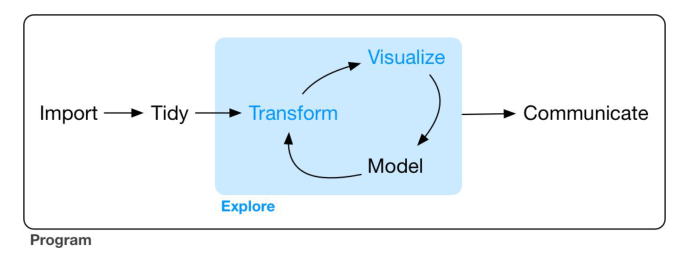
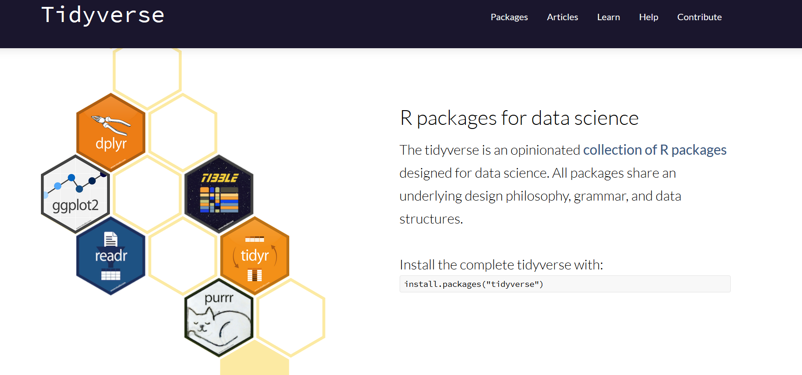

# tidyverse简介 {-}


在一个典型的数据科学项目中，需要的工具模型大抵如下图所示：




 


流程被主要分为三部分:

1. 数据导入
2. 数据整理
3. 数据探索(转换-可视化-建模)  

基于这样的工作流程，Hadley Wickham 及一些 R 爱好者开发了 tidyverse。tidyverse 包是对一些具有相同思想，且可以一同工作的R包的收集。

```{r,message = F}
# 如未安装，先 install.packages("tidyverse")
library(tidyverse)
```

各包负责的工作如下：

  


我们可以将这些包进行分类：数据导入、数据整理、数据转换、可视化、建模、编程   

```{r,echo=F}

```


**数据导入 importing **    

- $readr$:`read_csv()`、`read_delim()`、`read_table()`等  
- $readxl$:`read_xls()`、`read_xlsx()`  
- $haven$:打开SPSS，SAS，stata等外部数据  

首先，必须先将数据导入 R ，这实际上就是读取并保存在文件、数据库或 Web API 中存储的数据，再加载到 R 的数据框中，如果不能将数据导入，下面的工作就无从谈起。  

**数据整理 tidying **     

- $tidyr$:`pviot_longer()`、`pivot_wider()`、`unnest_longer`、`unest_longer()` 改变数据存储的格式  
- $tibble$:比传统数据框 `data.frame` 更为简洁的数据结构  

导入数据后，就应该对数据进行整理。数据整理就是将数据保存为一致、清晰的格式，同时不损害原有的信息。如果数据是整洁的，那么每列都是一个变量，每行都是一个观测。整洁的数据非常重要，因为一致的数据结构可以让我们将工作重点放在分析上，而不用再费尽心思地将数据转换为各种格式以适应不同的函数。    
 
**数据转换 transforming **   

- $dplyr$: `filter()`、`select()`、`arrange()`、`group_by()`、`summarize()`  
- $lubridate$:处理时间数据    
- $stringr$:处理字符串    
- $forcats$:处理因子型变量  

一旦有了整洁的函数，通常下一步就是对数据进行转换。数据转换包括选取出感兴趣的观测（如居住在某个地区的所有人，或者去年的所有数据）、使用现有变量创建新变量（如根据距离和时间计算出速度）、以及计算一些摘要统计量（如计数或者均值）。可以把数据整理和数据转换统称为数据处理 (wrangling)   

一旦数据处理的工作完成，有两种方式可以提供更进一步的洞见：可视化与建模。这两种方式各有利弊，相辅相成。因此，所有实际的数据分析过程都要在这两种方式间多次重复    

**数据可视化**  

- $ggplot2$   

可视化本质上是人类活动。良好的可视化会让人发现之前没有意料到的现象，对数据提出新问题。我们还可以从良好的可视化中意识到自己提出了错误的问题，或者需要收集更多的数据。尽管如此，不要对可视化期望过高，因为最后的解释权仍在人手中  

**模型**  
- $modelr$：实现基础模型
- $broom$：处理多个模型

模型是用来弥补可视化缺点的一种工具。如果已经将问题定义地足够清晰，那么你就可以使用一个数学、统计模型来回答问题。因为模型本质上是数学计算工具，所以它们更具有一般性。但是每个模型都有前提假设，而且模型不会自己设定的前提建设，这就意味着模型本身很难激发人跳出现有的思维定式思考  


**编程**   

- $magrittr$:管道运算符  
- $purr$:通过提供一些完整连贯用于函数和向量的工具集，增强 R 的函数编程功能  

## 使用管道组合多种操作  

使用%>%可以组合多种操作，可以读作“然后”。使用管道符号时，`x %>% f(y) %>% g(z)` 会被转换为 `g(f(x,y),z)` ，依次类推，我们会在函数中频繁使用管道，因为它可以显著提高代码的可读性。  
支持管道操作是 tidyverse 中的 R 包的核心原则之一。唯一的例外就是 ggplot2：它是在发明管道方式之前开发的。  

