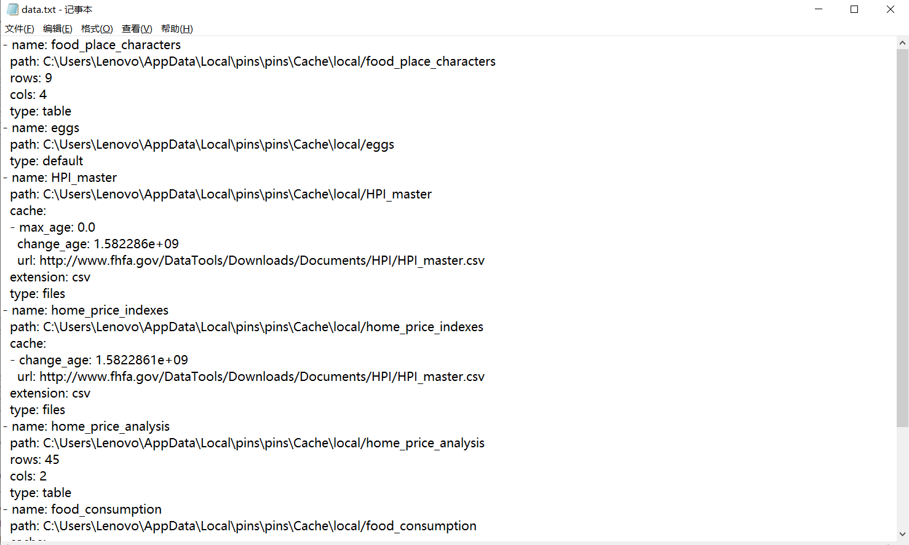
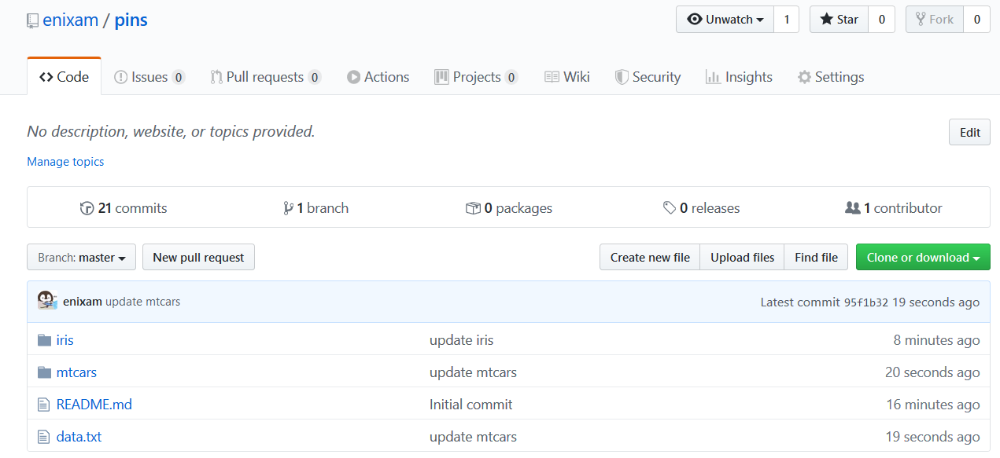

# pins

```{r}
library(pins)
```


## Discovering 

You can discover datasets with `pin_find()`, which by default will search for data inside CRAN packages. The places where pins can find or store resources are referred to as ‘boards’. There are multiple boards available but they require you to configure them so we will leave those for later on.

As a quick example, let’s search for resources that may contain ‘boston housing’:  

```{r}
pin_find("boston housing")
```

We’ve found out that the A3 package contains a Housing dataset, you can then retrieve this dataset using `pin_get()` using `name` column as follows: 

```{r}
pin_get("A3/housing")
```

Most datasets in CRAN contain rectangular data, which pins knows to load as a data frame. Other boards might contain non-rectangular datasets which `pin_get()` also supports. More on this later on, but first, lets introduce caching.  

## Caching

Let’s suppose that the ‘home prices’ dataset is not exactly what we are looking for, we can try to search online for ‘home prices’ and find out that [catalog.data.gov](https://catalog.data.gov/dataset) contains a more suitable [FHFA House Price Indexes](https://catalog.data.gov/dataset/fhfa-house-price-indexes-hpis) dataset. Instead of giving users explicit instructions to download the CSV file, we can instead use `pin()` to cache this dataset locally:  

```{r}
path <- pin("http://www.fhfa.gov/DataTools/Downloads/Documents/HPI/HPI_master.csv")
path
```

Notice that the `pin()` downloads the data and (invisibly) returns a path to the local CSV file.    

We can explore this local storage by creating a pin and then enumerating the board’s storage folder:

```{r}
tibble::tibble(dir(board_local_storage(), full.names = TRUE))
```

As you can see, each pin is stored inside the `rappdirs::user_cache_dir()` folder and a list of resources is tracked on a `data.txt` file. The function `pin()` and `pin_get()` store and retrieve data from this well-known location, while `pin_find()` makes use of the index file to search for resources and track other properties like cache expiration information.   

Inside `data.txt`:   

```{r, echo = FALSE}

```


`pin_get()` to retrieve data:  

```{r}
house_price <- vroom::vroom(path)
house_price
```

The pins package tries to be smart about downloading files only when the file has changed, you can skip the details on how this works but you should know you can set `download = TRUE` to force pins to download the file again even if we think it has not changed. The specific mechanisms pins uses are based on HTTP headers like cache-control and ETag to avoid downloading files when they have not changed or when the cache has not expired.  

Notice that `pin()` assigned a name automatically, HPI_master for the previous example; however, you can choose your own `name` and be explicit about retrieving a pin with `pin_get()` (setting a new name will entail a new download):  


```{r}
pin("http://www.fhfa.gov/DataTools/Downloads/Documents/HPI/HPI_master.csv",
    name = "home_price_indexes")

pin_get("home_price_indexes") %>%
  read_csv(col_types = cols())
```

## Sharing  

After performing a data analysis, you might want to share your dataset with others, which you can achieve using `pin(data, board = "<board-name>")`.

```{r}
board_list() 
```

There are multiple boards available, one of them is the “local” board which pins uses by default. A “local” board can help you share pins with other R sessions and tools using a well-known cache folder in your local computer defined in the rappdirs package. Notice that this board is available by default:

You can also name your boards using the ‘name’ parameter, when a name is not specified, the pins package will simply name your board with the kind of board you are using, ‘local’ in the previous example.

The following example stores a simple data analysis over home prices as ‘home_price_analysis’ in the ‘local’ board.  

```{r}
pin_get("home_price_indexes") %>%
  read_csv(col_types = cols()) %>%
  dplyr::group_by(yr) %>%
  dplyr::count() %>%
  pin("home_price_analysis")
```


```{r}
pin_get("home_price_analysis") # board = TRUE
```

## Using boards  

## Github    

### Registering

First check `nchar(Sys.getenv("GITHUB_PAT")) > 0`, if it is `FALSE`. Run `usethis::browse_github_pat()` and follow the instructions.   

```{r}
nchar(Sys.getenv("GITHUB_PAT")) > 0
```


If the above statement is TRUE, this means GitHub is already configured, which means you can register an existing GitHub board as follows. However, when using a new repo, first manually create an empty repo from [github.com/new](github.com/new).  

```{r, eval = FALSE}
board_register_github(repo = "enixam/pins")
```

### Pinning
Let’s start by creating to pins for `iris` and `mtcars` under the GitHub board
```{r, eval = FALSE}
pin(iris, description = "The iris data set", board = "github")
pin(mtcars, description = "The motor trend cars data set", board = "github")
```

Notice then the structure in the GitHub repo. Similar to the folder structure in the local board, a folder is created for each pin and a `data.txt` index added to the repo.

```{r, echo = FALSE}

```
You can also retrieve pins back from this repo using the now familiar `pin_get()` function,

```{r}
pin_get("iris", board = "github")
```

### Discovering  

You can then search pins in your repo using `pin_find()`, which by default search all boards but you can also explicitly request to use this particular GitHub board:  

```{r}
pin_find("mtcars")

pin_find("mtcars", board = "github")
```

GitHub boards contain extended fields that go beyond the fields pins requires, to retrieve all the additional fields use `extended = TRUE`:  

```{r}
pin_find("mtcars", board = "github", extended = TRUE)
```

Or `pin_info()` to retrieve all the information associated with a particular pin:  

```{r}
pin_info("mtcars", board = "github")
```

A GitHub repo only supports files under 25MB in size (100MB in theory but there is additional overhead when using the GitHub API). To store large files, GitHub recommends storing them using GitHub Releases which support up to 2GB files.

Therefore, to support large files, pins makes use of GitHub release files. When you upload a file over , pins will create a new GitHub release file for that particular pin. Everything else works as expected, you can still retrieve the large resource with `pin_get()` and find it with `pin_find()`. The only noticeable change is new releases being created in your repo:

## Rstudio Connect  

### Registering  

In order to use RStudio Connect as a board, you need to authenticate first. When using RStudio, you can authenticate launching Tools - Global Options - Publishing - Connect, and follow the instructions from that wizard:

Once an RStudio Connect account is registered in RStudio, you can simply run:

```{r}
board_register_rsconnect()
```


