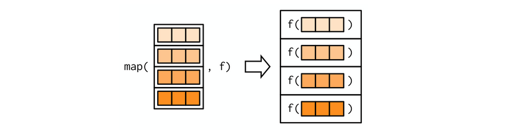

# purrr  

purrr tutorial : https://jennybc.github.io/purrr-tutorial/  

## `map()` family  

```{r,echo=F}
knitr::opts_chunk$set(cache=T)
```


```{r,echo=F}
knitr::include_graphics("images/map.png")
```


```{r}
mtcars %>%
  map(mean) %>% 
  str()
```

```{r}
simple_map <- function(x, fun, ...) {
  output <- vector("list", length = length(x))
  for (i in seq_along(x)) {
    output[[i]] <- fun(x[[i]], ...)
  }
  output
}
```

## Producing atomic vectors 

```{r}
# map_chr() always returns a character vector
mtcars %>%
  map_chr(typeof)
```

```{r}
# map_lgl() always returns a logical vector
mtcars %>%
  map_lgl(is.double)
```


```{r}
# map_int() always returns a integer vector
mtcars %>%
  map_int(function(x) length(unique(x)))
```


```{r}
# map_dbl() always returns a double vector
mtcars %>%
  map_dbl(mean)
```


```{r,echo=F}

```


```{r,error=T}
pair <- function(x) c(x, x)
map_dbl(1:2, pair)
```


```{r}
1:2 %>%
  map(pair)
```


```{r,error=T}
1:2 %>% 
  map_dbl(as.character)
```
```{r}
1:2 %>% 
  map_chr(as.character)
```


### purrr-style anonymous functions  

```{r}
mtcars %>% 
  map_dbl(function(x) length(unique(x)))
```


```{r}
mtcars %>%
  map_dbl(~ length(unique(.x)))
```

```{r}
mtcars %>%
  map_dbl(~ length(unique(.)))
```


This shortcut is particularly useful for generating random data:  

```{r}
1:5 %>%
  map(~ rnorm(mean = .x, n = 5)) %>%
  str()
```


```{r}
x <- list(
  list(-1, x = 1, y = c(2), z = "a"),
  list(-2, x = 4, y = c(5, 6), z = "b"),
  list(-3, x = 8, y = c(9, 10, 11))
)

# select by position
x %>% 
  map(2)
```

```{r}
# select by name
x %>% 
  map("x")
```

```{r}
# select by both position and name
x %>%
  map(list("y", 2))
```


## Predicate functions 


### Basics  

```{r}
df <- data.frame(x = 1:3, y = c("a", "b", "c"))
```

```{r}
df %>% 
  keep(is.numeric)
```

```{r}
df %>% 
  discard(is.numeric)
```


```{r}
df %>% 
  mutate(new_col = LETTERS[1:3]) %>%
  detect(is.factor)
```

```{r}
df %>% 
  detect_index(is.factor)
```


### Map variants  


```{r}
df <- data.frame(
  num1 = c(0, 10, 20),
  num2 = c(5, 6, 7),
  chr1 = c("a", "b", "c"),
  stringsAsFactors = FALSE
)


df %>% 
  map_if(is.numeric, mean, na.rm = T) %>% 
  str()
```

```{r}
df %>% 
  modify_if(is.character, str_to_upper) %>% 
  str()
```

## group functions

### group_map、group_modify

`group_map()`, `group_modify()` and `group_walk()` are purrr-style functions that can be used to iterate on grouped tibbles.


```{r}
iris %>% 
  group_by(Species) %>% 
  group_map(~ broom::tidy(lm(Sepal.Length ~ Sepal.Width, data = .x))) %>% 
  bind_rows()
```

```{r}
iris %>% 
  group_by(Species) %>% 
  group_modify(~ broom::tidy(lm(Sepal.Length ~ Sepal.Width, data = .x)))
```

This is similar to `split()` and then `map()`:  

```{r}
iris %>% 
  split(.$Species) %>% 
  map_dfr(~ broom::tidy(lm(Sepal.Length ~ Sepal.Length, data = .x)))
```


### group_nest、group_split、group_keys、group_data


`group_nest()` is similar to `group_by() + tidyr::nest()`: 

```{r}
iris %>% 
  as_tibble() %>%
  group_nest(Species)
```


`group_split()` is a tidy version of `base::split()`. In particular, it respects a group_by()-like grouping specification, and refuses to name its result.


```{r}
iris %>% 
  as_tibble() %>%
  group_split(Species)
```


```{r}
iris %>% 
  as_tibble() %>%
  group_by(Species) %>%
  group_data()
```


only grouping variables:  

```{r}
iris %>% 
  as_tibble() %>%
  group_keys(Species)
```

only rows:  

```{r}
iris %>% 
  as_tibble() %>%
  group_by(Species) %>% 
  group_rows()
```

## Other useful tools  

### `imap()`  

`imap_xxx(x, ...)` is short hand for `map2(x, names(x), ...)`if `x` has names, or `map2(x, seq_along(x), ...)` if it does not. This is useful if you need to compute on both the value and the position of an element.  

Note that when using the formula shortcut, `.x` is the value, and the `.y` is the position:  

```{r}
x <- c("sheldon" = 150, "leonard" = 140, "raj" = 145, "howard" = 140)
imap(x, str_c)
imap(x, ~ str_c(.y, .x))

# on a tibble
imap_chr(mtcars, ~ str_c(.y, "median:", median(.x), sep = " "))
```


### adverbs 

`partial` wraps a function:  

```{r}
mean(c(10, NA, 5, 7), na.rm = TRUE)

my_mean <- partial(mean, na.rm = TRUE)
my_mean(c(10, NA, 5, 7))
```

`negate()` negates a predicate function:  

```{r}
lst <- list("a", 3, 22, NULL, "q", NULL)
map_lgl(lst, ~ !is.null(.))
```


```{r}
is_not_null <- negate(is.null)
map_lgl(lst, is_not_null)
```

`safely()` and `possibly()`:  

```{r}
add_ten <- function(x) {
  x + 10
}

add_ten_safely <- safely(add_ten)
map(lst, add_ten_safely)
```

```{r}
# If you’re not interested in what the error is
add_ten_possibly <- possibly(add_ten, otherwise = "not numeric")
map(lst, add_ten_possibly)
```

`compose()` lets you string together multiple functions  

```{r}
add_ten_log_and_round <- compose(round, log, add_ten)
c(1, 5, 100) %>% add_ten_log_and_round()
# is equal to
c(1, 5, 10) %>% 
  add_ten() %>% 
  log() %>% 
  round()
```

