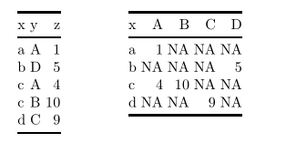

# tidyr

## 简介  {#tidyr-intro}

> “Happy families are all alike; every unhappy family is unhappy in its own way.” –– Leo Tolstoy    

> “Tidy datasets are all alike, but every messy dataset is messy in its own way.” –– Hadley Wickham

整洁的数据(Tidy data)是进行数据操作和 ggplot2 可视化的基础，所谓数据整理（清洗、清理），就是把 messy data 转换为 tidy data 的过程。在 tidyverse 生态中，**tidyr** 便负责数据的整理和变型：


如果一个数据集是整洁的，需要满足以下三个要素：  
1. 每个变量有一个专属列(Each variable must have its own column)  
2. 每个观测有一个专属行(Each observation must have its own row)  
3. 每个值必须都有一个专属的存储单元(Each value must its own cell)  

```{r,echo=F}
knitr::include_graphics("images/11.png")
```


这三条规则是互相关联的，不可能只满足三条规则中的两条，所以我们可以更简化地把清洁数据的要求写成：  
1. 每列是一个变量(Variables go in columns)  
2. 每行是一个观测(Observatiosn go in rows)


同样的数据可以有不同的表现形式，但只有满足整洁数据的三个条件的数据集才是最容易使用的，这也是。以下的3个数据集背后的均来自1999年和2000年世界卫生组织在阿富汗、巴西和中国的一次肺结核病例调查，都有`country`、`year`、`cases`和`population`四个变量，但采用了不同的组织方式:
```{r}
table1
table2
table3
```

`table4a`和`table4b`分别是以 cases 和 population 为值的数据透视表：  
```{r}
table4a
table4b
```


在上面的例子中，只有`table1` 符合清洁数据的标准。在`table2` 中，`type`不是一个变量，它的值 `cases` 和 `population` 才是变量，进而导致了每一行不是一个完整的观测。在 `table3` 中，`rate` 同样不是一个变量，`cases` 和 `population` 的值被挤在了一个单元里。至于 `table4a` 和`table4b`，`1999` 和 `2000`不是变量，而是一个表示年份的变量的值。  

为什么要为获得清洁的数据如此大费周折呢？主要有两个优点：  

1. 清洁数据的规则使得我们可以遵从一个一致、明确的结构存储数据。学习处理这些数据的工具变得很容易，因为你的对象在底层是一致的。  
2. 把变量存储在列中可以把 R 的向量化函数优势发挥到极致。例如 `mutate()` 和 `summarize()` ，许多内置的 R 函数都是对向量进行操作的。只要有了清洁的数据，后面的数据变换工作就很容易：  
```{r}
# Compute rate per 10,000
table1 %>% 
  mutate(rate = cases / population * 10000)
# Compute cases per year
table1 %>%
  group_by(year) %>%
  summarize(cases = sum(cases)) 
# 或者：
table1 %>% 
  count(year, wt = cases)

# Visualise changes over time
library(ggplot2)
ggplot(table1, aes(year, cases)) + 
  geom_line(aes(group = country), colour = "grey50") + 
  geom_point(aes(colour = country))+
  scale_x_continuous(breaks = c(1999,2000),labels = c("1999","2000"))

```

### 练习  
> 1. 用`table2`计算`rate`($\frac{cases}{population}$)。提示：需要进行以下四步操作：
  * 得到每个国家每年的`cases`  
  * 得到每个国家每年的`population`  
  * 计算`rate = cases / population`  
  * 把算好的数据存储到正确的位置 
  
首先，分别对`cases`和`population`建立一张表，并且确保两张表的排列顺序相同：  

```{r}
table2

(t2_cases <- filter(table2, type == "cases") %>%
  rename(cases = count) %>%
  arrange(country, year))

(t2_population <- filter(table2, type == "population") %>%
  rename(population = count) %>%
  arrange(country, year))
```

计算`rate`  
```{r}
t2_cases_per_cap <- tibble(
  t2_cases$country,
  t2_cases$year,
  cases = t2_cases$cases,
  population = t2_population$population
)

t2_cases_per_cap

t2_cases_per_cap %>%
  mutate(rate = cases/population) %>%
  select(1,2,5) %>%  
  ## 改变列名
  mutate(
    country = t2_cases$country,
    year = t2_cases$year
  ) %>%
  select(country,year,rate)
```

## `spread()`和`gather()`

请看下面的两张表格：  

<center>
```{r}

```
</center>

细看两表，不难发现它们实质上相同的数据(第二张表是以 x 为行字段，y 为列字段，z 为值的数据透视表)。第一种形式成为**长数据(long data,indexed data，指标型数据)**，在长数据（指标型）数据汇总，你需要看指标来找到需要变量的数值（变量x，y，z的值）。第二种称为**宽数据(wide data,Cartesian data,笛卡尔型数据)**，需要看行和列的交叉点来找到对应的值。很难简单地说哪一种格式更优，因为两种形式都有可能是整洁的，这取决于值"A"、"B"、"C"、"D"的含义。  

注意到上面的确实值：在一种形式下显示存在的缺失值在另一种格式下不一定能直接看得出来。NA代表了一种缺失情况，但有时数值确实单纯是因为那里没有值。（而不是因为记录失误，没有获取到等原因）  

数据整理常需要化宽为长，称为聚集(gathering)，但偶尔也需要化长为宽，称为扩散(spreading)。`tidyr`包分别提供了`gather()`和`spread()`函数来实现以上操作。  


### `gather()`  

`gather()`函数用来处理messy data 的一个常见症状：部分列名不是变量的名子，而是变量的值(some of the column names are not names of variables, but *values* of a variale)，或者说一行中有多个观测。例如，在`table4a`中，`1999`和`2000`不是某个变量的名字，而是一个表示年份的变量的不同取值：
```{r}
table4a
```

可以将之与清洁数据`table1`相比对，不难看出，在`table4a`中的3行数据在`table1`中需要6行来表示，这就需要“化宽为长”的`gather()`函数。
```{r}
table1
```

`gather()`有四个主要参数：  

* `data`: 需要调用的数据集  
* `key`： 存放原来各列名的新变量的变量名（键列）   
* `value` 存放原来单元格中的值的新变量的变量名（值列）  
* `...`:  指定的要聚集（融合）的变量，可以通过枚举指定: `A`,`B`,`C` 或者通过范围进行指定`A:D`,也可以同过`-`号 指定不需要聚集的列：`-E,-F`。不管要聚集多少列，`gather()`函数都把它们聚集为一个键列和一个值列。  


接下来我们整理`table4a`数据集，这里需要聚集的列是`1999`和`2000`:
```{r}
## 注意这里`1999`和`2000`的引用方法
gather(table4a,key = year,value = cases,`1999`,`2000`)
```

图示变换过程： 


另一个例子：美国劳工市场的月度数据，首先创建一个messy data：
```{r}
library(lubridate)
ec2 <- economics %>% as_tibble() %>%
  transmute(year = year(date),
            month = month(date),
            rate = unemploy) %>%
  filter(year > 2005) %>%
  spread(year,rate)

ec2
```

下面，将除了`month`列的所有列聚集为一个键列和一个值列
```{r}
ec2 %>%
  gather(-month,key = year,value = unemploy)
```

为了让数据更好用，我们还可以增加两个额外的参数：
```{r}
economics_2 <- ec2 %>%
            gather(key = year,value = unemploy,`2006`:`2015`,convert = T,na.rm = T)
```

`convert = TRUE`将键列`year`变量从字符串转换为数值型（在练习里会谈到为什么`year`变成了字符串），`na.rm = TRUE`则可以自动移除没有值的月份（其实这个确实并不是数据的丢失，而只是因为那个时间还有到而已）。  

以上数据整理好之后，就很容易用`ggplot2`作的。如我们可以关注长期趋势，或者查看季节性变化：  
```{r}
## x轴为季度
ggplot(economics_2,aes(x=(year+(month-1)/12),y=unemploy))+
  geom_line()
```

```{r}
ggplot(economics_2,aes(month,unemploy))+
  geom_line(aes(group = year,color = factor(year)),size = 1)
```


### `spread()`  
`spread()`函数是`gather()`的逆运算，当某个变量的值实际上是其他变量的名字，就需要将数据集化长为宽，也可以说这种“错误”的表现形式是一个观测分散到了多行中（an observation is scattered across multiple rows）。例如`table2()`:  
```{r}
table2
```

例如，前两列结合起来，才能得到对1999年阿富汗在`cases`和`population`两个变量上的观测。  

在`spread()`中，你只需要指定两个参数（除了`data`以外），`key`和`value`，这里分别是`type`和`count`:
```{r}
table2 %>%
  spread(key = type,value = count)
```

观察`table2`经过扩散的结果，不难看出`spread(key,value)`其实是构造透视表的过程。`key`列将被用作列字段，`value`列被用作透视表中的值字段，其他列将被当做行字段。  


变换的图示：  


### 练习  

> 1. 在下面的例子中，研究为什么`spread()`和`gather()`不是完美对称的。  

```{r}
(stocks <- tibble(
  year = c(2015, 2015, 2016, 2016),
  half = c(1, 2, 1, 2),
  return = c(1.88, 0.59, 0.92, 0.17)
))
stocks %>%
  spread(year, return) %>%
  gather(`2015`:`2016`, key = "year", value = "return")
```


先后使用`spread()`和`gather()`无法得到一个相同的数据集（除了列的顺序）是因为，数据整理有时会丢失列的类型信息。当`spread()`将变量`year`的值`2015`和`2016`用作列的名字时，它们自然被转化为了字符串`"2015"`和`"2016"`；随后`gather()`把列名用作键列`year`的值，从而`year`自然变成了一个字符向量。  

如果想要复原这个数据集，可以在`gather()`中使用`convert = T`，不过这时返回的数据类型是R经过猜测的结果，并不总保证和原数据一致，数据整理带来的不可避免的信息损耗。  
```{r}
stocks %>%
  spread(year, return) %>%
  gather(`2015`:`2016`, key = "year", value = "return",convert = T)
```

> 2.为什么下面的数据框不能应用`spread()`？可以添加一列解决这个问题吗？  

```{r,error = T}
people <- tribble(
  ~name, ~key, ~value,
  "Phillip Woods", "age", 45,
  "Phillip Woods", "height", 186,
  "Phillip Woods", "age", 50,
  "Jessica Cordero", "age", 37,
  "Jessica Cordero", "height", 156
)

```

因为这个数据集里有两个对于"Phillip Woods"在变量`age`上年龄的观测，`spread()`就要把由`(Phillips Woods,age)`确定的单元格里“塞进两个值”。本质上因为`name`和`key`这两个变量上的值不能唯一确定一行，所以我们只要添加一列，让`name`、`key`和新列可以唯一确定一行即可： 

```{r}
people2 <- people %>%
  group_by(name, key) %>%
  mutate(obs = row_number())

people2

spread(people2,key,value)
```


## `separate()`和`untie()`  

`spread()`函数和`gather()`函数可以帮你解决数据中的变量放错了位置的问题。而`separate()`和`untie()`函数则是为了解决以下问题：多个变量挤在了同一列中，或者一个变量分散到了不同列中。  


### `separate()`  

现在我们知道了如何用`spread()`和`gather()`将`table2`和`table4`整理为tidy data，现在要学会如何用`separate()`处理`table3`了：  
```{r}
table3
```

在`table3`中，`rate`同时包含了`cases`和`population`两个变量，我们需要把它拆分(separate)为两列，`separate()`函数可以将这一混杂的列拆分成多个变量，它包含以下四个主要参数：  

* `data`: 需要调整的数据框  
* `col`: 需要进行拆分的列的列名  
* `into`:  拆分后新生成变量的列名，格式为字符串向量  
* `sep`: 对如何拆分原变量的描述，其可以是正则表达式，如`_`表示通过下划线拆分，或`[^a-z]`表示通过任意非字符字母拆分，或一个指定位置的整数。默认情况下，`sep`将认定一个非字符字母进行划分  

```{r}
## 这个例子里，sep不是必需的
table3 %>%
  separate(col = rate,into = c("cases","population"))
```

整理的图示：  


注意，以上输出的tibble中，`cases`和`population`被设定为字符串类型，使用`convert = T`将其转换为数值变量

```{r}
table3 %>% 
  separate(rate, into = c("cases", "population"), convert = T)
```

### `unite()`  

`unite()`函数是`separate()`的逆运算——它可以将多列合并为一列。尽管它不太常用，但是知道这个函数还是很重要的。  

在`table5`中，原来的`year`变量被拆成了两个列，可以用`unite()`，只需要指定要合并后的列名和要合并的列。默认情况下，新列中将用`_`分隔符
```{r}
table5
unite(table5,col = year, century,year)
```

设置`sep`参数可以取消分隔符：  
```{r}
unite(table5,col = year,century,year,sep="")
```

整理的图示：


```{r}
table6 <- unite(table5,col = year,century,year,sep="")
table5
```

### 练习  

> 1. `separate()`中的`extra`和`fill`参数的作用是什么？用下面两个数据框进行实验： 
```{r,error = T}
tibble(x = c("a,b,c", "d,e,f,g", "h,i,j")) %>% 
  separate(x, into = c("one", "two", "three"))
tibble(x = c("a,b,c", "d,e", "f,g,i")) %>% 
  separate(x, into = c("one", "two", "three"))
```

`extra`用来告诉`separate()`函数如何处理分列过程中多出来的元素(too many pieces，即`into`指定的列数小于原数据中某行可分的元素个数)，`fill`负责如何处理元素不够的情况(not enough pieces，即`into`指定的列数大于原数据中某行可分的元素个数)。默认情况下，`extra = "drop"`，`separate()`将丢弃多余的元素，并生成一条警告信息：  
```{r}
tibble(x = c("a,b,c", "d,e,f,g", "h,i,j")) %>% 
  separate(x, into = c("one", "two", "three"),extra = "drop")
```

`extra = "merge"`将把多余的元素和前一个元素当做一个整体：  

```{r}
tibble(x = c("a,b,c", "d,e,f,g", "h,i,j")) %>% 
  separate(x, c("one", "two", "three"),extra = "merge")
```

对于元素过少的情况，默认的`fill = "warn"`将会用`NA`进行填充，但会生成一条警告。`fill = "right"`会尽可能让靠左的列拥有可用的元素，用`NA`填充右边的列；`fill = "left"`正好相反。这两种手动设置都不会产生`warning`:  
```{r}
tibble(x = c("a,b,c", "d,e,", "h,i,j")) %>% 
  separate(x, c("one", "two", "three"),fill = "left")
tibble(x = c("a,b,c", "d,e,", "h,i,j")) %>% 
  separate(x, c("one", "two", "three"),fill = "right")
```

> 2.`unite()`和`separate()`均有一个`remove`参数，它的作用是什么？    

`remove`控制是否在`unite()`或`separate()`输出的数据框中保留原来的列，默认`remove = T`。如果想保留原来未合并/分离的格列，可以设置`remove = F`
```{r}
table5 

table5 %>% unite(col = year_unite,century,year,sep = "",remove = F)
```

> 3. 探究`tidyr`中一个与`separate()`类似的函数`extract()`的用法  

`separate()`函数的分列操作是基于参数`sep`的，无论是给`sep`传入字符串指定分隔符，还是用数值指定分隔的位置，`separate()`必须要有一个分隔符才能正常运作（可以把`sep = n`看做第n个和第n+1个元素之间的一个空白分隔符）  

`extract()`用一个正则表达式`regex`描述要分隔的列`col`中存在的模式，在正则表达式中的每个子表达式(用`()`定义)将被认为是`into`中的一个元素，因此，`extract()`比`separate()`使用起来更加广泛灵活。例如下面的数据集无法用`separate()`分列，因为无法用一个各行的分隔符(的位置)不一样，但用`extract()`中的正则表达式就很简单：  
```{r}

tibble(x = c("X1", "X20", "AA11", "AA2")) %>%
  extract(x, c("variable", "id"), regex = "([A-Z]+)([0-9]+)")
```


适当设计`regex`，实现的效果可以与设置`sep`完全一致：  
```{r}
# example with separators
tibble(x = c("X_1", "X_2", "AA_1", "AA_2")) %>%
  extract(x, c("variable", "id"), regex = "([A-Z]+)_([0-9])")

# example with position
tibble(x = c("X1", "X2", "Y1", "Y2")) %>%
  extract(x, c("variable", "id"), regex = "([A-Z])([0-9])")
```


## 缺失值 {#tidyr-missing}
数据整理改变了数据的呈现方式，随之而来的一个话题便是缺失值。通常当我们泛泛地使用"缺失值 (missing value)" 这个名词的时候，其实是指以下两种"缺失"方式中的某一种：  

* 显式缺失(Explicitly missing): 在数据中用`NA`标识
* 隐式缺失(Implicitly missing): 未出现在数据中的值  

`R for Data Science`中对这两种缺失的概括：  

> An explicit missing value is the presence of an absence; an implicit missing value is the absence of a presence.

通过一个简单的数据框区分两种数据缺失的方式：  
```{r}
stocks <- tibble(
  year   = c(2015, 2015, 2015, 2015, 2016, 2016, 2016),
  qtr    = c(   1,    2,    3,    4,    2,    3,    4),
  return = c(1.88, 0.59, 0.35,   NA, 0.92, 0.17, 2.66)
)

stocks
```

我们很容易找到`stocks`第四条观测在变量`return`上的一个`NA`，因为它是显式缺失的。另一个隐式缺失的值是`(year = 2016,qtr = 1)`对应的观测，它没有出现在数据集中。  

数据呈现方式上的改变可以将隐式缺失值变成显式。比如，用`spread()`函数构造以`year`为行字段，以`return`为值的透视表,这样就会产生一个属于水平`(year = 2016,qtr = 1)`的单元格：  

```{r}
stocks %>%
  spread(key = year,value = return)
```

现在，再使用`gather()`不能得到原来的数据框，因为将比原来多出一行显示的缺失值
```{r}
stocks %>%
  spread(key = year,value = return) %>%
  gather(key = year,value = return,`2015`:`2016`)
```

如果研究者认为这些缺失值是无足轻重的,`na.rm = T`将在`gather()`生成的数据框中移除含有缺失值的行：  
```{r}
## 现在输出数据框比原来少一行
stocks %>%
  spread(key = year,value = return) %>%
  gather(key = year,value = return,`2015`:`2016`,na.rm = T)
```

另一个用于处理确实值的有用工具是`complete()`函数，它将生成一个指定列集合里面所有的水平组合，并自动将原本隐式的缺失值填充为`NA`
```{r}
stocks %>%
  complete(year, qtr)
```

`fill()` 函数专门用来填充缺失值,它接受一些需要填充缺失值的列，并用最近的值调换 `NA`，`.direction` 参数控制用填充的方向：`direction = “up"` 将由下往上填充，`NA` 将被替换为它下面那一列的值；`direction = "donw"` 反之


```{r}
treatment <- tribble(
  ~ person,           ~ treatment, ~response,
  "Derrick Whitmore", 1,           7,
  NA,                 2,           10,
  NA,                 3,           9,
  "Katherine Burke",  1,           4
)

treatment %>%
  fill(person,.direction = "up")

treatment %>%
  fill(person,.direction = "down")
```

## Case Study  

To finish off the chapter, let’s pull together everything you’ve learned to tackle a realistic data tidying problem. The `tidyr::who` dataset contains tuberculosis (TB) cases broken down by year, country, age, gender, and diagnosis method. The data comes from the *2014 World Health Organization Global Tuberculosis Report*, available at [http://www.who.int/tb/country/data/download/en/](http://www.who.int/tb/country/data/download/en/).  

There’s a wealth of epidemiological information in this dataset, but it’s challenging to work with the data in the form that it’s provided:

```{r,message = F}
who
```


This is a very typical real-life example dataset. It contains redundant columns, odd variable codes, and many missing values. In short, `who` is messy, and we’ll need multiple steps to tidy it. Like `dplyr`, `tidyr` is designed so that each function does one thing well. That means in real-life situations you’ll usually need to string together multiple verbs into a pipeline.

The best place to start is almost always to gather together the columns that are not variables. Let’s have a look at what we’ve got:  

* It looks like `country`, `iso2`, and `iso3` are three variables that redundantly specify the country.  
* `year` is also a variable  
* We don’t know what all the other columns are yet, but given the structure in the variable names (e.g. `new_sp_m014`, `new_ep_m014`, `new_ep_f014`) these are likely to be values, not variables.  

So we need to gather together all the columns from `new_sp_m014` to `newrel_f65`. We don’t know what those values represent yet, so we’ll give them the generic name `"key"`. We know the cells represent the count of cases, so we’ll use the variable `cases`. There are a lot of missing values in the current representation, so for now we’ll use `na.rm` just so we can focus on the values that are present.

```{r}
who1 <- who %>% 
  gather(key,value = "cases",-country:-year,na.rm = T)

who1
```

We can get some hint of the structure of the values in the new `key` column by counting them:  
```{r}
who1 %>%
  count(key)
```

You might be able to parse this out by yourself with a little thought and some experimentation, but luckily we have the data dictionary handy. It tells us:  
1. The first three letters of each column denote whether the column contains new or old cases of TB. **In this dataset, each column contains new cases**.  
2. The next two letters describe the type of TB:
  * `rel` stands for cases of relapse  
  * `ep` stands for cases of extrapulmonary TB  
  * `sn` stands for cases of pulmonary TB that could not be diagnosed by a pulmonary smear (smear negative)  
  * `sp` stands for cases of pulmonary TB that could be diagnosed be a pulmonary smear (smear positive)  

3. The sixth letter gives the sex of TB patients. The dataset groups cases by males (`m`) and females (`f`).

4. The remaining numbers gives the age group. The dataset groups cases into seven age groups:  
  * `014` = 0 – 14 years old  
  * `1524` = 15 – 24 years old  
  * `2534` = 25 – 34 years old  
  * `3544` = 35 – 44 years old  
  * `4554` = 45 – 54 years old  
  * `5564` = 55 – 64 years old  
  * `65` = 65 or older  
  
We need to make a minor fix to the format of the column names: unfortunately the names are slightly inconsistent because instead of `new_rel` we have `newrel` (it’s hard to spot this here but if you don’t fix it we’ll get errors in subsequent steps). You’ll learn about `str_replace()` in strings, but the basic idea is pretty simple: replace the characters “newrel” with “new_rel”. This makes all variable names consistent.

```{r}
who2 <- who1 %>% 
  mutate(key = stringr::str_replace(key, "newrel", "new_rel"))
who2
```


**We can separate the values in each code with two passes of `separate()`. The first pass will split the codes at each underscore**.  

```{r}
who3 <- who2 %>% 
  separate(key, c("new", "type", "sexage"), sep = "_")
who3
```

Then we might as well drop the `new` column because it’s constant in this dataset. While we’re dropping columns, let’s also drop `iso2` and `iso3` since they’re redundant.  

```{r}
who3 %>% 
  count(new)

who4 <- who3 %>% 
  select(-new, -iso2, -iso3)
```

Next we’ll separate `sexage` into `sex` and `age` by splitting after the first character:  
```{r}
who5 <- who4 %>% 
  separate(sexage, c("sex", "age"), sep = 1)
who5
```

The `who` dataset is now tidy!

I’ve shown you the code a piece at a time, assigning each interim result to a new variable. This typically isn’t how you’d work interactively. Instead, you’d gradually build up a complex pipe:  

```{r}
who %>%
  gather(key, value, new_sp_m014:newrel_f65, na.rm = TRUE) %>% 
  mutate(key = stringr::str_replace(key, "newrel", "new_rel")) %>%
  separate(key, c("new", "var", "sexage")) %>% 
  select(-new, -iso2, -iso3) %>% 
  separate(sexage, c("sex", "age"), sep = 1)
```


### 练习  
> 1. 在清理`who`数据框时，我们说`iso2`和`iso3`在有了`country`之后是冗余的，证明这一点  

如果`iso2`和`iso3`相对于`country`是冗余的，则在数据集中对于变量`country`的每个值，仅有一个`iso2`和`iso3`的水平组合(`country`能唯一确定一条观测)。  

这里要用到`distinct()`函数，它将返回数据框中某些列出现的的全部不重复的水平组合（注意`complete()`是”制造出“全部可能的水平组合），和`unique()`类似，但速度更快： 
```{r}
who6 <- who %>%
          distinct(country,iso2,iso3) %>%
          group_by(country) %>%
          summarize(n = n())

who6 %>%
  filter(n > 1)
```


## 拓展：None-tidy data  {#non-tidy}

Before we continue on to other topics, it’s worth talking briefly about non-tidy data. Earlier in the chapter, I used the pejorative term “messy” to refer to non-tidy data. That’s an oversimplification: there are lots of useful and well-founded data structures that are not tidy data. There are two main reasons to use other data structures:  


* Alternative representations may have substantial performance or space advantages.  
* Specialised fields have evolved their own conventions for storing data that may be quite different to the conventions of tidy data.  


Either of these reasons means you’ll need something other than a tibble (or data frame). If your data does fit naturally into a rectangular structure composed of observations and variables, I think tidy data should be your default choice. But there are good reasons to use other structures; tidy data is not the only way.

If you’d like to learn more about non-tidy data, I’d highly recommend this thoughtful blog post by Jeff Leek: [http://simplystatistics.org/2016/02/17/non-tidy-data/](http://simplystatistics.org/2016/02/17/non-tidy-data/)  

## `tidyr 1.0.0` 


tidyr 于 2019 年 9 月 14 日发布了版本 1.0.0，有以下重大变化：  


* New `pivot_longer()` and `pivot_wider()` provide improved tools for reshaping, superceding `spread()` and `gather()`.   

* New `unnest_auto()`, `unnest_longer()`, `unnest_wider()`, and `hoist()` provide new tools for rectangling, converting deeply nested lists into tidy data frames.  

* `nest()` and `unnest()` have been changed to match an emerging principle for the design of `...` interfaces. Four new functions (`pack()`/`unpack()`, and `chop()`/`unchop()`) reveal that nesting is the combination of two simpler steps.  

* New `expand_grid()`, a variant of `base::expand.grid()`. This is a useful function to know about, but also serves as a good reason to discuss the important role that `vctrs` plays behind the scenes. You shouldn’t ever have to learn about `vctrs`, but it brings improvements to consistency and performance.  


参考 https://www.tidyverse.org/articles/2019/09/tidyr-1-0-0/  

文档：  

* [`vignette("pivot")`](https://tidyr.tidyverse.org/articles/pivot.html)、[`vignette("rectangle")`](https://tidyr.tidyverse.org/articles/rectangle.html) and [`vignette("nest")`](https://tidyr.tidyverse.org/articles/nest.html) provide detailed documentation and case studies of pivotting, rectangling, and nesting respectively.  
* [`vignette("in-packages")`](https://tidyr.tidyverse.org/articles/in-packages.html) provides best practices for using tidyr inside another package, and detailed advice on working with multiple versions of tidyr if an interface change has affected your package.   


```{r,message=F}
library(tidyverse)
```


### `Pivoting` 

`pivot_longer()` 和 `pivot_wider()` 分别对应原来的 `gather()` 和 `spread()`，如今 API 更加容易理解：  

```r
pivot_longer(data, 
  cols,
  names_to = "name",
  values_to = "value",)
```

```r
pivot_wider(data, 
  names_from = name,
  values_from = value)
```


#### `pivot_longer()`  

基本用法：  

```{r}
relig_income

relig_income %>% 
  pivot_longer(cols = -religion, 
               names_to = "income",
               values_to = "count")
```


`names_to` 和 `values_to` 参数相当于原来 `gather()` 中的 `key` 和 `value`，其中 “键” 列的默认名称变为 “name” 

____

**Numeric data in column names**  

`pivot_longer()` 现在提供了 `names_ptype` 和 `values_ptypes` 两个参数调整数据集变长后键列和值列的数据类别。看一下 billboard 数据集：  

```{r}
billboard
```

显然，我们希望将所有以 `"wk"`开头的列聚合以得到整洁数据，键列和值列分别命名为 “week” 和 “rank”。另外要考虑的一点是，我们很可能之后想计算歌曲保持在榜单上的周数，故需要将 “week” 列转换为数值类型：  

```{r}
billboard_tidy <- billboard %>% 
  pivot_longer(cols = starts_with("wk"),
               names_to = "week",
               values_to = "rank",
               names_prefix = "wk",
               names_ptypes = list(week = integer()),
               values_drop_na = T)
billboard_tidy
```

`names_prefix` 去除前缀 `"wk"`，`names_ptype` 以列表的形式转换键列的数据类型  

```{r}
## 计算保持周数
billboard_tidy %>% 
  group_by(track) %>% 
  summarise(stay = max(week) - min(week) + 1) %>% 
  arrange(stay)
```

____  


**Many variables in column names**  

`pivot_longer()` 现在可以方便地拆分键列，之前曾处理过 `who` 数据集：  

```{r}
who

## tidyr 一章中使用的方法
who %>% 
  gather(starts_with("new"), 
         key = key, 
         value = value,
         na.rm = T) %>% 
  extract(key,
          into = c("diagnosis", "gender", "age"),
          regex = "new_?(.*)_(.)(.*)")
```


由于聚合后的键列包含了多个变量，还要再用一次 `extract()` 使之分离，现在可以直接在 `names_to` 中传入一个向量表示分裂后的各个键列，并在 `names_pattern` 中用正则表达式指定分裂的模式：  

```{r}
who %>% 
  pivot_longer(cols = starts_with("new"),
               names_to = c("diagonosis", "gender", "age"),
               names_pattern = "new_?(.*)_(.)(.*)",
               values_to = "count",
               values_drop_na = T)
```

更进一步，顺便设定好整理后 `gender` 和 `age` 的类型：  

```{r}
who %>% 
  pivot_longer(cols = starts_with("new"),
               names_to = c("diagonosis", "gender", "age"),
               names_pattern = "new_?(.*)_(.)(.*)",
               names_ptypes = list(
                 gender = factor(levels = c("f", "m")),
                 age = factor(
                        levels = c("014", "1524", "2534", "3544", "4554", "5564", "65"), 
                        ordered = TRUE)
               ),
               values_to = "count",
               values_drop_na = T)
```


___  


**Multiple observations per row**  

(多个值列)  


So far, we have been working with data frames that have one observation per row, but many important pivotting problems involve multiple observations per row. You can usually recognise this case because **name of the column that you want to appear in the output is part of the column name in the input**. In this section, you’ll learn how to pivot this sort of data.  

```{r}
family <- tribble(
  ~family,  ~dob_child1,  ~dob_child2, ~gender_child1, ~gender_child2,
       1L, "1998-11-26", "2000-01-29",             1L,             2L,
       2L, "1996-06-22",           NA,             2L,             NA,
       3L, "2002-07-11", "2004-04-05",             2L,             2L,
       4L, "2004-10-10", "2009-08-27",             1L,             1L,
       5L, "2000-12-05", "2005-02-28",             2L,             1L,
)
family <- family %>% mutate_at(vars(starts_with("dob")), parse_date)
family
```

理想中的数据格式

|family|child|dob|gender
|:-:|:-:|:-:|:-:|
1|1|1998-11-26|1
1|2|2000-01-29|2
2|1|1996-06-22|2
3|1|2002-07-11|2
3|2|2004-04-05|2
4|1|2004-10-10|1
4|2|2009-08-27|1
5|1|2000-12-05|2
5|2|2005-02-28|1


Note that we have two pieces of information (or values) for each child: their `gender and` their `dob` (date of birth). These need to go into separate columns in the result. Again we supply multiple variables to `names_to`, using `names_sep` to split up each variable name. Note the special name `.value`: this tells `pivot_longer()` that that part of the column name specifies the “value” being measured (which will become a variable in the output)  

```{r}
family %>% 
  pivot_longer(
    -family, 
    names_to = c(".value", "child"),   ## child 为每个 family 中的标识变量
    names_sep = "_", 
    values_drop_na = TRUE
  )
```


在这里，`dob_child1`、`dob_child2`、`gender_child1`、`gender_child2`四个列名的**后半部分**被当做键列的值。例如，可以认为对于 `family == 1`的观测，首先生成了如下的结构：  

|family|child|dob|dob|gender|gender|
|:-:|:-:|:-:|:-:|:-:|:-:|:-:
|1|child1|1998-11-16|2000-01-29|1|2|
|2|child2|||||

而后名称相同的值列合并：  

|family|child|dob|gender
|:-:|:-:|:-:|:-:|
1|child1|1998-11-26|1
1|child2|2000-01-29|2


另一个例子：  

```{r}
anscombe 

anscombe %>% 
  pivot_longer(everything(),
               names_to = c(".value", "set"),
               names_pattern = "([xy])([1234])")
```

叕一个例子：  

```{r}
pnl <- tibble(
  x = 1:4,
  a = c(1, 1,0, 0),
  b = c(0, 1, 1, 1),
  y1 = rnorm(4),
  y2 = rnorm(4),
  z1 = rep(3, 4),
  z2 = rep(-2, 4),
)
pnl
```


```{r}
pnl %>% 
  pivot_longer(-(x:b),
               names_to = c(".value", "time"),
               names_pattern = "([yz])([12])")
```


___


**Duplicated column names**  

如果某个数据框中的变量有重复的名字，用 `gather()`聚合这些变量所在的列时会返回一条错误：  

```r
Error: Can't bind data because some arguments have the same name
```

这是因为被聚合的列名被当做 `key` 列的值，又因这些值是重复的，故不能唯一标识一条记录。`pivot_longer` 针对这一点做了优化，尝试聚合这些列时，会自动生成一个标识列：  

```{r}
#  To create a tibble with duplicated names
# you have to explicitly opt out of the name repair 
# that usually prevents you from creating such a dataset:

df <- tibble(x = 1:3, y = 4:6, y = 5:7, y = 7:9, .name_repair = "minimal") 
df
```

```{r}
df %>% 
  pivot_longer(-x, names_to = "y")
```


#### `pivot_wider()`  

The `fish_encounters` dataset, contributed by [Myfanwy Johnston](https://fishsciences.github.io/post/visualizing-fish-encounter-histories/), describes when fish swimming down a river are detected by automatic monitoring stations:  


```{r}
fish_encounters
```

```{r}
fish_encounters %>% 
  pivot_wider(names_from = station,
              values_from = seen,
              )
```

## Rectangling  

```{r}
library(repurrrsive)
```

```{r}
repos <- tibble(repo = gh_repos)
repos
```

```{r}
repos <- repos %>% 
  unnest_longer(repo) 
repos
```


```{r}
repos %>% hoist(repo, 
  login = c("owner", "login"), 
  name = "name",
  homepage = "homepage",
  watchers = "watchers_count"
)
```


```{r}
repos %>% 
  hoist(repo, 
    login = "owner"
)
```

```{r}
repos %>% 
  hoist(repo, owner = "owner") %>% 
  unnest_wider(owner)
```


